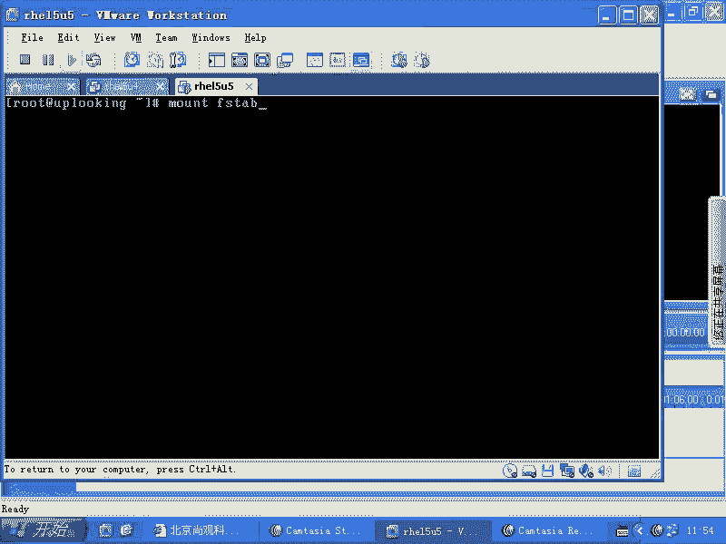

# 尚观Linux视频教程RHCE 精品课程 - P56：RH133-ULE115-8-5-fstab - 爱笑的程序狗 - BV1ax411o7VD

OK我们再看，那么当你系统。想去自动去加载某一个分区的时候，自动加载分区的时候，我们看到刚才的话呢，我们打开了一个程序是吧？呃，打开了一个文件。

这个文件叫做Fuser呃哎FS tableFS table的话呢是把一个分区加载到另外一个地方，看到了吗嗯。😊，一个label。一个这样的分区加载到这个地方，加载到这个地方以后。

用的文件系统类型是什么呢？ES3。123文件系统类型加载的是默认的参数啊，参数的话呢是mount命令的话呢，可能是呃就是大家可能一般不会太多注意的。比方说什么呢？mount是吧。

杠O这边是加载参数参数的话呢，你如果要是没有杠O的时候，它就是以默认的方式。比方说我们DV下的SDAE是吧，mountMNT目录下，这个时候你是没有输入什么，任何参数是吧？这个参数的话呢。

它是自动就是已经有一个集合，比方说读写是吧？还有什么呢？还有就是说呃。比方说no SUID也就是这个这个东西加载上来以后，如果里面有SUID的文件怎么样，它不管它不把它当做SUID还有no DEV啊。

所以说你可以看man啊manmount。大家一般的话呢建这个东西建的比较少啊，就是说一般很少去查这里面的这个选项的话呢，实际上你要如果找defa的话。😊，defa啊 default默认情况是什么呢？

RW啊有SUID啊，然后呢有DV我刚才说错了，就是说它是有SUID有DV文件，有设备文件，有SUID文件，只不过是普通用户就是说在使用的时候就是说呃会有一些问题啊。

那么像有RW有SUID还有DV文件可以执行。也也就是里面有可有执行文件的时候，它也可以执行。那么你当然可以去加上一个什么noEIDCno SUIDnoDV所以mount命令才必须是什么管理员才可以用。

普通用户可不可以呢？不可以，里面有个SUID的文件是吧？嗯我自己的笔记本是我我完全控制的。我在那里面创建了一个设备文件，是SDA。然后我改成权限是什么？777或者666的权限是吧？

然后我又创建了一个什么呢？VI这样的一个可执行的文件。这可执行文件我给他加了1个SUID的。权限。是吧我把这个U盘拿过来以后，插在我的服务器上。我本来在服务器上是什么身份呢，是一个普通用户身份是吧？嗯。

然后呢，我插上去以后，我一加载上来啊，结果里面的话呢SUID也可以用DV文件也可以用。那你的这个系统安全性到底在哪？所以的话mount命令啊默认情况是怎么样的，只允许如此账号使。普通账号不能使明白了吧。

这才有安全性在理。好。当然大家可以去自己去查一下，也就是说defas defaultfas包含这几个选项。大家可以看一下，接下来这个位置的话呢，是d普命令，它已经被废弃了。如果要是当普命令。

在全全盘备份的时候，这个分区每隔多少天备份一次啊，每天备份一次就是一明白吧？但是现在我们用当普命令经常用吗？不用不用的话，那就呃就就就没什么太大用。所以最后这个地方的话呢，这个数字可能还是有用的。

这个数字是什么呢？在正常启动的时候，它检测这个分区吗？如果检测第几号第几个检测，如果一的话就是第一个检测，二的话，就是第二个检测。零的话就是不检测。明白吧。原来有些很多ununix系统。

比方说惠普UX系统，它的话呢有那个惠普UX系统的那个工程师的认证啊。我记得他们说考试的时候，就是说我这个后数字后面加上一个空格，这个文件就没用了，这个文件就出错啊，他就检测这个问题。

你不把这个鼠标移到后面，你还真不知道后面有个空格。很奇怪的是吧？但是linux的话这方面还好啊这方面还好，像我们的这个这个文件是必须大家必须得要清楚的，是不是这个文件是由谁来谁来调用的？我们原来说过的。

是由ETC下的RC点D当中的RC点CC是吧？这个里面有个命令叫什么呢？mount杠A命令就调动这个文件了。清楚了吧？嗯，OK这是FI，这是我们自动启动的时候加载我们想要加载的一个文件系统。

不用每次启动的时候都输入mount命令，对不对？那现在。只有这样一种加载机制吗？显然不是。这种加载机制的话呢，是系统给你安排好。它受到的局限是很大的。如果你不重新启动，是不是它就不能加载。是不是？

如果不重新启动的话，它就不能加载，重新启动以后才会生效。这里面的话呢加载的是系统必须要用的一些东西啊。大家看。PROC大家熟悉吧。ss给大家讲过吧。ss目录是不是都在这里面。

另外的话呢还有DEV呃DVPTS还记得我们如果要是从远程登录以后，用到的虚拟控制台是什么？地V下的PTS杠。1-2-3。如果要在重新界面下打开一个控制台。

它也用到的是PTS是不是他做这个用的给你动态的创建里面的设备文件。也就是说你有一个控制台出来，它就给你创建一个一是吧？第二控制台出来创建一个2，是不是？这就是动态控制台。

它那个虚拟控制台的那个自动创建那个设备文件的这样的一个呃文件系统。还有什么呢？看到tF了吗？tempF的话呢，你什么时候访问DEV下达SHM这个目录的时候，实际上就是在访问内存当中的一片区域。

你把文件往里面一copy，就相当于copy到了哪呢？内存磁盘上去，就说内存当中一片区域，它叫做tempF。这个参盘F的话呢，一般我们如果要是想去调整它的参数的时候，可以这样调整。我想让它最大的大小啊。

比方说。Size。等于什么呢？等于。200。呃，我忘了这个单位什么，是不是可以加K是吧？到时候可以查蛮配置啊。我看。好。你看这边是可以用多少K多少兆多少G是吧是？然后呢来去定义。

也就是说我们这边size等于多少，就是说它最大的话呢，允许这个东西有多大啊，最大的话呢可以允许这个占用内存占用多大啊，你说哎这个东西好，我把我所有的数据全都拷背了过去，是不是？这东西好，然后呢。

结果你内存的话呢被占用了。然后呢，你其他的地方使用内存的时候没有，它就会产生此wi，对吧？所以一般我们是把临时性的，就是我重启以后不要也没有关系，啊，丢掉以后也没有关系，临时性的频繁去调用的。

你刚说有一个文件的话，我就。就死命的在那个硬盘上读读读读读是吧？嗯，一秒钟的话读个几千次几万次，你那个硬盘那个点就坏了。明白吧？嗯你有个小文件，你就在那边读，你在写程序的时候没有注意啊。

一秒钟读了几千次几万次是吧？这个时候的话，你会发现那片区域很很容易就坏，很快就坏。硬盘没有那么多字读取，就是没有不可能可靠到那种程度。所以的话呢我们如果要是在把它啊把这个文件放在内存当中，那就没有问题。

所以一般情况呃，我刚才说的话呢，是在驱动程序里面那种那么那种写。不是说我们真的去写一个文件，几千字几万字，这样的话就可以把它读坏。因为你的文件被打开第一次的时候，是不是被调用到内存当中去啊。

然后你在多次读取的时候，它实际上是改内存当中的东西，对不对？所以实际上的话呢，如果你写驱动的时候，那你写的你能控制说我就是写硬盘上那个点是不是你这样写的时候，那个那个点的话就坏了啊。

就是他们写驱动人说的写写那个文件系统人说的，明白吗？但是你把它放到内存当中以后的话就没有问题啊？内存当中就没有问题。所以这边的话呢就是我们的一个呃就是我们的一个FS table的问题，就是这个time。

他在这个FStable里面这一项到底干嘛用？把临时性的。频繁读写的要求速度极快的东西，少量的东西放在这里面去是吧？只要把它co到DV目录下SDV的SHM目录下，就相当于copy到内存当中。

一重启就没有了。当然了，加载swipe是不是最后一行加载。😊，是不是这就是FStable的作用啊，FS table你在后面的话可以加上一个什么呢？加上一个属性啊，加上属性，不要用它默认的这个属性。

那么我加一个额外的这个选项就可以加逗号，加到后面，明白了吧？😊，啊，好，这个的话就是我们的mount和什么呢？mount和FS呃就是FFSTAB就是这个自动每次系统启动时候加载的东西。

每次系统启动时候加载的东西。

