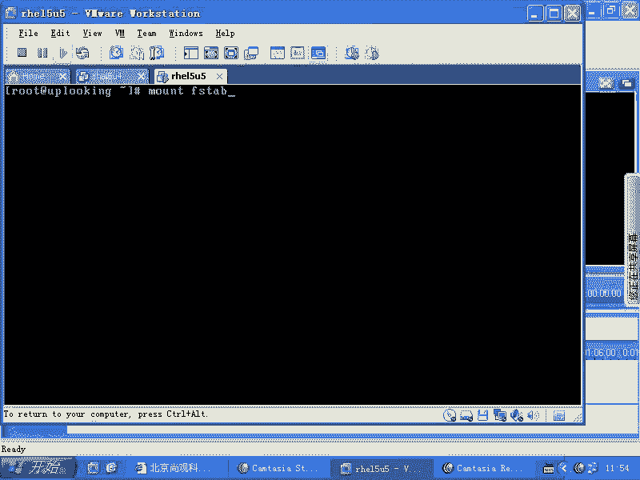

# Linux系统管理：P56：理解与配置 /etc/fstab 文件


在本节课中，我们将学习 Linux 系统中一个至关重要的配置文件 `/etc/fstab`。这个文件决定了系统启动时自动挂载哪些文件系统，以及如何挂载它们。我们将详细解析其结构、每个字段的含义，并了解其背后的安全机制。

## 系统自动挂载机制

上一节我们介绍了手动使用 `mount` 命令挂载分区。本节中我们来看看如何让系统在启动时自动完成这项工作。

系统在启动过程中，会通过 `/etc/rc.d/rc.sysinit` 等初始化脚本调用 `mount -a` 命令。这条命令会读取 `/etc/fstab` 文件，并按照其中的配置自动挂载所有列出的文件系统。这样，我们就不需要在每次重启后都手动输入 `mount` 命令了。

## 深入解析 /etc/fstab 文件

`/etc/fstab` 文件定义了将一个分区挂载到系统某个目录的规则。它的每一行代表一个挂载项，由多个字段组成，字段之间用空格或制表符分隔。

以下是 `/etc/fstab` 文件中一个典型条目的各个字段及其含义：

*   **文件系统或设备**：指定要挂载的设备（如 `/dev/sda1`）或卷标（Label）。
*   **挂载点**：指定文件系统被挂载到的目录路径。
*   **文件系统类型**：指定分区的文件系统格式，例如 `ext3`, `ext4`, `xfs`, `swap` 等。
*   **挂载选项**：定义挂载时的行为参数，这是一个用逗号分隔的选项列表。
*   **dump 备份标记**：此字段已被废弃，通常设置为 `0`。它原本用于 `dump` 命令决定是否备份该分区。
*   **文件系统检查顺序**：定义系统启动时 `fsck` 检查文件系统的顺序。`0` 表示不检查，`1` 表示根分区优先检查，`2` 或其他数字表示后续检查。

## 挂载选项与系统安全

在上一部分我们看到了挂载选项字段，现在我们来深入探讨其默认值及其对系统安全的影响。

当我们使用 `mount /dev/sda1 /mnt` 这样的简单命令时，虽然没有指定参数，但系统会使用一组默认的挂载选项。这些默认选项包括：
*   `rw`：以读写模式挂载。
*   `suid`：允许执行具有 SUID 权限位的文件。
*   `dev`：允许识别分区内的设备文件。
*   `exec`：允许执行分区内的二进制文件。

这些默认设置带来了潜在的安全风险。考虑一个场景：一个普通用户将自己的U盘（包含一个设置了 SUID 的 `vi` 程序和一个权限为 `777` 的 `/dev/sda` 设备文件）插入服务器。如果系统以默认选项挂载该U盘，该用户就可能利用这些文件提升权限或破坏系统。

因此，`mount` 命令默认只允许 **root** 管理员使用，普通用户无法执行，这是 Linux 系统安全的重要基石。管理员可以根据需要，在 `/etc/fstab` 中显式覆盖默认选项，例如使用 `noexec, nosuid, nodev` 来增强安全性。

## 特殊的文件系统挂载

除了挂载硬盘分区，`/etc/fstab` 还负责挂载一些内核提供的特殊文件系统，它们对系统运行至关重要。

系统在启动时，通过 `/etc/fstab` 自动挂载了几个关键的特殊文件系统：
*   `proc`：虚拟文件系统，提供进程和内核信息的接口。
*   `sysfs` (`sys`)：虚拟文件系统，提供内核设备、驱动和模块信息的统一视图。
*   `devpts`：用于支持伪终端（如 SSH 登录后的 `/dev/pts/1`），系统会动态创建其中的设备文件。
*   `tmpfs`：一种将文件存储在内存（或交换分区）的临时文件系统。常用于 `/dev/shm` 目录。

这里重点介绍 `tmpfs`。我们可以通过挂载选项来调整其行为，例如限制其最大使用内存：
```
size=200M
```
将文件复制到 `tmpfs` 挂载的目录（如 `/dev/shm`），就等于将文件放入了高速的内存中。这非常适合存放需要**频繁、快速读写**的临时数据。因为数据存储在内存中，系统重启后就会消失。这也能避免对硬盘固定位置的过度读写，延长硬盘寿命。

## 配置实践与总结

在本节课中，我们一起学习了 `/etc/fstab` 文件的原理与配置。

`/etc/fstab` 是系统启动时自动挂载文件系统的核心配置文件。通过它，我们可以确保必要的分区和特殊文件系统在每次启动时都能就位。你可以根据需要，在文件系统类型后的字段中添加自定义的挂载选项，格式是用逗号分隔的列表，例如 `defaults,noatime,nodiratime`。



文件的最后，通常还会配置 **swap** 交换分区。理解并正确配置 `/etc/fstab`，是进行 Linux 系统存储管理和安全加固的基础技能。