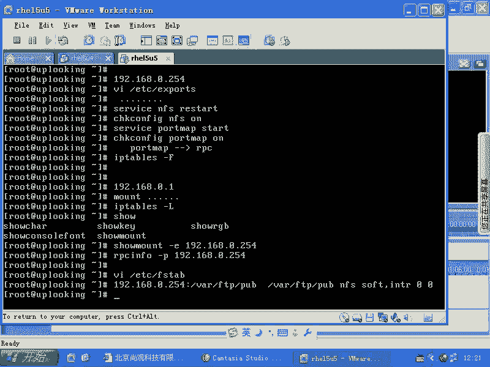

# 尚观Linux视频教程RHCE 精品课程 - P57：RH133-ULE115-8-6-swap-swapon - 爱笑的程序狗 - BV1ax411o7VD

OK我们再来看。😊，我们再来看，就是当我们现在系统的话呢呃去加载一个swipe空间的时候，我们一般都是在安装的时候就给它创建一个swipe的分区是吧？然后把它均展起来。

那么我们swipe想看一下到底现在用到的哪个swipe空间，是不是我们可以用swipe。

on是不是swipe on杠S，是不是看一下现在用了哪些swipe空间。😊，可不可以啊？看到了以后，我们现在的swipe空间列表的话呢，列出来。现在我们想。再去添加swipe。

或者说我现在不想要这个swipe。也就是说我们对swipe空间的一个操作。我们知道操作什么呢？EX3EXT呃EX3的分区是吧，我们怎么样加载自动加载，是不是现在我想对swi进行动呃动手了。

就是我现在的话想把那个分区删掉。我想加一个swipe的文件出来，怎么办呢？我们来看一下。啊，DD啊，我现在从什么地方来呢？从地方，比方说D一下的zero来，是吧是？是吧苏州从定向到什么呢？呃，TMP啊。

比方说OPT目录下的swipe。fi是不是s file一这个文件BS等于1兆，是不是COUNT我想创建一个什么呢？呃200兆的。200兆的这样一个文件等于这样做好了以后，我们再看下这个文件。

做好1个200兆的文件。然后呢，我们看一下。就是我这边200也好，一兆也好，它是一兆就是就是11K是1024是吧？一兆是1024乘1024，是不是？所以它这个空间的话就不是200兆整好，对吧？

然后我们现在看我们可以的话呢创建好以后，我们想去把它格式化是吧？一般我们创建了一个新的空间以后，我们是不是要把它格式化。但是swipe的话呢，它不需要特别规范的这种格式化。因为我们知道文件系统的话。

它是分成block block block block，也就一个块，一个块，一个块，是不是？但是我们虚拟内存或者我们的内存，它是怎么样的？它不是一个块，一个块，它是什么一个页一个页一个页，明白吧？

它是分页的，那么也就是说它的基本的格式已经定好了，我们还需要给swipe再去加那么多block的格式吗？😊，我们是不需要的，不需要给它变成so就是那个block block。

它直接就是把内存当中的液直接什么移到这个swipe空间当中来，明白吧？它是自己管理的，有点像arle那样，清楚吗？所以它我们在这边想去格式化的时候，实际上是在swipe这个前面啊。

打个标记表示这个空间啊，你假如说你这个空间是一个根温区，结果你无意当中把它作为swipe空间了，是不是swipe会破坏掉原本的数据啊？所以makewi的话就是确认一下说你这个空间就是做swipe。

比如它实际上就在前面的话，加上一个什么打上一个标记而已。清楚了吧？我叫makewipe，然后呢是。OPT下面的什么呢？swipe一是不是？然后呢，这样一回车，你会发觉它非常快，它就直接的话呢看一下大小。

然后把这些信息放在什么呢？这个swipe空间的头非常简单啊，你可以看这个文件大部分都是空，只有前面的话有几个字符，就是说swipe的什么什么版本啊，就这么简单，makespe非常快，它不是格式化。

它实际上就在前面打个标记，打完标记了以后的话，你就可以用了swipe arm，然后呢，加上一个什么呢？加上OPT下的swipe。😊，fill一那么swipe on了以后，然后呢，再去看swipe2杠S。

你就会发觉你刚才打的这个文件啊，就是做好的这个虚拟内存的文件，它已经变成了什么？已经变成了一个swipe空间当中的一元。清楚了吗？简单不简单？啊，就OK了。那么当然了，要想把它关闭掉的话，该怎么办？

s off是吧？那么如果你想让每次系统启动时候，都把它自动加载，该怎么办呢？VIETC下的FSTAB是吧？然后呢，在这里面去添加什么呢？OPT项目的spe。fi是不是一加格到哪儿呢呃。

下子到swipe啊，用swipe文件系统，是不是？这是spe，然后呢，接着是一个什么呃DEFAULT是不是？然后呢，是00。也就是说那个swipe目前的这个swipe分区是怎么写，你就怎么写。

啊，我们看一眼目前的这个室外空气怎么写。他就这样写的，是不是你fo。你就把这个地方改成什么呢？OPT下的swi呃fi一是吧就好了。啊，这边加个S啊，defa啊，就这么简单。搞定了吧。搞定了。

那么现在的话呢，swipe它实际上还有一些其他的命令。就比方说我们现在的话呢，想给我们的EXT三分区加上一个卷标的话，是用什么命令啊？ewo label是不是？那么你想给一个swipe加上一个卷标。

就是给给smar空间加上一个名字，再怎么加？你们觉得呢？我原来不知道，后来我推测了一下。既然是什么创建这个swi文件是吧？那么是make swipe，是不是它可以帮我们把这个就是说这个分区。

就是这个swipe空间相当于打个标记是吧？他这样应该也可以给我加个卷标吧。猜一下是不是这样。有没有啊？

对不对？啊，所以的话呢你可以用什么呢？make。

swipe啊杠大写的L来给它加上一个什么level是吧？卷标。因为你看到这个地方，你看到这个地方，就是我们的个swipe分区，是不是它就加了卷标了？当然这个卷标的话不是EA3的卷标，是不是？

所以不能用e two label是吧？要用make swap杠L来加。听楚了吗？就是swi空间，当然你可以添加更多的swi空间，都可以让他什么加载上去。啊，都可以让他加载上去。

Yeah。