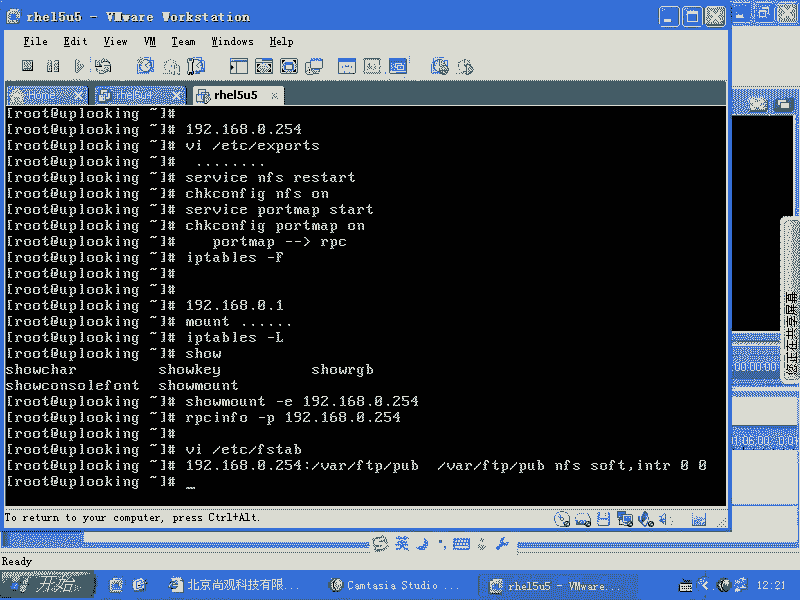
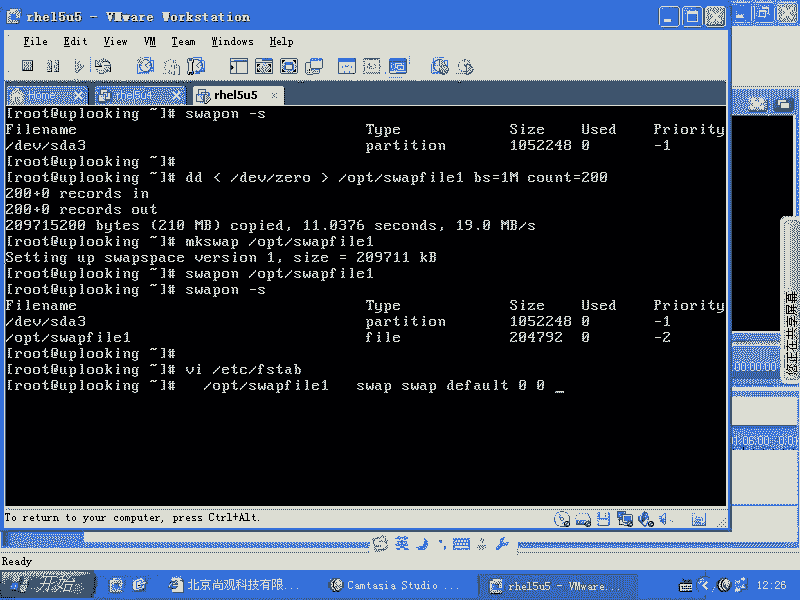
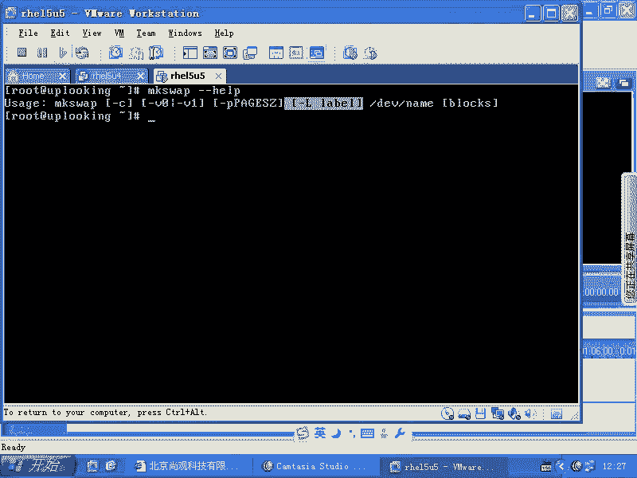
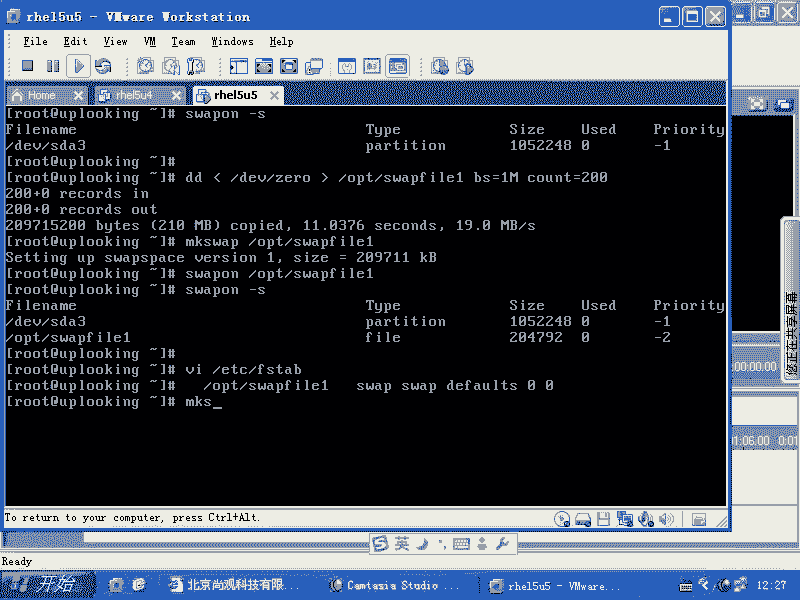
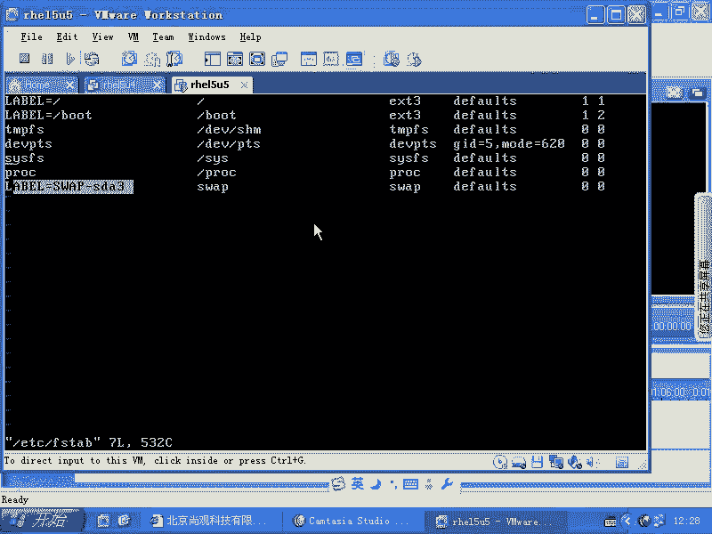

# Linux系统管理：RH133-ULE115-8-6：Swap空间管理 🖥️💾


在本节课中，我们将要学习Linux系统中Swap（交换）空间的管理。Swap空间是当物理内存不足时，系统用来临时存放内存数据的一块硬盘区域。我们将学习如何查看、创建、激活、关闭Swap空间，以及如何设置开机自动挂载。



## 查看现有Swap空间

上一节我们介绍了Swap空间的基本概念，本节中我们来看看如何查看系统当前正在使用的Swap空间。

要查看系统当前激活的Swap空间，可以使用 `swapon -s` 命令。

```bash
swapon -s
```

执行该命令后，系统会列出所有已激活的Swap分区或文件的详细信息。

## 创建Swap文件

有时，我们可能需要在系统安装后额外添加Swap空间，而不是使用分区。这时，我们可以创建一个Swap文件。

以下是创建Swap文件的步骤：

1.  **创建指定大小的空文件**：使用 `dd` 命令创建一个空文件作为Swap空间。例如，创建一个名为 `swapfile1` 的200MB文件。
    ```bash
    dd if=/dev/zero of=/opt/swapfile1 bs=1M count=200
    ```
    *   `if=/dev/zero`：输入源，一个能提供无限零字节的设备文件。
    *   `of=/opt/swapfile1`：输出文件路径和名称。
    *   `bs=1M`：每次读写的块大小为1兆字节。
    *   `count=200`：复制200个块，因此总大小为200MB。

2.  **设置Swap标识**：与EXT3/EXT4等文件系统不同，Swap空间不需要复杂的格式化。它采用分页管理，而非块管理。`mkswap` 命令的作用是在文件头部写入一个特殊标记，告知系统此空间专用于Swap。
    ```bash
    mkswap /opt/swapfile1
    ```
    这个操作非常快，因为它只是写入少量元数据。

## 激活与使用Swap文件

创建并标记好Swap文件后，我们需要激活它才能使用。

使用 `swapon` 命令激活我们创建的Swap文件。
```bash
swapon /opt/swapfile1
```
激活后，再次运行 `swapon -s` 命令，就可以看到新添加的Swap文件已经出现在列表中了。

## 关闭Swap空间

如果你需要临时关闭某个Swap空间（例如文件或分区），可以使用 `swapoff` 命令。
```bash
swapoff /opt/swapfile1
```

## 设置开机自动挂载

为了让系统在每次启动时都能自动加载我们创建的Swap文件，需要将其信息写入 `/etc/fstab` 配置文件。



1.  使用文本编辑器（如 `vi`）打开 `/etc/fstab` 文件。
    ```bash
    vi /etc/fstab
    ```

2.  在文件末尾添加一行配置。可以参考现有Swap分区的格式。通常格式如下：
    ```
    /opt/swapfile1 swap swap defaults 0 0
    ```
    *   第一列：设备名或文件路径 (`/opt/swapfile1`)。
    *   第二列：挂载点，对于Swap固定为 `swap`。
    *   第三列：文件系统类型，固定为 `swap`。
    *   第四列：挂载选项，通常为 `defaults`。
    *   第五、六列：dump备份和fsck检查标志，对于Swap通常设为 `0`。

保存并退出文件后，下次系统启动时就会自动加载这个Swap文件。

## 为Swap空间添加卷标



与EXT文件系统使用 `e2label` 添加卷标类似，Swap空间也有自己的卷标设置命令。



你可以使用 `mkswap -L` 命令为Swap空间设置一个易于识别的卷标。
```bash
mkswap -L MySwap /opt/swapfile1
```
这样，在使用 `swapon -s` 或查看 `/etc/fstab` 时，就能通过卷标来识别不同的Swap空间。

---



本节课中我们一起学习了Linux Swap空间的全套管理操作。我们掌握了如何**查看** (`swapon -s`)、**创建文件** (`dd`)、**格式化标记** (`mkswap`)、**激活/关闭** (`swapon`/`swapoff`)、**配置开机自启** (编辑 `/etc/fstab`) 以及**设置卷标** (`mkswap -L`)。这些技能使你能够灵活地根据系统需求管理和扩展虚拟内存。