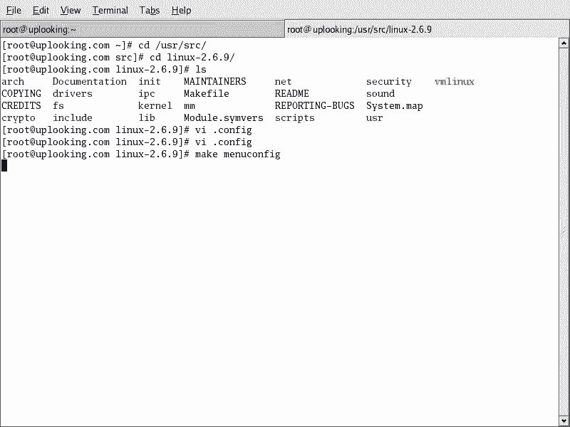
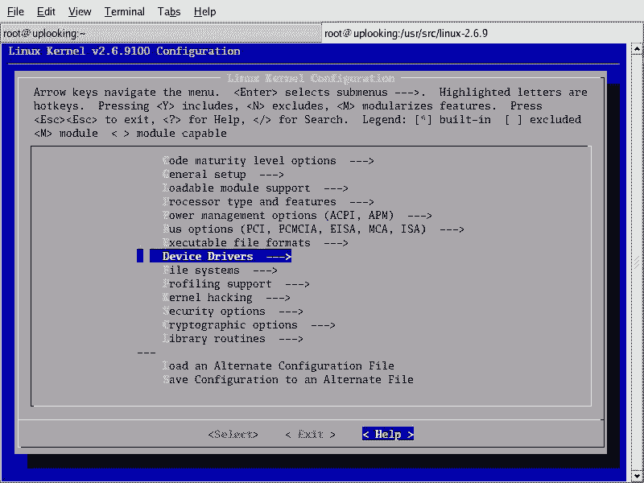
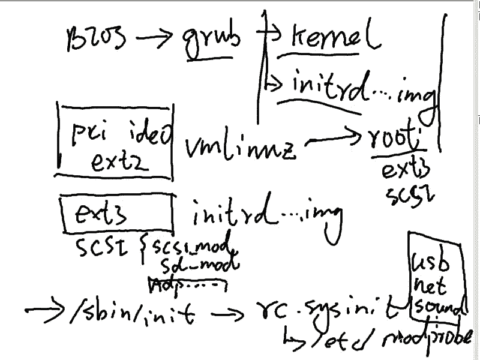
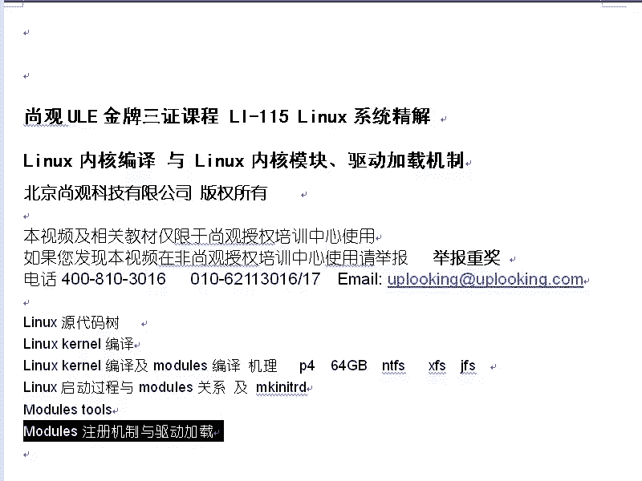
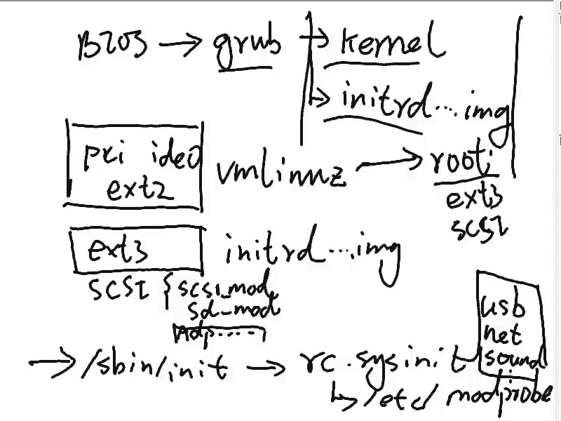
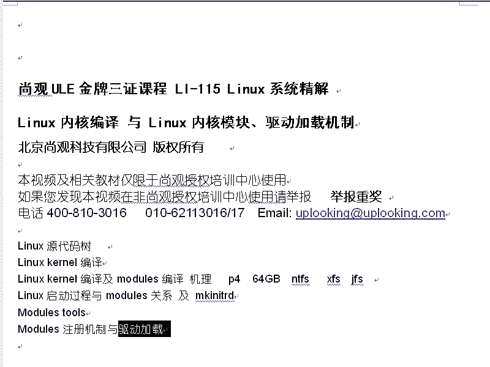
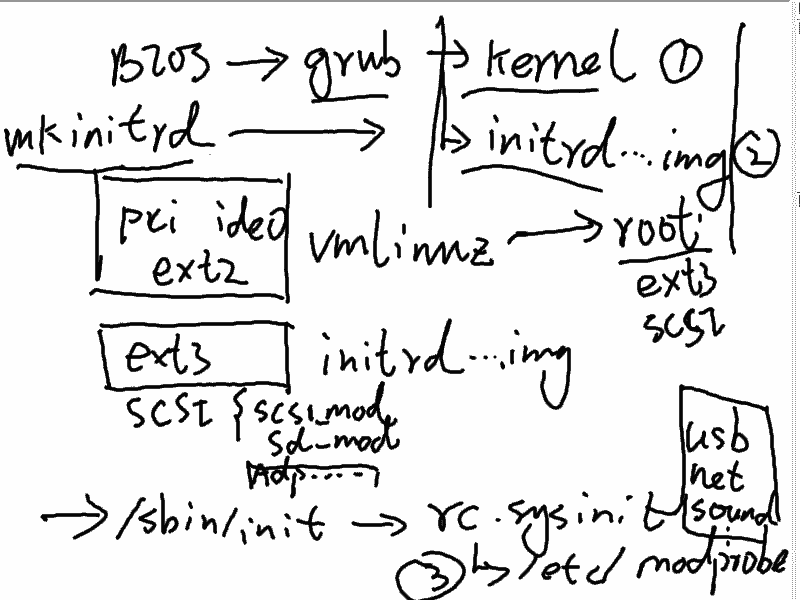
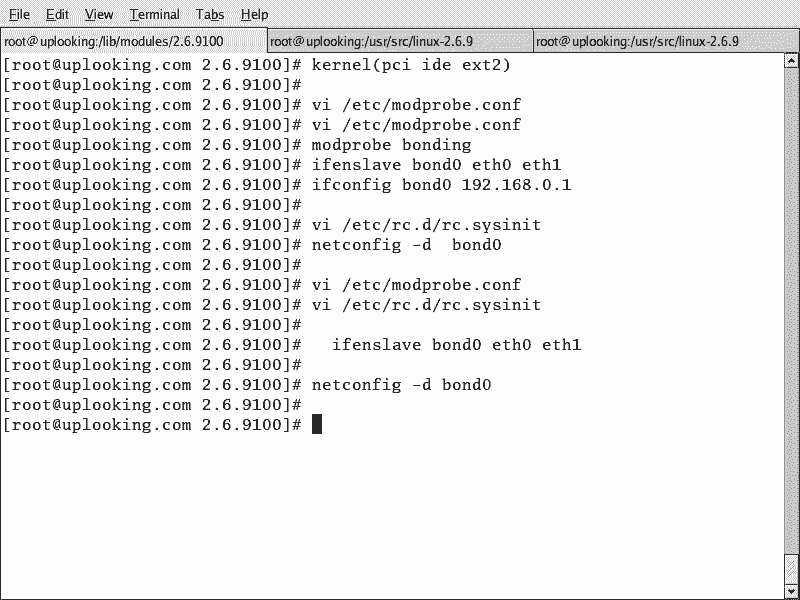

# Linux内核模块与驱动管理：P59：RH133-ULE115-9-modules


## 概述
在本节课中，我们将要学习Linux下的驱动程序与内核模块。我们将了解Linux驱动程序与Windows的区别，特别是显卡驱动的特殊性。课程的核心是掌握内核模块的管理工具链，包括模块的加载、卸载、查看以及配置文件的原理。我们将通过简单的命令和实例，让初学者理解模块的依存关系、自动加载机制以及如何将驱动集成到系统启动流程中。

## Linux驱动程序概述
上一节我们介绍了内核编译，本节中我们来看看驱动程序的具体形式。Linux下的驱动程序大部分以内核模块的形式存在。这与Windows系统不同，例如，Windows的显卡驱动是内核的一部分，而Linux的显卡驱动是X Window系统这个应用程序自带的驱动。因此，Linux内核模块主要包含USB驱动、声卡驱动、SCSI设备驱动、网卡驱动、文件系统驱动等，而显卡驱动则独立于内核。

## 内核模块管理工具
要管理内核模块，我们需要使用一套专门的工具集。这些工具由 `module-init-tools` 软件包提供。

以下是查看模块管理工具包的命令：
```bash
rpm -qa | grep module-init-tools
```

### 列出已加载的模块
首先，我们学习如何查看当前系统中已经加载了哪些内核模块。使用 `lsmod` 命令可以列出所有已加载的模块及其信息。

`lsmod` 命令的输出格式为：
```
模块名 模块大小 被引用次数 引用此模块的模块名
```
例如，`ext3` 模块大小为7168字节，被一个名为 `nfsd` 的模块所使用。

### 手动加载与卸载模块
接下来，我们学习如何手动加载和卸载模块。这需要使用 `insmod` 和 `rmmod` 命令。





加载模块需要指定模块文件的完整路径：
```bash
insmod /lib/modules/`uname -r`/kernel/drivers/.../模块名.ko
```
卸载模块则只需模块名：
```bash
rmmod 模块名
```
**注意**：`insmod` 不会自动解决模块间的依存关系。如果模块A依赖于模块B，你必须先手动加载模块B。

### 自动解决依存关系
为了解决手动加载的麻烦，我们可以使用 `modprobe` 命令。它能根据配置文件自动解决模块间的依存关系。

加载模块：
```bash
modprobe 模块名
```
智能卸载模块（同时卸载其依赖模块）：
```bash
modprobe -r 模块名
```
`modprobe` 的智能来源于其配置文件 `/lib/modules/$(uname -r)/modules.dep`。该文件定义了所有模块的位置和依存关系。

### 查看模块信息
我们可以使用 `modinfo` 命令来查看某个内核模块的详细信息，例如许可证、作者、描述以及依赖关系。
```bash
modinfo 模块名
```

### 更新模块依赖信息
当你向模块目录中添加了新的驱动模块（例如，自己编译的模块），需要更新依赖关系数据库，以便 `modprobe` 能够识别它。这时需要使用 `depmod` 命令。
```bash
depmod
```
此命令会扫描 `/lib/modules/$(uname -r)/` 目录下的所有模块，并重新生成 `modules.dep` 等配置文件。

## 模块配置文件与即插即用
除了 `modules.dep` 文件，模块目录下还有一系列 `.map` 文件（如 `pci.map`, `usb.map`）。

这些文件是即插即用（Plug and Play）的关键。当插入一个新设备（如USB设备）时，系统会读取该设备的厂商ID和设备ID。然后，系统在对应的 `.map` 文件中查找与该ID匹配的驱动程序名称，再通过 `modules.dep` 找到驱动文件的具体位置并加载它。

## 系统启动时的模块加载
系统启动过程中，模块在三个阶段被加载：
1.  **内核镜像 (vmlinuz)**：包含最基本、核心的驱动（如PCI总线驱动）。
2.  **初始内存磁盘 (initrd)**：包含启动根文件系统所必需的驱动（如SCSI驱动、ext3文件系统驱动）。可以使用 `mkinitrd` 命令将新驱动加入此镜像。
3.  **系统初始化后**：通过 `/etc/modprobe.conf`（RHEL4及之后）或 `/etc/modules.conf`（RHEL3及之前）配置文件加载其他非启动必需的驱动，如网卡、声卡驱动。

`/etc/modprobe.conf` 配置文件格式示例：
```
alias eth0 pcnet32
alias usb-controller uhci-hcd
options snd-card-0 index=0
```
*   `alias`：为加载的模块定义一个别名，便于引用。
*   `options`：在加载模块时传递给模块的参数。

系统在运行 `/etc/rc.d/rc.sysinit` 初始化脚本时，会执行 `modprobe -c` 来读取此配置文件并加载其中定义的模块。

## 实战示例：双网卡绑定
上一节我们介绍了配置文件的格式，本节我们通过一个实际案例来加深理解。假设我们需要将两块网卡（eth0和eth1）绑定为一块逻辑网卡，以实现负载均衡或故障转移。









**操作步骤如下：**



1.  **编辑 `/etc/modprobe.conf` 文件**，添加绑定模块的配置：
    ```
    alias bond0 bonding
    options bond0 miimon=100 mode=0
    ```
    *   `miimon=100`：每100毫秒检查一次链路状态。
    *   `mode=0`：负载均衡模式（`mode=1` 为主动备份模式）。

2.  **加载绑定模块**：
    ```bash
    modprobe bonding
    ```

3.  **配置逻辑网卡**（可将此命令加入 `/etc/rc.d/rc.local` 以便开机自动执行）：
    ```bash
    ifenslave bond0 eth0 eth1
    ifconfig bond0 192.168.0.1 netmask 255.255.255.0 up
    ```
    此后，系统将使用 `bond0` 作为网络接口，`eth0` 和 `eth1` 作为其底层物理接口。

## 总结
本节课中我们一起学习了Linux内核模块的管理机制。我们了解了`lsmod`、`insmod`/`rmmod`、`modprobe`、`modinfo`、`depmod`等核心管理命令。关键点在于理解了`modprobe`通过`modules.dep`文件实现自动依赖加载，以及系统如何通过`/etc/modprobe.conf`配置文件和`.map`文件实现驱动的自动加载与即插即用。最后，我们通过双网卡绑定的实例，演示了如何配置和使用一个复杂的内核模块功能。



## 课后作业
1.  在网上查找一种声卡在Linux下的安装教程，并按照步骤实践。
2.  在网上查找一种显卡（非集成显卡）在Linux下的驱动安装教程，并按照步骤实践。
3.  将本节课中提到的所有模块管理命令及其功能整理成列表。