# 尚观Linux视频教程RHCE 精品课程 - P5：RH033-ULE112-02-3-RHEL5 Linux安装 - 爱笑的程序狗 - BV1ax411o7VD

小芳，我们现在呢继续来开始呢呃给大家讲一下HEL5的安装。那么HEL5它是reite的企业版的第五个版本是吧？嗯，实际上呢大家为就是HEL系列为人所知是2。12。1的话呢。

有很多公司在用然后呢后来3三的话，HEL3的话呢，给reite增加了很大很大的这种呃，就是它的大量的利润来源于HEL3。那么HEL4呢它是一个承上启下的版本。HEL5的话可以说做的更好了。

那么re的企业版的话呢，它跟斐德尔后面win two等等这些版本的区别在于什么呢？就是你你会知道呢斐德尔小芳你用过是吧？对win two也用过。嗯。

那么就是说小芳用的这个 two或者是说用的我们这个斐德尔感觉它的界面怎么样非常漂非常漂亮。那么斐德尔的话呢，它实际上也是re后面的背景也就跟他也是re公司。呃，实际上受reite公司所控制，对吧？

然后呢，有很多人的话往里面去添加代码，这些人的话大多数都是呃reite公司的。但是你说reite为什么要做一个斐德尔，又做一个HER呢？reite企业版呢，是因为斐德尔实际上是一个测试版。

它也面向桌面的，它可以强调它非常漂亮，强调它的软件的话，非常的新。但是呢它并不能呃给企业提供特别稳的稳定的平台。所以呢在斐德尔如果要是把这些软件测试好了以后，然后他再拿到什么HER当中来。

所以它HEL的话呢，它的速度要比粉速度的话要慢很多。明白吧？明白啊，那么就是说我们在学的时候呢，一般也是学HEL。为什么学HEL呢？因为在企业当中的话，生产系统上都是用更稳定的版本。

或者针对企业定制的这种版本。那么这种呢就是HEL系列。那么说HL5的话呢，它升级的时间的话呢非常的短呃，就非常的这个就是不频繁，它非常慢，你看到它已经HL5是吧？它已经靠靠靠8靠9可能都有了。

那么这时候的话我们知道那么像呃传统的这个HEL的话呢，它在意的是它的稳定性它升级的速度会就就会慢一些。那么HL5和HL4实质上的差别的话是比较大的。那我们看来的话呢是越变越好，确实越变越好。

但是呢复杂程度上来讲的话是越来越复杂。那最简单的什么HEL3啊，我觉得HEL3非常好用。但是HL4的话呢就已经有一些企业级应用的这样的一些东西，它比较难以让你去呃难以让你去那个。就是说把它全部都掌握了。

它有很多东西的话呢，实际上添加进来的话越来越多。然后比方说SEux啊等等。那么HL5的话呢更添加出来一些东西。同时让原来呢比较难用的一些高级的功能。比方说SE的话呢，让它更好用啊，同时的话呢我们看一下。

就说这HEL那么我们呃先看一下呢read安装这个方式啊，就是我们现在的话呢开用一张re安装光盘的话来引导啊，所现在这样的一个界面，我们上次已经跟大家说过了是吧？然后现在我们让它运行起来啊。

那么这时候呢用无面，然后呢把HER的光盘的话呢，放进去HER5的光盘放上去，大家可以看到呢就是一个呃完全不同的这样一个画面，这个地方的话是一个PE启动的画面啊，我让它取消掉。

然后呢直接进入下面让光盘来启动，我们看一下这个安装界面的话有什么不同。

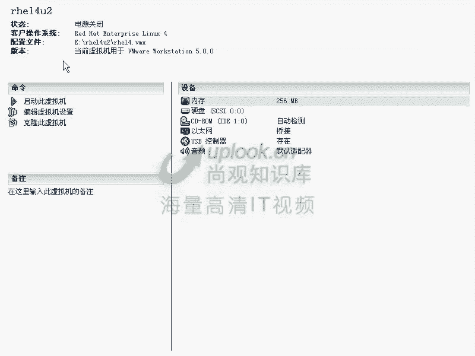

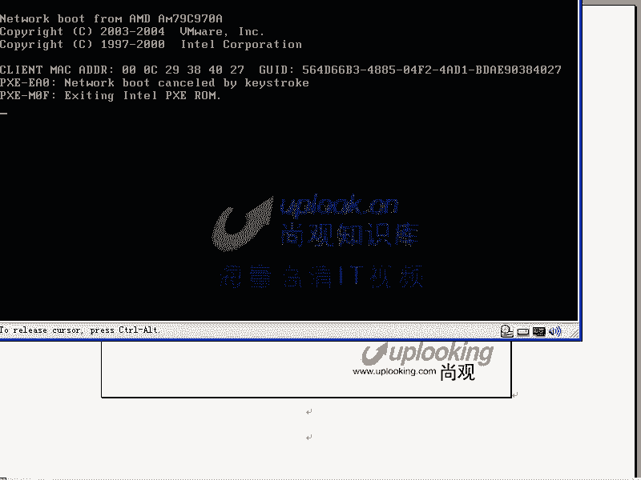

实质上呢跟HEL4的话呢，它的系统都是原来系统都是on编的一个叫做的这样一个程序。大家看在这样一个界面下啊，不管是HEL4还是HEL5都可以输入或者H3都可以输入ux啊这个我们在上节课的话呢。

就没有给大家讲上节课的话，我们说讲过了其他的什么linux rescue是吧？linuxask就是我我提供5种安装方式，那你默认情况就是用光网来安装。

那现在我想用其他的方式安装ask记不记得记啊那么用这个安装方式，那么linuxD是什么呢？linux的话是说假设说你在安装过程当中需要一个driver什么dver你知道一般我们在装的这个笔记本上或者PC上的都无所谓了。

直接装就好了。但是如果要是你装在一个服务器上服务器是不是一般情况下都有设备对是吧？那你想一下一个硬盘。

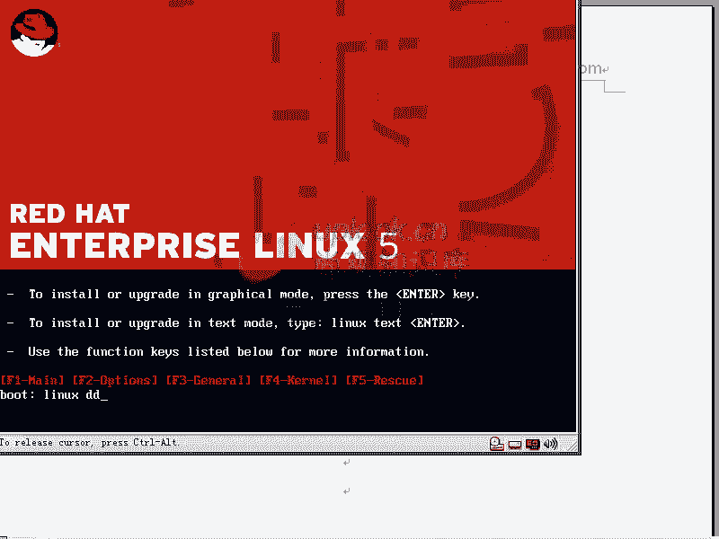

うん。一个硬盘是插在主板上的是吧？我们在PC里面，或者是说在我们的这个台式器里面，它是插在主板上的。嗯，但是呢如果要是我们的服务器的话，它的硬盘插在哪儿了？也是插好像也是插在计算机。对，当然不是的啊。

实际上那个硬盘的话实际上是插在什么呢？插在一个sacic卡上。😊，这个se咖C卡的话扩展出来的话呢呃就是插很多块硬盘。那么其中一块硬盘的话插在这个地方。就是这个硬盘的话，插在s卡扩展出来的插槽当中。

也就是它不是插在主板上。那么是不是这个卡本身是有个驱动的。对你要没这个驱动，是不是访问不到这个硬盘。对，那所以你这个时候安装的时候，你想它是不是要安装到硬盘上，对是不是它需要有这个驱动。

但是呢这个光盘有可能没有这个驱动，是不是？所以呢你们可以在的这个芯片组的厂商上啊去down的这些程序。比方说ad等等这些呃网站上，那么他们呢是专门查s芯片的，那么当录的这个驱动以后呢。

它有专门针对reite安装这个系统的这个dver。啊，就这种dverdi。那你说我要把这个东西可成当软做成一张软盘，那么把软盘当啥，有很多服务器，现在还有软盘呢，搞笑了。所以的话你说软盘很早不用了。

但是很多服务器都带，为什么呢？它可以插 driververdi，这就是linuxDD的原因，原由是吧？为什么要有这样的安装模式，你清楚吗？明白嗯，那那你说我这个我这个笔记本的话需不需要不需要。

为什么不需要？他直接插在主板上那个硬盘啊，那这是呃小芳的理解。如果要是装HEL3啊，你也需要dva，为什么呢？HEL3不带SATA的这种驱动。也就是你只要你的这个呃硬盘插到主板上也好，插哪也好。

那你的这个芯片这部分驱动没有的话，你就需要输入linuxCD了。明白吧？明白，所以的话呢H13很可能也需要输入雷uxCD，然后来先驱动这个主板上这个SATA的控制芯片，明白吧？

或者说那个南桥芯片组的一部分，因为它都是南桥当中集成的。然后么雷ux斯PS的话就kickstar安装kickstar安装的话是我们你看这名字特别好啊，kiick是T是吧？star就是。开始是吧？

那么这个东西就是说呃它是执行一次无人制手安装的话，是输入linuxKS。也就是你讲执行一次无人制手安装的，就这样。那么小芳的话呢跟我一块经常的话在机房里面的话，比方说我们的服务器呃一台是吧？

下面的台式机团有30多台，可以让他们同时安装，是不是？对，那为什么你说一个人的话，要一台一台安装的话，安装30份，累死了。所以我们可以找个KS文件是吧？对，那么如果要是你想启动KS文件的话。

那么就是linuxKS或者linux呃KS等于什么程度？就像我们这样的啊。

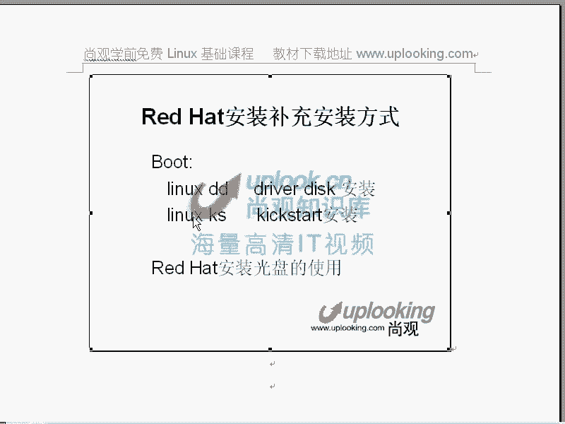

Nurallinux啊。KS等于比方说NFS方式共享的192168。0。比说254这台主机上的什么呢？的FTP下的POB当中的KS点CF这个文件，对吧？你可以这样，就是把这个文件的话。

放在一个一个公共的机器上，当这个机器的话，把它这个KS文件过出来，那你要知道安装过程的话，实质上是什么一个过程，就是我在上次讲H14安装的时候，我们说安装我们点的nexn next选一些选项哈。

最终实际上是没有安装的对吧？对，那么它是生成一个文件，对不对？嗯，生成这个文件以后，你在安装的时候呢，指定了就是安装的时候的话，你点最后一个确定的时候，它才会使用这个文件嘛，对对吧？

所以的话呢这个时候呢，你把那个文件的话放在一个别的地方，那这样的话，你就不用在那边一遍一遍去选，这就是kickstar的原理。清楚了吗？清楚了啊，那么谁去读这个文件，你知道吗？小芳。谁去读这个文件。

实际上就是安装程序本身呢？安装程序本身叫做什么呢？叫做是一种蛇的名字，特别怪啊，反正开源软件当中的话很多这种怪了吧唧的事儿，有的是用自己的媳妇的名字啊，有的是用自己喜欢的一个什么东西。

有的是专门找一个特别呃就是怪异的东西那么就是一种蛇的名字paonthon是种脚本语言python是蛇的名字PTHON啊，也是一种蛇的名字。那么underac是pathon写的一个安装脚本。

就等一下大家看到那个图新界面的话，就是这样OK那么我们给大家呢大致介绍一下BD和TS这两个选项啊，BD是什么小方复出一下那个安装区。安装驱动对就说在硬盘里面。对，不是，就是说你的硬盘是插在一个卡上是吧？

对对，结果的话你要装到这个s卡上先驱动那个呃就是这个存储所在的那个设备是吧？对啊，那O我那个小方清楚了，然后呢TS你说是什么？无人自助安装，就是支撑无人只有安装对吧，执行无人支安装这样的一个呃选项是吧？

对，开启不同的安装过程。OK那我明白呃好，那么现在的话呢我们这个安装光盘的话呢，可以这样的运行起来了，大家看到这个界面，就这个界面的话，那我们原来给大家说过，实质上这个界面的话，并没有开始安装程序。

这安装程序还没开始。

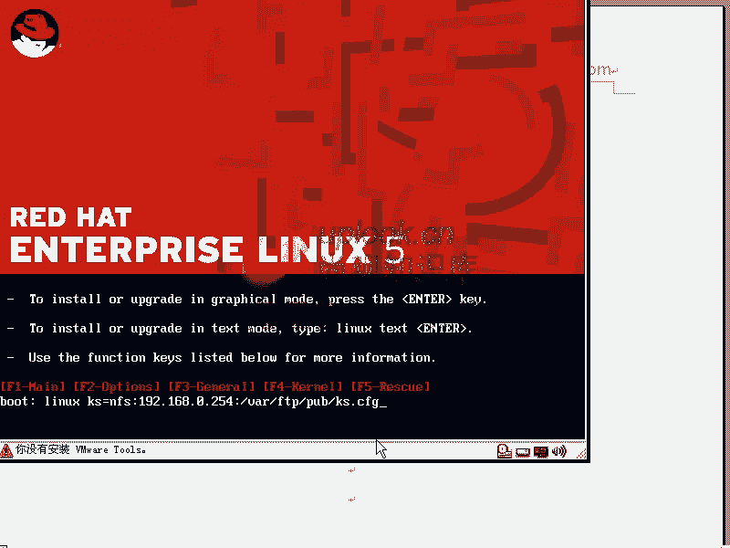

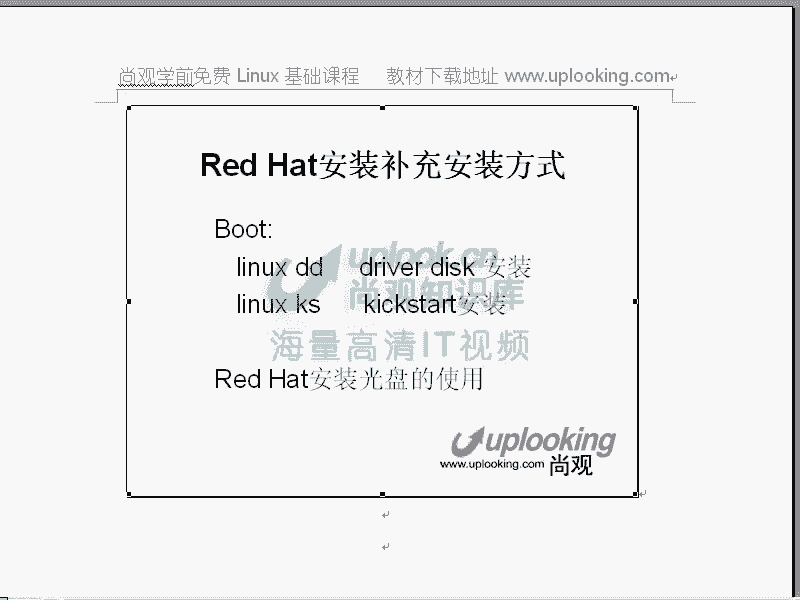

这个安装程序的话，在这个地方的话是只是一个but load，也就是carow等等，这些东西还没运行是吧？那OK我们看一下H715的这个安装啊，我们看一下H715的安装，我现在的话把这些东西呢全部删掉。

然后我直接回车，直接回车是开启一次什么安装。图形嘛就是图形的CD状对是吧？那么图就是说这样直接回车的话，那如果说linux text的话，那它就是一次文本安装是吧？那么现在大家看的话。

这边的话是才是在载入，这地方才是载入那个 kernelel，这边是 kernell的初始化啊，这边是 kernelnal的初始化画面。

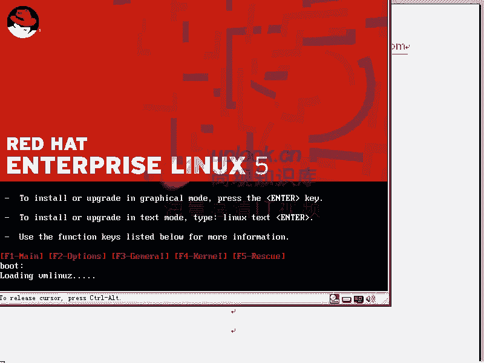

那么这个时候的话它开始呢l和IITRD呢加载起来。IITRD的话以后我们会讲 kernelel和IITRD加起来，然后加载起来了以后呢，开始一次初始化。初始化呢。

比方说我们的什么ID设备啊等等USB的设备啊等等。那么这个时候呢他开始运行的S啊，loader sloader这个程序的话呢，就是一个安装程序。

他呢负责把的那个脚本语言运行起来O在最开始的时候我们已经给大家说过，就是说。你现在这个光盘是从哪来的？如果不是给你是吧？你可能从网上的下来这个ISO镜像是吧？那这个时候的话这个镜像是不是比较危险？对。

是不是跟你说过，如果我在这个镜像里面放一个木马，然后呢，我在中国的网站上去供大家下载不你下载来装的话，我的木马就运行起来了因我软件为什么没有人去动那个呃windows中的话，有人动啊。

你看那个什么番茄花园的那种定制光盘等等，也有人动假如说那个光盘如果要是被别人定制完以后，你随便去装装完了以后的话，这个机器，它是不是很可能有木马。所以的话呢在安装的时候。

他问你说要不要进行一次media check就是说媒体的检测，看一下这是不是原本出场的时候明白了吗？明白那么我现在跳过去跳过去4当中也有大家看换汤不换是吧？现在的话就什这边运行。

就是我们刚才说那个呃图形化的安装脚本程序，记不记得？就是S编的那个com。那么这个东西呢运行起来。它是pyython编的一个脚本。那么这边的话它会启动一个X window啊。

启动X window了以后呢，就开始一次安装过程。呃，小芳，你这个这段时间的话，你对这个地方有没有一些疑问？没有这地方没有嗯，就是刚才那个过程的话比较顺畅是吧？嗯，那么but load你也知道。

然后carl和IITRD什么时候装载的，你也清楚，嗯，对吧？O现在话X window运行起来。

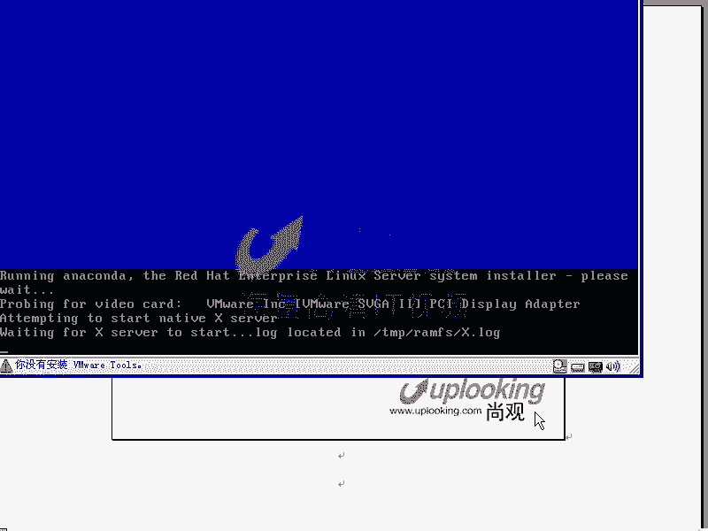

那X能运行起来。慢一点啊。

啊，这样的一个叉出现的时候，表示X window在运行。X windows分为服务器端和客户端。OK这边R715R715的话主要的基调就是那个这种颜色，然后next。这个时候呢先让你选择中英文。

那么在上纲的话呢，我们希望所有的同学啊，所有的同学在装的时候呢，你可以装中文的字体，但是千万不要把界面全部都做成中文。这样的话呢非常不利于你继续发展，这个我们原来跟大家说过是吧？对HL安装的时候。

我们说在这边重申一下，再点next这边next以后，然后呢呃你这时候呢选择的是一个美式英文的这样的一个键盘是吧？点击next。然后呢，这边的话他说你装你输入一个安装序列号，那这个安装序列号的话呢。

不同的安装序列号，它可以装不同的组件。因为呢在呃reite这个H715的光盘上的话呢，它集成了很多非HEL的这个组件，包括什么呢？存储，或者是说我们的集群等等这些套件，不同的K值。

那么它带它能带来你的这个包是不一样的。你比方说我输入12345可能就是给你装普通的软件是吧？我45678，那它可能就输入了可以装class的，就是集群的软件了，明白吧？明白，所以这个K值的话呢。

是最开始你像reite购买的时候呢，它给你提供的。当然你过后的话也可以自己去安装。你可以不用不用这个T值可以自己安装。但是呢那个时候的话你对reite的话，实际上这个盘啊，你用可以。

但是呢没有任何的服务。如果要是你上reite购买的话，那么reite可以给你一年免费升级啊，给你个K值啊，你要去学什么，你要。用什么东西呢都可以明白吗？明明白？啊。

OK那我现在的话就跳过了啊OK这边的话呢我这边跳过。他说呢呃你不能不一定的能访问全套的包啊，就是你很多包的话可能装不了。然后呢，你在这边的话可以用用评估。但是呢你如果要是正常去使用的话。

最好呢去购买reite license啊，那么接接下来效过啊，那么这个时候的话选择完。安装过程的语言是吧？刚才我是选择语言了，对，英文是吧？对，然后呢呃美式键盘，然后让我输入序列号。

然后我这边的话不输入是吧？对，然后呢，我这边评估一下，那我这时候呢去进行一次安装全新的retite系统。那大家会发现这下面还有个up upgradegrade是吧？为什么会出现这个呢。

因为它侦测到你硬盘上原来已经装过一个retite系统，他问你要不要升级它。对吧所以它有个升级画面，还有个安装画面。那我这边点击什么呢？安装画面，然后点击next。那么这时候的话，你看他说呢。

你现在要怎么着对你的分区，这边的话实际上是一个对你的分区的这样的一个设置啊，就是跟我们H14那个部分是一样的那我现在呢说删除掉所有的呃分区啊，删除掉所有的分区，然后呢我再来添加。啊。啊，错了啊。

这边是添加一个存储的这个选项。然后呢，我这边呃自己来自己来进行定制是吧？然后next。那么这时候呢。你刚才如果要是点击删除掉所有的分区，或者删除到所有的linux的分区的话。

那它就会删除掉这个分区以后呢，自动的去帮你去做这个分区，就自动帮你做分区。原来我们在讲2714的时候跟大家讲过，他会做几个分区啊。他会做一个PV就是物理卷，就是LVM，你知道吧？嗯就是逻辑卷管理。

它会做1个PV。然后在这个PV上的话画3个LV逻辑卷，3个LV一个是什么呢？swipe另外一个是什么呢？另外一个是一个是swipe空间就是交换空间嘛，另外是bo分区，另外一个是根分区就是三个。

它先做一个物理卷，然后呢，做三个分区，那么在这个我们自己定制的话，那很好说了，我现在点击这个地方点击什么呢？删除掉所有的是吧？那么整个的话这个空间就全部都出来了，然后呢，点击个你一般来说啊。

一般来说你需要三个分区，你比方说一第三的话，我先做一个什么呢？bo分区是吧？对为什么要做bo分区呢？因为我们要保证bo分区bo分区里面的话是跟启动过程相关的。就是最开始启动最原始的启动相关的。

这个所谓的最原始启动是什么呢？os它会去找你的硬盘上的某些文件是吧？如果要是你把。这个硬盘，你的硬盘，比方说买那个500G的硬盘，有卖的对，有卖的吧？有，然后结果我把你启动的文件放到第499G。

你说那个bios他能找到这个硬盘这块吗？是不是浏览一遍的话特别费劲啊？对，所以的话呢我们说如果要这个but分区的话，呢，就是把硬盘启动，就是整个系统启动的时候，最初的那部分。

比方说carl和ITRD放在这里面，然后呢，在这边的话再去点一个newnew的话呢，再去做一个什么？swipe记不记得swipeswipe交换的是吧？就跟windows里面的那个内存文件一样，对是吧？

对，那么这个时候的话你可以做一个多大的，我们说个原则。多此外部的话是一般是设置多大，内存的一倍或或者两倍是吧？哎设的非常好啊。比方说我现在设置1个512啊，设置特别大，也没有意思，就是说它的性能不会升。

反而会降，设置特别大。那在这个里面的话，再这点右，我要做一个什么呢？根，那么这个根的话呢，我可以给它多少，比方说剩下的全部都给根是吧？比方说我这边是最大的允许的大小，对吧？我刚才填的这个地方。

然后O那么这样的话呢，这三个分区的话就做出来了。但是说现在它有没有格式化量，没有没有格式化非常好。那么这边一个是SDA1SDA2和SDA3，如果你再创建第四个分区的时候呢，它很可能给你创建一个扩展分区。

你比方说我这边的话先把它调小一点，那，他说是最大这么大，那我这边的话一个固定大小多少呢？比方说呃。比方说是3G吧啊。OK那么这样的话呢，不是还有剩余空间吗？我在这里面再点击newnew的时候呢。

我这边比方说自己做一个名叫什么呢？data啊，数据这样的一个分区。那么这时候呢，你看到它自动我明明创建了第四个分区是吧？对，结果呢它直接变成一个什么？SDA5看到了吗？嗯。那么我为什么创建四个分区。

它给我变成个SDA5呢？原因在于什么呢？原因在于就是说我现在做出来这些分区啊，那么比方说呃前四个它都是主分区。当你创建第五个分区的时候呢，就创建不了。因为我们那个分区表最大可以容纳四个分区是吧？对。

结果呢你现在创建第五个分区，那不是没有地方了吗？所以呢他担心这种情况出现，他就把第四个分区变成一个扩大分区。所以不管是windows还是lininux，它最多分的主分区只有4个，明白吧？明白。

如果你要是分第五个分区的时候，那必须得把第四个分区，或者说这四个主分区当中的某一个变成一个扩展分区。在这个扩展分区下再去创建什么？逻辑分区。明白吗？明白？

所以的话呢这个时候的话我们看到就是你看到现在的话，我们创建这个东西，明明创建第五个分区，结果他它出现呃，明明创建第四个分区，结果他先给我创建1个SDA4，然后又做1个SDA5。

所以在wininux里面的话，一般SDA5或者HDA5都是第一个逻辑分区。明白吧，明白。OK现在的话呢实际上这边的话也就够了。然后这边点击next。呃，如果要是你想去创建这个。

比方说LVM或者oftwareread啊，就是说回过头来看，就是这边有read啊，还有LVM那么可以在这边点击相应的方式去创建。比后做软软read的时候呢，你可以先去创建软read的分区。

比如说先创建1个100兆的分区是吧？然后再去创建1个100兆的软瑞的分区是吧？然后再去创建1个100兆的软锐的分区啊，刚才那个是这样的，点击这个地方，现在的话你创建两个软read的分区以后。

它就可以创建实际的软read，什么叫软read呢？一般我们说找2块硬盘，可以做read零或者readd一是吧？对，3块硬盘可以做readd0reread一或者read5，对吧？嗯那么现在的话呢你有2块。

你相当于用分区来比那个硬盘。我两个分区就相当于两个硬盘，实际上我还是有一个硬盘，对，对吧？只不过我这两个分区一块来用。明白吗？明白他就这样的话，用用来做软的，那你也可以找两块硬盘上两个分区。

然后这样这两个分区的话做一个什么read或者readB1明白吗？明白，所以的话呢如果要是你现在做了两个分区以后，那么你可以在这边创建一个read设备，然后O这边的话，这两个SDA5和SDA6有了嘛？嗯。

对吧？然后他现在用的是MD0这个设备，那我们知道呢刚才SDA1是不是我们硬盘的第一个分区啊，对SDA2是第二个分区吧？对，那么MD0是什么呢？就是说我原来SDA5和SDA6，这两个是两个分区是吧？对。

但是我并不是直接访问SD5和访问SDA6是吧？我是访问他们的一个共共设备，然后访问MD0MD0当我访问MD0的时候，实质上这个数据是不是分别写到SDA5和SDA6当中去对啊。

那么也就是说我并没有单个的去操作某一个分区，而是把他们当成是。一个什么整体去处理，明白吗？明白。那么也就是我访问MD0的时候，这边的话是以read0的方式去访问什么呢？SD5和SD6对。

read零是什么？并行写入是吧？也就是说我写一个文件，表如100兆，那有50兆是在第一个卷当中，50兆在第二个卷当中，对，明白吧？那么如果要是我现在是用的SDA5和SD6。如果用的是SDB5和SD。

A6呃，SDA5和SDB55，也就分别放在2块硬盘上。因为SDA5的话，SDA的话是第一个C咖斯硬盘嘛。SDB是不是第二个C咖斯硬盘。对，那么第一个分区和第二个分区。

那么这时候第一个硬盘的一个分区和第二个硬盘的一个分区，是不是这时候它同时动作的硬盘的数量就是变成2块了？对，一块硬盘是不是只写50张。对，那速度是不是相当于是理论上提升一倍啊，嗯。

实际当中肯定是不是不行了，但是呢能提升很多。能理解吗？明白一块硬盘非常慢，它一秒钟可以写10兆。那么2块硬盘同时做的话，是不是2块硬盘就是每一块硬盘可以成10兆。那么2块硬盘就是20兆。

对我要找4块硬盘同时写入是不是40兆。那么这样的话，它的速度就可以翻倍嘛？这就read0，记得吧？嗯那么readd的话不在我们这边的话呢，做详细的解释。我们的课程的话，后面还有，但是大家知道呢。

在HEL4当中的话，就包含了对readd6的支持。readd6可以最少是要求4块硬盘做。那么它可以同时提供什么呢？同时提供2块硬盘的冗誉。就是再提就是一块硬盘坏了以后，没关系，再换一块硬盘。

它还可以提供龙语，明白吧？可以提供2块硬盘荣语，但是它速度比较慢，那么一般用的最多的还是readd5。如果在效率特别高的场合是readd5，如果要求数据特别安全，那么就是read几啊。

一啊readd一是怎么样的。备份对对，两个卷的话是一模一样，一个卷坏了以后，另外一个卷的话一模一样的数据是不是？OK。那么这个我们给大家解释清楚了，SD5和SD6是两个现实存在的分区。

我们并不是直接操作某一个分区，对吧？对，然后呢，我们是把它们当成一个整体。做成整体以后，我们操作谁呢？操作的是MD0这个设备，这个MD0设备，你猜猜是在哪个目录下？还是DV目录下还是DV。

你看这边不是DV下载SDA1吗？对，那么这个MD0的话就是DV下载MD0，明白吧？明白啊，那么。加载点到哪呢？比方说这边的话，我们放在什么cle这个目录下去啊，这个MD0的话呢，放在。

也就是说我们把呃访问跟目录下的ac目录的时候，你就访问到了MD0这个呃地方。那么很多人的话呢，在听到这边可能是稀里糊涂啊不太清楚，没有关系，你可以根本不用听啊sof就是软锐的和LVM那么这边的话。

我们是给大家说一下，到底你该怎么用啊，那么可能有基础的人的话呢，他会感觉学到东西蛮多的啊，那么如果没有基础人可能这边的话就听的巴都的没有关系，就是你可以你只要知道怎么样去创建分区就好了。然后呢。

LVM在这个地方，你可以点LVM的话者创建一个LVM的这样的一个逻辑卷管理的这样的一个卷管理系统啊，那么在这边的话也是你要先去创建物理卷等等啊，这些都是用图形化的方法来做的那我再点击nex。

这个时候呢是我们的原来在H714当中讲的那个foot的部分，这个也无所谓，就是随便你去设置啊，随便你去设置。那么跟刚才的就是上节课的H714的话是一模一样的，没有什么太大差别。

那么也就是跟呃跟上面这个H714啊，呃，跟上面这R714的话，呃，就是讲H714的时候，那几种安装来源啊，什么那个过程的话没有什么太大差别。那么我们呃回过头来再看，连再点next。next。

然后这边的话呢是网卡，网卡如果你有两块网卡的话，你可以再去添加它默认情况下添加出来以后呢，是DHCP方式获得IP地址。如果要是你自己去添加的话，你比方说你想手动去指定IP地址等等。

你就可以这边手动去指定啊。那么如果要是呢想用自己的主机名。一般主机名的话，呃，我希望大家呢一定要非常非常的就是你在装一个系统的时候，主机名非常重要。非常重要。那么我们在上官的这个学习当过程当中的话。

我们要求学员的话一定要注意主机名。这个主机名不设设设置不好的话，很可能你的send mail要启动的话，要5分钟的时间啊，什么东西启动不起来，一会这毛病，一会那毛病。

所以呢一般我们要求呢这个主机名的话呢，都是设置成指定的样子，或者说呢你最好在安装的过程当中就把主机名设置好啊。你比方说STU啊101点up啊，点com这样安装的时候设置好。如果要是你想自动获取的话。

从DHCP那边自动获取的话，也可以，没有问题。那么这边再点击nex。就设置网络。如果你有两个网卡的话，要有ETHE的话，那你再去添加一个就好了。啊，这边时区我们原来跟大家说过非常重要。

你一定要把什么时区选对，要不然你的时间服务器跟你的服务器同步的时候，你的机器就会跟别的机器统一相差多少多少个小时。很郁闷，是不是？对很郁闷。也就是说你现在这个时间服务器，就是你现在这个时区没有选好。

你觉得无所谓，随便点一个地方就完了。但是在企业环境里面，比方说有30台机器同时工作，但你不可能每一台机器的时间你都要调。对吧那我们是让他自动同步时间，一同步时间，他认为他在美国。

那他跟他时间服务器是在中国，中国的话是8点，美国的话是晚上8点，那他就把自己的时间调到晚上8点了。那就时候你30台机器，有几台机器是晚上8点郁闷地。所以的话非常怪。那么所以时区的话一定要选对。

我们说做事一定要规矩啊，做事情一定要规矩。然后呢，很多所谓的高手都说我不按常理出牌，我也能搞得定，那是他没有遇到问题。当他遇到问题的时候呢，哭爹喊娘都没没有用。我我我有个同学问学生吧，呃03年的时候。

学生后来的话到呃IBM去了。那我觉得他水平要比我高很多。那他最后给我呃就是我们最后有一些合作嘛，他做一些事情的时候，我觉得你这人怎么这样呃写一份文档，还要写个chlog，还要还要去把每个什么标签的话。

重新交天下，然后今天改了些什么，明天改我说你这人怎么这么怪异反正我感觉的话，我好像挺高手的，他好像挺傻。实际上后来的话发觉他那个是真正公司里面非常非常在意的啊，就说你如果要是想去呃把这个公司做大。

或者说想去在这个公司里面，那么有很好的发展，那么或者说让你的下继任者的话，能看得懂你的文档，那必须得按规矩来。那这个地方的话，我们啰嗦了几句。但是希望大家呢还是按照规矩来，不要当所谓的什么草莽高手。

我我觉得我以前就是所谓的草莽高手啊，觉得配个服务器也能配，然后超不熟定一下也比较厉害。实际上呢呃如果要是在真正的这个高要求的环境里面的话，你是不行的啊，你。

会发觉过一段时间你自己都找不到这个呃东西在哪儿。就是说你到底干了些什么，你都不知道，记不清楚的啊，再点next。现在我选的是呃就是亚洲的上海，跟中跟北京的话是一样的。那么输入一下那个密码。

这个密码的话呢，一般都是要5位以上。如果要是如此在生产系统上的话，那么你的密码一定要设置的比较比较这个安全。然后呢，一定要最开始安装的时候的话，你的这个密码的话设置比较安全。呃，有很多人的话是这样的。

我我装一个系统吧，我先设置一个简单密码，我设置好了之以后再把它改成复杂的，这是我们一般想法是吧？结果呢他的机器啊一连上线没5分钟被别人黑掉了，这种事情也是有很多件的。嗯。

我自己的话再给别人去做那个项目的时候，原来的话我呃就是在那个呃。相当于联通吧，联通当时做那个如意邮箱。那么我体会非常深啊，当时做的一个呃机器，那个密码设置比较简单，设置比较简单。然后呢，我说应该没事吧。

那么偶偶然连了一下网络还没有出，就是就是可能半天的时间就吃顿饭回来。然后呢，机器已经变样了，特别好玩，反正反正就是说如果要是你的有一个良好的习惯，那你会发觉你是一个非常正规的这样类人。

那并意味着你那个实力不行。那么如果要是你一开始就非常正常。比方说设置密码的时候，一直都是非常非常的呃正规，那么设置8位以上，而且带字符啊，带呃特殊字符，还带数字结合在一起大小写都有。那么这样的话。

你受攻击的几率非常少啊，如果要是你随便添一个就不行，带点next。大家看H15做到这个地方，跟H14没什么太大区别。对吧对，没有什么太大区别。那这边的话呢，这个地方就是主要区别了。这个地方的话。

你看你现在的话呢要做一个什么事情。如果要是你这边说要做一个软件的什么开发啊，或者说做外部的server，那么你都可以去呃选择，然后呢，我还可以呢再点击这边的话，我立刻呢自己去定制。

如果要是你刚才输入的key啊，就刚才我们最开始不是要输入K值嘛。那么key如果要是不同的话，那么这时候呢得出来的这个包的名字也不一样。所以他我们现在看呢就是H15跟H14的话，有哪些区别呢？大家看一下。

啊，更加的容易。那么它的这个方式的话更加容易。那么key的引用，还有呢用的内核的是2。6。18的内核，然后呢增强型的Sin等等，这是它的主要区别。那么在这边的话，K值不同，你选择的包就不一样。

那么在这边点击nex啊，你还可以自己去定制，但是自己定制的时候呢，有可能就因为你K没有办法安装这个包，所以最好的办法是最后在自自己去安装，那么这边的话呢，有很多呃程序是有有很多的话是没有的。

你比方说呃集群啊等等这些东西呢，在这里面没有，因为我们刚才没有输入正确的这个K值啊，你可以在这边评估一下，这跟以前的话是没有什么太大差别。如果说你现在在学习阶段，那你可以在这边的话把中文的支持装上去。

但是呢界面一定要保正式英文的。英为的话你英文你觉得按什么东西不懂，但是呢你可以装些软件的话呢来查一下，再慢慢看懂了以后话，你进步就会很快，明白吧？明白，那么比方说。基本的系统你可以选择一些什么？

比方说java或者说呃sstem tools这边的话是一般要选要要选中的。以前的软件的支持啊，这边的话你可以不选。如果装or的话，一定要选。那么比方说桌面系统，那么你可以装指动，也可以装KDE是吧？

应用系统，那么你可以装。比方说一般情况下，我们会把游戏啊去掉。然后呢，如果要是在生产系统上的话，这些东西一般装的就比较少了。你没事干的话，画图干嘛是吧？然后呢，你没事干的话，用它来上网嘛，你肯定也不上。

所以生产系统上的话呢，顾及很多，这个跟HL4的话呢，是有借鉴作用的。那我希望呢大家在上了全堂课以后呢，这边我就少讲一点。那么尤其是强调点office不要装office一个的话就要占一G的空间。

完整完全安装的话是要6G嘛。当然你这个东西你要不装它的话，就会省一G的空间。你说省的多啊，对。如果不装X window，像这些东西都不装，那也更好更方便。然后呢，开发如果要是你不涉及到软件开发。

那你可以把这些包的话全部都点掉。那一般的话这种库的话，你要装上去啊，这种东西的话呢可以去掉它。X window开发等等这些东西你可以去掉它。然后呢，在serv这个地方，如果要是你做服务器。

那么你可以装的你要的服务器。如果学习的话，你可以把这些服务器都装上去。如果要是你在生产系统上装的服务越多，那么你可能出现的漏洞就越多，对不对？对你你可能没打开，但是黑刻打开了，是吧？你装东西越多。

可能被攻击的几率就越多。然后呢，这边呃还有就是说我们的这个呃基本的系统等等。那么语言的话，我们刚才说了一个，你可以把中文的支持呢放上去，也可以把那个繁体中文的支持也放上去啊等等。那么这边再点击max。

然后呢，最后就可以安装了。你对这个安装过程的话，还有一些什么疑问没有？没有没有了嗯，那实际上这里面呢还有一些好玩东西。那还记不得记得我们那个控制台的话，来回切换。嗯记得嗯，那么我想问一下。

从X window当中切换到一个文本的控制台，应该按什么键tl后加F1ttrol加F1大家看啊，我现在按一下变成了我们刚就是原来最早安装那个界面了是吧？对那我这时候在这个第一控上。

我想切换到第二控制台摁什么键tl加F2，那你是在重新界面上切换过来ctrol我现在本身就在文本界面下加F2加F2吧，对加F2看到这边有个这的话可以供你去直接运行的。也就是这时候的话。

实际上你可以看整个的光盘当中到底有些什么东西。

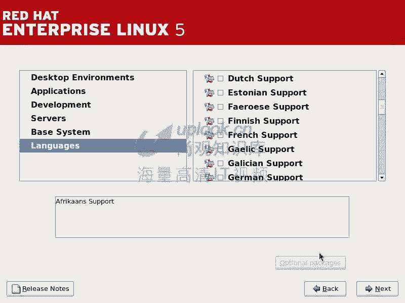

好好吧嗯。然后呢，比方说我CD并目录下去，我看一下有什么东西，有这些命令，这就是我们刚才那个安装安装的目录。这就是我们现在这个根呢就是LS根，我们这个根是在哪呢？这个根实际上是在呃win当中。

也就是在内存当中。你看你现在看到这个根的话，实际上是在内存当中。对明白吗？也就是说我们现在这个根根据啊，呃实际上是呃实际上说它是一个就是在内存当中的这样的一个根。

那么它其他的慢慢的在就是呃在加载到这个根下，然后呢，可以找到各种各样的资源，也就是它不是一个已经装好的系统，它是在内存当中一个小的这个系统。明道吧？如果在安装过程当中有任何的问题，你可以按什么呢？

ORTF3就是contrl加或者是control加F3。这边你可以看到你做了一些什么操作。然后呢ORTF4是一个日志。看到吧？嗯，那么如果要是它出现什么问题的话，你可以切换到这边来看他到底有些什么问题。

你看到这边的话呢，他已经说有一些什么问题，他说呃MTRR说你的呃就处理器不能支持什么呃。rightite command command啊这样的操作等等。那这里面的话，实际上是是如果你装的时候，哎。

怎么总是退出啊，总是有问题，你可以通过这样的方式去重播出庭。对吧嗯那现在我想切换回刚才那图形界面按什么，看下人加F7outt加F7啊，从图形界面切换到别动才是按cr的。明道吧？你还有奥F7，我看一下。

然这F7哎切了回来。哎，没有反应啊。

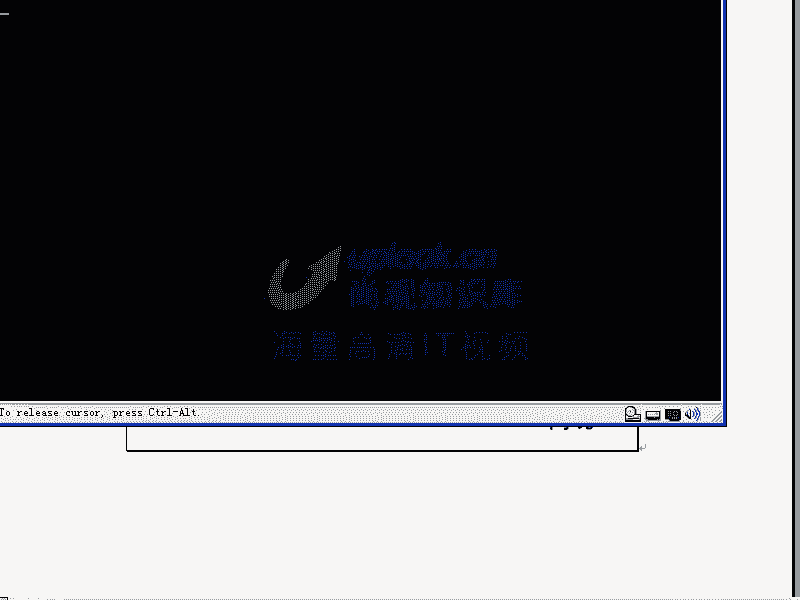

那可能alt加F7不是我们的钢能共产。那么alt加F6看一看哎，奥t加F6是。看到了吧？嗯，这突间没有回来了。明白了吗？明白啊，OK这就是我们刚才说的这个地方啊，就刚才我们说的这个地方。

就是说呃你如果要是在这个安盘安装光盘的这个使用，你可以用它来进行超波数体，或者进行简单的什么这个故障排除啊等等。那么假如说我不开启这个安装过程，我直接在这里面按ctrl加alt加F2。

是不是就到一个shall控台上去了，是不是到那个控台上去了。对啊，那在这里面的话，我是不是可以做各种各样的事情。对，你你需要安装linux才有linux嘛？

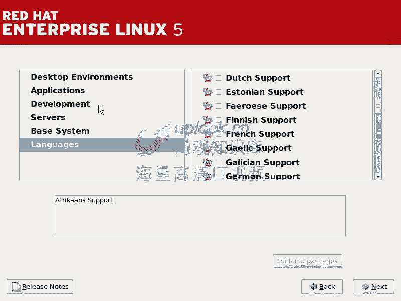

你还没有安装吧。对，这时候是不是有个lininux系统，嗯，那你是不是可以做lininux里面的很多很多事情，可以，对吧？所以这个小的lininux系统实际上一直以来就在运行着。你不管装不装，都是这样。

明白吗？明白OK那这就是H1L5的安装啊，希望大家呢得到自己就是说想知道知识。如果要是嗯就是说不明白的话呢，可以多看几遍啊，可以多看几遍。O这是上关的这个呃视频，就是说我们的这个呃112部分的视频。

这是我们的最基础的课程。那么总共的课程的话大约有呃20多本吧。总共课程20多本，这是最基本的一本课程。那么但是问题是很多的。希望同学的话能从这里面得到自己想要的知识啊。

OK那我们这节课的话就先到这个地方。

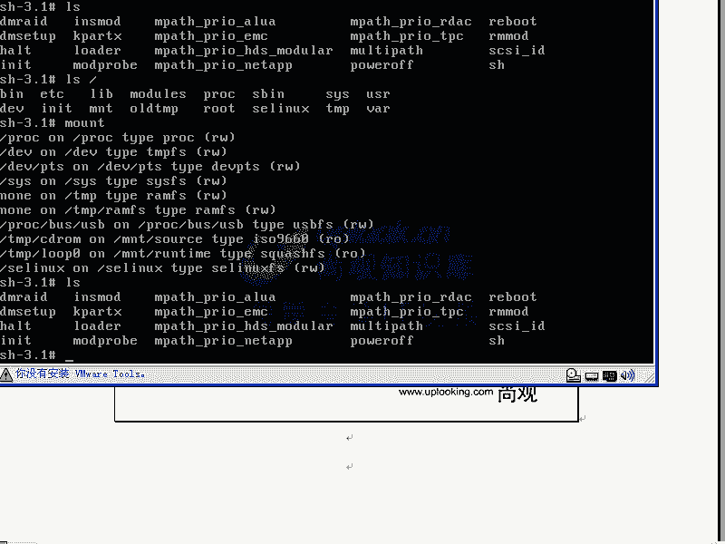