# 尚观Linux视频教程RHCE精品课程：P5：RH033-ULE112-02-3-RHEL5 Linux安装 🖥️

在本节课中，我们将学习Red Hat Enterprise Linux 5（RHEL5）的安装过程。我们将了解RHEL与其他Linux发行版的区别，并详细讲解从启动到配置的每一步操作，包括分区、软件包选择等核心概念。

## RHEL简介与安装准备

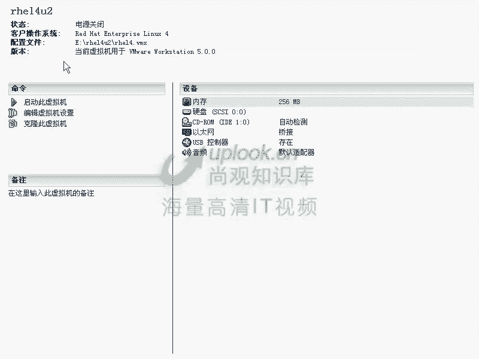

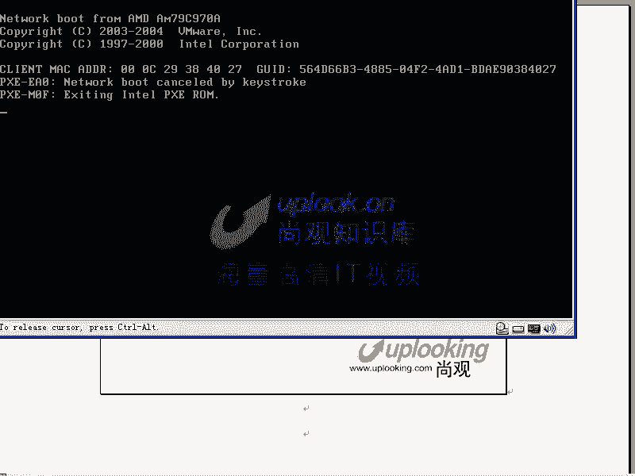

上一节我们介绍了Linux的基础知识，本节中我们来看看RHEL5的安装。RHEL5是Red Hat企业版的第五个版本，以其稳定性和对企业环境的支持而闻名。它与Fedora等社区版本的主要区别在于更新周期更长，软件包经过更严格的测试，旨在为企业提供稳定可靠的平台。

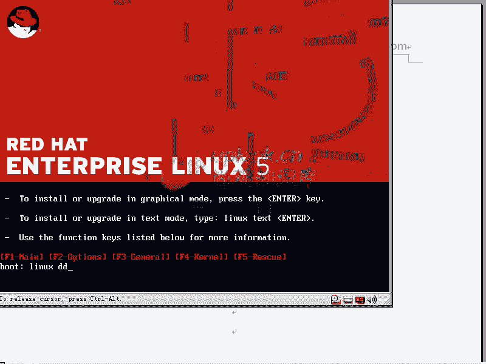

安装RHEL5需要准备安装光盘或ISO镜像。启动计算机并从光盘引导后，我们会进入安装程序的初始界面。

## 安装引导与启动选项

当使用RHEL5安装光盘启动后，首先会看到引导菜单。在这个界面下，除了默认的图形化安装，还可以输入特定的命令来启动不同的安装模式。

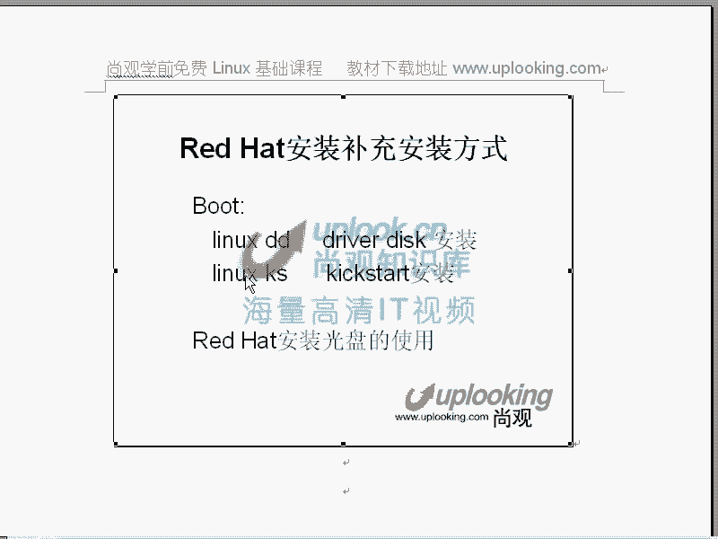

以下是几种关键的启动选项及其用途：

*   **linux text**：启动文本模式的安装程序。
*   **linux dd**：在安装过程中加载额外的硬件驱动程序。例如，当服务器使用RAID卡时，如果安装盘未包含该驱动，就需要使用此选项从软盘或USB设备加载驱动。
*   **linux ks**：执行无人值守安装（Kickstart）。通过指定一个预配置的应答文件，可以自动化整个安装过程。其基本语法是：
    ```bash
    linux ks=nfs:192.168.0.254:/path/to/ks.cfg
    ```
*   **linux rescue**：进入救援模式，用于系统修复。
*   **linux askmethod**：手动选择安装源（如光盘、NFS、HTTP等）。

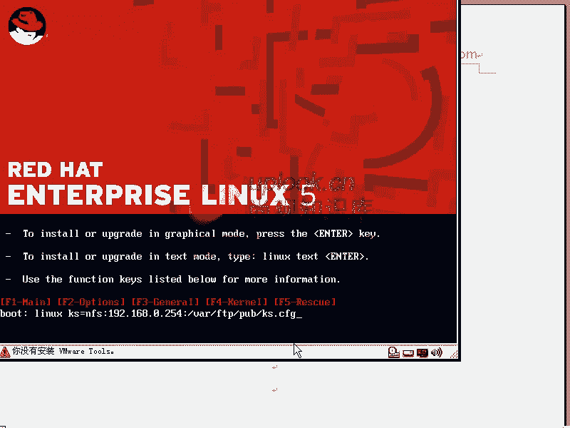

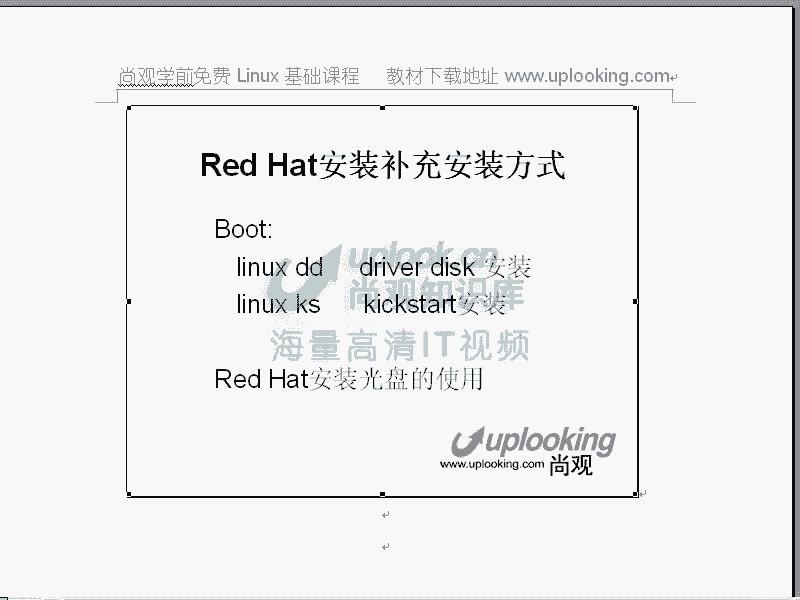

这些选项为不同场景下的安装提供了灵活性。默认情况下，直接按回车键将启动图形化安装界面。

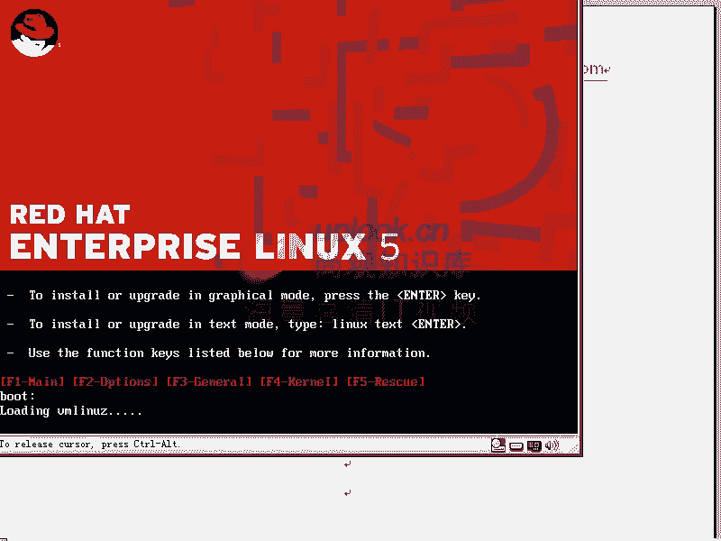

## 图形化安装过程详解

选择图形化安装并回车后，系统会加载内核（`kernel`）和初始内存磁盘（`initrd`），然后启动名为`anaconda`的Python脚本安装程序。`anaconda`会启动一个X Window图形环境来引导用户完成安装。

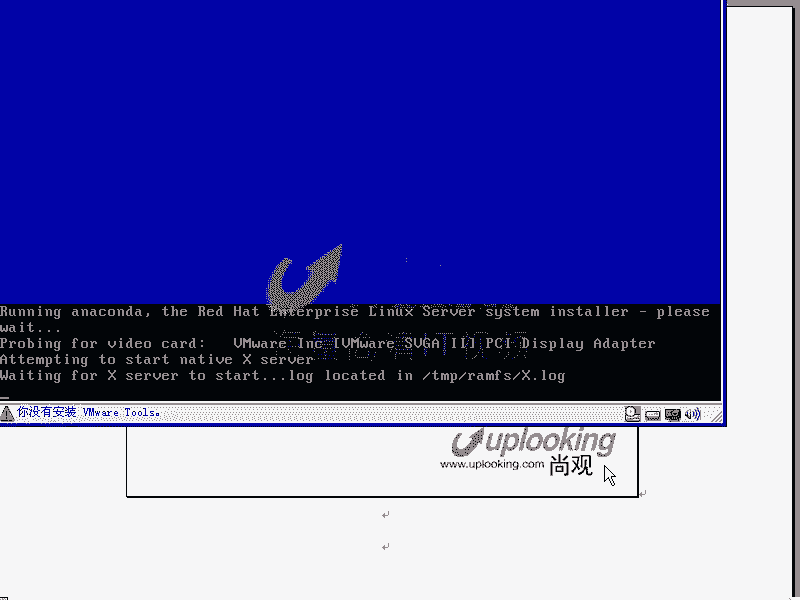


首先，安装程序会提示进行“媒体检查”，以验证安装介质的完整性。跳过此步骤后，便进入正式的安装配置环节。

### 语言、键盘与序列号

安装过程的第一步是选择语言。虽然可以安装中文支持，但建议将系统界面语言设置为英文，这有助于后续的命令行学习和问题排查。

接下来选择键盘布局，通常选择“U.S. English”。然后会提示输入安装序列号。不同的序列号对应不同的软件订阅和支持级别，可以解锁如集群、存储等高级功能套件。对于学习和评估，可以选择跳过。

### 磁盘分区方案

磁盘分区是安装过程中的关键步骤。RHEL5提供了自动分区和手动分区两种方式。

以下是手动创建基本分区的典型步骤：

1.  **创建 `/boot` 分区**：这个分区存放系统启动所必需的内核和初始化文件。为了保证BIOS能够顺利找到这些文件，`/boot`分区通常较小（如200MB），并位于磁盘起始位置。
2.  **创建 `swap` 交换分区**：作为物理内存的扩展。其大小通常设置为物理内存的1到2倍。
3.  **创建 `/` 根分区**：用于存放系统其他所有文件和目录。可以将剩余的所有空间分配给它。

需要注意的是，MBR分区表最多支持4个主分区。如果需要更多分区，可以将其中一个主分区创建为扩展分区，然后在扩展分区内创建逻辑分区。逻辑分区的设备名会从5开始，例如`sda5`。

除了标准分区，安装程序还支持创建**软件RAID**和**LVM（逻辑卷管理）**。例如，可以将两个分区（`sda5`和`sda6`）组成一个RAID 0设备（`/dev/md0`），以实现性能提升。LVM则提供了更灵活的磁盘空间管理方式。

### 网络、时区与根密码

配置网络时，可以为网卡设置静态IP地址或使用DHCP自动获取。**主机名**的设置非常重要，不恰当的主机名可能导致`sendmail`等服务启动缓慢或报错。

选择正确的**时区**（如“Asia/Shanghai”）至关重要。如果时区设置错误，在使用NTP时间同步服务时，系统时间会产生混乱。

为**root账户设置一个强密码**是系统安全的第一道防线。建议密码长度在8位以上，并混合使用大小写字母、数字和特殊字符。避免在安装初期使用简单密码，即使计划后续修改。

### 软件包选择

这是RHEL5与旧版本差异较大的部分。根据之前输入的序列号，会显示可安装的软件组。用户可以选择预设的角色（如“Web Server”），也可以进入“Customize now”进行详细定制。

对于初学者或生产服务器，建议的定制原则如下：

*   **桌面环境**：学习时可安装GNOME或KDE，生产服务器通常不安装。
*   **应用程序**：移除不必要的程序，如游戏、办公套件，以节省空间。
*   **开发工具**：如果不进行软件开发，可以取消大部分开发包。
*   **服务器**：仅安装计划使用的服务器软件（如HTTP、FTP），减少潜在的攻击面。
*   **语言支持**：可以添加中文支持包，但保持系统界面为英文。

选择完成后，点击下一步即可开始安装过程。

## 安装过程中的高级操作

在图形化安装界面运行时，可以通过快捷键切换到不同的虚拟控制台（`tty`），进行故障排查或执行命令。

以下是常用的控制台切换快捷键：

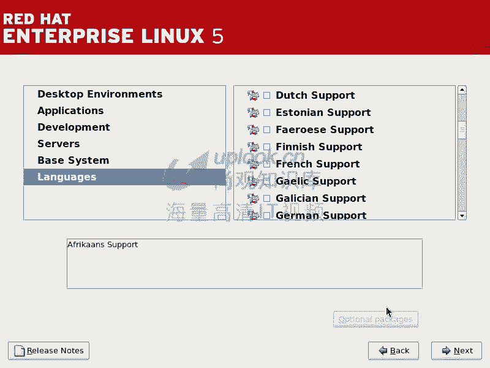

*   **Ctrl+Alt+F1**：切换到安装主界面（图形界面）。
*   **Ctrl+Alt+F2**：打开一个Shell命令行终端。此时所处的根文件系统是安装程序在内存中运行的临时环境，可以执行一些诊断命令。
*   **Ctrl+Alt+F3**：显示安装日志。
*   **Ctrl+Alt+F4**：显示系统消息日志。

例如，在安装遇到问题时，可以切换到`tty2`或`tty3`查看详细的错误信息。按`Ctrl+Alt+F1`可以切换回图形安装界面。

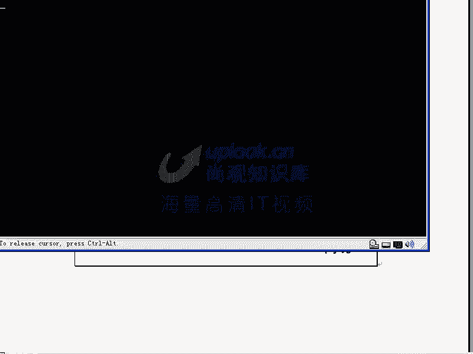

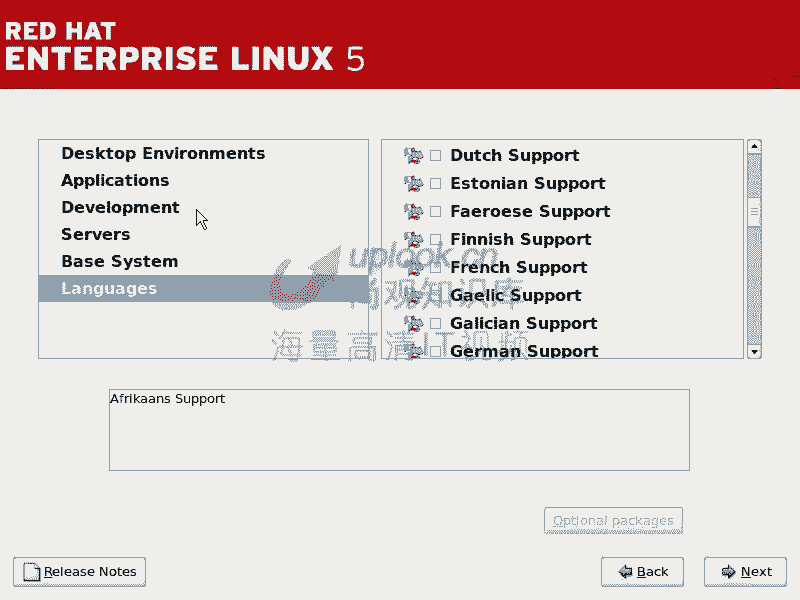

## 总结

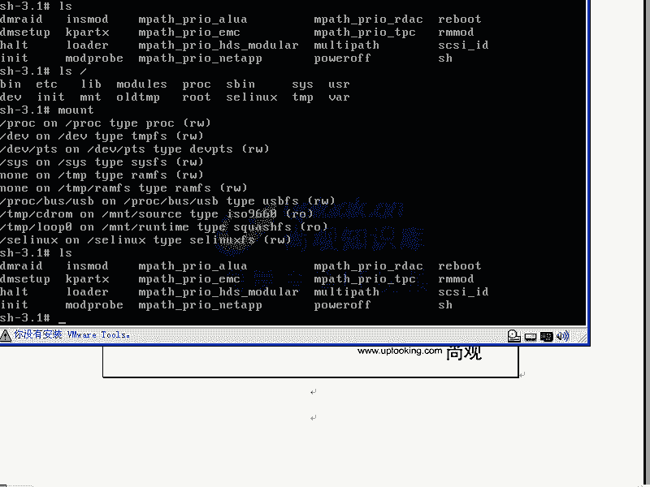

本节课中我们一起学习了RHEL5系统的完整安装流程。我们从RHEL的产品定位讲起，详细说明了安装引导选项的用途，并逐步演示了图形化安装中的各个环节，包括磁盘分区、网络配置、软件包选择等关键步骤。我们还介绍了在安装过程中如何使用虚拟控制台进行高级操作和问题排查。掌握这些知识是成为一名合格的Linux系统管理员的基础。接下来，我们将进入安装后的系统配置学习。