# 尚观Linux视频教程RHCE精品课程：P60：用户管理进阶与集中认证配置 🧑‍💻


在本节课中，我们将深入探讨Linux用户管理的进阶知识，特别是如何在企业环境中集中管理用户账户和密码策略。我们将学习`shadow`文件的详细结构、密码策略的配置方法，以及如何使用`authconfig`工具配置集中式用户认证。

---

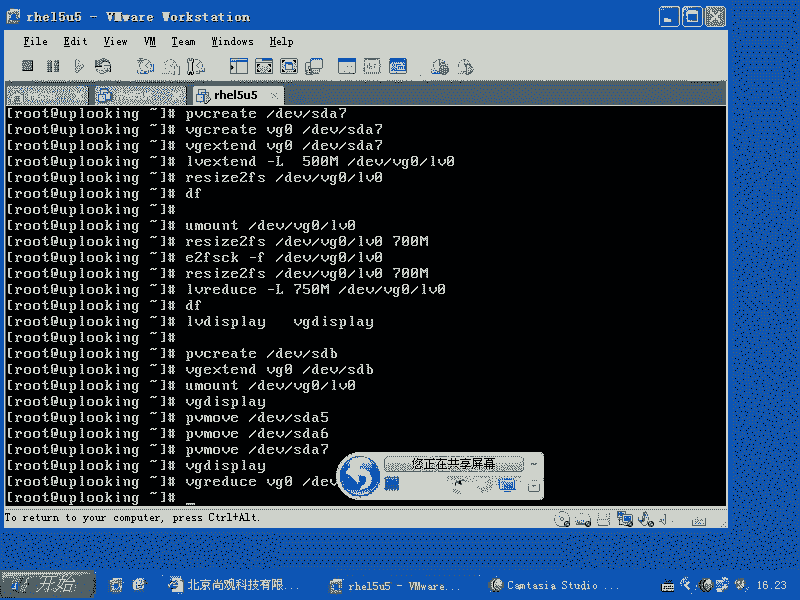

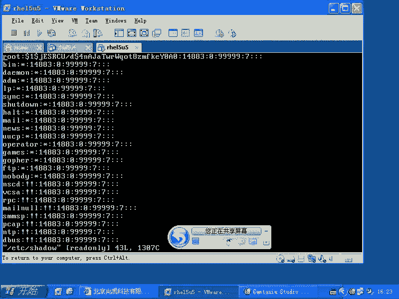

## 用户管理基础回顾

上一节我们介绍了基本的用户和组管理命令。本节中，我们来看看在企业环境中如何更有效地管理用户。

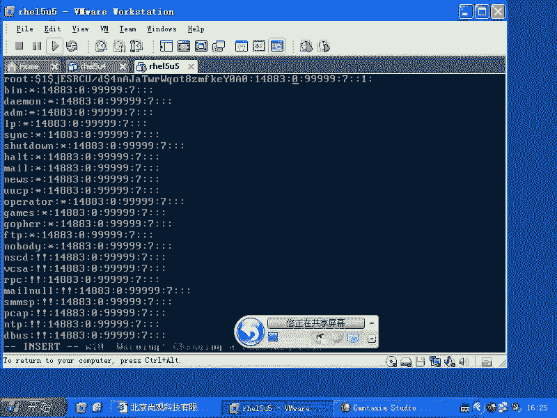

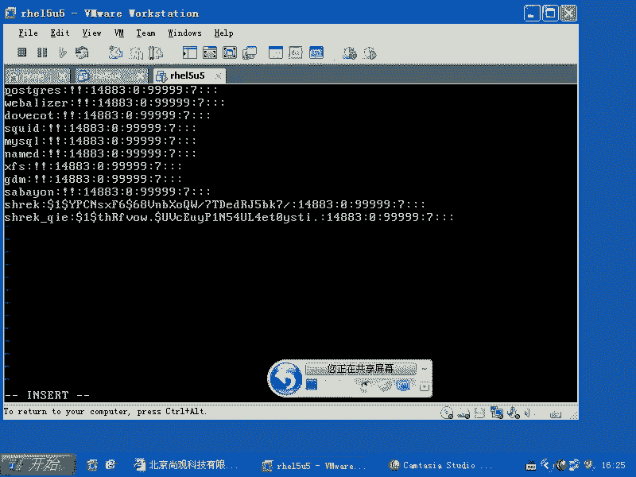

Linux系统中的用户信息主要存储在四个文件中：
*   `/etc/passwd`：存储用户账户信息。
*   `/etc/shadow`：存储用户加密后的密码及密码策略。
*   `/etc/group`：存储组信息。
*   `/etc/gshadow`：存储组密码（通常不使用）。

以下是常用的用户管理命令：
*   `useradd`：添加用户。
*   `userdel`：删除用户。
*   `usermod`：修改用户属性，例如使用 `usermod -G` 将用户添加到附加组。
*   `passwd`：修改用户密码。
*   `groupadd`：添加组。
*   `groupdel`：删除组。
*   `gpasswd`：管理组，常用 `gpasswd -M` 将多个用户加入一个组。
*   `chage`：修改用户账户的过期时间等策略。

---

## 深入理解 `/etc/shadow` 文件

`/etc/shadow` 文件是密码安全的核心。它存储了加密后的密码以及重要的密码策略信息。每一行代表一个用户，由冒号 `:` 分隔为多个字段。

一个典型的 `shadow` 文件条目如下所示：
```
username:$6$random_salt$encrypted_password:18000:0:99999:7:::
```

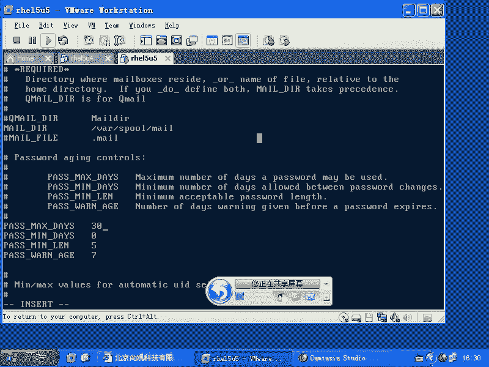

以下是每个字段的含义：
1.  **登录名**：用户的登录名称。
2.  **加密密码**：使用特定算法（如SHA-512）加密后的密码。如果为 `!` 或 `*`，则表示账户被锁定。
3.  **上次更改密码的日期**：从1970年1月1日（Unix纪元）到上次修改密码的天数。
4.  **密码最短有效期**：密码更改后，必须经过多少天才能再次更改。`0` 表示随时可以更改。
5.  **密码最长有效期**：密码多少天后必须更改。例如 `99999` 表示密码几乎永不过期。
6.  **密码过期前警告天数**：密码到期前多少天开始向用户发出警告。
7.  **密码过期后宽限天数**：密码过期后，账户还可以宽限多少天登录。
8.  **账户过期日期**：从1970年1月1日起，账户将在多少天后被禁用。留空表示永不过期。
9.  **保留字段**：供未来使用。

手动计算和修改这些日期（尤其是基于Unix纪元的天数）非常繁琐且容易出错。因此，我们使用 `chage` 命令来管理这些策略，它会自动进行日期转换。

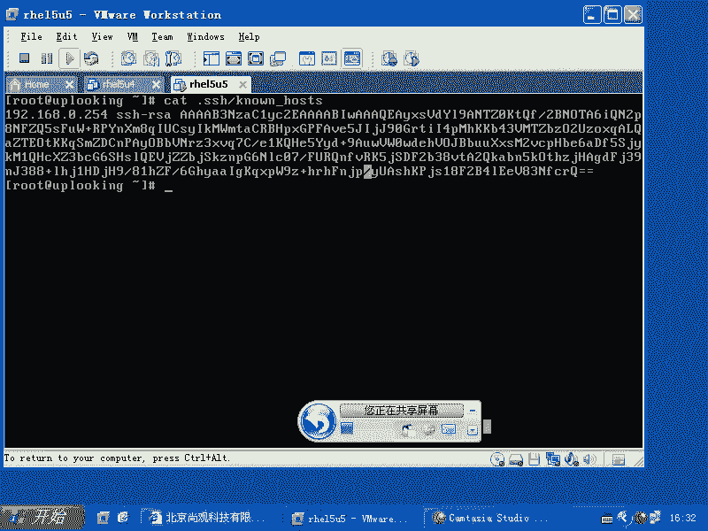

---

## 企业级密码策略管理

在企业环境中，通常需要强制执行严格的密码策略，例如强制用户每30天更改一次密码。

密码策略的默认值在 `/etc/login.defs` 文件中定义。例如，`PASS_MAX_DAYS` 定义了新用户密码的默认最长有效期。

**修改默认密码策略示例**：
如果你想将新用户的密码最长有效期设置为30天，可以编辑 `/etc/login.defs` 文件：
```bash
PASS_MAX_DAYS 30
```

对于已存在的用户，可以使用 `chage` 命令进行修改：
```bash
# 设置用户 ‘alice’ 的密码必须每30天更改一次
chage -M 30 alice
```

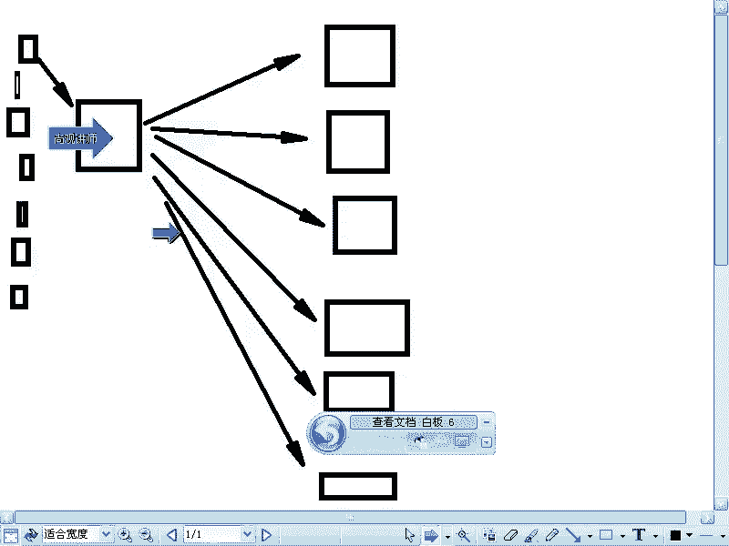

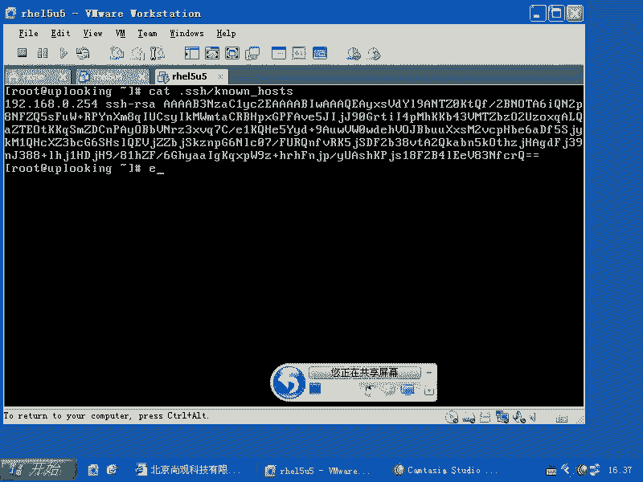

一些大型公司会采用更自动化的方式管理服务器密码：
1.  生成一个包含多行高强度随机字符串的文件。
2.  编写脚本，定期（如每月）从该文件中取出新密码。
3.  使用脚本通过SSH批量登录到所有服务器，并使用 `passwd` 命令或直接修改 `/etc/shadow` 文件来更新密码。


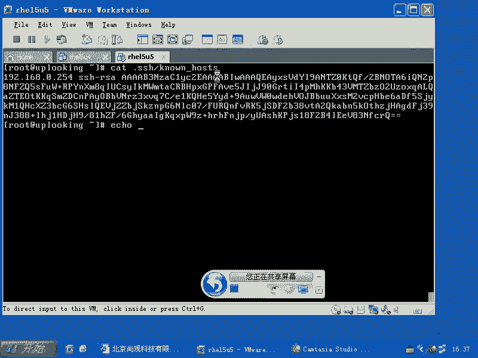

**自动化密码修改脚本示例**：
```bash
# 假设 new_password 是从随机文件中获取的新密码
new_password="$(cut -c 2-17 /path/to/random_file.txt)"
echo -e "$new_password\n$new_password" | passwd --stdin username
```

---

## 集中式用户认证配置

在拥有多台服务器的大型企业中，为每台机器单独管理用户账户效率低下。Linux支持多种集中式认证方案，允许用户从一个中心服务器进行认证。

常见的集中认证协议包括：
*   **NIS (Network Information Service)**：传统的Unix网络用户管理系统。
*   **LDAP (Lightweight Directory Access Protocol)**：更现代、灵活的目录服务协议，微软的Active Directory也支持此协议。
*   **Winbind**：用于集成Windows域认证。

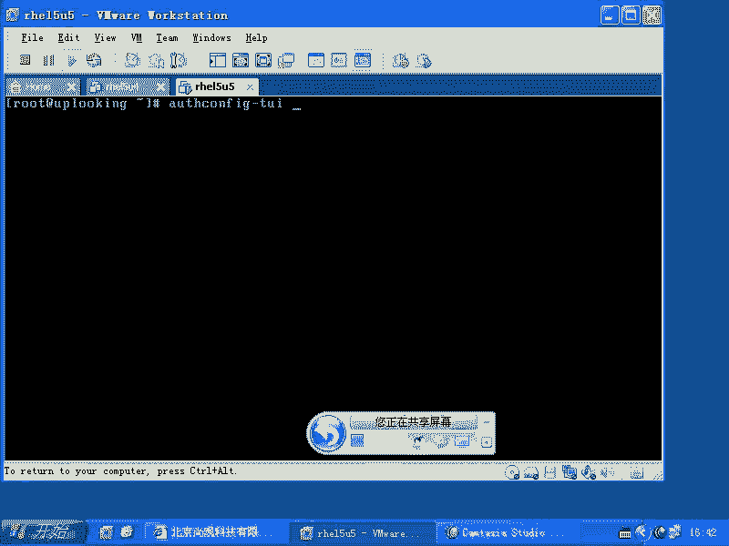

在RHEL/CentOS系统中，可以使用 `authconfig` 工具来配置这些认证方式。

**使用 `authconfig` 配置NIS客户端**：
1.  在终端中运行 `authconfig-tui` 命令会启动一个文本用户界面。
2.  选择 “User Information” 和 “Authentication” 的配置方法为 “NIS”。
3.  在接下来的界面中，填写NIS域名（如 `example.com`）和NIS服务器地址（如 `192.168.0.254`）。
4.  保存并退出。

配置完成后，系统将尝试从指定的NIS服务器获取用户和组信息。结合 `autofs` 服务，还可以自动挂载用户在NIS服务器上的家目录，实现完整的网络用户环境。

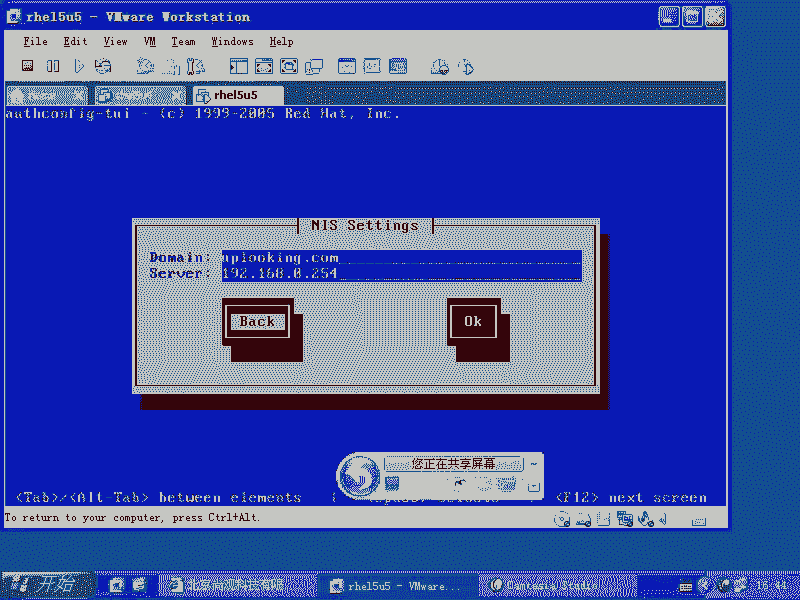

**图形界面配置**：
如果你在图形桌面环境中，可以使用以下命令启动图形配置工具：
```bash
authconfig-gtk
```

---

## 总结与自测

本节课中我们一起学习了Linux用户管理的进阶内容。我们深入分析了 `/etc/shadow` 文件的结构和密码策略字段，掌握了使用 `chage` 命令管理账户有效期的方法。我们还探讨了企业环境中自动化密码管理和集中式用户认证（如NIS/LDAP）的配置，这些是构建可维护、安全的企业IT基础设施的重要技能。

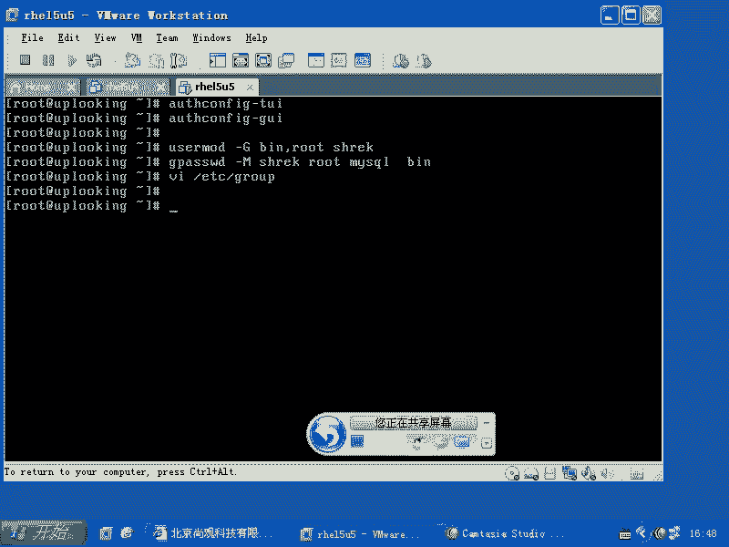

在继续学习之前，请确保你能熟练回答以下问题：
*   如何创建用户和组？
*   如何将一个用户加入多个组？（`usermod -G`）
*   如何将多个用户加入一个组？（`gpasswd -M`）
*   如何查看和修改用户的密码过期策略？（`chage -l username`， `chage -M 30 username`）
*   如何将一台Linux主机配置为NIS或LDAP的客户端？（使用 `authconfig` 或 `authconfig-tui`）