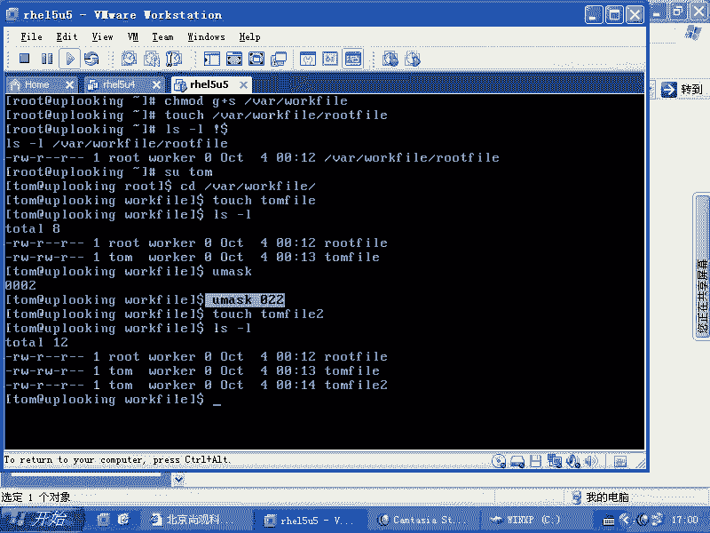

# 尚观Linux视频教程RHCE 精品课程 - P61：RH133-ULE115-10-2-group-setgid - 爱笑的程序狗 - BV1ax411o7VD

。

windows里面的话呢，它有一个是呃有一些就是很多有很多问题啊。你比方说我现在的话呢右击属性。

等一下，我看一眼是什么文件系统。快32。啊，这个NT2。如果NTF的话呢，你看到会有一个什么安全，是不是？啊。😮，哪个简单文件关上。这个。查看。上面。这个。就可以了。安全是吧，非常安全。你们真厉害啊。

我就我就我还经常纳闷，因为我这个安全怎么没没有了是吧？我还以为20呃windows2000的话呢，会默认有XP的话呢，我记得总是professional都会有是吧？profession都会有。

然后呢呃不是professional的里面的话有一个加密文件系统是吧？加密文件系统委员来用，还被我们公司的人话骂了一顿，你还用这么老土的东西，那我觉得挺好用的。

那个是professional里们面的功能。像这个的话呢，我在原来做那个windows server的时候啊，就2000年20001年的时候，这个东西搞过很多。你看一眼的话呢。

这个东西就实际上是比较复杂了。看到吧。很多人的话呢都觉得说哎windows比较简单，其实windows里面细节设置的时候的话呢，这些权限也是非常复杂的，是不是要详细的去琢磨很多事情。

你方说的话呢先给他创建组，把这些用户加到组里面来，然后呢，有全局组和本地组，是不是？全局组的话呢又给他指定这个属性，那个属性。所以这套东西的话呢，是属于windows比较擅长的，他给你提供同新界面是吧？

还有拒绝属性，是不是？😊。

但是我们linux里面的话呢，这部分一直的话呢都会比较弱。比较弱的话呢，我们现在。

模拟一个常见的这样的一个情况。首先的话呢，比方说我user a添加了一个什么呢？tom账号，然后添加了一个什么呢？marry。

是吧买尔士这种拼吧rose啊。啊，是这么拼吗？他姆是不是错了？没错啊，哎。不行啊，comm是吧？是吧。

啊。那么你要知道，在创建出来账号以后，有他们相同名字的组会产生，是不是？有很多人创建的时候的话呢，加上一个什么呢？呃，可以加上一个组的名字，比方说杠大G是吧，指定它的拥有组是什么？

那么我现在的话呢group add。叫做worker。worker组是不是work组添加上去，然后呢用G passwordsword是吧，杠M是吧，TOMmary。

然后呢，ro。

呃，rose啊worker。workers添加进去了以后，然后呢，我们再去看什么呢？再去看。

你看一眼，就是worker组里面是不是有这些账号耶。

没有啊。

啊，错了。应该是逗号，是不是？

是逗号吗？是吧这账号就在这里面了。那么添加进去了以后，这些用户的话呢，它就属于这个组。然后呢，我们要给他做一个共享文件夹啊，我们要给他做一个共享文件夹。这共享文件夹的话呢。

比方说我们去makeDIR在我们的one目录下做一个什么呢？

哇下的。啊。万尔目录夏的话做一个名叫。

三啊。

work file这样文件夹是吧，然后给它设定权限CH。😊。

MOD那么让如此账号是嗯先给他把它的这个CHGRP是吧？把它的组的话呢改成什么？改成。

Worker尔族。

对吧给它改成worker组。然后呢，如果要是你这个这个文件夹里面的话有很多其他的文件的话，那么你可以这样的是吧？加大R是吧？把它的下面的子文件夹和子文件夹里面的文件全部都改成什么worker组。

然后这样的话呢，我们就让LS杠LD是不是LD，然后呢看一眼。😊，它的权限应该是worker组，是不是？但worker组的话，对这个文件夹里面的文件的话呢，就是对这个文件夹的话呢，没有什么写入权限。

是不是？那我们这样的CHMOD是不是？G加上一个什么，加上个W，但是W的话呢是不是会比较。它是不是这个权限会比较大，W加X权限是不是会比较大，因为每个人可以删除其他的人的文件，不管对那个文件有没有权限。

假方说如特账号在这里面创建一个文件，我就可以删除掉如特的文件，是吧？那么我可以或者是强制的更改它，对不对？那这样的话呢，这个权限会比较大。那我同时加上一个什么O加上一个T是吧？这能一块写吗？😊。

没试过啊。没试过，不行。G加上一个W是吧，然后呢再去加上一个什么O加T是不是？😊，O加T以后的就是粘贴位质疑，粘贴位质疑的话就是不允许。就是你即使对这个文件夹具有WX权限。

但是你不能强制的更改别人的文件。你只能更改自己的文件，是不是？嗯如果你要是没有加TV的话呢，你可以改自己的，也可以改别人的，可以改任何人的。😡，别管那个人来头有多大，比方说如此账号创建一个文件。

你就强制把它更改，是不是？😡，这样的话呢，何谈安全性呢？没有任何安全性，是不是？然后现在我们O加T以后还行不行呢？还不行，我们再加上一个什么呢？CHMOD是吧？G加上一个S是不是Y的work。😊。

是不是G加S加了个S权限以后的话呢，任何人在这个里面的话呢去创建文件。它的拥有组是谁呀？文件夹的用素。是不是？文件夹的运组。也就是这个文件夹的话呢，它的组。啊，就说我们这个文件夹的这个拥有组是谁呢？

是我们的。worker是不是worker这个组，然后呢，我们任何人在创建文件啊，比方说touch一个文件哇下的。😊。

work file当中的话呢，有个router file，是不是root file，然后一回车创设计完了，设定完了以后。😊，然后我们叫LS。到哎呀。这个是如特我自己创建的文件，结果变成了worker组。

是不是？

router的话呢是没有什么实质的意义啊，如uter没有什么实质意义，为什么呢？因为root账号的话呢，它创建出来的文件默认的那个you mask是什么？

有 mask是。

022就是说只允许自己可读可写别人的话呢，只是只读，是不是？所以他呢我们看不出区别来。咱们看是看那个tom啊，SU成什么tom是不是tom的话是属于这个组的，是不是？

对这个文件夹本身的话是具有什么写入权限，CD的wa的work file啊，在这里面它是一个文件叫什么tom fell是不是我们看一下啊。

他置出来以后，LS杠L。

那么tom这个这个账号创建出来一个文件，worker组的人可不可以去写入？

可以是吧，所以的话呢这个加G以后就是做这个用，就是G加S以后就是。SGI地位质疑以后，所有人在这个目录下创建的文件都是属于。文件夹的那个。而普通用户创建出来的文件，它的权限刚好是什么？

664是不是也就自己和。

这个文件的拥有组的那个成员都具有什么写入的权限。而这个拥有组是谁啊？😡。

是文件夹的拥有组，是不是？所以的话呢我们就为某一个团体创造出了一个什么工作的目录。明白吧？我可以我就创建出一个工作目录。当然了，我可以自私一点，或者说我可能基于我的这个需要是吧？不想让别人更改我的文件。

我就跟ro头一样是吧？我可以把you must设置成什么呢？我现在you must是0002是吧？那我可以给它设置什么you must设置成0022是吧？或者022是吧，都行，这样设置成022以后。

然后我再touch一个文件。😊。

然后呢我再去LS。那这个时候你会发觉我创建出来的第二个文件是不是只允许我自己去写入是吧？其他人就不能去什么写入了，这跟U mask是相关的，是不是？那么如果要是你想每次启动的时候，都定制自己的Um。

把这个东西写在哪？

ba shell的那四个配置文件当中的一个是吧？你定制的是你自己的，是不是？所以你应该在那四个文件里面选什么，你自己逐目当中那两个，一个是逐目录下的点bash。

profile是吧？另外一个是点代式LC。清楚了吧。所以这就是一个管理自己的这个就是管理大家协作的这样的一个。

呃，就是典型的情况，清楚了吗？管理大家协作目录的典型的情况，你应该怎么样呢？把这个目录G加上S是吧？然后把这个目录的这个拥有组改成什么，大家的那个公用的那个组。

是不是所有人在这个里面创建出来的文件就是什么就是。

拥有组的话都是那个文件夹的拥有组是吧？这样的话呢，我们有一个统一的权限好设置啊。

问题的话呢，其实在这个地方只是说可能90年代或者说03年、04年的时候，大家就已经满足了。

基本上已经满足了，就这么用啊。但是呢03年04年之后的话呢，我们逐渐在内核里面的话，有个新的技术。因为这个技术的话呢太土了，只能针对什么文件的拥有者和文件的拥有组来设定，是不是？所以后来的话呢。

我们又对这种传统的权限的话，有一些扩充，叫做什么呢？ACL扩充。就是说那个访问控制列表，就是所有的unix系统必须得要具备的。

所以这个哎这个这个是我们常见的一个，就是说这个针对大家协作目录的一个设置啊，针对大家协作目录的呃协作目录的一个设置。

