# Linux权限管理：P62：ACL访问控制列表详解 🔐


在本节课中，我们将要学习Linux中的ACL（访问控制列表）。ACL是对传统UGO（用户、组、其他用户）权限模型的扩展，它允许我们为一个文件或目录设置更精细、更复杂的访问权限，例如同时允许多个用户或组拥有不同的权限。

## 传统权限的局限性

上一节我们介绍了传统的Linux文件权限。本节中我们来看看传统权限模型在处理复杂需求时的局限性。

假设有一个开发组（包含5个用户）和一个测试组（包含3个用户）。他们都需要对一个名为`code`的目录拥有写入权限，但又不希望其他用户（others）拥有此权限。

传统的做法是创建一个新组（例如`CC`），将两个组的8个用户都加入`CC`组，然后将`code`目录的所属组设置为`CC`，并赋予`775`权限。这种方法操作繁琐，尤其是在组和用户数量众多时。

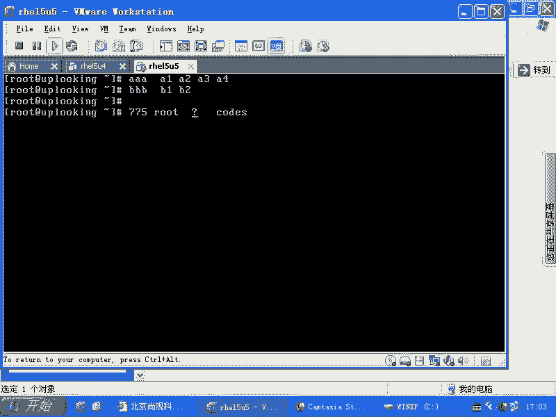

**核心问题**：一个文件或目录只能属于一个用户和一个组。无法直接让两个不同的组（如`AA`组和`BB`组）同时拥有写入权限。

## 什么是ACL？ 🛠️

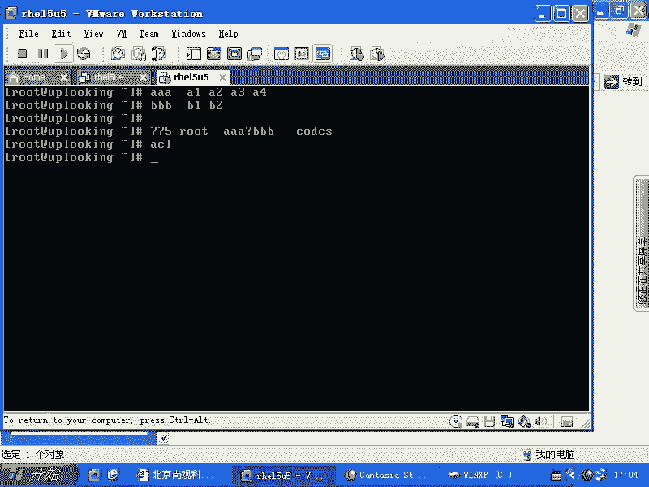

ACL（Access Control List，访问控制列表）正是为了解决上述问题而生的。它允许我们为单个文件或目录定义超出传统三种权限之外的额外权限规则。

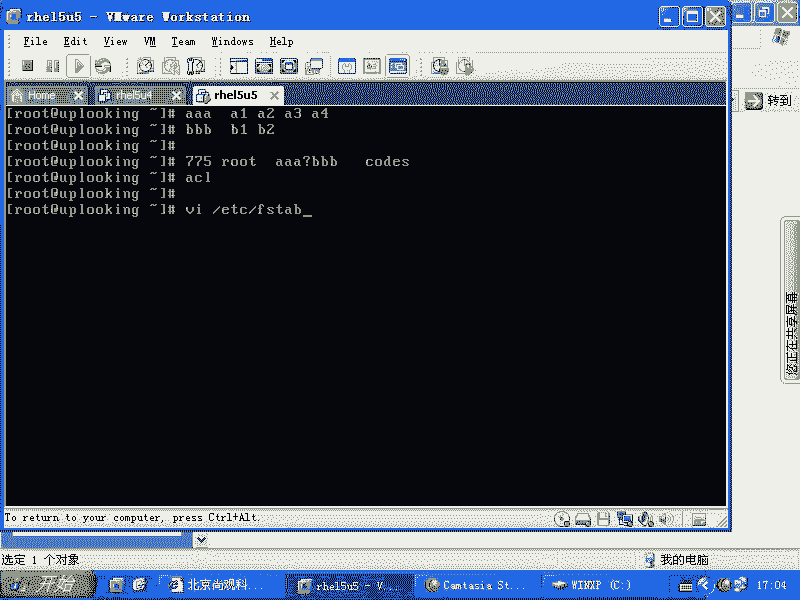

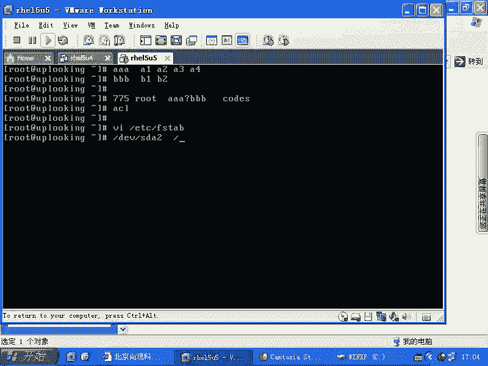

在RHEL5及以后的版本中，ACL功能默认已启用并支持。在更早的版本（如RHEL3/4）中，可能需要手动在`/etc/fstab`文件中为分区添加`acl`挂载选项并重新挂载。

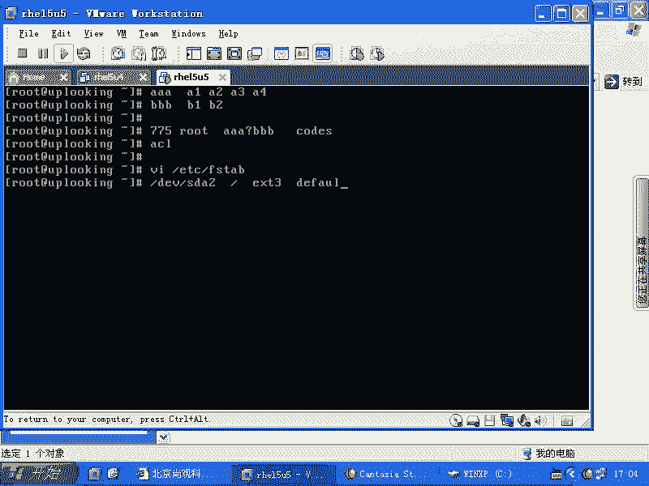

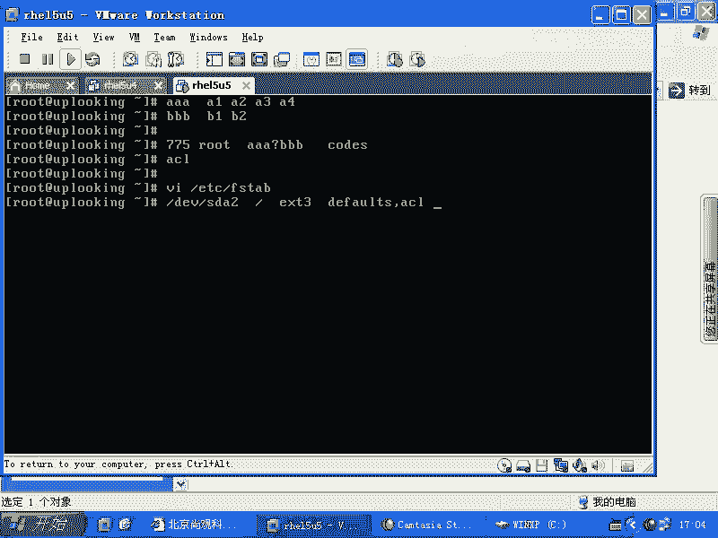

## 设置ACL权限

以下是使用`setfacl`命令设置ACL权限的基本方法。

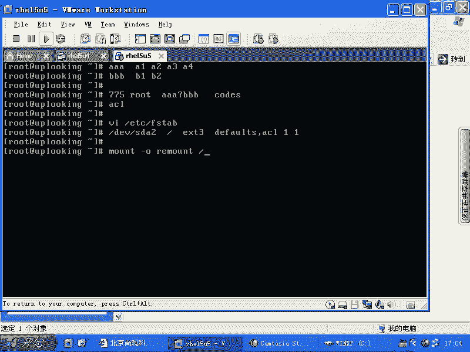

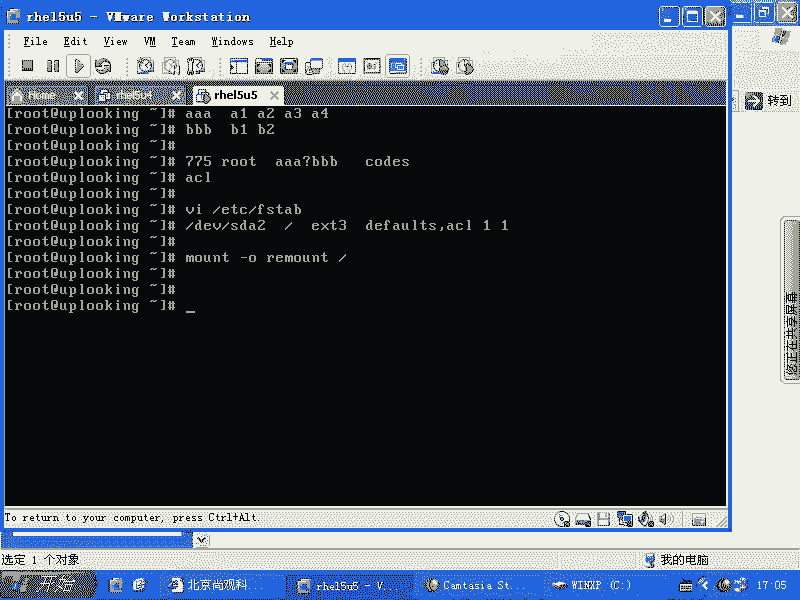

**命令格式**：
```bash
setfacl -m <规则> <文件或目录>
```
其中，`-m` 选项表示修改（添加）ACL规则。


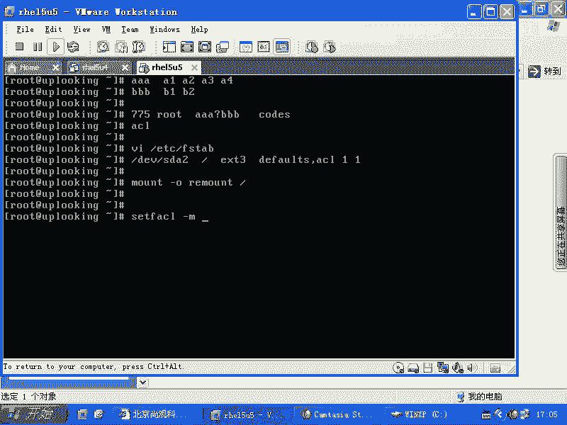

**规则格式**：
*   **为用户添加权限**：`u:用户名:权限`
*   **为组添加权限**：`g:组名:权限`
*   **设置有效权限掩码**：`m:权限`

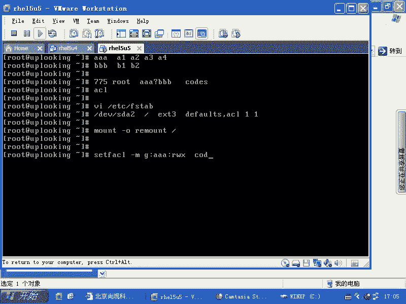

**权限**：使用`r`（读）、`w`（写）、`x`（执行）表示。

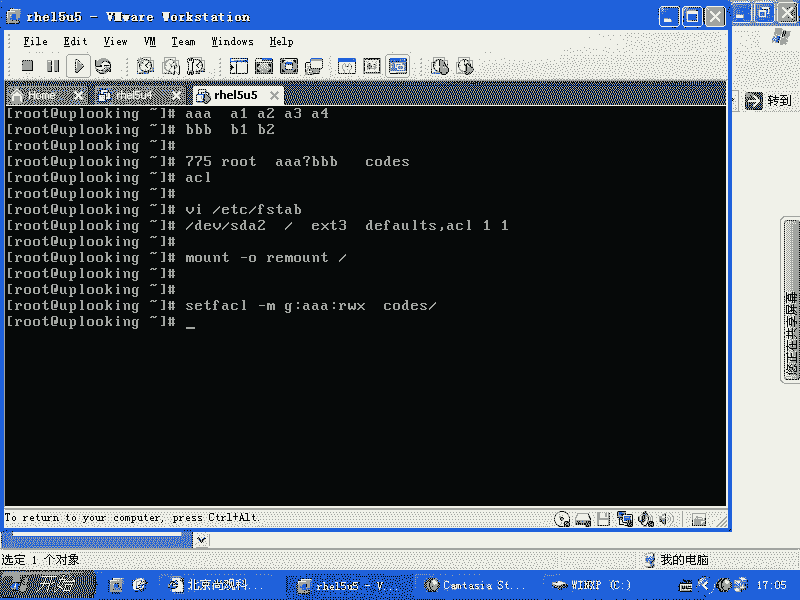


### 实践操作示例

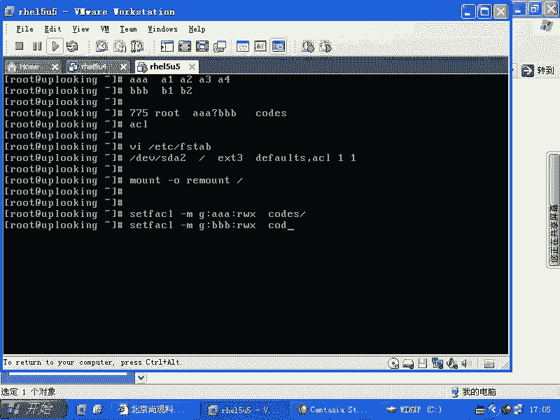

假设我们有一个目录`/workfile`。现在，我们要为`er`组和`bin`组添加读写执行（`rwx`）权限，同时为用户`sharack`添加`rwx`权限。

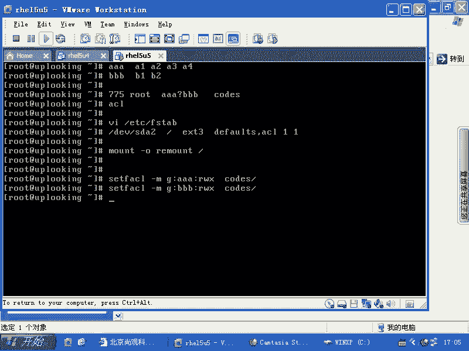

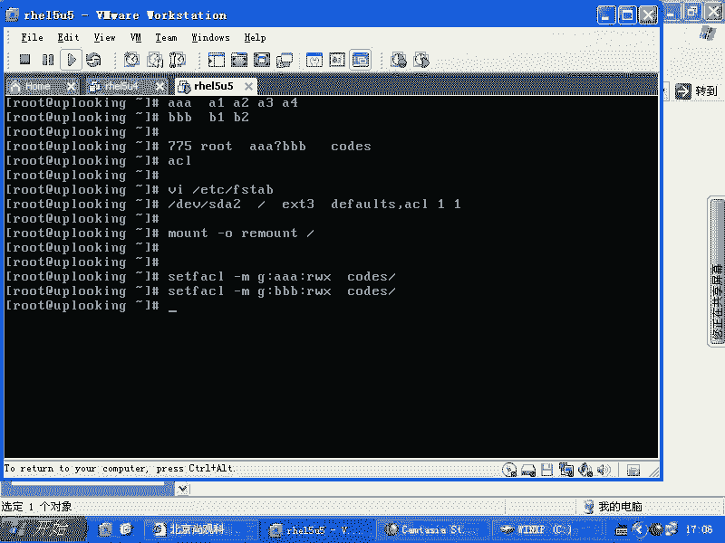

1.  **为`er`组添加ACL权限**：
    ```bash
    setfacl -m g:er:rwx /workfile
    ```

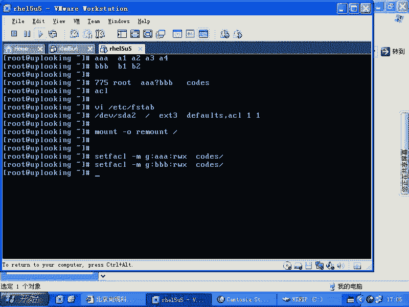

2.  **为`bin`组添加ACL权限**：
    ```bash
    setfacl -m g:bin:rwx /workfile
    ```

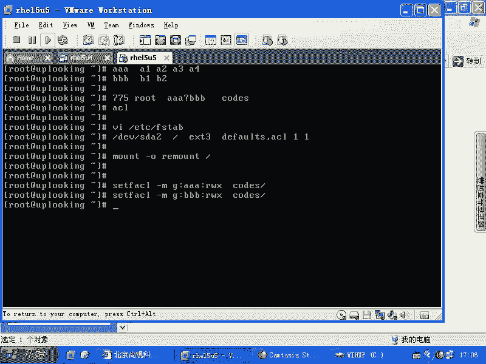

3.  **为用户`sharack`添加ACL权限**：
    ```bash
    setfacl -m u:sharack:rwx /workfile
    ```

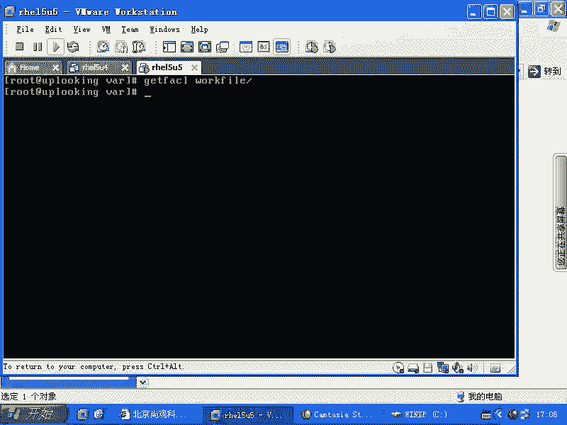

执行上述命令后，使用`ls -ld /workfile`查看目录，会发现权限位后面多了一个 **`+`** 号（例如 `drwxrwxr-x+`），这表示该文件或目录设置了ACL。

## 查看ACL权限

要查看文件或目录的完整ACL规则，请使用`getfacl`命令。

```bash
getfacl /workfile
```
输出结果将包含传统的用户、组、其他用户权限，以及我们刚才添加的所有ACL条目和一个`mask`条目。

## 理解Mask（有效权限掩码） 🎭

`mask`是ACL中的一个重要概念。它定义了除文件所有者和`other`之外，所有**附加的**用户和组权限所能生效的**最大范围**。

*   我们添加的ACL条目权限不能超过`mask`的值。
*   如果某个ACL条目的权限超过了`mask`，则实际生效的权限会被`mask`限制。

**示例**：将`/workfile`的`mask`设置为`r-x`（读和执行，无写权限）。
```bash
setfacl -m m:rx /workfile
```
此时，即使用户`sharack`的ACL条目是`rwx`，其实际有效权限也只有`r-x`。使用`getfacl`命令查看时，超过`mask`的权限后面会显示一个`#`号标识。

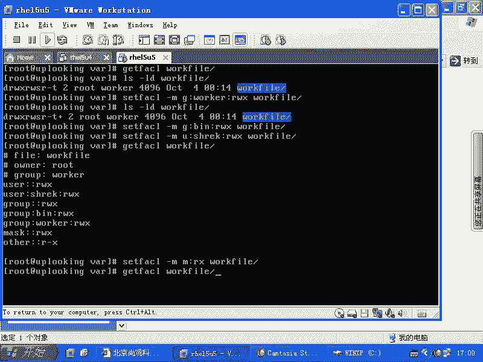

## 删除ACL权限

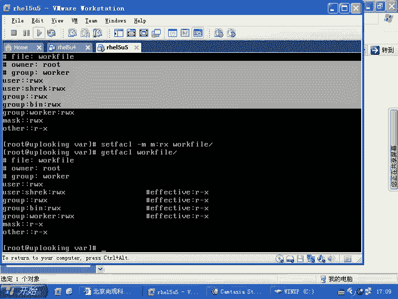

当需要清理ACL规则时，可以逐条删除。

**命令格式**：
```bash
setfacl -x <规则> <文件或目录>
```
其中，`-x` 选项表示删除ACL规则。

**删除示例**：
1.  删除`bin`组的ACL条目：
    ```bash
    setfacl -x g:bin /workfile
    ```
2.  删除`er`组的ACL条目：
    ```bash
    setfacl -x g:er /workfile
    ```
3.  删除用户`sharack`的ACL条目：
    ```bash
    setfacl -x u:sharack /workfile
    ```
4.  **最后，删除`mask`条目**（可选，删除所有附加条目后，`mask`可能会自动恢复）：
    ```bash
    setfacl -x m /workfile
    ```
删除所有ACL条目后，`ls -ld`命令显示的`+`号会消失，文件恢复为仅使用传统权限的状态。

## 总结

本节课中我们一起学习了Linux的ACL（访问控制列表）。

*   **ACL的作用**：突破了传统UGO权限模型只能设置一个属主和一个属组的限制，可以为一个文件或目录针对多个用户和组设置精细的访问权限。
*   **核心命令**：
    *   `setfacl -m`：设置（添加/修改）ACL规则。
    *   `getfacl`：查看ACL规则。
    *   `setfacl -x`：删除指定的ACL规则。
*   **关键概念**：`mask`（有效权限掩码）限定了所有附加ACL条目所能拥有的最大权限。
*   **标识**：设置了ACL的文件或目录，在使用`ls -l`查看时，权限位末尾会有一个 **`+`** 号。

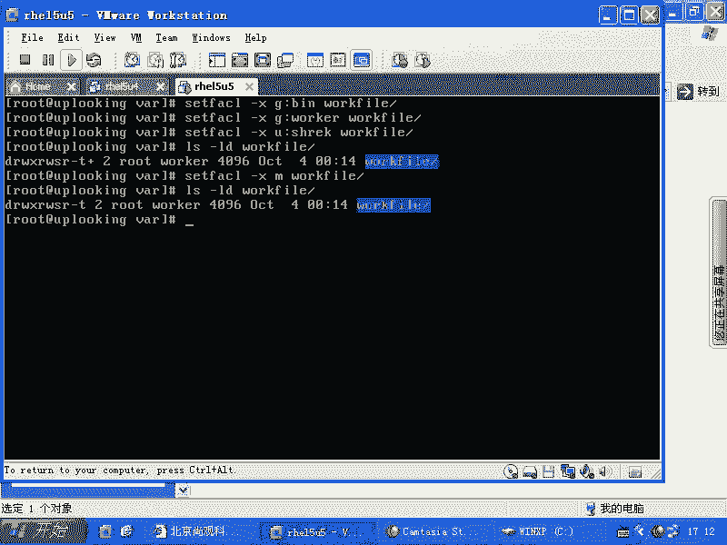

通过ACL，我们可以轻松实现诸如“让开发组和测试组同时拥有项目目录写入权”这类复杂而常见的权限管理需求。