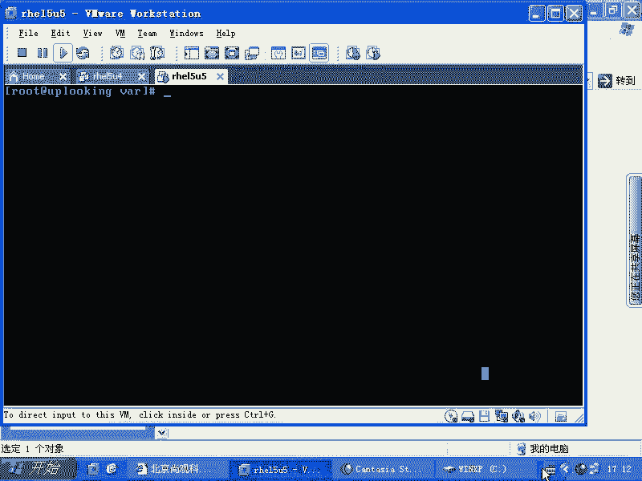
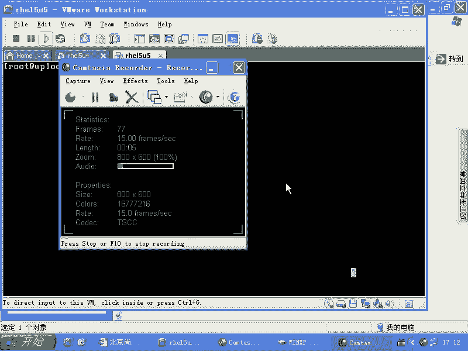
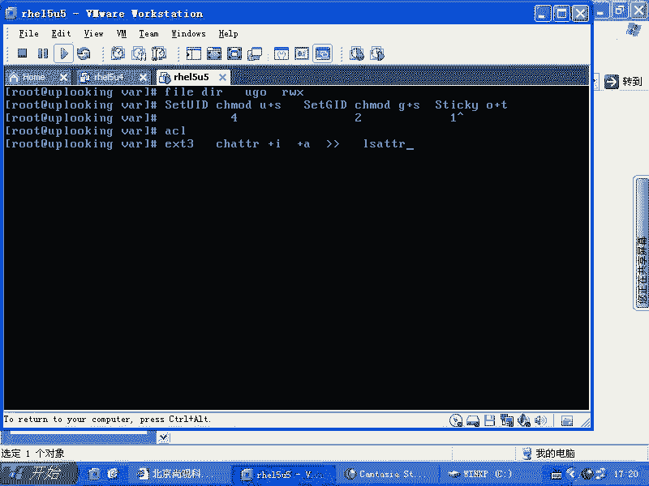
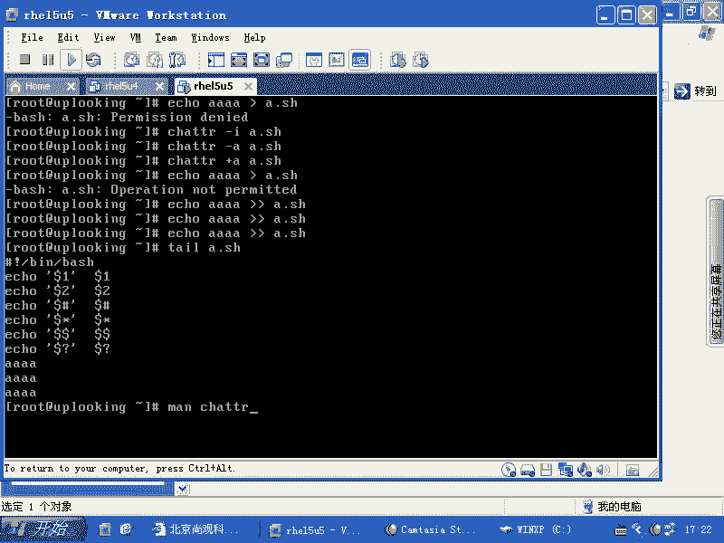
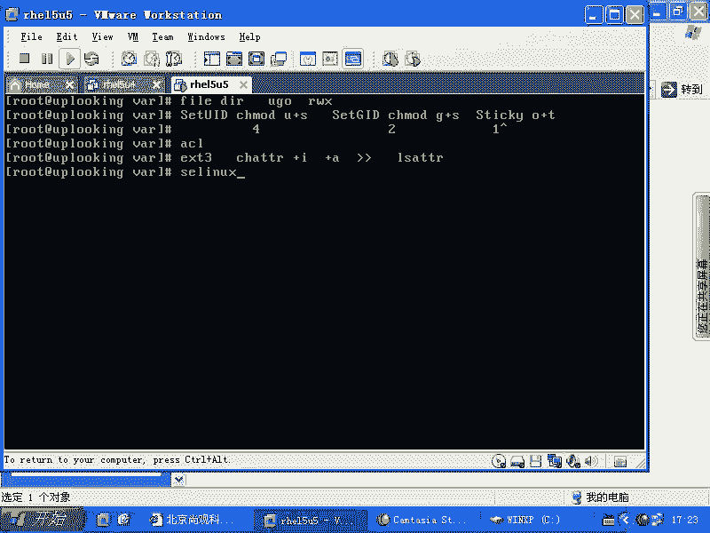

# Linux权限管理：P63：RH133-ULE115-10-4-chattr






## 概述
在本节课中，我们将要学习Linux系统中的多种权限机制，特别是文件系统底层属性工具`chattr`的用法。我们将从传统的UGO权限讲起，逐步深入到setUID、ACL以及`chattr`命令，帮助你理解不同权限的优先级和应用场景。

## 权限优先级与执行顺序
上一节我们介绍了ACL权限，本节中我们来看看当多种权限并存时，系统如何判断。

系统在检查权限时，会按照`getfacl`命令输出的顺序机械地执行。排在前面的规则最先被检查，没有权限合并或综合判断的过程。系统会依次检查第一条规则是否适用，然后是第二条、第三条，以此类推。

## Linux系统中的五种权限
现在，我们来总结一下Linux系统中存在的五种主要权限类型。

### 1. 传统UGO权限
这是最基本的权限系统，针对**用户（User）**、**组（Group）**和**其他用户（Others）**三种角色，分配**读（r）**、**写（w）**、**执行（x）**三种权限。

**公式表示：**
```
权限示例：rwxr-xr--
数字表示：754
```
需要注意的是，**文件**和**目录**的`r`、`w`、`x`权限含义不同：
*   对于目录，`x`权限代表可以进入（`cd`）该目录。没有`x`权限，即使有`r`权限也无法使用`ls`命令列出目录内容。
*   因此，系统大多数目录的默认权限是`755`（`rwxr-xr-x`），允许其他用户查看和进入，但不能修改。

### 2. 特殊权限位
由于传统UGO权限在某些场景下功能不足，系统引入了特殊权限位。

以下是设置特殊权限的方法：
*   **setUID**：使执行文件的用户暂时获得文件所有者的权限。
    *   命令：`chmod u+s filename`
    *   数字：`4xxx` (如 `4755`)
*   **setGID**：对于文件，使执行者获得文件所属组的权限；对于目录，在该目录下创建的新文件将继承目录的所属组。
    *   命令：`chmod g+s filename`
    *   数字：`2xxx` (如 `2755`)
*   **Sticky Bit**：通常用于目录（如`/tmp`），确保用户只能删除自己创建的文件。
    *   命令：`chmod o+t directory`
    *   数字：`1xxx` (如 `1777`)

可以组合设置，例如同时设置setUID和setGID：`chmod 6755 filename`。

### 3. ACL（访问控制列表）
ACL是对传统UGO权限的扩展，允许为单个用户或组设置更精细的权限。它遵循POSIX规范，因此在各种类Unix系统上用法基本一致。

### 4. 文件系统底层属性 (chattr/lsattr)
这是最底层的权限控制机制，由文件系统驱动直接实现。它不识别用户ID（UID）或组ID（GID），像一条“不认人的狗”，对所有操作者一视同仁。

主要使用两个命令：
*   `chattr`：改变文件属性。
*   `lsattr`：列出文件属性。

**常用属性介绍：**
*   **`i` (immutable) 属性**：文件一旦被设置为不可变，任何人都无法修改、删除或重命名，即使是root用户。
    *   **设置命令**：`chattr +i filename`
    *   **移除命令**：`chattr -i filename`
*   **`a` (append only) 属性**：文件被设置为仅追加。可以往文件末尾添加内容，但不能修改或删除原有内容。
    *   **设置命令**：`chattr +a filename`
    *   **典型操作**：只能使用 `>>` 进行追加，使用 `>` 重定向或直接编辑都会失败。

**代码示例：**
```bash
# 查看文件属性
lsattr a.sh

# 为 a.sh 文件添加 i 属性
chattr +i a.sh

# 此时尝试编辑或删除 a.sh 会失败
vi a.sh # 提示 read only
rm a.sh # 操作不允许



# 移除 i 属性后即可正常操作
chattr -i a.sh

# 为文件添加 a 属性
chattr +a logfile.txt

# 可以追加内容
echo "new log entry" >> logfile.txt

# 但不能覆盖原内容或直接编辑
echo "clear" > logfile.txt # 操作被拒绝
```

其他属性可以通过 `man chattr` 查看，但目前最常用的仍是 `i` 和 `a` 属性。



### 5. SELinux
SELinux是一种强制访问控制安全机制，它可能会严格限制服务的运行。我们将在后续课程中详细介绍。

## 总结
本节课中我们一起学习了Linux系统中五种主要的权限控制机制：
1.  **传统UGO权限**：基础的用户-组-其他权限模型。
2.  **特殊权限位（setUID/setGID/Sticky Bit）**：用于解决特定场景的权限需求。
3.  **ACL**：提供更精细的、基于用户和组的扩展权限控制。
4.  **文件系统属性（chattr）**：提供底层、强制的文件保护（如防删除`+i`、防篡改`+a`）。
5.  **SELinux**：系统级的安全策略（后续讲解）。



理解这些权限的层次和适用场景，对于系统管理和安全配置至关重要。`chattr`命令提供的`i`和`a`属性，是在文件系统层面进行加固的简单有效工具。