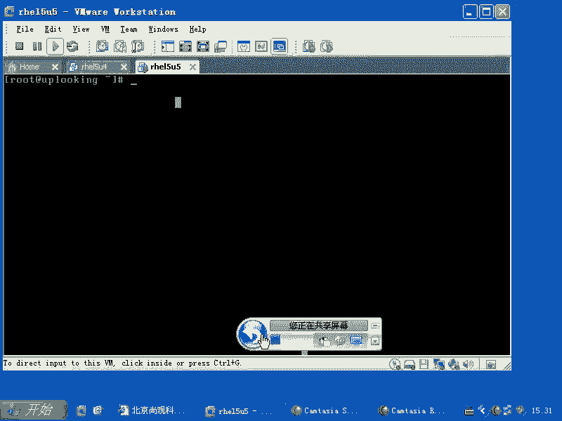
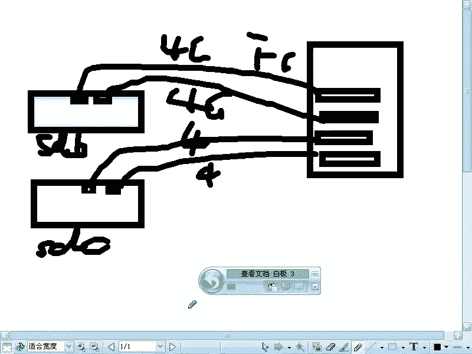
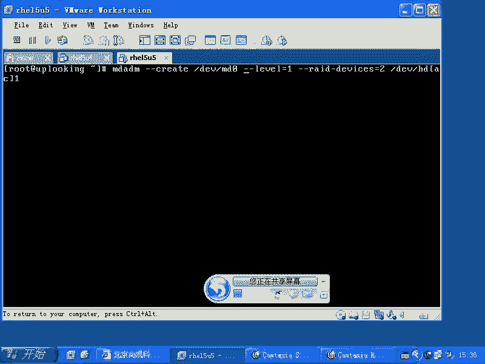
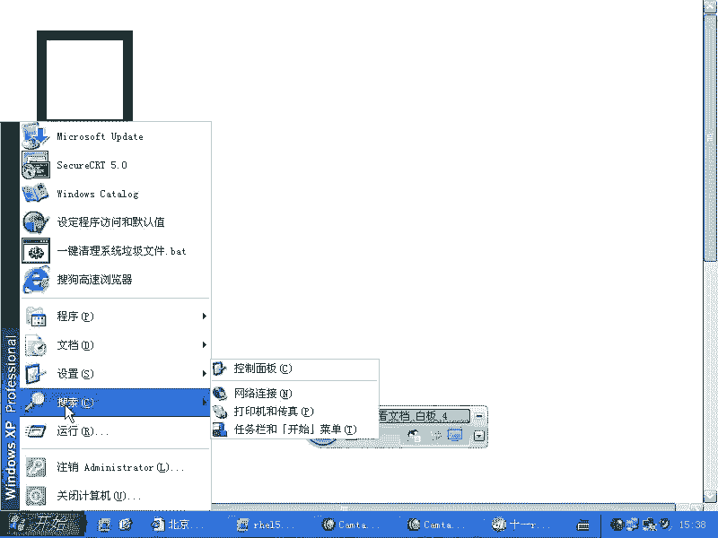
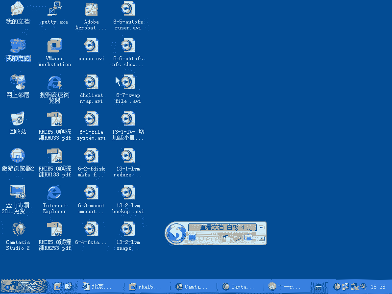
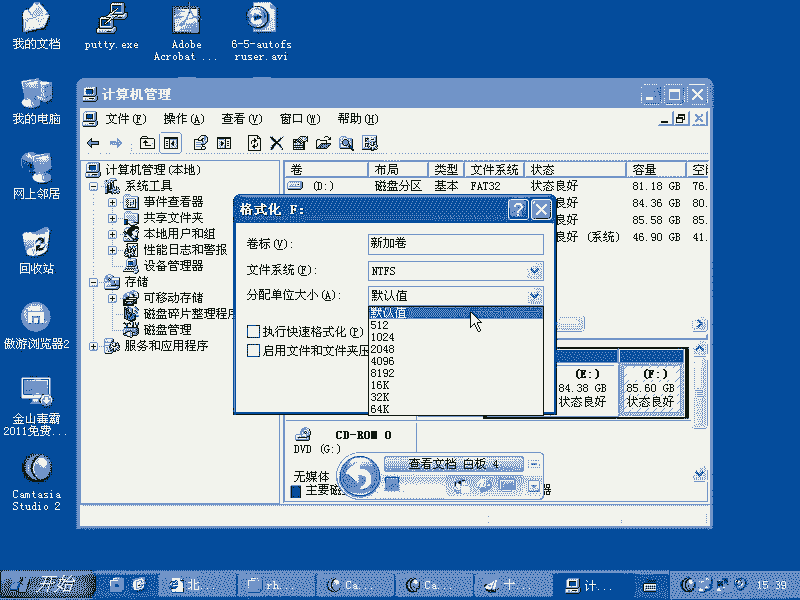
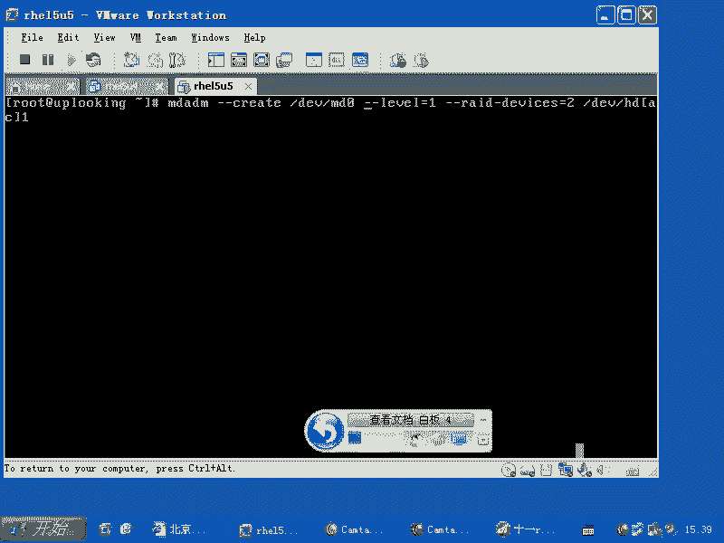
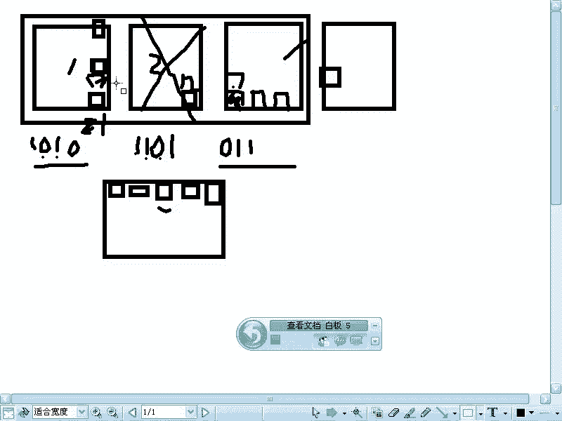
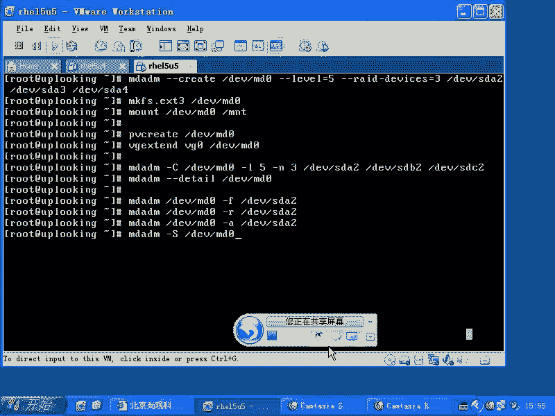

# 尚观Linux视频教程RHCE 精品课程 - P64：RH133-ULE115-12-1-mdadm-software-raid - 爱笑的程序狗 - BV1ax411o7VD

喂，我们再看一眼。就是我们的软锐的。软瑞的话呢，在我们的系统当中是一种呃。可以说是很很尴尬的一个角色，就是说你你说谁放心的会使用我们的L，就是软瑞的呢？谁会放心的使用我们的软瑞。没有人啊。

如果要是我们公司稍微有点钱的话，我们就会买硬瑞的设备，是不是有这列卡，然后呢加几块硬盘。如果没有钱的话呢，我们去用这个软锐的，它到底能给我们提供什么？就是说你软锐的话能加几块硬盘。

可能也就是呃没有瑞的卡的这种就是这个硬件是吧？没有readd的卡的硬件，就是没有办法做硬readd的这个硬件。你能差几块一。2块。EU的机器是吧，你自己传的2块。

也就是最多也有2块硬盘做一个readd0或者readd1，是不是？read0我们知道是并行是吧？就说当我们去写入一个文件的时候，它是分成两部分去写一个硬盘上写一部分，另外一个硬盘，写另外一部分。

我要写100兆的文件的话，是分成很多小块是吧？第一小块给第一个硬盘，第二小块给第二个硬盘，是不是第三个小块再给第一个硬盘这样去写。那么如果要是readd一的话，就是说镜像卷，我给第一块硬盘怎么写数据。

给第二块硬盘就怎么写。是不是？所以软锐的话，我们分析来分析去的话呢，它的应用场合的话呢，要么就是说你用的这个机器非常的廉价？非常的便宜，便宜到什么程度呢？就是说。主板上连瑞的卡都没有。

你就是现在花大约一两千块钱买一个买一个服务器的这个主板啊，就是不是我们普通的这个台式机的主板。你买服务器的主板，它一般都会带瑞d卡。他都会带锐的，所以你做这个硬锐的也没有什么没什么大不了的，对吧？

但是硬锐的话，比起软瑞的来强在什么地方呢？硬瑞的的锐的算法，它是有专门的芯片去处理，而软锐的是由CPU去处理是吧？所以我们一般来说不会去用软锐的，因为它占有CPU啊。所以的话呢当我们。

实在没有太多钱的时候，那么我们就用什么软瑞的是吧？连那个那种硬盘的话呢，都买不起的时候，呃，不是那种那个主板都买不起的时候是吧？就是PC4是吧？我们就用过软瑞的还或者干脆就是PC。还有一种可能的话。

就是说你就是PC或者就是PCserv。还有一种可能的话呢是什么？是说你太有钱了，有钱到什么程度呢？你花了非常多的价格买了一个光纤之列卡。这个光纤这类卡的话是怎么样的？这个光纤这类卡的话。

它是4G的光纤是吧？你想去买16G的。没卖的人家最厉害的什么像EM之类的公司都还没开发出来，是吧是？但是我就要数据量特别高是吧？我就要这个数据量的话呢特别的强，就是这个带宽的话呢。

4G根本就没办法满足我的要求。那我找2个HB卡来做一个什么做1个red零，也就是我找两个镇列柜，是不是？两个镇略柜，一个镇列柜。放上面一个放这两个放下面，然后我找2个HB卡或者4个HB卡。

有2个HB卡连一个镇列柜，有另外2个HB卡在另另外一个镇列柜是吧？那两个我这样画一画啊，大家可能听着听着就晕了是吧？就是说我是说当你的硬件啊，当你的硬件已经没有办法满足这个要求的时候，你比方说这样的。

我找了两个。😊。

我找了两个车叠会。这两个阵列柜的话呢，都是双。就是双光纤。呃，双光纤接口的是吧？双光纤接口的。这个时候的话呢，我这边有一台机器，这台机器上的话呢插了。呃，插了4个HBA卡。他那4个H被打。

这4个HB卡的话呢，连的线啊就说这个HB卡去连。这个HB卡连这个口是吧？这个HB卡连这个口，他们是不是4G啊？是不是4G。都是光纤是吧？FC光纤通道是不是这加起来多少G啊？😊，8G8G的话呢。

我加上去以后的话呢，给他做什么做负载均衡。负载均衡的话呢就4G加4G就8G是吧？嗯那那个模块的话可以支持，然后呢，我再去用这边的话呢，再去加，是不是这边又是8G，是不是？4G加4G是8G是吧？

我这边是一个非常非常大的一个假设是吧？但是呢你这个带宽还是不满足。于是的话，你把这两个这个贵是吧？这一个是SDB是不是？这个是SDC是不是？我把SDB和SDC变成什么呢？变成read0。

我把SDB和SDC做成瑞德林。加起来多少？16G。是不是？因为我写一个文件的时候，比方写个100G的文件的时候，最终的话呢是在SDB上写出写多少呢？写50G在SDC上又写50G是吧？

实际上我的速度话呢是翻倍的。吧？要么就是特别没钱，要么就特别有钱，特别有钱到什么呢？就是人家硬件厂商出了一个天价的硬件，你都买得起，而且还不满足你的要求。是不是这样的情况的话呢，可能也会用软瑞的。

所以两个两个两个两个地方的话呢会用软瑞的。但是呢没钱的可能性会更大，是不是？は。没钱的可能又会大更大。那我们看一下怎么样去用啊，怎么样去用。😊。

在我们的HEL4里面啊，它已经是抛弃掉了原来HEL3所用的re的工具。原来HL3里面的瑞的工具叫做什么呢？叫做re to。啊，read toth。你现在看一下这个readtth会不会装啊，应该没有装。

是不是没有装这个这个管理工具的话，已经被抛弃掉了，被谁替代了呢？被一个叫做MDat the命的这样的一个程序啊，MD at，我忘了它的包叫什么，我们看下MD开头了，是不是就叫MDADM是不是啊？

看到了吧，MD aM。这个包如果要是装上了，这个包如果装上了，那么你这里面有个最好用的工具，就是MDADM啊MDADM它这个工具的话呢可以说非常的全面，基本上就有点像什么呢？有点像IP命令一样。

IP命令是不是下面很有很多功能是吧？每个功能还可以有帮助，对不对？那你也可以这样，有经验了，是不是？是不是刚刚hel。是不是？这有经验了。然后呢，如果要是我现在的话呢，想去创建，那么杠杠。

quiit是吧，杠杠。Help。是吧就是create这个东西当中的这个就是细节的帮助，对吧？那创建的话呢，我一般的话呢不会记细节。那我是怎么记呢？我是这样记的man。

MDADM我记得MDADM里面的话呢，有一个非常好的例子，就这个蛮配置里面有个非常好的例子，大家看一下啊。😊，就在最后。因为它有很多的例子，它这个成这个进呃就是这个管理工具的话呢是比较复杂的。

你看它这边的话呢有很多例子，有一个例子的话呢就是创建的那最起码他要创建一个是吧？我们看。这能理解吧。我们把它粘贴出来啊。软瑞的设备文件就是MD0。当然了，你创建完了以后。

原本的SDB和SDC还是仍能访问。只不过你去访问强制访问的时候，会把MD的数据怎么样。破坏掉。是不是现在的话我在这里面放的MD0是一个总的设备文件。当我访问MD0的时候，它就会分开两部分去写。

或者分开多个地地方去写。我们这个readd的话呢，大家了解的有多少？

瑞的话条大家了解有多少？read它在我们的系统当中。用的非常多，有一个公司就凭借瑞的，然后呢做到了全世界最大的存储公司。这个公司叫什么呢？EMC就是瑞的技术的话呢，实际上就是EMC一开始就是推动啊。

也就是说它是凭借瑞的技术的话呢，可以说发了大财。这个公司的话呢，它的产品是极贵，特别特别贵EMC啊，它是为数不多的，剩下的几个呃就是IT公司之一。这个瑞的话是这样的，如果要是我。

如果要是我现在有一块硬盘，那么我怎么都好说，我我往里面去写数据的时候，这个数据的话呢就往这里面去写，是不是？现在的话呢，我在这里面有一个文件，这个文件的话呢是100兆，那么我就往里面去写。

但是真正去写的时候，文件系统实际上是有blog。大家知道那个blog吗？block的话呢一般是4，就是在ES30件系统里面是4K，是不是？那windows里面呢？

右击管理是不是都一样啊，所有的文件系统都一样，大家不要存在这种门户之键，是不是觉得啊lininux怎么怎么好，windows怎么怎么不好？其实windows的这个块的话呢。

它要比就是lininux里面那个块最大值的话要大很多，最大可以达到64K。也就是它是lininux的16倍。lininux最大块的16倍，就是EX3文件系统的16倍。比说NTFS的话。

它的文件系统设计的是非常不错的。

我看一下啊。还是看不清楚，还是看不明。假如说我现在。像格式化F盘。你看到这边这个默认分配单元大小了吧。明白吧？这个块的话一般我们都是什么默认值是吧？它根据你的分区的大小，自己定义什么块的大小。

但是在linux里面，它只有三个选择。1K2K4K。是吧1K2K4K。所以的话呢我们一般毫不迟疑的就全部都是什么4K。因为这个文件系统已经太老了，它应该像NTFS1样支持64K的块，是不是？但是没有。

那么我们当然其他文件系统的话，当都有。我说那个是什么意思呢？就是我们要看到真正去写入这样一个文件的时候，即使在我们单机环境呃，单硬盘的环境下，我们也不知不觉的时候，它已经分成块了，对不对？

已经分成块了。但是呢真正的话呢，在我们去写入一个更更复杂的环境的时候啊，这个现象的话呢就特别的明显。比方说有2块硬盘，那么这个时候我们这100兆文件，它首先文件系统会把它分成什么一个块，一个块，一个块。

一个块，是不是？但是呢我们的这个read的设备，假如说我们把它变成一个整整体的设备的时候，你的数据网进去去写的时候，😊，你的数据往里面去写的时候，那么它会怎么样呢？它会把它分成更大一点的款，叫做t啊。

就是叫做大块创。这个创的话一般是我们的文件系统的整数倍。这一个创口一个创它会什么呢？写在。他一个唱口段呢，他会写在什么？第一个文件里面，第二个che的话呢，它会写在什么？第二个里面。😡，第三个的话呢。

它会写在这边。第四个的话呢，它会写在这边。如果这样写的话，它就叫做什么read0。听要吧。这边的话呢，首先我这边文件系统的话呢，有这个大小有一个一个块。但是呢我整数个文件系统的话，会放到一个tck里面。

那么第一个第二个这边是第一个第二个、第三个、第四个是不是？这是read0，它的速度的话就翻倍。那么我们如果要是用的是什么呢？read一的话，那就比较简单了，是不是read一就比较简单了，它是怎么样呢？

就是说我这边的话有一个文件，这个文件的话呢，第一个tck，第二个t啊，第三个第四个这样去写写入的时候的话呢，我们的这个第一个块写在这儿。😊，这边复制第一个块是不是？这边第2块写在这儿这边复制什吗？

第二个，然后呢，第三个写在这儿，然后这边复制第三个，这样的话呢，不不管你这个硬盘坏的多大多厉害，是不是整个的分区全都烂掉了，整个的碎片就是那个硬盘的话都已经炸掉了，是吧？有盘面炸掉的这种情况都没有关系。

因为你这个数据的话完全是完整的备份，所以这种券的话呢，叫做镜像卷是吧？叫做做镜像，那么这边的话叫做什么呢？做桥带。做乔带，做镜像。但是呢这两种都是走两个极端，一个是速度极快，但是不提供任何的溶鱼。

另外一个是提供完整的溶鱼，速度反而变慢了。对不对？嗯，因为我要写一个块，然后再复制一块，这肯定要慢，多占有CPU啊。😊，但是呢后来的话我们就说有个什么情况呢？

后来的话我们这边看到的就是有一些有一些公司呃，就是像我们的这个一开始设计readd的时候，它逐步发展发展到什么程度呢？就是说我现在的话呢有3块硬盘的时候，我做一个稍微。就是稍微。

兼顾两者啊取中的这样的一种阵列，就readd2read3read4readd5。它们的话呢略微有点区别，区别不大啊。那么还是我们这边的话呢，做成read做成一个整体的readd。我现在还有一个文件的话。

往里面去写。写的时候它是怎么样去写呢？我这边有一个块，两个块，三个块，四个块，5个块是吧？第一个块写的这个地方第二个块写的，在这个地方啊，那么这个地方的话呢是做一个什么呢？这两个块的基偶校验。明白吧？

基偶校验。那么如果要是readd2readd3readd4的话呢，它们之间的区别在于什么呢？就是他们基偶校验的这种呃就是算法是不同呃，就是校验的算法不同。那么我们readd4的话是基偶校验。

像red2瑞的3的话呢，是其他的方式去校验，怎么既有校验。是怎么一回事啊？我给大家说，假如说我这个块里面的第一个数据是一是不是？第二个数据是二是吧？哎，不对啊，没有2，第一个数据是一，第二个数据是0。

第三个数据是一，第四个数据是零是吧？而这边的这个数据是什么呢？第一个数据是一，第二个数据是一，第三个数据是0，第四个数据是一，这样的话呢，我在生成第三个块的时候，第三块硬盘上的这个创作生成的时候。

它是怎么生成的？一加一是多少？😊，二是吧？二你这里面的话就是零是吧？零的话呢就是既有校验，就是它不是一个基数了，是不是？那么这边0加一是多少？😊，一是不是然后呢，这边1加0是多少？

1也就是不管你前面有多少块硬盘，这是第一块硬盘，第二块硬盘是吧？你前面如果要是有3块硬盘，有4块硬盘，反正最后加的值总是一个什么？😊，总是要不机，要不偶，是不是？嗯所以的话呢当这块硬盘坏了的时候。

假如说这块硬盘坏了的时候，那么我这边有基偶教验数据是吧？我能不能通过剩下的这个数据和这个基偶教验的数据来把这个磁盘上的这个数据推出来。😊，呃，这就是什么呢？这就是所谓的read4。

re4和readd5的区别是什么呢？就是说re4的话呢，它是把所有的机偶教验块全部都放在一个硬盘上。知道吧？这个地方全都是基有卷验块，而read德5是怎么样的？就是我第二次的话。

我这个地方就放什么基有教验块，这个正常的这个第2块这个数据的话啊，第3块数据的话，我放在这个位置。第4块数据的话，我放在什么？这个位置，明白吧？这就是readd4和readd5的区别，明白了吗？😊。

re4和red5的区别。那您觉得read4快还是red5快？red4和re德5的区别在于都是用呃，他们都是用基偶校验，只不过一个是放在单个的硬盘上，另外一个是什么？放在多块硬盘上。

就是说第一第一轮的时候，我第一个块是放在一个硬盘上是吧？第二轮的时候我。技础教验块放在另外一个硬盘上，是吧？这是red5。你们觉得放在一个硬盘上快，还是放在多个硬盘上快？多个。放在一个战块啊。

这个的话呢大家难免会有争论啊，因为什么呢？因为我们一般认为re德50要比re德4要快。因为我生成这个基偶校验块的时候，red4是不是加重的是一块硬盘的这个负担啊？

因为所有的基偶教验块生成的速度肯定要更慢一点，是不是？这个慢的话呢，是一块硬盘慢，是不是它就影响整个的性能，是不是？所以red4的话，我们一般会认为它是比较慢的。😊，是不是？

但是呢我们如果要是把这个磁盘的话呢，我们进行加强。比方说的话呢，找几个处理器单独的话就专门为它进行什么这个优化算法优化，是不是加强这块加强型的readd4，就叫我们叫加强型的readd4。这种的话呢。

反而比red5还要快。你说是不是？read5的话，每一轮是不是都要生成一个基有胶验块，它只不过放在不同的磁盘上嘛，是不是？但是呢这个生成基有胶验块的个过程能不能省？还是不能省。

只不过read4的话呢是严重拖拖慢一块硬盘是吧？但是我们这个re5的话呢是拖慢多块硬盘是不是均衡起来？但是re4的话，我们如果针对那块特别慢的硬盘来进行什么？就是增加它的这个运算处理能力，是不是？

比方说我们给他配专门的缓存，专门的什么专门的硬件是吧？专门的处理器。那这时候的话呢，这个red4加钱型的readd4反而比red5还要快，是不是？但是这是几年前的技术啊，谁知道现在的话是怎么样？

因为存储的话都特别贵啊，你要选用这种非标准的。一般我买一个置列柜以后，就是什么readd5，是不是再提供一些额外的功能。那你这边还支持加强型的readd4。那它可能就会更贵了，是不是？

所以大家以后在工作的时候可能有这样的机会去看到。那么你要知道re德4和re德5的区别在哪是吧？那么现在还有一些神经病公司的话呢，推出了red6啊，还有red7啊，这种这种的话呢，red6是怎么样呢？

就是我不止生成一个这块，我要生成两个。至少要4块硬盘来做red5的话是至少要什么呢？3块硬盘。那么re6的话至少要4块，4块硬盘是怎么样的？当我去写数据的时候，我不只要什么呢？横向的这样去写呃。

去基础校验。我还要什么呢？纵向的基础校验。😊，明白吧？我纵向的基偶校验，也就是这个磁盘上本身的基有校验块，我再放在什么呢？放在另外一块硬盘上，这个硬盘的基有校验块，我再放在另外一个硬盘上。

也就是它两次基偶校验。这样的话呢，有2块硬盘坏的时候，它都可以给你提供什么提供这个荣余。也就是它允许2块硬盘坏。😊，他都能给你恢复回来。所以这就是什么呢？这就是我们所谓的readd6。

所以red6要比red5肯定是要慢的多。而且真正的话呢，没有多少人去用。他只是说卖东西的时候的一种什么卖点是吧？你看他们还瑞德5呢。我们已经支持red6了是吧？就这样，但是你说真正有谁在用呢？

没有多少人在用。因为red6的话比较慢啊，你们不信可以试一下。但是我们说扯了那么多啊，回过头来再看我们自己的这个。😊。

我们自己的这个呃MDI的命，它就可以支持readd6。readdreadd0readd1啊re5d6都可以支持啊，readd4的话我没有注意，以前的话用的最多的可能就是red01或者说5，对吧？

re6肯定能支持我我是测试过的啊，这边的话呢，就是说你的等级有多少？这是做red一是不是？嗯那现在我想做redread6怎么办？那你就做red6好了，是吧？后面加4块硬盘或者4个分区。

是不是那如果要是你做red5的话呢，就要求至少什么3个。那这个地方的话呢，我做red5，我这边要求什么呢？3块硬盘，那这边是SD一般的话呢，你说我SDAR是吧，低一下的SD。

SDA3DB下的SDA4是不是？我这样有意义吗？😡，我用一块硬盘上的多个分区去做是吧？嗯，这是吃饱撑的啊，真是吃饱撑的。因为你硬盘坏了的话，数据也就都没了嘛。是不是你真的是没有没有必要。

因为你一块硬盘坏了以后的话呢，那么你数据还是找不回来。所以一般我们都是什么在多块硬盘上做什么read0或者read一或者read5，对不对？我找3块不同的硬盘来做，这就是我们通常的这种方法。

所以这个MD命的话呢，ADM的话呢，大家可以这样的去用啊，非常简单，这样一回车以后，那么你就可以怎么样呢，你就可以去呃，就格式化了。假如说我这样做好了是吧？那我可以怎么样呢make fS点EXT3啊。

地域下的MD0是不是？然后我就可以怎么样的mount地域下的MD0，然后mount在某个目录下，是不是？当然了，你可以怎么样呢？创建好了MD0以后怎么样呢PV。😊，create地域下的MD0，然后VG。

呃，VG啊。X ten是吧。然后呢，在VG0当中加入一个什么MD0的这样的一个物理卷，是不是这样也可以。那这样的话，LVM是不是就可以支持龙鱼了？是不是LVM就可以支持荣誉了啊，这就是我们所说的什么呢？

P就是这个软瑞的啊软瑞的软瑞的话呢，那你可以的话呢再去进行一些基本的管理。比方说MDADM是不是MDADM然后呢。

你可以加上一个杠杠什么detail是不是杠杠detail我们书上的话呢有一些不错的练习啊。😊，🤧嗯。刚才的话呢，我这边说的这个MD的命的杠杠create之类的话。

就是已经是简化这个参数可以简化到什么程度呢？这个杠杠create的话，你可以给它变成什么大C，是不是杠杠 levelvel的话可以给它简化成杠L。然后呢，杠杠杠什么dice devices的话。

可以改简化成杠N。啊，可以进化成这样的，那么就是什么呢？杠大C是吧？然后呢DEV下的MD0是不是？然后呢，杠L级别为5是不是？然后呢，杠N，然后总共有3块是吧？DV下的SDA1是吧？呃SDA比方说2吧。

然后呢，DEV下的SDB2是不是？DV下的SDC2是不是这样的话我就可以创建。创建完以后的话呢，你可以去把它删除，或者说去添加啊。😊，删除或者去添加。想看它的详细情况MD。ADM然后呢杠什么呢？

杠杠detail。啊，detail。啊。我因为以前的话用的比较多的是什么呢？就是说是。Manage。manage的话呢，它可以去你看啊如果要是你想去把这个就是说这个。整个的软瑞的停调是不是停掉。

那么是不是这边杠杠manage呃manage啊，不是managermanage，然后加上一个什么stop，是不是也可以让它是只读方式去运行，是吧？也可以的话呢去把某一个磁盘标记成什么呢？这个磁盘呃。

就是某一个分区标记成或者某个磁盘标记成坏了。刚刚fill是不是刚刚fiil，然后呢可以把它什么呢？删除掉，remove把它删除掉啊，杠A的话呢是把它什么添加回来啊，这样的话呢就是一些基本的操作。

一些基本的操作。那么简简单去写的话呢，就是如果要去简写的话，就是MDADM是吧？然后呢DV下的DV下的MD0是不是？然后呢加上一个什么杠FDV下的SDA2SDA2有问题了，我把它标记成fa有的状态是吧？

然后呢，我想把它删除掉MDADM然后DV下的MD0，然后呢，加上一个什么杠R删除掉DV下的什么SDA1是不是SD2把它删除掉。然后呢，如果我在有我在没有问题了，MDADM然后呢。

DV下的MD0是不是杠A啊，DV下的SDA2是吧？再把它添加回来，是不是替换掉以后，把它添加回来，这就是我们对它进行操作。那么如果要是你想让我们这个。😊，停掉什么MDADM应该先停掉，然后再去做是吧？

MDADM杠大SDEV下的什么MD0或者是杠杠manager杠杠stop。地域下的MD0可以看完配置。是不是？这样的话呢就是简写了啊，所以的话我们的逻辑呃就是我们的这个逻辑链管理，还有我们的软锐的。

那么是我们系统提供的一些企业级的技术。大家的话在钻它的时候的话，就会发觉这个地方是企业真正关心的存储是吧？数据安全备份恢复，是不是这些东西的话是企业比较关心的。OK有没有问题。😊，啊，有没有问题？

没问题，我看一下同学们有没有问题啊。好。

