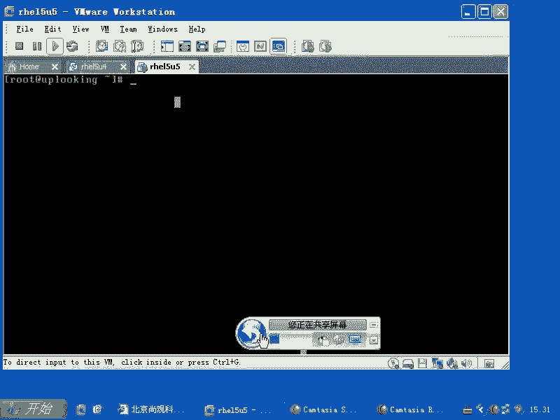
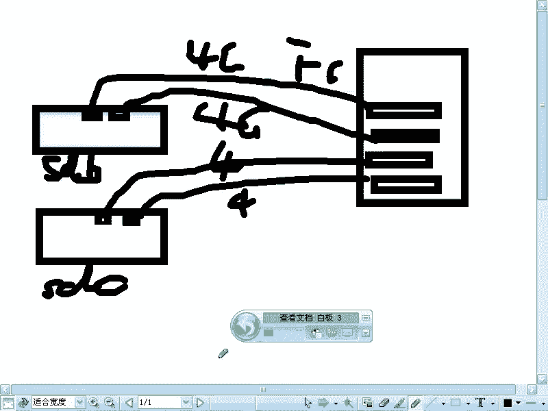
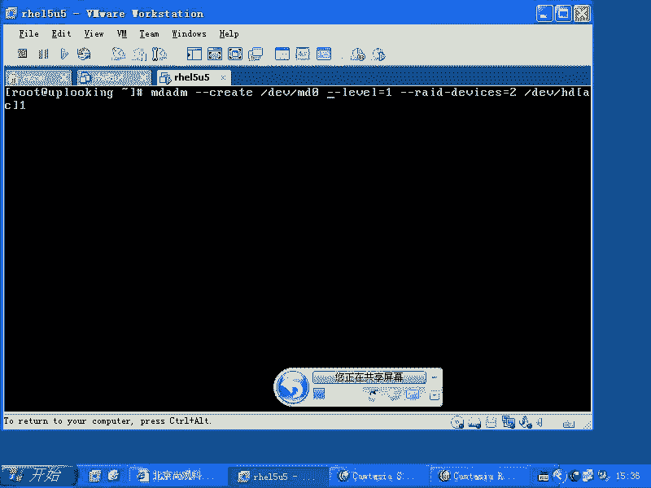
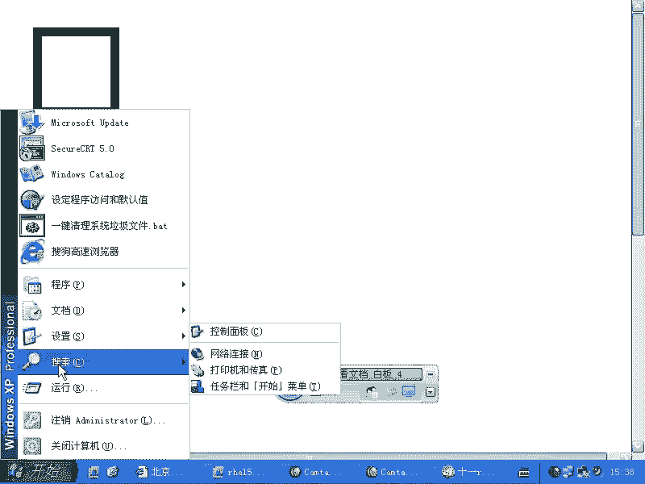
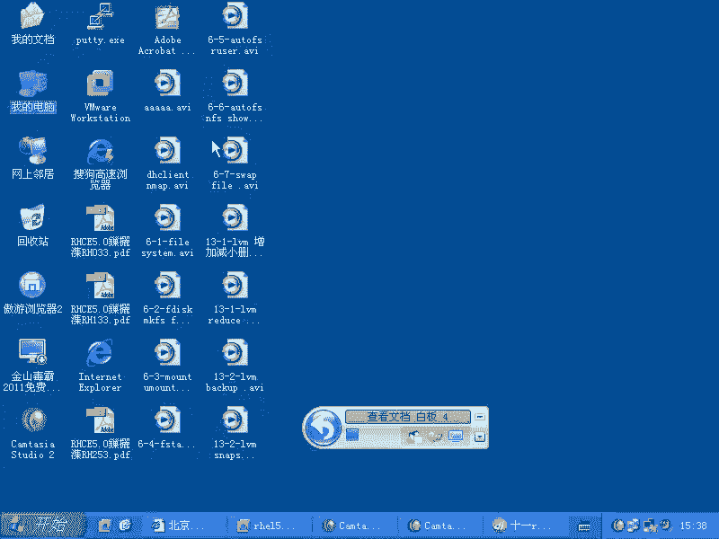
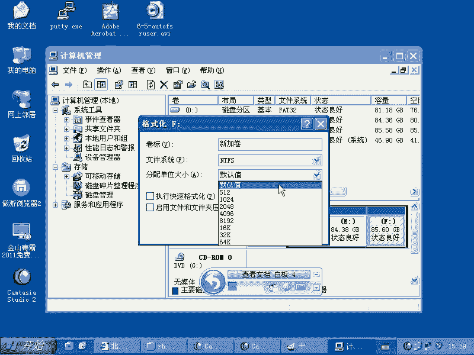
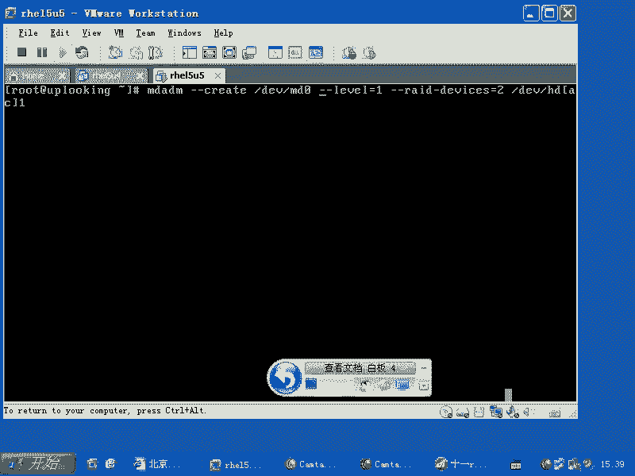
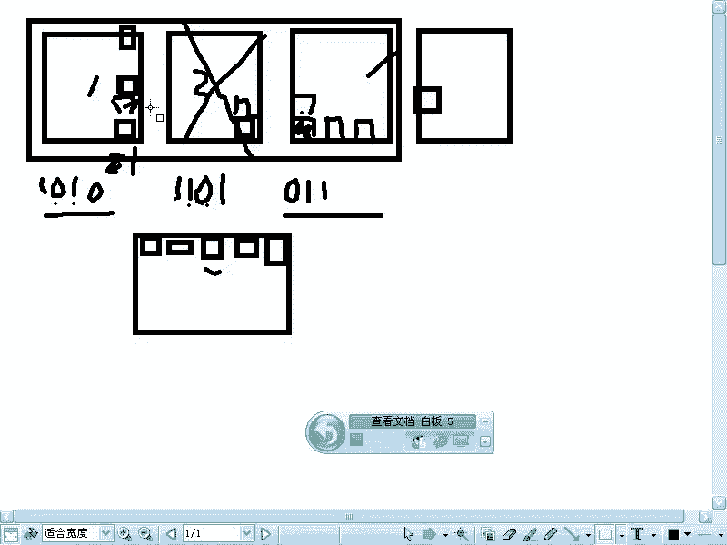
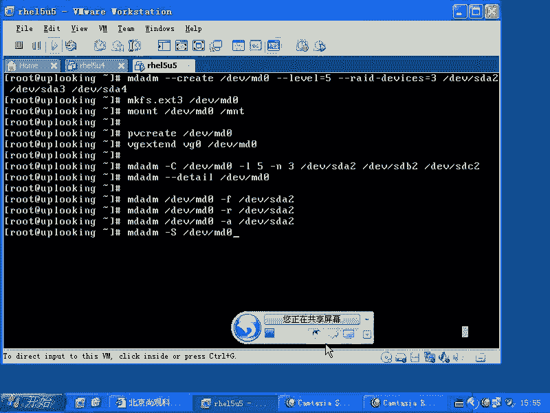

# 尚观Linux视频教程RHCE精品课程：P64：RH133-ULE115-12-1-mdadm-software-raid


在本节课中，我们将要学习Linux系统中的软件RAID技术，特别是如何使用`mdadm`工具来创建和管理软件RAID阵列。软件RAID是一种利用操作系统和CPU来实现磁盘冗余和性能提升的技术，通常用于预算有限或特定高性能需求的场景。



## 软件RAID的应用场景

上一节我们介绍了存储管理的基本概念，本节中我们来看看软件RAID的具体应用场合。软件RAID在系统中的地位有时比较尴尬。真正放心的使用软件RAID的用户并不多。



如果公司预算充足，通常会购买硬件RAID设备，例如RAID卡和几块硬盘。如果预算有限，可能会考虑使用软件RAID。软件RAID能提供什么功能呢？它允许你在没有硬件RAID卡的情况下，将多块硬盘组合起来。

通常，在没有RAID卡的廉价机器上，你可能只有2块硬盘，最多用来做RAID 0或RAID 1。RAID 0是条带化，写入一个文件时，数据被分成多个小块，交替写入不同的硬盘。例如，写入一个100MB的文件，第一块数据写入硬盘A，第二块写入硬盘B，第三块再写入硬盘A，以此类推。RAID 1是镜像卷，写入硬盘A的数据会同时写入硬盘B。

因此，软件RAID的应用场合主要有两种：要么是机器非常廉价，主板上甚至没有RAID卡；要么是硬件性能已经达到极限，需要利用软件RAID来进一步提升性能，例如将多个高速存储设备（如光纤阵列柜）通过软件RAID 0组合以获得翻倍的带宽。



## RAID技术基础



上一节我们了解了软件RAID的适用场景，本节中我们来看看RAID技术本身。RAID技术在系统中的应用非常广泛。有一家公司（EMC）正是凭借RAID技术成为了全球最大的存储公司。



RAID的基本原理如下：当只有一个硬盘时，数据直接写入。当有多个硬盘组成RAID阵列时，数据写入方式会发生变化。文件系统会将文件分成固定大小的块（Block），例如ext3文件系统通常是4KB。在RAID中，这些块会组合成更大的“条带单元”（Chunk）写入不同的硬盘。





以下是几种常见RAID级别的原理：

*   **RAID 0（条带化）**：数据被分成条带单元，交替写入所有硬盘。例如，条带单元1写入硬盘A，条带单元2写入硬盘B，条带单元3写入硬盘A，以此类推。其速度理论上可以翻倍，但不提供任何冗余容错。公式可以理解为：`总容量 = 所有硬盘容量之和`，`速度 ≈ 硬盘数量 × 单盘速度`。
*   **RAID 1（镜像）**：所有数据被完整地写入每一块硬盘。它提供了完整的冗余备份，但写入速度会变慢，因为同一份数据要写多次。
*   **RAID 4**：使用多块硬盘存储数据，并用单独的一块硬盘存储所有数据的奇偶校验信息。它兼顾了性能和一定的容错能力（允许坏一块硬盘）。
*   **RAID 5**：与RAID 4类似，也使用奇偶校验来提供容错。但区别在于，RAID 5的奇偶校验信息不是固定在一块硬盘上，而是轮流分布在所有硬盘上。这避免了单一校验盘的性能瓶颈。至少需要3块硬盘。
*   **RAID 6**：在RAID 5的基础上，使用两种独立的奇偶校验算法，允许同时坏掉两块硬盘而数据不丢失。至少需要4块硬盘。

## 使用mdadm管理软件RAID

上一节我们介绍了RAID的基本原理，本节中我们来看看如何在Linux中具体操作。在RHEL 4及以后版本中，管理软件RAID的工具从旧的`raidtools`换成了功能更强大的`mdadm`。

`mdadm`是一个集成的管理工具，功能全面。你可以通过`mdadm --help`查看主要帮助，或通过`mdadm --create --help`查看创建阵列的详细参数。

### 创建RAID阵列

以下是使用`mdadm`创建RAID阵列的基本方法。`mdadm`的man手册中有很好的示例。

创建命令的基本格式如下：
```bash
mdadm --create /dev/md0 --level=5 --raid-devices=3 /dev/sdb2 /dev/sdc2 /dev/sdd2
```
这条命令创建了一个名为`/dev/md0`的RAID 5设备，它由`/dev/sdb2`、`/dev/sdc2`和`/dev/sdd2`这三个分区组成。

创建完成后，你可以像使用普通磁盘一样对`/dev/md0`进行格式化并挂载：
```bash
mkfs.ext3 /dev/md0
mount /dev/md0 /mnt/raid
```
或者，你也可以将RAID设备作为物理卷（PV）加入到LVM中，从而让LVM也具备冗余能力：
```bash
pvcreate /dev/md0
vgcreate myvg /dev/md0
```



### 管理RAID阵列

创建阵列后，你可能需要进行日常管理，例如查看状态、标记故障盘、移除或添加磁盘。

以下是常用的管理操作：

*   **查看阵列详细信息**：
    ```bash
    mdadm --detail /dev/md0
    ```
*   **将磁盘标记为故障**：
    ```bash
    mdadm /dev/md0 --fail /dev/sdb2
    ```
*   **从阵列中移除故障盘**：
    ```bash
    mdadm /dev/md0 --remove /dev/sdb2
    ```
*   **向阵列中添加新磁盘**：
    ```bash
    mdadm /dev/md0 --add /dev/sde2
    ```
*   **停止（停用）一个阵列**：
    ```bash
    mdadm --stop /dev/md0
    或
    mdadm --manage --stop /dev/md0
    ```

命令参数通常可以简写，例如`--create`简写为`-C`，`--level`简写为`-l`，`--raid-devices`简写为`-n`。因此，创建命令也可以写成：
```bash
mdadm -C /dev/md0 -l 5 -n 3 /dev/sdb2 /dev/sdc2 /dev/sdd2
```

## 总结




本节课中我们一起学习了Linux下的软件RAID技术。我们首先探讨了软件RAID的两个主要应用场景：预算有限的廉价设备和追求极致性能的高端配置。接着，我们回顾了RAID 0、1、4、5、6等不同级别的技术原理和工作方式。最后，我们重点讲解了如何使用`mdadm`工具来创建、格式化、挂载以及管理（查看、标记故障、增减磁盘）软件RAID阵列。逻辑卷管理（LVM）和软件RAID是Linux系统提供的企业级存储技术，掌握它们对于保障数据安全、实现备份恢复至关重要。