# 尚观Linux视频教程RHCE 精品课程 - P65：RH133-ULE115-13-1-lvm-extent-reduce - 爱笑的程序狗 - BV1ax411o7VD

OK我们开始的话呢，给大家看一下LVM和sft。

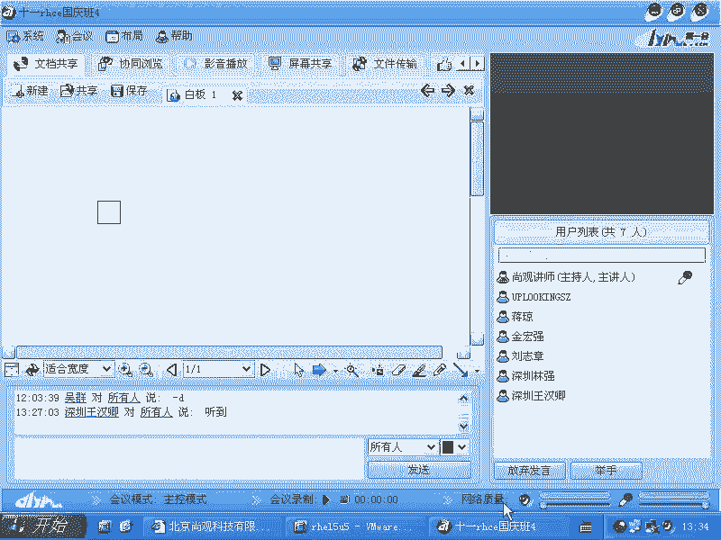

LVM的话呢，在系统当中起的作用就是在操呃文件系统和硬件之间是吧？我再加一个层次，是不是啊？那个层次的目的是什么呢？提供一个。伸缩就是说我现在这个分区。像建立文件系统，分区不可能拧开螺丝以后。

再添加几个盘片是吧？我再把分区变大点，因为我的硬盘的容量是一定的，对不对？所以我在这之上的话呢，我再加一个层次，然后可以让它非常容易的变大或者变小啊，就这样我们给大家画一下那个呃图形啊，我们看一下。

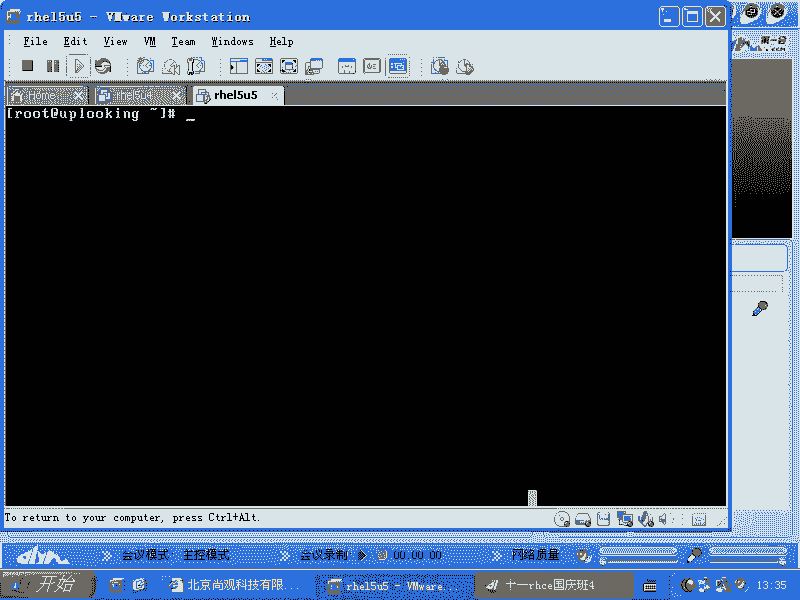

好，我还没有共享桌面啊。好。假如说现在我们有一块硬盘，比方说我现在的话呢有一个硬盘，这个硬盘里面的话，我分了一部分空间，就是我们的SDA2。然后呢，我还有个什么呢？智列会。啊，还有这内贵。啊。

这是硬盘是不是画的有点糙啊？那么现在的话呢，我们又有一个呃又有额外的一个硬盘啊。又有额外的一个硬盘，这是硬盘里面的一个分区啊，这是硬盘里面的一个分区，这些东西全部都可以放在LVM当中。什么意思呢？

就是我在上上面本来有一个文件系统啊，我在上面的话呢本来有一个呃EXT3的文件，就是文件系统创建起来了是吧？但是我创建在什么呢？比方说是。SDA2是吧？那么假如说创建在SDA2上，这个时候的话呢。

它不能提供SDR本身的话是不能提供我变大变小。你要想变大变小怎么办？那你就要用PQ magic或者等等这些工具是吧？把它变大或者变小。但是呢硬盘本身就那么大，你怎么变大？硬盘螺丝拧开放几个盘片进去是吧？

这个不太可能，所以的话我们就怎么样呢？在这之上啊，在EX3之上，我们的话呢创建一个层次呃之之下创建一个层次。这个层次是什么呢？是LVM。那么我们可以在让我们的这个文件系统基于这个层次的话呢去创建。

而不是。基于这个层次去创建，而不是直接落在什么呢？SDR上。所以这个时候的话我们看。这个东西啊这个东西叫做LEM。这个LVM下面的这个东西的话呢，叫做什么呢？PV是吧？LVM这个体系当中。

我们把不同种的PV统一变成一个叫什么东西呢？统一变成一个叫做呃VG的东西啊，VG0VG或者是V啊就VG0是我的一个给它起的名字啊，叫做VG叫做卷子。卷组的话呢是把各个PV的话呢。

怎么样把它呃就是说把它归在里面，就相当于这些东西的话，都是它的下级。对上面的人来说啊，我们这个EX3它的话呢是基于什么去创建呢？基于我们的这个VG当中的某一块这一块的话呢，假如说我把VG当中这一块的话。

我变成什么呢？变成。LVLV是不是逻辑卷是不是？就相当于现在你看一下，就相当于我们的E第3基于VGVG上的LV去创建的。那么就相当于VG就相当于个大的硬盘。是吧L后V的话呢就相当于一个分区，是不是？

就这样的一种概念。只不过的话呢，我们的E3这个文件系统，它根本就不知道什么，下面到底是SDA还是这是如果是。😊，置列柜光纤振列柜是吧？SDB是不是SDB这边是一个整个的硬盘，那这个可能是什么？

SDC也有可能是一个软锐的，就是MD0MD0是软锐的是吧？😊，啊，这就是这个的东西的基理啊，也就是以前的话呢，我们要想去创建文件系统，我们这边有个硬盘。那么这边的话呢有一个分区，这个分区是SDA2。

SDRSDA2上的话呢，直接创建一个什么呢？EXT3的分区。EX3分区的话，基于SDR。是吧直接这样，那你这个SDR能扩展的空间是多少？硬盘多大是吧？你顶多就把它所有的剩余空间全都占满，对不对？

而我们这个的话就不一定了。SD2SDBSDCMD0这些的话呢全部都可以加入到统一的一个什么卷组当中去，明白了吗？啊，然后呢在这之上的话再去创建LV。所以这就是我们在这个硬件的基础上加了一个层次。

是不是加了这样个层次的作用？那么我们看一下LVM的话呢，它的相关的命令实际上非常有特点，是不是所有有关PV的操作就是PV摁一下table键啊？我们最用的最多什么？是吧PVc等等啊，PV开头的所有文件啊。

那么如果要是我们想对卷组操作的话呢，就VGc是不是啊？然后呢，就是VG开头的所有文件啊，然后呢，接着是LV开头的是吧？LV create然后呢是LV所有文件啊，这样的话呢就是我们常见的这种命令。

你们可以自己摁一下两下配load键，然后能看到它所有的相关的命令。所以这个的话呢非常简单，是不是非常简单嗯啊，那么我们现在来一次啊，看怎么样去使用它这个LVM该怎么样去使用它。😊。

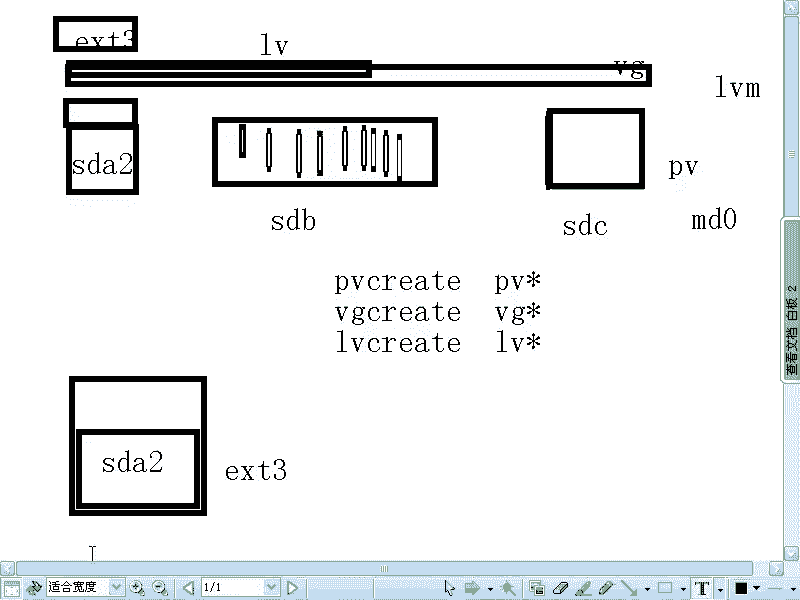

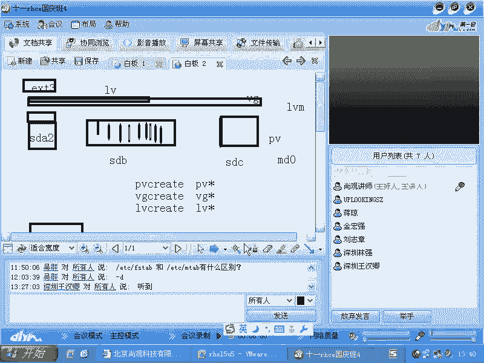

好，我们共享一下桌面啊。我们现在看到的。系统是HEL5。那么在HEL3里面的话呢，LVM就已经作为标配的话呢，在使用了，也就是用了很长很长时间，大约是。89年的时间啊，到10年的话。189年的时间。

这么长时间一直在用什么LVM。LVM的话呢，它诞生于原本的veita公司。它的话呢，现在这个技术授权给谁啊？除了有linux版本，有unux版本，像AX系统啊等等。他们都有这个LVM。同时的话呢。

AX系统它跟linux系统上的这个LVM的命令啊基本上都是相同的。连windows里面都有LVM是吧？在windows里面右击我的电脑以后啊，创建这个磁盘的时候，你可以把这个磁盘创建成什么动态磁盘。

所谓创建动态磁盘的话，就是把这个磁盘变成一个什么呢？变成1个PV。啊，就不是什么，不是C盘D盘直接基于分区了，而是做成1个PV这个PV之上的话呢，我可以再划分什么呢？划分为那个动态的这个分区，是不是？

然后我还可以把两个动态磁盘连在一起来用，是不是这就是两个PV加到1个VG里面来，你们可以自己去实验啊，那么我们看一下RPM。😊，LVM的RPM版本啊，看什么版本，你们看到看看到是什么LVM什么。

2是不是？LVM太傻了是吧？LVM2是不是？开个玩笑，LVM有一有2，他们两个的话呢，二可以非常好的去兼容一啊。但是呢如果你原来用的是R713，你现在用R715是吧。

结结果原来的LVM那些数据你还都想要，那怎么办？你要进行一下转换啊，你可以数据一下LVM是吧？LVM叫做什么呢呃。😊，诶LVM。你叫做。Vg convert啊Vg convert。看一眼啊。

他的话呢应该是可以把我们的这个版本的话呢，就是变成第二个版本啊，我们可以卖啊。危机。你看。这边的话呢是说把VG1转换成什么LVM2的格式，看到了吗？VG1原来是一个什么。LVM1是吧。

转换成LVM2非常快啊非常快。那么但是呢大家还是要做好做好什么数据丢失的准备。也就是你只要是操作存储是吧？你要大的面积操作什么存储，不管是你加载呀，卸载呀，还是说去修复错误呀，还是把它变大变小。

都要把里面的数据备份好，是吧？更别提你要整个去升级什么LVM，对吧？这边的话有个呃。😊。

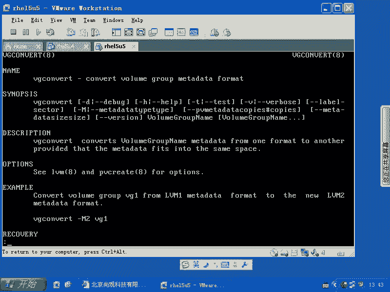

VG convert啊，那么我是由这个RPM杠QA来告诉你是什么版本，是不是？然后呢，你可以运行一个什么呢？呃，VG scan啊，那么你可以看一下呢，LVM里面就是你现在的系统里面有哪些块设备是什么。

有LVM的，它会告诉你说这个VG的话呢，有哪些哪些呃就是东西，然后呢，这个版本是什么？如果要是需要你去呃转换的话，你去怎么转换呢？就VGconver是不是这样呢去转换。

那么这边是杠M2是不是啊M two是吧？VG0是不是和VG0转换成这样的，对不对？😊，啊，这个块用在什么时候呢？就是说现在你的系统一你的数据盘是1个LVM。然后呢，你把数据盘靠呃移动到哪个地方去了。

比方说又插到另外一台机箱，或者升级了那台机器，从R713升级到R715，是不是这时候你系统支持的是LVM2是吧？而你的数据盘还是LVM1，是不是？那你要先去把LVM1的这个就LVM的话呢，给它。

搜索出来搜索出来以后的话，再把它进行什么转换啊，当然你提前要做好备份了，对不对？嗯，这是这样的。那么现在的话呢，我们要将要使用什么呢？呃使用这个呃。就是说我们系统当中的这个LVM我要从零开始创建了。

我给大家熟悉一下那些命令。首先的话是什么？呃，我用F disk。杠L我来看一下，现在的话呢有567这三个分区的话呢，是我专门用来创建什么呢？创建LVM，对不对？

那现在的话我先创建两个啊PVcatePVcreDV下的。SDA5和DV下的SDA6啊SDA6。那么我这样呢一回车创建好了以后，okK是不是然后呢再去怎么样VG。createVGcate叫做VG0啊。

我这边起名字。第一个VG的话叫VG0。当然你也可以叫VG什么00，是不是VG00都行。然后呢是D域下的SDA5和DV下的SDA6，把这两个加入到什么呢？VG0当中去，是不是然后一回车嗯。

地域下的SCro是怎么出来的？啊。😮。

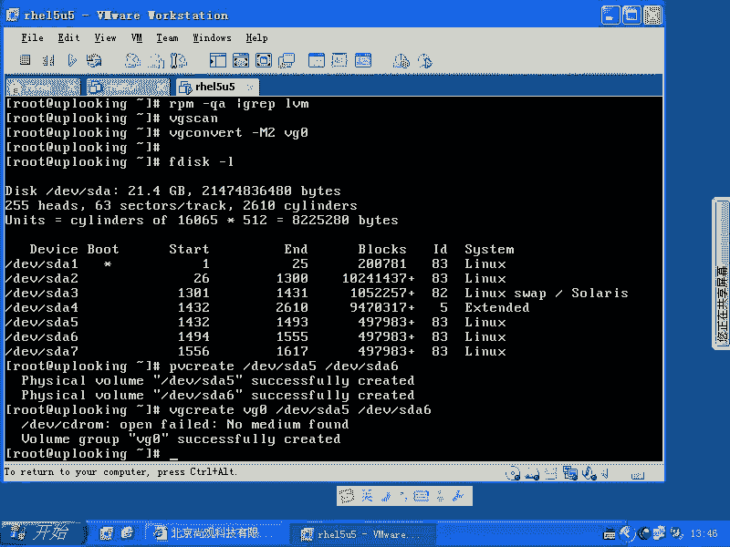

真的是奇怪啊。是不是有人登陆到我机箱？没有啊。C room。可能是auto F。啊，先先看一下啊，让才这样做是不是这样做是吧？你要看到底成功没有VG。display是不是看到这边有一个什么呢？

VG0是吧？啊，里面要多多大呢？每一个是500兆，加起来以后是说多少呢？是1G，是不是每1个500兆加起来是1G。那么你要看到这里面的话，默认有一个叫做PE的东西，是不是？PE是什么呢？

PE是默认的LVM的块。啊，它是以PE为单位的话，1块1块进行组织的，就相当于你要装什么货物，我不管。但是我的集装箱的大小是什么？一样的。明白吧？也就是说我在这个船上，我放了三个集装箱啊。

我这个集装箱的大小，我不管你这个船有多大，但是呢我放集装箱肯定是我有集装箱的整数费，是不是？那也就是说我现在的话有一个比方说800兆的，那么我每一个PE的话呢，假每一个P啊，假如说是呃。

就是假如说是400兆，哎，假如说是500兆，那么它就只能放一个P在那个，明白吗？就我1个PV就物理卷，它是800兆的是吧？假如说我1个PE的话是500兆，那它就只能放一个进去。

它的最小操作单位就是这个PE。明白了吗？那么如果要是你你的那个船要比我集装箱大很多，那么你放的集装箱也是整数的，就是整数倍是吧？我一个集装箱假如说又占4米，那就是4乘2是吧，或者4乘8或者4乘多少多少。

它总是占整数个，就是四的整数倍，是不是这个清楚了吧？这个有什么好处呢啊，你要你要你要理解这点，就是说你要理解这点PE的话呢？我们看一眼啊。

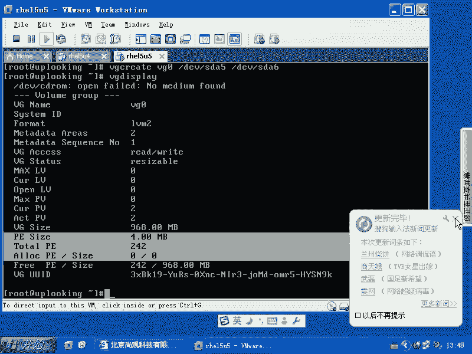

哎呦这个输入法真是麻烦啊，现在真是寸土必争必争是吧？输入法都有那么多人写啊，我们看一眼啊。这个就相当于什么？这个比较重要真的比较重要。也就是说我们画一条线。我们画一条线，这条线的话呢。

把我们跟文件系统拦截起来。文件系统的话呢相当于什么呃，相当于。比方说这边是EXT3的文件系统。EX3文件系统的话呢是基于我们下面的LVM。那么在这个LVM里面的话呢，我们看到的第一块。

我们给它分配的大小是我们的什么呢？LV是不是逻辑券。比方说L10。LV0，然后下面的话呢是什么呢？是我们的。卷组是不是？微距离。然后再下面的话呢，是我们的PV，是不是？PV这是我们的SDA2啊。

比方SDA5嘛啊这是我们的PV。那现在的问题就是说我们的这个EAT3文件系统，它不管你到底是。不管你到底是哪一块硬盘，他不管，是不是？但是呢他只知道它的这个空间是多少呢？

比方说是呃100呃就是是800兆，假如说是800兆这个EI3这个文件系统创建的时候就是800兆。但是我现在的下面的这个PV第1个PV是500兆，是不是？那这样的话呢，它是这样去存储，就是说。😊。

它这样去存储。那这时候的话我这个呃ED3，它不管下面怎么存储的。那么我们的这个LV的话呢，它就开始怎么样呢？它就开始画画框了啊，它这这样一个框。两个框。三个块，四个块。5块6块。这就是我们所谓的PE啊。

画的少，数目少了一些，是不是？但是呢我们的这个我们的这个。就是我们的这个。雷ux呃就是我们的这个像我们的所说的这个呃。就是LVM在管理的时候，他会把其中的几块是不是放到哪呢？放到这个里面，对不对？

这个操作的话呢，就是把我们和下面的LVM就屏蔽出来了。清楚不清楚？然后呢，我们还有另外一个P，我们还有另外的一个什么呃，就是PB，这是我们的SDA6，是不是SDA6。那么他会把剩余的什么呢？

就是如果要能容纳下它的话，那么他会把剩余的。这些块是不是给他放到哪呢？放到这里面来，清楚吧？这就是PE的意义。😡，PE的意义。那么也就是说实际这些块在存储的时候，比方说我这PE的话，这边放了5个块是吧？

其中我有我想把一个P移到另外一个地方去，可不可以呢？😊，那就可以。啊，那么就LBM的话，只要管理说哪个集装箱在哪个地方是吧？上面想访问，比方说上面想访问集装箱的时候，访问12345。

那么其中第三和第四放在其他的船上，这有没有问题？因为LVM那边自己做管理，是不是LVM的话呢，他知道哪些块是在哪个地方，是不是？也就是说后来的话呢，这边还有SDA6，我又把几个块移到STA6上去。

可不可以呢？可以，所以大家就要理解了LVM的最小单位应该是什么？是PE明白了吗？这一个块，一个块它到底在哪，这个是大家要知道的。那这个块的话呢，默认是4K刚才看到是4K是吧？那如果你再大点。

这个分区要再大点的话，😊，啊，在大连的话，那就是可能会达到64呃64兆啊，刚才是4兆可能会达到64兆啊。这个大家看一下man page，我记不太清楚了，但是大家刚才能看到的是什么？

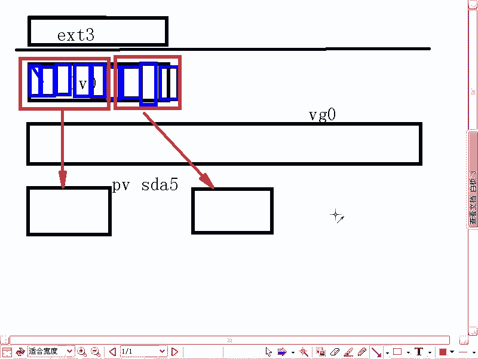

刚才大家能看到的是什么呢？是。对，就是看看到这里面的话呢，它上面写的是什么？就我现在这个一G的容量是吧，或者500兆的容量，它默认采用的PE的单位是什么？4兆。如果要特别大的话呢。

它这个单位可能就会更大。

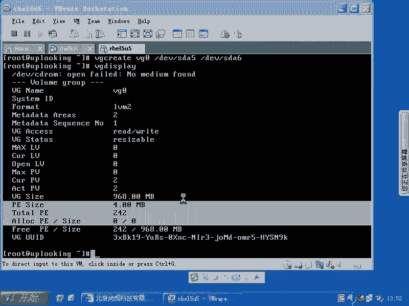

明白吧啊你存什么货物都没有关系啊，存存什么货物都没有关系。那么现在的话呢说就是有多少LV呢，有多少逻辑卷呢，还没有逻辑卷。刚才我们只是做的几步啊，一个是PVcate，一个是什么？VGc。

另外一个是什么呢？一个是呃就是VG display看一眼是不是？那你接下来可以用什么呢？LV。😊，create然 we create。那么我现在的话呢要用命令了，那么用geL是吧？

我在这个这个整个是1G的容量，这整个1G的容量。我现在的话呢想去把我变成什么呢？800兆。是吧800兆，然后呢，杠N名字的话叫做什么呢？LV0在VGVG0上创建1个LV0，名字叫做LV0的啊。

然后800兆的大小回车。他可能这个命令的话呢，要去读一下D域下载CDro。所以的话呢它呃。就是会有一个报错。但是LV0的话呢，已经创建起来了，是不是？那我在这之上的话，是不是要创建文件系统啊？😊。

那就怎么样make。FS点EXT3是不是？然后D域下的VG0当中的LLV0是不是？那么这样回车，这时候的话它创建好了。啊。对吧。这能明白吧？然后呢。

现在我就可以把它mount在DV下的VG0当中的LV0LV0mount在哪呢？我的MNT目录像啊，这样的话呢我往里面拷贝数据的话，是完全一点问题都没有。

是不是我现在的话呢copy杠R啊ETC下目的新所有文件co到MNT目录像，我就等着copy。对吧嗯我为什么要这样做呢？因为等一下的话，我们可能要做一些其他操作。这个的话呢，我们稍等一下啊稍等一下。好。

成功了是吧？拷贝完毕了，证明我们的这个东西的话是可以用的，是不是？可以用的。好，我们现在的话呢继续来使用啊继续来使用。那么现在呃这个东西只是一个最传统的使用，就是开始去用LVM了，把它做了一个文件系统。

可以用了，是不是？那现在我们LVM的主要的优势是不是还没有出来？我们可以把它自动变大变小，是不是？那现在的话我们想这样做啊？我现在的话呢想在这个VG里面再添加1个LV。假如说我现在需要把它扩到什么呢？

1。3G啊，1。3G也就是把我这个LV0的话扩展到什么呢？1。3G是不是？然后这样的话我该怎么做呢？我这样的呃。😊，PV create。啊，地域下的SDA7啊SDA7这样的回车创建好了，是不是？

VG的话他想去扩展。VG啊扩展啊命令。然后呢，在VG0上把DV下的SDA7扩展起来，是不是扩展起来。然后呢，我在这边的话呢去回车啊，回车。把它添加上去VG0的话呢，你再去看VGdisplay啊。

VG displayplay。然后你再去看这个的话呢，现在已经到了1。42G是不是1。42G，刚才是0。9什么什么G，是不是就将近1G。那么现在是1。4G1。4G的话呢，我想把我现在LV的话呢进行扩展。

现在的话我还可以用什么？刚才是VGdi是吧？那我想看LV的大小呢，LV displayplay。那你看LV的话呢，现在是刚才是800兆是不是？现在的话呢，我们看。😊，现在是800兆，然后呢。

我们现在看使用了多少D呀。使用了多少呢？使用了。啊，使用了100多兆是吧，使用了100多兆。那我们现在的话呢是800兆，这边能看得明白，是不是能看得明白，这个地方是800兆。这个地方是806是吧。

也是相当于800张，这大家记住了是吧？OK我们来看一眼啊。😊，现在的话我们就是LV啊EFTED是吧，杠L啊，然后呢是什么加对吧？加加多少呢？加。然后再加400兆，是不是？

DV下的VG0当中的LVLV0是不是？这回车。变大了吧。好。看刚才那两个数值啊，第一个是什么呢？第一个是LV displayplay，是不是？是不是1。2G了是吧，1。17是吧？没有问题。

然后我们再看DF。多少张？还是一样的是吧？没变啊，什么原因没有变呢？就是回过头来的话呢，看一眼我们的那个。

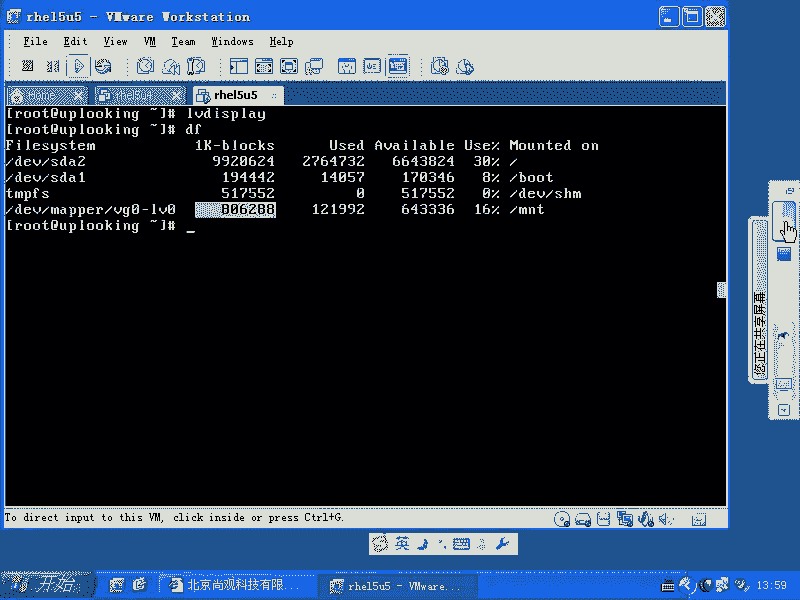

我手机放到旁边有干扰，现在还有干扰吗？我手机没放旁边，放我裤兜里了。开玩笑啊，就说那个。就说是是应该没有没有太干扰但在。

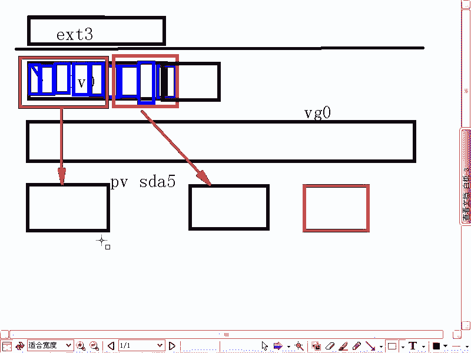

好，不对对。对方不。家系统还认为自己是1。2T是吧？结果你把人家的一G已经弄走了是吧？你想那个文件系统不崩溃才怪。是不是这样？所以的话呢我原来就总是犯这种错误啊，这种特别愚蠢的错误。

但是你在真正生产系统上的时候，那是肯定是不能这样做的。甚至生产系统上的话呢，减小的操作你都是非常慎重。就是不要去，即使正确的方式也非常正常。那正确的方式是怎么样呢？就是这样的，我先不检什么LV是吧？

我先检文件系统是吧？那我去增加的时候是反过来的，是不是减少的时候，我就应该先减文件系统再减什么LV是不是？那我这样的resize。e twoFS是吧，然后呢。

把我第一V下的VG0当中的LV0是不是减到多少呢？减到180兆。是吧。😡，在线的缩讲是吧？是在这个范围之内的话呢，才能支持，是不是？如果要是你想大于这个范围之内的话，想把它缩小了。

那就必须得先什么卸怠是吧？然后呢，我再去运行这个命令，对不对？再去运行这个命令。你看e toFSCK是吧，干F参数干什么用的？OK现在的话呢他把它减小了，是不是？😊。

我们可以通过一个命令来确认一下是不是减小了。我们通过呃D。是不是？刚才没有下载。漫GV下目的VG0W众的LV0是那的端机录像。这下来以后你再。要不吧。180兆。刚才是一点半晋升，刚把。减少这个后话呢。

它现在是这么多个brolock，这么多个brolock减少了以后。我们看了再去。首先当庭事实。减讲不允许是不是不允许，他当时我直接减讲的话。啊非常小，这个分区的话非常小才行，在一定范围之内才可以。

是不是？所以说话我们就。一万让他1万到他以后他再去减想，又不行示了，他要求我们相去怎么样。先去检测下那系统是吧，先走。去。法去执行。然后再去怎么样，再去把它减小到多少多少。这个时话我运行一下DI。

他们第一大规这。是吧，放在某个录下。发票。设法去减什么我的。LV是吧，逻辑卷。我是把们店技能减小啊。文件系统减小了以后，然后下面的那个LV to才能缩小，是不是？那么我们这样的啊呃输入一个。好的。是吧。

搞要。然后呢，是100啊是1G是吧？我是打算把一G的容量都缩回来，是不是？一G的话呢，还给我们的LV还给我们的啊，还给我们的VG是吧？LV0上本来是1。2G，现在我已经缩短到什么呢？1。8。嗯。

180兆，然后呢，剩下空余的话呢是呃一G多点是吧？我现在的话呢把它一G的话呢还给LV呃还给VGLV的话呢就变成200兆左右。RV变成200兆左右，然后呢，是DV下的。

DV下的VG0当中的LV0LV0本来是1。2G是吧？现在直接回车。然后缩小成功，对吧？但是真正的话呢，在生产系统上，你做的这种缩小的工作简直是太少了。太少了。然后呢，你如果要是像我刚才犯错误那样。

先减什么LV没有减文件系统，先减的LV是吧？那个文件系统肯定就崩溃。肯定崩溃，他要检测文件系统，检测文件系统过不去的话，那个数据的话你就很难恢复回来。嗯。明白了吧？嗯。

所以他呢正常的这个减少的话是这样一个过程。那么这段的话呢复制一下啊。然后呢再去减少，对不对？现在的话呢我现在的话呢又想我为什么想去减一G的容量呢？因为我现在发现一个问题，我有块硬盘可能坏了。

我有块硬盘坏了，那这块硬盘你想不想把它去掉？想去掉是吧，那怎么样？PV啊呃。木。第V下的是么？SD。呃，SDA什么6是不是我刚才是不是有三个分区在呃三个三个这个三个这个物理卷在这里面用。

VGdiplay是不是VG displayplay我们看到的话呢，现在总共是1点。4G是吧，然后呢，我可以用什么呢？VG display也可以用PVdiplay是不是？

这边的话呢总共是SDA6SDA7是不是还有什么呢？还有。还是SDA5是不是？然后呢，我用什么呢？PV幕SDA6，我把SDA6，我说假如说这是块硬盘的话，它硬盘坏了是吧？或者个硬盘太慢是吧？我不想再用了。

那我这样PV幕。他好像说已经是占用了一段空间啊。而是SD6还是没有没有取消掉。

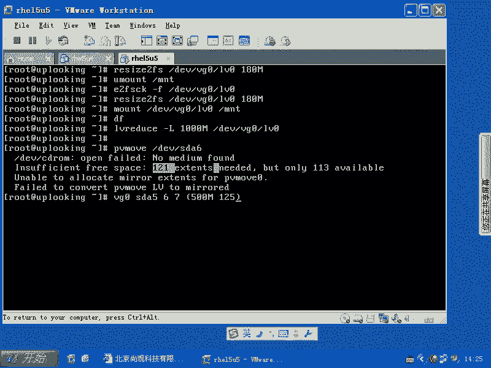

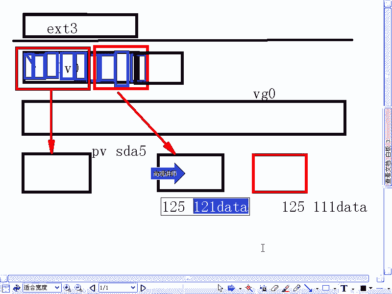

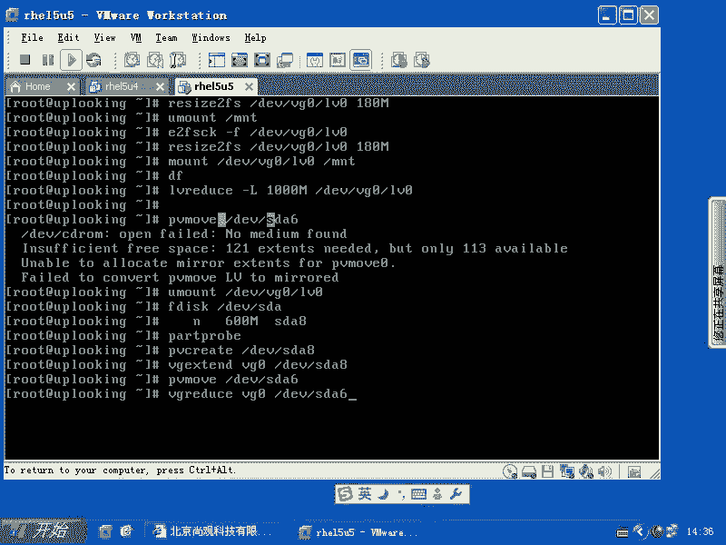

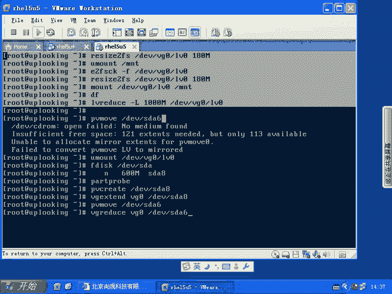

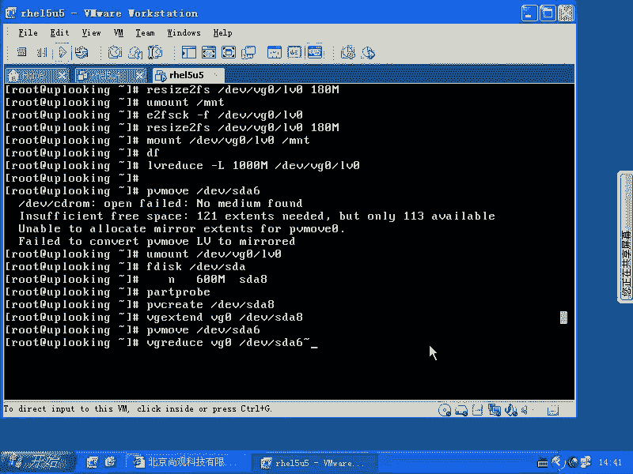