# 尚观Linux视频教程RHCE 精品课程：P65：RH133-ULE115-13-1-lvm-extent-reduce


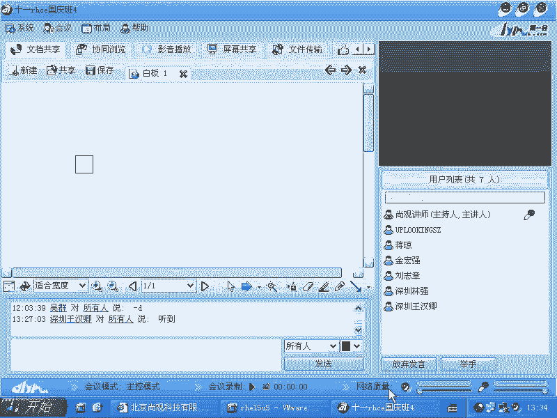

## 概述
在本节课中，我们将学习Linux逻辑卷管理器（LVM）的核心概念与基本操作。我们将了解LVM的架构、工作原理，并实践如何创建、扩展和缩减逻辑卷，包括如何安全地从卷组中移除物理卷。

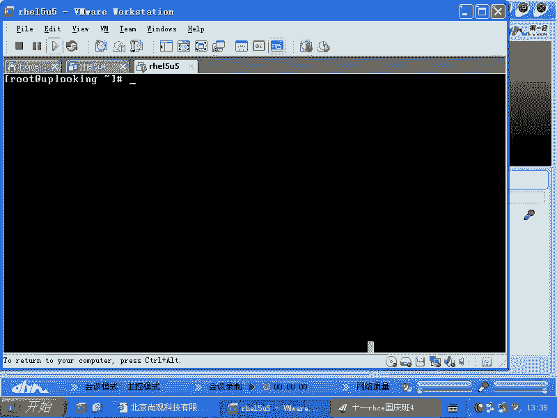

## LVM的作用与架构

上一节我们介绍了存储管理的基本概念，本节中我们来看看LVM如何工作。

LVM在操作系统中的作用是在文件系统和物理硬件之间增加一个抽象层。这个抽象层的目的是提供存储空间的**弹性伸缩**能力。传统的分区一旦创建，其大小就被固定，难以直接调整。LVM通过引入新的管理层，使得存储空间可以更容易地扩大或缩小。

我们可以通过一个图形来理解LVM的架构。

假设我们有一块硬盘，上面有一个分区 `/dev/sda2`。此外，我们可能还有额外的硬盘或分区，例如 `/dev/sdb1` 或一个软件RAID设备 `/dev/md0`。

在传统方式中，文件系统（如EXT3）直接创建在分区（如 `/dev/sda2`）之上。这种方式下，文件系统的大小受限于底层分区，而分区的大小又受限于物理硬盘的容量，难以灵活调整。

LVM的解决方案是：在这些物理存储设备之上创建一个统一的**卷组（Volume Group, VG）**。物理设备（分区或整个磁盘）首先被初始化为**物理卷（Physical Volume, PV）**，然后加入卷组。最后，在卷组之上划分出**逻辑卷（Logical Volume, LV）**，文件系统则创建在逻辑卷之上。

因此，对于上层的文件系统而言，它只是基于一个名为 `LV` 的“分区”创建的，而无需关心底层到底是 `/dev/sda2`、`/dev/sdb1` 还是 `/dev/md0`。卷组就像一个大的“存储池”，逻辑卷则是从这个池中划分出来的“分区”。这样，我们就实现了在硬件基础上增加一个灵活的抽象层。

## LVM命令特点与版本

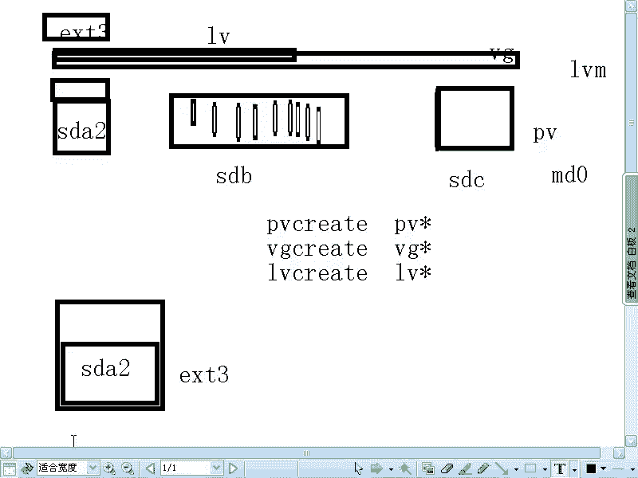

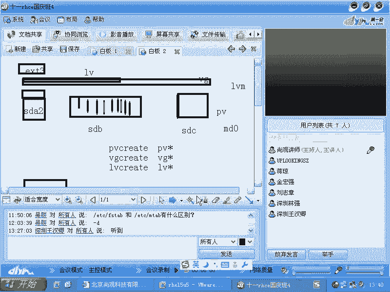

理解了LVM的架构后，我们来看看如何操作它。LVM的命令设计非常有规律。

所有与物理卷（PV）相关的操作命令都以 `pv` 开头，例如 `pvcreate`。
所有与卷组（VG）相关的操作命令都以 `vg` 开头，例如 `vgcreate`。
所有与逻辑卷（LV）相关的操作命令都以 `lv` 开头，例如 `lvcreate`。

在终端中按两下 `Tab` 键，可以看到所有相关的命令，这使学习和记忆变得非常简单。

LVM技术历史悠久，在RHEL 3中就已作为标配。它最初来源于Veritas公司，现在已授权给包括Linux、Unix（如AIX）乃至Windows在内的多种系统使用。Windows中的“动态磁盘”功能在概念上与LVM类似。

当前主流版本是LVM2，它可以很好地兼容旧版的LVM1。如果你需要将LVM1格式的卷组升级到LVM2，可以使用 `vgconvert` 命令。

```bash
vgconvert -M2 vg0
```

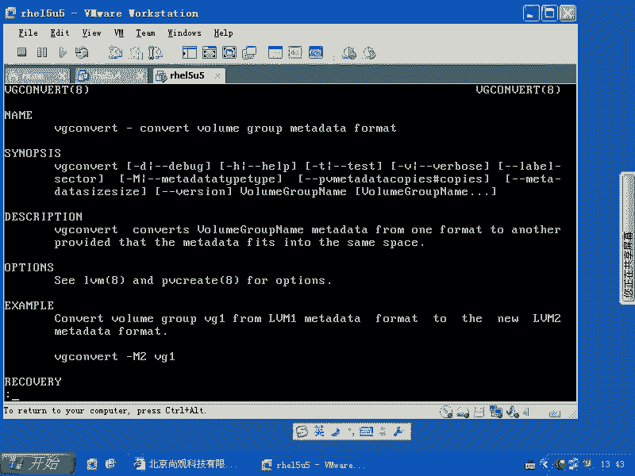

此命令将名为 `vg0` 的卷组从LVM1格式转换为LVM2格式。**注意：在对存储进行任何重大操作（如格式转换、扩容、缩容）前，务必做好数据备份。**

## 实践：创建与使用LVM

理论介绍完毕，现在让我们动手实践，从零开始创建并使用LVM。

首先，我们查看现有磁盘分区。假设 `/dev/sda5`、`/dev/sda6`、`/dev/sda7` 是预留用于LVM的分区。

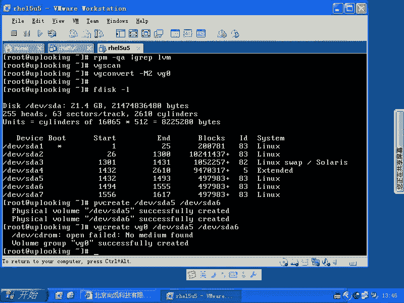

以下是创建和使用LVM的基本步骤：

1.  **创建物理卷（PV）**：将物理分区初始化为LVM可用的物理卷。
    ```bash
    pvcreate /dev/sda5 /dev/sda6
    ```

2.  **创建卷组（VG）**：将物理卷加入一个新的卷组，这里命名为 `vg0`。
    ```bash
    vgcreate vg0 /dev/sda5 /dev/sda6
    ```
    使用 `vgdisplay` 命令可以查看卷组详情，包括其总大小和**物理块区（Physical Extent, PE）**的大小。PE是LVM管理空间的最小单位，类似于集装箱，所有存储分配都以PE的整数倍进行。

3.  **创建逻辑卷（LV）**：在卷组中划分一个800MB的逻辑卷，命名为 `lv0`。
    ```bash
    lvcreate -L 800M -n lv0 vg0
    ```

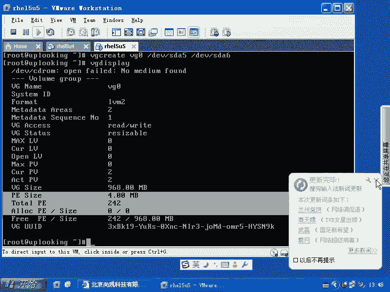

4.  **创建文件系统**：在逻辑卷上创建EXT3文件系统。
    ```bash
    mkfs.ext3 /dev/vg0/lv0
    ```

5.  **挂载并使用**：将逻辑卷挂载到目录（如 `/mnt`）并拷贝数据测试。
    ```bash
    mount /dev/vg0/lv0 /mnt
    cp -r /etc/* /mnt/
    ```

## 核心概念：物理块区（PE）

在扩展或缩减卷之前，必须深入理解PE的概念。

文件系统（如EXT3）基于逻辑卷（LV）创建。逻辑卷则从卷组（VG）中分配空间，而卷组由多个物理卷（PV）组成。

LVM在管理时，会将逻辑卷的空间划分为一个个连续的PE。这些PE可以来自卷组中的任何一个物理卷。LVM内部维护着一个映射表，记录每个PE实际存放在哪个物理卷上。对于上层的文件系统来说，它看到的是一个连续的空间，完全感知不到底层的PE可能分散在不同的物理硬盘上。这种机制使得数据迁移和空间调整成为可能。

默认的PE大小通常是4MB。在创建卷组时，可以通过 `-s` 参数指定PE大小。

## 实践：扩展逻辑卷

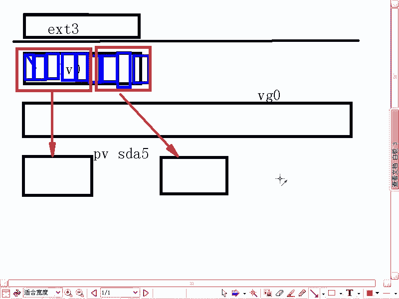

LVM的主要优势在于动态调整。现在，我们将演示如何扩展存储空间。

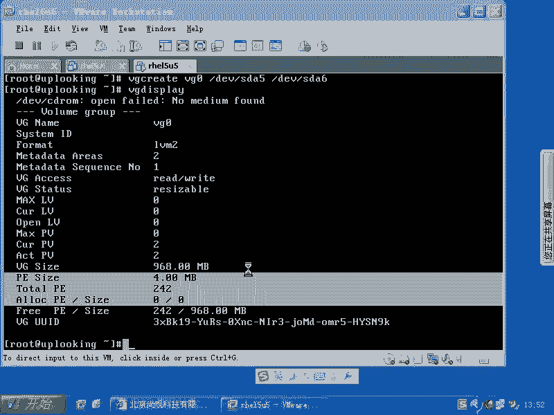

1.  **扩展卷组**：将新的物理分区 `/dev/sda7` 加入卷组 `vg0`。
    ```bash
    pvcreate /dev/sda7
    vgextend vg0 /dev/sda7
    ```
    使用 `vgdisplay` 确认卷组容量已增加。

2.  **扩展逻辑卷**：将逻辑卷 `lv0` 的大小增加400MB。
    ```bash
    lvextend -L +400M /dev/vg0/lv0
    ```
    使用 `lvdisplay` 可以看到逻辑卷容量已变为1.2GB。

3.  **扩展文件系统**：**关键步骤**。仅扩展底层的逻辑卷，文件系统并不会自动感知到空间变化。必须使用 `resize2fs` 命令来扩展文件系统，使其占用所有可用的逻辑卷空间。
    ```bash
    resize2fs /dev/vg0/lv0
    ```
    执行后，使用 `df -h` 命令查看，文件系统的大小才会显示为扩容后的值。

## 实践：安全缩减逻辑卷

缩减操作风险较高，必须严格按照顺序进行，否则可能导致数据丢失。正确的顺序是：先缩减文件系统，再缩减底层逻辑卷。

**警告：生产环境中进行缩容操作需极度谨慎，并务必提前备份数据。**

假设我们需要将逻辑卷从1.2GB缩减到约200MB。

1.  **卸载文件系统**：首先卸载逻辑卷。
    ```bash
    umount /dev/vg0/lv0
    ```

2.  **检查文件系统**：强制检查文件系统。
    ```bash
    e2fsck -f /dev/vg0/lv0
    ```

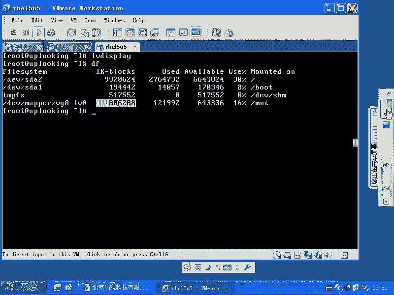

3.  **缩减文件系统**：将文件系统大小缩减到180MB（为后续操作留出余量）。
    ```bash
    resize2fs /dev/vg0/lv0 180M
    ```

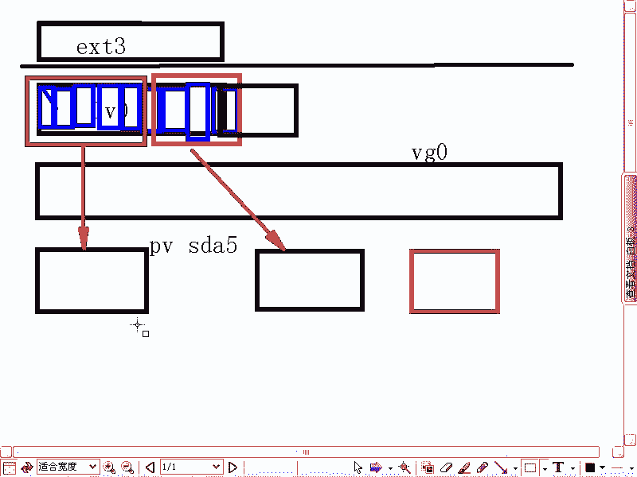

4.  **缩减逻辑卷**：将逻辑卷的大小设置为200MB。
    ```bash
    lvreduce -L 200M /dev/vg0/lv0
    ```

5.  **重新挂载**：操作完成后，可以重新挂载并使用。
    ```bash
    mount /dev/vg0/lv0 /mnt
    ```

**切记错误的操作顺序**：如果先执行 `lvreduce` 缩减逻辑卷，而文件系统仍认为自己在更大的空间上，将会导致文件系统崩溃和数据丢失。

## 实践：从卷组中移除物理卷

有时需要将一块硬盘（如已损坏或太慢）从卷组中移除。

在移除物理卷前，必须确保该物理卷上的所有PE都已被迁移到卷组内的其他物理卷上。使用 `pvmove` 命令可以完成数据迁移。

例如，我们想将 `/dev/sda6` 从 `vg0` 中移除：

1.  **迁移数据**：将 `/dev/sda6` 上的所有数据迁移到卷组中的其他物理卷上。
    ```bash
    pvmove /dev/sda6
    ```
    此命令可能需要一些时间，取决于数据量大小。

2.  **从卷组中移除**：数据迁移完毕后，将其从卷组中移除。
    ```bash
    vgreduce vg0 /dev/sda6
    ```

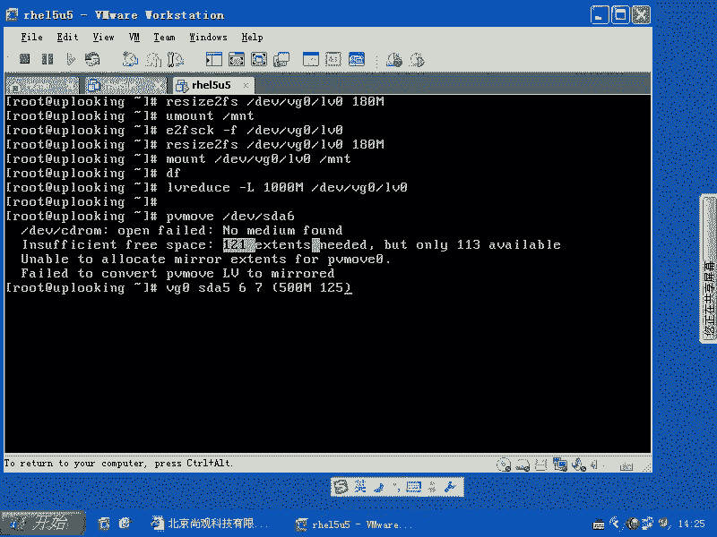

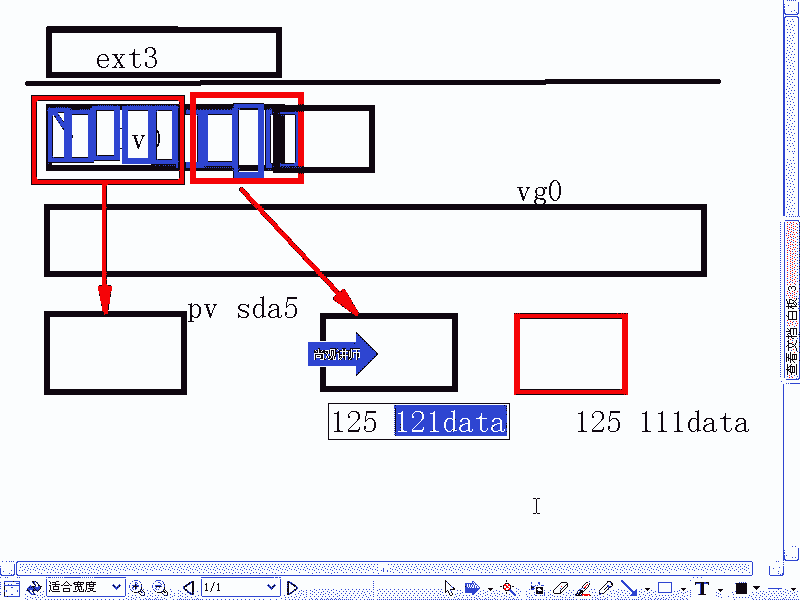

3.  **删除物理卷属性**（可选）：如果该磁盘不再用于LVM，可以删除其物理卷属性。
    ```bash
    pvremove /dev/sda6
    ```

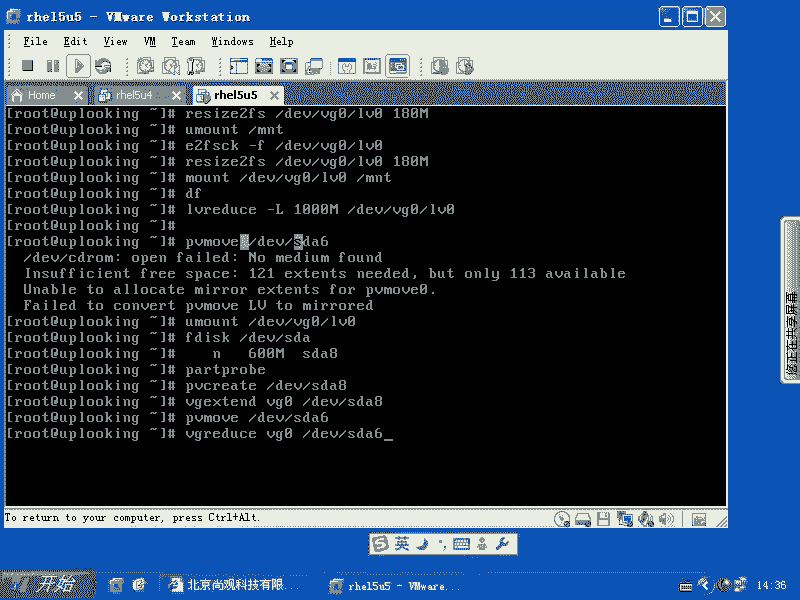

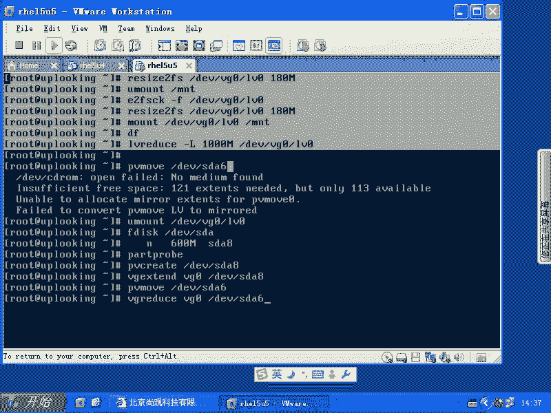

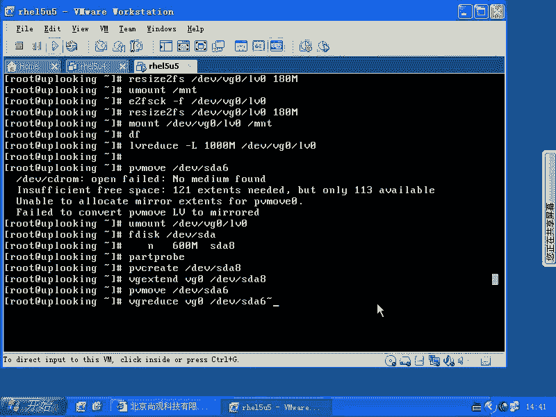

## 总结
本节课中我们一起学习了Linux逻辑卷管理器（LVM）的核心知识与操作。我们了解了LVM通过引入卷组和逻辑卷层，为文件系统提供了灵活的存储空间管理能力。我们实践了使用 `pvcreate`、`vgcreate`、`lvcreate` 创建LVM，使用 `lvextend` 和 `resize2fs` 扩展存储空间，并重点掌握了安全缩减逻辑卷的严格步骤：先卸载、检查并缩减文件系统，再缩减逻辑卷。最后，我们还学习了如何使用 `pvmove` 和 `vgreduce` 从卷组中移除物理卷。记住，对存储进行操作时，始终将数据备份放在第一位。