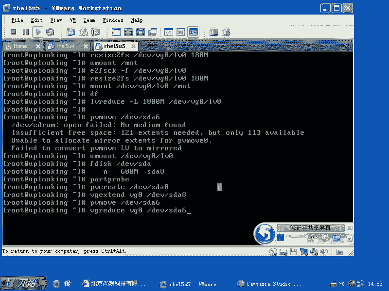
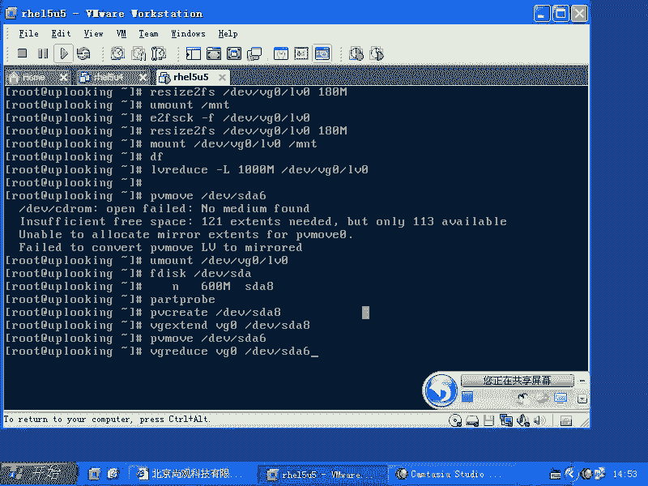
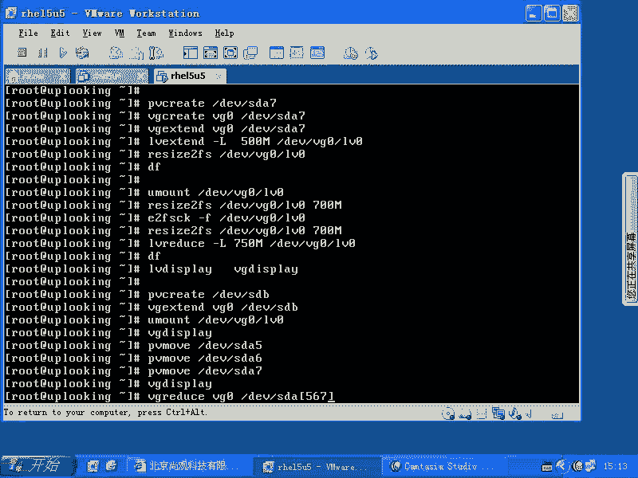

# 尚观Linux视频教程RHCE精品课程：P66：RH133-ULE115-13-2-LVM缩减与PV移动






## 概述
在本节课中，我们将学习LVM（逻辑卷管理）的两个高级操作：如何缩减逻辑卷的大小，以及如何将数据从一个物理卷移动到另一个物理卷，以便移除旧的物理卷。这些操作对于动态管理存储空间至关重要。

上一节我们介绍了LVM的基本创建和扩展操作，本节中我们来看看如何进行反向操作，即缩减和移动数据。

---

## LVM基本使用回顾
LVM的基本使用流程可以总结为以下几个步骤。

以下是创建和使用LVM的基本命令序列：
1.  **检查LVM版本**：`vgscan`
2.  **创建物理卷（PV）**：`pvcreate /dev/sda5 /dev/sda6`
3.  **创建卷组（VG）**：`vgcreate vg0 /dev/sda5 /dev/sda6`
4.  **创建逻辑卷（LV）**：`lvcreate -L 1G -n lv0 vg0`
5.  **创建文件系统**：`mkfs.ext3 /dev/vg0/lv0`
6.  **挂载使用**：`mount /dev/vg0/lv0 /mnt`

在实际生产环境中，通常不会将裸磁盘直接加入LVM，而是先通过RAID（如软RAID `md0` 或硬RAID）提供冗余保护，再将RAID设备作为物理卷加入LVM，以提高数据可靠性。

---

## 扩展逻辑卷容量
在回顾了创建之后，我们来看看如何扩展一个已存在的逻辑卷。这是LVM最常用的功能之一，并且可以在线完成，无需卸载文件系统。

以下是扩展逻辑卷的步骤：
1.  向卷组添加新的物理卷：`vgextend vg0 /dev/sda7`
2.  扩展逻辑卷的大小：`lvextend -L +500M /dev/vg0/lv0`
3.  扩展文件系统以使用新增空间：`resize2fs /dev/vg0/lv0`

**注意**：扩展操作的最后一步是扩大文件系统，这样才能让操作系统识别并使用新增的容量。

---

## 缩减逻辑卷容量
与扩展相比，缩减逻辑卷是一个更谨慎的操作，因为它存在数据丢失的风险。操作顺序与扩展相反，并且**必须**先卸载文件系统。

以下是缩减逻辑卷的步骤：
1.  卸载文件系统：`umount /mnt`
2.  强制检查文件系统：`e2fsck -f /dev/vg0/lv0`
3.  缩小文件系统：`resize2fs /dev/vg0/lv0 700M`
4.  缩小逻辑卷：`lvreduce -L 700M /dev/vg0/lv0`
5.  重新挂载文件系统：`mount /dev/vg0/lv0 /mnt`

**核心概念**：操作顺序至关重要。必须先缩小文件系统，然后再缩小底层的逻辑卷。如果顺序颠倒，会导致数据损坏。命令中的 `700M` 应确保大于当前已存储数据的总和。

---

## 移动数据并移除物理卷
有时我们需要将数据从旧的或需要更换的硬盘上移走。这需要使用 `pvmove` 命令将物理卷上的所有数据块（PE）移动到卷组中的其他物理卷上。

以下是移动数据并移除物理卷的步骤：
1.  确保卷组中有其他物理卷且有足够空闲空间容纳要移动的数据。
2.  使用 `pvmove` 命令迁移数据。例如，将 `/dev/sda5` 上的数据全部移走：
    ```bash
    pvmove /dev/sda5
    ```
3.  从卷组中移除空的物理卷：
    ```bash
    vgreduce vg0 /dev/sda5
    ```
4.  如需移除多个物理卷，重复执行 `pvmove` 和 `vgreduce` 命令即可。

**核心概念**：`pvmove /dev/sda5` 命令会将指定物理卷上所有已使用的物理区块（PE）自动迁移到卷组内其他有空闲空间的物理卷上，无需手动指定目标位置。

---



## 总结
本节课中我们一起学习了LVM的两个高级管理操作。我们首先回顾了LVM创建和扩展的基本流程。然后，详细讲解了如何安全地**缩减逻辑卷**，重点是牢记“先缩小文件系统，再缩小逻辑卷”的操作顺序。最后，我们学习了如何使用 **`pvmove`** 命令将数据从一个物理卷迁移出去，以便**移除旧的物理卷**。掌握这些操作能使你更灵活、更安全地管理服务器存储空间。