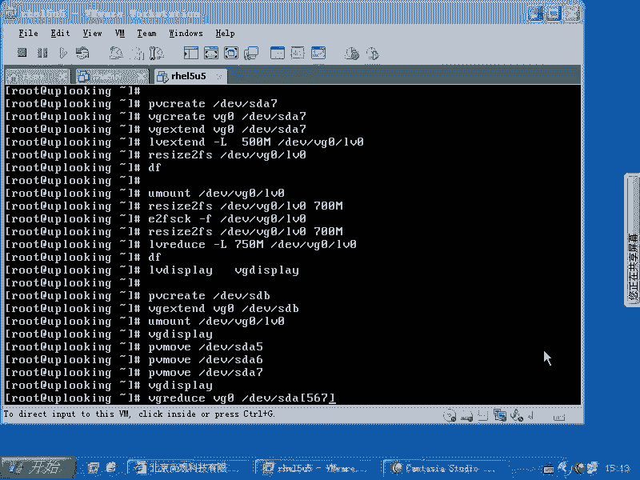
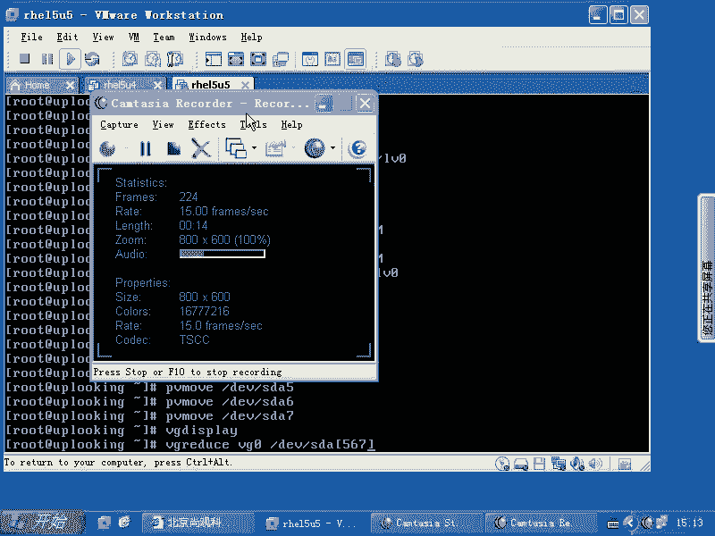
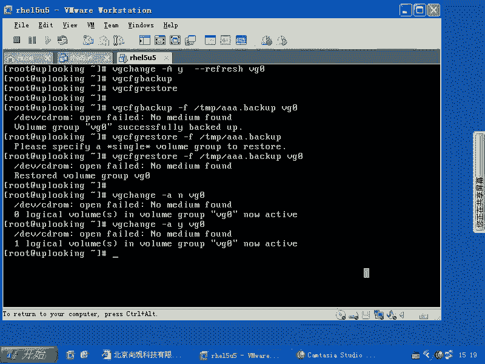

# 尚观Linux视频教程RHCE精品课程：P67：RH133-ULE115-13-3-LVM备份与维护




在本节课中，我们将要学习LVM（逻辑卷管理）的备份与维护操作。我们将了解如何备份LVM的配置信息，以及如何控制卷组的激活状态。

## LVM配置备份与恢复



上一节我们介绍了LVM的基本操作，本节中我们来看看如何对LVM的配置进行备份和维护。

LVM的配置信息存储在其自身的元数据空间中。为了进行备份，我们可以使用相关的命令。默认情况下，LVM的自动备份功能是开启的。我们可以使用 `vgchange` 命令来查看或修改这一设置。

**命令格式：**
```bash
vgchange --help
```

若要手动备份LVM的配置，可以使用 `vgcfgbackup` 命令。恢复配置则使用 `vgcfgrestore` 命令。

以下是备份和恢复LVM配置的具体步骤：

1.  **备份卷组配置**
    使用 `vgcfgbackup` 命令并指定备份文件路径。
    ```bash
    vgcfgbackup -f /tmp/vg0_backup vg0
    ```
    这条命令会将名为 `vg0` 的卷组配置备份到 `/tmp/vg0_backup` 文件中。

2.  **恢复卷组配置**
    如果需要从备份文件恢复配置，可以使用 `vgcfgrestore` 命令。
    ```bash
    vgcfgrestore -f /tmp/vg0_backup vg0
    ```
    这条命令会从 `/tmp/vg0_backup` 文件恢复 `vg0` 卷组的配置。

## 控制卷组激活状态

除了备份，我们有时也需要控制卷组的可用性。例如，在维护时可能需要暂时停用某个卷组。

以下是控制卷组激活状态的方法：

1.  **停用卷组**
    使用 `vgchange` 命令的 `-a n` 参数可以停用指定的卷组，使其暂时不可用。
    ```bash
    vgchange -a n vg0
    ```

2.  **激活卷组**
    当需要重新启用该卷组时，使用 `vgchange` 命令的 `-a y` 参数。
    ```bash
    vgchange -a y vg0
    ```



本节课中我们一起学习了LVM的备份与维护操作。我们掌握了如何使用 `vgcfgbackup` 和 `vgcfgrestore` 命令来备份和恢复LVM配置，也学会了通过 `vgchange` 命令控制卷组的激活与停用状态。这些操作对于管理LVM和确保数据安全非常重要。