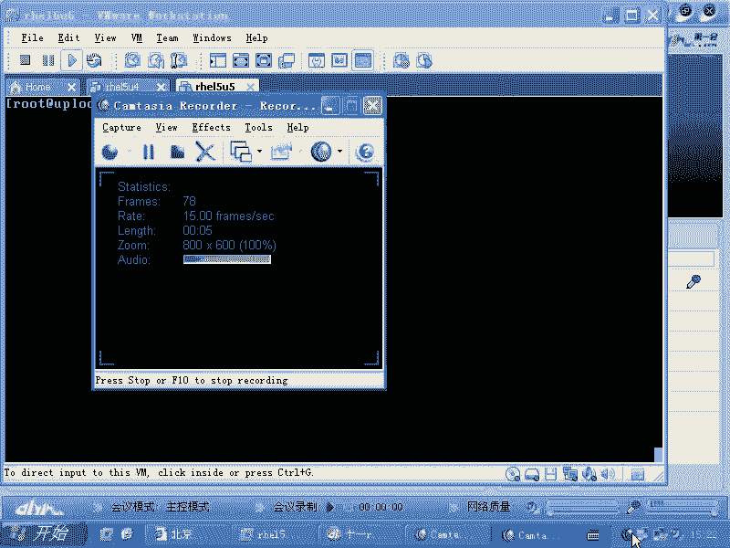
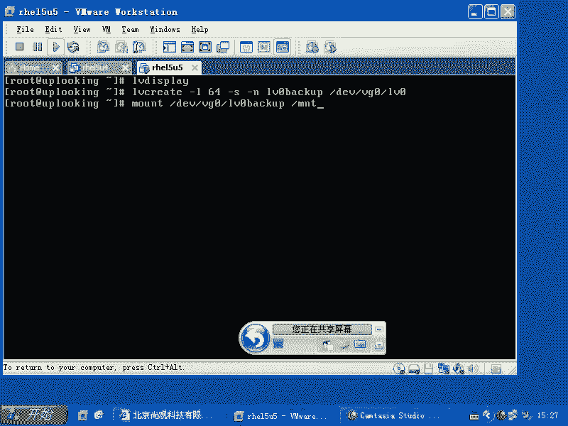
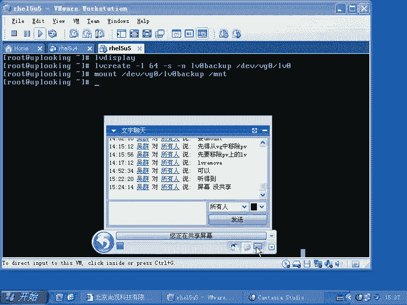
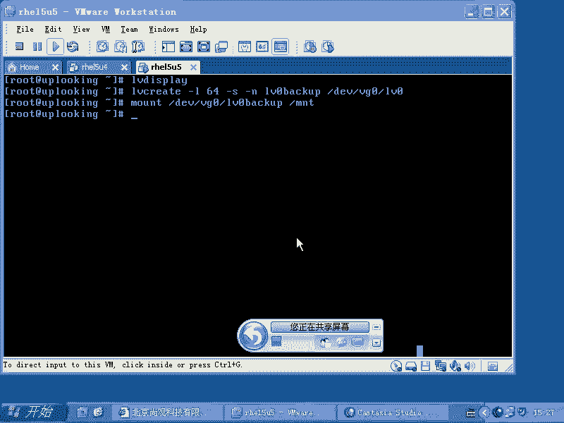

# 尚观Linux视频教程RHCE 精品课程 - P68：RH133-ULE115-13-4-lvm-snapshot - 爱笑的程序狗 - BV1ax411o7VD

现在看LVM的另外一个功能，这个功能是什么呢？就是LVM的这个快照功能。

LVM为什么要用快照呢？那么有这样的一个用法。当我们想去备份一个文件的时候，是吧？我们想去备份一个呃就是非常大型的系统的这样的文件的时候，比后一系列的文件。那这个时候我们要把这个程序的话停下来，是不是？

比方说把。我们的这个呃就是oracle啊或者什么东西停下来，让这个数据的话呢不再变化，是不是？不变了以后，然后我们再去把它copy。这样的话呢就是冷备了，是不是不是热备。冷备的话呢。

我们也要缩短冷备的时间。有什么办法可以备份这些所有的内容呢？那么我们有一种非常快的方法，就是什么呢？用LVM的话呢来创建这个逻辑卷的时候，我们创建一个什么呢？叫做呃。快照。创建一个快照以后有什么好处呢？

就是我们可以让原本LV正常还是继续运行是吧？让这个LV的快照来做备份。知道吧？就是说在我们时间某个时间，比方说我们完整copy几百G的文件要copy很长时间。那我们先做一个什么快照出来，做快照出来以后。

我们让那个系统话正常再去运行。我们备份的时候，我备份它的快照，的快照是没有就是没有数据更新的，是不是？所以这时候的话我们用它的快照的话能做真正的备份。然后呢，时间的话呢可能也会比较短。快照怎么用呢？

就是这样的LVM它本身的话呢有PV有VG，还有LV是不是？那么我们的LV在创建的时候，我记得有个LVc是不是LVc在创建的时候有个大L参数，是不是？LVL呃LV create大L参数加上一个大小。

是不是？加上一个，比方说呃100兆，对不对？这个大L的话呢是指定线性增加，是不是线性增加100兆的这种空间。那么我们如果要是用小L啊，比方指定它的这个块的大小，比方说是64是吧？这样的话呢。

就是说我去增加这个我去创建一个这个呃创建一个创建一个。LV啊。你们看一下这个杠大大L大小嗯和小L，还有大I和小I都是不一样呃，就是有很多。但是呢你看那个参数看不太清楚，这边习大呃。

小L的话呢是指定就是那个PE的数量。呃，PE的那个数量，还记得那个PE是4兆是吧？如果要是我们是几百兆的这个PV的话呢，创建的PE是。4兆是吧？嗯，杠小要的话呢，是就是后面加它的数量。

大L的话呢是直接指定一个什么大小，是不是？大L的话是直接指定大小。那么我们现在想去创建一个呃就是LV。那么我们就这样的。我们先用什么呢？呃。LV。display是吧。

我们看一下想要备份的那个那个就是那个LV的话呢，它到底有多大，它的到底有多大。然后呢，我们去创建一个什么呢？LV create的时候。然后呢，用大L或者小L啊，你指定一个大小。比方说那个LV的话呢。

它的数据占有多少，那么你创建一个大小。或者说想要啊就是说有多少个多少个PE啊，都可以，64啊，这边的话呢，我们再加上什么呢？一个最重要参数就是杠S。啊，杠S参数杠S参数的话呢。

就是创建一个snapshot啊，就是我们的。呃，叫什么呢？快照是吧。快照。我们把这个快照创建起来以后。它就跟我们创建快照的时候，当时的这个就是功能是呃，就是当时的这个情形是一样的。

当时的这个情形是一样的，杠S snap shot，然后呢再加上个杠N，比方说我这个。back up我叫做BAACKUP啊，叫做。LV1的。啊，LV0的backup程序啊哎back up这个就是。

券逻辑卷啊，那么我是给谁去创建呢？是地域下的VG0当中的LV0去创建。没要吧，这是napshot。然后呢，创建好了以后的话呢。

你就可以怎么样mountDEV下的VG0当中的什么LV0backmount在你的某个目录下，然后呢开始对它进行什么进行备份。而原来的LV下的VG0当中的LV0是吧？它继续运行。数据库该怎么读就怎么读。

是不是？这样的话呢，我们就可以用最少的时间进行一次非常大量的数据的。冷费你不用去停太长时间，是不是你不用去停太长时间，这就是LVM的napshot啊。

有没有问题？

有没有问题？没问题啊。

