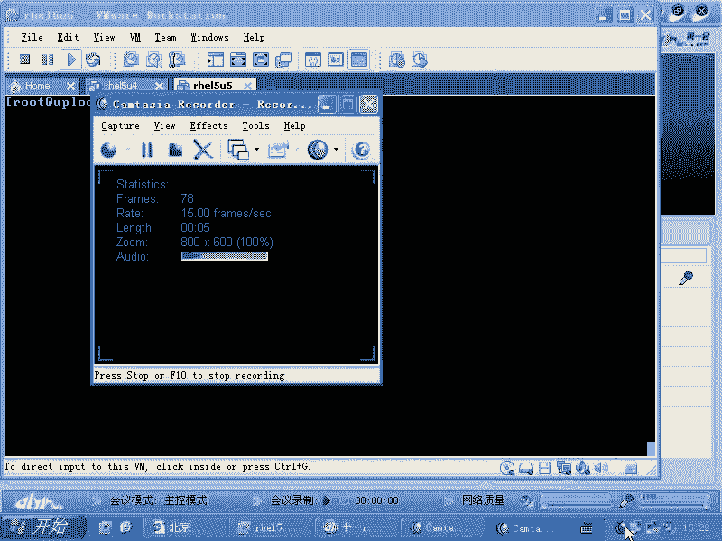
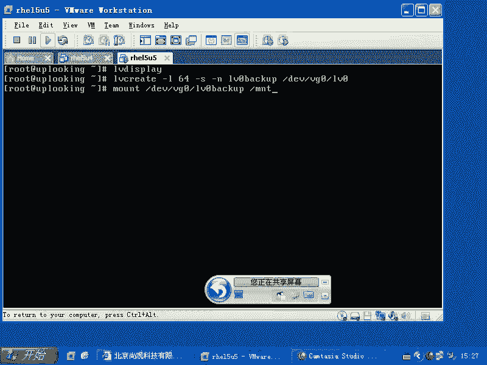
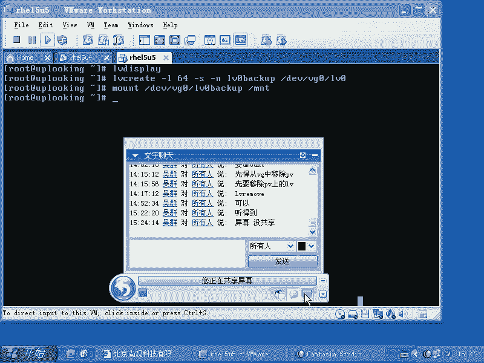
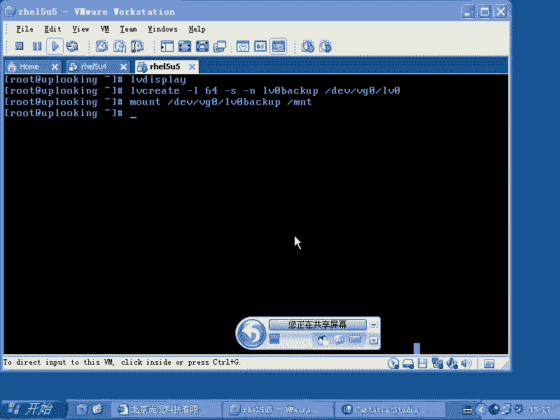

# 尚观Linux视频教程RHCE精品课程：P68：RH133-ULE115-13-4-lvm-snapshot




## 📖 概述
在本节课中，我们将要学习LVM（逻辑卷管理）的一个重要功能——快照。快照功能允许我们在不中断服务的情况下，对正在使用的逻辑卷进行备份，这对于备份大型数据库或文件系统非常有用。

---

## 🔍 什么是LVM快照？
上一节我们介绍了LVM的基本概念，本节中我们来看看LVM的快照功能。LVM快照是某个时间点逻辑卷状态的副本。它的主要用途是：当我们需要备份一个正在运行的大型系统（如Oracle数据库）时，传统方法需要停止服务（冷备份），这会导致业务中断。使用快照，我们可以在创建快照的瞬间“冻结”数据状态，然后备份这个快照卷，而原始逻辑卷可以继续正常运行，从而大大缩短业务中断时间。

---

## 🛠️ 快照的工作原理与创建
理解了快照的用途后，我们来看看如何创建它。创建快照卷与创建普通逻辑卷的命令类似，但需要使用特定的参数。

### 关键命令参数回顾
在创建逻辑卷时，我们使用 `lvcreate` 命令。其中有两个重要参数用于指定大小：
*   **`-L`**：直接指定逻辑卷的大小（如 `-L 100M`）。
*   **`-l`**：指定逻辑卷占用的PE（物理区域）数量（如 `-l 64`）。默认PE大小通常为4MB。

### 创建快照卷的步骤
以下是创建快照卷的具体步骤：

1.  **查看原逻辑卷信息**
    首先，我们需要确认想要创建快照的原逻辑卷的名称和所在卷组。
    ```bash
    lvdisplay
    ```

2.  **执行快照创建命令**
    使用 `lvcreate` 命令并加上 `-s`（snapshot）参数来创建快照。基本命令格式如下：
    ```bash
    lvcreate -L [快照大小] -s -n [快照名称] /dev/[卷组名]/[原逻辑卷名]
    ```
    **命令参数说明**：
    *   `-L 100M`：为快照卷分配100MB的空间（大小应足以保存备份期间数据的变化）。
    *   `-s`：表示创建的是快照卷。
    *   `-n snapshot_lv0`：将快照卷命名为 `snapshot_lv0`。
    *   `/dev/vg0/lv0`：指定为 `/dev/vg0` 卷组中的 `lv0` 逻辑卷创建快照。

    **一个完整的示例命令**：
    ```bash
    lvcreate -L 100M -s -n snapshot_lv0 /dev/vg0/lv0
    ```

3.  **挂载并使用快照**
    创建成功后，快照卷会像普通逻辑卷一样出现在设备目录中（例如 `/dev/vg0/snapshot_lv0`）。此时，你可以将其挂载到某个目录进行备份操作：
    ```bash
    mount /dev/vg0/snapshot_lv0 /mnt/snapshot_backup
    ```
    现在，你就可以对 `/mnt/snapshot_backup` 目录下的数据进行备份了。与此同时，原始的逻辑卷 `/dev/vg0/lv0` 及其上运行的服务（如数据库）可以完全不受影响地继续工作。



---





## ✅ 总结
本节课中我们一起学习了LVM的快照功能。我们了解到，快照是一种高效的备份解决方案，它通过创建逻辑卷在某一时刻的静态副本来实现。使用 `lvcreate -s` 命令可以轻松创建快照，这使得我们能够在不长时间停止业务的情况下，完成对大型、活跃数据系统的备份，有效平衡了数据安全性与业务连续性。