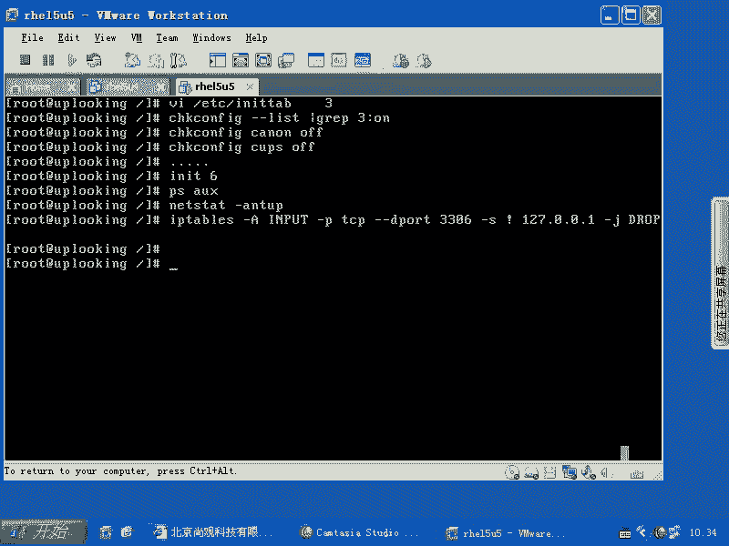
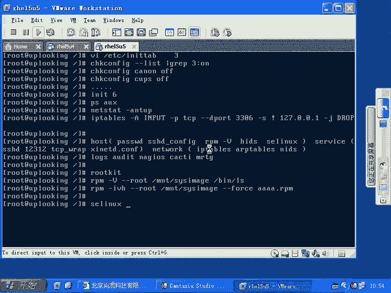

# 尚观Linux视频教程RHCE 精品课程 - P69：RH253-ULE116-2-1-security-system1 - 爱笑的程序狗 - BV1ax411o7VD

好。在我们使用这个系统的时候，要有一点谱，就是说有一个自己脑子里面有个规划啊，就是遇到各种事情的时候，应该怎么样去做。遇到各种事情的时候，应该怎么样去做？我们如果要是想让我们的系统的话呢，比较安全。

就是我们这本书不是最前面都是一些服务方面的东西，是不是？还有呢跟安全方。就是服务本身它的体系结构怎么样。然后呢，我们这个服务体结构搞清楚以后，这个服务体系当中话，我们想加入安全的因素，对不对？然后呢。

这些东西的话呢在脑子里面要有一些谱，就说我想去限定什么什么的东西的时候，我应该通过什么方式去限定。那么XRD的体系结构，我们给大家介绍的，是不是它的这个安全体系结构，我们应该怎么样去限定，这个也有谱。

那整个的系统应该怎么样去有一个全面的安全方面的认识，这是我们需要琢磨的地方啊，我把我的自己的一些经验的话呢，跟大家分享一下。那么当然了，有可能很多高手的话一看哎太土了，是不是太傻的这样做啊。

但是我觉得还是比较行之有效的。那我一般的话呢，在配置我们的服务的时候啊，配置我自己的服务的服务器的时候，我一旦。安装完以后，我会经历一个什么过程呢？那我首先看一下呃，就是首先的话呢我会。

VI啊ETC下的RRTTAB是不是我把我的运行级别改成什么？改成3，是不是？我不希望的话呢启动那么多的没有用的进程，是不是？然后呢，接下来的话呢再去怎么样呢？我把自己的这个服务啊，就是整个的系统的话呢。

稍微弄得安全一些，弄得稍微安全一些呃，不是不是稍微安全，就是说就我运行的服务要少的话，是不是它的可能出现的漏洞就少。对的，所以我就要把它弄的干净一些，清洁一些。那么当然也就会安全一些，是不是？

所以我这样的一般会check onfi啊，然后呢，杠杠list是吧？我会查看所有系统当中已经运行的进程啊，已经运行的进程。我看了一下以后。

看一下哪些是在我定的这个运行级别on的那我加上一个什么GREP什么。3冒号啊啊，那这样的话呢，我就看在运行级别为三打开的服务有哪些，是不是？然后呢，我再去怎么样？check configurefi。啊。

然后比方说啊我看到一个，比方说caps。你们你们如果要是自己在服务器端去运行，你们如果要是在这个自己的服务器上的话，要把caps关掉。如果不用打印机的话，是吧？在HCE考试的时候，要不要关掉它？

关掉他那你就找死啊，为什么呢？因为人家要求你配置打印机，对不对？结果你把这个打印机服务关掉了，那不是有个问题吗？所以一般的话呢，我会把这种服务啊，比方说cannel。😊，啊，kenal啊。是不是？

然后呢check outfi个我就一个服务一个服务的看啊，比方说我的cus。啊，等等。那么每每一个服务我要做到什么呢？这个服务我如果不知道他是干什么的，我就不让他运行。明白吧。不是说什么呢？哎。

这个服务会不会很重要，是不是它跟它跟windows可不一样。windows里面说啊，我们这是一个后台首护进程是吧，它是系统所必备的，是吧？你也不知道它为什么必备，是不是，反正微微软的话说哎。

反正你内存大是吧？用点没关系，对吧？我那个破windows7我就气的很。动不动CPU占用率就很高。一看的话呢，微软在自己帮我怎么样呢？去搜索硬盘上所有的图片是吧？帮我加到哪个地方。

叫什么windows search服务是吧？我查了半天，这三个进程到底哪来的，他说windows search服务帮我做的，我用你帮我去整理嘛，我自己整理就好了，对不对？那么除非是什么呢？

这个特别傻瓜型的这种呃，比方说手机我懒得去折腾，对吧？那我让他自动去处理一些，但然这些的话都会耗资源。lininux是典型的一个什么呢？就是它没有秘密可言，对你来说没有秘密可言。

如果要是你足够下足够大的功夫的话，你是连内核里面启动了什么线程的话，你都清楚，对不对？所以做到这样一点的话呢，你的系统肯定是干净的。没有一个服务是你未经授权的运行起来的。

没有任何一个进程是你不知道的情况下启动起来的，一定要做到这一点。现在大家可能接触这个东西的时间还不够长，所以还觉得什么哎这么多进程我关了它会不会有问题，对不对？但是你在网上搜一下互联网的话是好东西。

是不是？当你不知道一个进程它是干什么的时候，把这个进程把这个服务的名字拿出来，然后放在什么呢？放在google里面或者百度里面一搜搜出来以后这个进程这个服务是干什么的，然后呢把它开启或者关闭。

这就由你决定了，对不对？然后呢把它拆启或者关闭了以后，然后呢再运行下什么IIT6是不是IIT6把这个所有的这个服务的话，你看一下架次重新启动时候，他说不启动的是吧？

不启动了以后进入系统这时候是一个相对来说比较干净的系统运行什么呢？PS啊U你看一下系统当中到底还有哪些进程。这个进程有你的生人没有就是有你的这个。😊，不认识的人没有，是不是？然后呢。

明白不明白嗯明白明白啊。因为你刚才已经把这些服务关掉了，是不是？嗯关掉了以后的话呢，你剩下的服务下次重启启动时候才会启动。那么关掉的那些服务它就不启动了。这时候系统的话呢，启动的进程的话是有数了一些。

然后你看每个进程，你是不是都认识是不是熟人。如果不是熟人的话怎么办？那就你就想哎这个进程谁帮我运行起来的？😡，是不是嗯？谁那个到底怎么运营起来的？这个时候呢你找到了以后，那么你再把它Q掉。

或者说再把它什么check on这个off，再把它关掉。这样的话，你的系统话呢相对来说就比较安全了。也比较什么快。啊，现在的话呢大家可能一般不会在意那五六百兆呃，就是几百兆内存是吧？但是呢。

他可能会带来安全的问题啊，就是这种漏洞的问题。然后呢，我们再去怎么样呢？一定要啊light state杠ANTUP。一定要进行要证明。你要做到什么呢？系统当中最好做到。你的这个服务器是一个什么？

是一个呃，比方说是一个。外部服务器，你这个系统的话就打开1个80的。或者打开个43端口，是不是80端口或者443端口都打开。就你授权的这个端口打开，其他没有任何的一个端口打开。明白吧。

也就是说我现在的话呢，这个系统如果ned杠NT以后，看到这个端口有很多，而且很多端口你不知道干什么的那你就要怎么样，你要小心了，你就要看一下这个进程，它的话呢，是谁在监哪个进程在监听这个端口。

把这个进程Q掉。是不是Q掉，然后呢，要么就怎么样呢？要么就仔细琢磨一下这个端口的话呢，到底是干什么的。如果要监听的是0。0。0冒号，什么什么端口，这个是属于什么端口呢？

这个肯定是属于那个就是呃就是监听所有人都可以给你发数据是吧？如果127。0。1下的某个端口，这倒无所谓了，是不是这倒无所谓。然后呢，再根据什么呢？如果有些端口必须打开。比方说什么呢？

我们所谓的mysql是不是myciql的话呢，如果你必须要打开，那么你能不能通过I tables来做一个限定啊，比就说你一定要打开的端口，但这个端口的话呢，很可能被别人所什么防盗。

并且成为一个入侵你的这样的一个。门或者窗户是不是这个时候的话你可以用IP table是防一下。那么我最常用的就是说我这边的话呢可能不标准啊，这边我是给大家做个例子，用IP tables。

杠A啊input。在imput的时候，所有的话呢杠P啊TCP所有的话呢试图去访问我的什么。诶。所有试图访问我的3306端口是什么端口？买scle是吧？那我这个买scle服务又不能停，是不是？

因为我的机器的话呢，可能比较比较简单，就是自己既上又有外部服务器，又有什么买scle数据库是吧？如果你是在一个正常的。网络公司这个工作的话，他们的买s狗服务器可能在后台是不是前台的话是一些外部服务器。

是不是他们在访问后面的服务器，这个的话是另当别论的。但是我的这个机器表的说比较简单，买s服务和呃外部服务器全部都在同一台机器，那我是不是不允许外界的人来访问我的买s狗，对不对？

当然我可以配置买s狗只监听127。0。1是吧？只监听127。0。1。但是我在这边的话呢，如果要是我默认情况下，它就监听0。0。0的，是吧？😊，3306个端口是不是？然后呢，我这样的。

他如果访问的是我3306的端口，那么我就只允许什么杠S就是来源地址是什么呢？是非啊127。0。0。1，是不是？那么如果不是从这儿来的，就怎么样？杠J。对，这个drop和reject reject的话呢。

它有一点不同，就是说d的话呢，它拿到数据包以后就扔了是吧？他不通知你。但是如果rejust的话呢，就是说reject的话，你发过来数据包，我把它扔了。然后我再告诉你说什么，没这个没这回事是吧？

他就认为啊你此地无银三0百眼，是不是他就会出现一个什么目标目标不可达这样的一个错误。所以这个时候的话，我们一般的话呢就jo掉。因为你不想让别人怎么样，不想让别人反到啊，但是呢当有一些端口的话呢。

你想保存的时候，比方说啊。比如SSC端口或者什么的话，呃，或者是其他一些敏感的端口。你你就想着告诉他叫什么，放弃吧，哥们儿。不要再攻击了是吧？这时候你就用reject呃，reject是吧？

REGECT是吧？那么这个drop和reject是这样一种。那么我要保护我的端口啊，是这样来。明白吧？这样你的系统就已经是就是比较干净了啊，做到这一点以后的话就是什么就是什么呢？做到这一点以后的话。

就是说你的系统已经是呃。还可以啊，你这个人的话呢已经对系统的话呢掌握到一定程度了啊，比较靠谱。你对这个系统也是十拿九稳的这种状态。然后接下来再去配什么服务，或再去添加什么东西，都是额外添加的，是不是？

最好你把现在的这个PSAX或者说nstate，你给它保存成一个文件。以后的话呢突然。出现一个什么？哎，我这个端口门外又打开了很多东西，是不是？这个时候的话呢，你就会怎么样哎。谁打开这个端口？

我明明只打开两个大脑是吧？谁打开这个端口，这个端口是不是黑客的木马程序在跟外界进行通讯是吧？我的机器是不是被黑了，这些都是什么呢？都是一些呃就是素材，或者说一些那个你的能掌握的一些根据。

是不是你要不是你要是什么都稀里糊涂的，然后按默认的情况来，那你的根据在哪是吧？你凭什么说现在机器被黑了，或者被黑了以后的话，你连察觉都察觉不到，这样的话就很危险。就像我原来说的那个我原来被黑的时候。

一看一个ss log地啊，ss log明明就是一个什么系统的这个这个日日志服务器是吧？他用的是UDP5514端口是不是？结果的话呢哎他怎么会跟他怎么会坚听1个TCP的514端口，他怎么会跟外界的话呢。

有这么大的数据量，特别大的数据量持续的进行通讯是吧？那肯定有问题啊，那么你原来用n看到以后，系统当中就打开两个端口，1个80一个是什么61234。是吧这样的一个非标准的22端口，对不对？

就是原来那个SS是我们原来建定22端口，我把它改成什么？61234端口是吧？就这两个端口，怎么多出来端口。这个时候你立刻就知道哦，有人被有人攻击你是吧？有人的话呢，在这里面装了木马，有人的话呢。

通过这个木马的话呢，再访问你。明白了吧？这个的话就是通常的步骤。做完了以后的话呢，这时候我开始继续再筛选。这时候你要知道啊你的系统这样呢做了只是初始化的工作，这相当于真正这个时候才算安装完毕。

这个时候才会安装完毕。因为reite的话呢，它不希望。他不希望他的这个系统只给专家去用是吧？那么如果他什么服务都不打开，那么让你手动去打开，是不是要求每个用这个系统人都去成为专家，是不是？

嗯所以他就帮自动打开了很多东西，也就装完了以后，到现在才算真正符合你要求的安装才算完毕，是不是实际上你并没有真进行任何的什么配置，你还没有进行任何的配置，明白吧？

这时候的话你就开始按照一定的规则去梳理你的安全的配置啊，如果我的话呢，我会怎么样去梳理安全配置呢？稍等一下啊。如果我的话呢，我会怎么样去树立安全配置，我会这样的啊。首先的话呢。

我把这个安全分成几个阶段啊，在我们的HCE里面的话呢，把安全分成什么三个阶段。第一个的话呢，第一个部分叫什么呢？主机安全啊，主机安全记得我们的那个用户名的密码吧。

ETC啊password shadow这些东西是吧？嗯属于主机安全，你可以运行奥斯卡fi来进行用户的集中控制，是不是？这都是主机安全啊，主机安全。然后的话呢是service的服务安全。啊。

记不记得我们原来给大家讲的XID的那个守护进程XID点com里面可以加什么only fromno access是不是acces time是不是还有int是不是这些东西的话呢。

这些选项都属于服务安全服务安全是什么意思呢？就是我们这个服务的程序啊，它本身话有一些安全控制，对不对？比方说允许哪个IP禁止哪个IP允许哪个IP禁止哪个IP你要主机安全的话。

我们的s sSH比方说我们可以进行什么呢？pasword这个文件的这个筛选，对不对？我们会进行这个paword文件筛选，还可以进行什么呢？

还可以进行我们的这个SSHD是不是下划线fi我们可以让SS是只质持什么密钥认证。😊，是不是？这个的话就是主机安全部分。service的安全的话呢，就比方说我们某一个服务。

比方说我们让SSHD去监听什么呢？监听我们的一个非标准端口是吧？比方说呃123。12是吧，这样的一个端口让它监听不是22端口，让他监听这个端口。同时呢我配置什么呢？TCPrappper。

进行什么访问控制，允许哪个IP不允许哪个IP啊，允许哪个主机，不允许哪个主机。这个的话在HC考试的时候肯定要考，基本上你配置每一个服务，你都要问一下自己，我会不会进行访问控制，对不对？然后还有的话呢。

就是需要像我们的X拉D点。XRD点c里面那些什么only from之类这些东西，对不对？这是由我们的后台守护进程自发的进行的一些什么防控制，允许哪个IP不是允许哪个IP等等。是的。还有的话呢。

就是我们所谓的什么呢？呃，就主机安全这个地方还包括一些就是说这个人家假如说入侵了以后，你要知道哪些文件被改了，是不是？那记不记得RPM杠大V记不记得这样的一些组件啊，这些的话呢是属于主机安全的部分。

然后呢，我们的这些服务的话呢，它自己的配置文件，自己的访问控制等等，属于服务安全。然后呢，接下来的话是网络安全。啊，网络部分的话呢，我们可能以原来嚷嚷的会比较多。听很多人都在说网络安全。很神秘是吧？

甚至很神圣，是不是？然后呢，网络工程师很神圣，是不是呃，很神秘，对吧？你要真正安全一点的话，你要讨论它的细节的东西的时候，你就不知道是怎么回事了。什么是网络啊啊，google是网络，它是网站是吧？

网络游戏是网站，网络是吧？我们的。windows系统它也是网络是不是？因为连到网络上嘛，好像网络功能是网络安全无处不在。其实的话呢你把它细节讨论一下，就是属于什么呢？网络协议本身的安全啊，这是网络安全。

也就是它不能包含什么主机安全服务安全，这是两码事，明白吧？这个时候的话网络安全应该是什么呢？就是我们的什么啊IP tables这种网络防火墙或者是什么呢？

ARPtables之类的这种ARP的防火墙或者是什么呢？或者是我们的这个NIDS就是说网络的入侵检测系统啊，这些东西是属于网络安全的，明白吧？那你的主机安全或者被黑压暴力破解，这些东西未必是网络安全。

那么在这个主机安全地方的话呢，还应该有什么呢？还应该有这种呃。😊，刚才想到一个什么东西啊，就忘了。比方说L呃就是主机HIDS啊，然后呢还有就是说我们的这个权限控制啊，比如说SElinux等等这些组件。

它的话呢就分成这些组件。那么接下来的话呢，我们所谓的安全配置的话呢，就要基于这些东西去配了，明白吧？你先把什么呢？先把host的主机安全的话梳理一遍，再把什么呢service服务安全再梳理一遍。

再把什么iptables等等这种网络安全在什么梳理一遍，明白吧？这样的话，你的系统的话呢，就成体系的安全了。清楚了吗？嗯，那么我们说细节的某一个部分的安全的话呢，我们等一下再给大家讲。

比方因为每一个组件的话都要讲一段时间，是不是？嗯然后呢，还有就是我们知道这些安全分成这些部分，这些组件大致有什么东西之后，然后呢，我们呃安全配置好了以后，然后呢，这个时候我们这个套体系。

比方报警机制啊等等审核这套体系的话呢，还要再上。比方说audit之类的这种slog监控这些审核机制的话呢，再加上去啊，比方说log啊，然后呢什么audit。哎。是吧audit就是审审计是吧，审核服务。

还有呢像我们的这个呃。日志，然后auit还有就是我们的监控是吧？比方说我们的NAGIOS是吧，或者是CACTI是吧，之类这些程序，或者说我们的什么MRTG是吧？这些东西的话呢。

就是我们后续的这种监控程序是吧也要加上去。啊。当我们部署完了以后。部署完了以后，安全体系也加载完了。咱们现在万事大吉开始睡觉了吗？嗯。万一出现问题该怎么办，对不对？这边的话呢是安全方面的东西。

那假如说系统的话呢，出现什么？崩溃了是吧，崩溃了以后，我们是不是要进行什么进行一下恢复是吧？我们平时的备份有没有进行，是不是back有没有进行？然后我们恢复的话能不能恢复好，有没有进行过健康检查是吧？

备份戒止的健康检查。然后接下来的话呢，我们如果真正遭到入侵了以后入侵的时候的这种呃就是措施是怎么样的？然后呢，这边的话呢就是呃你可能要采取的。现在你们要想一下，你们机器的话。

现在假设说可疑啊有可疑的这种入侵测试呃，有可疑的入侵该怎么办？安全方面啊出现问题了。假如说安全方面你怀疑出现问题了，该怎么办？想自己想过没有？手忙脚乱是吧？然后大大声疾呼是吧？我被入侵了我被入侵了啊。

是不是？如果要是我们被入侵了以后，要采取一个标准的步骤啊，有很多管理员的话呢，他怀疑被入侵，或者是通过日志检测到被入侵了以后，他会采用什么呢？他采用的这个方式是不一样的。有稍微就是去练有速度管理员。

他会怎么样？他一把把拔线呃，网线拔起来。一把八方宪拔下来，有些人什么呢？大声疾呼是吧？我被入侵了，帮帮我吧，高手是吧，帮帮我吧，这就属于什么自己永远不可能成为高手的人是吧？高手帮帮我吧什么。

如果要是真正的话呢，就是reHCE里面的话呢，它规定就是咱们HCE教材里面规定是什么呢？第一，你首先要断网。到。然后呢，把当前的系统化呢做进镜像。保存证据啊保存证据，然后呢开始怎么样呢？开始去查啊检测。

通过你的这种各种各样的就是比方说本地的这个入侵检测系统，就是说我们刚才所说的这个呃HIDS啊，SE的呢还有RPM杠大V等等这些组件的话进行检测，看系统哪些东西被被更改，然后检查日志。

刚刚说说的清清楚不清楚。第一，你要断网，是不是断网完了以后的话呢，很多人都开始就在这个机器上就开始查了哎。谁黑我是吧？这家伙回我是吧，我要。找出他来时候，把它碎尸乱断，对不对？那么可能是这样的。

狠的咬牙切齿。但是一般的话呢，我们是先镜像。这个这一步的话呢，可能很多人的话不会去太多的去考虑，先做镜像。如果你有这个介指，有充足的资源的话，就把它做镜像，然方用滴滴命令做镜像是吧？镜像完了以后的话呢。

开始用这个机器的话呢，开始给他开始去查。查的时候，我们一般会有一种方法去查啊，就是说不要用当前的机器去查。不要用什么呢？就是说我现在这个系统我做好镜像了，然后我用这个机器的话，启动起来。

我去一步一步查啊，你用这个机器去启动，那么只会给什么木马或者病毒，或者说后台的那个就是黑客给你下的那些套是吧？它又运进起。所以一般情况下我们会怎么样呢？会找光盘或者一只其他磁盘去运行。

运营起来以后的话呢，那么你把那个硬盘给它mos在你的某个目录下，然后呢去检测，明白吧？这样的话，你讲系统启动的脚本是不是有很多。嗯，你用这个老的系统一启动，那些脚本里面。

只要中了木马以后就怎么样就有东西。因为我们的那个长期课程当中，是不是教大家编那个s要病毒啊。有没有教大家编的笑柄毒？没有那个病毒的话呢，就是我去执行任何一个脚本的时候。

它是不是都要调用那几个初始化的脚本啊，执行任何一个脚本的时候，他都会去调用什么ET下的RC是吧？还有呢主攻录像的点RC对不对？profi它是不调用这两个脚本一旦运行。那我把病毒的话。

就放在这两个脚本里面，你是防不胜防。你只要运行个脚本，这个脚本的话，就立刻就什么着了那个要病毒，你讲清楚它都不能清除，对不对？因为他你怎么控制它去不运行RC，你还要再去看参数，对不对？

但一般人的话呢没有这样的训练有速度过程，那可能就想不到是？所以的话我们要用光盘来启动光盘是比较纯净的一个系统，然后再把硬盘加载上来，加载上来以后的话，进行什么的？

你比方说你现在想去验证一下这个软件包有没有被别人改把你的VI改成一个木马了，对不对？但还提供VI的功能。然后呢你去运行什么PS命令或者运行什么的命令什么都看不到，你都。不知道有哪些进程。

反正他什么时候你现在有1000个进程，你用PSAOX它就显示出100个，是不是？那么有10个都是其他几百个都是木马进程，他也不管。所以的话呢这个时候你就中了root kit。啊，root kit的话。

我们看字面意义上好像说root账号的一个工具包，对不对？际上这个工具包是什么？是啊。黑客来黑如此的工具包，它自动会帮你把那个系统的监控的进程全呃监控的命令全部都替换掉。

让你根本就不知道系统到底现在是怎么回事，明白吧？PS命令PS tree啊，什么top啊，然后呢像n state这些命令全部都替换掉。所以这时候的话，你根本就不知道你系统到底有什么地方出现问题了。

于是的话呢，你要访你要你要想这个说查看哪些进程的话，哪些程序已经被改了，一般我们用光盘启动完以后，然后运行这个命令RPM啊杠大V。我去验证是吧，那你RPM杠大V，然后并下的然S行不行啊，这样。行不行？

肯定不行啊肯定不行。因为它呢你现在验证的是什么呢？当前的根目录下呢定下的LS命令，是不是而当前的根是不是光盘启动起来的？所以这个时候你要怎么样呢？你要RPM杠大V加上一个什么杠杠ro。

也就是以谁作为ro器呢？以你mount上来那个硬盘上的根作为ro。这样的话你验证的话就验证的是谁呢？硬盘上的那个文件了，你吗？以谁作为根呢，以我们的比方说MNT2的s也就是说你用你的光盘去引导的时候。

还记得那个红色的背景是吧？红色的背景下，你输入linux rescue就是linux的修复模式的时候，一回车进去啊，linux rescue一进去进去了以后。

那么你看到的系统实际上是我们的光盘上这个linux系统。但是呢linux rescue，它唯一会帮你做的事情，就是把你的硬盘搜索出来，搜索出根根区把根根区加载到哪了？MN的这是它自动做的一步，清住吧？

re模式。所以的话你去杠杠ro。下 image，然后再加上一个什么呢？并下的LS这个时候它的根是谁呀？这个并下的LS它的根是谁啊？硬盘上硬盘就是硬盘上的根，本来你的根的话，刚才那个不加杠杆如此的话。

它的根的话是光盘上的根是吧？光盘上那个文件是只读的，是不是当然不会被别人改？是不是现在的话呢，它验证的时候就是以什么呢？以你硬盘上那个根作为验证的，清楚了吧，就是RPM杠大V啊，RPM杠大V。当然了。

你还可以去什么呢？去。一个一个文件的话呢去查。啊，就是手动的话到那个分区下，然后呢去看这些文件的话有没有被改。那么你要想去恢复的话呢，就把它重新安装一下是吧？那么如果要是你想安装的话。

HRPM杠大V是吧？杠杠如此这样方式去安装呃，M杠IVH啊，不是大V杠IVH杠杠。如此是吧？然后呢，MN的s你是不是你想要替换掉哪些文件，加上一个什么刚刚fose是不是然后呢，想装哪个包比了。

什么什么点RPM包，这样的话呢就把它强制的安装，安装到硬盘上。尽管现在你是以光盘的方式去运行的。明白了吗？😊，好，这是当你发现问题了以后，那么一般做的操作啊，就是说我们规定当中操操作。

这是大的公司给大家设置出来的规定啊，就是说你要先镜像。就把网线镜像，然后呢再以光盘来引导，然后呢查你系统的话出现什么问题。查出来以后的话呢，再进行替换或者修复，然后再去验证你的系统的话呢，是不是有问题。

然后查看漏洞，就是说是因为什么方式的话呢，你被就是攻击进来的。然后呢，再看潜在的问题，查看日志。最好的话呢，把日志的话呢，就是敏感的日志放在什么呢？放在你的远程日志服务器上。

这样的话你的机器被跟攻击了以后，我说黑客的话都要什么？说句俗话就是什么？黑客都要擦屁股，他要把你的日志清掉啊，清掉以后呢，你可能什么都看不到。但是呢它黑的你的机器，然后除非在通过你机器再去黑什么。

后面的远程日志服务器，否则的话呢，你这个机器的日志清空掉也没有用啊，那么我有远程日志服务器是不是上面有敏感信息的这种保保留是吧？你用log watch，你再看指定的主机指定的问题啊。

用log watch去看一下，这时候你能看到啊，黑客到底是什么时候用什么账号进来的，是吧？或者说使用了哪些特权命令，对吧？这样的话呢，你能看到这个真正。那么入侵检测系统的话，RPM算一个。

入侵检测系统啊，就是基于主机的入检测系统的话，我们说RPM算一个RPM的话，它可以查看你系统当中哪些文件被改动过。以前的话呢我们的reite的话会有专门的一个叫做tripware的东西。

但是呢后来被reite一脚踢开了。因为他说我的RPM也提供这个功能是吧？我不希望tri啊tripware的话是个专业的，还有类似tripware就是做这种事情。

就查看你哪些程序被别人改动过的这样的程序的话，还有哪些呢？还有LIDS。就是linux的IDS啊，就是LIDS这是也是一个需要你后来再装的程序。那么我们后来的话呢有更为强大的一个东西叫什么呢？

SElinuxSElinux的话，它可以做审核，只要把SE Linuxux打开成什么呢？permissive的状态，它就会给你报警。报警跟什么呢？跟真正去阻挡不一样啊，也就是说SE这既可以报警。

又可以阻挡。这个SED它主要是满足什么样的需求呢？就比方说有一个操作啊，有一个人去访问你的aparty，对不对？我问你的aparache，那么我去从远程访问你的aparache。

我获得的在你机上获得的权限是什么？我访问你的机器是不是你的机器要找一个进程来响应我的请求是吧？这个进程是谁呀？HTTPD对不对？HTTPD进程的话要响应我的请求。但是我的请求的话呢非常的无理。

非常的什么呢？呃，就是不符合要求啊，就是说肯定不是一个正常请求。正常的请求的话是看什么呢？看三单的目录下那些这个网页程序是吧？但是我说现在请把你的什么呃。ETC下的password病例给我看一下。

是不是就相当于什么？你在大街上见到一个人是吧？你说哎请问那个路在那边在哪走，这是个正常请求是吧？说哎把你钱包给我看一下有多少钱，是不是？但是可惜就可惜在什么呢？系统当中啊，它的权限的话呢太匮乏了。

系统当中是不是只区分两种账号，一种如ot一种普通账号是吧？所以的话呢你只要是others可以去访问的文件，你的apppartache账号，理论上都可以访问。是不是？HTPD技能都可以访。

所以这时候的话呢，那你只能靠ache的话呢，它自己配置说我只能访问这个目录。但是它的库文件它就访不到，是不是？它要访问库文件，它要访问自己的账号，它就要访问ETCword。所以你这样的控制的话就不行。

所以我们说的安全是一直以来非常烂的安全。那么我们后来的话呢就想到了一个办法，就是改成windows默认情况下什么操作都不允许，除非是你允许。那这样的话我们需要把系统当中各种各样的组件都给它加一个属性。

这个属性叫什么呢？叫做contex就是上下文。也就是说我们会告诉你ETC下的password啊，它是一个什么属性的，它就password属性是吧？

它的这个它的这个标题或者它这个目标的名字叫pasword。那么它可以允许几种操作。第一，查自己的什么信息是不是读自己信息。第二是读还有什么写入还有什么执行是不是。还有什么呃库的这个调用。

也就是说你是调用库的这种访问，不是读了啊，它跟读还不一样等等。他这边这个细节的这个操作的话又规定了很多。每一个对象的话又有自己独特的名字，对不对？所以SE呢可以做到这样一点。

当你这个进程想访问的一个对象，然后呢，操作的时候不是事先预定的这种操作的时候，我规定你允许的操作的时候，他就报警。明白了吧？所以S mix的话呢，你要让让让它做permissive状态。

它是非常什么非常强大。总之的话呢，我给大家说了一下整个的安全体系架构，你应该怎么样去考虑，清楚了吗？清楚没有？这是一个概述，你会发觉非常的笼统，对不对？这是一个概述，笼统不笼统啊。笼统是吧？

那么因为我们还没有讲细节，你随便拿1个SE出来讲要讲多长时间，你总得要半个小时1个小时，总得才能略窥门禁是吧？把他的基本命令想要讲清楚，更何况那么多东西。所以我们先给大家做一个概述，明白了吗？好。

有没有问题？啊。有没有问题？

有问题吗？