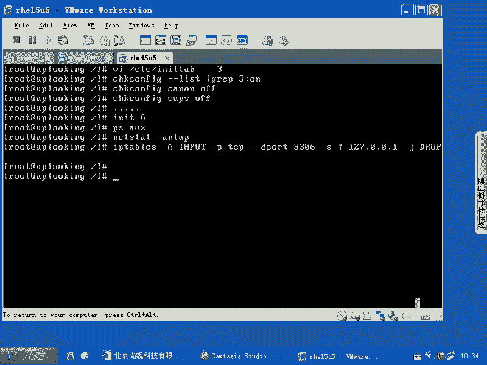
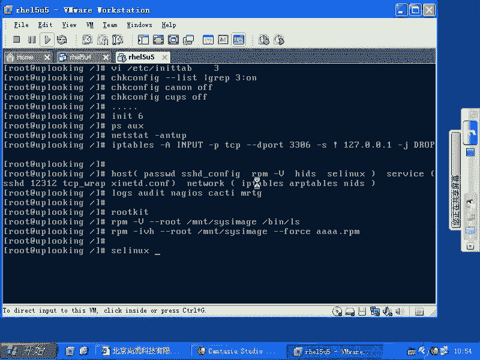

# 尚观Linux视频教程RHCE精品课程：P69：RH253-ULE116-2-1-security-system1


## 概述

在本节课中，我们将学习如何为Linux系统建立一个全面的安全体系。我们将从系统初始化的安全检查开始，逐步深入到主机安全、服务安全和网络安全等不同层面，并探讨在系统被入侵后应采取的标准化响应步骤。目标是让初学者能够理解并实践一套行之有效的系统安全配置与管理方法。

## 系统初始化与安全检查

上一节我们介绍了课程的整体框架，本节中我们来看看如何从一个新安装的系统开始，构建一个安全的基础环境。

安装完系统后，首先应减少不必要的运行进程以降低潜在漏洞。一个有效的方法是修改系统的运行级别。

1.  将运行级别修改为3（文本模式），避免启动图形界面等非必要进程。
    ```bash
    vi /etc/inittab
    ```
    将默认运行级别改为 `id:3:initdefault:`。

修改运行级别后，需要检查并关闭不需要的服务。

以下是检查和关闭服务的步骤：
*   使用 `chkconfig --list | grep ‘3:on’` 命令查看在运行级别3下会自动启动的服务。
*   对于列表中不需要的服务（例如，如果不使用打印机，可以关闭 `cups` 服务），使用 `chkconfig [服务名] off` 命令将其关闭。
*   对于不熟悉的任何服务，应先通过搜索引擎查询其作用，再决定是否关闭。

完成服务调整后，重启系统并使用 `ps aux` 命令检查当前运行的进程。确保每一个进程都是你认识并授权运行的。如果发现未知进程，需要追查其来源并关闭它。

一个干净的系统不仅进程可控，其开放的网络端口也应最小化。

你需要使用 `netstat -antup` 命令检查所有监听的端口。理想情况下，服务器只开放必要的端口（例如，Web服务器只开放80或443端口）。对于任何未知的监听端口，都应找到对应的进程并处理。



对于必须开放但又存在风险的端口，可以使用防火墙进行访问控制。

例如，如果MySQL数据库（默认端口3306）必须运行，但只允许本机访问，可以添加iptables规则：
```bash
iptables -A INPUT -p tcp --dport 3306 -s ! 127.0.0.1 -j DROP
```
这条规则将丢弃所有非来自本机（127.0.0.1）的对3306端口的访问请求。`DROP` 动作是静默丢弃，而 `REJECT` 动作会返回拒绝信息，可根据场景选择。

完成上述步骤后，系统就处于一个可控、干净的状态。建议将此时的进程列表（`ps aux`）和端口监听状态（`netstat -antup`）保存为基准文件。日后若发现异常，可以快速对比定位问题。

## 构建体系化的安全配置

上一节我们完成了系统的基础安全加固，本节中我们来看看如何从体系化的角度，将安全配置分为几个逻辑层面进行梳理。

RHCE课程将安全分为三个主要部分：主机安全、服务安全和网络安全。

以下是安全体系的三个层面：
1.  **主机安全**：涉及系统本身的安全，例如用户密码文件（`/etc/passwd`, `/etc/shadow`）的管理、使用 `pam_cracklib` 进行密码强度控制、配置 `sshd_config` 仅允许密钥认证等。还包括入侵检测，如使用 `rpm -Va` 验证系统文件完整性。
2.  **服务安全**：指具体应用程序（服务）自身的安全配置。例如，为SSH服务修改默认监听端口、利用TCP Wrappers（`/etc/hosts.allow`, `/etc/hosts.deny`）进行访问控制，或在服务自身的配置文件（如 `xinetd.conf`）中设置 `only_from`、`no_access` 等参数。
3.  **网络安全**：专注于网络协议层的防护，与具体服务无关。主要工具是防火墙（如 `iptables`），此外还包括ARP防火墙、网络入侵检测系统（NIDS）等。

在配置系统安全时，应依次从主机安全、服务安全到网络安全进行梳理和配置。在此基础上，还需要部署监控与审计机制。

完整的体系还需要后续的监控与审计程序，例如系统日志分析、`audit` 审计服务，以及 `Nagios`、`Cacti` 等监控工具。

## 安全事件响应与恢复

上一节我们建立了预防性的安全体系，本节中我们来看看当安全事件（如疑似入侵）发生时，应遵循的标准响应步骤。

怀疑系统被入侵时，切忌慌乱。应遵循一套标准的流程：断网、保存证据、分析、恢复。

以下是标准的安全事件响应步骤：
1.  **立即断网**：物理或逻辑上断开被入侵主机与网络的连接，防止危害扩大或攻击者销毁证据。
2.  **保存证据（制作镜像）**：在断网后，尽可能使用 `dd` 等工具对系统磁盘制作完整镜像，以备后续法律取证和深入分析。
3.  **离线分析**：切勿直接启动可疑系统进行分析。应使用干净的光盘或U盘启动系统，然后将可疑硬盘挂载为数据盘进行检查。这样可以避免触发硬盘中可能存在的恶意启动脚本。
4.  **检查与修复**：在光盘启动的纯净环境中，挂载硬盘后，使用 `rpm -Va --root=/mnt/sysimage` 命令验证硬盘上系统文件的完整性。发现被篡改的文件后，可在光盘环境中使用 `rpm -Uvh --force --root=/mnt/sysimage [软件包名]` 进行强制重装修复。
5.  **溯源与加固**：分析日志（最好有远程日志服务器的备份，避免本地日志被清除）、查找入侵途径、修补漏洞，并加强相应的安全策略。

在分析过程中，需要警惕Rootkit。Rootkit会替换系统命令（如 `ps`、`netstat`、`ls`），隐藏自身进程和文件。这正是需要通过纯净环境启动并检查文件完整性的原因。

此外，SELinux可以作为强大的入侵检测和防御工具。将SELinux设置为 `permissive` 模式时，它会记录违反安全策略的操作但不阻止，从而起到审计报警的作用。它通过为每个进程和文件对象定义安全上下文（context）来实施强制访问控制，比传统的“root/非root”二元权限模型精细得多。

## 总结



本节课中我们一起学习了Linux系统安全的全景图。我们从最基础的安装后安全加固开始，强调了最小化进程和端口的原则。然后，我们体系化地将安全配置分解为主机安全、服务安全和网络安全三个层面进行构建。最后，我们探讨了在发生安全事件时，应遵循的标准化响应流程：断网、取证、离线分析和恢复。理解并实践这些步骤，将帮助你建立起一个更安全、更可控的Linux系统环境。