# 尚观Linux视频教程RHCE 精品课程 - P6：RH033-ULE112-02-4-1-RHEL6安装 - 爱笑的程序狗 - BV1ax411o7VD

啊，嗯怎么样？哎，什么事儿？上次听了您给我的介绍是吧？然后我对这个服务器上装一个服务器的操作系统已经有了就是一个很全面的了解了。啊，然后后来我经过自己的也根据我自己的知识吧，我决定装1个HEL6。0。

也是一个比较新的版本啊，嗯但是这个对于这个新的版本装的时候，我还是有点这种过里面的过程还是有点不太了解。就是你给我介绍一下这方面的知识吧。行，那咱们就开始好了。嗯啊，咱们直接从安装的过程当中呢。

就给给你讲解好不好？好的，哎，我们看一下啊，嗯具体的话呢，你在执行安装的时候的话，那是首先B里面的话呢，要设定是吧？光盘启动。因为我们一般的这个服务器的话，它也会配一个光驱的。

嗯它也要有个装光装装系统地方。当然如果没有的话，你可以从USB的这个光驱里面去启动。然后再一个的话呢，选择这个同界面或者字符界面来安装啊，那如果要是现在H7R6的话呢，因为它可能有些变化。

那那么字符界面，就传统的这种字符界面的话呢，未必就呃就是未必还支持嗯。好，我们看一下啊，我这边坐一下。那么再有一个的话呢，就是说呃其实这当中的话呢有一项就是说我们所谓的这种存储啊。

read呀readd卡啊SAN呢啊等等呃相关。也就是说，如果要是你现在有专门的一个阵列卡，里面的话呢，配的不只是一块硬盘，而是多块硬盘。你需要把这个硬盘的话呢，用readd卡做一个readd5。

或者做一个readd一，或者做一个readd0的话，那你就需要在启动之前就是安装之前的话，你需要拿那个专门厂家给你配的光盘，然后把它进行配置或者是什么呢？在bios里面啊，在bios里面。在bis里面。

配置以下啊，就是配置以下的。这样的一些存储设备啊。那么也就是说用光盘或者bius的话呢，可以对这个存储进行设定。设定完了以后，你的这个光盘啊，你的这个光盘，然后呢再找这个存储的时候。

就是你的HEL6的功能，再找存存储的时候才能找到。嗯，要不然他们找不到啊。没有别要了。呃，其实的话呢在这个在装的时候啊，选择安装方式之前的话呢，还有一步是非常重要的啊。

就是我把你的这个步骤的话呢稍微修订一下。然后呢呃查看。就是系统的啊就HEL6的这个系统的兼容性列表。就说你看你的设备的话呢，它到底支持不支持当然如果要是一般的呃咱们的同学的话，就怎么样呢？

拿光盘先配一下先碰一下我拿着光盘来了以后，我先装看能不能装上装不上话，再换其他版本。但是呢如果要是你现在没有付费，那没有关系，你要付费的话，那可能就不成了，是吧？

因为你的这列卡如果他HEL6或者HEL5它不支持。那这时候的话，你可能就要找专专门的驱动，如果这个驱动它又比较老，总是有bug。

那你这时候你的系统永远好不了所以话一般服务器的话呢是有个原则就是不要去让不要去让你的这个服务器啊，就是不要让你的服务器别扭着跟acle一样，这么大的程序这么多钱买过来的，你一般不会把它装在一个扭的系统。

比方说他明明不支持freeD你偏偏要装装frS那你装。上去的话，谁知道什么时候出那这个系统也是一样，你拿过来一个操作系统，要跑的是你们公司的实际的网站，突然今天当机，明天坏，那肯定不行。

所以检查兼容性列表的话呢是非常重要的那你当然可以从网站上去检查了吧？我们可以看一下啊，你看一下，就是说从网上的话呢，自己搜一下一般来说的话呢，我们就是搜所有的这个就是关于较新的技术嗯。

你一定要去搜它的什么呢，搜它的英文嗯，然后呢在google上搜因为中文的话呢，首先特别慢，你现在找H1L5的相关资料什么的话，可能也算是比较多了。对，因为已经出来两三年嘛，当然找H1R6的话。

那你从哪去找，只能从官方网站上去找所以这边找的时候你看我们HC就是硬件兼容性列表那这时候你能找到是吧？公司的还能找到什么呢？就是说re这个硬件硬件这个兼容。嗯啊，也就是说rehead的这个认证的硬件。

那像这个的话呢，每一次的话都有更新。那如果要是你一般情况下，你说我每一个啊我每一个硬件的话，我全部都要去查，不太不太就是没有必要。嗯，一般你硬盘的话呢，你的芯片组啊，是一个较成熟的那个芯片组。

你要像英特尔或者AMD的芯片组，他们这些公司很早以前的话，就已经把这个代码放到了内核里面去了。所以一般不让你去不用你去做啊，那么芯片组的这个驱动，如果要是你用的芯片组特别新，但是呢用的这个软件又特别旧。

那会有这个芯片组不兼容情况。但如果要是芯片组比较新，那么你用的软件也比较新，那么不会有太大问题。因为呃英特尔或AMD比你还要着急啊，所以通常你要查什么呢？一个是就是更新比较快的。

就是尤其比较重要的存储一个是网络啊网卡，还有就是存储需要你去查一查嗯啊，那如果要是这个系统的话呢，呃就是你的操作系统比方说最近出来的。然后呢你的这个。硬件的话呢是一两年前的产品，嗯。

就是这个芯片组的话已经稳固了一年之久。嗯，你不可能买特别新的。对，然后现在什么呃英特尔最新的推土机呃AMD最新的推土机是吧？出来，你去买它的，他那个还测试版，硬件还是测试版的那肯定不行。

现在你市面上能买到的硬件都最起码出来的大半年了吧，将近一年的时间总有。所以这个时候的话呢，你你应该没有什么太大问题。所以要查的话呢，查你的什么存储，查你的网卡，而且不要用太偏的这种东西啊。

不用太偏明白吧？这个是比较重要的。所以我这边啰嗦几句，那也就是说看这个兼容性列表，就是我们的什么呢？HCL啊，去查一下，那你装任何的操作系统都要这样。

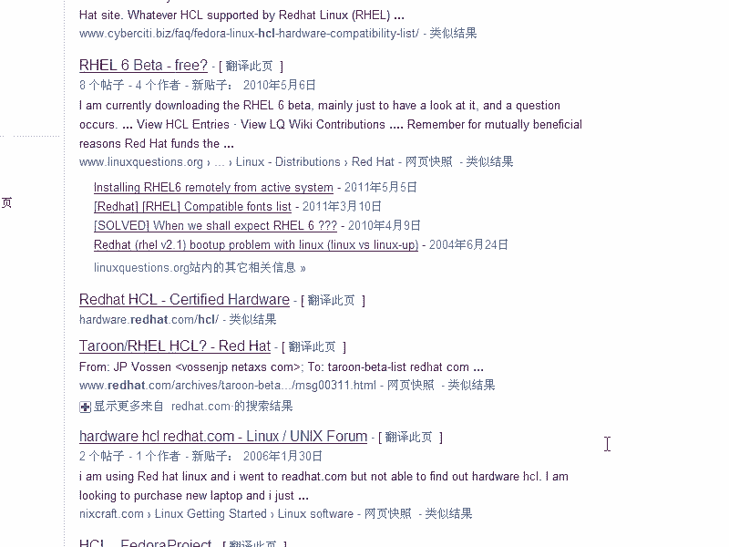

呃，如果要是非非这个就是企业级操作系统。你要像属于BSD啊等等的话，他可能未必会关注这些东西。嗯那也只能靠你试了。然后呢在硬件兼容性列表，你都基本上确定了清楚，或者实在没办法的话呢，用光盘先装一下。

试试看。如果装上去了以后，然后你再看有什么问题。如果要没有问题的话，那就是都兼容，废话嘛，是吧？对，那接下来的话呢，就是呃进行安装，你可以选择图形界面安装图形界面安装的话。

就是意味着你的显卡或者你的显你的显示器啊没有太新啊，就是说基本上没什么问题，都很很兼容。因为服务器又不可能用服谁家用服务器来玩3D网络游戏，所以呢那个芯片的话都不会太新啊，都用基本的这个方式都可以。嗯。

如果要是你发生什么呢？特别严重的问题，就是它实在不支持，那你就用字符的安装界面。在我们的现在的这个R716里面的话呢，还有一种就是说你的。图形显示出不来的情况下，它还有个选项啊，你要点那个选项的话。

选那个选项的话，它就是以这个文本的这种界面的安装方式。嗯，那在老式的RRTEL5里面的话呢，你就是输入一个什么linux text啊。

在but提示服下输入一个linux text就进入了文本这个安装界面，那默认情况下一回车的话，就是默认情况下就是图形安装界面。嗯明白吧，然后呢给系统分区，在给系统分区的时候，你要看一下你的那个存储啊。

或者说原来做好的这个read，它是否能识别出来。嗯，明白了吧？明，然后呢接着的话呢要选择这个要安装的这个软件包啊，分好分好分区以后，当然还要去进行什么呢？进行一些设置。比方设置如它的密码呀。

选择下时区啊，然后呢进行安装就是分区完以后，他要你怎么样呢？说现在把你的软件包啊，那你安装就是选下软件包那在RTL6里面的话呢，它这个软件包的话呢，让你定制的。又变大。嗯，原来R713还可以。

R714让你定制，你定制不定制，实际上都无所谓。最后的话再定制啊，他已经默认帮你选择了不少。R715也是一样。R716的话呢，反过来了，嗯，就是默认不给你选那么多东西了。然后你要自己去去选择。

所以这就是反过来。那么接下来的话呢是选择一下防火墙啊，或者说SEinux啊或者网络的这些安装模式的嗯这这些运行模式的问题。那么我们说那么多没有用，我们就直接开始安装啊。好的，好吧嗯。好。

我们的话呢因为在windows下要录这个视频，所以的话呢呃不能直接找一个这个拿个摄像机去录那个屏幕啊，这样的话效果就太差。我们看一眼啊，那现在的话我用虚拟机的话呢来启动啊。

那么这个时候我选择的我选择的这个就是这个光盘的话呢嗯。

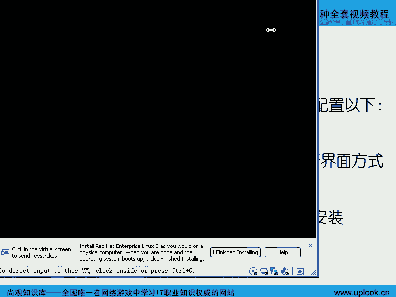

我选择的这个光盘的话呢，就是H16的这个光盘啊，6。0的光盘，实际上就是H16啊，没有update。这个时候的话呢，它这个界面啊就跟以前就不一样了啊，以前是怎么样的？以前的话呢就是呃就是一个就是一个。

就是安装的界面啊，我我给大家看一眼好了，好吧，好，我给大家看到的这是H1L5的安装界面。嗯，那跟H1L6的话呢，显然就是差别太唉，这是H16。嗯，好时间长了自己差不多时间时间长了是吧？

我们这样的重新来一下啊，嗯，重新来一下，看一下H16。

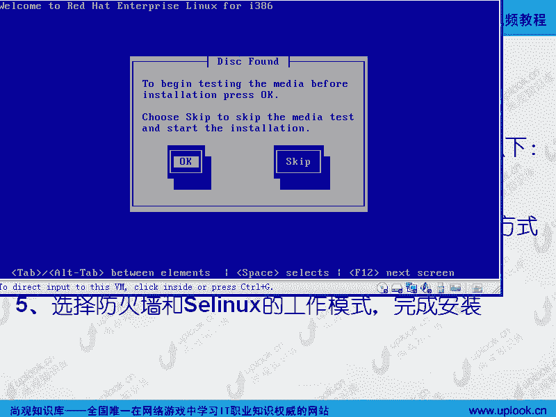

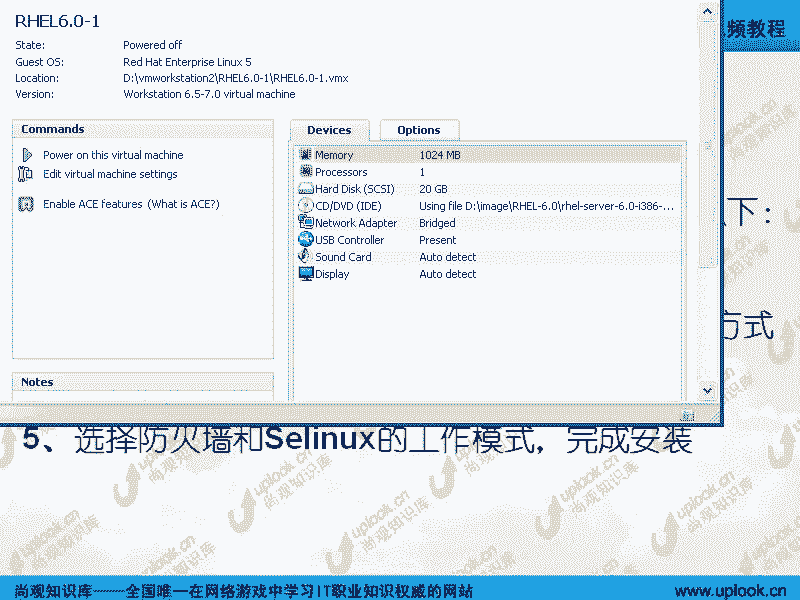

哎，一开始有个界面啊，你们看一下嗯。我们先看到刚才有一条引引的过去是吧？但我们不管它啊，那你看到这个就是R716的安装界面。嗯，那R715的安装界面好像还没有那么多选项是吧？嗯，你看一下。

是不是要那么多选项？嗯，那那唉那这奇怪了，那就是R716的功能又比R715更强大了。那其实不是那么一回事啊，R716的这四个选项的话呢，就是说你这样的上下去。比方说摁上下上下这样的去一回车。

它就进入了是吧？对，那第一种的话呢是安装或者升级现有的系统。嗯啊第二种的话呢是在基本的视频驱动的情况下，就是说你的这个视频啊呃总是出现乱七八糟或者说显示不出来这种情况。

然后呢去那个你可以把这个基本的视频的话呢，去调出来。嗯，就是说呃文本的这种安装安装界面或者最基本的这个视频过就VGA的这个视频驱动就OK了。那么第三种的话呢，是这个rescue模式，就是修复模式。啊。

那么第四种的话呢就是说我不安装就直接从硬盘启动了。嗯啊，那这种方式你看按table键的话呢，它可以让你的话呢，在这里后面的话呢加一些选项加一些参数啊。那这里面的话呢，你看啊。四个选项对吧？

四个选项其实的话呢，我们看一下现在的H7L5，它的选项更多啊，你可以摁下什么呢？摁下F2啊，看你看这边嗯看到吗？按F2有个选项啊，按F2，你可以看它有哪些选项。那么你可以是nopro啊。

linux输入一个linux nopro这边的话呢就是说它不进行自动的这个识别硬件啊，自动识别硬件不进行，让你手动一个一个来指定啊。

第二的话呢就是说media checkmedia check的话就是检测整个光盘有没有人去那个就是说去动你的光盘啊，因为你怎么知道你的安装镜像是从哪来的然后我们现在的话是一个镜像对对吧？这个镜像的话。

我想问你啊，你镜像从哪下载下来。嗯，我我是从官方网站下载是吗？嗯，你真的是从官方网站下下载下来啊，那我现在给你张光盘，那你说这个镜像从哪下载下来，那你不知道吗？对啊，所以这个镜像的话呢，很可能啊。

因为它是开一个软件。嗯，里面加上七八个木马，你怎么知道？对，mediadia check的话就是验证每一个安装包里面是否有reite的。那个数字签名以对开源软件来说，或者你再装一个什么呢？

你再装一个生产系统一定要进行这步那么这一步的话呢，当然你不用输入了，现在是自动进行的，你不要看HEL6啊，没有但是实际上你安装的时候一回车啊。

就是选择第一个一回车它就有自动有这步你再回头来再看那么在你的这个模式下是不是也有啊在R5里面也有啊它会自动把你的这个硬盘上的系统的话呢在你光盘里面光盘启动的这个系统里面硬盘是一个linux系统是吧？

这个硬盘的linux系统啊等等跟分区啊都没加载而你的光盘启动我们用光盘里面的这个系统，然后把硬盘加载上就相当于windows的话呢，你要有那个windows系统吧？

就用张光盘就可以启动一个windows那个系统跟你硬盘上的windows完全两码事硬盘上的windows坏了。你那个光盘的windows照能启动。一样的道理。嗯，但是呢你不要看它有rescu。

但是呢它不帮你修复啊，不帮你修复嗯，不是自动帮你修复的那需要你自己去用命令来修复，明白吗？不要不要记希望它leuxDD的话，你就是输入一个driver disk。嗯，只有温H1。5啊H115是这样。

那么ask method。ask method就是你启动的时候的话呢，需要就是有不同的安装方法，不同的安装方法。等一下我们可以试一下HP16有没有这个功能。行update就是升级嗯呃。

呃memory test86，就是说你的内存的话呢，导致你的系统启动不起来的时候，那你可以用这样的方式。对啊，所以他你在这里面啊输不入一个什么linux。Ask。ask method是吧？

嗯然后一回车它就有5种安装方式啊，你知道这边输入完以后，一回车它有5种安装方式啊，HTTP的安装方式嗯，FTP的安装方式还有本地光盘的安装方式。嗯，还有什么呢？硬安装方式。

还有的话呢就是我们的直接这个光盘的安装方式啊，啊，你看HTP啊，不是我刚才多说一遍HTTPFTP嗯NFS啊，本地光盘还有本地硬盘啊。反定硬盘就是说你把这个光，你把这个ISO镜像放在微fi的分区下。

或者NES3的分区下，嗯啊它就可以。就是你这个光盘只是一个呃非常小的1个CD啊，就是说只是一个光盘启动的这个内容。那么所有的内容全部都在硬盘上啊，就是这5种安装方式，你可以用它的话呢来启动起来。

明白明白吧？那么现在我们看啊看R716，我们看R716的话呢，怎么进到那个界面。嗯啊，其实的话呢R716就就这四种功能。嗯，就这四种功能。你直接的话一到某一项去，然后一回车就OK了。嗯，明白吧？

但是呢你想进入这个界面也可以进摁两下ESC。嗯，啊摁一下还是摁两下，我反正摁到第二下的话才有反应啊，那我可以输入一个什么linuxask method，你试试看啊，嗯。

那么刚才我们看到是不是H16只有4个安装选项。那我现在看这个这个就是像H15里面的这个功能有没有嗯直接回车。我们看那么前面的话呢是加载什么呢？

VMLNUZ支持内核是加载那个IRTRD啊IRTRD整个的这个安装过程的话呢，就跟你选那个是一样的，选择第一个是一样的。我们看一眼啊，我看一眼。😊，好，选择一下什么呢？选择下语言啊，英语是吧？英语。

然后呢，这就是文本用户接口嗯嗯。文本用户接口文本用户接口的话就是说你这个鼠标啊，在这里面你是动就点来点去没有用。嗯，你虽然能看到个鼠标在那边晃，但是呢点来点去是没有用的。你就我点那个ok没有用啊。

你只有按table键看到吧？这样的话呢才有用ask有没有啊也有是不是嗯也有啊，那也就是说我们除了那刚才看到的那个4个选项之外，其实ask method，你也有这个选项。只不过你要摁ES啊。

然后呢来输入那个linux或者是在刚才那个按table键那个画面就是按table键嘛，你输入一个ask明白了明白吧？然后现在的话呢。

因为我现在的话呢并没有把它放在一个linux可以支持的分区下lin可以支持什么呢？就32的分区可以支持一个EX3分区HL6还可以支持HEL还可以支持EX4分区EX4分区还支持XFS分区。啊。

那当是我们windows一般用授分区。NTFSNTFS对对？所以我们放在NTFS分区下，它是不能访问的啊，明白了吧？嗯，那现在的话呢，你也可以通过远程的NFS镜像也得通过什么呢？

HTTP和FTPFTP你也能看到是吧？那么我们现在有没有。那个NFS啊没有啊有没有FTPHTTP啊有没有，其实是有的啊，只不过re官方网站上FTPHTP都有啊，你要输入正确的地址的话呢，就可以装啊。

直接，不过要根据你的网速的话呢，要装一天很慢了，行吧那你能看到界面是吧？那么光盘安装ok那这个就相当于你刚才在那个界面下直接选择第一项一样。

这边我是不是说过有个media check嗯有没有media check有吧那么其实的话呢media check的话呢，就是检测光盘。那么现在的话因为我们装的不是一个什么不是一个生产系统。

那么所以我也不想浪费大家时间那我们就直接跳过啊，这样的话呢，你将会看到一个什么呢？啊，你注意看这个地方看到了吗？就是图形安装界面的那个程序啊啊。

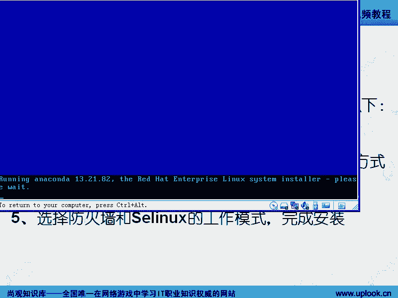

看到吧？嗯，这边H16。那么同样的话，我们看一下H15啊，H15这边的话呢，还有什么linuxDDlinuxDD是干什么呢？就是说我现在的这个。read的卡嗯。

我现在装的这个系统里面没有带这个readd卡的驱动，这个readd卡太新了，嗯，性能太好了哦，太新了，没有带这个驱动，那怎么办？你说我拿这个光盘装吧。😡，但是你装到那边，他找不到readd卡。

readd卡下面的什么磁盘也找不到。嗯，你磁单都找不到，你还装什么系统。对你装到哪去啊。所以这时候你输入lininuxDD那可以从那个readd卡的网站上下载那个驱动回来。嗯，明白了吧？明了。

这住linuxD的作用啊，那么你要把那个公你把那个驱动放呢，放在一个U盘里面，或者放在一个软盘里面，或者放在一个什么其他的这个存储里面，然后呢，让它去选择啊，那么当然了，还有什么呢？

还有就是说你比方说NF3啊，嗯。😊，你般还有一些选项，你比方说呃说这个大就是大小啊，就是它那个存就是那个分辨率等等啊，那么你甚至还可以输入一个什么呢？输入一个。linuxPS等于tstar安装。

就无人值守安装啊，就是把那个无人值守的应答文件放在这边。你如果不知道我说的是什么，没有关系啊，以后我们就专门的案例来讲行好吧，嗯那这边的话呢就一样啊，我们就我们就不，直接就直接怎么样，直接就回车就好了。

就默认的安装啊，跟这个图形界面是一样的，就本地光盘安装一样的啊，我们看R716R716直接打点击下一步，那这时候的话呢，进入到了一个呃就是说进入到了一个选择存储的这样的一个界面。嗯，那这里面的话呢。

就是R716主要的这个不同的地方。如果要是我直接就是基本的这个存储啊，那么我这边直接点击下一步，那他会发现的话，我现在的这个磁盘是怎么样的是吧？

我可以点击初始化或者怎么样初始化所有的你看那么这边的话输入一下自己的主机名啊，选择一下什么呢？时区是吧？时区的话呢一定要选对啊一定要选对。输入一下密码。时区为什么选对啊？嗯，你的时间如果时序选不对的话。

你的时间肯定就不一样。你像我用表，我把它调过来不就完了吗？这个好像也不一样吗，美国的那个时区好像跟咱中国的还不一样吗？那我对我有什么影响？我想反正现在的这个时区跟那个时间对就好了，跟我的表对就好了。

我你管我美国的时区还是哪个市区？呃，这就不太清楚了啊，这个的话就是一个工作方面的问题。嗯，因为你不可能看着你的表来调你的时间。不可能看到你的表来调你的服务器的时间。现在的服务器或者现在的台式机啊。

一般啊或者你的手机一般都是跟什么呢？时间服务器。去同步的那假如说我们的时间服务器啊，它是在比方美国嗯，你这边的话呢去跟时间服务器同步的时候，你是不是同步的美国的时间呢？啊，不是啊。

那么因为时间服务器要查你的时区。嗯，如果查你的时区告诉你是什么呢？呃，东八区那这时候的话呢，他就跟它差整数个小时啊，明白吧？所以你设置错了时间，然后时区在你去跟时间服务器同步的时候，或者自动同步的时候。

那你就会差整数个小时。所以时区一定要选对这边的话呢就是一个后续的一个磁盘的问题。而RTR5的话呢，就比较简单了。你比方说我们看啊跳过这个啊就是这个检测啊，检测，你看是不是也是按框的对是吧？

就under框的话呢，就是re的这个安装程序的名字是python写的啊PYTHON啊句码啊，也叫做。

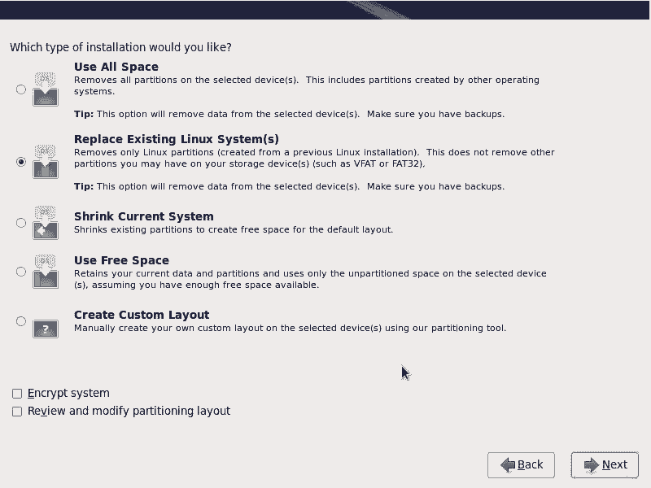

python这个脚本语言写的，那么它可能稍微慢一点啊，这边的话呢就是说H15的这个安装，那H16又回复成了绿蓝色是吧？对。

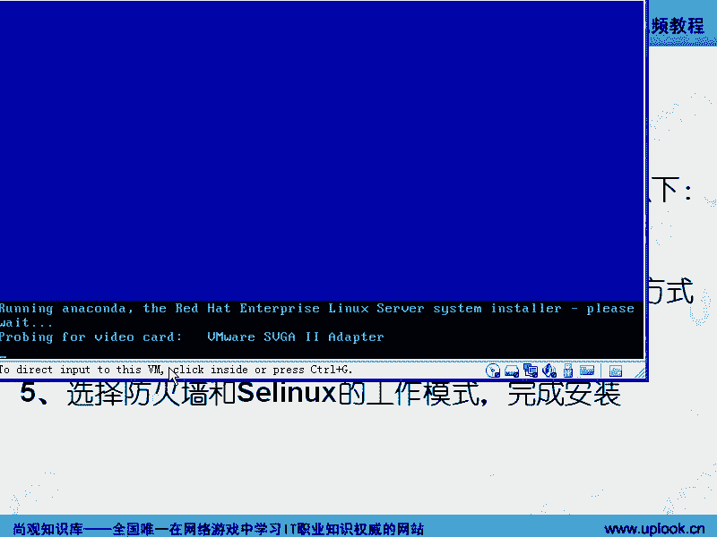

好，我们这边的话呢next啊嗯next。哎，你看这边也是选择语言是吧？对，那很多人的话呢习惯就选择简体中文了是吧？但是呢我建议大家啊一定要选择英文。嗯啊，为什么要选择英文呢？因为你跟计算机打交道。嗯。

别管你英文差到哪去，我告诉你搞定二三百个单词，你在计算机世界里面就是老大啊啊，你要想把英语四级通过你要多少个单词啊，好像四五千个是吧？四五千个单词。对，二三百个单词，这差了20倍。嗯。

所以说呢你那二三百个单词的话，搞定了以后，你一开始是比较痛苦。嗯，但是呢如果你去用中文，我告诉你，一辈子你就在计算机世界里面就是文盲啊，啊，我我见过这样的情况。嗯，我有个学生啊。他指着屏幕啊跟我说什么。

老师这怎么回事儿我过去一看啊，这不是明明告诉你fill a directory not found啊，就是说这个文件或者目录找到嗯，就说你后面跟的这个路径是错的嗯。😡，那他为什么要问我。

因为他是在计算机世界里面是文盲啊，明白吧？嗯所以的话呢你既然走这行，你一定要选择英文。嗯，因为很多人的话一开始都不适应。但是呢你逐渐啊那一二百个单词搞定以后，你在这里面的话呢，是呃遇到什么样的问题。

你都可以自己解决。嗯，如果你单词不熟的话呢，你遇到什么问题，你都要问别人，不要在网上去搜，明白吧？一定是英文的好的一样啊，嗯那他这边的话呢，呃这边有个序列号，这个序列号的话呢，就是我们任何的软件的话呢。

都有个软件的序列号。嗯，而这个软件的序列号的话呢，它是就是说看你有没有license啊，那么这边的话呢，是最开始就就让你输。实际上的话呢，就是找的微软的一套东西啊，那么你要是有钱你经买了的话。

那就是这样嗯。哦我们点击什么呢？跳过是吧？嗯，跳过啊。然后呢，这个时候的话呢，它开始初始化的企业版它安装，这是R715了是吧？然后呢，问你安装还是升级，呢我这边安装啊，安装的时候的话呢。

这边就直接到了什么呢？到了那个磁盘的这个就选择界面了，嗯明白吧？那这边的话呢是说你以删除所有的分区然后呢来创造一个默认的这个就是说规划啊，默认的规划，默认的规划是怎么样的？

就是我把当前的硬盘的所有分区全删掉，把整个的一个硬盘变成一个大的物理卷啊，用LVM啊，你可以如果你不熟的话，你可以记住啊，LVM逻辑卷管理。嗯啊，那么用LVM的主要的功能是什么呢？

LVM主要的功能是什么呢？就是LVM它可以让你的这个磁盘啊，比方说你现在的话这个磁盘总总共是一T那你的根分区是不是默认是最大是一T啊那如果以后不够了的话，那你怎么办呢？你可定要买个两T的空间来是吧？

两T的分区分区过来。然后呢把这。一T里面的数据挪到两T里面去，然后重新再安装系统或者怎么样，嗯是吧？但是呢如果要是你用LVM的话呢，可以把它直接啊，你现在不是一T嘛？嗯又买过来1个2T的嘛。

你可以把一T和2T整成1个3T的空间啊，就LVM可以做这样的工作。明白了明白了吧。嗯所以的话这就是我们所说的这个啊默认的这个layout的这个这个就是作用，明白了？

嗯而下面的话呢是删除掉所有的minux分区。但是呢不要信它。根据我的经验的话呢，他就毫无就是以前H13啊，H14我做过实验。H13H14的话，他把我的windows分区也一并干掉。嗯。

他从来不不是删除掉的是windows分区。然后再一个的话呢，就是用剩余的空间。嗯，那么我们是专业人士，对专业人士一般都点击什么呢？自己自己定义。嗯，那么你看你这边的话呢，你的这个硬盘啊。

你的这个硬盘已经被什么识别出来SIA是吧？那如果要是你想添加其他的额外的存储的话，可以添加I的这个目标或者去呃就是这边是。😊，DM就是说可能是一种read德的设备啊，read的设备。

那么这边我可以去添加一个什么呢？这个icgay的这个这样的一个啊就是说这个存储嗯，icga是什么呢？就是我们知道。我们知道是吧，你知道吧？是串口的是并并行的并行的设备啊，就是我们服务器的那个专用硬盘。

那现在我们都是用串型的设备叫做SAS设备嘛。那么并行的设备是什么呢？并行的呃并行的硬盘是老式的硬盘老式硬盘它是并口的。但是呢这个是靠一根并口线去连的那个排线就像IDE排线那样的，明白了？

一根线上放在对一根线上的话呢，穿5个设备穿7个设备7块硬盘。嗯，但是呢你想一下，如果我们把这根就是排线啊变成是一个网线的话，就是我们把的指令放在什么上走呢，放在一个TCPIP的网络上走。

就是我们所说的你明白吧？就相当于我们用这根网线连了远程的那个磁盘，所以的话这个明白了吧？那么这边的话呢你要看你的这个设备啊，在这边有。列出。如果没有列出的话呢，你要装箱的驱动嗯啊，如果它没有自动列出。

那你就要输入linuxDD或者是说呢你看啊你这个界面下，你在这个界面下，嗯，你在这个界面下其实可以做很多事情啊，不是说点这几个按钮的这些事情。如果你在这儿的话呢，找不到你的设备啊，嗯你要点击上一步啊。

点击上一步，然后呢，你摁下什么呢？ctrorl al加什么呢？F一啊，这就是最开始这个界面，嗯如果conttrol加F2的话是怎么样呢？就这个界面就是个shall是这个shall里面的话呢。

你可以看一下跟。

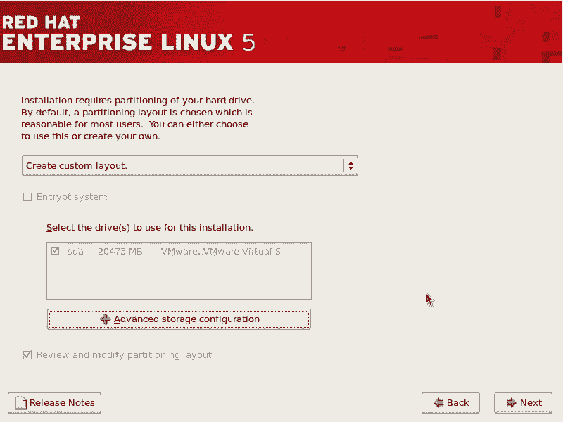

现在你看到的这根的话呢，是在内存当中虚拟出来的一个文件系统啊，那你可以在虚拟文件系统上创建一个什么A件然后呢再插上一个你装放好驱动，就是你现在这个呃就阵列卡的驱动的话，假如说是没有的话。

嗯啊假如说是没有的话，那你从相应的这个厂家的网站上去下载嗯针对这个版本的这个驱动程序。然后呢这个模块下载回来了以后，然后你放在U盘上插到你的什么呢这个服务器的USB的这个口里面然后呢输入一个什么呢？

DV下的比方说SDB是吧？SDB然后呢，mo在什么呢？下面mo上去以后一回车是吧安装然后呢，一回车以后回去以后，假如说啊我现在这是加我没有那个驱动。

那么我不知道你将会碰到什么样的驱动然后你输入一个什么呢in的 mode，然后呢把AAA下面的什么呢？比方说read啊比方说read。card啊ABC随便我不知道叫什么名字。

点KO的这个模块加载上去就行了就行了。那就可以识别出来了，那我就可以识别出来了。嗯，你要你要明白了吧？嗯，所以的话呢你现在看到的这个图形界面，它本质上讲是一个已经启动了图形界面的linux系统啊。

那你刚才是怎么从那个字符界面切换到这个图形界面哎，问的好，alt加F6啊，如果你想在图形界面下切换到刚才那个文本界面下，摁ctrol加F2ctrol out加F2啊，controlal加F2啊，你看。

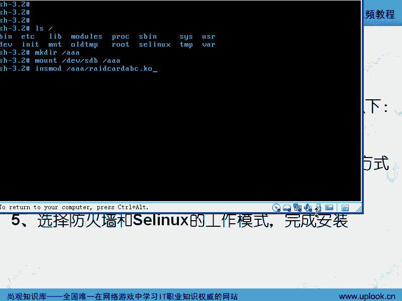

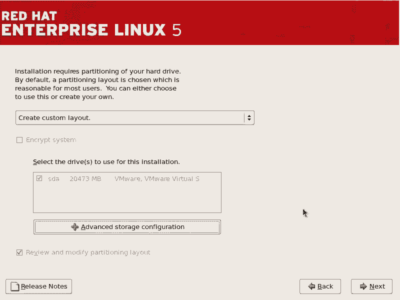

嗯，进来了吧？嗯，这就是那个hell那个界面。嗯不要读音界面，就是alt加F6呃，对你要回到那个界面的话，就是alt加F6嗯。那么也就是说这边的话呢有几个潜在的问题可能你需要去呃碰到的。嗯，第一。

这个KO的模块，它跟我们现在的这个驱动啊，呃就是跟我们现在H715相匹配不匹配啊，你要你要找这个针对715的这个模块明白吧？嗯你或者说你现在装到716，那你就装716的那个模块。

你要从那个网厂商网站上去下载专门的。如果要是没有，就是说如果要是他给你直接一个lin driverdi的那个镜像那你就把dver拿过来，比方说刷到你的那个U盘里面去，或者按照它的要求一步一步来做。

如果要是没有的话，那只有这个KO的模块KO的模块，就是里面的驱动程序的。这个驱动怎么装的，用inmod来那么这个文件系统，你可以用EX3，就是你的这个U盘，你可以用就是格式化，就是不要用NTFS格式化。

用来格式化，或者是用EX3来格式化啊不要用那个。NGFINGF嗯啊也就是说你有个U盘插进去了以后，你右击它啊，在windows里面右击它。

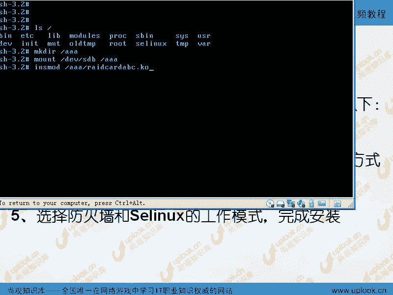

你要右击他点击一下什么呢？尤其他点击一下格式化是吧？嗯呃这边的话呢不是有NTFS嘛？对你给他选择fight嗯啊啊或者说一fight啊，或者fight32。嗯，那么选择fight了以后，格式化完了以后。

哇塞，别真确定，这么惨了。那么就是你的U盘装上来以后，格式化成f以后，然后你从网上啊相应的厂家那边下载专门的驱动。那么下来以后，把这个文件copy进去。嗯，然后copy进去以后的话呢。

在这边呃在这边用这几行命令啊，具体的话呢，这些命令到底干什么的？以后我们会讲嗯啊，以后我们会讲。那么如果要是你在mount的那个位置啊，如果要是mount那个位置，如果出错的话。

那他告诉你没有指定指定好文件系统类型的话，你加上杠TV。

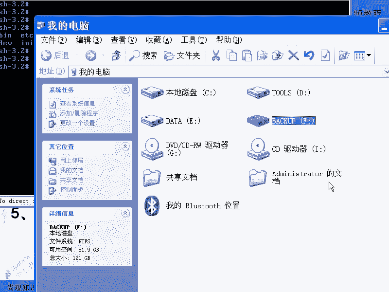

下的SDB啊然后AA啊如果要是你现在也不知道那个U盘到底是哪个的话，那么有可能是SDA也有可能是SDB嗯啊，你到你自自己来看一下，有可能SDC那都有可能好不。

这边的话是这样的那么加l加加F2就是我们的这个文本界面加F6就回去了啊，那你肯定还会奇怪哎conttrol加F2那一加就是r加F一是什么是吧？对。

那么其实的话呢F1到F5都有东西啊conttrol加F1啊，那么如果你本身就在文本界面下，嗯，你本身是在文本界面下，这是文本界面对那你可以按out就好了。按加F1就是第一个界面啊。

alt加F2就是我们刚才说的第二个就是个接口加F3这是你操作的过程当中你操作的所有的这个记录out加F4是什么呢？是一个就是日志类型的东西，就是说。它这个光盘在运行的时候，各种输出都输出在这边。

奥t加F5啊，就是一个呃就是可能是bug啊或者等等这种出错的东西。嗯，就输出内容是不一样。奥t加F6是什么？

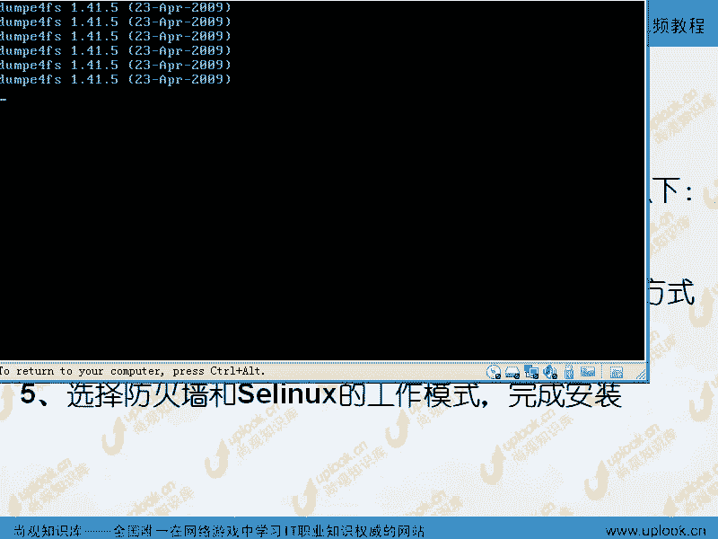

图形界面。对呀，但是呢在我们一般启动的时候啊，是alt加F7是图形界面啊，那我们在这个安装的过程当中，是alt加F6是图形界面。嗯啊，那么在这里面，你想你现在我想考一下你你想切换到什么呢？

就是看一下那个整个安装过程的这个输出啊，呃，我们刚才说在第三个空的是吧？那你你应该怎么样，你应该按按l啊艾，然后再加F3对ctrol加F3如果你是在虚拟机下，你是跟我一样。

再学一下是ctrol al再加shift，嗯，再加什么呢？F3。明白了吧？那么alt加F6再回来嗯，是不是？那这样清楚了吧？清楚了，这就是解决你在安装的时候最大的一个问题。嗯。

那很多人的话都不太清楚这个驱动的话到底怎么弄嗯，尤其是你装的这个版本的R715已经比较老了。对，结果的话，你这块卡是去年刚出来的啊，那就时候你这个卡驱动肯定没有啊，对，那怎么装？

那难道我们换一个R716吗？我现在只买了R715怎么办对吧？这个时候的话你实际上可以解决的啊，清楚了吧？嗯，嗯好，我们再看一下什么呢？R716R716的这个界面的话呢，就跟刚才是不一样的嗯啊。

但是其实的话呢H16这个界面的话呢，已经是选择了基本磁滑的状态。那么如果我们退回去啊。😊，特选择一个什么呢？特殊的这个驱动啊，特殊的存储驱动。那这样的话呢就比H15那个的话呢要更加的对吧啊更加的好一些。

嗯，那我们比要看这个地方，那这边的话呢，它自动找到了你基本的这个磁盘，就这一个磁盘。那如果你选择的是一个什么呢？瑞的卡啊，明白吧？瑞d卡，那它这边的话能看到瑞的设备设备啊，如果要是多路径访问的这个设备。

那么这边的话呢，你多路径访问的这个其他设备，那么在这里面也有或者是其他的SAN的设备，你HB卡连接的其他这种设备都都能看得到啊，明白吧？都能看到。然后呢，你要可以去这样的去啊就是说自动的检测一下。

那么通过你给定的这些东西啊，给定的这个协议等等的话呢，去检测去查找啊，这边的话呢，就是说有额外的一些驱动程序啊，有额外的驱动程序或者怎么样？比如说我现在的话呢想添加一个这个设备。

你看这边也有S还有IFC。欧尔以太网啊嗯OE。这种SN设备啊，那如果要是你有那个驱动程序的话，嗯，就我刚才说那个驱动程。因为R716是比较新的啊。

那你现在这个之前的这些硬件应该是都支持的常见的这些呃常见的这些服务器，你买回来以后，它都是应该支持的。嗯，那如果要是再出现这个问题。呢再切换进去按crl alt加按。对你可以。back退回去是吧，嗯。

然后呢conttrol out是吧？对，加上FR嗯，是不是哎，有没有啊，有也有这个界面，嗯，也有这个界面，那你可以LS跟。

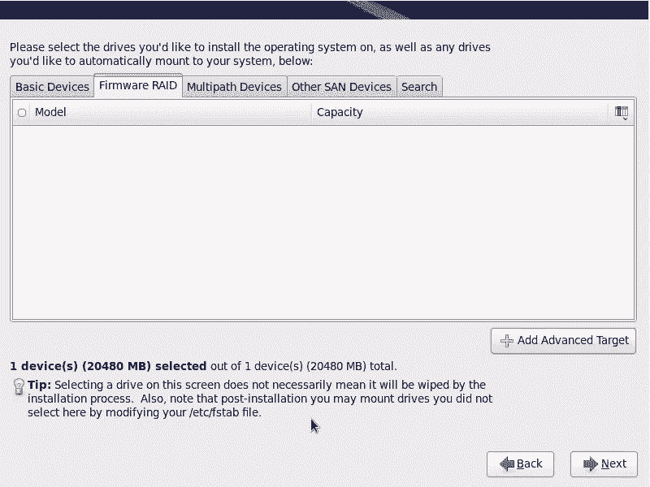

嗯，对吧嗯那么2加F一是什么？这个界面是吧alt加F3什么？但是显示这个命令的执行是吧？嗯alt加F4这边的一些输出是吧？alt加F5可能是错误的输出，是不是或者说这样的一些其他东西的输出。

这是X window的输出啊，那alt加F6是什么图新界面。对啊，那如果你想加载驱动的话，还是alt加F啊那这里面还是一样啊，make加R，然后创建随便创建一个目录，啊在根目下创建个目录。

然后呢再输入什么什么什么对吧？跟刚才那个就是一样，那现在我就alt加F6啊你这步的话呢，应该在之前啊在做这步之前，然后在这个界面下。

你就开始去输入输完了以后点击下一步啊下一步让它的话呢自动找出来你这个就是在这里面找出你的read卡如果没有的话，那可能就不行，除非是基本磁盘，好吧，明白。

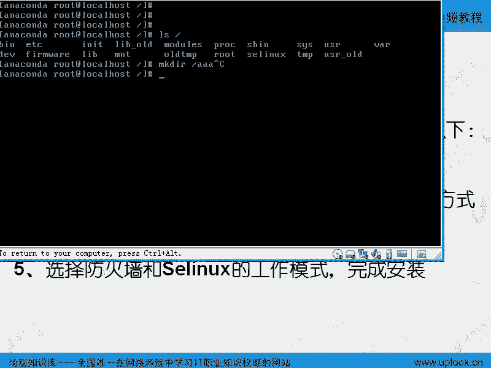

next啊那这边的话呢是说我要在这里面去，他说你要不要初始化你的这个设备。因为我的这个虚拟机里面的这个磁盘被设置成了设备，所以的话呢，它这边PCI什么什么什么这样的一个设备，他说要不要初始化。

我说要是吧化说入完了以后的话呢，这边说你的主机名，那么主机名的话呢，在我们的linux系统里面设置非常重要。嗯，它跟windows不一样，主机名的话呢，经常设及到自己找自己，嗯，所以你设置好主机名以后。

一开始你就定好。如果你现在也没有谱，你也不知道你这个机器的名字应该叫什么。对，你有很多公司里面，你比方说盛大呀，或者说这个什么呃征途啊，等等这些公司啊，那么你可能呃我这是猜测的啊，我没有不了解。

如果要是后面的数据库啊，那我叫dab一点盛大点啊，或者说点呃点什么呢呃datab一点serv点盛大。点嗯啊，那我保证这个名字的话呢，自己能解析啊，它不一定是一个真正的DS解析的名字。

但是它的样子是SQDN嗯啊，如果你也没有谱，就什么呢？local host点loc这是默认的啊，下一步，那这边的话选择市区，这刚才我们已经说过了嗯，是吧？说过了，哎，我怎么选择台北吧，应该选择什么呢？

香港上个海上海当然都一样啊，嗯其实都一样。那么密码是吧？嗯，那么76RT16里面是不是有一个问题啊？那么我们的root账号不能直接登录了是吧？嗯，你必须得用什么呢？普通账号登录进去。

然后再用root账号SU过来是吧？那么我们这边的话呢就用它啊那么又又到这个界面下嗯，那么这里面的话说用所有的空间啊，还是什么呢？用已经存在的linux啊就是删除掉已经存在的linux空间，嗯。

然后新创建linux空间，这是RT16啊，还是什么呢？还是我把当前的linux的分区啊给它缩小啊，然后呢再用空出来的空间再去安装嗯都有都有可能或者是直接用什么呢？剩余的空间。

嗯那我们这些专业人士应该怎么样应该是自定义啊，自定义。那么如果要是你现在比方说想去选择其他方式的时候，这边有个加密文件系统就是你的分区的话可以加密我这边点击下一步啊那这边的话呢有一个这样的空间。

我在这边创建。创建的时候的话呢，这边是一个标准的分区。嗯啊标准的分区的话呢，这边呃下一步。创建就好了。嗯，那你在创建分区的时候，这边有软瑞的对。呃，软锐的是什么呢？就是磁盘的这个readd是什么呢？

read的话就是我们把多个磁盘变变成这种阵列是吧？那这个阵列read零是。呃，调丹化速度非常快read一是镜像是吧？read5的话呢是什么呢？呃就是提供一块硬盘的容入率是吧？

那么就是带基偶校验的这种呃就是说这种磁盘阵列是吧？那么我们的话呢如果选择基本的磁盘，那么就这样。那么软read的是什么呢？就是用分区来代替磁盘啊是一种虚拟的这种呃就是read虚拟的read。

那么LVM的话，就是我们所说的那个呃逻辑卷管理，就是我们说的你这个硬盘啊空间没了嗯，那么你想再拿一块硬盘来，一般情况下，你在windows里面，或者在以前的使用里面，那你毫无疑问，我可能的话呢。

把当前的这个数据移到这个新的磁盘里面去。而如果你用LVM的话，你就可以把2块磁盘做成是一个大的分区分啊，一块磁盘是一T一块磁盘2T那合起来以后可以做成个3T的空间。那么在windows里面也有什么呢？

这种动态卷或者跨区卷，实际上也。是LVM嗯，那么LVM的话呢有一个鼻祖，它是谁呢？是呃。Very tough。very tough ve tough的话。

现在被赛门铁克收购啊每个公司的话它都有个打手的技术。LVM就是这个公司的产品。现在基本上所有的企业级操作系统都支持LVM只不过像微软的话会怎么样呢？微软的话呢啊算我们就不演示微软微软里面的话呢。

有个动态券。那你一旦选择动态卷以后，就相当于是什么呢？创建1个PVLEM的PV啊，就可以做动态卷了，它可以做跨区卷或者条带的这种什么呢？镜像卷啊啊，条带条带化的这种什么呢就是加速的卷，或者说镜像卷。

或者呃那个什么readd5的这种卷，明白吧？呃呃错了，没有readd5的卷，就可以做条代化，可以做什么呢？就是镜像啊，还可以把它们做成连在一起啊，但是呢。微软它只支持什么呢？把它连在一起啊。

把它连在一起啊。好，我们的话呢这边的话呢就微软的技术我们就不讨论了。如果要是我们再去做微软的职业生涯的时候的话呢，大家可以看那个相应的那种啊视频啊。那这边的话呢。

这个我们知道了呃软瑞的或者知道了LVM我们以后的话呢，你在这边知道这儿可以设置，我们以后的话呢，会告诉大家怎么样用命令行的话呢，去一步一步设。嗯，那么如果要是我现在的话呢，想做一个软瑞的话。

我给大家演示一下，嗯，好不好？那比方说我现在想做软瑞的。你看啊，我比方说创建一个软瑞的分区。那这是软瑞的分区是什么呢？比方说我用一G来做吧嗯啊一G。OK那么这边是SDAE是个软瑞的是吧？嗯。

然后呢我再去创建一个再去创建一个软瑞啊，那么这边是。已经是吧？对，然后呢我再去创建一个readd。软锐的分区是吧？嗯，那么又是一G是吧？对，那么我现在用三个分区来做什么呢？这三个分区。

然后我想合起来做一个呃就是readd5，read5的话呢，就提供磁盘的荣余，就是提供一个磁盘的荣誉。我用3块硬盘来做一个readd5以后，它就提供一块硬盘的荣余啊啊，那么比方说我在这个地方啊创建。

我再创建4块，当然也是可以的。那么4块硬盘的话呢，创建出来以后，它也是什么呢？它是也是你看我创建第4块硬盘的时候，它自动做了1个SDA4是吧？嗯，这个的话呢就是一个扩展。啊，因为你要是做主分区的话。

它只能做4个，对它最多能做4个。所以我剩余的空间我能不能用呢？我就不能用了。所以的话当你创建到第四个分区的时候，它自动的把你第四个分区变成第五个分区，而真正的第四个分区做成一个扩展扩展分区。

把剩余的所有空间全部都放到扩展分区里面。嗯，那你做的第四个分区，实际上就做在扩展分区里面的第一个分区。嗯，明知道吧？那现在的话我再去创建什么呢？我再去创建一个readd。啊。

我就要用这四个read的分区来做一个什么呢？readd5出来，那我这边点击create。是吧嗯，可以的。那么现在的话我我想做一个什么呢？MD0是吧？对。

MD0就是说我现在SDA1SDA2SDA3SD表示s的硬盘用SAS的硬盘，或者是SATA的硬盘，明白。如果你看到HDA那表示的是IDEIDE的硬盘，那么SDA是表示s的第一块硬盘嗯，SDB呢？

第2块硬盘SDDB就是或者是说SATA的第二块硬盘啊，那么这边SDA1就是这个硬盘上的第一个分区。第一个分区SDA2就是这个硬盘的第二第二个分区啊，具体这个设备文件啊，就在linux里面这个标号。

windows里面就是C盘D盘啊，在linux里面的话就是什么SDA1SD2SDA3，那再一块磁盘的话呢是SDB1啊SDBSDC就是第3块硬盘嗯明吧？但是呢我们现在访问SDA是不是我的整个的一块硬盘。

对，那么。我把这个硬盘啊，这几个分区合在一起，合在一起，嗯，就是这四个分区，我不是单独去访问。所谓磁盘阵列就是什么呢？我们把多个磁盘当成一个磁盘来访问。

道那这一个磁盘我们肯定不能去找单个的一个磁盘来做了。那这时候我们就是找他们的一个合体，这个合体的名字是什么呢？如果你做软read的话，就是什么MMD0嗯明白吧？我现在做MD0啊，用的是什么呢？

EX3的文件分分区，那么我建议你用EAT3，因为EX4的话呢，只有在HP16里面才会支持HT15里面后续的版本也支持。但是呢它相关的工具啊，我真没谱啊，我也不知道它到底有多少嗯明白吧？

所以的话呢我们用什么呢？EX3会比较稳妥一点。嗯，用EI3的分区，我做的是一个什么呢？read0readd1readd4readd5readd6readd10啊这些readd的级别的。

我们呃就是找时间的话呢，详详细细给大家讲啊。嗯，那么我在这边画一个图，大家可能会比较清楚。因为我们在最开始的话呢，做这个磁盘的这些就是就是我们的服务器的这些东西，可能学的东西会比较多啊。嗯。

你比方说我现在的话呢有一个文件啊，100兆嗯。100兆啊。我看一下啊，100兆的这个文件是吗？对。那么我现在的话呢有一个磁盘，有一个磁盘，这是我的一个什么呢？SDA啊，磁盘。

那我这个100兆的文件写到SDA里面去啊。一般的话我们要把这个分区的话呢呃要把这个硬盘的话分一个分区SDA1是吧？嗯那么我现在的话呢，整个硬盘就分成一个分区。那我这往里面去写的时候，那100兆的话呢。

它不是一块去写。那么第一段的话呢，写到这个前面是不是？对，然后第二段的话呢，就是第一段是吧？第二段写到这儿。是第二段是吧？嗯，第三段的话呢写在这儿这样呢往下排下去，是不是？嗯，是这样的。

但是如果我们一旦做了read了以后，假如说我找两个硬盘来做readd了以后，嗯，那他怎么样呢？假如说我做了什么呢？😊，re0是吧，那它是怎么样的？那么我第一块数据写在这儿没错，那么我第二块数据的话呢。

我就不是写在这儿了。嗯啊，我第一块数据写在这儿了，是不是？那我干什么呢？我第二块数据，我第二块数据写在哪儿呢？这啊，但是你要知道整个的就是说我们的服务器的操作啊，系统调音等等的话，最慢的部分就是磁盘啊。

磁盘写入速度特别慢。比起我们的这个内存来可能快呃，可能慢什么上就是数千倍数百万倍这样的级别就差的数量级就是四五个数量级。嗯呃具体的话呢呃我还没有仔细去算它。差的确实非常多。

所以的话呢我们如果这样去写的话，在没有这第一块还没有写完的时候，就可以写第2块是吧？嗯，那其实的话我们这100兆数据有50兆在这边。有50兆在这边。嗯，所以这样的话呢，整个我这样的一个设备啊。

这是SDB1明白吧？这两个合在一起以后是什么呢？MD0如果做软瑞的话是MD0，嗯，明白吧？做软锐的是MD0。那么我这个数据就写到MD0里面去，而不是写到单一的这一个磁盘里面去。

那这个MD0在操作的时候会帮我分成很多小块，第一块写这边，第2块写这边第3块什么？写这边第4块写这边嗯，那这样的话呢，每一个磁盘都是什么呢？50兆。这样的话呢，我的写入速度快了一倍。嗯。

就是他们数据是2块硬盘，一块写对，那么我想问你啊，那么如果要是每一个写的就是每一个写50兆。那么整个的这个速度快了一倍是吧？嗯，好不好？好，你付出了什么？你也不能付钱啊？没有没有付钱是吧？嗯。

没有付钱是吧？啊，那就是没有付钱。嗯，为什么呢？因为你是用软件模拟的方法做的软锐的software。明白吧？嗯，softwareread。明白明白了吧？软件是软锐的。所以这个软锐的话呢。

它可以把你的性能提升一倍。嗯啊但是。但是怎么样呢？有一点不好，嗯，这块硬盘突然坏了。数据丢失数据一点都不剩。嗯，那你说你这边有个美女图片啊，嗯有一块鼻子在这个地方，一只眼睛在这个地方，这边是什么呢？

另外一只眼睛和嘴巴嗯，你这个数据有用吗？嗯，对呀，那就是这样，所以一般情情况下，我们用软锐的话呢，就是一个什么非常高的性价比。嗯，但是呢是什么非关键的数据，或者你有备份的数据丢了也无所谓的这种数据啊。

那么我这边的话是2块硬盘做锐的零是吧？嗯，也叫条带化。那我如果找了4块硬盘做呢？4块硬盘做red零的话，那么每块硬盘的话只写了25兆，它的性能的话应该提高到原来的4倍。呃，明白吧？它的速度就是飞快。

但是呢因为有我们的软件的因素，那么你的性能可能未必能达到真正的4倍。但是呢你肯定要比单块硬盘要快的多啊啊，这就是我们所说的什么呢？就是我们所说的这种软锐的和软瑞当中的软瑞的零这种级别，嗯，明道吧？

如果你用硬盘来硬件来做，就瑞的卡来做。你用瑞的卡来做。那么这边的话就不是MD0了。你在这个安装的时候，你就只能看到你尽管下面的话有6块硬盘，但是你也只能看到一个设备。硬瑞的就是全套东西都是对你是屏蔽的。

你也看不到，明白吧？他就直接被你屏蔽开了，你管我怎么样去写这些硬盘，你只要操作系统告诉我这个数据过来了，那当然也不是MD0的这个设备了。那可能他就叫做SDA你看到还以为是一块硬盘，实际上它分散在什么呢？

4块硬盘里面去，那么操作系统根本就不知道它后台有几块硬盘，他只知道把数据写到了什么，写给了我们的这个瑞的卡嗯。明白了吧？明白了，这就是我们所说的这个软锐的和硬锐的。嗯，清楚了吧？

那现在的话我给你讲的readd0，你清楚了没有？嗯，清楚了清楚了是吧？那我们再看readd一啊，那么readd零的话呢，显然问题就是什么呢？一块硬盘坏，所有数据都没。瑞d一是怎么样的？那么还是一样啊。

我这个数据写入。写入的时候的话呢，我往这个软锐的上去写，这是第一块硬盘，嗯，这是第2块硬盘。那么我这边的话呢分成一份啊，两份。😊，三份是吧嗯等等。那我这边的话呢写第一份，写第二份，写第三份等等。

这边照样写一份两份，第三份嗯全都这样。那么他们俩做的是什么呢？mate一。read一还是readd1，那么他们俩合在一起是什么呢？还是MD0啊，明白吧？还MD0。那么显示过来以后的话呢。

速度没有任何提升，甚至略有下降啊，但是呢可靠性高了。这个系统这个坏了，一点事儿都没有，所以我们什么情况下用用read一呢？什么情况下readd一呢？备分的时候法，对，就是系统盘。

就是你希望的话你的系统盘一个分区一个系统盘坏了以后，另外一个系统盘能直接接过来就用啊，那么它两个完全一模一样，这叫做什么呢？镜像就镜像做镜像嗯啊，刚才那是做什么呢？做强外化，清楚了吗？听楚了？

read一，你现在接触的是什么呢？企业的这种技术，所以稍微有点麻烦。嗯啊，还有的话呢，我们看read4是什么？我这边的话呢有一个呃这个文件啊，1234是吧？嗯，那么read4也好，readd5也好。

至少要3块硬盘来做。嗯，你看啊read4是怎么样。至少要3块钱吧。这是第一块硬盘嗯啊这是SDA啊SDB啊SD。C是吧？嗯啊还有什么呢？假如说4块1块SDD吧。对吧嗯。

那么现在第一个数第一块数据写在这个地方，第2块数据写在这个地方，第3块数据写在这个地方。嗯，第4块数据不往这儿写。啊，而这个地方的话呢生成一个机有校验块。嗯，既偶校验块。什么叫做基偶校验块？

你比方说这一块数据的话呢，第一个位置是0。第二个位置是一啊，第三个位置是0。那这个第一个位置的话呢是100啊，这边的这个数据的话呢是001啊，我不管它是什么，那你看第一个位置，这是零是吧？对。

这儿是什么11这儿是0是吧？嗯，加起来多少11是吧？嗯，那我这边保存1。这个这验块，第二个位置这是一是吧？第二0是吧？嗯，第三个是零是吧？那么这个地方的这个块里面的啊，第一个位置已经是一了是吧？

这个第二个位置是什么呢？这个第二个加起来00再加起来是什么？再加一是多少一是吧？嗯第三个位置，那我们就以此类推，还是什么一是吧？嗯我这样既有校验，这个既有教验块啊，生成了以后，那么可以达到什么效果呢？

假如说我这个东西坏了，嗯，SDASDC坏了，嗯，SDC坏了以后，我们能不能通过现有的这个数据的这个这个块，那这边是零是吧？这边是一是吧？嗯，那我这边既有校验的位置是多少？😊，一是吧，嗯。

那我就推出这个位置是0嗯，你看吗？你如我再塞了一块新的硬盘过来，数据是不是就恢复出来对。明明白了吧？嗯，所以话呢我在readd4啊readd4。read4它能提供一块硬盘的荣誉。嗯。

那假如说我第4块和第5块怎么写呢？第4块我写在这个地方，第5块我写在这个地方。嗯，第6块我写在这个地方，这边再去生成一个什么基有校验块嗯，明白吧？就这样read四的问题是什么呢？

readd4的问题就是说它的性能啊有可能不好，但也有可能好，性能不好的原因是什么呢？所有的基有校验块都在SDD上啊，都在这一块硬盘上，所以导致这块硬盘的话呢，做变成了一个什么呢？变成了一个呃瓶颈。嗯。

那么read5是怎么样呢？read5就是说呃我第一块数据。我第一块数据啊这样写第2块硬盘呃第二个数据写这儿是吧？第3块数据的话呢，写在这个位置啊，我先把这个叉去掉啊。嗯，第3块写在这儿是吧？

那么第四就是第4块硬盘我做什么呢？我做基有教验是吧？嗯但是呢到了第二轮的时候，我的既偶校验块就在这个地方，这这个是基有教验块。刚才是这个地方既有教验块，那么这个时候的话，这个地方是什么呢？

4嗯这个地方是什么呢？写5这个地方是么呢？写6嗯清住楚吧？也就是说read4和readd5的区别在于什么呢？readd4是全部都集中在一块硬盘。而readd5的话呢是把基偶校验块分散在所有的硬盘上。

所以那这样的话呢，它的就是负载的话呢，就分开了负载就分开了，明明白我的意思吗？明白啊所以这就是readd4和readd5的区别嗯啊，那你说readd4块还是readd5块。😊，这个快慢吧，我觉得。

re4是所有的基础加验块都在这一个硬盘上。而re5的话呢是基础加验块分散在啊不同的地方。第一轮、第二轮、第三轮的话都不一样。嗯，他们。是锐的4块还是瑞的5块？觉得他们一样吧一样啊，那既然一样的话。

我为什么要有readd5呢？我read4不就可以了吗？你不是刚才说那个read4有一个瓶颈吗？那个那块硬盘对啊，那显然就是readd5快了嗯啊，但是也不一定啊，因为readd4的话呢，正因为有这个特点。

嗯，那我们能不能啊这块硬盘比方说做成一个固态硬盘啊啊或者是说什么啊我这边是胡扯啊，不是说固态硬盘，就是说我的意思就是说你写入这块硬盘的时候速度快一些。嗯，那前面加个缓存行不行？行。

这就叫做加强型的readd4嗯，加强型的readd4比red5还要快哦，清楚了吧。嗯啊这就是red4readd5的区别。嗯，那么他们两个的话呢，至少要3块硬盘。啊，至少3块钱盘，明白了吧？明白了？

那如果readd6是什么呢？read6就是说我不止横向有什么呢？有一个技术教块，我纵向就这个磁盘本身的这个块，每次写的时候，还有个技有教块，这个技有教块放在其他的磁盘上。嗯，一能生成两个基有交块。

每一轮生成两个，至少是两个交基有这块。嗯，那么这个基有这样块的话呢，放到其他磁盘上，它提供2块硬盘的荣誉，这是readd6。所以red6的话要比red4和readd5都要慢嗯，明白了吧？

但是readd6的话呢，至少要什么？这个至少要3块硬盘，这个至少要3块硬盘。而readd6的话呢，至少要4块硬盘。嗯，清楚了吗？清，所以这就是我们所说的这个回过头来再去看这个地方，嗯，明白了吧？

明白这个时候回过头来，我们再去看这个地方。这是我们在讲这个地方啊嗯那么回过头来，我们再去看呃这个地方。那这地方你是要做readd0还是readd一还是read4还是readd5还是readd6是吧？

嗯readd10是什么呢？就是把2块硬盘先做一个readd1嗯，然后再用这2块硬盘和另外2块硬盘再去做一个什么read或者read这样的read10明白吧？明，那么我们用E3，然后呢做了一个什么呢？

因为我现在有4块磁盘是吧？我既可以做read5又可以做readd6，还可以做readd4也可以做readd，可以做read1嗯对吧？都可以所以我现在的话呢假如说我做一个readd5啊，这些磁盘的话呢。

我是把分区当成磁盘了。其实应该是SDASDBDCSDD是吧？但是我现在是SDA1D2D这样的性能显然不会太快为什么？因为我写入的是4个分区啊动作还是一个硬盘在动？所以它速度肯定不会快。

所以软read如果在单个硬盘上，我个人觉得除非是你想进行什么。😊，磁盘的那这个数据的容余，嗯，否则的话没有什么太大意义。嗯，明白了吧？对啊，那这样的话呢，我这边加载到哪呢？然后加短到根啊根嗯。跟上啊。

我做了一个什么呢？readd5，然后MD0做跟啊，OK那这样的话呢，我这个磁盘啊，你看四呃四个应四个分区，每个应每个分区的话，实际上是一G对，加起来应该多少？4G啊，那它实际的空间多长呢？3G3G。

所以的话呢你做readd4或者readd5的时候，它是损失一块硬盘的容誉。嗯，因为你有一块硬盘，就是那个位置是要做基础校验的呀，嗯，是不是啊？对，所以的话损失一块硬盘的容量。那做出来以后就是3G对吧？

那么LVM的话，我先把这个删掉啊嗯。哎，就是饭了。这实际上以前的话呢叫做磁盘德鲁伊啊，但是现在的话呢已经完全并在con当中了。嗯啊所以我们经常说磁盘德鲁伊的时候，很多人也不知道是说的什么东西。嗯。

我如果做LVM的话呢，那就简单了啊，我这边的话呢把这个整个的这个硬盘啊全部做成一个什么呢？LVM啊。啊，全部做成1个PV嗯，这个PV的意义是什么呢？我给大家也是画画图啊，我画画图下来看一下嗯。

如果要是你现在的话呢，想去搞清楚这个LVM的话呢，是这样的LVM本身的话呢，是这样，我现在有块磁盘啊，我这个磁盘的话呢，上面这个分区是SDA1是吧？对，下面这个分区是SDA2啊。

第二个分区第二个分区是根啊我这个根那么因为linux里面的话呢，我们说linux的C盘就相当于根了，就相当于根了，因为它所有系统的东西的话，放在根下，那么它还应该有个什么呢？杠这个地方的话呢。

这个盖尔福的分区的应该是有100至200兆的这个空间放的是什么呢？放的是是我们lininux的内啊，放到ux内核，那么就是内核放在这里面。但是呢内核启动起来以后，要启动同界面吧，对要启动什么呢？

要启动我们的这个网卡是吧？要启动我们的这个比方说你要有字体对吧？你还要有什么呢那些命令啊就是外边服务啊等等这些东西那么他们都放到根下面。那假如说这个根啊，我现在指向什么呢？加载到了我们的SDAR里面。

嗯，这个根有多大呢？这根的话呢，比方说我这个是一T的这个空间。嗯，我比方说这边的话呢，基本上就是一T的空间了。嗯啊我这个一T的空间。有一T的空间。那我的这个根就冒子在我的这个SDA2上，就这样。

那么当我的这个一T空间不够了以后，我又买了个2T的空间，那么这是SDB是不是？对，这两T2T的空间，我把它变成了一个分区叫做SDB1，这是两TB的空间。嗯，明白吧？那现在这个根不够了。

那我想把这里面的数据往出导，那怎么办呢？你只能把这些数据啊，那么比方说特别多的数据，嗯逐渐的话呢把它导到这边来，对，导到这边来。那么你的数据导过来了以后啊，比方说在这个里面什么地方不够了呢？原来的话呢。

你在这里面啊有一个分区有一个有一个目录叫做什么呢？比方叫做啊买circle吧。mycicle是一种数据库是吧？对，mycicle这个目录里面的东西啊太多了，已经达到了一T的这个东西已经没有空间了。

于是的话呢，你把mycicle数据库里面的东西copy到SDBE里面来，然后呢再把S啊再把买circle啊，这样的一个目录加载到SDBE去。哦，明白我的意思吧？嗯那么这边是把这个数据的话呢。

copy过来，然后再把它加载到这边去。那么反过来讲，就是这个里边的这个数据，原本的话呢，这个里面的数据啊。很多很多数据是吧，是不是都放到这个SDAE上的。对，是不是？那现在的话我把它移到这边来了以后。

这些数据是不是就跑到了SDBE上去了？嗯，就实在的数据是不是跑到这里面来了？对，那这里面的数据是不是可以删掉了？嗯删掉了以后啊，那么我们买circle这边就成功的变成了什么2T的空间，是不是？嗯。

那这边的这个数据原本的话呢，这边的数据比方说1。8T这1。8T删掉了以后，这1。啊0。8T啊，这0。8T的数据删掉了以后，这边是不是空出来0。8T嗯啊，你还能再用吗？不能，系呀。嗯，明白我的意思了吧？

嗯，明有我的意思，也就是说。😊，你的这个分区有一个目录特别大。对，这个大特别大的这个数据的话呢，你把它这个里面的东西挪到了另外一个磁盘上。嗯，那这边自然就空出来了。对，空出来了以后。

那么你又访问这个新的东西，然后访问这个新的这个目录的时候，就访自动访问到了这个磁盘上，是不是？对那原本的这个磁盘里面的数这个空间的话也没有用。嗯，而且的话呢你在挪动的过程当中，自然要把这个服务停掉，对。

自然要把my思qcle这个服务，就个数据库服务停掉，嗯，对不对？那所以的话呢，这就是传统的方式。啊，最后的结果是什么呢？我给大家涂一下啊嗯啊这边。清净了有很多的剩余空间。对，明白吧？

这边很多的剩余空间啊，很多的剩余空间。那么我们的这个我们的这个mysrcle的话呢，你访复mysrcle就跑到了两T的剩余空间当中去。那这边的这个空间怎么样的？就空余了0。8T这个空间是没有办法用的。

对，所以而且的话你在移移这个空间的时候，你这在移的时候，你必须得把这个服务停掉，然后把数据移过去嗯，然后再重新加载啊，具体怎么加载，我们以后再说嗯，所以这就是什么呢？传统的方式。

而加LVM也就是默认的方式，从HTL3HL4以后，全部都是默认怎么样的，它这样现在你这个空磁盘是吧？对我这边的话呢给你保留出来bo分区，剩下的根分区啊，根分区还加载到第一V下载SDA2吗？还加载吗？

no啊，不是这样加载嗯，而是把整个SDR变成一个什么呢？先把它转换成啊。我把这个涂掉啊。先把它转换成什么呢？最烦的就是这个地方啊，大家稍微耐心点，稍微讲的有点多。嗯。

这个地方的话先给它转换成DEV下面的，我把它叫成什么呢？我把它转换成叫做VG0嗯，啊就是卷组。写的不清楚啊。这个的话我们还会讲很多遍啊，嗯VG0。危距里。当中的什么呢？LV0VG是什么呢？

卷组对啊建卷组。嗯，walling是吧？对我我不知道该 groupgroup啊，那么logic是吧，就是逻辑卷。那么也就是说我们把根分区直接加载到什么呢？卷组里面来。嗯啊，但是这个卷组的话呢。

我现在的话呢这个东西啊就是D一V下的SDA2是1个PV啊，假如说第V下的SDA2是什么呢？D一V下的SDA2啊。DV下的SDA2做成是1个PV。那么这个SDA2呢，它原来的空间是1T是吧？嗯。

那我们这个卷组的话呢，只有1个DV下的SDA2，它这个卷组就是什么呢？ET。那么在这个地方，这个LV0的话呢，它最大也是什么？最大也是ET。嗯，这就相当于一个虚拟磁盘，这个VG0的话就相当于个虚拟磁盘。

嗯，你说哎呀，原来我把根分区直接ma在第一下的SDA2。对，结果现在我不是把跟分区直接漫在SDA2上，而是把SDA2先变成1个PV让这个PV加入到什么呢？这个卷组里面来，VG里面来。

那么这个连ET的空间就变成了什么VG零下的一T的空间。嗯而VG0能创建的最大的逻辑券是什么呢？就是虚拟的分区是多大呢？也是一题嗯倒了一个弯，我加了一个层次。但是呢这有什么好处呢？

你看啊那么随着时间的推移，它又空间又快满了。对那这时候我们买了一个什么呢？2T的这样的一个呃SDB。嗯，两T的空间这两T的空间，我们把SDB直接变成什么呢？第2个PV。嗯。

把这第2个TV的话呢也并到这个VG里面来。哦，那你这个1VG的话原来是一T嘛，对，就变成了1T加2T就变成两3T。那你原来这个逻辑券啊，就是你这个虚拟的磁盘下的虚拟的分区最大是一T是吧？

因为你虚拟的磁盘就是一T嘛。对那你现在的话呢，虚拟的磁盘已经变成了3T了。你是不是可以把它动态的变大。嗯，所以的话呢做LVM就是这样的好处，你之后就可以把你的这个边分区啊或者是其他分区。

当然不一定是跟了，你也可以说马sq忘在这啊，或者怎么样。那么你的这个分区不管怎么样，可以动态的变大啊，也就是说你的这个LV0的话呢，你可以用一个命令，在不加载。

不重新停止那个服务的情况下你就可以把它变大。也就是说你可以。一T到多少呢？3T的空间。明白吧？嗯，3T又不够了。3T又不够了，你的话呢又买了一个什么呢SAN的什么呢？SAN的这个光纤存储柜。

那这个存储柜的话呢有10T。嗯，这个存储柜的实际的空间的话呢，叫做SDC。那么你把这个SDC的话呢，也变成是一个什么呢？PV这个PV的话呢，也加到什么呢？VG0里面来。嗯。

那么你的这个空间就变成了什么呢？再加上一个什么10T变成13T了。那你的这个LV0的话，就可以由ET变成03T再变成什么呢？13T都有可能嗯清楚了这就是LVM但是LVM的话呢好是好啊。

我个人的话呢一般较少用，因为我的空间可能需求量不是那么大。再有一个最大的问题是什么呢？我特别担心LVM本身这个层次出现问题。嗯，那么我在这个LV上要加文件系统嘛，比方说EIT3的文件系统。

EI3的就跟NTF1样啊，那么E3的文件系统E3文件系统如果坏了话，我修E3就好了。那假如说E3是因为LVM坏了。LVM坏了，那么有两个层次要修，所以我一般的话呢用的比较少。也就是说你没事干的话。

不要用LVM。嗯啊你要是觉得你以后肯定这个空间会增长的会比较猛。而且你现在磁盘肯定没有办法满足需求的那你基本上已经预料到了，你用LVM我是支持，清楚了吧？这就是所谓的LVM。明白了明白吧，逻辑卷。

管理嗯，LVM清楚吧？清楚了画这个头的话的画的就比较。头痛了是吧？嗯，那么我们回过头来再看啊再看。😊，再算出安装。所以我现在的话呢做成1个LVM以后，然后我再去创建分区的时候。

那我再创建分区时标准分区的时候，create啊，我要做一个什么呢？EFT3的分区啊，哎，我看啊。两走啊，怎么样，我去。编辑他编辑他哎，对。啊，这儿你看嗯是不是可以串那个卷子，对VG嗯，是吧？

创建这个VG以后的话呢，这边有220G嘛，它就是20G。那么PE的话就是物理卷是呃就是physical是吧？那么这边的话呢是卷组就是物理卷里面的最小单位是4兆你可以根据你的这个卷大小的话呢。

方128兆等话24兆磁你可以变成16兆了吧？你这个卷组的名字随便起我刚才叫做什么呢？VG0嗯吧我这边呢O就说你好了，然后可以在这里面添加虚拟磁盘了是吧？嗯我可以添加第一个虚拟磁盘叫做什么呢？

比方说跟跟下面是吧我这边叫做什么呢？LV0刚LV用什么呢？文件系统格化那么多大呢？我可以用全部的空间20兆20G是吧O就可以了当然我可以给pe等等的话，留一些空间我这边用到了什么呢？18G。

是吧18G对或者多少。那么一般情况下的话呢，我们要注意啊，就说呃。我还是得给大家画个图。这个地方的话呢，我们刚才啊就是说说的就是。我们这个地方的话呢说的就是比较多，因为的话呢最麻烦的地方也就这样。

你一定要咬牙挺过去啊。嗯，那么我们在这里面的话呢呃告诉大家，如果你有一个硬盘。你现在再装一个lininux系统啊。linux系统，那么你一般啊最少需要多少个分区呢？最少一个分分区啊，这是SDA啊。

那么你一个分区，比方说把我们的根分区这个分区的话呢，就是根啊，它是一棵树单棵树的。这个具体为什么是根什么的话，我们以后会给大家讲这个目路结构，根加载到什么呢？加载到SDA一上去。就够了嗯。

你这边是一T也好，还是两T也好，那么你的linux就能启动起来。嗯啊但是事实上我们是不是这么干的呢？我们不这么干啊，我们为什么不这么干呢？你看啊我们要根据情况来这个地方的话呢就是很有讲究了。

一般情况下我们的话呢还是这样的，还是这块磁盘啊，对我们会把这个硬盘的最前面的100至200兆。嗯，那么给他的话呢，单独分一个分区就是什么呢？what分区。那么如果要是你不单独分出来的话。

what分区就在SDAE里面。那么这个地方也是SDAE是吧？嗯，只不过这个SDAE只有100到200兆。那么我们要把前面的100兆200兆的话呢，给bo这个目录啊，这个目录的话呢。

如果你不单独分分区的话，它在这里面只是一个什么呢？目录而已，当然他会有其他的各种各样目录。明白吧？对它全部都放在根这个分区下。嗯，那么如果要是你把它单独分具分区出来。

那么就是原来bo特目录下的种种东西就放到了什么呢？单独的这个分区下。那么这个目目录下有什么呢？我们刚才说过有什么我们的 kernel内核是吧？我们的内核放在这个目录下，放在这个分区里面有什么好处？

你有没有发现这个bo是不是放在最前面呢？嗯，那么也就是说硬盘一启动的时候，硬盘假如说有两T2T的大小，嗯，那你从头扫描到尾是不是特别费劲，对，那么我们的bis可能未必有那个能力，对不对？

嗯你就我们的bel未必能找到你的内核，对，而如果你把它放在最前面的话，我们的bel一下就能放所以的话呢有关我们启动的东西，一个是，一个是graph，就是我们的bo load一个是 kernelel啊。

就是我们的 kernelel和什么呢？bo。😊，loader啊 loader我们这个 loader叫什么名字呢？这种 loader是一种类型的程序嗯就跟我们说办公软件一样。

这种办公软件具体的名字叫什么呢？叫做grab啊我们当然loader不是不是办公软件它是启动装载器啊，叫做那么gra也放在不同路下也放在不同路下，这两样东西放在不同路录下，那么跟启动相关的，明道吗？

这个时候的话呢，你的这个根分区假如说像上上面这种方式去安装的话，像上面这种方式安装的话，那假如说整个的需要的大整个的需要的大小，比方说啊3。5G是吧？那么如果要是你把l和loader拿出去以后。

这两个的话呢，假如说占3030030兆的话，那么就是3那么这个里面那么100到200兆的空间是吧？有30兆有30兆放在这儿。那么是不是你本来是3。5G是吧？那么下面的空间就是3。5G减去什么？3兆。

上明白了吧？嗯，那这样的话呢，你把它单独分出分区来，就是这样的结果。嗯，清楚吧？那一般我们会这样做的，我给大家讲了，为什么我们要单独分一个波特分区出来。

因为我们硬盘可能很大对你的白要在启动的时候要加载内核吧。对，那加载内核它要搜索整个的你两器的空间太慢了。对，可能未必能搜索到，那这时候你要把单独的波特分区分出来。嗯，清楚吧。清楚吧清楚了？

那么现在我们再看啊，那么一般情况下的话呢，我们还会再去做一个什么呢？再去做一个根分区。我们会把什么呢？剩下的空间。😊，啊，剩下的空间做成什么呢？根分区嗯什么呢？SDA2啊，这样就好了。

嗯还会加一个什么呢？swipe这样的空间。那么SDA2和SDA1他们都是什么呢？EFP3的文件系统啊，只有swipe空间对用什么呢？spe的文件系系统啊。

swipe文件spe文件系统实际上就是没有文件系统啊啊，就是没有文件系统就是说就是空白的空间，它要把内存页导进来？swipe空间做什么呢？就是内存不够的时候，它把内存当中数据移到这里面啊。

那在windows叫什么呢？windows叫虚拟内存文件啊，虚拟内存文件，那这里面的话呢我们用的是什么呢？我们用的是。酸啊，我们用的是。啊。SDA3嗯是吧，就这样，所以一般我们正常的安装的话呢。

会有这三个嗯，会有这三个分区啊。但是呢我们根据情况的时候，可能还会有此不同，就是实际的实际的这个呃就是工作时候啊，根据你的经验，那么什么情况会有不同呢？就是我们有可能啊有可能根据公司的要求，嗯。

或者根据你的经验，我们会把什么呢？TMP目录单独分一个分区出来。啊，如果你不单独分出来，它就放在根里面。嗯，那么你也可以把什么呢？落下的。log目录也单独分出来，为什么呢？

因为这两个啊这两个TMP目录是放临时文件。嗯，那么在linux里面，如果要是你比说oracle数据库突然宕机的话，它在内存当中的所有东西就会被写到我们硬盘上，那它随时的话占有多大空间呢。

可能是十几G的内存空间，这十几G一下的话，就放到TMP目录下。嗯，那你TMP目录在它oracle宕几次以后可能就满了啊，那如果要是TMP目录并没有单独分分区出来，那它是放在根下是根分区就会满掉。嗯。

所以的话我们把它TMP目录单独分出来的意义是在哪？就是说你不管怎么样，TMP其使满了，也不会把根分区那个就是充满。如果TMP不单独分出来，它就是放在什么SDA上2上，那它可能会把SD2。那个成长嗯。

明白吧？那么霸下的log也是一样，有很多人的话呢可能不太注意日志，不太注意日志。嗯，但是那个日志的话，如果你永远不清理，当然lininux里面是自动每一天凌晨的4。02分会帮你清理日志。

如果你永远不清理。那这个日志每天的话增长几百兆，每天增长几百兆。一年的话呢，比方300兆乘以300啊，33。知唔知啊。嗯，9G是吧，嗯，是9G吧，300兆乘以300。300兆就万可膨胀不是90G吧。

90G。嗯，是吧三天的话呢就是900900兆嘛，对对吧？就90G。你就说你的空间的话呢，就就很容易就被它占满了。所以的话呢这个就是日志啊，或者是其他的其他的这个系统日志也单独分出来，这是工作经验。

嗯啊我们不是在讲linux课程，我们在讲工作经验。嗯，明白了吧？这就是实际当中使用，你可能把TMP或者wa下的log也单独分出来，嗯啊也单独分出来。那么这就是这样。那么另外的话呢，我要我给大家看一下啊。

嗯那么现在的话呢，我们假如说按照我们的这个要求来。但是你一般的话，你现在在学习阶段没有必要嗯没有必要分那么多。那么现在的话呢呃这边我把它定义位下的VG0当中的LV0我给它做成了根温区对吧？

那么这边的话呢是这么多啊，那我当然还可以去添加一个什么呢？swi空间swipe空间什么呢？剩下的都给swipeswipe内虚拟内存文件根据你内存的大小啊，如果内存特别大，32G从来没有用满过。

那你可以把它设置稍微小点一般的话是内存的1到2倍啊，一般内存1到2倍啊，我把剩余的空间都给swipe了，O。啊，这边点击OK那这样的话呢，我整个的一个磁盘是一个什么呢？PV把这个PV加入到什么呢？

那这是。PV是吧？嗯PV把这个磁盘的话加入到什么呢？VG0当中去了，加到VG0当中去了以后，那么做了一个swipe空间，做了一个什么根空间。嗯，当然我没有做bo分区，嗯，没有做but分区，知道吧？

这样也可以。嗯OK那现在的话我先把它什么呢？删除掉啊。我resite吧。啊，回回回复，然后呢因为你刚才做的所有操作都没有实际在动啊，你在这里面点鼠标的过程当中，它都没有帮帮你在动。

它只是帮你把你的过程记录在一个记录在一个操作的这个文档当中，等你点击某一步的时候，它才会帮你自动去中啊明白吧？现在的话我这边点击什么呢？创建啊，我就在基本的这个磁盘上进行了。嗯。

我刚才给大家讲了软还有read还有讲了LVM还讲了我在安装的时候，必须一般来说要有三个分区。这三个分区，我为什么要这样做，还有在实际使用的时候，我可能要把TMP目录和log目录单独分出来做分区，对吧？

那O我这边点击create那么这个时候我去创建一个什么呢？比说E三个分区啊，那么这时候我是创建一个名叫什么特分区，这回我是专门要用了啊，有三那么200兆是吧？O。啊，1100兆200兆都可以。嗯啊。

实际上它占用的话就是几十兆再创建。那我这边的话呢又是个EIT三分区啊。那么现在的话呢，我因为以后我还有自己的规划，嗯，然后我还要给大家演示怎么样去呃就是创建分区创建LVM啊命令行的方式创建LVM等等。

那我在这里面的话呢，我就怎么样呢？我就要给大家留一些空间。嗯，所以的话呢我不占满了，那我用什么呢？一般完整的安装全部都安装上去，你给他留6G的空间，给我给他留什么呢？1G嗯。

实际就是我把根做了实际的空间是吧？OK。啊。然后呢，实际的空间。然后在这边的话呢，我再去创建创建一个swipe是吧？嗯，创建个标准的分区是一个什么呢？swipe空间swipe分区。

那么内存到1到2倍是吧？那我这边的话呢，给它一G啊，那我还有一些剩余空间是？那么我这时候的话呢，在创建第四个分区的时候啊，假如说我创建个TMP目录啊，这边创建当然我实际不想创建了。

嗯那么我这边的话给大家演示一下你可以看一下，我这边现在有三个分区嘛，对吧？我再创建一个什么呢？我把TMP目录单独创建去。如果你不单独创建出来，它就放在根下面了，对啊，放到根下面。

它可能会把根分区就是但是一般的系统的话也没有这样问题。这是在你实际的生产系统当中，如果你出现TMP目录经常会被占满，那就是很大的文件很多的情况下，那你就可以这样做，那我现在演示一下。

我这边把TMP目录啊，你留心看这个地方，假如说TMP目录，我给他它什么2G的空间，我觉得够了啊。你看啊。你看这个地方123嘛是吧？对，一点OK。变成5了哎，这变成变成S5呃，这个SDB那SDA5了是吧？

什么原因呢？那我刚才没给大家画没给大家画清楚啊，没给大家画清楚，就是画这个硬盘。硬盘使用是怎么样的？就是为什么硬盘的话呢会有就是这样的问题啊。我现在的话呢有一个硬盘。对，这个硬盘的话呢。

最前面啊一个字节呃，最前面不是一个字节的，最前面的一个sector硬盘的最小单位的话是512字节的一个什么呢？sector扇区嗯，这个扇区的话呢，512字节，它在最前面的话呢有446个字节，叫做什么呢？

MBR。主引导记录主引导记录啊，后面的64个字节。是什么呢？5呃64个字节叫做DPT。啊。看不清楚啊。DPT。DPT是什么呢？标准分区表。嗯，明白白，标准分区表，标准分区表里面每一个分区的话呢。

占有16个字己，嗯，那么能放多少分区？是，对，也就是说我们的硬盘的话应该是能放4个分区。嗯，但是呢。你是不是经常放很多分区啊？肯定不止4个吧？对，那么什么原因呢？就是因为我这个标准分区表里面放的。

要么是什么呢？主分区，要么是扩展分区明白了？所以的话呢你的主分区最多有4个，就主分区和扩展分区加起来，最多4个。嗯，你如果四个全都是主分区，那就没有扩展分区了。嗯啊，即使这个时候你的空间还有很大剩余。

也不能创建新的分区。嗯，所以的话呢当你创建到第四个分区的时候，它就会怎么样呢？他会这样，比第一个啊第二个那么你可以把第三个分区就全部都变成什么呢？就变成一个什么呢？扩展分区。

而这个扩展分区的范围是什么呢？剩余的所有空间。嗯，那么这时候的话你再去创建第，比方说第一个逻辑分区的时候，这个逻辑分区的分区表啊，是放在这个扩展分区里面啊。嗯，明白了吧？嗯。

那么逻辑分区的分区表是放在这个里面，放在扩展分区。对，呃，它不会放在这个里面了。嗯，所以这就是我们为什么创建什么呢？第一个逻辑分区的时候，它总是SDA5的原因。嗯，不管你前面的话有几个。

那这是SDA1是吧？这是SDAA2是吧？嗯，那这个的话是SDA3是吧？嗯那这个是什么呢？SDA。一般我们把SDA5就是第一个逻辑分区。嗯，然后前面你不管创建几个主分区，只要你一创建扩展分区啊，扩展分区。

嗯，那第一个逻辑分区就这么大。清楚了吧？今天我最后一个是SDA3其实其实你的这个扩展分区是SDA2。嗯，你这个地方也是SDA5。嗯，明白了吧？明白了，这就是为什么我们说最多可以有4个主分区。

主分区加扩展分区最多有4个的原因。因为一个分区的分区表就要占16个字己，明白了？标准分区表就就这么大。嗯，清楚了吧？当然了，这是现有的硬盘，因为硬盘也在发展，有后的硬盘会不会发展。

说啊我这个标准分区表特别大，也有可能嗯啊。好，我们再看啊。那么所以这个地方的话呢，我给你演示一下。对，那么我在这边的话呢，我就实际上我就怎么样了，我把这个呃扩展扩展分区也删了。

我就留这三个分区以后这些操作我都用命令行来操作好了，那么这里面的话呢可能会有一个什么呢？可能有一个问题啊，就是说你的这个。分区或者磁盘特别大的时候，大于两T的时候。

可能你的这个呃就是图形界面它是不支持那么大分区的。啊，你可能要用另外一个工具啊，你可以看一下conttrorl加什么呢？conttrol加shift加上F22啊，你在这里面的话。

可以看一个有没有这样一的工具，party的工具，party的工具，它可以支持大的分区。嗯，如果你这个分区特别大的话，你可以用party的来分。

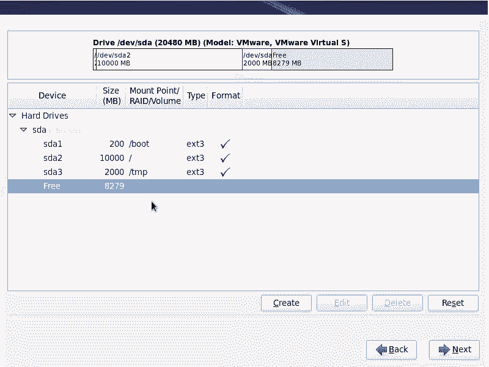

啊，你没有这样的回车进去，嗯，你输入一个el，怎么样创建分区呢？

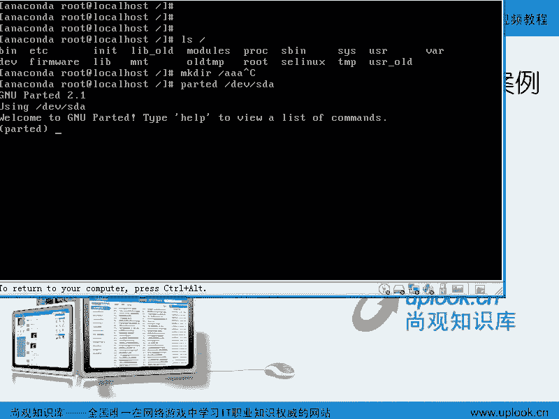

看make part。分区的类型啊，这是这是创建分区，你可以创建分区并格式化。明白吧？嗯从哪开始到哪结束，你可以用partted。但这边的话呢，我们就不给大家介绍那么多了。那是这是工作经验啊。

你的分区大于两T的时候，在R715有些版本里面，那么FD就不支持嗯，我们一般分区的话是有FD。但是呢如果要是F disk不支持的时候，你可以用partted。这你要吧？QIT啊退出。啊。

我这边alt加F6回来啊，那这边我就点击next了啊，费了那么多口舌啊，嗯，他说你没有定义哎。啊，我这个刚才是那个什么。失败了。啊。一记吧是吧。对4万空间是吧？对，这边next。啊。

这边都说你现在的这个呃这个设备的话呢，他要给你怎么样呢？就是格式化等的话呢，就会把原来的分区全部都啊弄掉是吧？嗯到这边格式化啊，对，然后呢把这个磁盘的话呢写到把这个这个改变写到啊磁那里。啊。

还是第bug。我看一下这边啊，嗯我先back吧。我这边的话呢可能操作太多了，然后导致他bug。那么我们来重新的话呢，快速的来一遍应该就没有问题嗯啊。

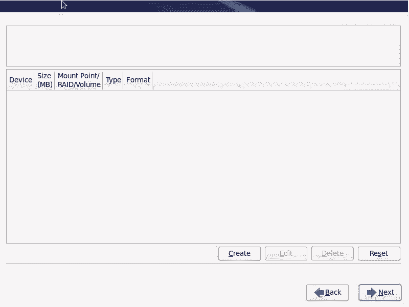

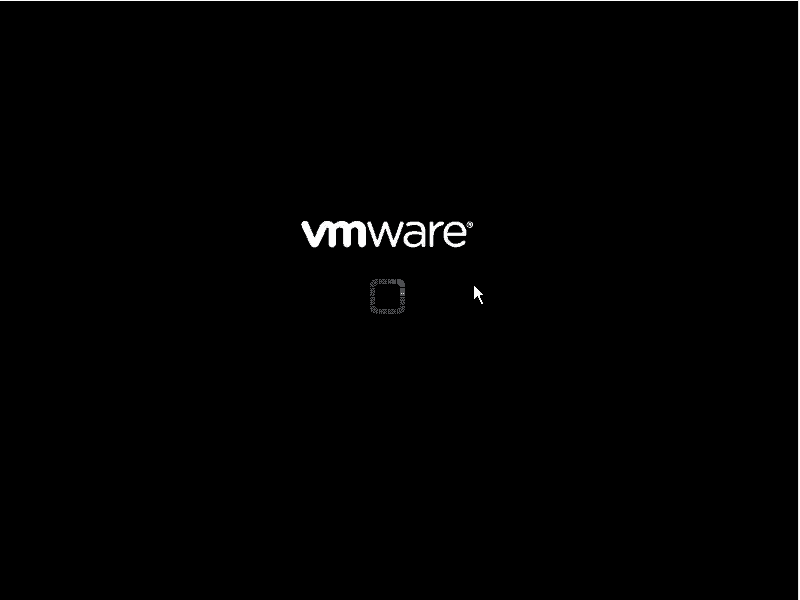

这默认的进来是吧？嗯对。你们讲的时间太长了啊，这个东西就是说可能初学者的话会有很多的疑问。所以我每个环节的话都要给大家讲清楚，这样的话就造成了就是说我们这磁盘操作啊等等的话，是特别麻烦啊。嗯。

然后呢这样正好重新顺一遍啊，对，来一遍嗯。

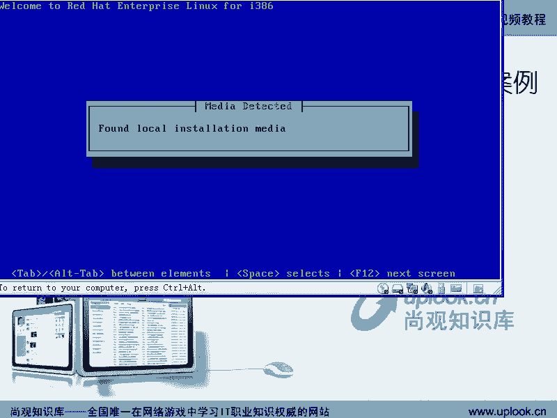

看一下啊。英语是吧，英语。然后呢，我这边就选择基本资源了啊。这边。初始化是吧，嗯，设置主机名，选择一下时区。是吧，上海嗯。Next。密码设置一下。刚才说密码的话呢，是在单词表当中啊，嗯。

我这边的话呢是自己定义啊。这边创建一个。我们说必须得创建一个什么呢？啊，bo是吧？嗯，把它放在磁盘的最前面去，要不可能引导不起来。然后呢再去创建一个什么呢？啊，根是吧嗯跟的话呢。

因为我磁盘完全安装的话是多少多少G呢？6G左右是吧？嗯我给它做10G的空间啊，那么我们再创一个swipe嗯。swipe的话是。内存的1到2倍是吧嗯。Next。这时候说。这样。接说磁盘嗯啊。

那这下的话你没有问题了。嗯，对是吧？好，那这边就是说进行完了以后啊，这个地方的话呢就是一个什么呢？就是装你是否把这个就是引导记录啊，就是put loader使用装载器装在你的MBR里面SDA里面。

那假如说你原来已经有了linux系统。嗯，你现在装第二个linux系统。嗯，或者是你想装一个什么呢？你想装一个呃你想装一个这个就是linux windowsdows的双系统啊。

那么你还不想影响就是原来windows的那个系统等等。那你可以把它什么呢？就是把它装在什么SDAE上。嗯，那一般情况下都是装在SDA上，嗯，明白吧？如果你原来有windows的话呢，你这样去装。

也可以跟windows完全兼容起来啊，那我们现在的话呢。啊，这是这是他查看一下我们的bios里面查看到的这个设备设备。那么我装到MBR里面嗯装到MBR里面，明白吧？对啊，那如果要是我去装到这里面的话呢。

你系统引导不起来的啊啊除非是你找一个东西去引导那个分区上的PBR啊，这个是什么概念？我给大家看一下，为什么能有windows和lindows的双引导？你看啊，这是刚才我们画的图是吧？

MBR是不是在这个位置啊。嗯那么现在的话我们的R就是reite的话呢默认安装是把自己的引导记录装到这里面。对，但是呢原本的数据是什么呢？windows的数据是怎么样？如果是windows XP等等的话。

windows这个地方的话呢，这个MBR是这么设定的。嗯，如果我下面的话有一个分区是激活的分区。嗯啊每个分区前面的话也有个引导记录，这个记录的话，每个分区前面的话都有个引导记录，这个记录的话叫做P。

BR啊就是分区引导记录。嗯，那么windows如果装到这里面，windows是这样的，这个东西自动找一个激活的分区，然后呢到激活的分区去找什么呢？它的PBR里面的but load。

也就是windows的这个windows的引导记录默认是装在PBR里面是装在这个里面的。那么我们的lininux的话呢，会把自己的这个记录放在MBR里面，就放在最前。

那么这个自动寻找激活分区的这个过程还有没有呢？嗯。就是说默认啊我装完windows以后，嗯，MBR是自动找PBR对，找一个激活分区的PBR因为PBR有很多嘛，对他找激活那个分区的PBR嗯，然后呢。

windows的引导记录是不是在PBR里对，是吧？对，那现在我如果要是默认安装的话，是不是我把linux的引导记录装在了MBR里面。对，那么是不是把原来的数据覆盖掉。嗯。

那它还会不会自动跳转不不会了是吧？嗯那么没有这个自动跳转过程，那么于是我们的windows呃linux就形成了在windows之前的一个。插入的这个动作。

就是说他把我们的windows的这个引导的过跳转过程自动的给它截断。嗯，明白了吧？对，截断了以后的话呢，我们的这个呃我们这个过程的话呢，你就可以选择嗯就是说它侦测到你有windows以后。

它可以选择进行原来的跳转，或者是让这个引导记录，怎么样呢？直接去找哪个分区里面的什么呢？ kernelel啊，这就是我们put loader的作用。嗯，也就是bi。bel引导完以后，他就要引导什么呢？

what order。明白吧？嗯，bl引导完以后的话，他要引导bo loader。那这个bo loader的话呢，放在这儿还是放在这儿。嗯啊，那么你也可以选择放在某一个分区上。嗯，但是呢没有人去跳转你。

嗯，大家默认跳转的是什么？这个windows的系统是是？所以的话呢你要有多个系统时候，除非你这个地方已经是一个linux boot否则的话你放到这里面是没有办法引导的啊，除非你用光盘啊。

或者用软盘去引导，让它自动去跳转。嗯啊清楚了吗？清楚了清楚了是吧？以话这里面我就解释了为什么你装完window以后再装lin不会破坏windows的引导记录我说的是windows xP嗯XP呃windowswindows7我就很少试了因为windows或者windows7以后我就很少造做这种操作。

那我后来的话处理服务器比较多而且我本机的话又有什么呢虚拟机。对，那我就很少做这样操作。但是呢以后我们还会有这样的这个项目过我们也给大家去演示这个过程，所以现在的话呢我就给你说了很清楚。

就是说这个分区引导记录还是主引导记录啊，这个地方明白吧？明白那O那我现在还是默认的放在什么呢？SD的。SBA是一个磁盘嘛嗯整个一磁盘嘛，整个磁盘的最前面，那就是MBR明白吧？明白啊。

那么你如果要在生产系统上最好设置一个爬。如果你这个密码不设置，你的如uter密码再怎么设都没有用。嗯，明白吧？那么这个密码的话呢啊我建议你啊最好设一下，在生产系统上要设下。很多人都不注意，不注意的话呢。

任何人接触到你的计算机，它就可以如此设份进去嗯。好， next。啊，如果你有windows在的话，它这边就有两个选项。明白吧？就现在是不是只有一个选项啊，那如果你有windows在的话，就会有两个选项。

就你原来先装过windows再装lininux，它就会有两个选项。明啊，呃，如果要是你原来有windows，那这边的话，我们以后再讲怎么安装什么的话，再再说，好吧，next。啊。

这边的话呢就是一个包的选择。嗯，那如果要是你初学者的话，我建议你选择最多的包嗯，更多的包。你比方说这是呃基本的server是吧？对，高可用的集群组件负载均衡的组件啊，这边的话还有什么存储的组件啊。

然后呢数据库。数据库。啊，还有我们的webserv啊，就是你就是你要做什么嘛？嗯你要做什么数据库，web server，还有虚拟主机啊，还有这个桌面桌面是吧？嗯，那么你默认的话呢，是选择哪个啊。

默认选择哪种方式，根据你的这个就是设置的话，根据你的设置的话呢，它会有默认的一一组包。嗯，因为现在它的光盘里面的话呢，大概有3G左右的这种数据包。对，可能能达到不到3000个包。嗯。

啊但是呢它不同的包的话呢，它组合成不同的这个用途。你要说我刚才的话呢，把这几个选项的都选中了。就是说什么呢？呃。就如高可用负载均衡，还有reite的企业版linux。那这个东西的话呢。

我不知道单独收不收钱。嗯啊，这个的话实际上就是按理说啊，那么它是应该卖三套软件的。一个是什么呢？高可用组件，一个是负载均衡组件，还有一个就是高可用集群，负载均衡集群，还有什么呢？

还有我们的软ite企业版的这个就是呃这个server啊本身的这些东西，还有的话呢，就是我们的这个存储啊，根据存储这些东西，那你还可以在这边的话呢去选择其他的源，比方说直接选择互联网络上的源嗯啊都可以。

那么再去安装。那么这边的话呢，我们根据这个需求的话呢，就是选择不同的这个呃就是你做什么这个种类。当然以后的话你还可以再去装这些包装啊。如果你是basic server的话。

那它就比较简单的数据库serv的话，他可能会把mys等等装上去。那么外bserv的话呢，可能会把aache者mem cash这些东西装上去虚拟化的话就KBM这些东西装上去。

那现在的话呢我们去选择啊比方说我们选择这样的一个就是说呃软件开发者的这样的东西啊，因为它这里面东西蛮多的。我在这边的话呢再选择一个我要自己定制，现在就要自己硬制啊nex这时候他会把细分的包的话呢。

全部列出来。那么如果要是你根据他刚才那个选择选择的话，他是在这里面拆出一些包了。比方说总共有3000个包，那么你选择比方destop那他可能选择1500个，那你选择比方说那个我们说的虚拟机啊。

他可能选择1600个，如果你选择外部serv，他可能连那个destop那些包都不装。所以现在的话呢你可以把这些包啊手动的一个一个的话呢把它选择装出来啊，如果要是你是就是基础。学习的话。

你可以把它全部都一个一个的哈这样装出来。那么如果要是你不太明白这些包到底是干什么的啊，呃就是说你怕以后有问题，那你就把它这样的话去选择出来。嗯，如果要是你现在的话呢，就是一个生产系统。

那么就选择自己需要的那些包，嗯啊，你比方说pro，你到底要不要？嗯，你有没有po程序是吧？对，然后呢，这边你比方说这个就是说这个调优的这些工具啊，呃或者网络的这些工具要不要呃，还有的话呢，就像是呃。嗯。

么这是光线通道的这个以太网光线通道的这些客户端，没有这些设备，实际上是不需要的对对吧？没有这些设备是不需要的。那么安全工具啊，还有就是这个智能卡的这个啊支持啊存储的可用支持I支持，你就没有这个设备的话。

你可以不用去装你如果是你的系统的话根本就不需要打印机啊，你就不要装。但是HCE考试是不是肯定要考是吧？对那这样的话呢，就是选择下那么serv的话呢，就是我们看这边啊那么CFS的这个就应该是三版服务是吧？

就三版服务。那么你在这边需要搭建什么服务。比方说AL就是量机目录访问协议啊，目录服务是不是有那么备份服务器有备份服务器的话，应该是nda啊nda那这里面的话呢，你可以把这些MTXHHEH6的话呢。

了啊 server那这边的话点中了以后。话呢如果这边有选项的话，你再把它那个细节那个选项的话加上去。你比方这个email搜的话，应该有三个组件啊，分别是什么呃，分就是DOECOT的话呢。

是那个top3的SNTP的话就有3个，一个是什么呢？smail是吧？sendmail一个是post fix它应该有个哦现在把那个什么也删掉了。EXIM啊，原715的话，有这个东西，那么这些东西的话呢。

你需要的，你可以把它加上去。嗯，那么但是你选中它的话呢，未必会选。看到吗？嗯，未必会选啊，也就是你选中这个东西。你比方说FTPserv对它装了个基本的包，就VSFTP，但是呢这个包是必须装的。

它就在这里面。但是这边的可选的包的话呢，它没有给你加上去。嗯，明白吧？那么根据情况的话呢，你的基础的这个包啊，这样选择一下。然后呢用到什么样硬件啊，不要用到不没有用到的硬件，你可以不用去点它。嗯啊。

那么serv的话呢，这边就是你要把它搭成什么server，这样的话粗略的选中了以后，可能有些细节的包的话呢并没有选。嗯，你看这边15个可选包。我在这边的话呢，就一个都没有选中。

那你可以把它的话呢呃这边全都选中啊。根据情况来吧嗯根据情况来呃，web服务，你比方说PP啊支持一般的话呢是要的是吧？对，然后呢，web服务器等等啊，PP的这个包的话呢，肯定还有很多是没有选。

那么你全都一定要装嘛，也未必嗯以后如果要是有需求的话，我们再用或者RPM再把它装上去。嗯啊，然后呢数据数据库，你比方说这边有买cicle数据库，还有re支持的post circle啊，这两种数据库都有。

分别是客户端和服务器端，你要点到服务器端的话呢，还有很多的包。嗯啊你比方说那个他这边的这个呃测试的数据库啊，或者说它的这个相关的这种脚本啊，那么post gray circle的客户端啊。

服务器端都会有很多的这个包默认式选择默认不选择啊，那么系统管理。不好意思啊。好，把它拖了一下。那这些东西的话呢，你比方说基本的服务啊，基本基本的系统。那么我建议你把系统管理工具啊都给它装上去。

嗯啊你比方说那个网络的呃网络的这种客户端啊，网络的工具啊，然后执行的工具啊，最好的话呢把里面的细节也点上，因为有很多有用的东西，比方说ARP table就是防范ARP工具等等啊，还有啊，我非常喜欢用。

那么以后的话你会看到比较好用的。那监然视网络情况的MRTG啊等等这些，那么你都可以把它装上去啊，那么建议的话还有那个什么where shock啊，就是就抓包工具嗯。

还有的话呢做这个隧道的啊等等 map扫描工具等等。这个的话呢你现在不装以后的话呢也可能要装啊，那么把它选中装上去以后，那么这个平时的这种工具也把它这选中装上去。我建议的话呢你这个工具的话呢。

给它都装上去嗯。那你装的越多，黑客可以利用的东西就越多。嗯，不是说越多越好。那你的生产系统上，如果是基于PP的外部服务，那你就着重把外部服务的那些东西装上去。嗯，平时的网络监监控的话呢。

你可以后在RPM安装。对，如果你是一个初学者，那你现在在自己的什么呢？到自己的虚拟机里面去装。那我建议你能装多少去装做啥啊。一个问题没有问题。你比方说语言语言的话呢，你现在整个的界面不是中文吗？哎。

不是英文吗？对，但是你想看中文的网页啊，你想看那怎么办呢？那你可以在这边的话装一个中文的包。ZHS chinse啊，你选择一个chese包，简体中文，把你中文全部都会装上去。稳装这样一个包就够了啊。

这是复载精融集群，这是高可用啊，这是存储啊。所以说我们看一下有哪些这个细节的包，那GFS啊这些东西。开发工具，那么如果要是你是做开发的，你看刚才我选择的是开发环境是吧？他默认这里面的选项就全部都装。嗯。

但其实的话呢，你还可以怎么样呢？在这里面装的更多，其实它有很多包是默认不装的嗯啊，那这边的话呢这个硬硬软件啊，那么还有就是图形工具。那么一般情况下的话呢，你这个呃就是就是桌面啊，桌面的话呢。

这些默认装上去好了。那么KDE可以不用装。嗯啊，所以的话呢呃在你自己去在你自己去这个做一个这种实验系统的时候，那么你能多装多少就装多少，装不了的话也没有关系，以后我们会讲定制安装包。嗯，好吧。好。

那我们这边就到这儿嗯啊。你看一下基本的系统，各种服务，web专门的嗯数据库啊，系统的这种管理工具，这种系统管理工具。你比方说像什么呢？SNMP啊，就是说它可以去监视其他的这个网络设备的运行。

告诉别人你自己的这个情况。还有的话呢基于web的这个呃就是企业版的管理工具，也就是你通过外b程序的话，可以管理这个系统。嗯啊，还有的话呢就是其他的一些系统管理工具啊。

比方说特别的啊什么what dog这个就看门狗啊等等这些东西。这就是我们的系统的就是成体系的一些管理工具。嗯啊你比方说那个基于外部的这个企业管理工具，我觉得也也比较有用。虚拟化啊。

虚拟化的客户端和它的这个支持都有了。那么桌面啊还有硬软件。还有的话呢就是开发啊存储高可用集群，复杂均衡集群语言啊都去这样的细节去点中就好了。嗯，那么一开始的话，你想把所有的都选中，那就是个立体化啊啊。

每个东西的话如果不知道，就在网上搜一下。嗯啊，我给大家的话呢去复述一遍，也没有重大意义。嗯，好吧，next。那么当你点击最后一个nex的时候，它就开始了一个就是安装过程。嗯啊，那么在H115啊。

我们讲了半天H16了，H115的这个过程的话呢，只会是什么呢？更简单对啊只会是更简单。那他这边的话呢开始个安装过程。当他把这个依存关系等等的话，全都调好以后，就开始正式的安装安装了啊。

那么R715是直到你点击最后一个next。它前面的格式化等等这些工具他全部都没有给你做嗯啊，只有你点击最后一个nex的时候，他才会帮你去做。那是R7115，明白吧？那么我们再看一下R715的过程。

有了R116的话，R15应该是比较简单的是吧？那么这边我还是创建一个什么呢？创建一个自己的这个过程是吧？嗯就自己定制啊，自己定制，然后呢，点击nex。这样的话呢，我先把这个里面的全部都怎么样呢？

删删除掉啊，这H7R5的。然后我在这边的话呢，点击一个new。啊，比方说波啊100兆是吧？对啊，然后呢再点一个new啊，跟跟。然后实际。是吧嗯，实际。再加上一个什么呢？swipeswipe。啊。一记啊。

OK那你看一下有什么样的不同。如果你想给你的根啊建密的话。没有加密啊啊加密。然后这边点击next。其实是差不多的嗯啊这边也是put load装在哪个地方。对啊，那如果原来有windows的话。

这边就会有另外一个选项。嗯啊，然后再点击啊，这边要设置一下密码，对不对？啊，记得吧？嗯，就是跟那个grab加一个密码。对萝不加密码，别人可以轻而易举的进用单口模式。嗯啊这边的话呢。

就要设置网络的这个IP地址。嗯，那么在这里面的话呢，我们一般手动的话呢去输入是吧？嗯，如果要是你自动获取的话，结果你又没有DHCCP服务器，它要很长时间。其中的是啊。是吧嗯。

那么我们可以如果不用IPV6的话，把它关掉。那么默认网关是什么什么可以设置主机屏也在这个地方设置，对吧？嗯，next啊。没有设置默认网关和那个就是DNS，所以它出现了错误。啊。

这边的话我选择中国的上海是吧？嗯，下一步。嗯，您说我市区应该写好是吧。总之的话呢，现在HRTL4HTL5HL6啊，从HRTL3开始是越来越复杂，越来越复杂。嗯。

一开始HRTL3只有1001000多个包到HRTL4是2000个到HRTL5是2000多个。那现在的话呢可能就是将近3000了，就是包的数量是很多的所以的话呢它管理起来是越来越复杂，嗯，越来越智能化。

说的好听点叫智能化。对说的不好听点就是什么呢？就是让你控制的东西越来越少啊，导致什么呢？就跟windows一样。windows的话，你能控制什么？nex next next就完事了。对。你看这边的话呢。

你可以把这个软件开发者或者外部服服务的话加上去啊，你可以的话直接点击一个什么呢？自定义自定义一点自定义以后的话呢，还是一样的。啊，还是一样，把你需要的这个选项的话呢，加上加上去啊，但然这里面的话呢。

没有什么没有那个就是集群的那些组件。为什么呢？因为你刚才没有输入那个序列号啊，如果你去输入的序列号的话，是一个什么呢？是一个集群购买的集群的这个服务的序列号。嗯，那他这边的话就会有啊啊。

这是他的这个机制。但是我们搞lininux的人的话，从来也不在意，为什么你完全可以PM安装啊，所以要在安装。对那直接点击最后一个nax时候，他就开始安装嗯啊。

所以现在的话呢我们这边就是进行了一个R7R5的这种安装。嗯。对吧对，那么你这边还有没有这个对R715这边的话有有没有问题？嗯，没有了。R716的话，我们看这边的话就开始按再安住。对，好吧，嗯。

那么我们安装这个地方就到这儿。好的，好。

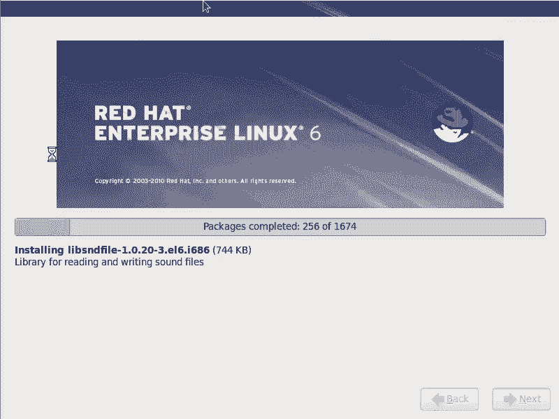