# 尚观Linux视频教程RHCE精品课程：P6：RH033-ULE112-02-4-1-RHEL6安装

在本节课中，我们将要学习Red Hat Enterprise Linux 6（RHEL6）的详细安装过程。我们将从安装前的准备工作开始，逐步深入到安装过程中的各个关键步骤，包括硬件兼容性检查、启动选项、磁盘分区、软件包选择以及一些高级配置技巧。通过本教程，你将能够独立完成RHEL6系统的安装与基本配置。

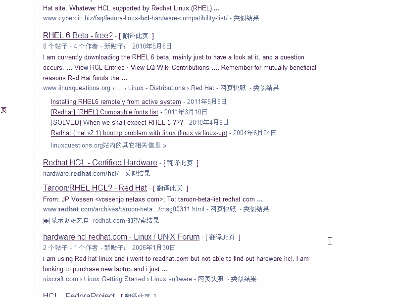

## 安装前的准备工作

上一节我们介绍了课程的整体目标，本节中我们来看看安装前必须完成的准备工作。这些步骤对于确保安装过程顺利和系统稳定运行至关重要。

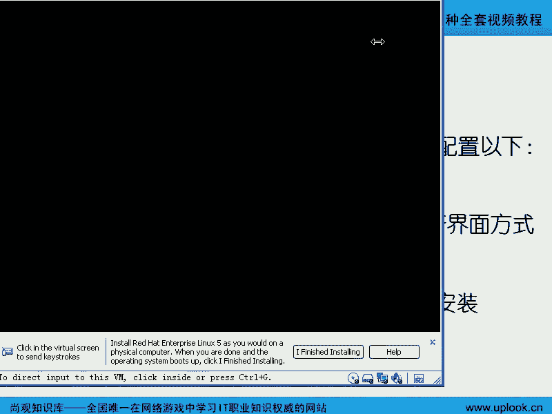

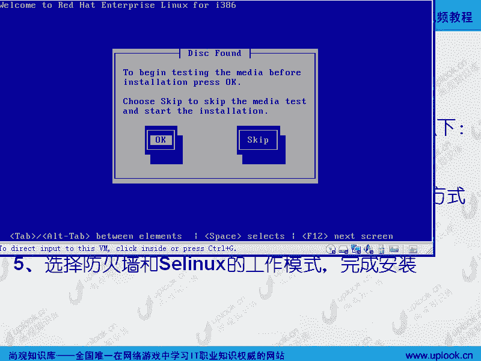

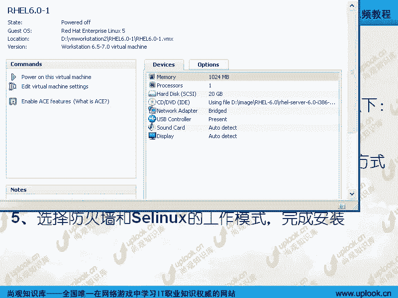

### 检查硬件兼容性列表（HCL）

在开始安装任何企业级操作系统之前，检查硬件兼容性列表（HCL）是必不可少的一步。这可以确保你的服务器硬件（特别是存储设备和网卡）与RHEL6完全兼容，避免因驱动问题导致系统不稳定。

*   访问Red Hat官方网站，搜索“Hardware Compatibility List”或“Red Hat Certified Hardware”。
*   重点检查存储控制器（如RAID卡）和网络适配器的兼容性。
*   如果硬件较新而操作系统版本较旧，可能需要从硬件厂商网站下载并安装专用驱动。

### 设定启动介质

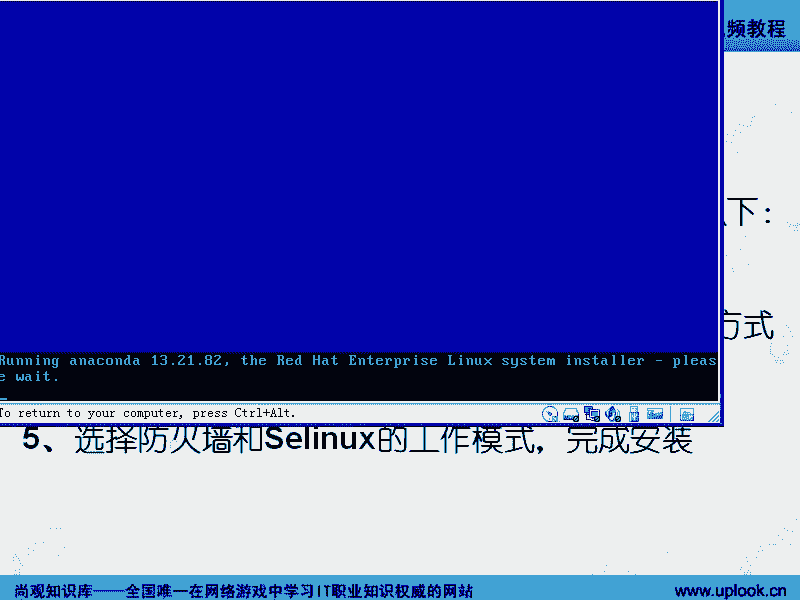

服务器通常配备光驱，因此可以从安装光盘启动。如果没有光驱，也可以使用USB光驱或制作USB启动盘。

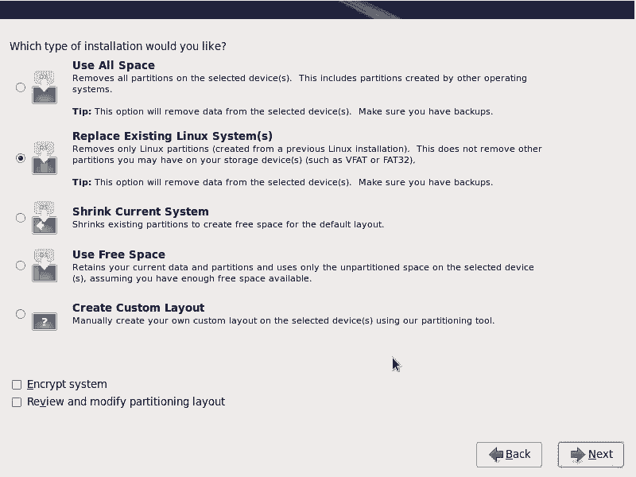

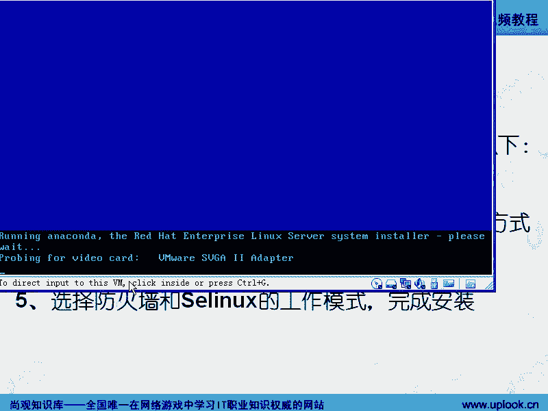

*   进入服务器BIOS，将启动顺序设置为从光盘或USB设备优先启动。
*   如果使用硬件RAID卡，需要在启动安装程序前，使用厂商提供的配置工具或BIOS设置来创建RAID阵列（如RAID 0, 1, 5等）。这样安装程序才能识别到逻辑磁盘。

## 启动与安装界面

准备工作完成后，我们就可以开始启动安装程序了。本节将介绍启动过程中的不同选项及其作用。

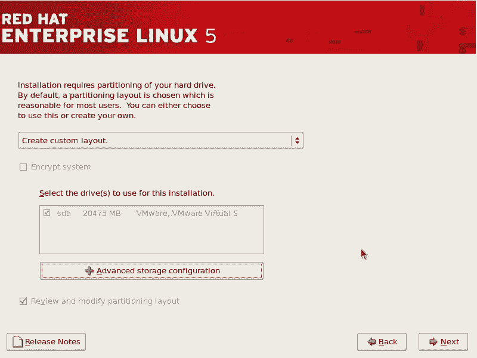

将RHEL6安装介质放入驱动器并启动后，你会看到第一个引导菜单。这个界面提供了几种不同的启动模式。

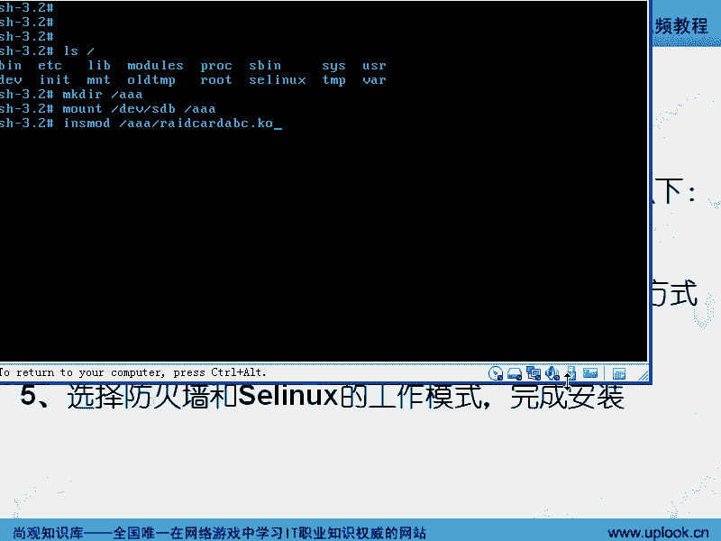

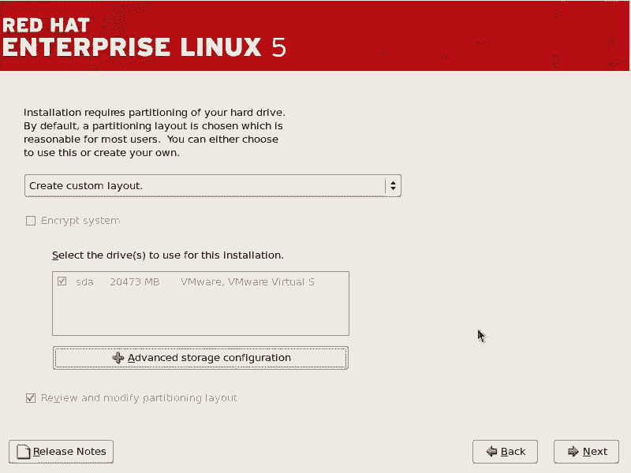

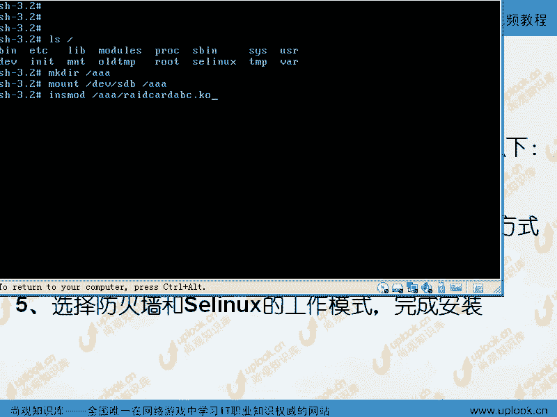

以下是四个主要选项：

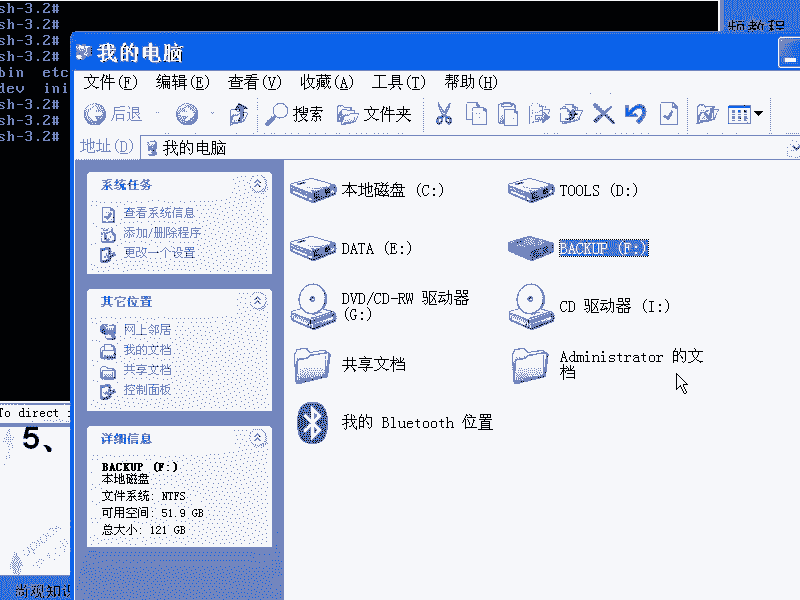

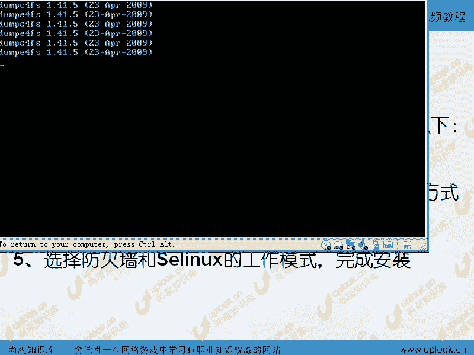

1.  **Install or upgrade an existing system**：安装或升级现有系统（默认选项）。
2.  **Install system with basic video driver**：使用基本视频驱动安装系统。当显卡驱动有问题导致图形界面显示异常时，可选择此项进入文本安装模式。
3.  **Rescue installed system**：进入救援模式，用于修复已安装但无法启动的系统。
4.  **Boot from local drive**：从本地硬盘启动，放弃安装。

在启动菜单按 `Tab` 键可以在选项后添加额外的内核参数。例如，在RHEL5中，输入 `linux text` 可直接进入文本安装界面。在RHEL6中，可以按 `Esc` 键，然后输入 `linux askmethod` 来选择不同的安装源（如HTTP、FTP、NFS等）。

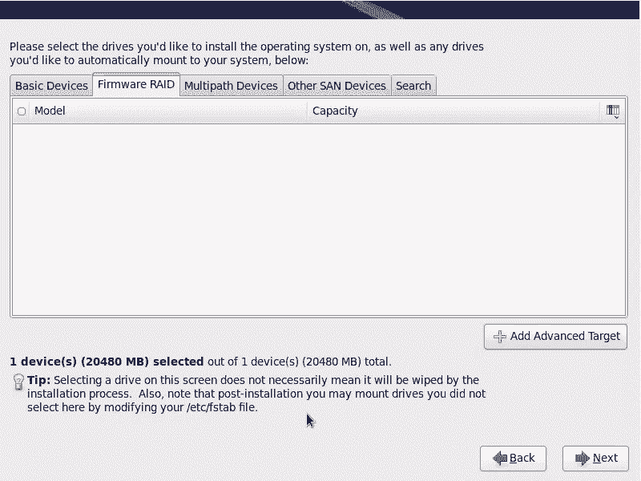

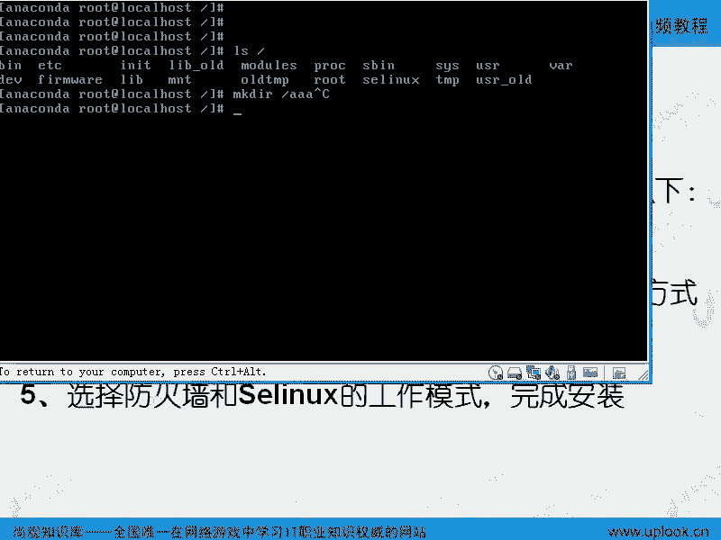

此外，启动时还可以进行**介质检查（Media Check）**，以验证安装镜像的完整性和真实性，这对于生产环境非常重要。

## 安装过程详解

现在，我们正式进入图形化安装界面。本节将一步步讲解每个配置环节。

### 语言、键盘与存储配置

安装程序加载后，首先需要选择安装过程中使用的语言。**强烈建议选择英文（English）**。虽然初期可能有些困难，但熟悉二三百个计算机专业英文单词后，将极大提升你独立排查问题的能力，避免成为“计算机文盲”。

接下来是键盘布局选择，通常选择“U.S. English”。

在RHEL6中，会有一个专门的存储设备配置界面。如果系统使用了基本的磁盘，安装程序通常能自动识别。如果使用了SAN、iSCSI或多路径等高级存储，可以在此界面进行配置。

*   **重要提示**：如果在存储设备列表中看不到你的RAID卡或硬盘，可能是因为缺少驱动。此时可以按 `Ctrl+Alt+F2` 切换到另一个虚拟终端（tty2），进入命令行手动加载驱动模块。
    *   命令示例：`mkdir /mnt/usb; mount -t vfat /dev/sdb1 /mnt/usb` （假设驱动在U盘的FAT分区）
    *   然后使用 `insmod` 命令加载驱动模块：`insmod /mnt/usb/your_driver.ko`
    *   完成后，按 `Alt+F6`（在安装过程中通常是F6或F7）返回图形安装界面。

### 主机名、时区与根密码

*   **主机名**：为你的系统设置一个主机名。即使暂时不确定，也可以使用默认的 `localhost.localdomain`。在生产环境中，建议使用符合规范的名称（如 `db01.example.com`）。
*   **时区**：选择正确的时区（例如“Asia/Shanghai”）。时区设置错误会导致系统时间与网络时间服务器（NTP）同步时产生整数小时的偏差。
*   **根密码**：为root管理员账户设置一个强密码。在RHEL6及以后版本，出于安全考虑，默认禁止root用户直接通过SSH登录，建议之后创建普通用户，再使用 `su` 或 `sudo` 切换权限。

### 磁盘分区方案

这是安装过程中最关键的一步。RHEL6提供了几种自动分区方案，但作为专业人士，我们选择“**Create Custom Layout**”进行手动分区。

一个典型的Linux服务器分区方案至少包含以下三个分区：

1.  **`/boot` 分区**：
    *   **作用**：存放系统内核（`vmlinuz`）和引导加载程序（`GRUB`）文件。
    *   **大小**：100-200MB即可。
    *   **原因**：将引导文件放在磁盘最前端的小分区，有助于BIOS快速定位并加载，提高启动可靠性。

2.  **`/` （根）分区**：
    *   **作用**：存放操作系统核心文件、应用程序和数据（除了挂载到其他分区的目录）。
    *   **大小**：根据安装的软件包数量决定。完全安装RHEL6大约需要6-10GB，建议预留更多空间（如20-50GB）以备后用。

3.  **`swap` 分区**：
    *   **作用**：作为虚拟内存，当物理内存不足时，将内存中不活跃的数据页交换到此分区。
    *   **大小**：传统经验是物理内存的1到2倍。如果物理内存很大（如32GB以上），可以适当减小。

**高级分区建议**：
在实际生产环境中，根据经验，我们可能还会将以下目录单独分区，以防止其日志或临时文件写满导致根分区瘫痪：
*   **`/tmp`**：临时文件目录。
*   **`/var/log`**：系统日志目录。

**分区类型介绍**：
在创建分区时，除了标准分区，你还会看到其他选项：

*   **软件RAID**：通过操作系统将多个分区组合成逻辑磁盘阵列（如RAID 0, 1, 5）。**注意**：在单块物理硬盘上创建多个分区做软RAID对性能提升无益，主要用于数据冗余实验。
*   **LVM（逻辑卷管理）**：这是RHEL默认推荐的方式。它允许你将多个物理磁盘/分区聚合成一个大的“卷组”（VG），然后从卷组中动态创建、扩展或缩小“逻辑卷”（LV，相当于分区）。**优势**是空间管理非常灵活，例如根分区快满时，可以加入新硬盘并在线扩展根逻辑卷的大小，无需停机迁移数据。

**MBR分区表限制**：
传统的MBR分区表最多支持**4个主分区**。如果你想创建更多分区，需要将其中一个主分区创建为**扩展分区**，然后在扩展分区内创建**逻辑分区**。第一个逻辑分区的设备名通常从 `/dev/sda5` 开始。

### 引导加载程序配置

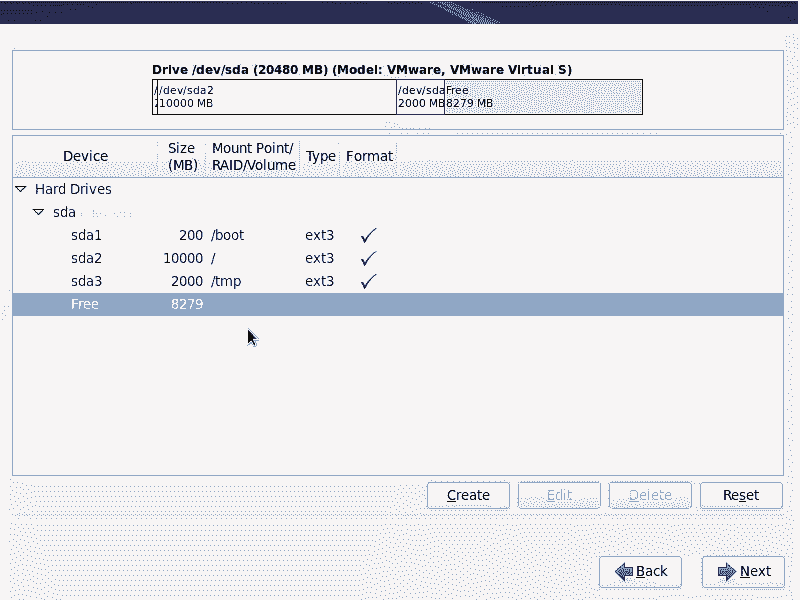

接下来是配置GRUB引导加载程序。默认情况下，安装程序会将GRUB安装到第一块磁盘的主引导记录（MBR），即 `/dev/sda`。

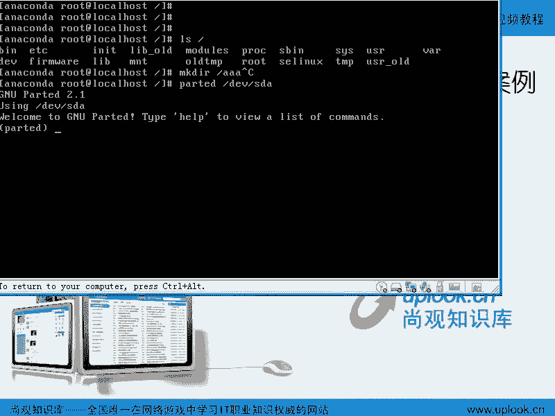

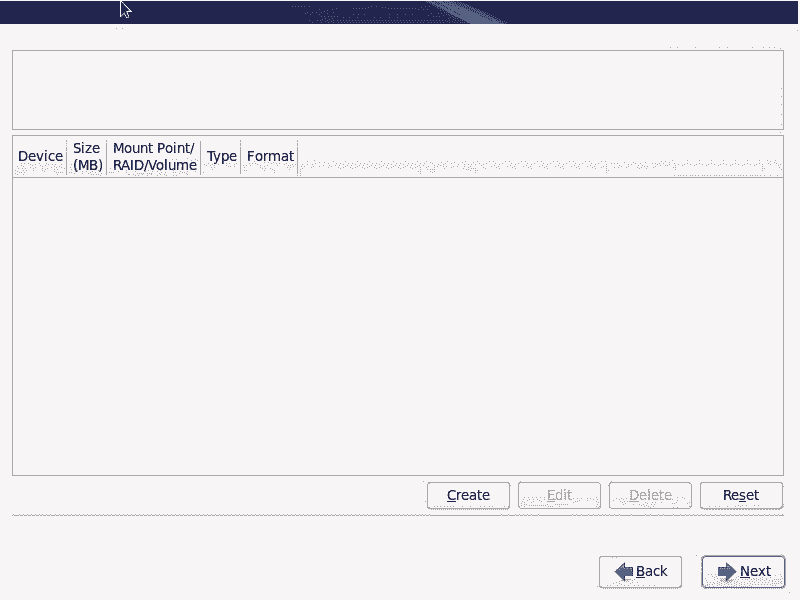

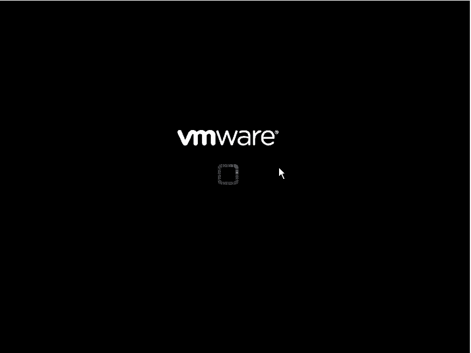

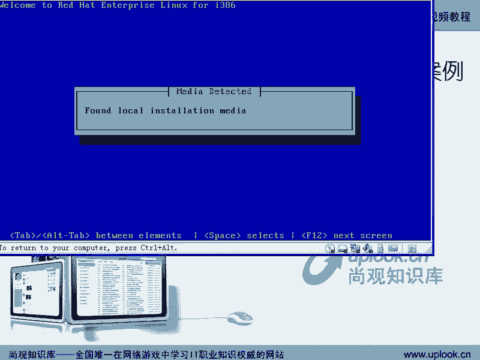

*   **双系统情况**：如果你要安装Windows/Linux双系统，GRUB会识别已存在的Windows系统，并生成启动菜单供你选择。GRUB会用自己的代码覆盖MBR，但会保留跳转到Windows分区引导记录（PBR）的能力。
*   **设置GRUB密码**：强烈建议为GRUB设置一个密码。否则，任何能物理接触服务器的人都可以在启动时进入单用户模式，无需密码即可获得root权限。

### 软件包选择与定制

RHEL6允许你选择不同的安装模式（如“Minimal”、“Basic Server”、“Web Server”、“Database Server”等），每种模式会预装不同的软件包组。

对于初学者，建议选择“**Software Development Workstation**”或自定义安装，并勾选尽可能多的软件包组，以便拥有一个完整的学习环境。在生产环境中，则应遵循“最小化安装”原则，只安装必需的软件包以减少安全风险。

在自定义界面，你可以详细勾选需要的软件包。例如：
*   **Base System**：系统管理工具、调试工具、网络工具（如`tcpdump`, `nmap`）。
*   **Servers**：Web服务器（Apache）、数据库服务器（MySQL/PostgreSQL）、文件服务器（Samba/NFS）。
*   **Languages**：如果需要中文支持，可以安装“Chinese Support”包组。
*   **Virtualization**：虚拟化相关工具。

选择完毕后，点击下一步，安装程序会解析软件包依赖关系，然后开始格式化分区并安装系统。这个过程需要一段时间，请耐心等待。

## 安装后的首次启动

安装完成后，系统会重启。首次启动时，可能会进行一些额外的配置，如设置系统用户、注册订阅等（根据你是否输入了订阅许可证而定）。完成这些步骤后，你将进入RHEL6的登录界面。

## 总结

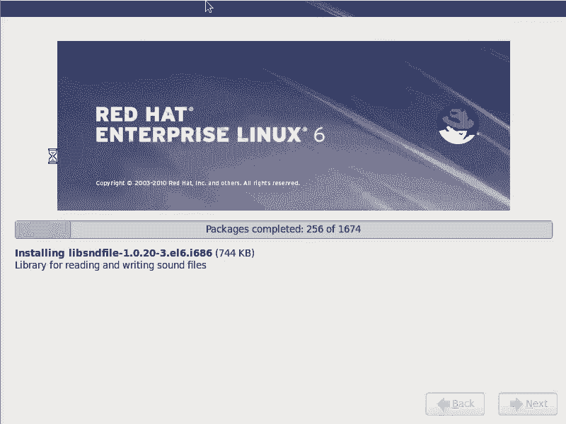

本节课中我们一起学习了RHEL6操作系统的完整安装流程。我们从安装前的硬件兼容性检查讲起，逐步涵盖了启动选项、磁盘分区规划（包括`/boot`, `/`, `swap`的作用，以及LVM和软RAID的概念）、引导程序配置、软件包选择等核心内容。掌握这些知识是成为一名合格的Linux系统管理员的基础。请务必在虚拟机中反复练习，直到能够熟练、独立地完成整个安装过程。