# 尚观Linux视频教程RHCE 精品课程 - P70：RH253-ULE116-2-1-xinetd-security - 爱笑的程序狗 - BV1ax411o7VD

好。呃，在进入我们的新的一章的时候，我们要知道整个的这本书的题结构是怎么样的啊。以前的话呢我们的253部分是怎么样，先讲啊，就是他是他是这样的。以前的253部分。

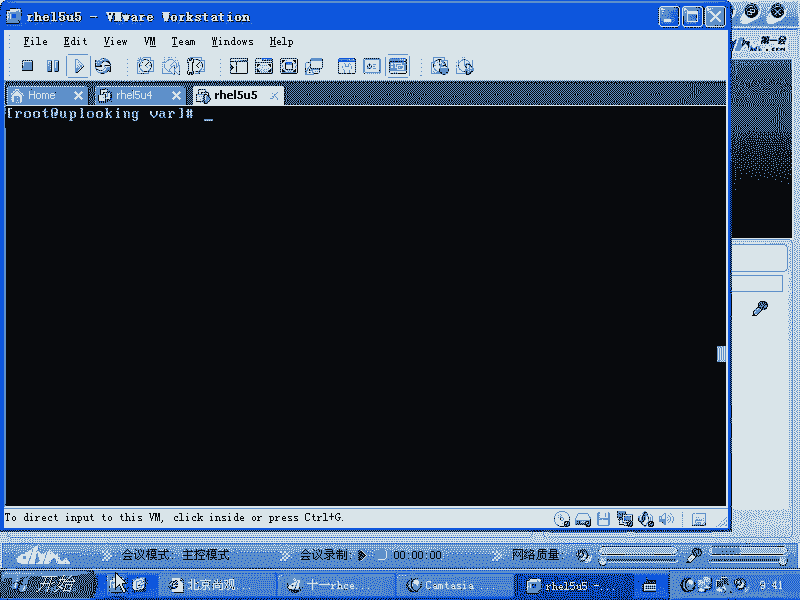

以前的253部分，它是先开始讲呃网络的这个类型啊类型。现在的话呢是先讲网络类型再讲安全，然后再讲服务。那么以前的话先讲什么类型，然后一些控制，然后再讲什么呢？网络的这个服务。然后最后再讲什么网络安全啊。

现在的话呢电脑过来那么在网络的这个就是配置啊或者类型这个地方的话呢，我们说网络服务的类型啊，网络类型，然后网络服务和相关的这些命令，这个前面讲完了以后的话呢，会再讲我们的安全体系，安全体系的话呢。

包含这几个部分，比方说数据的完整性，还有就是访问控制，还有就是我们的系统当中的各个组件啊，然后呢是我们的网络服务。网络服务的话，比方说FTP啊啊3呀啊还有mail啊，还有ache啊等等DNS这些东西啊。

这是我们讲课的一个顺序。首先的话呢我们讲的是什么service或者说。network等等相关的服务，对不对？然后之后的话呢讲的是我们的security是吧？安全安全里面的话呢，可能包含着很多组件。

比方说RPM杠大V的组件是不是？然后呢还有SElinux的组件。还有的话呢有关我们的呃讯拟机等虚拟化等等这样的一些东西。还有的话呢就是我们的service啊，就是我们的各个服务。我们的服务的话呢。

这边是说具体的服务上面是服务的控制脚本啊，服务的管理FTP啊、SMBA呀，然后呢我们的NFS呀，还有我们的。😊，DNS是不是还有我们的HTPP啊等等，这样的一些东西。这就是我们要讲的这个整个题结构。

也就是说分成三部分。第一部分是杂七杂八的一些命令，是吧？让我们的这个系统的话呢，能把这个服务开启关闭等等。第二部分的话呢是安全安全的话呢，可能涉及到一些加密啊，一些验证，还有一些访问控制。然后呢。

第三项的话呢是整个服务的一个配置，就是各种各样服务啊，哪些服务启动哪些服务是比方说支持某些安全组件的，我们要把它安装起来或者配置起来以后，然后我们再把安全组件的话添加上去啊，它的安全配置的话呢。

有点特殊等等。这样的一些信息的话是放在第三部分。这三部分的话呢，大家搞清楚以后，我们现在来看第一部分就是有关服务的这种配置。服务的配置的话呢，或者网络的配置我们都已经给大家讲过了，对不对？

我们先看sss它我们要知道现在所使用的体系结构叫做什么sstem five是吧？就是系统5系统5系统6等等之后的版本基本上固定的一个框架，这个框架是什么呢？

就是由S并下的什么IIT然后呢帮你打开所有的服务，是不是这些服务的脚本，我们都跟大家说过了，对吧？然后呢，首先是ETC下的IITTAB是不是？这是我们RT的手呃这个总的配置文件。

是不是根据这个配置文件的话，有一个系统的。😊，其RC点D可以不用加，因为它有软链机啊。啊，这是系统的触发脚本。那么真正的服务的话呢，全部都是在什么RC点D当中的RC命令加上一个什么呢？比方说一个数字。

就是你的运行级别，他们实际上是运行RC点D当中的RC3点D里面的，所有以S开所有以K开头的什么什么脚本都去加上一个什么top，是不是这些脚本实际上的位置是在IIT。对吧这个。啊，如果要是启动的话。

那那不那他们的话毫无疑问都是什么？对吧他们这样的，那么同样脚本也是那个。IIT点D目录下的什么呢承上，后面加上一个什么star，对不对？就是这样。那么我们现在看到的这个脚本啊。

这种脚本那么它实际上是软链接是吧？软链接到这个IIT点D目录下，是不是这个目录下这种脚本就叫做sstem five的启动脚本啊，sstem five的启动脚本，你可以自己去写这个脚本。😊。

只要这个脚本里面有star stop是吧？restar status是吧？还有什么reload之类的，一般的话呢必须的是什么呢？必须的是4个，一个是star，一个stop。另外一个restar是吧？

还有一个是状态，STATUS是吧？这样四个都要有。但是这个脚本的话呢，如果你在配置集群服务的时候，它可能不能直接用，还要去配置其他的就是要有一些什么返回值之类的要求啊。我们看到这些东西的话呢。

就是我们最基本的就是服务的部分。其中的话呢，我们给大家介绍过，在这里面的话呢有一种特殊的服务。这个服务的话呢是叫做XD，对不对？XD的话呢，它是一个。它叫做X。就是前面那个X的话，是后来加的。

就是X就是加强安全了以后的什么呢in。也就是它的这种脚本的话呢，全部都是在哪呢？它的这种脚本全部都在ETC下的IIT点D呃啊不是IIT点XD点D目录下，是不是新啊，这些脚本的话呢。

基于它的这种服务都是在这个地方，你要想启动这里面的这个服务的话是怎么样的？是你要check confi是不是？check onfi X onlineD啊R把它启动起来以后，再可以启动什么呢？

基于它的这种XID的服务也能启动，就check onfi某某某服务。比方说ber5是不是？科s5杠t night。2。对吧这样的话呢，这个服务才真正能启动。那它的基理是什么呢？

就是我们如果要是想启动某一个X的服务，那么我们跟上面就不一样了。如果要是我们想启动某一个，比方说sstem file的服务，那我把它按了以后，实上它是把什么把那边的K改成了S是吧？

就把相应的目录下的头一个字符给它改成由K改成S了是吧？这个我们可能还比较好理解，但是我们在XD里面的话呢，它的规则是另外一套规则，你check它按的时候，它实际上并不会帮你把什么S改成K。

你会发觉那个地方的脚本完全不一样啊，这就是我们要给大家新新介绍的部分，也就是这个服务的脚本，它到底怎么回事。我们到ETC下的什么呢？X点D目录下去，对不对？

在这里面啊其实的话呢在这里面还有一个文件ETC下的XX点这个文件。😊，这个文件的话呢是XLID的总的配置文件，由这个文件的话呢去include了什么呢？这个目录下的其他的所有文件那由它include下。

你看。这个文件是有个最后有一个什么呢？include DIR对不对？这个文件的话呢，实际上最终帮你打开呃，帮你。把其他的配置文件include进来，include进来，也就是由它去include。

下面的这些。配置文件这些文件的话可以说都是上面那个文件的什么一部分，对不对？都是他们的一部分。那这个文件的话，我们找出一个来，你就可以触类旁通了。也就是说你可以看XI耐D。它到底为什么加个X。

是不是X的话，我们一般都知道什么就比较酷是吧？它这个地方呢X的话是说安全加强啊，我们找出一个脚本来VRETC下的X。X安曼D点D。比方说我们是curus。5是吧，然后杠t万打开这个脚本。

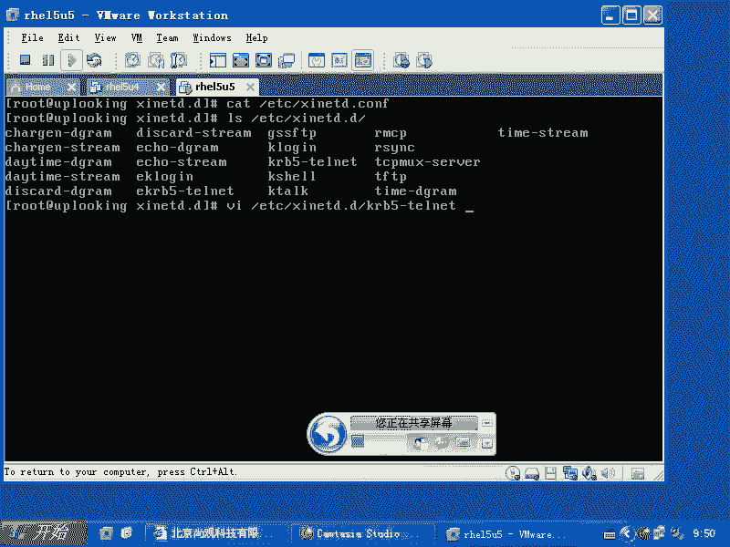

这个脚本的话呢，它就是这么简单，一个service是不是啊？是它的名字，这个名字的话叫做tell night。Soice tell that。

这个时候它会到我们的service文件里面去services文件里面去找它的对应的端口号。也就是说你从上到下有没有看到它有端口。

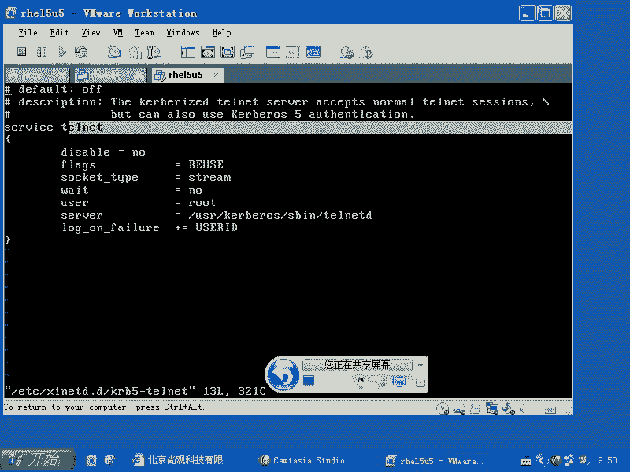

没有是吧，那么我们的tenet要打开告诉我他的这个守护进程，就是X拉D说哎，哥们儿。帮我打开一下是。😡，然后呢，那个阿克莎拉D说哎，你贵姓啊。你的ID号多少I就是你打开什么呀？

打开端口是不是你端口号多少，于是的话它就会到services这个文件里面去查，明白吧？所以这个地方的话呢，根据这个serv service的这个telnet这个呃名字的话。

它会去到service文件里面去查。然后呢，当我们想把它打开的时候，那你看到这边是不是有个display呃呃diable等于什么no是吧？diable等于nodiable等于no就是说没有被禁用。

那它就是什么开启是不是？所以我们现在看啊。😊。

涉及到了几个文件，一个是这个文件，一个是这个目录下的这些文件，是不是？然后呢你打开其中一个文件的话，你会发觉它会去要求什么呢？查看ETC下的servs这个文件，是不是？

然后我们这样的GREPtenet对不对？然后看一眼，那么tenet用的是23端口，是不是它就会把23端口怎么样打开，就是XRD会把23端口打开。当我们去checkfi。😊，当我们去check onfi。

carbers5。Gotellight。2。啊，我们去把科45t back up的时候，那个地方就是dicable等于什么no是不是？那我们要把它off的时候会怎么样？off的时候。

然后我们再去打开看啊，再去打开看。

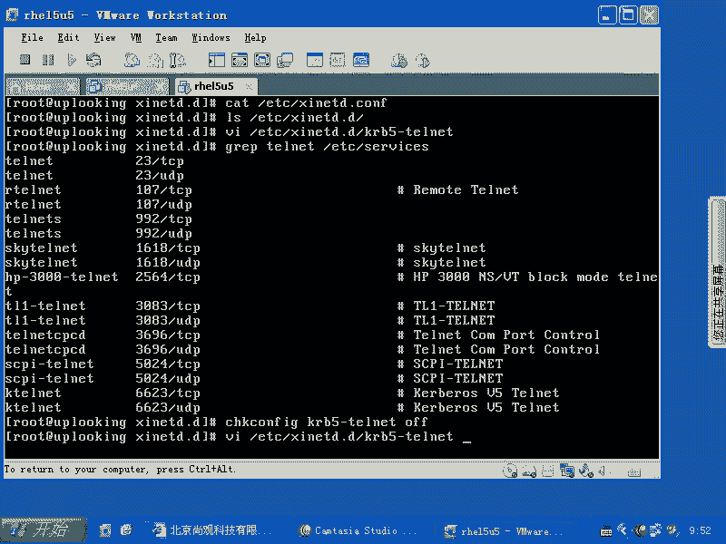

那这个地方diable等于什么？yes啊，所以这就是XI奈地夫，它的最终的首这个进程所在的位置是在这个地方看到了吧？这个这些里面的这个选项都是什么呢？非常固定的啊，非常固定。

你如果想看这个里面的选项应该有些什么东西。那应该找哪个配置文件。你看找谁的，找找哪个配置文件的蛮配置。你看啊我们刚才看的是他是吧，里面有很多选项，是不是这选项还可以有哪些选项，我们应该怎么涨慢谁呀？😊。

科巴45刚才那。嗯，3月。sice。对，X。I耐是吧，点com，你们记不记得我说这个文件实际上是那个文件include进来的，是不是？实际上本上讲是那个文件的什么一部分，对不对？所以我们看它的M配置啊。

我们看在上面的这个文件里面到底还能配些什么选项。你不是说安全加强嘛，对不对？你加强在哪？😊，有哪些地方的话可以加强安全？于是的话我这样的man啊，打开它，这个时候你看到service是吧。

什么什么一个名字是不是？然后它再加上各种各样的选项和值，这是一个基本的间价结构啊，这是一个基本间架结构。那么可以放什么东西呢？那么你可以放ID啊，可以放它的类型。😊，typeap类型的话呢。

实际上选择的就是TCP协议还是UDP协议。因为你只给我反映出1个23端口，是不是？那么我知道你是UDP23端端口，23端口还是TCP的23端口，是不是这个地方的话呢。

它会有一个type说我要我我看我要打开的是什么呢？比方说TC。我看。啊，你比方还RPC通讯啊。这个应该不是TCP呃。

mix啊应该是inin internal啊innal应该是internal默认应该internal类型。这个类型的话应该是呃就是TCP类型，TCP型议类型啊。我们再看一下。

flags flags的话呢就是其他一些标记。那么这里面我们用的最多的是什么呢？啊，对，刚才那个类型的话呢，不是这个应该是sockcket的类型啊。socket的类类型的话呢。

这边是什么streamam啊，什么d G之类的r之类的啊，那这个proical的话呢是说这个proical跟那个TCP和UDP是没有关系啊。这些选项啊就是我们一般配置的会比较少。

因为现在我们已经过了那个时间，过了什么时间呢？就是以前我们去打开X3D，你说我们用的system file这套体系用的挺好，是不是为什么单独要用个X3代D服务呢？现在的话呢很少用。

以前的话呢用的机会比较多。什么原因呢？就是因为大家想把内存节省出来。啊，我们的tenet它是你比方说一天可能tenet一次，对不对？但是呢它是不是要一直守护在什么你的内存当中，对不对？那这样的话呢。

它会占样内存，但是以前在内存非常少的时候，我们就希望有一个代理人，他一个人的话呢可以监听所有的端口。这个端口的话呢，有人访问的时候，我在从硬盘上把它唤醒起来，是不是？也就是说telnet这个进程。

它平时是不运行的，它只放在什么硬盘上有个程序，对不对？X ID帮它监听着23端口，是不是？然后这个时候的话呢，我们访问它23端口的时候，有人帮他打开这个什么tellnet。然后这个时候的话。

tenet才运行起来，所以的话它是一个相当于代理程序。那这样的话呢，你就要告诉他到底监听什么协议的什么端口，对不对？监听这个什么协议的什么端口以后，到硬盘的哪个位置上去找真正的那个可执行文件，是不是？

这是XD要做的事情，明白吗？好，那么像我们的这个proical啊，proical的话呢，这个协议的话呢是访问ETC下pros这个文件了啊，跟那个services那个端口又没有关系了啊。

wa wait的话呢就是它的这个方式啊，就是运行的方式怎么样？user group就是以什么样的用户名和密呃，有什么样的用户和组的方式的话去运行这个程序了。然后呢。

我们看呃我们实际上的话呢是就是我是想给大家的话展示的是什么呢？展示的是这个地方，你看到是不是有个only from。看到吧？only from也就是说你现在的话呢，only from是说我进行访问控制。

谁可以访问我的tenet呢？谁可以访问的tllnet呢？only from哪来哪。啊，就是只从哪个地方，就相当于我只允许那个网段访问我，明白吧？这就是XNID里面加的安全的选项。

所有基于XNID的服务都可以加这些安全选项。明白了吧？这个地方的话呢，那么我们要记住啊，我们要记住，那么有可能会呃就是考试，有可能会考试。那么这个地方你要记住的是什么呢？所有基于XNID的服务。

也就是在ETC下的XID啊，也就是在ETC。也就是在ETC下的XXID。点D目录下的这些脚本，这些脚本的话呢，完全可以都加这个选项，都加一个only from什么什么。

对不对only下华院from是不是？😊，only下划向from从哪来？然后呢，你可以去写一个就是说这样的一个网段啊，你可以把网段放放在上面。如果你这样写的话呢，就表示整个这个网段的话呢。

就都不能什么都不能呃，就是都都能访问你啊，都能访问你only from啊，然后呢还可以加一些其他的写法，这下面的这些的话呢都是什么呢？都是我们的这个写法，你也可以写主机名等等啊，你也可以写主机名等等。

也可以这种方式的话呢去写啊。如果要是有人去问，有人的话呢，去问你说X3啊，就是telnet的服务该怎么进行访问控制，对不对？那你就可以用这种方式去访问控制啊。好，在这样的一个网段里面。

你想拒绝某一个人来访问，那么就加点什么，加上一个什么no access，是不是no下划线access看到了吗？然后呢只有在指定时间可以访问，那么就是什么access time看到了吗？

access time。啊ac time。它的格式是什么呢？小时加分钟，然后呢再是什么小时。加分钟在指定时间可以访问，过了这个时间就怎么样？不能访问，这是总共三个参数了是吧？

only fromno access access times是不是access times这样三个参数，大家都查这个men配置的话呢，能可以查得到啊，查得到only from。然后呢。

no accessces access times是吧？然后我们再看后面啊，还有一个是什么呢？😊，还有一个是。Process。s这个。参数啊也是可能我们会用的参数。就假如说有一个人的话呢，产生了。

10个县城，然后呢一块儿telllnet你，那你这边要开取10个tellnet进去，对不对？这个时候的话呢，我们可能未必会允许这样的行为。我们可以加上一个什么呢？pro每一个IP地址访问你的时候。

只允许开启多少个啊，这个是默认情况下是呃不限制，就是无限的能开多少个就开多少个。所以它呢pro的话，你可以加上一个什么呢？加上一个呃加上一个这个就是说每每1个IP的话呢，有多少个限制。

这样的话呢可以控制什么呢？别人不要什么打开太多进程或者不能进行什么呢？大面积的暴力破解，我开100个进程是吧？一次可以试100个密码，对不对？而 nice的话没有这种机制，没有这种防控。

就是这种防这种暴力破解机制是吧？那么你要注意这一点，那还有一个的话呢，就是说可能就是这边的话呢用的比较少，跟安全的话呢，不是特别相关啊，但是呢我们要知道就是说这个地方的话呢。

可能是你呃以后细节配置的时候需要用到的，这边一个是什么呢？banner呃s。是吧一个banner啊，这两个是什么呢？为了迷惑别人你tenet23端口以后的话。

人家告诉你说welcome to什么我们的tenet，对不对？然后这个时候人家哦你这边是23端口打开是tenet端口打开，那么我把23端口的话，给它改成什么呢？给它改成55端口是吧？或者说623端口。

这个时候的话呢，人家tenet上来以后，你要把它的什么banner也改掉，说欢迎什么到我的mycle来，是不是那这个时候人家说哦你就是myscle服。

那么你怎么样改成的什么这个登录完成功登录完以后的什么欢迎界面，或者说哦就是说如果是失败了以后的这个界面呢，那这样的话呢，你就可以改这个banner啊。

所以就是这样我们一般的话呢有4个参数可能用的会比较多啊。😊，这四个参数是什么呢？就是说VI比方说curs5的tnet，那么你可以在这里面加上什么呢？加上一个啊。

这个呃这个stream的话呢是表示te呃应该是TCP啊，应该TCP我们在这边加一下，比方说叫做only啊 from。等于什么呢？等于192168。0。0是吧，杠2224对不对？这样呢只允许这个网站。

其中的话呢我no啊。no access不允许谁呢？不允许其中的1。21了8。0点呃，比方说。十这台机器对吧？然后呢，是一个什么？Access times。是不是访问控呃，访这个访问的时间只有什么呢？

比方说早晨的8点。对吧到晚上的18点。对不对？这样的。然后还有什么呢？还有就是pros。等于啊比方说22个1个IP2个连接，对吧？再多的话就不允许了。这样上去以后改完了以后。改完了以后。

这个文件改完以后，那实际上这四项的话呢，就是有关它的安全控制了，对不对？有关它的安全控制，那么你就可以怎么样呢？

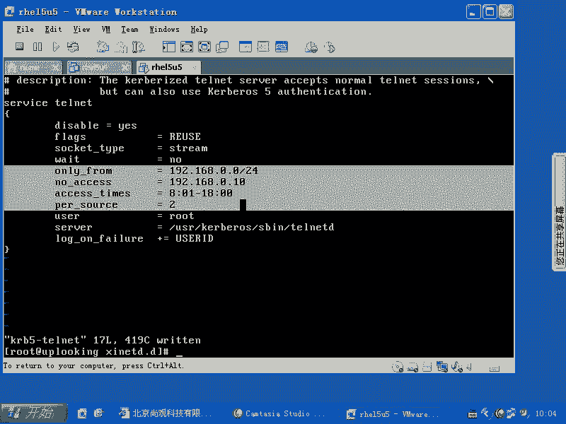

把它打开，打开以后的话，你可以跳那上去。我们看一下有没有打开啊，这个服务有没有打开。我们看23端口是不是由XID在打开啊？是不是啊啊。631端口是谁在打开？cs啊cs就是你的打印。打印服务的哪看啊。

你看这边是不是很慢是吧？一般的话呢，在这种服务啊很慢的原因是什么呢？它需要DNS反向解析。因为你反问我的话，我只看到你的IP是吧？我怎么知道你是谁呢？你假如说你在呃only from里面添加的是什么呢？

说只允许。呃，星点什么星典呃。阿点com去访问，是不是他是不是要把你的IP地址解析成主机名以后，看是不是在这个域内，是不是，所以它就时间就比较长啊时间比较长。等一会儿的话。

我们看啊等一会儿我们看这个caps的61呃631端口的话，你可以直接通过那个IP地址去访问。也就是说你在你自己打开一个什么呢？图形界面是吧，访问其中的你的127。0。1的631端口。

你可以通过外b界面去配置你的caps打印机啊，这个是这样。但是你在服务器端一般我们都会直接怎么样把它关掉，是不是把它关掉。哎，还没出来啊，那我在这边的话呢给大家总结一下。

当我们想去打开XIID的服务的时候，我们可以这样的check on fake，是不是？😊，首先的话你要把X3在D。啊，是不是？然后呢再去把刚刚才的某一个服务啊，是不是？比如说科s。

5科verse45是不是杠t night。啊，是吧。那么以前的话呢，在你che on了以后啊，你有可能会需要输入一个什么serviceXX andD什么restar把它启动起来，是不是？

但是现在的话呢不需要了。因为check经过改良了啊，它会自动的话呢，立刻帮你打开，当你check5net按了以后，它会立刻把这个什么net这个端口就打开了啊，不需要你再去配置了。

所以的话呢这一步的话呢就不需要了啊，这一步的话就不需要了，整个这个XD的机理是什么呢？就是说你要知道系统。他去调用一个进程的时候，一般这个进程它会有一个什么配置文件是吧？他去调用一个后台守护进程时候。

一般后是他后台守护进程。大家看到是这个D是不是D的话是表示一个叫做什么呢？呃，DAEMON是吧？demon是吧？啊，守护进程那么它的守护进程在哪呢？在这个地方啊。

你可以看一下在ETC下的XRD点com这个文件是吧？看我们这个文件。那么这个文件里面的话呢，include了什么ETC下的XI那D点D目录下的所有的文件是不是include进去？

那么这些文件的话呢有统一的这种配置，统一的配置，我们一般需要了解的是什么呢？就是说它这里面的选项啊，在这里面每一个文件的话都可以添加这个选项。首先的话呢，我们知道diable是不是。等于什么等于。no。

那它就是打开的状态，等于yes，它就是什么关闭的状态，是不是还还会有什么呢？还会有only。you是吧。only from啊，然后呢等于一个网段是吧？还有一个是什么呢？no。access等于啊。

然后我看下那边啊。呀还没出来。no accessces等于什么什么。然后呢，还有一个就是access。Times啊。等于什么什么啊，还会有一个什么呢？呃。persource是吧。

等于什么什么什么这几个选项的话呢，在XND的服务里面，它都可以去设置，这就是进行XND的服务的访问控制。那么当然了，如果要是你不想通过这样的方式去访问，那你可以通过什么呢？IP tablesIP。

tables，然后呢加上一个什么呢？到A是吧，在input的时候，然后什么什么什么什么东西，这样子设置一下也可以是吧？也可以达到允许谁拒绝谁的这种目的，对不对？

这个就是IP tables啊IP tables。😊，好，有没有问题？X2和D的相关的东西有没有问题？没有。那么在我们的这个配置文件里面，他会说自己的服务叫什么什么名字，比方这叫tax。

这个叫telenet的话，它从哪去找它的这个端口号呢？它会到ETC下的什么s这个文件里面去找它的端口号啊，去找它端口号，这是我们的这个有关它的端口定义的配置文件啊，在这个地方。明白吧。

然后系统当中的话呢，还有几个配置文件。比方说ETC下的procol是吧？protocols还有什么呢？呃ETC下面的。哎呀。后s。hose肯定是有啊，然后我们是有一个什么文件呢？Nightworks。

没有。Lettwork。忘了，就系统当中有关网络配置的话呢，是有三个文件啊，记得我记得有三个文件，就是定义这些网络接口啊，网络协议啊等等啊，那么有三个文件，这两个的话呢是就是第一个的话是用的非常多的啊。

第二的话是说一些协议，定一些协议。开帽。是不是加了only from的原因了？VIETC呃VI。科ber4科45的这个它那个，然后我把这几项它全部都注释掉啊。改完配置文件以后。

要把XIDrestar一下，是不是restar一下以后，然后再跳net，看一下能不能登录上去。如果还不行的话呢，就有可能是这个服务的问题。这个服务叫做科ber45杠telnet。

是不是我记得以前的话呢会有一个叫做telnet server的这样的一个程序。你装了这个以后的话，telnet服务才能运行起来。但是科ber45杠tnet它是不是要跟科ber随意联用啊。

我已经好久没有用telnet。这边的话只是说再再拿它举个例子，对不对？但是呢我们的那个telnet server的话，有专门的一个telnet服务，叫telnet server啊，它是telnet的。

这个就是最基本的telnet版本。如果要是那个版本运行起来以后，他可能没有这么多麻烦事儿。那还是不行啊还是不行。你们的机器上有没有一个telnetserver的服务？有没有太大滋味的服务。

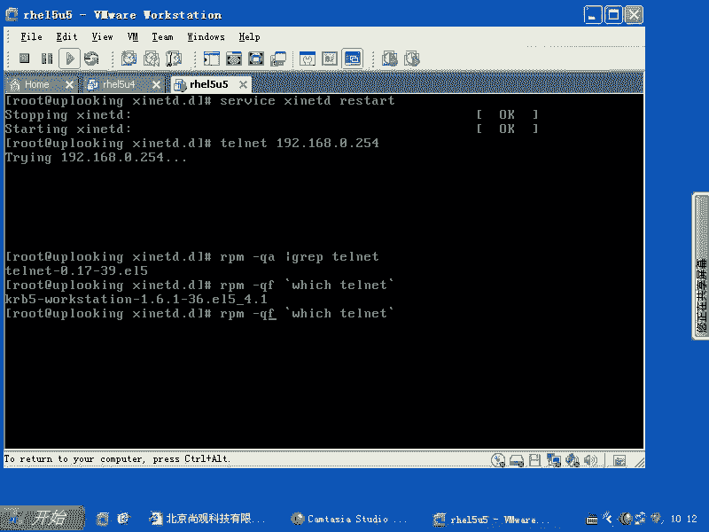

这个是自带的。

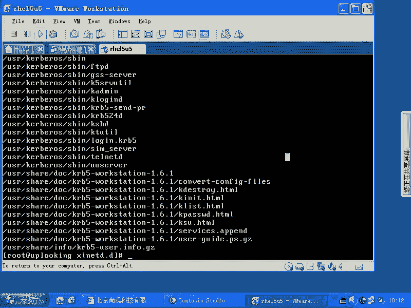

有一个tenet杠ser的。高吗？有一个是吧光盘上是吧？那么就是说这个这个的话呢，可能不一定是我们就是就是正就是我们的最基础的tenet版本，它可能是为了实现它的那个cur和tenet这种验证机制是吧？

所以的话我们net上去可能不成。但是实际上的话呢net就是这么配的，就这么配。也就是说我们现在讲的是服务部分是吧，并不是在讲net本身，因为你配起来tenet以后，那么也没有什么太大用。

是不是所以的话我的经验是什么呢？如果要是呃就是以前我想要telnet服务的话，我就要装个tenet杠 server，而不是装这个cur这个服务，明白吧？所以的话呢我会装那个tenet server以后。

那么你che把它起来，那么它就直接什么运起来，而不是check什么B5杠net明白了吧？所以这个的话呢大家自己回去试一下就好了。我们主要是讲这个服务啊，有没有问题。有没有问题？

你们的光盘的server目录下会有个teelenet。钢丝纹它装上去以后，刚才那些操作的话呢，就可以自己来进行一下。没问题是吧？哎，你说。这个配置文件。啊。

就是在这里面可以进行访问控制跟TCPrappper它的这个优先级谁更高一些是吧？呃，因为我们在lininux里面，它的这个访问控制的话呢，实际上是有好几种方式，是不是好几种方式，它是一个体系结构啊。

这个体系结构里面的话，你看一下这个就是说我们的呃。首先系统有人的话呢，访问我们的数据包是吧？访问我们数据包最开始起作用是itables，对不对？i tables的话呢，把这个数据包允许通过了以后。

会访问到我们用户空间。我们的用户空间的话呢叫做什么？比方说X。😊，耐D这样的一个后台守护进程是吧？它所调用的库里面的话呢，有什么LIB wrappper，就是我们所谓的什么TCP wrappper。

因为我们同学在问这个TCP wrappper优先呢还是它的这个X耐B点com这个配置就是no accessonly from之类这些东西优先，因为他们三个起到的作用都是相同的，对不对？那么我没有实验过。

但是我判断的话呢，是TCPpper优先。啊，什么原因呢？因为我们的任何一个支持TCPrappper的服务。首先我不知道它支持不支持啊，我不知道它支持不支持，我们看一下。我们现在这样的呃。

LDD是表示显示某一个进程的什么显示某一个进程的呃调用的所有的库。那么这样的which。实际上的话会有个SID的这样一个进程，是不是？我们看看这个进程的话呢，调用什么样的库。那么一回车它调用这么多库。

是不是其中调用的库的话是什么？有一个叫做LIBrappper是不是这个库的话呢是系统的话呢，在启动的呃，就是我们这个进程启动的时候它调用的库。这个库的话呢，可以进行什么访问控制。这个访问控制的话呢。

是有几个配置文件来的，是吧？一个是什么呢？也就是说LIBrapper。😊。

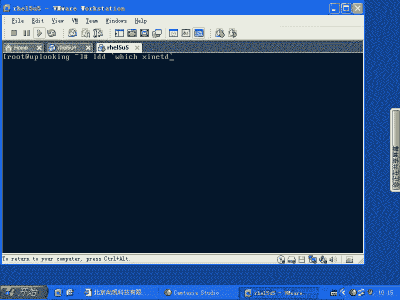

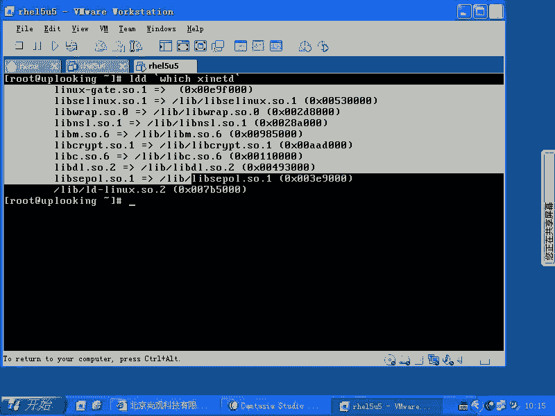

他的话呢去通过ETC下的X呃，就是hosts。是不是haATTC下的hosts alone，是不是他去访问控制。那么TCP wrappper这个的话呢非常简单，任何人去调用这个库的时候。

那么有人访问的时候，他都要看一下这个文件，是不是看看这个文件。如果要TCPrapper是允许的。然后他再继续自己处理，是不是这个时候他继续自己处理的时候，是不是要看自己的配置文件啊。😊，对不对？

所以这个地方的话呢是什么？我觉得应该是。啊，TCBrappper是优先的。他优先，也就是说他先允许这个数据包进来，然后再看什么access。

就是我们的这个no only from或者no accessces这两个选项允不允许是吧？当然了，如果要是有任何一个地方不允许，他都进不来，是不是？但是谁先处理呢？应该是TCPrapper先去处理。

明白吧？我们已经验证过，就是TCPrappper会被谁啊，会被我们这个程序所调用，是吧？XID所调用，对不对？明白了吧？也就是说我推测的话呢是这样一个顺序。比如先是IP table生效。

table如果拒绝了，那他肯定进不了。iy table是允许了，然后再看什么TCPrappper是不是允许TCPrappper如果允许了，然后再看什么XID自己的配置文件是否允许，明白了吧？啊。

这个大家可以自己验证一下，但是我觉得呃讨论它的意义不是特别大啊，为什么呢？因为有任何一个地方拒绝了，它都是会最终的结果都会怎么样都会拒绝。并不是说我I table是允许了。

那么其他两个地方拒绝了也没有用，明白了吧？它不是优先级，而是什么先后顺序谁先处理。那我觉得IL拉B的话，是先处理，对不对？那我们可以看一眼啊，我们可以再看一眼什么呢？X拉D点com这个文件啊。

这个文件里面我不知道有没有定义。

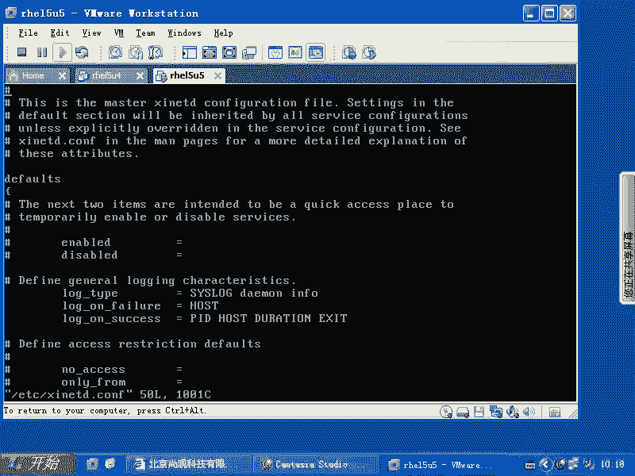

就defa。

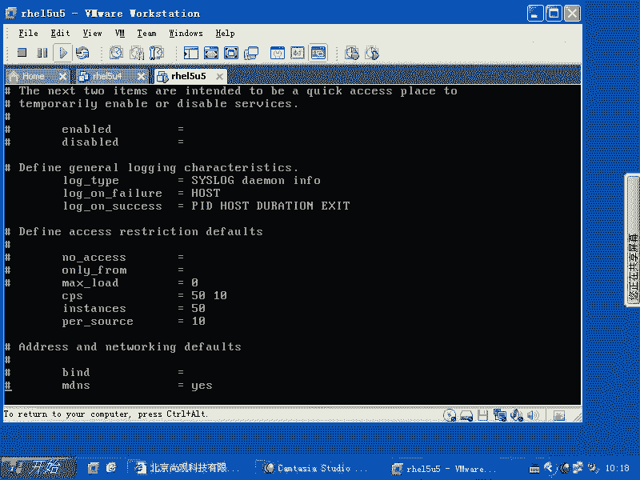

啊，这边的话呢它有一些设置啊，你看默认的一些设置，就是说perIP的话呢，pro source等于10，是不是instance就是实力的话是50个，也就是说它最多开50个进程。他最多他开50个进程。

banner banner failban success啊，这几个的话呢可能都要设置一下啊，就是都可以设置一下。这些的话呢是我们的那个这个配置，这个配置里面没有写，没有写的话呢。

那么就按照我们刚才说的那样IP优先是吧？然之后是什么之后是TCPpper，然后再是什么自己这个配置文件里面呢，only from还有no access，对不对？

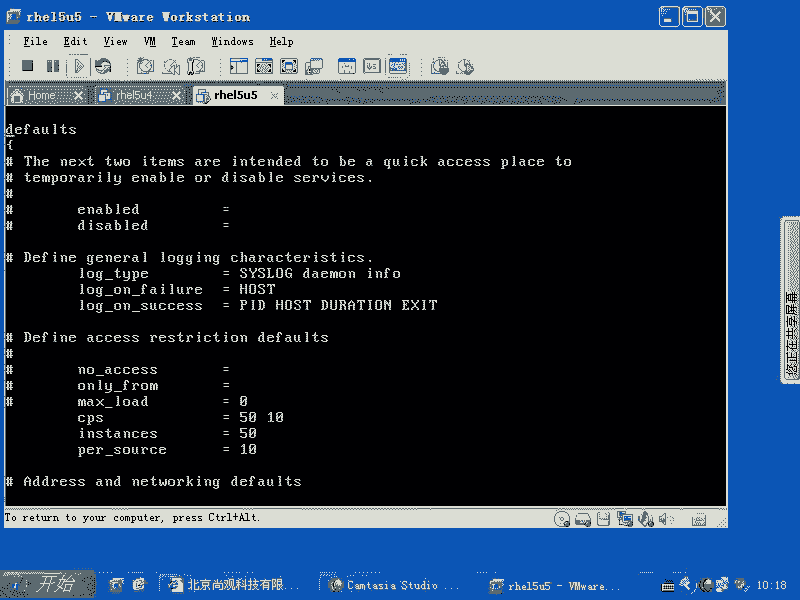

好，这就是XID还有没有问题？

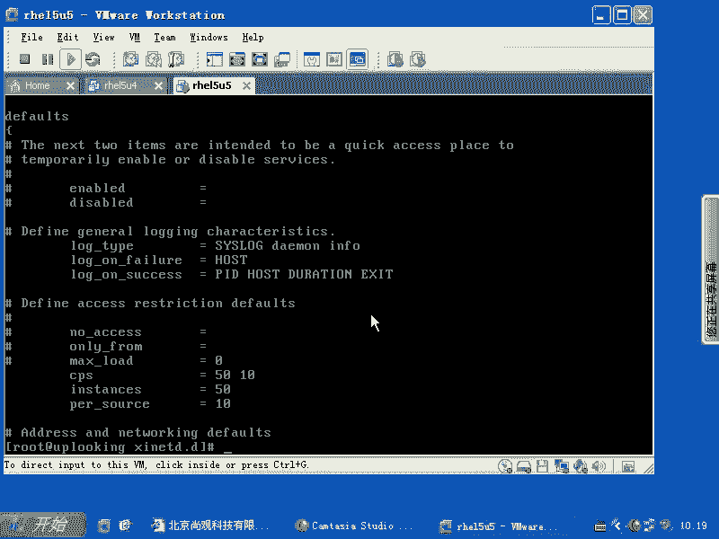