# 尚观Linux视频教程RHCE精品课程：P70：RH253-ULE116-2-1-xinetd-security


## 概述
在本节课中，我们将学习Linux系统中一种特殊的服务管理机制——`xinetd`。我们将了解它的工作原理、配置文件结构，以及如何利用它来加强网络服务的安全性，特别是进行访问控制。

---

## 课程结构介绍
在开始学习`xinetd`之前，我们需要了解整个RH253课程的结构。课程主要分为三大部分：
1.  **网络服务基础**：包含网络类型、服务配置和相关命令。
2.  **系统安全体系**：涵盖数据完整性、访问控制、SELinux、RPM验证等安全组件。
3.  **具体服务配置**：详细讲解FTP、Samba、NFS、DNS、HTTP等服务的配置与管理。

本节课的内容属于第一部分，即网络服务的基础管理与配置。

---

## System V 与 xinetd 服务架构
上一节我们介绍了标准的System V服务管理框架。本节中我们来看看另一种服务管理方式——`xinetd`。

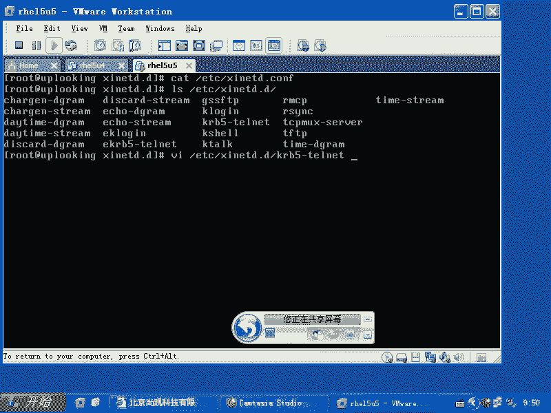

System V的服务脚本位于 `/etc/init.d/` 目录下，通过运行级别目录（如`/etc/rc.d/rc3.d/`）中的符号链接来管理服务的启动（S开头）与关闭（K开头）。

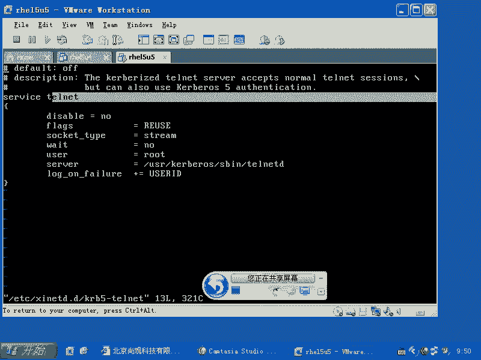

然而，系统中存在一种特殊的服务类型，即基于`xinetd`的服务。这些服务的脚本并不在`/etc/init.d/`下，而是在 `/etc/xinetd.d/` 目录中。

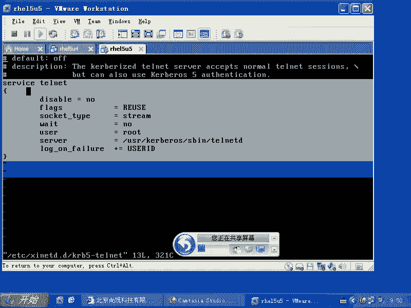

---

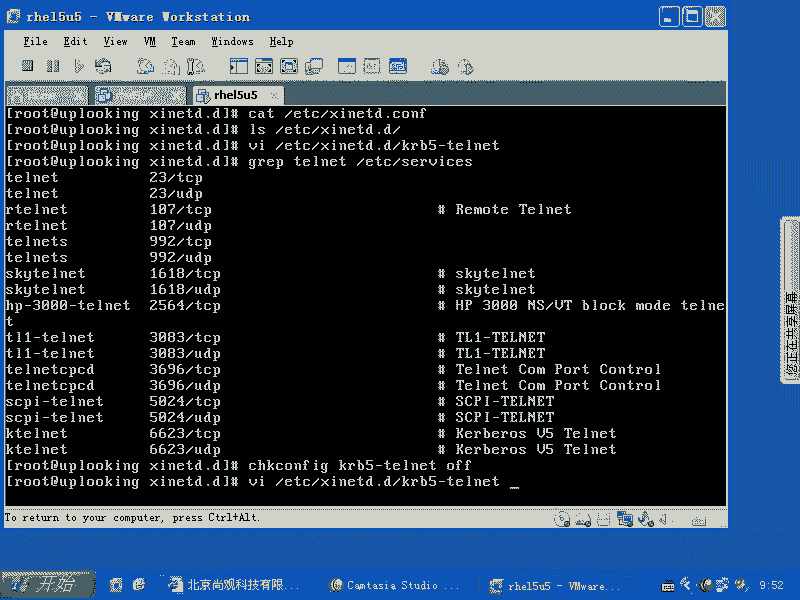

## xinetd 的工作原理
`xinetd` 本身是一个独立的守护进程（daemon）。它的核心思想是充当一个“超级服务器”或“代理”。

*   **传统服务**：像`sshd`这样的服务会一直运行在内存中，监听特定端口。
*   **xinetd服务**：像`telnet`这样的服务，其守护进程平时并不运行。`xinetd`会代为监听所有配置好的服务端口（如23端口）。只有当有客户端连接该端口时，`xinetd`才会从硬盘上启动对应的服务程序（如`in.telnetd`）。连接结束后，该服务进程也随之终止。

这种方式在系统资源（尤其是内存）紧张的时期非常有用，可以节省大量内存。

---

## xinetd 配置文件解析
`xinetd`的配置主要涉及两个位置：
1.  **主配置文件**：`/etc/xinetd.conf`，这是全局设置。
2.  **服务目录**：`/etc/xinetd.d/`，每个基于`xinetd`的服务在这里都有一个独立的配置文件。

主配置文件 `/etc/xinetd.conf` 通常会通过 `includedir` 指令包含 `/etc/xinetd.d/` 目录下的所有文件。因此，我们配置单个服务时，只需修改或创建`/etc/xinetd.d/`目录下的对应文件即可。

让我们以 `telnet` 服务（配置文件可能是 `krb5-telnet`）为例，查看一个典型的配置：

```bash
service telnet
{
        flags           = REUSE
        socket_type     = stream
        wait            = no
        user            = root
        server          = /usr/kerberos/sbin/telnetd
        log_on_failure  += USERID
        disable         = no
}
```

以下是该配置文件中关键参数的含义：
*   **`service telnet`**：定义服务名，这个名字会去 `/etc/services` 文件中查找对应的端口号。
*   **`disable = no`**：表示此服务是启用状态。若为 `yes` 则表示禁用。
*   **`socket_type = stream`**：指定使用面向流的TCP协议。
*   **`wait = no`**：表示服务为多线程（multi-threaded）模式，能为每个连接生成新进程。
*   **`server`**：指定当有连接时，实际要执行的服务程序路径。

---

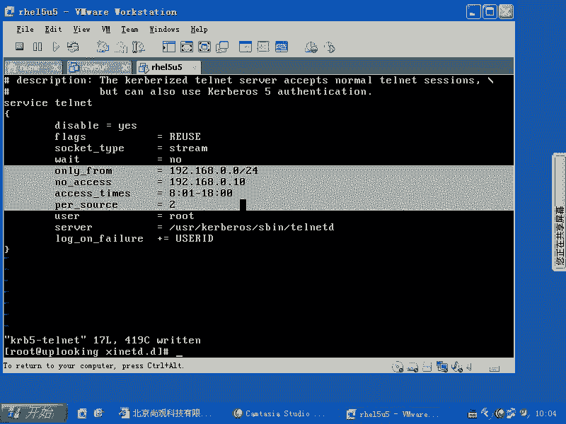

## xinetd 的安全增强配置
`xinetd` 中的 “x” 代表 “extended” 和 “security”。它提供了比传统 `inetd` 更强大的安全特性。我们可以在服务配置文件中添加以下参数来实现访问控制：

以下是几个核心的安全配置选项：
1.  **`only_from`**：允许访问的客户端地址。例如：`only_from = 192.168.1.0/24` 允许整个192.168.1.0网段。
2.  **`no_access`**：明确拒绝访问的客户端地址。例如：`no_access = 192.168.1.100` 拒绝该特定主机。
3.  **`access_times`**：允许访问的时间段。格式为 `小时:分钟-小时:分钟`。例如：`access_times = 08:00-18:00` 只允许在早8点到晚6点之间访问。
4.  **`per_source`**：限制每个IP地址同时发起的连接数，用于防止暴力破解或资源耗尽。例如：`per_source = 3` 表示每个IP最多允许3个并发连接。

一个配置了安全选项的 `telnet` 服务示例可能如下所示：
```bash
service telnet
{
        disable         = no
        socket_type     = stream
        wait            = no
        user            = root
        server          = /usr/kerberos/sbin/telnetd
        only_from       = 192.168.0.0/24
        no_access       = 192.168.0.10
        access_times    = 08:00-18:00
        per_source      = 2
}
```

---

## 管理 xinetd 服务
修改了 `/etc/xinetd.d/` 下的配置文件后，需要让 `xinetd` 守护进程重新加载配置才能生效。

以下是管理 `xinetd` 及其服务的命令：
1.  **启动/停止/重启 xinetd 主服务**：
    ```bash
    service xinetd start | stop | restart | status
    # 或
    systemctl start | stop | restart | status xinetd
    ```
2.  **启用/禁用某个基于 xinetd 的服务**：
    传统方法是直接修改配置文件中的 `disable` 选项（`yes` 或 `no`），然后重启 `xinetd`。
    在RHEL/CentOS中，也可以使用 `chkconfig` 命令（注意：此命令未来可能被淘汰）：
    ```bash
    # 启用服务（将 disable 改为 no）
    chkconfig krb5-telnet on
    # 禁用服务（将 disable 改为 yes）
    chkconfig krb5-telnet off
    ```
    使用 `chkconfig` 启用服务后，通常会自动通知 `xinetd` 重新加载配置，无需手动重启。

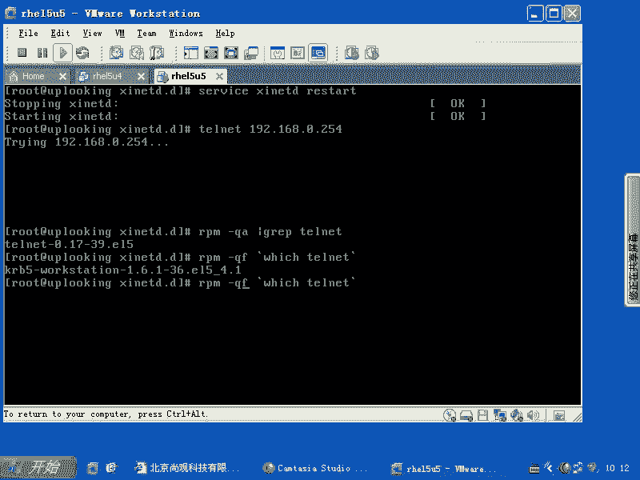

---

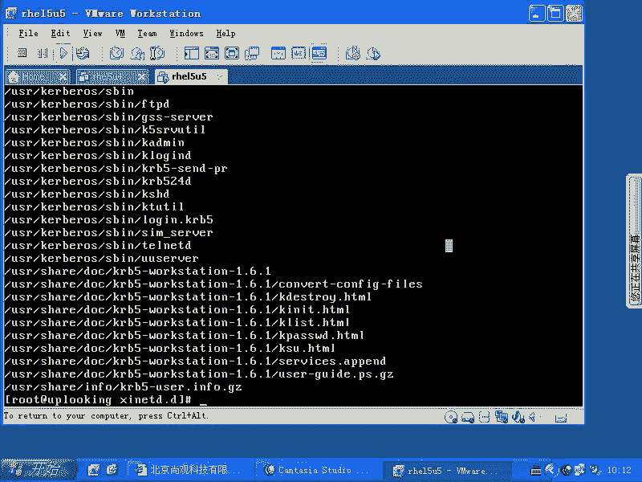

## 访问控制流程探讨
当一个连接请求到达时，可能会经过多层访问控制检查。它们的处理顺序大致如下：
1.  **内核层：iptables/netfilter**：这是第一道防线，在数据包进入用户空间前进行过滤。
2.  **库层：TCP Wrappers (libwrap)**：许多网络服务（包括 `xinetd`）在编译时链接了 `libwrap` 库。它会检查 `/etc/hosts.allow` 和 `/etc/hosts.deny` 文件。
3.  **服务层：xinetd 自身配置**：最后，`xinetd` 会检查其服务配置文件中的 `only_from`、`no_access` 等规则。

**结论**：这三者是 **“与”** 的关系，而非简单的优先级。数据包必须依次通过 `iptables` 的允许、`TCP Wrappers` 的允许、以及 `xinetd` 配置规则的允许，最终才能成功建立连接。任何一层的拒绝都会导致连接失败。从处理顺序上看，`iptables` 最先，`TCP Wrappers` 次之，`xinetd` 自身规则最后生效。

---


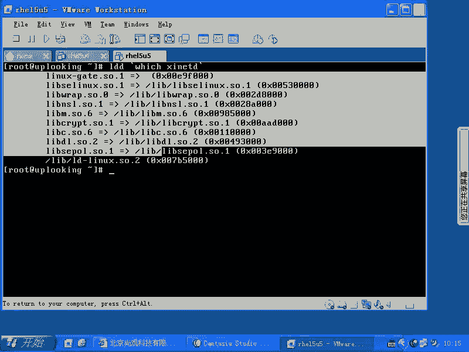

## 总结
本节课中我们一起学习了 `xinetd` 这个扩展的互联网守护进程。

我们首先了解了它与传统 System V 服务架构的区别，即它作为代理按需启动服务以节省资源。接着，我们深入分析了其配置文件的结构，包括主配置文件 `/etc/xinetd.conf` 和各个服务的独立配置文件 `/etc/xinetd.d/*`。

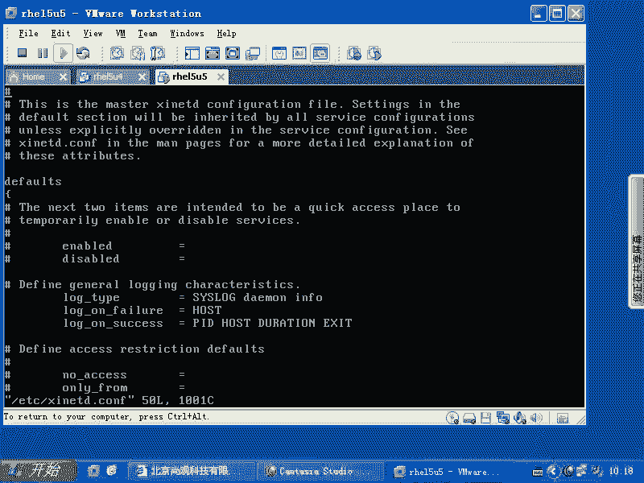

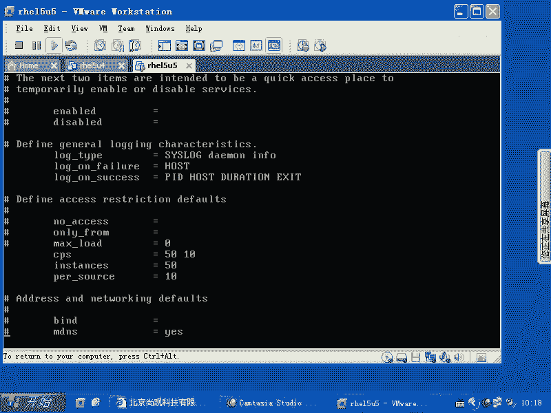

本节课的核心是掌握 `xinetd` 提供的安全增强功能。我们重点学习了四个关键参数：**`only_from`**（允许来源）、**`no_access`**（拒绝来源）、**`access_times`**（访问时间控制）和 **`per_source`**（并发连接限制），并学会了如何将它们配置到服务文件中以实现细粒度的访问控制。

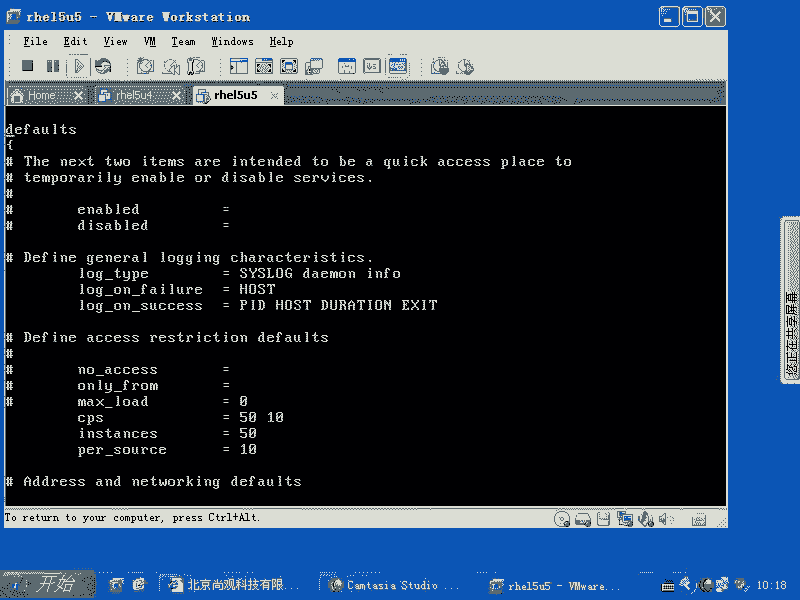

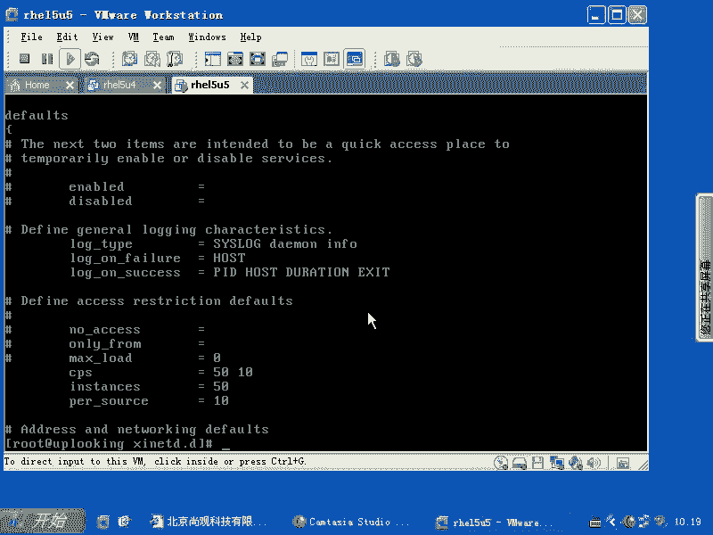

最后，我们讨论了 Linux 系统中多层访问控制（iptables, TCP Wrappers, xinetd规则）的协同工作流程。理解这些机制，对于构建安全的 Linux 服务器环境至关重要。