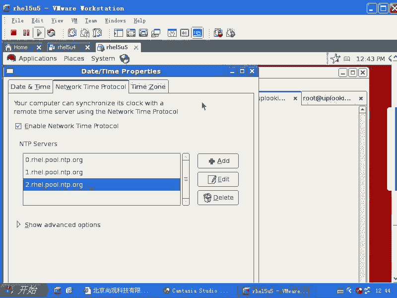
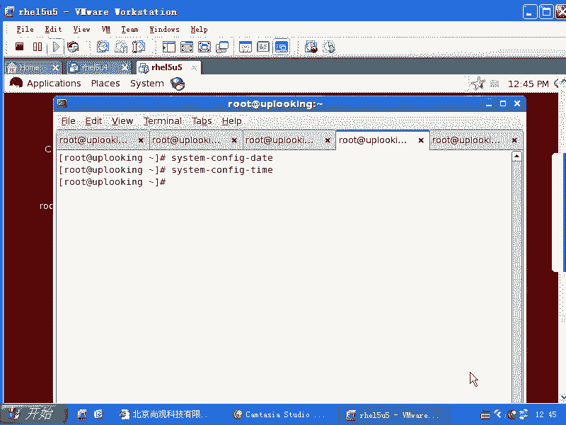

# 尚观Linux视频教程RHCE 精品课程 - P71：RH253-ULE116-4-1-ntpdate-ntp - 爱笑的程序狗 - BV1ax411o7VD

呃，NTP协议的话呢，就是我们的时间服务啊。

时间符记不记得？我们来看一下啊。

NTP协议的话就是NTP是吧？那么我们想去用时间的话呢，立刻同步一下时间。现在我说是凌晨3点，是不是？那我会这样做，我去VIETC下的NTPD点呃NTP。点com是不是在这里面找一个什么呢？

找一个时间服务器，这是我们的呃read自己的时间服务器，然后我们把它复制下来。啊，复制下来。然后呢，我们现在。在这里面用NTPd，然后呢加上这个。服务气，然后呢，他就立刻会把你的时间变掉。

会文你的就是跟internet上去同步时间了。当然你要有internet的连接啊。同步了没有？只要有结果是吧？NGPQ。杠CPE啊。这边的话呢是查询你自己的这个。呃，NTP的这个。就是说。呃。

相当于评级的这种NTP服务器的这个列表啊。那么NTP的话呢，我一般的话是用这个命令啊，直接去回车一下，直接去回车一下。就是说我就直接去同步了时间是的。但是通常情况下，你这个时间的话呢逐渐有漂移。

就是有一些呃影响的时候，你像尤其是虚拟机当中会非常非常的明显。因为虚拟机当中它采用的硬件是虚拟出来的。进出来硬件，那你说它的精振啊等等，它可能会受到什么呢？系统整个状态的影响。

因为它不是访问真正的硬件是吧？真正的那个硬件它会你要精正是怎么样，它都会非常清晰，然后呢，也是不变了，对不对？但是呢我们当我们有大量的文件cooffpy的时候，你的虚拟机呢这个时间就变了就不对了。

所以这个时候的话呢，你可能尤其虚拟机，它的时间就会错乱。这时候我们不可能实时去运行NTBd，是不是？所以的话我们一般会怎么样呢？默认情况下，我们可以service NTPD是吧？star把它启动起来。

然后check outfi。NTPDR把它按起来。这样的话呢，你的时间服务啊总是在跟什么呢？我们这个系统当中啊，就跟系统当中我们这几个时间服务器去同步数据。比如他有个后台首护进程经常去运行。明白吧。

这样运行。那么我们如果要是想去配置自己，变成整个这个内网的时间服务器，也是可以。我想把我自己变成一个内网的服务器，这是可以。我可以怎么样呢？我可以在我的这个呃。就是说在我的这个服务器上把时间同步好以后。

让你们的话呢可以跟我同步啊，让你们的话可以跟我同步。这个可能还要再去配置下，配置下什么呢？VIETC下的NTP啊，这边的话有个目录啊，这里面呢像什么呃next step啊之类的这样的一些东西啊。

就比方说如果要是你们想去跟我同步，你要在next step当中的话，添加我的IP地址。这样的话，你serv什么NTPstar以后，把我的IP地址的话，添加到你那个服务列表里边。NTP的话呢。

也不经常运行。你说你们会跟我去同步数据，我的话跟谁去同步数据啊？我是跟红帽子同步数据，是不是你们的话呢跟我同步数据。那你们怎么配呢？你们首先的话呢要要要VI这个文件。

要不要这个文件把我添加到你的server的那个列表里面去，把我的IP添加到server列表里面去。我的话呢要允许你来跟我访问是吧？同时的话你们还需要再做一步是什么呢？就是说要把自己的那个。

ETC下的NTP当中的什么next step。啊。诶。step ticket啊就是 step ticket，然后呢添加我的IP到这个文件里。你们要做两步就可以跟我同步数据了。同步时间了，明白吧？

这是我在内网当中，我做一个时间服务器，你们当然都可以直接连外网的时间服务器。很简单是吧？那如果要是你们想去呃用命令去做stem。

d啊，这样的话呢你可以去设置网络时间服务，是不是？它现在是不是有三个时间服务器啊，是在那个配置文件里面的，是不是？那么所以你如果是硬一行的话，可以直接去添加。如果一定要文本的话，那你就这样去添加。

清楚啊，你可以把我的IP地址添加到这个地方，那么你们就可以跟我去同步数据，同步时间了，对不对？

时区一定要选对啊，我之所以能正常的看到一个时间。那如果我的时区是在北美的话，那么就跟现在差整数个小时。清楚吧？这个时区一定要选对啊。好，这就是ss confi，然后呢date。看太。一样不一样？

一样不一样。t date和 time是不是都一样呢？是不是？あは。好。我们就在我们就这个NDP的话就给大家。

