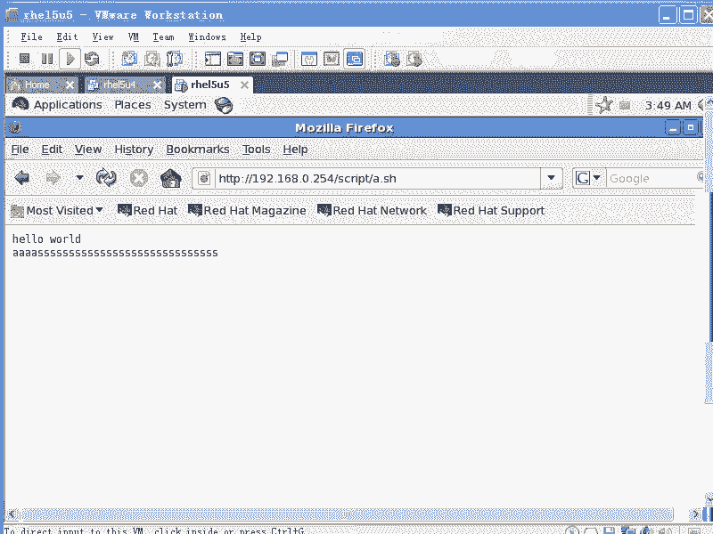
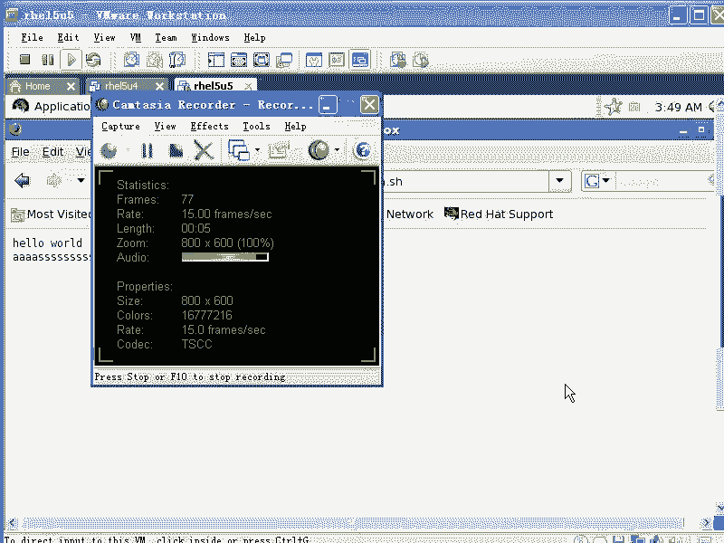
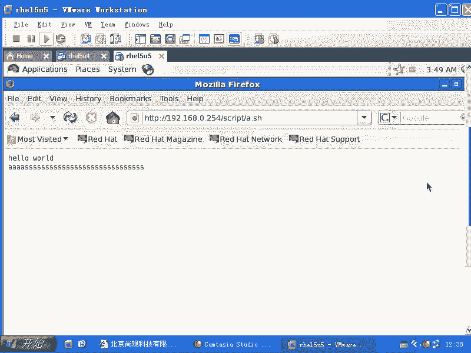
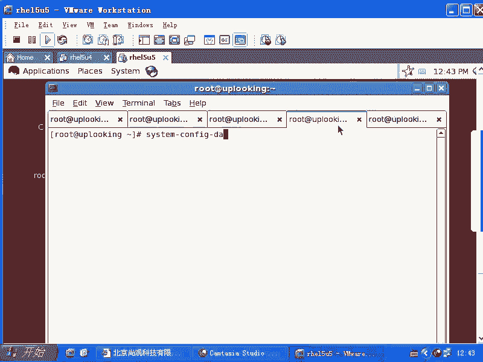
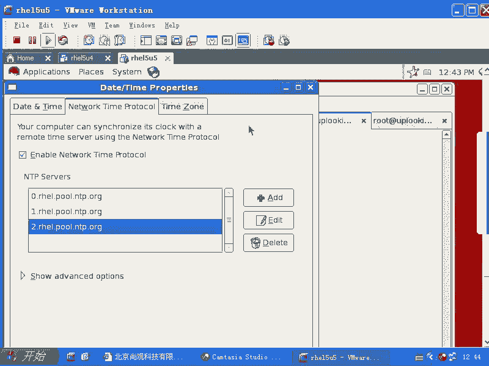
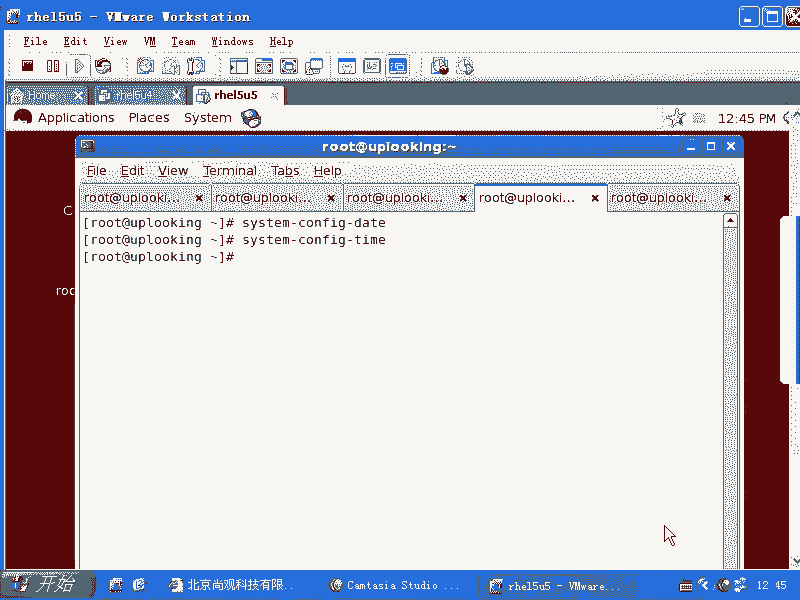

# 尚观Linux视频教程RHCE精品课程：P71：RH253-ULE116-4-1-ntpdate-ntp

## 概述
在本节课中，我们将要学习网络时间协议（NTP）的基本概念，以及如何在Linux系统中使用`ntpdate`和`ntpd`服务来同步系统时间。课程内容包括手动同步时间、配置自动时间同步服务，以及如何将本地服务器配置为内网的时间服务器。

---

## NTP协议简介
NTP协议是网络时间协议的缩写，用于在计算机网络中同步系统时钟。

上一节我们介绍了NTP的基本概念，本节中我们来看看如何在Linux系统中实际操作。

## 手动同步时间
如果想立刻同步系统时间，可以使用`ntpdate`命令。例如，假设当前时间是凌晨3点，但实际时间并非如此，我们可以手动同步。

以下是操作步骤：
1.  首先，需要找到一个可用的NTP时间服务器。可以编辑 `/etc/ntp.conf` 文件，其中通常包含Red Hat官方的时间服务器地址。
2.  复制该服务器地址。
3.  在终端中执行命令 `ntpdate [服务器地址]`。该命令会立即与指定的Internet时间服务器同步时间。执行此操作需要系统能够连接互联网。

可以使用 `ntpq -p` 命令来查询当前正在使用的NTP服务器列表及其状态。

通常情况下，直接运行 `ntpdate` 命令并回车即可同步时间。但在虚拟机环境中，系统时间容易发生漂移，因为虚拟机使用的是虚拟化硬件，其时钟精度可能受宿主机整体状态影响。当进行大量文件复制等操作时，虚拟机的时间可能变得不准确。

## 配置自动时间同步服务
由于不能总是手动运行`ntpdate`，我们通常需要配置一个后台守护进程来自动同步时间。

以下是配置步骤：
1.  使用命令 `service ntpd start` 启动NTP服务。
2.  使用命令 `chkconfig ntpd on` 设置NTP服务在系统启动时自动运行。

这样，`ntpd`服务就会在后台持续运行，并定期与配置文件中的时间服务器同步数据。

## 配置内网时间服务器
可以将一台已经同步好时间的服务器配置为内网的时间服务器，供局域网内其他机器同步时间。

上一节我们介绍了如何作为客户端同步时间，本节中我们来看看如何成为时间服务器。

以下是服务器端配置步骤：
1.  确保本机时间已与外部时间源（如红帽官方服务器）同步准确。
2.  编辑NTP配置文件 `/etc/ntp.conf`，允许内网客户端访问本机的NTP服务。通常需要配置 `restrict` 和 `server` 参数。

以下是客户端配置步骤：
1.  客户端需要编辑自己的 `/etc/ntp.conf` 文件，在 `server` 配置项中添加内网时间服务器的IP地址。
2.  客户端还需要在 `/etc/ntp/step-tickers` 文件中添加内网时间服务器的IP地址。
3.  完成这两步后，启动客户端的`ntpd`服务，它就会与内网服务器同步时间。

当然，客户端也可以直接配置外网的时间服务器，步骤更简单。

## 时区设置的重要性
系统时区必须设置正确。如果时区设置错误，例如设置为北美时区，那么显示的时间将与实际时间相差数小时。

可以使用 `date` 命令查看当前系统时间和日期。确保 `date` 和 `timedatectl` 命令显示的时间信息一致。

## 总结
本节课中我们一起学习了NTP时间同步。我们掌握了使用 `ntpdate` 命令手动同步时间的方法，以及通过配置和启动 `ntpd` 服务实现自动时间同步。此外，我们还了解了如何将一台Linux服务器配置为内网的时间服务器，并为其他客户端提供时间同步服务。最后，我们强调了正确设置系统时区的重要性。