# 尚观Linux视频教程RHCE 精品课程 - P72：RH253-ULE116-4-1-selinux-chcon-restorecon-sealert - 爱笑的程序狗 - BV1ax411o7VD

SElinux是安全加强型linux它是美国的NSA啊，NSA就是美国国家安全局，然后呢去定出来的框架，也就是一个矩阵式的框架，就是说允许什么拒绝什么，允许什么，拒绝什么，这个是靠一个矩阵来控制的。

所以它这个数学的框架的话是由什么NSANSA来提供。提供完以后的话呢。🤧谁去实施呢？reite是主力，明白吧？我觉得啊我这是个人推测，我觉得reite肯定接了美国军方或者说美国国家的安全的这样的一些活。

就是说他把这个安全的这个防控制的这套体系的话呢，他自己什么，他自己一定要开发。所以的话呢在开发的步伐当中的话呢，他有一些这种企业客户是吧？相当于然后他把这个东西的话呢，就给那个他们国家在用就美国在用。

所以的话呢，他在咱们现在用的这些版本当中流露出来的都是什么呢？都是一些。就比较比较比较那个就是。规则没那么严的，明白吧？不是那么完善的这样的一些东西啊，这是我个人的臆断啊。当然可能未必是这样。

你比方说他等一下的话，我们给大家讲，它实际上是有三种三种结果集，就是三种规则集，一种是targeted的，我们用的是最最简单targeted，还有一种是什么呢str，就是说呢控制稍微严密的。

还有一种的话呢是什么mty什么 levell，就是说多层次的这种访问控制架构啊，它是有三种结这个集合。那我们的SElinux的话呢，它来源于什么一个贵族是吧？

就相当于人家说Sinux诞生在linux上的时候，就相当于一个。穿着这个特别漂亮盛装的这种王室成员，然后呢公主啊，然后走在什么呢？比方说什么三里屯啊，或者什么呃秀水街啊，或者什么那个呃。不是三里屯。

你没有想到哪去了，是。😊，走在动物园之类的这种菜市场啊之类的地方，明白吧？那这个感觉这种感觉。但是呢它本身的这个架构体系的话呢还是比较好的。我们去使用它的话呢，一定要知道它的架构。

也就是它的话呢变成了一个什么由。DAC啊DAC访问控制架构变成了MACMAC是什么呢？就是我们的。MAC的话呢，就是我们的这个强制访问架构。也就是说你默认做的每一件事情都要进行允许。

否则的话呢就被拒绝啊。DAC的话呢是默认进行的事情的话呢，除非是我拒绝，否则的话就被允许是吧？我刚才开玩笑，如他就是天人合一是吧？系统能干什么，你就能干什么？但是这种情况的话呢，肯定是非常粗浅。

也就是说在我刚刚创建系统的时候，我希望做为一个系统它能正常运行是吧？所以我默认情况下都允许。但是我这个系统在完善的阶阶段，我就需要提供各种各样的功能。那你看windows是不是就这样。

windows以前我记得也能格式化C盘是吧，自己格式化C盘。然后现在的话是不行，是不是？现在的话你能做的事情的话都是一个结果级。就是这个结果集的话呢，是系统权限的一个缩集，是吧？

说就是MAC就是发展趋势，就是默认情况下你能做的事情只是什么呢？我允许你做的事情，否则的话就拒绝啊。这边的话呢，我们看他所就是怎么样去实现这个MAC我们的系统当中的各种各样的资源啊，包括什么呢？

文件是吧，原来文件的访问控制是怎么样？我们文件的话有UGO3种角色是吧？这三种角色分别就有RWX3种权限是吧？他们有哪种权限就允许有哪种权限去拒绝。那么我这个文件之所以能被程序所访问，是因为我们程序。

就我们的进程会有什么呢？会有自己的UID和什么GID是不是我们的UID和GID的话呢，拿来跟文件的这个U或者是G的话呢来碰，对不对？如果要是允许，就是这个RWX是允许的，那么三种操作是允许的。

那么比方说哪种权限是可以的，那么它就可以做某种。😊，呃，事情对吧？这是我们以前的方式。但是这里面的话呢有一个问题就是什么呢？当我们的这个文件啊，它去可以限定的时候，它限定的是什么用户一种权限是吧？

组一种权限，其他的所有人others是另外所有的权限是不是？😊，那我给大家举过一个例子，如果要是现在我有个appartache，我通过我的电脑去访问一个远程服务器上的apartache。

那我在远程服务器上具有的权限是什么权限？是appartache的全面。Aache的话呢，它是一个others，是不是？如果要是它是一个others，对系统中的普遍的用户呃。

这个普遍的文件来说都是others，大家都是others都具有什么呢？对你比方说ETC啊password就具有读取的权限，是不是？那么你没事干的话，你读自己的读password干什？

那么你如果要是对某些文件的话呢，权限没有设置好，你还可以去写入它，是不是？这样的话呢，我不利于我们细节的去控制。你比方说我们允许appartache账号。啊，发起这个账号。可以去访问自己的库，对不对？

访问什么什么的库呢？是我们的在那个LIB目录下。比拉目录下有一大堆的这个这个库是吧？我们把其中的话呢归成一类，其中几个文件归成一类。尽管它的权限都是允许others可读的，是不是？

但是我只允许的我们的这个ache读其中的几个库，而且这个库的话呢不是读取权限，而是什么呢？库的访问权限，明白吧？然后呢我们在ETC下的ETC目录下那些配置文件，我只允许他读什么呢？

ache自己的那个配置文件。这个时候的话我们就需要详细的这种测这个详细的这个权限了。于是的话你看现在的话就是说不管你是进程也好，是吧？你是进程也好，不再是用UID或者是GID了，而是用什么呢？

而是用我们的conex。😊，context，然后呢再加上什么呢？再加上文件，文件的话也有什么。😡，context还有什么呢？还有各种各样的协议和端考啊，也有什么呢？conext。

所有的contex互相之间访问的话呢，都需要经过允许。这些允许的结果集就是SE给你准备出来的一个结果集，这是一个举阵方式。明白吧？比方说apparty它能访问到这个文件吗？

以前我们只要给权限加上去就可以，是不是？但是现在的话呢，他要看这个contex在内核当中是不是被允许访问什么另外一个context。听白吧。那这个conex的话呢，就不是一种角色了。每一种类型的文件。

每一种类型的资源，它都有自己独特的一个什么con contexttex。你像我们系统当中，假如说ETC下的password是不是和ETC下的com呃HTTPD。当中的HTVD啊康复啊。

HTTPD点com这两个文件的话呢，默认情况下，它的权限都应该是others可读，是不是others可读？但是现在的话，你说一个是appartache的配置文件，它肯定是要求自己是可读的，对不对？

另外一个是系统的什么用户名是吧，比较敏感的文件，他们两个的contexs一样不一样。😊，毫无疑问肯定是不一样的。嗯，但是呢在我们传统的权限里面，他们一样不一样。一样都是others可读，是不是？

所以这样的话，我们就是不是就细节的控制的权限？对不对？那么你怎么样看文件的这个contex呢？你可以加大Z参数啊，LS啊，我们的ETC项的password是不是？然后加上一个什么杠大Z。😊，加大Z以后。

他就会把这个程序呃，这个进程也好，或者说我们的这个文件也好，还是我们的各种资源也好，他们的所具有的这个上下文显示出来。你看这两个上下文一样不一样。它的类型是什么类型呢？是HTTPD的confi类型。

是不是这个肯定是允许appartache的话，各种操作是不是都应该允许是吧？除了写入操作啊，还有一个的话呢是ETC类型。所以这两个地方的话你就完全不同了，是不是这样？😊，是不是这样？

所以的话呢这样的话我们就可以细节的控制系统当中的各种资源和各种访问。这就是SEex。由此的话呢，我们给大家原来给大家介绍过，那么我们给大家介绍的是最基本的SE这的词打开或者关闭或者是查看，对不对？

我们说大家想要去呃想要去查看get in force。如果要是inforcing状态，表示它是正常状态，对不对？就是说它是起作用的状态，也就是该拒绝的时候就拒绝。那么该允许的时候就允许。

如果要是你是set in，然后呢给它set in设置成0。那这样的话呢就相当于让它进入了permissive状态。permissive状态的话，是默认情况下是什么样的，是全部都什么允许。

但是呢你操作本来我不允许的操作的时候，我把它记入日志，我给in报警，明白吧？就相当于一种入侵检测的状态，清楚了吗？这就是set in， get in。那么如果你想再把它打开的话。

那就是什么s in一是吧？我在这里面不得不提一点，不要看我set in0啊，它实际上感觉好像是不起作用了，但是实际上很多操作都是不允许的。彻底把它关闭掉，应该怎么样去关闭呢？

VIETC下的什么SEinux当中的confi，把那个把那个就是说inforcing等于什么？哎，是这样写吗？那小写啊inforcing是吧？等于什么呢？如果你想彻底的更改的话，那么就是这样的啊。

就这样的infor再改这个文件，inforcing等于diable，然后重新启动生效，明白了吧？彻底把它关掉。如果要是你已经开启了，你只能把它什么呢？

变成permissivepermissive实际上还有很多操作是不允许的。记住了吗？彻底关掉是diable。但是你RC考试的时候，你要不要把它diableable掉？那你要想。不想过的话。

那你就 dissable。明白吧，这改完了。😊，当然了，你可以在我们系统启动时候，内核后面加上一个参数，叫做什么呢？叫做SEinux等于off。啊，在系统启动的时候，那么加上一个内核参数。

就是 kernell那行是不是 kernelelVMLNUZ是不是什么什么什么什么这行，后面加上一个什么SElinux。😊，等于off。那么可以加这样一行，清楚了吗？这行的话跟那个上面是一样的啊。

那么这是我们原来给大家介绍过的。现在的话我们要进一步介绍更多的命令。当你想去看文件的这个这个就是说上下文的时候，LS杠大Z是不是想看进程的上下文的时候，PS。AUX是吧，我们一般是。

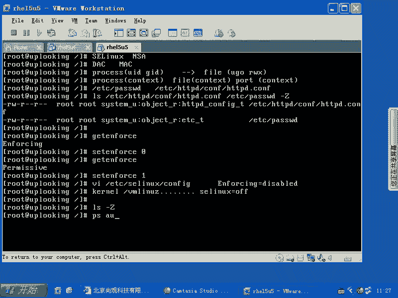

PS是吧，AU是吧？X这样是显示这些东西是不是？那么U的话呢是显示的东西多啊，那这样的话我显示的东西稍微少一点，但是我加上一个什么呢？加上一个大Z。😊。

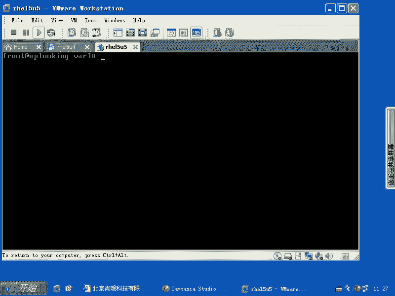

前面是不是上海文都显示出来了？是不是这样的话呢，就是当大Z呃就是没有杠了，是吧？没有杠了是吧，大Z它可以显示进程的什么，它可以显示。AX啊，它可以显示进程的上下文啊。

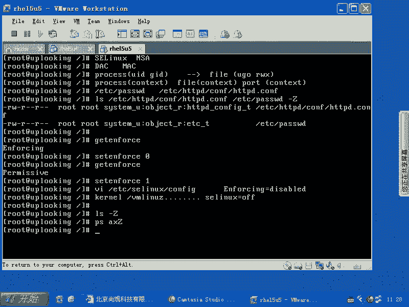

所以这样的话呢，相关的操作是很多的。

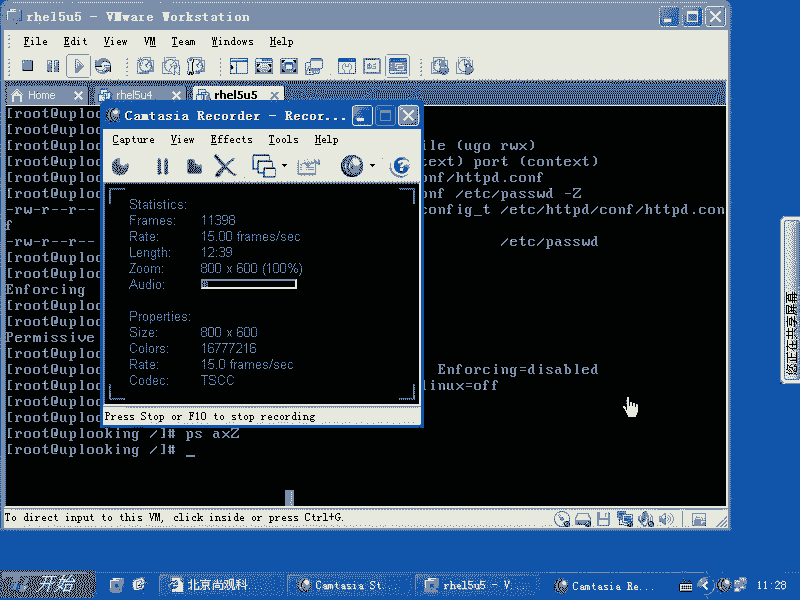

明白了吗？好，那让我们的话呢再来细节的再来讨论一下啊，细节再来讨论一下。我现在呢starX。

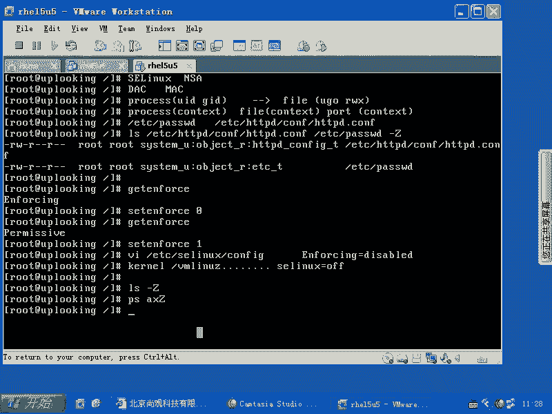

我先给大家一个直观的印象。

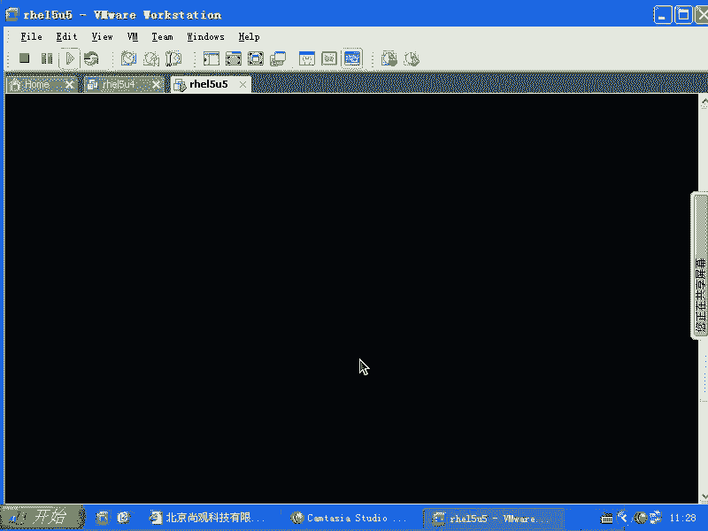

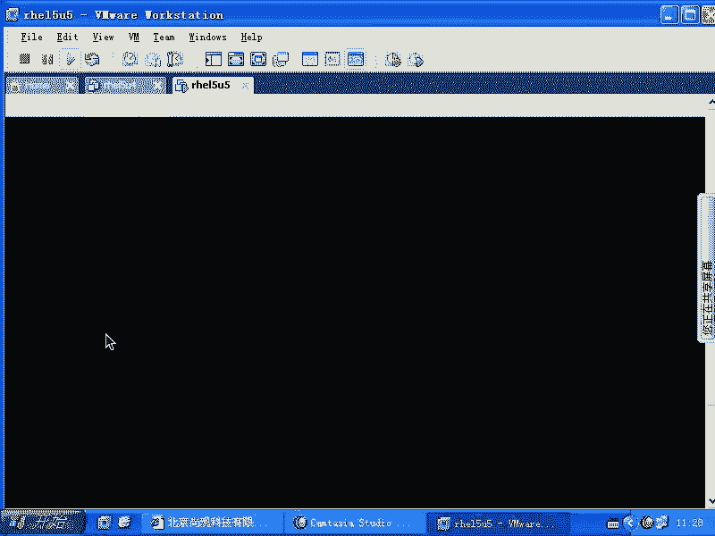

能还是比较慢啊。那么你在terminal当中的话，可以执行什么呢呃。system是吧，杠fi是吧，杠我们看一下有没有SE LinuxuxS是吧？那么你会把这S开头的话呢，有SE Linux看到了吧？

然后SE那个。打开它以后的话呢，你可以进行一些细节的SE量词方面的控制。那么首先的话呢，这里面这里面的话呢，最基本的话我可以让它运行什么diable或者permissive是吧？

这样的话呢就是改那个confi文件，是不是？刚才我们直接改confi文件，是不是也是可以的？然后这边的话呢，大家看啊。😊，现在的话呢，这边的话呢是一个叫做targe的，看到了吗？tage的。

因为我现在只装了他geated，你还可以装什么呢？😡，strstrstr的话呢， targetedarge的这种模式是什么模式呢？就是SE mix的话，它的结果级对不对？那结果级的话呢是不是比较大呀？

因为它要运行所有的程序的时候，都要经过它允许，是不是它的结果集就很大。但是我们现在的这种pertargeted的格式的话呢，是我们现在登录系统本身是不需要任何的什么，不需要任何的这个呃就是结果去限制。

也就是这个结果集的话呢，它只是限制的是什么？远程访问就说那些服务明白吧？他担心你的服务被什么有漏洞了以后被攻击进去，他可以防范未知的漏洞的啊，他说是防范未知漏洞。实际上的话就是说呃当未知漏洞出现的时候。

他不允许这些账号做一些出额的事情，不允许这个进程做一些出额的事情，所以他get的话呢，他是相当于那个餐馆有个规定啊，这个规定是什么呢？本来你原来到那里面去吃饭是吧？那么一切都是允许的，除非是什么？

他规定说禁止什么禁止什么，禁止什么，是不是？但是现在是怎么样呢？你到餐馆里面去吃饭，他也不限制你，只不过外送的时候，他不限制你。对不对？你要说人家的话呢，有一个。有一个人的话呢，给你外送过来东西了。

然后呢，他是离开他那个就是就是相当于远程访问是吧？那么这个外送过来东西要求你自备零钱是吧？不自备零钱的，我不给你送。我只是什么限定外面的这种远程访问的这些可以访问到的进程，明白吗？

所以它实际上是一个缩及，对不对？它并没有完全的保护我们系统是吧？原来原完全的保护我们系统，它的它的模式叫什么呢？str啊TRIDE啊str应该是这个你们可以看下serv目录下。

就是那个呃所有的那个包的目录下有没有一个S什么str这样的一个包啊，这个包如果装上去的话，它应该是能支持str格式还有个叫mountlevel啊MULI啊我们MULI然后LEVEL啊。

这种这还有两种格式，也就是它的话呢，我们现在用的就是re给我们配的什么呢？基本的模式，就是保护你最起码的什么远程的这个呃能访问到这些东西。然后我们再去看一下啊。

这边的话呢就是各种各样的buing就是布尔值布尔值的什么呢？就是。S我们只能控制它什么完全开屏或者完全关闭是吧？现在假如说你现在运行着mysqcle。

同时还还运行着HTVD你想限定HTVD但是不想限定什么myCrcle，我想限定什么呢？一个细节，我又不可能把Sin全都关掉，所以的话这叫什么呢？布尔值。也就是说我们的Sinux呃，简单讲的话是这样的啊。

我现在。给大家看。简单讲是这样的，我现在想去把SElinux的话呢里面。它整个的是一个大的集合，这个大的集合是一个矩阵啊，就是说我。每个。你比方说这个是一个aparty的contex。

这边的话呢是一个myso contextex，这边是一个什么什么contex。然后呢，这个appartache这个contex的话呢，它对某一个文件，比如说ETC啊password是一个什么样的选项。

它们之间是不是有一个。他们他们之间是不是可以有个交集啊，明白吧？明白吧？就比方说是ETC下的pasword的这种类型是吧？这种类型这种上下文跟这种上下文这个地方是什么？这个地方到底是允许呢还是拒绝。

明白吧？它是一个这样的结果集，明白不明白？那我们把这么巨型的一个结结果集分割成很多小块。也就是说我现在的话呢把。我现在的话呢把这个acheHTTBD相关的。

比方说自动就是能正常运行的这个结果集变成一个bolling，明白吧？想让它的话呢，SSH呃，不是不是SSSSL就是那个加密的SSA呃，加密的HTBD是吧？加密的HTBD让它运行，又是另外一个结果集。

是不是然后呢，我就把另外的一些结果集的话呢又放在另外的一个包呃，一个小的包里面，这些包裹的话呢，就叫boing啊，如果我要让哪某就是boing值就是给它设定成就是布尔值的话。

设定成一还是零波尔值就是01是吧？零的话就是说。不运行它一的话就是什么运行它，比如这个结果集的话呢，到底运行不运行，给它设置它的什么bo的值是吧？就是我们的这个结，就是这个呃布尔值是吧？

那这个布尔值一OK这个集合的话呢，就运行就开始限定了。如果要是这个这个结果集零，那它就不限定，是不是不限定，就是它这块不起作用。也就整个的1个Sin当中划分了大大小小各种类别的很多很多的结果集，明白吧？

这些结果集我们想去细节的控制，可不可以呢？没问题啊。😊，啊，没问题，我们看一眼。OK看到这边来。😊，那么如果要是我们现在看这个这这个界面啊，有关管理方面的，你点开这个符号。

那么在这边是吧允许什么什么允许什么什么允许什么，不管是允许还是拒绝，它代表的都是一系列的什么结果题。一一大堆的什么context的是否允许是否拒绝。明白吧？他这一大堆的context都放在这里面。

那么我们这边不允许什么呢？任何进程去漏的什么内核模块，看到了吧？这个有是不是有点像windows那个主策略里面那些选项。是吧其实主策略也是类似的东西啊，主策略也是类似的东西。没有。M啱 c 啊。

比方CdCBS的。😊。

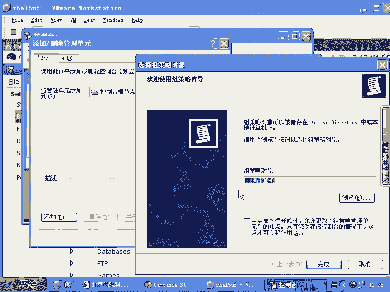

好，大家看这是组策略是吧？你看。它实际上是一样的啊，windows设置安全设置。然后呃。用户权力指派是吧，那谁能备份，谁能产生安全审计，是不是这些细节的设置的话，主在lininux里面有没有啊？😊。

根本就没有啊根本没有。所以的话呢要想window呃linux想去追上windows这些东西的话，那你看这些东西是不是已经够细了？是不是已经很细了？所以我们说SElinux是什么？呃。

是linux安全的未来。分门别类的把这些结果集的话呢全部都设置出来，明白吧？这边你都能看得到，是不是你可以允许什么拒绝什么，允许什么，拒绝什么，是不是可以加载这些结果集啊？

是不是O那么这边的话呢就是呃system杠confi杠什么SE出来的东西，是不是？那么这边的话呢，还有一些其他的，比方说文件的标签啊，比方说所有的什么什么目录的话呢。

应该是这样的自动设置这样的这个上下文，是吧？😊，什么样的账号设置成这样的上下文啊，默认的他现在他的有个默认的账号啊。还有的话呢，SElinux的用户的话呢，设置成什么样的上下文，就是用户也有上下文啊。

用户也有上下文。leux里面的话甚至端口号都有上下文。一个程序它能不能访问这个端口啊，它都有要有上下文允许的，明白吧？所以端口号也要有什么上下文。太多东西。你看我刚才说端口号是不是要有上下文啊。

有没有啊？对吧。这是协议啊。啊，这是模块的名字。然后我们看。这边的话呢是提供给你一个图形化的编辑工编程工具，呃，就是编这个SEinux的工具。那么你如果要是想用命令行的方式去控制那个布尔值，就是什么啊。

set SE啊。S SE。BOL啊。那这样的话呢，你可以去限定某一个规则，它启动或者关闭，就不用启动那个同一界面了，是不是就在文本界面上就可以。那么你说我怎么样去限定呢？我哪知道有哪些呃。

我哪知道有哪些这个呃就是布尔值是吧？那么你getSE负啊，这样的话呢，你可以加上一个什么杠A啊，这边所有的这个规则。是不是？那么比方说我想看什么呢？啊party相关的所有的。阿part相关的有没有？

是这么多，这边是允许啊party和scret的脚本是吧？匿名去写，对不对？我们想把这个功能的话呢是什么？R是不是？那我就s它为什么，它为。😡，一是不是你看我看这样的啊。那么我首先的话呢。

get一下是不是？比方说我去允许他啊。然后呢，再去什么set SE。BOLL啊，然后我把这个东西选定，是不是选定完以后再怎么样？2。是不是这样它就生效了，是不是？这样的话呢。

就是我们针对某一个布尔值进行设定了。是不是这样？明白了没有？明白了啊。还有的话呢就是说我们可以设置一些文件。以前的话呢，之所以啊以前之所以很多公司的话要把SE关掉。什么原因呢？就是它不会用。

不会用的话呢，突然拒绝了是吧？然后呢，一个老手他就告说哎把SE关掉。你说这个人的经验多丰富，是不是？真丰富是吧？他知道是SE那4怎么样是拒绝的，是吧？关掉就算了是吧，你会觉得。😡，真厉害是吧？真厉害。

其实的话呢是因为他懒得去折腾这个权限。如果要你再去再去进一步的话，基本上你就可以解决这个问题。就是自己可以手动解决。你比方说你新搭这一个服务，因为SE定的原因运行不起来是吧？你说怎么解决呢？

这才是真正的高手是吧？那么你一过去以后噼里啪啦就让它运行起来，还能保护你的系统，那你简直太厉害了，那怎么样去接下来做呢？那么你首先的话呢知道设置某一个允许或者拒绝是吧？这样的话呢。

你可以允许S啊就是HTVD和crd，他可以去写他自己的那个有权限那个目录是吧？那他怎么样去写呢？默认情况下，你给他加77权限以后，他又不能去写，是不是他只能去写什么呢？你比方说我现在看有一个目录啊。

假如说。😊，Y下的H呃3W当中的。HTMM目录是不是这个时候我加上一个什么呢？😡，杠L啊Z。Yeah。加上个D呀。是不是少个D啊，我要看目录的属性，是不是？这样的话，我们看这个目录。

这个目录的话是允许什么呢？呃，这个这个目录是不允许任何人去写入，是不是不允许other写入，只允许如此账号写入。然后我把他的权限改成77，能不能呢？😊，就是appartache能不能写入呢？

那你要是要把这这个就是可能可能要把这一项打开，是不是可能要把这项打开。因为我没有去看，就是HGBD和rightite这两个权限组合，应该新HTB新right是吧？把那把那几个规则打开。

就是允许他们写入的这个规则打开是吧？但是我能不能写。能不能写，那还要看这个文件夹允不允许你写是吧？这个文件夹的话，是不是默认权啊，我可以把它的权限改一下，是不是我这样的CH假如说假如说我在这个。😊。

makeDRR挂下的3W当中HTML当中有个什么呢？叫做upload。😊，就是说你上传的这个。附件是吧？上传的这个比方说某一个论坛里面的那些乱七八糟的东西是吧？附件。那这些附件的话呢。

我要上传到upload目录下，我是不是要求appartache可以写入啊？嗯，那我给它设置完以后，然后我这样的CHOWN是吧？杠大R，然后我加上一个什么呢？😊，呃。

aparache的账号应该是aparache是吧？apartache就是HTGD的。UUI这个进程的这个我们看一下啊。PS啊像service HGVD是吧，star启动起来了是吧？

然后我们这样的PSAUXGREP什么HVD那么我这边加上一个什么呢？Z是不是啊？😊，把U切换成Z是吧，一回车。诶。是apparty账号，是不是？好吧，这哈。啊。

partache账号也就是说我们现在这个进程是吧？它的上下文是这个上下文，是不是？那它的U外就是用户名是什么呢？是啊partache是不是也就是实际上这个账号的话呢，他要写入，让他去上传一个附件以后。

他能写入到某一个文件里面去。他的身份是谁呀？😊，party是不是？然后呢，于是我们过来，然后呢输入什么呢？CH呃。OWN是吧杠大R，然后呢把这个目录。改好，然后呢再输入什么呢？

这个目录的权限是不是允许他写入是吧，允许阿part账号写入吧，允不允许啊，允许。😡，但是呢。你现在看到的是在这个目录下，自动会有一个什么自动会有上下文的继承，看到了吗？看到吧？

叫做HDBD的系统的什么内容类型，是不是？也就是这个内容类型的话呢，我不知道它允不允许去上传文件啊，上传文件我不知道它允不允许。所以的话呢当你这样的时候，你比方说你把阿帕ache的主目路改一下。

makeDR创建了一个名叫什么3W的目录，对不对？然后呢，在这里面同样在怎么样？一样啊，你只不过换了个目录，对不对？然后呢再去看。😡，いや。哎，错了。

然后再去看再去看刚才创建的这个3W目录下的upload，是不是这是跟目录下的一样不一样。这两个一样不一样。不一样的结果就意味着你appartache在上传这个文件的时候，很可能写入不进去。

尽管你具有了什么七的权限，是不是？因为SE这词还是一道关，是不是？这道关还是把你挡住了，对不对？所以这个地方的话呢，就是我们可能要手动解决的问题。这个的话你要怎么去做呢？呃，你要怎么去做呢？

那么你可以需要需呃输入一个什么呢？CHCON啊CHCON然后呢，杠T我把这个类型改成跟它一样，是不是？是吧假如说你这边是一个目录，这个目录下所有的文件都要这样做，那不是加个大R，是不是？

然后再加上什么呢？再加上3W当中的什么呢？啊，apple load啊，这样一设置。这样的话呢，你把这个类型改完了以后，然后再去看一眼的时候啊。😊，怎么样？是不是已经变过来了？这个时候的话呢。

基本上你就可以去创建这个文，就是在这里面创建文件。因为它的这个contex跟上面那个真正的acpartache目录下的contex是不是一样的？既然一样的话，那他那他就是应该如果那个目录下可以上传。

那你创建的这个目录下也可以上传，对不对？所以这种是上下文经常的话呢，你要自己去。去坐第二个。清楚了吗？啊，那么我们这边说一下啊，首先你这边的话呢，可以看到所有的上下文，上下文的结果结果集是吧？

子集是不是看到这些子集哪些允许哪些拒绝。那么你可以用GR就是get sE，然后呢杠A，然后加上一个GRP这样来看，是不是这样看完了以后的话呢，你可以设置某一个结果集R或者of，比方说它是d别人什么。

就是它比方说apache当中它有一个比方说dy这个脚本运行。就是你ache的话要调用一个可执行的脚本，是不是它dy的本行，那你就把它什么off掉，那它就会允许是不是嗯所以这个alone还是d。

然后你要看清楚，把这个子结果子集的话呢，on或者of就用这样的命令就好，先get一下，然后再s下，是不是？这样做完了以后的话呢，你要知道还会有一些问题，结果集的话是运行起来了。

但是真正去写入某个文件的时候，它还是拒绝。你比方说我编译安装了个mysrcle，这个mycircle肯定要写自己的配置呃，写自己的数据库文件，对不吧？结果人家拒绝mycircle去写入。

那我就要看一下myscle所对应的结果集有没有打开是吧？是允许的那个结果就打开了，然后结果呃允许那个没有打开，结果底带那个打开了。那我就把顶待那个什么关掉是吧？允许那个就是什么打开它是吧？我看下成不成。

如果不成的话，很可能是因为你的文件文件夹。😊，你的文件或者文件夹，它的结果集的话，默认就是contacts上下文默认是不能被别人访问的。默认是不能被apartache这个上下文去保问的那一般来说的话。

你要用什么CHCON这个命令来把它的什么上下文改掉，改掉的时候。改掉的时候，通常啊一个上下文包含着什么呢？包含着三段，我们一般改的是最后一段，就是tap就是类型。它这三段的话分别对应的是什么呢？

就是user啊r角色。还有的话呢就是呃类型。我们一般改的是类型。因为我们的contexs的话呢，在限制的时候一般是限定类型。它限定类型明白吧？尽管的话你这个前面的话两段有可能还是有用的。

但是他们互相之间的话，限定可能说这个类型不能访那个类型，这个类型只能对那个类型的话有一个什么什么操作，明白吧？这个结果集的话，你还可以自己去定制。这个结果集的话，你需要把那个源码，就是这个呃。

就是S index那个呃就是那个规则的源码荡起来，然后自己去改改完了以后再去怎么样呢？编译啊，编译一下以后的话，这个东西才能用。清楚了。这个清楚了吗？清楚了是吧，怎么样去改啊。

CHC呃CCHCON去改啊。这是相关的命令，是不是？还有一种操作，就是大批量的CHCON。这种操作的话呢，大家想一下，如果要是现在我的系统啊，如果现在我的系统它的话呢很长时间没有启用SE这个。

没有启用SC的。那这个时候没有启动SEX的情况下，我去创建一个文件，它会不会把这个文件里面添加个上下文？Yeah。啊。😮，不会吧。因为我没有启动Sm，我创建个文件，它凭什么设置上下文？

他根本就不知道上亚文是什么，是不是？所以这个时候很长一段时间你没有启用SE。结果的话呢。突然启动。或者你从其他的机器上的话呢，原来copy过来一大段这个就是目录。但是这个目录里面的这些文件的话呢。

都没有设置过上下文，这时候怎么办呢？你说这个文件有多少个呢？啊，2000多个2000多个文件的话，你一个一个运行CHON是吧？那不累死了。所以这时候的我们会怎么样呢？有个叫做restore。C n。

restore CON这个命令的话，会按照系统事先定义好的规则。比方说哪个目录下或者具有什么特征的，添加什么样的上下文，他帮你把一个目录里面的上下文全部都什么，全部都设定。啊，自动设置。明白吧？

这是大批量的恢复上下文。恢复成默认的状态。大批量的恢复成默认状态啊，把上文设恢复成默认状态。好，那我们看一个就是restore呃restore cN的这样的一个连用的东西啊。一般来说。

你的系统很长时间不用SE那个字，突然启动的话，在下次重新启动的时候，restore CON的话会自动运行。会自动运行啊，那么我们看一下的话呢，就是。咱们的这个呃书当中的话呢，有这样一个就是呃。

SE manager啊SE manager。然后呢，F就是说我们要设定的是F，就是文件的contex。文件的contex啊杠A。刚T。T是什么类型呢？就是我刚才说的那个类型。错了。

就比方说aparache的这个apartache系统的这个内容类型啊，apartache系统的这个内容类型。然后呢，我在这边添加的是一个什么呢？就是说后面是什么什么样的这个匹配，什么样的规则啊。

就是说呃我只要是什么呢？3W目录下的是吧，3W目录下的任何的文件啊。3W的任何文件，然后呢，我这样子回车啊，我现在相当于在SElinux里面的话呢，添加了一个针对文件的这样的一个默认的设置条目。

就是说只要符合这样的一个正则表达式啊，符合这样的一个正则表达，后面那个啊错了。错了，这个点星他错了，圣的表达式的话应该是点星，是不是？是不是。点的话代表任意个任意的一个字符是吧？

心的话代表任意多个前面的字符。那么点心表示任意多个任意字符。对吧上面那个命令肯定上面那个肯定就错了，是吧？上面那个肯定错了，我这样直接回车啊，添加一条这样的规则在我们的SElinux的规则库当中。

也就是他去创建文件的时候，或者说我们想把它恢复的时候，那它就必然是要把它设定成我们这个呃这个t啊，就是我们的这个类型。然后呢现在我这样的makeDRR啊3W当中的A。BC文件。呃。

ABC文件夹我们看一眼。还是没有变是吧，没有变。然后呢，现在这样的。restore CN啊到。VVFR。是不是就变了？就是说你事先的话呢，在SEX的规则库里面给它去添加啊。

给它去添加这样的这个默认的规则。那么以后的话呢，它就会在这个目录里面帮你去就是就是你再去恢复成默认状态的时候，系统就把它当成什么默认状态。明白吧？系统就把它当成默认状态。

大家看刚才是不是我们用这个SE manager的时候，它是不是特别慢。那特不特别慢。这个的话呢是系统的话呢，它实际上把这个规则，它不是记录在一个文件里面，它是先记录在一个文件里面。

然后再重新编译那个结果集。你现在看到这些什么t的这个结果集啊，它是比较大的一个结果集是经过编译的。如果要是你想我这每秒钟有很多次操作是吧？每一个操作都要计算，它是否可以，是不是就要花费很多的时间。

所以这就是说它这个地方的话呢，会呃会有这样的一个问题，就是说。怎么样的效率是最高的？所以他把这个呃。文本原来的文本的话呢，把它编译成什么二进制的格式。所以这个过程呢是比较长。明白吧？

他就是说用哈希啊或者什么的话呢，非常快速能找到。你说能主的就是把那个文件夹删掉以是不是跟那个规则。删除这个文件夹。什么就是上面这个规则。上面这规则跟他没关系。就是你删除掉，它还是在的。

它这个是记录在那个规则，就是结果集当中去的。啊，它并不是说去呃就是说是当次生效，就是为了这个restore这一次命令而设置的没没有关系的。你现在看这个system杠config是吧。

杠SEinux就是我们那个图形界面是不是啊？你看那个图形界面，我们这边的话呢有一个fill reliable，是不是fill reliable。在这里面的话呢，应该是有我们刚才创建那个东西。你这边的话。

这个地方的话，就跟你刚才SE managerage就跟这个地方点一个加号是一样，嗯是吧？我看一眼啊。你想想这个规则库有多大，它每一个文件都要定义出来一个默认的这个类型，是不是？我看一眼啊。

刚才亲家的东西在不在这里面？是吧。这是SE manager和restore。CON啊还有CHCON啊CHCON。我看一眼还有什么东西需要大家。看一下啊。あ。好，这边的话呢。

是刚才那个SElinux的这个规则的问题。看其他的。呃。现在的话呢就是SE6ux的一个排错了啊。我们的话呢。刚才给大家讲了，就是说怎么样去改那个上下文啊，你说。刚才那那个费就。针对那个3W下面的。

文件跟文件的。刚才我刚才是文件夹呀。😡，我刚才就是文件夹。这个的话就是文件夹生效的呀。用restore命令的话呢，这样的一用，然后它就生效了。就是这这这条规则只在他那个文件夹底下会。呃。

匹配这个政则表达式啊。刚才我这政策表达式怎么写的，然后呢，他就他就怎么去写。也就是说你是3W目录下的这个文件是吧？星呃点心嘛，文件文件夹它全都生效。对的。好，我们刚才讲了这些命令以后啊。

咱们看有一个主要的问题，就是呃我到底什么时候该去设置这些权限。或者说我如果要出问题的时候，那这些这些命令如果没有办法完全帮到我怎么办，是吧？这个的话呢read给大家费了很多的这个精力啊。

给大家做了一套什么呢？SE的这样的一套排测系统。这套系统的话呢，大家看一下。这系统的话一定要呃仔细琢磨一下啊。😊，那么如果要是你想去。运行某一个未经授权的服务，就是不是reite给你提供的服务。

那你可能的话呢毫无头绪，可能偶偶然的话改了一些什么类型是吧？但是他最后还是运行不起来。所以reite是这时候的话给大家做了一套体系。那么你应该把这样几个服务的话启动起来。

那么就说如果因为这个SEin的问题导致你的系统真出现问题的时候，它到底是一种什么样的情况呢？就是它就是这样的，它就会出现什么呢？permissionation啊，也就是说你有一个服务运行不不起来是吧？

那么失败了，那你一定要看什么挂下的log当中的messs明白吧？或者SE sin有没有。😊，SE troublehooter啊， troubleubhoot。

那么这边SE troublehoot的日志啊，这样几个啊，一个是什么呢？one下的log当中的什么？messages啊，一般的话呢，你在message里面的话会看到一个现现象就是什么呃。

access deny访问被拒绝，是不是access deny。那这样的话。什么拒绝有可能全限是吧，也有可能是SEn。所以这时候的话你就开始去去把它什么进行修复了，修复的时候这样来修复。

如果要是因为SEN导致你的某一个进程或者某一个服务域经不起来，要打开这样几个服务service啊，一个是什么呢？啊，那我们要把它永久打开，怎么办？check on这个 on是不是？

叫做messagebu啊。好像有这样的服务吧。有吗？就说我我记不太清楚名字啊。就是肯定是消息总线的意思啊，是message bus。是不是？Message bus。message bus少多了一个S啊。

把它怎么样呢？啊check onfi SE trouble。Shoot。啊，是不是？然后service。Message B US。Star。Servicice。S E trouble shoot。

把这两个的话运行起来是吧？这两个服务运行一下来，运营起来以后的话呢，SE troublehoot它会侦测SElinkux出现的报警信息。也就是说有一个人的话呢，他自己装了一套软件。

这套软件启动的时候出现就说我们的权限被拒绝或者access这个时候只要是SE产生的SE troubleho的话，就会采集到这个信息，然后呢，他会在我们的message文件里面，你刚刚运行就被拒绝。

然后你看什么呢？外的log当中的message。啊，messages你看这个文件里面的话呢，产生的那个信息。这个时候的话呢，SE troublehoot的话。

它会告诉你一个怎么去查看这个相关帮助的一个命令，用什么呢？SEal。SE alert你看到这里面的话，它会有个SEal。就是在这个文件里面，他呢会说请使用什么SEal。然后呢，杠什么什么啊，杠I呀。

我记得，然后呢加上一串数字，然后一串数字，然后一回车。这个命令的话呢，就是告诉你出现这个事件的时候，你应该怎么办？他可以提供给你建议。听楚了吗？也就是说SE troublehoot这个服务。

它是干什么呢？侦测我们的SE04出现的这种报警信息或者拒绝信息。侦测到了以后，它会在它会通过message bus在什么呢？messages里面的话呢，去怎么样去写入一个日志是吧？这条日志里面的话呢。

会包含着说请你用这个命令啊，什么什么命令，然后呢来寻求帮助。然后你把这串命令复制下来一回车，你就能看到应该运行什么什么样的命令，才能解决这个S index的问题。这样的话呢。

基本上你就可以解决所有的S index引起的报警问题。是不是除非是reite没有给你，就是没有给你做过啊，我们看一眼我们看一眼这样的一个呃。我们看一看一眼这个。啊。一个内容啊，比方说现在我这样的。呃。

VI啊ETC下的HGVD当中的cuff当中的HGVD点comuff。然后在这里面呃我找到script。sip alien在这个地方啊。这个脚本。他那是放在这个呃，目录下，然后我照着复制一下。

3W的什么呢？Yeah。这是我要让我们的aparty执行一个脚本，我这样保存是吧？哎，错了。这个就不用了。这是说当有人访问我的apache的script。这个目录的时候是不是那么它就被映射到什么呢？

这个呃3W的script。目录下是不是然后现在我这样的保存并退出啊，然后呢，service啊HTPD是吧？restar。是？然后呢，我在那个里面的话呢，我去执行呃放一个需要脚本。有。啊。😮，可以了是吧？

嗯然后呢，我现在VI啊3W当中的什么呢？呃make dearR。😊，那ake呃创建一个文件是吧，A点SH文件。在这里面的话呢，一定要呃就是规范起来了，并且的bash是吧？然后呢一个rcle。

我记得好像那么写。假如说我这样的做完这个脚本，是不是我给他加一个权限。加了一个X权限，是不是？嗯然后呢，现在我已经启动起来了，然后我在这边。我在这边我打开什么呢？火狐浏览器是吧？

我去访问自己的这个script下面的ADSH是吧？我们看能不能成。这么慢。192168。0。254是不是？然后呢，杠script下面的什么ADSH是不是你访问。很慢啊。5万。啊。😮。

他不是那个他是没有回应啊。那么现在我这样的来看啊，tail wash的log当中的message。

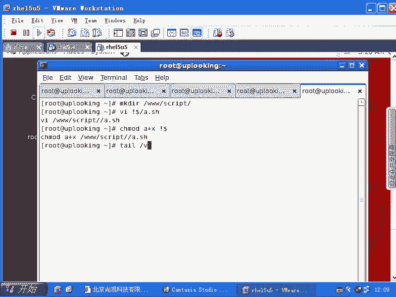

你看只要出现什么呢？AVC啊什么的东西。AVC的话就是SE的这个问题啊。那这时候已经有问题了。这一个。啊。😮，什么写错了。嗯。到。啊，这没关系，你一杠两杠没有关系。就是你两杠的话，他也认为是一杠。啊。

咦怎么半天没反应呢？看一下啊。1。253。0。254吧。嗯嗯嗯我看一眼啊。哎，我这没I没IP啊。是吧。啊。我是这样的啊。出错是不是？他说。不能完成你的请求。我看一眼啊。看到了吧？这就是我想要的结果。

看到了没有？😊，看到了吧？当你访问的时候，他出错是不是他看那边的话，只是说报道，你说没有办法访问这个页面，是不是对为什么没有办法访问？我们的SEalt呃SE超过超过ho，它侦测到了这个底。于是的话呢。

他告诉你，你应该运行什么SE alertt杠L啊，我刚才说杠I是错误的，杠L是不是这个命令。然后呢，我们在这边来看。杠L啊，这边的话大家原谅我啊，就说你再看这个时候你回车。

他告诉你这个错误是什么什么引起的是吧？那么我建议你的话呢。他何方妈妈长篇大大。论述了这么长这么长的时间是吧？他告诉你的话呢，去创建什么什么文件啊，创建什么什么文件，然后呢去里面的内容是怎么怎么样。

当然我这个的话呢就会。呃，我这个的话呢就会非常的。就是非常这个。不是特别标准的，就是我这个错误的话不是特别标准的一个错误。他可能还。就不一定能给你就是直接说说出来，然后就是说直接立竿见影的说出来。

你看他这边的话呢，这个整个的错误是不是有3个是吧？他认为我这样整个的一个操作话呢，涉及到3个AVC的报错。这3个AVC的操报错的话，有三种解决三个步骤要解决。第一个的话呢，说了半天。没见内容没见内容。

它光是一个什么AVC的错误，说什么说denite怎么deite呢？说有一个程序啊，这个就是。有一个程序，然后呢再进行这个目录的访问，就是我们的HDPD这个进程访问3W的目录的时候遭到了什么呢？

遭到了拒绝是吧？为什么遭到拒绝呢？他说你的这个操作啊叫做search操作。search操作的话呢被拒绝了。实际上本质上讲的话，我觉得这个问题是什么呢？就是如果要是你看到这个消息，你看LS杠LD是不是。

然后再加上1个Z是不是3W，这是什么？😊，dfast是不是嗯，所以他我要我要做的话，我就肯定是这样的CHCON。是不是然后加上一个什么呢？加上一个杠大R是不是？然后加上一个什么呢？杠。😊。

T是吧是HDTP是吧，下划线s是不是下方线conent是不是content下方线T，然后加上3W，然后。😊，Yeah。啊。如果我这样做完以下以后，那么其实我第一个报错就应该是解决了是吧？

嗯但是呢我们的SE我们的SEalert，它并没有告诉我说要这样做，是不是？因为我的错误实际上是有三个是吧？我再看第二个错误是什么？第二个错误的话呢，他让我运行这个命令，就是第二行。

第二行的话呢我就这样的。这又破婆妈妈说了一大堆啊，他说这个文件啊，哥们儿这个文件的话呢，你是一个什么？就是说你是HDVD下方向T是吧？想去访问我的default T是不是？这是吃人做梦，是不是？

这是这是肯定是错的啊。是不是他说的很清楚啊？😡，挺赖的，是不是？这种是不允许的。他者说这几个操作啊。哎，这边应该有给会给我一个就是。再重新发。

你看啊他说你需要relaable这个文这个目录或者文件用CHCON是吧？然后呢，具体的话呢，是这个是不是？就以这个。然后呢，我还是这样的re。呃，CHCON是不是，然后呢加上一个什么杠T是不是？呃。

这个时候的话呢，实际上我要给大家看是这样的，你要系统当中找一个例子，找什么例子呢？不是有Y下的3W当中的呃CGI那个吗？是不是？明白吧？你看它的这个类型叫做HDVD是吧？

ss scriptEXECT是不是这是允许就是script运行的，是不是？然后呢，这样的CHCON是不是？然后呢，杠T是不是？然后呢，我再加上一个什么呢？呃，3W当中的。对不对？然后其实还应该加个大R。

是不是大R的话是表示这个目录，其实这个目录下所有的文件全部都设置一下，设置完了是不是？嗯这个的话呢，实际上我是应该做的。然后我其实还应该运行什么呢？就是get SEE BOOL是不是？

是不get SEBOOL，然后加上一个杠A是不是GREP什么呢？HPD对不对？然后呢，再加上一个新呃点星，是不是这边是正则表达式嘛？正的表达式是吧，点星星。点星HTPD是吧，然后呢是EXEC是吧，点星。

啊，正能亮的师看一眼。啊，他现在的话呢就是说呃EXE啊。就是说有关Apartache的执行的这个包ing，是不是就这两项？然后我再去看一下脚本。有关脚本执行的话，允许。没有是吧。这边有个什么呢？

aparache的内嵌脚本是不是内嵌脚本等等？就是我要看这个脚本的话呢，和appartache相关的这些bolling它到底有没有允许是吧？如果他不允许的话，我怎么设定权限都不行。是不是于是的话。

我就把它设定成这样的权限。那我这两步改完了以后的话呢，我再去怎么样，我再去我刚才权限已经改过了，是不是？然后我再去访问。😊，还是不行啊。还是不行的话，我们再来看是什么问题。tail是吧。

wa的log当中的messages是不是我们看啊这边又报错，报错说什么呢？你运行SEalt杠L这个。Yeah呀。好像补报错了呀。这还是那三个吧。啊。😮，这还是那三个吧。刚才实上是应该没有没有更新吧。

那三个错误是不是没有更新？是不是？呃，我我现在的话呢是在给大家的话呢，做一个就是说不是书上的这些练习，明白吧？是你日常当中可以用的练习。所以的话呢会有咱们没有预料到的这种错误出现。好吧。

这个的话呢就是说你要照着书敲两遍，那也也就无所谓了。因为书上肯定都已经可以出现，是不是？所以这个地方的话会遇到一些呃这种问题。这边的话呢已经设置成这样的权限啊，这个目录的话应该也已经是设置好了。呃。

那么我们现在看。我觉得现在SElinux并没有新的报错，是不是没有新的报错？我这样的，我挨le一个。输出重定向到wa下的log当中的message当中去，对不对？呀错了，清掉了是吧，应该追加是不是？

错了啊，清掉了清掉就清掉吧。因为我我可能以前日志我不需要看啊，那我再这样再去刷新。ctrorl加F5再去刷新。刷新完了以后，他，再去tailil啊外下的log当中的messages。啊。

没有东西是不是你说SEm实际上是没有再报错的是吧？那就是我那个脚本写的有问题。你你们那个。您帮我查一下这个脚本啊，这个脚本的话应该应该就是最前面的话，这个脚本应该这样写。就这几部分的话可能是。

因为我现在想把这个页面的话显示出来。我要给大家看一下页面，但是它这个页面的话是怎么样的？是有问题，你们那个呃，我看一下书啊。我忘了。这个脚本的话呢是可以写成一个。

我们的apartache我们的HDB协议的话呢，在呃。就看看。就是头。这是我们那个。头啊。这头的话少了一个东西。好。你们的看。

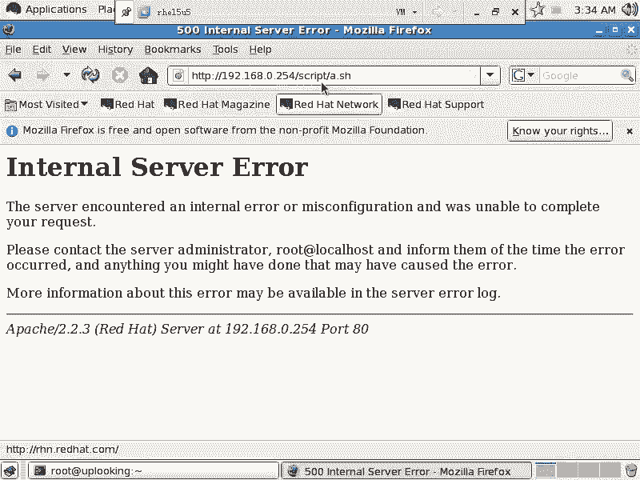

哎。啊。缓存。你用我用elinux的话，应该也没有缓存啊。

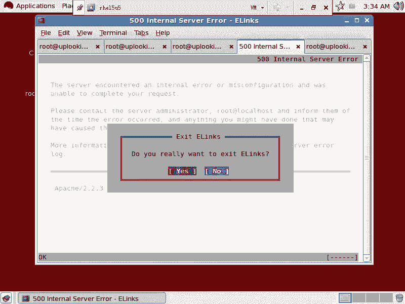

那这个可能还是我的问题。我这边写的是个脚本。我看一眼那个这时候的话调试啊，大家也可以。看一下，我看。没有任何的消息出来，然后呢，没有任何的消息出来。那我们看一眼那个HTPD的这个日志啊。

Arero log。啊。啊，其实其实一直已经访问到了，是不是已经访问到了？我只不过发的这个内容的话是不对的啊。他发的内容是不对的，我还得再改这个文件。其实不是说就这串东西是不对的。上。这样。Yeah。

算了，我全新都超一点。就是刚才我的命令啊，刚才我的命令是不是已经执行了，大家看到阿partty是不是已经在执行它，只不过执行的时候没有给你显示出页面而已是吧？为什么没有显示出来呢？那我也不知道。

我就照着那个咱们这个例子的话来写啊。大家由此的话也可以看到，就是aparache里面怎么样去添加一个hell脚本。就我让我访问我通过aparache页面，然后访问一个shall脚本。对吧这个叫做什么呢？

shall的这个script就是脚本脚本运行的脚本程序，而不是PP那种脚本语言，它跟脚本语言上又是两码事儿。这真是。你郁问啊。第额。Badheader。おっぱい？嗯。他就说我们这个。头的话有问题。

我们这个脚本的头有问题，并不是我们这个程序没有办法使用，而是这个头没有这个头有问题。我哪儿错了呢？啊。😮，哪儿错了呢？哦，这边是不是少个空格啊？CONTENT下好像太。我们看一眼啊。少了一个回车。啊。

少了个回车出来了没有？本来我们troublehootingSE next的是吧，结果traublehooting半天那个script。是吧因为那个script有个什么什么问题呢？

就是那个script的话，它是有个这样的问题。就是它的这个头啊，相当于我要拿到1个HTM的页面是吧？这个HTMM的页面前面必须是什么？必须这样格式的，这是它的那个头。要没有这一行的话呢。

它就不能不能显示。其实我不这样的做也可以，就是我把这行删除掉，我这样的icle是吧？这串值也可以，明白吧？我要搞这张职也可以。只不过下面这些值的话呢，你全部都要挨口，每一行的话都要icleic口ic口。

知道吧？所以的话呢这样呢我们这样写也行啊，这一串东西的话就表示我要把这段的话呢输出出来，是不是我要把这段输出出来，输出到这个HMM的页面当中。那么头是什么呢？叫做content的类型。

就是它的这个内容的类型是。text或者是HTML对吧？那我这里面是不是有HTML的标签啊？比如说我这里面的内容是HTML的对吧？但是刚才的话呢一直少一个回车，少一个回车的话呢。

他认为这串东西啊就是conext的类型是什么呢？text和HTML后面还加了一串那个东西。😊，啊，所以的话少个回车就导致咱们刚才折腾了半天。也就是说这里面大家完全可以看到什么。

我这里面是不是可以去写这个sell脚本是吧？那我如果这样呢，user addsha。可不可以？可不可以？我一旦加入这两行命令以后，然后我通过网络去执行。一执行的话，我系统当中是不是会添加个账号。

这个账号也可以怎么样？也可以去呃就是登录是吧默认情况SS是可以登录。于是的话呢，你会发觉这种脚本它是非常危险，是不是非常危险。所以它的类型是跟普通的那个countent的类型是不一样的。是不是？

刚才咱们看到了这个类型是什么？是这个是counttent的类型是吧？但是我们给那个去加的时候，就是stem什么。😊，这个类型的话就不一样了。对不对？它叫做HTPD呃，ss呃script杠EXECT是不？

也就是说我们要保证这个目录。还有这个。还有这个文件都有意的，我们已经设置过这个，它跟其他的直接访问的页面是不同的，是不是？所以的话呢这个就是比较特殊的一种什么呢这种设置了。

这个的话呢可能就是很多人没有办法正常执行你的脚本的原因。他一看没有办法执行SE能一停就好了。是不是？但是我刚才的话是给大家演示什么呢？就是当你去check onfi，是不是？

然后呢叫做message bus，是不是啊，然后呢，check onfi SE trouble。😊，shoot are是不是这两个打开了以后，然后再去怎么样呢？再去service什么什么什。

这样把它们打开是吧？star打开，打开了以后，当你出现这种问题的时候，那么你去tail是吧？😊，tail watch的log当中的message，是不是？然后呢，你看到SEaler。

杠L是不是杠L后面加上一串什么数字，是不是？是不是这串数字一回车，他就给你提供帮助，是不是？那这套东西的话呢，这个体系的话，大家一定要会你们在考HCE考试的时候，万一哪个服务，因为SE启动不起来。

你启动失败啊，那么你一定要怎么样，你一定要去用这个命令看一眼HCE考试每一个命令，每一个服务搭起来以后，你都要反复的去检查一下，就是你真正的话呢，通过比方说你要搭配服务器。

你就打开自己的什么IE浏览器是吧，或者SSC到一个公共的机器上去，用那台机器用一定词来访问你这个机器，你看能不能成。如果不成或者这个服务没有打开看日志，看日志当中看到是AVC错误啊，就AVC什么东西。

那么上面的话呢就肯定是SE的问题。这个时候的话呢，你用SE alert，然后呢可以查看这个到底该怎么做。明白了没有？所以你要保证每一个服务正正常运行。如果因为SE的问题，然后导致服务不能运行。

那么你就要跟SE alertSE trouble shoot来解决这个问题，明白吧？它给你提供很全面的这种帮助啊。还有一点大家一定要注意，就是每一个服务在运行完以后。

一定要反复的自己去确认一下这个服务到底正常运行没有。如果你没有确定。你就把它默认成什么，没有正常执行。因为你能出错的，允许你出错的机会太少。100个问题是吧？那么100分你要达到80分才记得。呃。

你得个什么。五六十分六七十分是吧，就不行。所以的话SE那次的通过率是低的啊，就是较低的。他肯定跟你什么ABC那种答题方式要什么要低一些。什么原因呢？就是很多人做完题以后，他不他不自己的话呢，再去确认。

你一定要确认你这个服务确确实实，按照他的要求，123点全部都搭好，明白了吧？好，这就是刚才我们给大家说的，那么用呃CHCON，然后呢是呃就是还有这SEalert等等这套体系。大家都会了没有？会了没有？

我们要记住的话呢，是。还有的话呢，就是刚才那个文件啊也有可能是什么呢？va下的log当中的什么audit。Audit。Audit。log也有可能这个文件啊这两个文件都有可能。

audit的话呢是一个级别非常高的审核程序，审计程序。他的话呢记录的信息是非常多的。你可以配置audit服务配置到什么程度？比方说你现在在机器里面是吧？如果要是你现在正在运行这个呃每个命令。

然后你通过一个histtory杠C，把自己的命令历史全部都什么清掉。你去掉了以后的话呢。auudit还可以给你记录下来。audice记录你每一个执行的命令，记录你每一次操作，记录你所有的这种审计。

它都可以记录。所以他也记录什么呢？SEX的东西。如果audit这个进程的话，它运行，它也会记录在这个日志里面。但是我们刚才提到一点，就是说S alertt它可以提供这种就是说这种帮助。

但是帮助的结果是什么呢？帮助结果可能是什么？导致你不安全，然后让你运行个命令，然后它就可以运行了，就是这个服务就可以运行了。但是可能是不安全的，明白吗？你要想安全的话。

你要真正去了解这个整个SE0的机理。但是呢这边是提供给你一个什么可以正常运行下去的一个命令啊，就是S alertt听楚了吗？我们再看一眼啊。好，这是SElinux的内容SEux内容。啊。

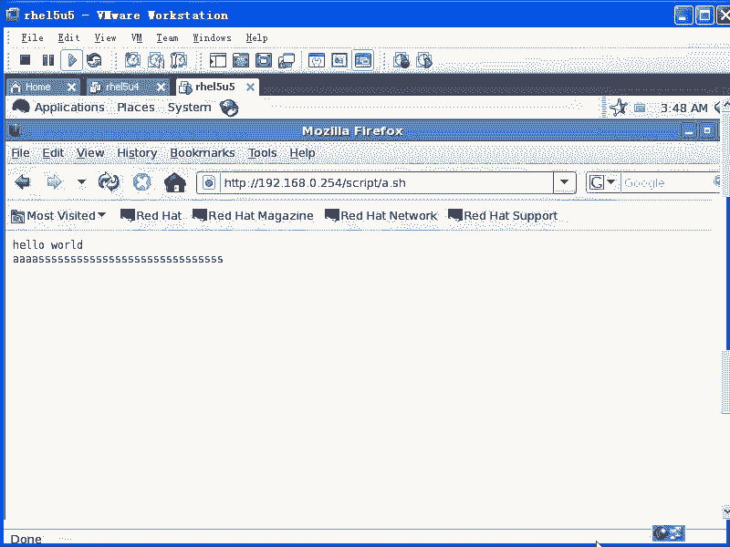