# 尚观Linux视频教程RHCE精品课程：P72：RH253-ULE116-4-1-selinux-chcon-restorecon-sealert 🔐


在本节课中，我们将要学习SELinux的核心概念、基本操作以及故障排查方法。SELinux是Linux系统中一个强大的安全增强模块，它通过强制访问控制（MAC）机制，为系统提供了更精细、更安全的权限管理方式。我们将从理解其基本架构开始，逐步学习如何查看、修改安全上下文，以及如何利用工具解决由SELinux引起的常见问题。

## SELinux概述：从DAC到MAC 🔄

上一节我们介绍了传统的Linux文件权限控制（DAC）。本节中，我们来看看SELinux如何实现更安全的强制访问控制（MAC）。

SELinux（Security-Enhanced Linux）是由美国国家安全局（NSA）设计的一个安全框架。它采用矩阵式的访问控制策略，明确规定哪些操作被允许，哪些被拒绝。

传统的DAC（自主访问控制）模型默认允许所有操作，除非明确拒绝。而MAC（强制访问控制）模型则相反，默认拒绝所有操作，除非策略明确允许。这是系统安全发展的趋势，能够更有效地防范未知漏洞和越权行为。

在DAC模型中，进程通过其用户ID（UID）和组ID（GID）来匹配文件的属主（U）、属组（G）和其他人（O）权限。例如，一个以`apache`用户身份运行的Web服务器进程，对系统中大多数文件而言都属于“其他人”，这可能拥有过多或过少的权限，不利于精细控制。

SELinux引入了**安全上下文（Security Context）**的概念。系统中的每个对象（如文件、目录、端口、进程）都被赋予一个唯一的上下文标签。访问控制决策基于**源上下文**（如进程）和**目标上下文**（如文件）是否在策略矩阵中被允许，而不仅仅是传统的用户/组权限。

你可以使用 `ls -Z` 命令查看文件的安全上下文，使用 `ps -Z` 命令查看进程的安全上下文。

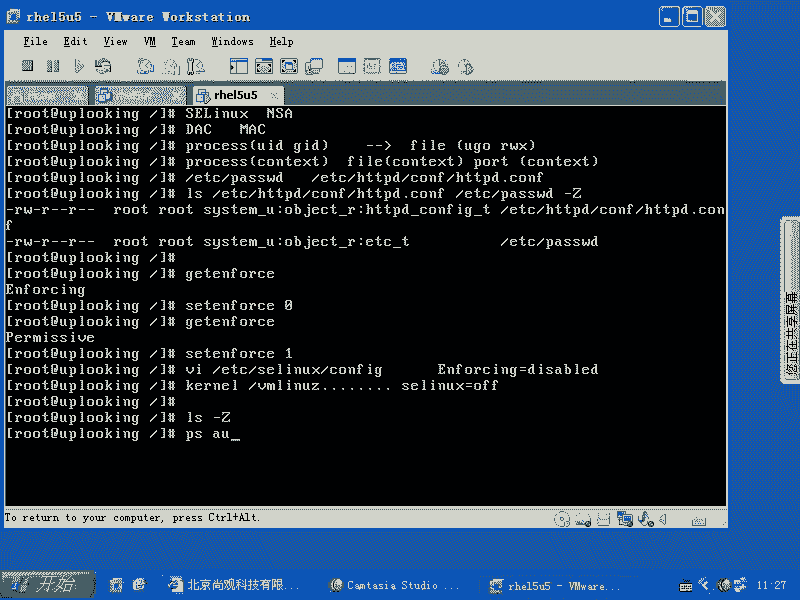

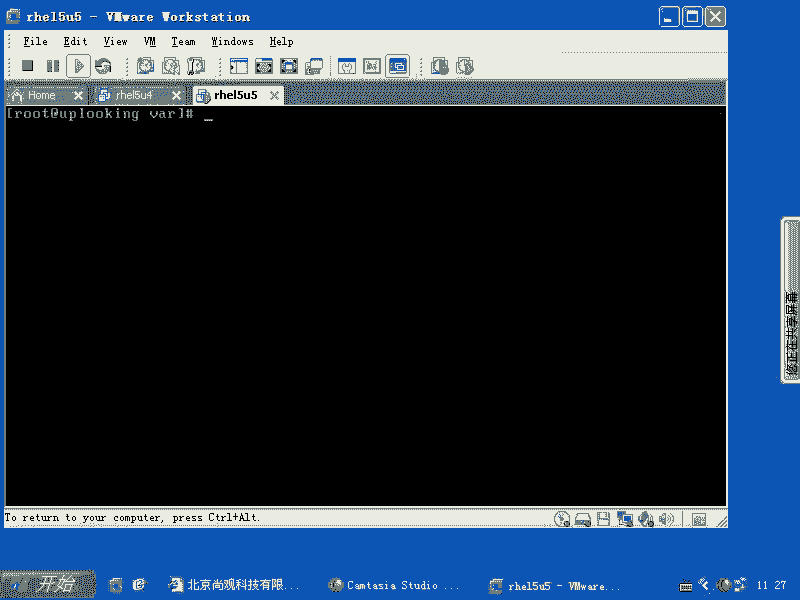

```bash
ls -Z /etc/passwd
ps -auxZ | grep httpd
```

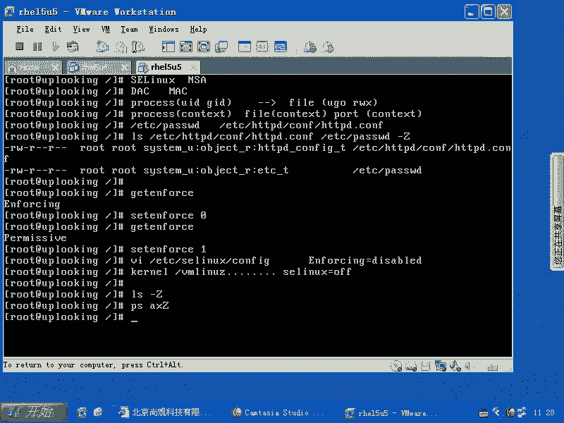

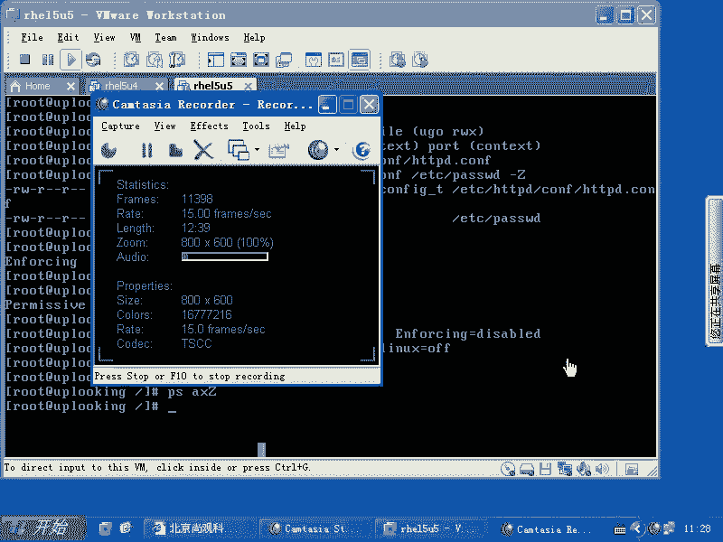

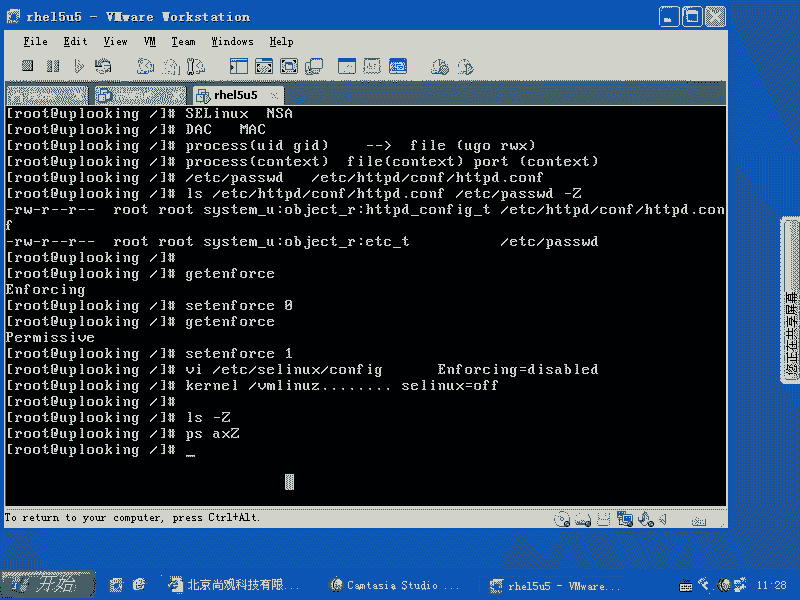

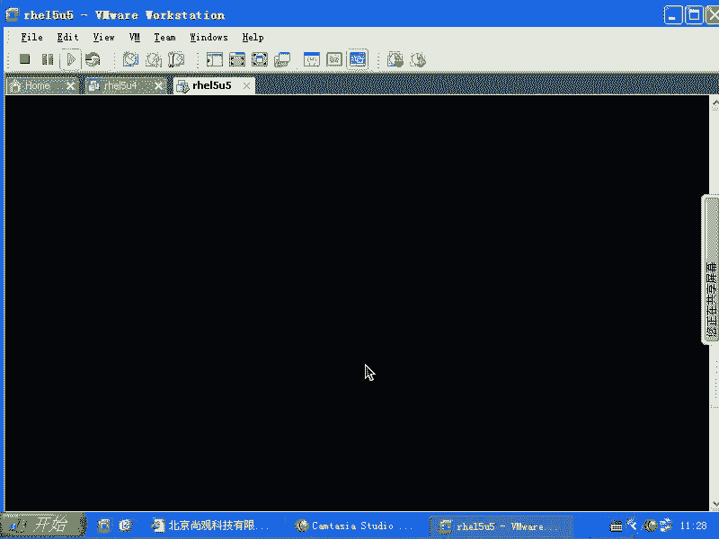

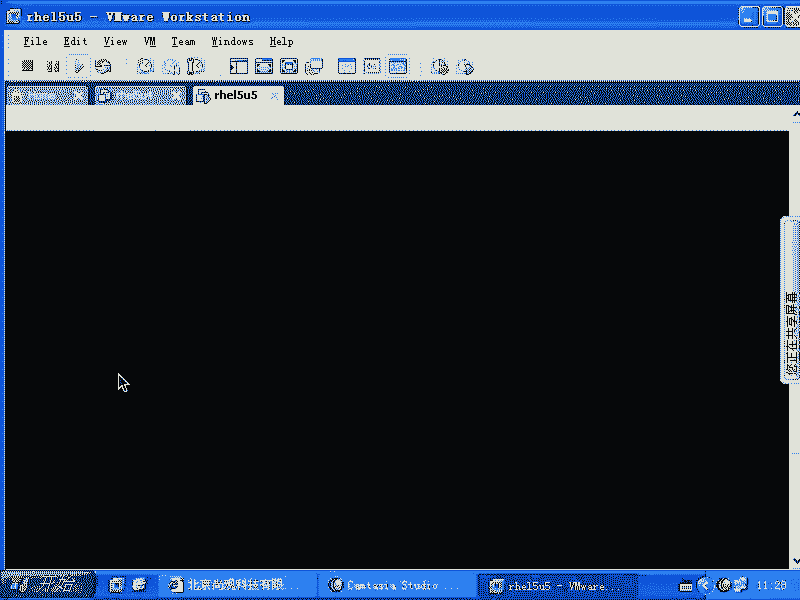

比较`/etc/passwd`和`/etc/httpd/conf/httpd.conf`文件的上下文，你会发现它们属于不同的类型，从而实现了更精细的访问控制。

## SELinux基本状态管理 ⚙️

我们已经知道如何查看SELinux的状态。本节中，我们来学习如何更改它的运行模式。

SELinux有三种主要的运行模式：
*   **Enforcing**：强制模式。策略规则被强制执行，违规操作将被阻止并记录。
*   **Permissive**：宽容模式。策略规则不被强制执行，违规操作不会被阻止，但会被记录到日志中。常用于审计和调试。
*   **Disabled**：关闭模式。SELinux完全被禁用。

使用 `getenforce` 命令查看当前模式，使用 `setenforce` 命令在 **Enforcing** 和 **Permissive** 之间临时切换（重启后失效）。

```bash
getenforce
setenforce 0 # 临时切换到Permissive模式
setenforce 1 # 临时切换回Enforcing模式
```

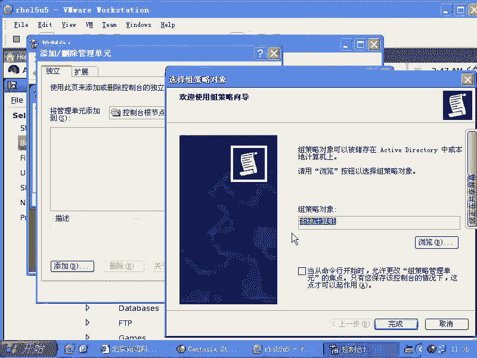

若要永久修改SELinux状态，需要编辑配置文件 `/etc/selinux/config`，将 `SELINUX=` 后的值改为 `enforcing`、`permissive` 或 `disabled`，然后重启系统生效。

**注意**：在RHCE考试中，除非题目明确要求，否则不应将SELinux设置为`disabled`。通常使用`permissive`模式进行调试，或保持`enforcing`模式并通过策略调整解决问题。

## SELinux策略与布尔值 🧩

SELinux的整个策略集是一个庞大的矩阵。本节中，我们来看看如何通过布尔值（Boolean）来灵活调整这个策略集的子集。

为了方便管理，SELinux将策略划分为许多功能模块，每个模块的开启或关闭状态由一个布尔值控制。布尔值就像开关，设置为 `on` (1) 表示启用该组策略规则，设置为 `off` (0) 表示禁用。

以下是管理布尔值的相关命令：
*   `getsebool -a`：列出所有布尔值及其当前状态。
*   `setsebool`：设置布尔值。使用 `-P` 参数使更改永久生效（写入配置文件）。

例如，如果你想允许Apache HTTP服务器执行CGI脚本，可能需要开启相关的布尔值。

```bash
# 查找与httpd和cgi相关的布尔值
getsebool -a | grep httpd.*cgi
# 假设找到的布尔值名为 `httpd_enable_cgi`
# 临时开启
setsebool httpd_enable_cgi on
# 永久开启
setsebool -P httpd_enable_cgi on
```

通过图形化工具 `system-config-selinux` 也可以直观地管理布尔值。

## 管理安全上下文：chcon与restorecon 🏷️

即使布尔值设置正确，有时访问仍会被拒绝，这可能是因为文件或目录的安全上下文不正确。本节中，我们来学习如何手动修复和批量恢复安全上下文。

安全上下文通常包含三部分：`user:role:type`。对于大多数访问控制，最关键的是 **type**（类型）字段。

**`chcon` 命令**用于手动更改文件对象的安全上下文。
常用选项：
*   `-t`：设置类型（type）字段。
*   `-R`：递归处理目录下的所有文件。
*   `--reference=参考文件`：将目标文件的安全上下文设置为与参考文件相同。

例如，你新建了一个目录 `/var/www/html/upload` 用于Apache上传文件，但它的上下文可能不正确，导致Apache进程无法写入。你可以参照Apache标准目录的上下文进行修改。

```bash
# 查看Apache标准目录的上下文
ls -Zd /var/www/html
# 假设输出为 `system_u:object_r:httpd_sys_content_t`
# 修改upload目录的上下文
chcon -R -t httpd_sys_content_t /var/www/html/upload
# 或者使用--reference方式
chcon -R --reference=/var/www/html /var/www/html/upload
```

**`restorecon` 命令**用于将文件对象的安全上下文恢复为系统默认策略中定义的值。当你从一台未启用SELinux的机器复制大量文件，或系统长时间禁用SELinux后重新启用时，这个命令非常有用。

```bash
# 恢复单个文件/目录的默认上下文
restorecon -v /var/www/html/upload
# 递归恢复整个目录树的默认上下文
restorecon -Rv /var/www/html/
```

系统默认的上下文规则定义在 `/etc/selinux/targeted/contexts/files/` 下的文件中。你可以使用 `semanage fcontext` 命令添加自定义的默认上下文规则。

```bash
# 添加一条规则：/webcontent目录及其下所有内容的默认类型为httpd_sys_content_t
semanage fcontext -a -t httpd_sys_content_t "/webcontent(/.*)?"
# 添加规则后，需要使用restorecon命令应用新规则
restorecon -Rv /webcontent
```

## SELinux故障排查：sealert与日志分析 🔍

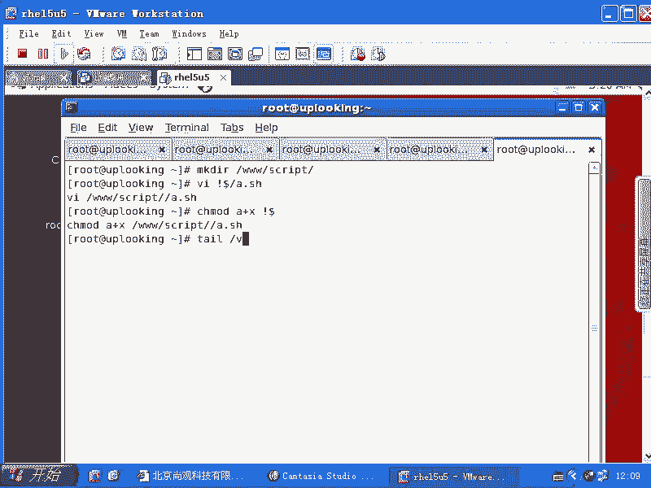

当服务因SELinux问题无法启动或运行时，如何进行有效排查？本节中，我们将学习使用`sealert`工具和查看日志来诊断和解决问题。

首先，确保以下服务已启用并运行，它们是SELinux故障排查体系的一部分：
*   `auditd`：审计服务，记录包括SELinux拒绝信息在内的详细系统事件。
*   `setroubleshoot`：将`auditd`日志中的SELinux拒绝信息转换为更易读的建议信息。

```bash
# 设置开机自启并立即启动
systemctl enable auditd --now
systemctl enable setroubleshoot --now
```

当操作被SELinux拒绝时，相关信息会被记录。主要查看两个日志文件：
*   `/var/log/audit/audit.log`：`auditd`服务的详细审计日志。
*   `/var/log/messages`：系统通用日志，`setroubleshoot`会将摘要和建议写入此处。

在`/var/log/messages`中，如果看到包含“`AVC`”（Access Vector Cache）和“`denied`”关键词的条目，并且结尾提示类似“`run sealert -l xxxxxxxx`”的信息，就表明是SELinux拒绝问题。

直接运行提示的 `sealert -l` 命令，它会提供详细的分析和修复建议。

```bash
# 根据messages日志中的提示执行
sealert -l 12345678-90ab-cdef-1234-567890abcdef
```

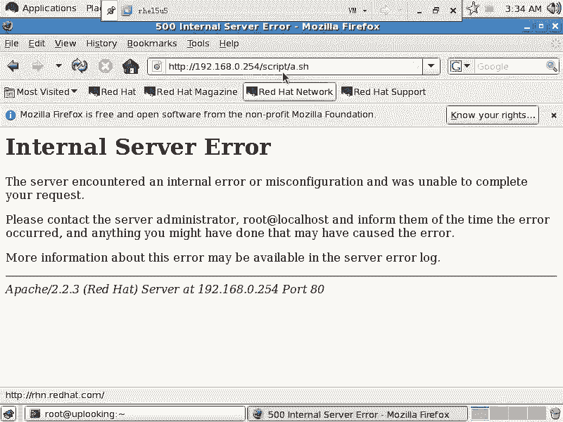

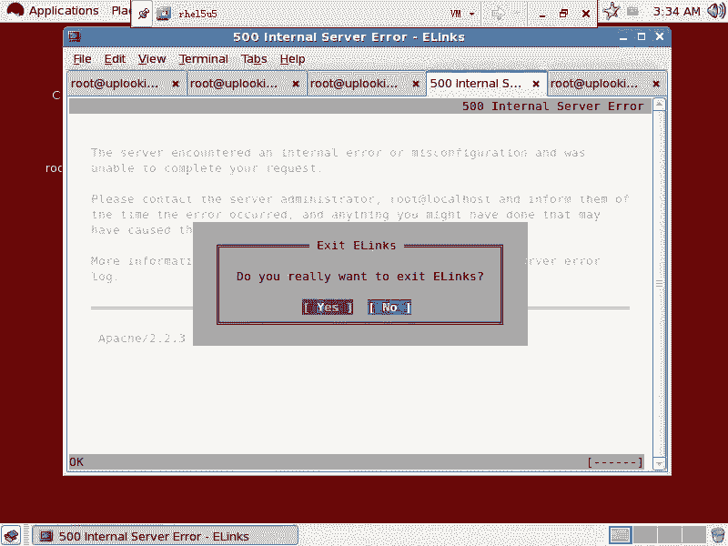

`sealert` 的输出通常会：
1.  描述被拒绝的操作（哪个进程、试图访问哪个资源、进行什么操作）。
2.  分析可能的原因。
3.  **提供修复建议**，例如运行哪个`setsebool`命令开启布尔值，或运行哪个`chcon`命令修改上下文。

**重要提示**：在RHCE考试中，搭建任何服务后，务必亲自测试其功能是否正常。如果失败，应第一时间检查日志（`/var/log/messages`和`/var/log/audit/audit.log`）。若发现SELinux相关的AVC拒绝信息，应使用`sealert`工具获取解决方案并实施。确保每个服务都按题目要求正常运行。

## 总结 📚

本节课中我们一起学习了SELinux的核心机制与实用管理技巧。

我们首先了解了SELinux通过**强制访问控制（MAC）**和**安全上下文（Security Context）** 提供比传统DAC更精细的安全控制。我们学习了使用`getenforce`/`setenforce`管理运行模式，并通过编辑`/etc/selinux/config`文件进行永久配置。

接着，我们掌握了通过**布尔值（Boolean）** 使用`getsebool`和`setsebool`命令来灵活调整策略模块。对于文件级别的安全上下文问题，我们学会了使用`chcon`命令进行手动修改，以及使用`restorecon`命令恢复为系统默认值。

最后，我们构建了完整的SELinux故障排查思路：启用`auditd`和`setroubleshoot`服务，通过查看`/var/log/messages`和`/var/log/audit/audit.log`日志定位问题，并最终利用`sealert`工具获取清晰易懂的修复建议，从而高效解决因SELinux策略导致的各类服务访问问题。

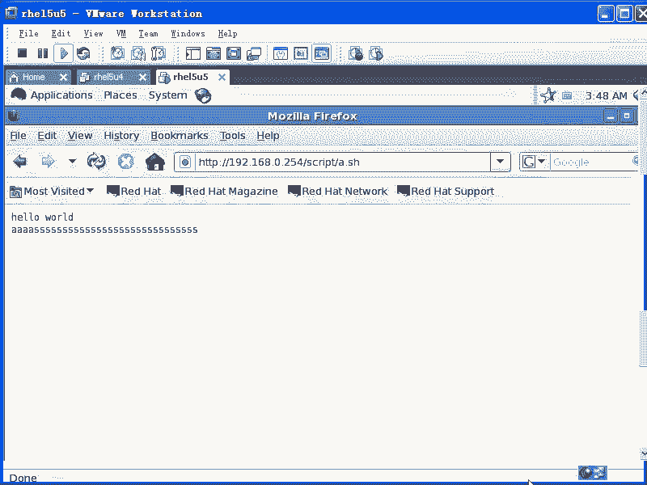

掌握这些知识和技能，你就能在保持系统安全性的前提下，从容应对和解决SELinux带来的配置挑战。