# 尚观Linux视频教程RHCE 精品课程 - P73：RH253-ULE116-5-1-iptables-filter - 爱笑的程序狗 - BV1ax411o7VD

好。我们的话呢接下来的话呢有个大步头的东西要隆重推出了，是不是？这个东西就IP tables。我们原来学到pm啊，那个TCPrappper它都是在IP tables之后。

是不是IP tables它是在整个的电脑最前端。你如果要是想去防范IP tables被攻击。那你只有在前面的话，再做一个什么硬件防火墙，但是数据包只要访问到你的机器上。你想一下。

是不是先是以太网接收到数据包，是不是以太网接收到数据包以后，往上层去传，就是我们的IP层IP层这个地方就开始内嵌什么TCP。😊，就是啊我们的IP tables了。

那么IP tables它的这个调用的话呢，整个密密麻麻感染了什么？整个TCPIP协议站处理的各个环节。清楚吧？所以他我们在IPtables这个地方。你要知道它是在TCPrappper之前生效。

而TCPrappper之前呃，TCPrappper是在pm之前生效，明白吧？这几层关系清楚了吧？也就是说我在TCPrappper这个地方拒绝了SIH的这边的访问。

那么我的pm那个地方再允许再拒绝都没有效了，清楚了吧？呃，清楚吧？如果在IP tables这个地方就拒绝了，人家对22端口的访问，那你的TCPrappper连影都没有见到，还什么拒绝允许都没关系了。

是吧？所以的话我们的IP tables实质上它是在什么呢？内核当中取消，也就是数据包还没有让我们的应用程序看到呢。😊，它就起下了。而我们的应用程序看到了这个数据包了以后。

把它组合在一起了以后才会去调用什么？😡，TCPrappper和什么和我们的那个pa，对不对？它才会这样就清楚了吗？清楚了是不是好。😊，我们来看一眼啊我们来看一眼。现在的话呢我要去使用啊。

我们来看Iy tablesIy tables的生效的模块有哪些啊？我们来看一下。

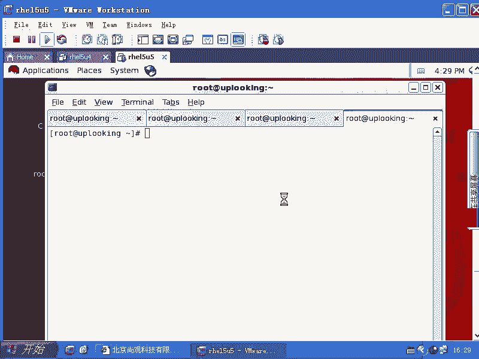

IP tables。

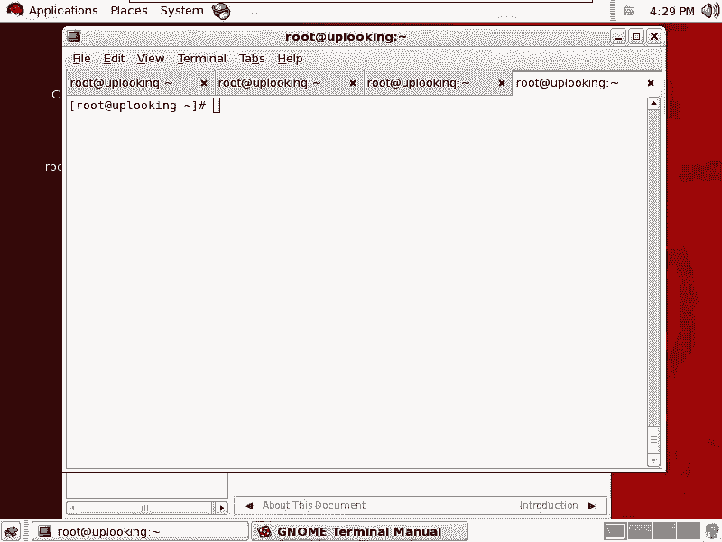

IP tables这个命令直接一回车，你能看到IP tables的话呢，该怎么样去寻求帮助，是不是嗯能看到。那一般来说的话，IP tables它的规则的话呢特别多，因为它是一个大骨头的程序。

很多人的话呢学着学着就绝望了。所以学绝望了。那我给大家看呢非常快的把，它的体系结构的话呢，跟大家说一下。首先的话IP tables它大致的这个规则是这样的。首先你要用杠T来指定一个table啊。

就指定一个表。这个表的话，默认是什么呢？是我们的filter是吧？filter这个地方的话，如果让你不填的话，那它就是默认就是filter。也有可能是NAT。也有可能是mango。

NAT或者mango它用的机会的话呢要比filter要少。因为你IP table一提它话好像是防火墙是吧？防火墙不就是过滤吗？是不是就是过滤。那么我们的这个呃NAT的话是地址转换，就是让大家共享上网。

或者是呃为什么呢？为我们后端的某一个机器做什么呢？做这个呃把数把数据包的话呢，通过我是吧？过滤完以后的话，传送到我后端来用的，是不是？所以的话呢NAT要么是大家一块从内网往出走，利用要么就是什么呢？

让外网的话呢，把数据包传到穿过你，然后呢反问到内网某一台机上去，是不是这个时候的话会用。所以它一般情况下我们都用的是什么filter。而mango的话呢，用的机会是最少的。mango的话。

我们在做策略路由的时候会用。它是给那个数据包屁股后面打标记啊，就相当于有100头猪，就是100个数据包要过去。我给40台呃，40头猪后面的话呢盖了个戳什么？A给另外的460台盖了戳是什么呢？B。

那么所有屁股上盖着A的标记的数据包都通过什么呢？这个猪圈走，是不是就通过这个往关走，盖着B标记的，通过什么呢？那个往关走，明白吧？这样的话呢，它就会进行策略路由啊，这是mango的一个功能。当然了。

mango还有其他的这种功能。但是一般来说的话，我们用的IPI tables filter最多，明白了吧？大致给大家介绍了三个table，是不是？那么我们如果要是把这个地方去掉呢。

杠T filterter去掉的话会怎么样？那就是对filter进行操作，是不是？所以我们现在直接从filter来啊。😊，杠A去添加。杠I。插入。杠D删除。杠F。清楚杠L显示。对不对？

那现在我们来看啊它的规则的话呢，我们一般来提一下的话，就是I tables比方说杠A啊，然后呢input的规则，就是在input链这边的话呢，我们有一个来源为192168。0。

比方说呃2这样的1个IP那么它是什么协议呢？TCP协议。然后呢，杠杠。杠杠deport是22端口，也就是说从0。2来访问我的什么22端口的对不对？然后我就怎么样呢？杠G。照是不是就把它。就是扔掉了。

把这个书包已经扔掉了。那么你这个时候的话呢，用IP tables。杠哎呀，然后呢来显示一下，你看到刚才的话呃，是刚才那条啊。这刚才你讲。那这个的话呢，是我刚才就是上面这台0。2这台机器，对不对？是0。

2是吧？啊。😮，是0。2。还没显示全，是不是？怎么回事？loal hostst呢？我有个IP是lologo host的吗？嗯。😮，好像0。20。3，他肯定就访问不到我了，是不是？是不是这样？

一样啊是不是一样的？我想清掉的时候，IP tables。干大是把就清掉了。清天完以后你再去看。这就没有了。大家看来看去的话，好像有点奇怪，就这边的话怎么有个input，是不是怎么有个forward是吧。

什么output，是不是？那你能看出这个字面意思，根据字面意思来猜出来吗？input是干什么？进入进入是吧，forward呢？😡，转发数据包什么叫转发数据包？那那一。我们楼底下的话有个保安是吧？然后呢。

你买了盒香烟。拿给他是不是？那保安的话呢。拿到以后。他看到香烟上to谁呢？就是给他自己，那这叫做input，明白吧？这时候input链生效。但是呢你上面给他一盒香烟，这个上面说请转给四楼的是吧呃。

谁谁谁是不是这个时候的话呢，他就要帮你把这个数包转发，是不是要让他这个在内核当中有这个机制是吧？这个机制叫什么呢？IP forward的机制，还记不得那个内核参数啊。

catPOC下的ss当中的n当中的IPV4当中的IP下划线for了，记不记得？这个如果是零，他就不会给你转啊，是吧？你把一盒香烟给我们的这个呃保安说，请你帮我拿给4楼上的人是吧？

他话拿到香烟啪往地里一扔，说什么，这不是给我的是吧，我才不给你转。😊，明白吧？只有当你把这个值设置成一了以后，它才会把这个数据包怎么样进行转发，也就是给你添加了这个功能。清楚了没有？

就是forward的功能。而forward功能的话呢，它和input功能是任选其一的，一定要记住啊，我以前的话呢犯了多长时间的错误，就是这样。我说这个forward应该是什么？你先input嘛。

是不是input这条链先生效是不是？然后在forward的时候再生效是吧？两道关，对不对？其实不是如果你是forward的话，它的input链就根本就不生效，也就是这个input这个规则。

你比方说你拒绝的所有人是吧？但是呢你这个数据包是发给给它，但是是让它转发的时候，那你的input链根本就不生效，也是input链和forward链是任选其一。😊，清楚没有？😡，啊。

要么是input链生效，要么in，要么是forward链生效。所以这两条链的话呢是一个生效，另一另外一个肯定不生效。你的数据包是给别人的，发过去以后是给第三者的那forward生效。

你发给他以后就是给他的那就input链生效，清楚了吗？😊，清楚以后，那么当你的这个数据包要进行转发的时候，那你最后还是要有一个什么output的过程。也就是你去发作数据包的过程。这时候out链会生效。

听楚了吧？output链会生效，也就是你发给别人啊，这个时候它就生效。所以这边的话我给大家考虑其呃就是说清楚了。那么我们现在的话呢来看一下啊，真正怎么用。如果要是你是做防火墙的话啊。

你是你这个你这个IP table是是给自己的机器上做防火墙的话，你设置什么的机会是最多的，设置什么链的机会是最多，是input forward还是out？一求方问。你的机器啊是给你自己这台。

就是我是个外部服务器是吧？我自己配置外部服务器上这个IP tables。😡，我用input in forward还是用out。那就是input是吧？那么当你这个机器是一个。

放在这个服务器之外的硬件防火墙，那你用input还是用forward还是用out，可能用forward用的是最多的，是不是？所以这就是他们的区别，明白了吧？嗯也就是说这个数标发给你，你不留着。

然后给后面转发的时候，forward列要定义的非常多。如果你IP forward要压根就没打开那个参数压根就是零，是不是？那你根本就不转发数标。

那肯定是input了啊那我现在的话呢用最多的input来试试看I tables杠A啊杠A，然后呢，input，然后呢，从来自于1918。0。2这个IP的就是怎么样的？杠Gd掉。照见了是不是？然后呢。

我再去添加一个啊，那么我这边的话呢是accept。也就是说，来自sources啊杠S来自于192168。0。2这个IP的话呢，我又允许它。那么现在请问大家谁生效？谁生肖下面下面的生像。

上面的生效下面的生效。猜猜看哈，哎，你们要不要打赌，先先把筹筹码放在这边啊。😊，看。你要知道啊这条规则，这些规则的话呢是有先后顺序的，谁排在前面谁生效。知道吧？所以这边的话我是想给大家讲什么呢？

杠A参数杠A参数，你看我是先执行drop是不是drop的话呢，它跟下面这个的话呢是什么？是呃是一个呃就是jo跟accept是一个对应对立的关系是吧？一个是拒绝，一个是允许是不是？

那我是先去d是不是jo先放在第一第一排啊，然后又什么呢？accept，那这样的话呢，就是accept放到第二排。那么drop已经先生效了，是不是？所以的话你自然就不能什么accept。

因为它是按照先后顺序来的嘛，是不是？所以的话呢，这里面就体现出什么呢？我们用杠I和杠A的作用，杠I的话是什么样的？😊。

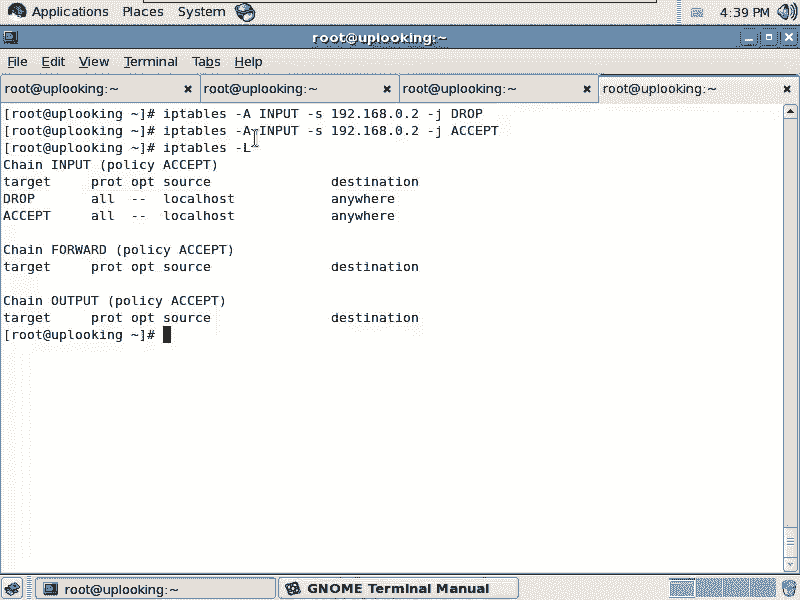

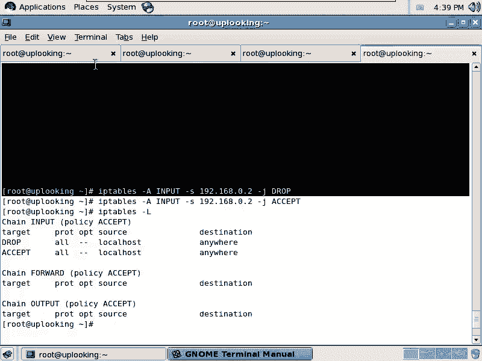

插入，也就是杠I后面什么都不贴啊，你当然可以去添加什么呢？呃，input2就是插入到input链的第二个位置。明道吧。你这样的话呢这样一回车，那么这条规则input2就是第二个位置，就是说我d这边是吧。

第二个位置是不是又加一个acceptac啊，那就是一个d在上面，两个accept在下面，对不对？那我们看一下啊。是不是这样的？那如果要是我什么都不贴啊，我就直接什么呢？input把二去掉。

这样的话呢就是默认插到第一个位置。啊，我这样一回车。那么现在大家再来看的话是谁生效，是accept升效还是照生效？ac accept。清楚了吧，这就是调节位置的啊调节位置的。😡，明白了吗？删除。啊。

删除，那就是大地，是不是？那如果要是你想删除这条规则的话，你就要把这条规则的话呢呃写出来。如果要是我想删除第第三条规则，那么就是什么呢？input这个链的什么第三是不是？然后呢。

我们这边的话呢是一个什么大D是吧？我把第三条input的规则的话删除掉，就这样。当然了，你可以怎么样呢？你可以详细的来描述一下这个数据包。比方说你想把什么呢？把这个在input店里面删除这样一条规则。

这个时候它就开始匹配了。匹配这个的第一条规则就会被删除掉。明白吧？那现在的话我这样的ip table杠L，然后这样的话呢，我是有一个accept，有个jo，还有个accept，是不是？

那我如果要是想删除的时候，谁会第一个删除呢？谁会被删除？看一眼啊。是不是第一条匹配这个规则的被删除了？因为匹配这个规则都有两条嘛，第一条和第三条是吧？但是我这样的一回撤以后，它实际上的话第一条被删除了。

也就匹配这条规则的第一条被删除。是不是这样的？清楚了没有？清楚了以后，我们看一下啊，刚才学的什么东西，一个是is是吧？杠A是不是杠A是吧？然后我们就默认添加的时候的话呢，它是会这样的去呃自动排序。

那如果要是你是杠I的话呢，它就是插入到某个位置。如果要是你现在的话呢，没有什么都没有输，没有输入，插到哪个第几个位置，它就插入到什么呢？第一个位置是吧？那么删除的话呢，就是杠D，它会匹配后面的规则。

匹配的第一条规则就被删除掉了。是不是？😊，O这几个参数搞清楚了吗？input链啊，我以前的话我就不明白，我总是看人家说是什么chances是吧？CHAINS是吧？这是练是吧？那么有三个链，一个是什么呢？

input链，一个是foward链，还有一个什么output链，你别把它这个链的话呢，就当成练啊，就是链练个练。你就把它当成什么时候，是不是这样的话就好了。input的时候。怎么怎么样，有几条规则。

谁排在前面谁生效？forward的时候有几条规则，谁排在前面谁生效，是不是output的时候，明白了没有？这种本质你就搞清楚了，你别去拿着它的名字啊。

这个练这个练我反正现在说练和说那个当什么什么时候我都混在一起，我也不管了，是不是？所以但是你们的话呢看那个书啊，洋洋洒洒说input练output练是吧？特别没意思啊。

就是说你你搞不清楚它这个练到底是什么意义，因为我们现实当中没有这种练的这种称呼嘛，对不对？所以你就当什么什么时候就好了。😊，现在的话我们又有个大问题。何年何月我们这个IP tables才能正常工作呢？

你这个写的话，写到猴年马月去，你要写多少条规则，是不是？所以默认情况下，我们能不能设定一条规则，就是默认让IP tables这个input就是拒绝的啊，我要把它全部都在首先我要添加一条什么呢？啊。

out从所有地方来的，怎么样再去什么全部都jo掉是吧？然后再一条条去添加，这样太麻烦了。所以的话我们有一个默认的规则是什么IP tables杠大P啊，input的时候是怎么的呢？jo。这条规则一写。

这条规则一写。就意味着是没有你的允许，任何数据包全部都是会被拒绝的。是不是所有的数据包都拒绝。这样呢你写完了以后，那么你不管是你发送出去的数据包还是怎么样的数据包，反正总是被拒绝啊，总是被拒绝。

除非是你添加一条什么accept规则，然后让他们一个一个的话呢允许进来。是不是？这个大P参数清楚了没有？值得注意的是，大F清除不了大屏。你看。我这边appittable杠大F清除掉了规则。

这里面是没有任何规则的，是不是？但是呢我现在的这个默认的规则是什么？d就意味着没有任何人的话呢，可以给我发送数据包啊，就是我我收不到我收不到input这个数据包，我全部都怎么样丢掉了。会不会啊？

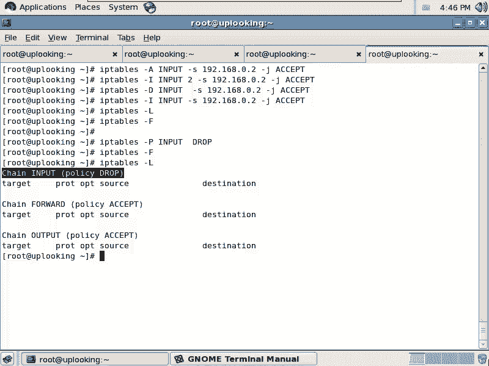

有没有问题？

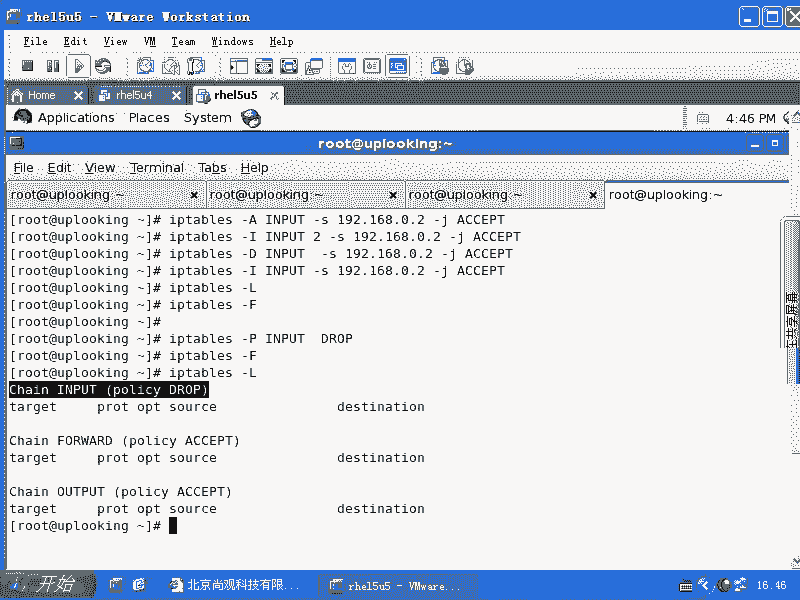

仔细琢磨一下，清楚了吗？

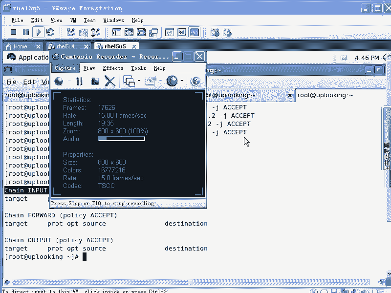

清楚了没有清楚。好，我们的话呢继续来看IP tables在前面的杠小T参数，我们说是table是吧？后面的话呢大A或者大I或者是大D是不是是都是针对某一个链的某一条规则进行操作。

是不是我们这个大A大I大D大L大F大P全部都什么给大家顺过一遍。如果你还不清楚的话呢，自己练两遍就清楚了，是不是练两遍清楚了。那么啊。慢点说。啊，肉。都不清楚。啊，看可以看慢帮慢帮助啊。

我以为你让我慢点说。好。我们常见的用法，刚我看刚才这个列表当中还少一个这个大地什么inlude的第三条规则要删除掉是吧？这样也可以写。这边的话呢就是我的一个列表。

就是说iptables最前面对练的这个操作是吧？那么这几个操数是干什么用的，我们再来看。接下来的话呢，我要呃接下来往下讲，那我们的IP tables是吧？杠大A我们清楚了。

这个input output也清楚了，是不是？然后呢，接下来的话呢，这一段应该放什么呢？应该放对数据包的描述。也就你对什么样的数据包。对，什么样的时候，这个数据包的话描述该有哪些呢？首先的话呢。

大家知道有杠PTCP或者什么UDP是不是或者ICMP协议，是不是还会有其他的学习，比方说。呃。能常见的就是三种协议啊，IPC4里面呢常见的就是三种协议。那当然了还会有其他协议。比方说呃。

ARP是不是但是他就不支持了那tables这不支持了，有ARP tables。有ARP特荐。那么这些协议的话呢，我们说这个地方杠P的话，你能指定三种协议。比方说我这边的话呢，就是TCP是吧？TCP协议。

如果要是TCP协议，一旦指定了以后，你才能加上什么呢？杠杠deport。啊，或者杠杠什么Sport，就是源端口和什么目标端口，目标端口就是Dport是吧？源端口就是什么Sport。

当然你还可以指定什么呢？杠S来源为什么什么IP地址，比方说1918。0。呃点0。0是吧？杠24，是不是？然后呢，杠。D目标地址是，比如说1918。0。254，我有2个IP。

那么我想让他访问我的这个IP的时候，就怎么怎么样啊，这是杠S杠D杠杠Dport杠杠Sport这边是不是就搞得差不多清楚了，是不是？清楚了吗？其实就很简单了。熟悉了吧。好像已经完事儿了。那你说还不完事吗？

你这边的话加上一个。杠J是不是杠J。刚这什么 drop。😡，是不是或者什么。😡，exces accept是吧，或者说什么呢？啊，大家注意一下啊，reject的话呢，它是基于d。reject他是基于照。

也就是说reject的话是拒绝是吧？什么叫拒绝？你发过来是你把我啪扔到地下是吧，然后垂头再骂你一句是吧，去一边待着去是吧，这叫做什么呢？reject，而d的话呢，就是直接就把这个东西扔掉，也不告诉你。

😡，明白吧？所以的话呢我们要知道IP tables是对input链进行默认操作，那个大批参数后面只能跟两个，一个是召回，一个是accept，不能跟什么，不能跟reject。reject的话是什么？

reject的话呢是在job的基础上二次开发的，所以它只能加最基本的job accept，比如杠大批参数只能加什么？让大批参数啊。要么是什么呢？撞，要么是。accept没有第三个reject啊。

要么是reject，要呃要么是job，要么是。要么是except，不可能是第三个啊，就是reject。但是我们在这里面的话是可以这样操作的。其实这样就齐活了啊，真的是齐活了。你们还有什么？😡。

不能描述的数据方吗？你们还有什么不能描述的税状吗？关于所看的。啊，端口范围端口范围的话应该是。一。杠不行是吧？7点忙。啊，这样行吗？有时写有时候候行。有时候行，有时候不行。人品问题吗？

那我觉得可能是什么原因？可能是不是你的那个就是sll的那个那个是不是给你做了。就是需要的话呢，给你做了这个替换或者什么么好。那这里面的话还可以什么呢？比方说呃S端口，比方说感叹号是吧，非22端口是不是？

是不是可以飞多少兆道口，嗯，对吧？可以这样去写。你要是把这个22的话呢，放在这个之后之后，那就惨了。因为感叹号加22是表示嗯笑就认为你是在传递一个什么第22第22条命令是吧？感叹号不是命令历史嘛，对吧？

所以他要把它分开啊，非22。我们来试试看啊。说看看是不是人品不行啊，input啊杠PTCP比方说有人的话呢，想访问呃，有有人从一个端口啊Sport范围。是从一一直到1024。

是不是这个端口范围我用这样的话呢成不成啊，然后呢加上一个什么？杠J。那杠S1118。0。1啊，假如说他访问我杠J什么的？对吧这样子回车是吧，看来可以啊。什么原因这么慢呢？什么原因这么慢？

你们以后也会经常遇到啊，因为反向解析。他要把0。1进行反向解析，结果的话你现在所有的数据包都不允许给我自己发，是不是？嗯就会导致什么呢？啊，你去发过去还数据包说我要解析什么，人家给你回应的时候。

你这边说什么哎，都丢掉了，还那个傻乎乎的程序还在那边等着。😊，这就是这就是。这样的杠L杠N这是常见的用法，是不是？杠L啊，要加杠N这样的话呢，它就不会反向解析。刚刚才大家看等了很长时间是吧？

那这样的话它不会反向解析。你看这个端口的话呢，1到24是吧？那么是不是杠是肯定不行的，是吧？系呀。我想做的是什么？这样杠行不行？杠就不行，是不是？因为杠的话默认是什么？是参数的标记是吧？

说我后面跟的是第一个参数，所以它他没有。他不行，所以这样的话呢还是这个问题。但是我成功了是吧？你说你有时候行，有时候不行，说明什么问题呢？然后我们再加上一个，就是看感叹号。

感叹号你直接不空格的话是不行的。然后加上空格以后。😊，这边是我随便去乱写的啊，这样的话你看空呃加上感叹号也可以，是不是？也就是非这个IP或者非某个端口，你就可以加感叹号。

是吧不是这个IP除了这个IP之外啊，这样的话可以设置。是这样的。所以的话呢基本的表示方法的话呢，我们跟大家大致也说过啊，我们看一下这个就是还有一种写法，我一直也不太会我一直也不太会，我不知道这样行不行。

到十啊。是不是这样可不可以？这个地方是一杠吗？冒号啊。要干吗？啊。😮，这样行吗？あや。不行啊，还没没成啊。是围墙。什么号码？王号是。哦。这个部。Yeah。嗯。你杠可以吗？你怎么总是不行？

我的人品也出现问题啊。是这样吗？哎，你们真的这样输输入过吗？可以写RD段。啊。混着。什么直接空格？有都忙忙。打说完。这样的。没写清。也写全了。再加个网段。你试过没有？那拿我做实验，先生我是想给大家是说。

1到10这个IP地址段都不允许是吧？但是我一直没有找到该怎么写啊，我一直找没找到该怎么写。以前的话呢就是比较愚蠢的那样子去写。😊。

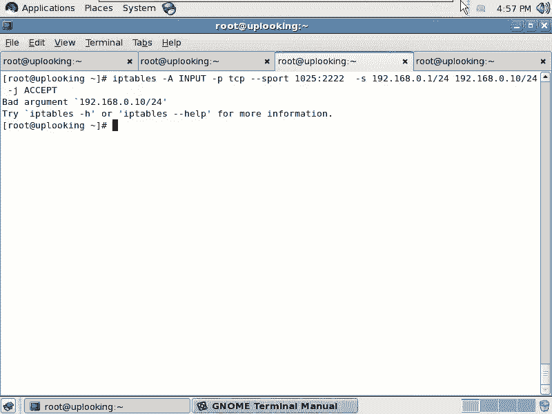

啊。SRC杠IPrange。这个可以吗？这我也还是不会啊。我还是不会就是。

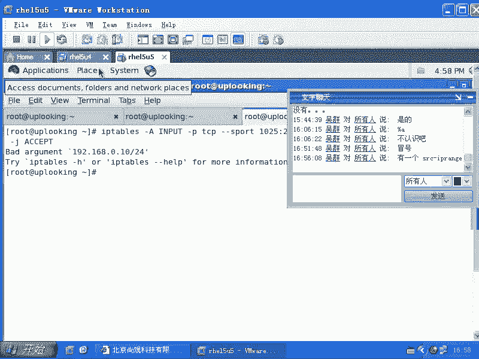

这个再说吧啊，就说。就是说我在实验出来以后再告诉大家啊，总之这个感叹号大家会了，是不是？嗯，然后呢端口范围话大家也会了，是不是？但是其实的话呢，我们刚才列出来的这些东西啊。😊。

就是我们刚才列出来的这些东西，比方说这个命令啊，这些的话呢，大家学会以后会发现的话呢，你来源IP来源端口、目标IP目标端口是吧？这些大致都会了。那么还有什么东西，还有什么东西可能要做的呢？

就是还有可能的话呢，你要加上一个呃杠I啊，就是进入的接口是什么？是不是ETH0来的是吧？杠O从哪个接口出去的是吧？当然这些条件的话，你可以匹配一个也可以匹配多个。

你比方说你把你把其中的几个条件删除掉是吧？它匹配的范围就更大，是不是杠I和杠O，这是另外描述数据包的另外两个参数，对不对？杠杠Sport杠杠Dport对吧？杠S杠D杠I杠O是不是这些参数的话呢。

大家记住啊。杠P参数，然后呢杠I参数杠O参数杠S参数，杠D参数杠杠Sport杠杠D port是不是？这样的，那么我们还有没有其他的描述呢？太多了啊，真的太多了。ip tables的话呢。

这真是基本的对这个数据标的描述。如果要是你想再去深入的话，那就要琢磨很多东西。因为它有很多就是这一个数据标就相当于一个二进制的一段数字是吧？那么你能用ip tables话描述它其中的某一部分。

它的这个数值是什么？那这样的话我们来看它有一些扩展，这些扩展的话呢，在呃就是创造出了无限的可能啊，真的是无限可能。ip tables比方看A啊input我想实现一个功能，我能SSH它它不能SSH5。

我能SS他也就我主动跟他联系，可以，他主动跟我联系不成，这样的话我们就用到一个扩展就是什么呢？stateate扩展啊，就是说你要加个杠M参数，它是进行什么呢？就是采用I table的一些扩展模块。

也就这不是Itable本身自带的标准模块了，它是一些I table这个组织啊，他们经过就是有很多很多扩展。这些扩展的话呢，可能是几十个几百个，但是它采用了其中的几个把它编译起来。

其中一个用的最多的就是state就是基于状态的方火权。state扩展就是STAT。C杠杠state。刚刚state，然后呢是new状态的。哎。new啊这个状态啊状态是怎么回事呢？你看现在的话呢。

我去我去这样的，我。我是A机体是吧？然后呢，对方是B机器，然后呢，如果A机器的话呢，给他发送第一个数据包，对吧？第一个数据包。那么在我的机器上，目前来说啊。

没有任何的一个人没有任何跟I就是这个B机器的这个IP啊啊，这个IP加端口。因为这个TCPIP协议。TCP协议是面向连接的，对不对？一个连接应该是1个IP加端口啊，大家一定要注意啊，这个连接。

不是面向主机。面向主机的话呢，就是说。面向主机的话，就相当于你要两个公司面向主机的话，说A公司和B公司。那这个两个两个公司到底有没有接触过，有接触过的话，那么他们就是。

就第一个次接触就是 new状态是吧？但是面上连接就不一样了。我这两个主机是不是上面有很多部门？😡，这边的HR部门就是人力资源部门有没有访问到那边的HR部门。如果他们两个这样一访问的话。

那么他才算new是吧？但是在他们访问之前，已经有什么已经有其他部门来往过了。比方说他们市场部已经访问过了。但是这个时候跟那个人力资源部是没有关系的。😊，也就是说我访问过那个主机。

但是呢我那个端口我没有访问过。是不是这也叫做new，也就是面向连接的这个连接应该是IP加端口，明白了没有？所以的话呢我这边的话呢，我这个IA啊访问就是我的这个IP地址为A，是不是？

然后再加上一个什么冒号，加上一个什么端口，是不是？那么我能访问SSH它它不能SSH5，我怎么样去做呢？我用我的一个随机端口，比方说3355端口，我用我的3355端口，访问IP地址为什么？B的机器。

是不是访问IP地址为B的机器的什么呢？22端口，对不对？那么我访问它的这个端口。😊，我这个数据包我肯定要允许，你说我forward的时候我没有限制是吧？forward的时候，我刚才没有做限制是吧？

那么现在我input的链，我是不是全部都拒绝了，全部都扔掉了。我给他发送这个数据包是不是没有限制啊？😡，但是我不想让他。😡，人家。不想让他连接我。那这时候我给他发第一个数据包的时候。

这个数据包在没有任何的记录的情况下，就是这个面向链接的数据包没有记任何记录的情况下，它就是什么？他的状态的话就是你有。他的状态就是牛，清楚了吗？我这边的话呢，这个链接到这个链接没有任何的记录情况下。

那这个是new状态。但是如果要是他反过来访问我。他反过来反问我。我们看一眼啊。如果要是我这边的这个AIP地址是吧，加上我这边的22端口，对不对？那么他的这个。

假如说他采用了个随机端口来访问我这个时候的那个new状态的数据包是不是就反了？我只需要限定的是什么呢？就是 new状态的时候，它不能没有new状态的数主话可以访问。呃，我这边绕了太多的圈子啊。

把我自己都绕进去了。就是意思就是什么呢？我主动访问你。你不能主动访问我一般的规则，这种IP tables，我拒绝从你那边来的所有数据包。我能主动访问你，你不能主动访问我。

那么我就把你那个数据包全部都屏蔽掉，是吧？但这样做的结果是什么呢？就是我给你发送一个书标，我去SS你的时候，你要给我回应是吧？你给我的这个回应是不是我也要扔掉？那你说我怎么实现这个这一点？

我怎么样去实现这点我SS这是你你会给我一个回应。啊，你给我回应，那这个数包的话，我就扔掉了。那我要允许他呢，我要允许他的话，我就要不能把那条规则加上。我把那条规则一去除，你就可以SS是我。

是不是你也可以访问我的网页，对不对？但是我就是不想让你主动连接我。😡，只有我连接你的时候的话呢，才可以，是不是？所以这个时候是怎么样的？这个时候你就要考虑了1个IP table是传统的规则是不可以的。

所以这时候必须得引入什么呢？新的东西就是基于状态的防火墙。状态的防火墙就是说我去主动连接你的时候，发第一个包是不是？也就第一个包一定是什么？第一个包一定是由我发的是吧？嗯，那你只要给我回应。

你给我回应的第一个包，这个时候咱们俩的状态已经什么不新鲜了，不是new了，明白吗？它就变成什么establish的状态。也就只有第一个包是new的。😡，所以我觉得限定什么业状态。😡，你不能给我。

你有状态我可以给你是吧？但是你不能给我，那么其他的状态我都允许无所谓。这样的话我就可以SS住你，我也可以访问你的网页，但是你不能SS住我，你也不能访问我的网页。😡，你只要给给我发过来一个数据包。

你有状态的第一个数据包，你不能发给我就OK了，对吧？你像现在这样，如果要是我的这样的1个IP地址，加这样的一个端口，访问他的这个IP地址，加这个端口，他只要给我一个数据包回来啊，他给我一个数据包回来。

这个下面的话就先升。删掉啊，就是他只要给我发过来的这个书包，尽管也是第一个他给我发过来数据包，这个时候他已经不新鲜了，叫什么呢？叫做。established就是说已经连接状态，已经什么建立了数据包了。

明白吧？所以这个时候的话就已经不新鲜了。那我需要鉴鉴定的，就是说如果要是第一次你给我去发送数据包，这个时候是第一个包是new是吧？new状态的，我不允许，所以的话我这时候想怎么访问你就怎么访问你。

但是你就是不能主动访问我。你SS我就是不行。明白了吗？这样可以实现这样一点啊。所以的话我们现在这个M杠呃就是这个杠杠state，大家可能对这个的话呢还有点模糊。那么你看一下这个啊。

你看下这个命令night state。这个时候的话你可以加上一个杠AN。T是吧，ANT不要加U了，U就是UDP是吧？UDP是不面向连接，不面向状态的，对不对？然后我们这边就是杠ANT，然后一回车。

这时候你看一下是不是我这些状态都是在。

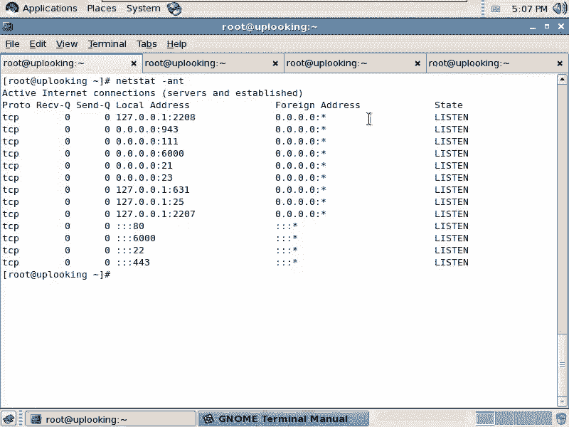

listen的状态是不是？那假如说我去这样的L。啊，SSH1921了8。0。254，是不是？然后这样的SSH呀。

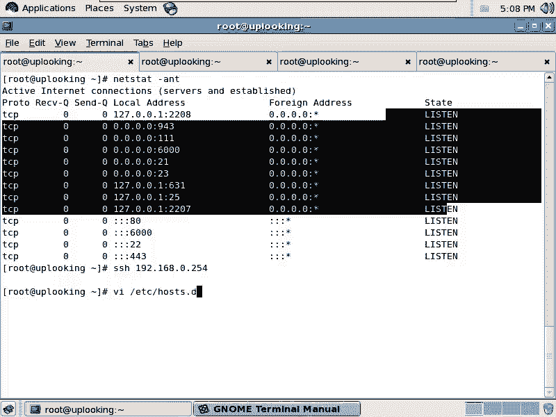

看。这就是我刚才说的问题，是不是？还是不行。这两都注释都取消掉了。什么原因呢？还是可以的啊，只不过他要解析IP地址。而且CIP地址。把IP地址解些，只要等到超时，他才会什么正常出来。慢慢等吧啊慢慢等吧。

也就是说我去SIC过去以后啊，大家再来看一下。用运行什么命令呢？运行let state是吧，杠ANT。这时候有没有建了连机啊？你看他现在话呢发的这个数据标什么S oneY Scent是吧？

说我刚发了个S one的包啊，这个包是new状态的，是不是？然后呢，如果要是一旦产生数据包以后的话，就会变成什么呢？就会变成。嗯。哦，对呀。那那难怪啊。因为我这边IP table打开着呢。

对吧现在连接了，然后我们给大家看一下，这个时候你看下这个状态是什么状态。看到了吗？就是我自己连接自己是吧，我自己的一个随机端口访问我自己的一个什么1个22端口是吧？同时我自己的22端口正在监听。

然后呢又发现有一个数据包的，有一个自己的IP的话，连接我自己是吧？其实这就是说你别管怎么样，计算机就是这么傻，他也不知道你是自己人，是不是你是自己发了个数据包倒回到自己手里，反正他就按照一定规则。

已经写好的规则来做。他没有那么聪明是吧？他不会突然蹦出来，你傻呀，你自己还SSC是自己，你不是就已经登陆了吗？对吧？所以这边的话呢就会自然产生两条链接。你看这两条链接的话。

是不是established的？😡，是不是这个时候的话呢，就是第一个数据包，它是一个什么new状态的。第二个数据包就已经变成什么established。这个时候的话，你只要是基于状态的防火墙。

你把它做上去啊，杠M state你有状态是吧？new。那么我的话呢想哎。你比方说其实我如果要是想去完整的去写一套的话，我应该是这样去写。算了，这样子。我先把所有的数据包怎么样全部都。做是不是？然后呢。

我再去怎么样every tables。杠A啊input。从那么现在我不管是 new状态还是什么的话，都什么扔掉了，是不是都扔掉了。那么我现在的话呢，杠S来源为那个IP然后0点。2这台机器0。

2这台机器杠呃就是杠M state。杠杠state。是established。はい。杠。或者是什么呢？或者是re。啊，然后呢这两种状态的话都怎么样？Acept。

也就是说我发送过去第一个数据包是用的foward链是吧？这时候他给我回的第二个包已经是established了。这个时候才用到的input链，是不是？这时候input链是不是established的？

你们说是不是？那这个书包允不允许啊？我刚添加的规则。是允许的，是不是？所以就这样。那么也就是说实际上本质上讲的话呢，你如果要是做一个防火墙的话，做一个防火墙，自己的防火墙的话，实际上都是应该是这样的。

不应该这样去。所有的established和related的数据包都是允许established的就是说我主动发给别人一个数据包，他要给我回应，我都是允许，是不是？然后呢，related的是什么呢？

就比方说FTP它的话呢在验证的时候是通过21端口，是不是？然后它在传入数据的时候，可能是通过22端口，也可能是通过3000多端口，是不是？这个时候的话呢，这个链啊。

它是跟以前的那个以前的那个已经建立好的那个连接什么是有关的，是不是？尽管第一个数据包是从它那边发给我，但是呢这个连接是不是跟以前那个连接是相关的，是不是？那这时候他就是re。明白吧？这时候就是re的。

但是FTP不一定啊，FTTP这样的一条规则可能未必能允许它能访问到你。大家可以试一试啊，可以试一试。那么也就是说related的是什么呢？原来我连接，然后呢派生出另外一条连接来，跟原来那条连接是相关的。

这两种的话呢都是允许。这是杠M states的作用。清楚了吧？那么现在的话呢，我现在我的这个机器是不是默认已经拒绝了所有的人的话访问我。但是我这个机器是一个是不是1个80端口的外b服务器是吧？

假设说是1个80端口的外b服务器，我是不是应该这样的？Iy tables杠A inputput是吧，杠M，然后呢。state是吧。然后杠杠state别人访问不到我的网页了呀，是不是我加上一个什么呢？

new状态。😡，逆状态，然后呢，杠。PTCP杠杠deport是什么呢？是80。杠G。没有吧。你要不明白。我这个服务器总得要为别人提供服务吧。我提供的是80端考的服务是吧？默认情况下，我访问别人都可以。

别人访问我都不行，是吧？嗯，那我是不是希望别人的话能主动访问我的80端考是成功的，是吧？我就加这样一条。😡，清楚了吗？组是实际证。FCP的话。而FTP的话呢，我没有太多经验。它有两种传输方式。

一种是用22端口传输是吧？另外一种是从什么呢？从一定的范围之内。一定范围之内这个范围的话呢，应该是从3000多是吧，3000多到6000多端口。也就是说我们事先的话把3000多到6000多端口的话呢。

打上一个标记这个标记的这种是包话都允许进来是一种方式。还有一个的话呢，就是IP tables里面它有1个FTP的一个追踪包啊，就是说叫做IPT下外线啊。FTP啊。这边的话呢是有专门针对FTP的设置的。

你看这re的话呢是有FTP是针对FTP的话，你有设置。但是这并不是我想看到的。所有的内核模块是不是在models目录像？2。6点是你的内核版本是吧？ kernelel。

然后呢有个nnet当中有个什么呢呃。n filter let filter就是IP tables的filter。明白吧？就是IP tables。IP table是在内核当中叫m filter。

在用户空间当中叫什么呢？IP tables。啊，我看这里面的话呢会有一个什么。没有是吧。就是原来是有1个FTP的，我这边应该能看得到。I p c n。你们有没有啊？你们有没有？第一批目。这边有的呀。

你看。里面的话呢有这个FTP的Q的Q的包是吧？它是专门针对IP table呃，就是FTP那个就是额外生出的这种这个链接新的链接来做的。但然具体用的话呢，我没有用过，它是跟是沿用的。

也就是说我们俩建立了一个FTP的连接是吧？允许FTP但是呢现在的话呢，突然的话呢，我们要展开一个新的链接，然后呢用来传输数据的。那首先的话可以用re的来试试，因为re的话都是允许的是吧？

related的数据包都是允许的是吧？这样的话试试看如果不行的话呢，会有这个IPCONFTP这个这个模块，这个模块的话呢是专门针对FTP的这种需求来做。但我没有用过啊，一会儿的话我试一下。

然后再给大家做一下，好不好？OK这个杠M state这个规则的话呢，我们就做了一个小的防火墙，这个有没有问题？还应该的话呢，你应该还添加一个什么iy tables啊，杠A啊input所有来自于什么？

127。0点。是吧嗯杠J什么。htables，然后呢杠A。input是吧，所有来自于你的主机名。比方说你的主机名是uplook点com，是不是杠J。明白吧？这些规则的话呢全部都设定好了以后。

然后再输入一个什么呢？serviceI tables。Save。啊，这个命令的话呢，实际上是运行的什么呢？I tables。杠。save输出处定项成什么？

DETC下面的ETC下面的ss当中的IT tables。明白吧？也就是说你可以把当前的规则导入进去。导入进去了以后，你可以看到这个里面的规则的话呢，它会看的会比较比较清楚。有很多的人在网上问别人的话。

是说我这IP tables的规则为什么不生效？但是呢我看别人的话要求要给它解答问题时候说你不要把你输入的命令，写，就是说切出来，你应该把这个命令导出成一个文件是吧？

也就是说我们的内核真正是怎么去看这个命令的。然后呢，这个文件的话，你再VIETC下的sfi当中的IP tables，你看这个文件是怎么去写的。😊，对不对？

这个文件的话呢是真正真正我们的系统它怎么去识别你刚才说的appy tables那些东西，听楚了没有？听了吧。听懂吗？也说这个地方是我们前后顺序是怎么样，真正系统是怎么样去识别的，它都能给你先就是做出来。

那么当你的这个系统啊，如果要是check onfi。Iappy tables啊。以后或者serviceip tables restartstar。这个时候的话呢，它就会读取这个文件。

从这个文件里面的话呢，把规则读出来，然后呢，每次启动的时候都会把这个规则应用一遍，清楚了吧？也就是说我辛辛苦苦设定了很多的这个规则以后，那么我要把这个IP tables的规则的话，保存一下。

比方说用这个命令保存，或者用这个命令保存都可以。然后再去怎么样呢？check onfi。appy tables啊是不是serviceapp tables。ウスタ。这样的话就是说重新读那个文件。

把那个规则再重新运用一遍，是不是？我们看到的这个杠Mstate能不能理解？这杠M state能不能理解？也就是说我原本的话呢，从那个来源允许或者拒绝就行了，是不是？但是呢我现在加了一个条件。

就是说它的第一个包我允许它的第一个包什么，我不允许，这样的话呢就是用杠M state这个扩展是IP tables的扩展，听楚了吗？那IP tables的话呢，它还有其他扩展。最常用的还有个什么呢？

Mlimit。limit话呢，你可以加上一个什么杠杠limit。看看妹妹看满配置就可以。慢。Iy tables。查找什么呢？limit。啊， limitit。limit。limit的话呢。

它是限定什么呢？就是当你的系统被别人访问的时候啊，当你的系统看到被别人访问的时候，它本身的话呢是有一个呃就是说本身在内核当中的话呢，有一个计数器。啊，计数器。那么它可以计术说你每秒钟的话呢。

这个数据包啊，那么不能超过多少。如果超过多少的话呢，它可以做一些响应。比方说它就开始停止响应数据包了，或者它可以计入日志。我们通常情况下用limit参数的话呢，都是跟日志连用的，都是跟杠Glog连用的。

这边的话呢，杠杠limit的话是一个限定，比方说每秒钟多少，或者说每每分钟多少等等，或者说呢这个爆发。那么如果爆发的话呢，是呃是就是爆发处理的话呢，是多少个数据包啊。

我们看如果要是你想去跟用limit参数的话，一般是limit啊，比方说呃2000是吧，2000每秒啊，200个时标每秒。那么如果要是在这个之下的话啊，在这个之下的话，就没有任何的问题啊。

他就是说相当于是允许是不是允许。如果要是我这边限定的一个，比方说呃我这样做啊IP tables杠。A inputput的时候数据包。如果要是我这个数据包的话呢已经限定到这么多。

那么是允许这个一点问题都没有。这条规则先生效了以后就直接允许了，是不是？但是呢我再去加一条，然后再去IP tables。也就是数据包达到2000至2200的时候，它就开始记录日志了。知道吧？

或者2210等等。你要看他，你要是想让他提醒你一下就完事儿。你把这个值设置的比较小。如果要是呢你这个是个你这个值的话呢，设置的就是比较大，它会给你设置很多日志，显示很多日志的，明白吧？

那这个杠杠Jlog是有什么作用呢？它可以记录日志。但是它记录的这个日志的话呢，是conal相关的日志。那么我我我先给大家看一眼这个日志啊，日志的话呢，它的蛮配置是。就刚才说那个SRCIPrange啊。

就说那个IP地址范围啊，无群的话呢，又交了我一招啊，交了我一招。我们先看就是说如果要是你看一下。男配置在哪？配置。然后呢，我们这时候的话呢找的是什么loglog。这是log。

那么你可以记录日志的时候的话呢，日志的级别是什么？杠杠log级别是什么？然后日志的这个内容是什么？明白吗？日的级别是什么？只能说是。呃，5，然后呢再加上一个什么。perfect是吧。日pro fix。

然后加上一个。是应该等于吧。A track。是这样的check是吧，是这么拼吗？T6 us a track。明白我的意思吧。那么这样的话呢，就是说当2000的时候，它就直接允许了。

2000到2200的话呢，它就开始记入日志。记录日志的话呢，这个消息的话呢会变成 kernelel的日志的话呢，去去去那个写在那个ss dog里面，是不是？

那么我们想去去确确定把这个呃 kernelel的日志全部都重定向到一个位置。这个位置它就叫做DD日志。该怎么办呢？我们这样的VIETC下的什么ss config，是不是哎，不是ss config是ss。

log当中ss log点com对不对？在这里面的话呢，添加一个什么 kernelnel点。

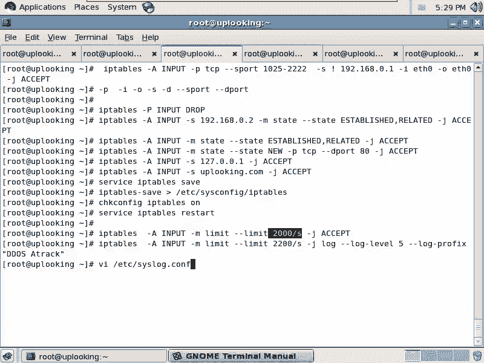

新或者 kernell点什么info级别以上的日志，是不是把这个日志写在哪呢？使到wa下的log当中的什么。明白吧？这边的话呢就是我做了一套报警系统。我做了一套报警。清楚不清楚。清楚了。

还有的话呢就是说这种还有一个扩展就是什么杠M啊mac。杠Mm的话呢，这个mac地址的这个应用是什么？就是我经常遇到这样问题，两次了。我们机房里面的话呢，有一个windows的机器。

也不知道哪个神经病在那边就是维护的。然后呢，我们是在一个一个机柜里。这个机器的话呢，从来不去维护，就是经常中病毒。一中病毒的话呢，它就中了个。ARP病毒。他一中ARP病毒，我们的服器可惨了。

他就自动把那个网关就截持过来了。明白吧？他把那个网关截持过来，截持过来以后的话呢，他跟局域网内的所有人广播说什么哥们儿。网关的IP是我，你们不要访问真正的网关了。这样的话呢，我在给别人发送数据包的时候。

我就会通过什么，他去帮我转出所有的页面，所有的HTM页面或者PHP页面，它都会在前面加上一个什么前面加上一个挂码的这个他自己挂的代码，这种事情太多了。那你想不想把他的mac地址就直接就怎么样。

把它的这个mac地址发过来的数据包全部都扔掉。想不想？那就是杠Mm。明白吧？杠杠mac什么什么把他的mac地址就禁掉。你知道这个家伙的话呢，他的他就没什么好事是吧？把他的IP地址全部都禁掉啊。

当然你可以用ARPARP tables啊，ARP tables也可以去做。所以的话呢我经常遇到这样的攻击是吧？结果的话呢，他一中病毒好嘛？我们公司的这个服务器。就被很多的那个就被很多的那个。

杀毒软件公司列为什么呢？列为这个有木马的这个网址。然后呢，别人人家我们我们那个就很多那个学生啊，或者说这个其他公司人说哎，你们公司。这个太弱了嘛，是吧？这个机器的话呢，居然被挂码。

或者你们公司好像不是什么好鸟，对不对？然后呢，我就非常生气，我说这个笨蛋弄的是不是他们那个服务器维护不好，所以他你可以通过杠刚mac，或者说那个ARP tables把这种事情给它屏蔽掉，是吧？

或者直接用什么呢？ARP杠S把网关的mac地址绑定什么，就是网网关的IP绑定成网关的mac地址是吧？用ARP杠S命令，明白吧？这样的话呢，就不会有ARP病毒攻击的问题了。😊。

你管管其他的机器呃都被黑了也没有关系，反正你就认准一个mac地址，那个mac地址就是网关那个mac地址，是不是？然后呢，假如说我的。这个杠Mm明白明白意思了吧。那么假如说有个机器它总是被攻击。

那么我们就把它mac地址给它删除掉是吧？就不允许让让它访问。然后我可以用什么呢？ARP杠S，然后加上一个什么IP，然后再加上那个网关的什么mac地址。是不是？对吧网关的mac和网关的IP。明白不明白。

这边的话就是IP tables的一些应用啊，ipy tables filter的一一些应用。就是我们IP tables的这个呃过就是相当于包过滤程序的这样的一些应用。当然了，还有NAT啊NAT地址转换。

有没有问题啊？啊。😮，原丈。啊，大批啊对大P。不是那个大P的话是默认的规则，它不出现在你的IP tables的那个。规则的那个排序当中。你看一眼就清楚了啊。你看一眼清楚了。IP tables是吧。

大L你看到这个列表当中有没有大批刚才设定的那个规则。这个规则杠大批设定的规则是在这个位置的。它并不是最先生效，而是在你设定的那些下面的这些规则。无效之呃，就是没有生效的时候，这条才会生效。清楚吧？

也就是它的优先级是最最低的，相当于也就是默认所有数据包都是怎么样。😊，他そ。对，就是你上面规则没有定义的数据包默认才是怎么样。对，相当于这样。你看我这边设定了一个大P的规则，是不是？然后呢再看看哎呀。

是不是这个地方是 drop。啊，他并不是排在那个第一位啊，并不是排在第一位，明白吗？好，这个的话呢就是我们的IP tables filterIP tables filter。

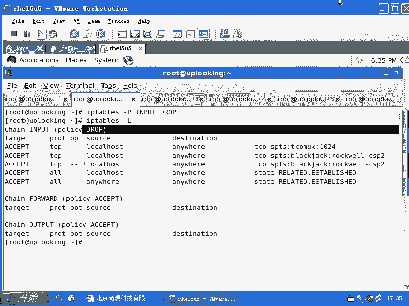

还有没有问题？

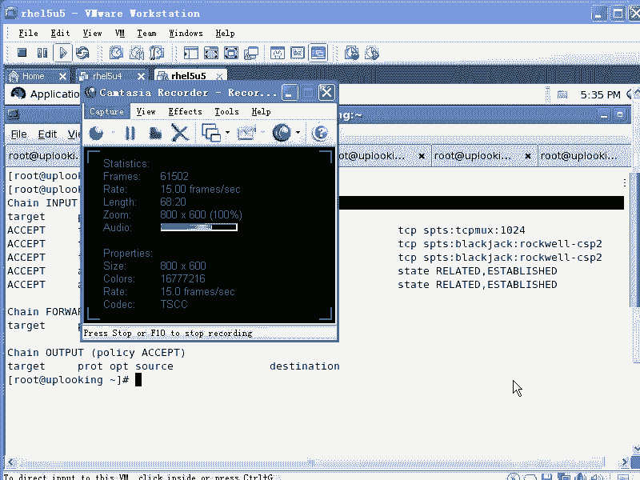

还有没有问题？

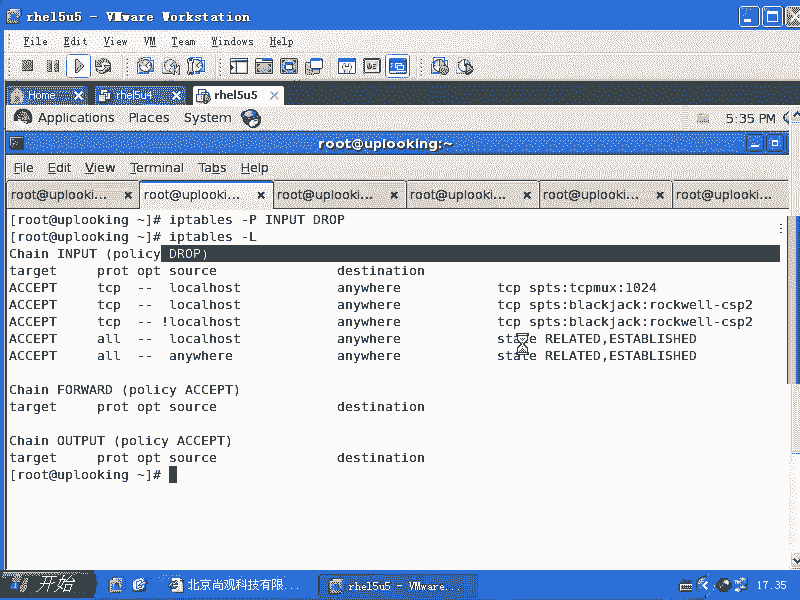

好。