# 尚观Linux视频教程RHCE精品课程：P73：RH253-ULE116-5-1-iptables-filter


在本节课中，我们将要学习Linux系统中一个核心的网络安全工具——`iptables`。`iptables`是一个功能强大的包过滤防火墙，它工作在内核层面，能够在数据包被应用程序处理之前就进行拦截和过滤。我们将从基础概念讲起，逐步学习其规则链、常用命令以及高级扩展功能，帮助你构建自己的防火墙策略。

## 概述：iptables在安全体系中的位置

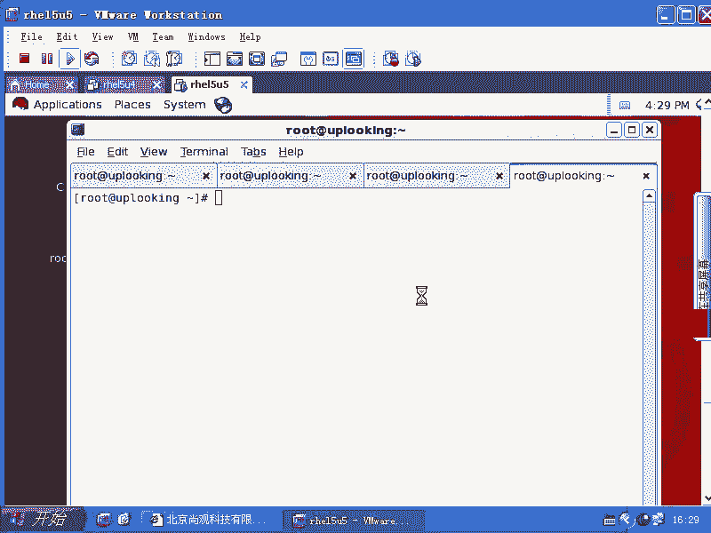

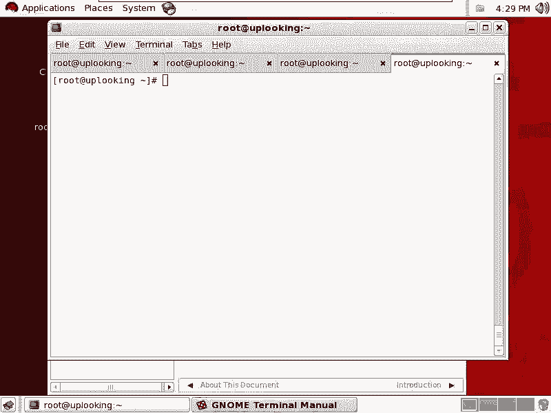

上一节我们介绍了`TCP Wrappers`和`PAM`等安全机制。本节中我们来看看位于它们之前的、更底层的防火墙工具——`iptables`。

`iptables`是整个网络安全体系的最前端。数据包到达机器后，首先由以太网接收，然后向上传递到IP层。`iptables`就内嵌在TCP/IP协议栈的处理环节中。它的调用贯穿了协议栈处理的各个环节。

因此，`iptables`的生效顺序在`TCP Wrappers`和`PAM`之前。如果在`iptables`层面就拒绝了某个访问（例如对22端口的SSH访问），那么后续的`TCP Wrappers`和`PAM`规则将完全不会生效。`iptables`在内核中生效，此时数据包尚未被应用程序看到。应用程序组合好数据包后，才会去调用`TCP Wrappers`和`PAM`。

## iptables基础：表（Table）与链（Chain）

我们首先使用`iptables`命令查看其帮助信息。

```bash
iptables
```

`iptables`的规则体系结构首先需要指定一个表（Table）。使用`-t`参数来指定表，默认表是`filter`。

以下是三个主要的表：
*   **filter表**：最常用的表，用于数据包过滤，实现防火墙功能。
*   **nat表**：用于网络地址转换（NAT），例如实现共享上网或端口转发。
*   **mangle表**：用于修改数据包（如打标记），通常在策略路由时使用。

如果不指定`-t`参数，则默认对`filter`表进行操作。本教程主要围绕`filter`表展开。

在表中，规则被组织在不同的链（Chain）中。`filter`表默认包含三条链：
*   **INPUT链**：处理**发往本机**的数据包。
*   **FORWARD链**：处理**需要本机转发**的数据包。
*   **OUTPUT链**：处理**由本机发出**的数据包。

理解链的本质很重要：你可以将链理解为“当数据包处于某种情况时（INPUT/FORWARD/OUTPUT）”，应用的一系列规则。规则按顺序匹配，谁排在前面谁先生效。

**一个重要概念**：INPUT链和FORWARD链是互斥的。一个数据包如果是发给本机的，则INPUT链生效；如果是需要本机转发给其他主机的，则FORWARD链生效。作为一台对外提供服务的服务器，配置INPUT链的机会最多；作为一台网关或防火墙设备，配置FORWARD链的机会最多。

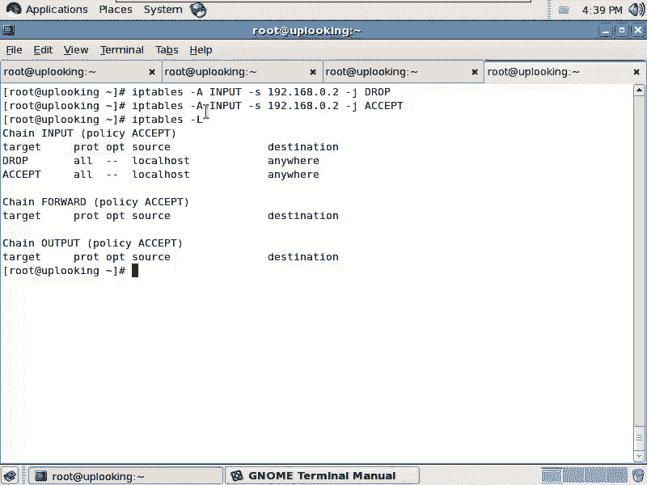

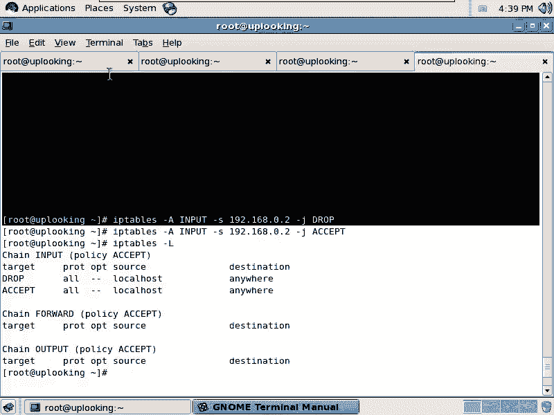

## 链规则的基本操作

以下是针对链（如INPUT）规则的基本操作命令：

*   **`-A`**：在链的末尾追加一条规则。
*   **`-I`**：在链的指定位置（默认为第1位）插入一条规则。
*   **`-D`**：从链中删除一条规则（可按编号或完整规则描述删除）。
*   **`-F`**：清空链中的所有规则。
*   **`-L`**：列出链中的所有规则。
*   **`-P`**：设置链的默认策略（默认规则）。当所有具体规则都不匹配时，将执行此策略。

让我们通过实例来理解这些操作。首先，我们添加一条规则，拒绝来自`192.168.0.2`的SSH访问（TCP 22端口）。

```bash
iptables -A INPUT -s 192.168.0.2 -p tcp --dport 22 -j DROP
```

然后，我们再添加一条规则，允许来自`192.168.0.2`的访问。

```bash
iptables -A INPUT -s 192.168.0.2 -j ACCEPT
```

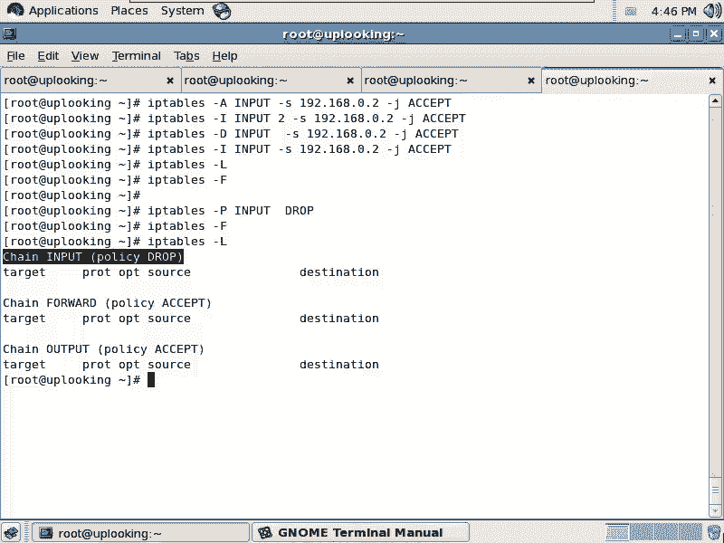

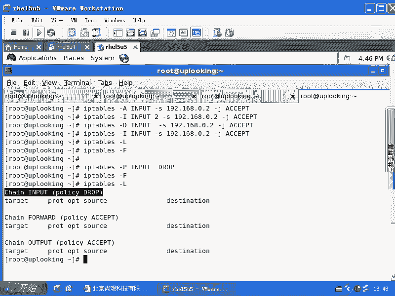

此时，由于`DROP`规则在前，`ACCEPT`规则在后，来自`192.168.0.2`的所有访问（包括SSH）仍然会被拒绝。规则按顺序匹配，第一条匹配的规则生效。

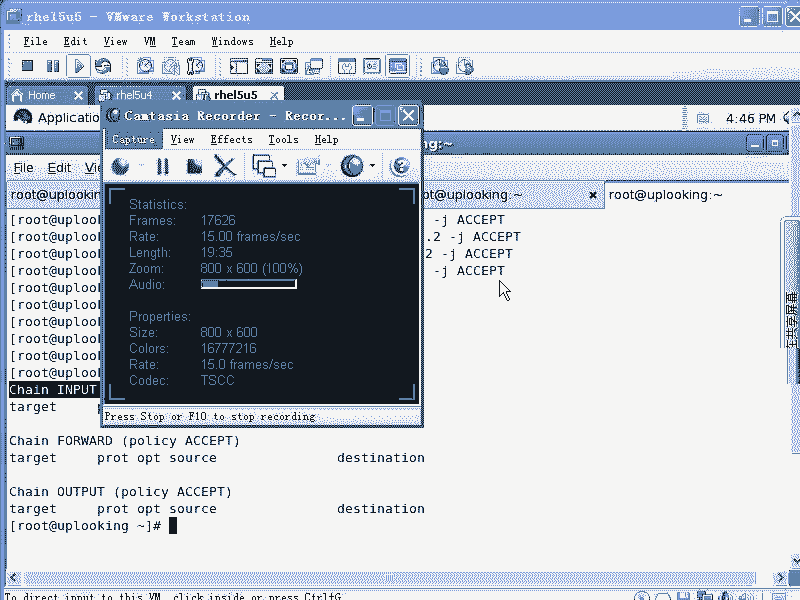

如果我们希望允许规则生效，可以使用`-I`参数将其插入到`DROP`规则之前。

```bash
iptables -I INPUT -s 192.168.0.2 -j ACCEPT
# 或指定插入到第1位
iptables -I INPUT 1 -s 192.168.0.2 -j ACCEPT
```

现在，`ACCEPT`规则位于首位，来自`192.168.0.2`的访问将被允许。

删除规则可以使用`-D`参数。可以按规则编号删除：

```bash
iptables -D INPUT 3
```

也可以匹配规则描述来删除（将删除匹配的第一条规则）：

```bash
iptables -D INPUT -s 192.168.0.2 -j ACCEPT
```

清空所有规则使用`-F`参数：

```bash
iptables -F
```

## 设置默认策略与规则匹配条件

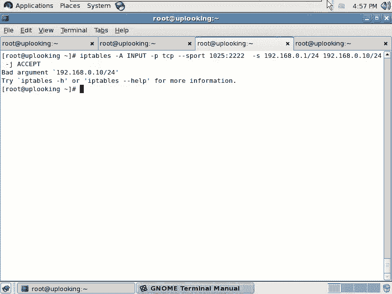

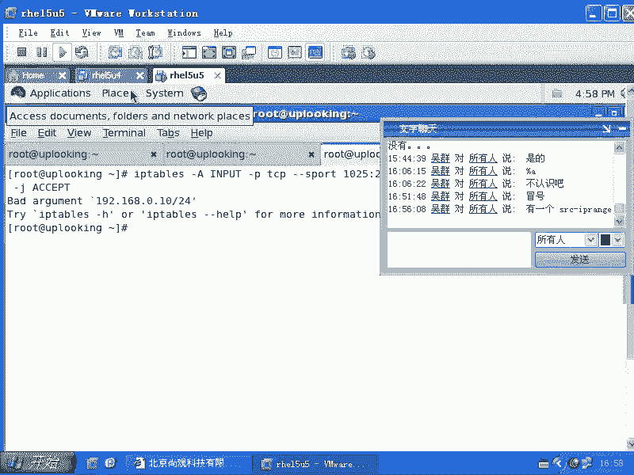

在实际配置防火墙时，我们通常采用“默认拒绝，显式允许”的策略。这可以通过设置链的默认策略（`-P`）来实现。

```bash
iptables -P INPUT DROP
```

这条命令将INPUT链的默认策略设置为`DROP`。这意味着，如果没有后续的`ACCEPT`规则明确允许，所有进入本机的数据包都将被丢弃。

**重要提示**：`-F`命令只能清空用户定义的规则，无法清除用`-P`设置的默认策略。即使清空了所有规则，默认的`DROP`策略依然有效。

接下来，我们看看如何更精确地描述一个数据包。以下是一些常用的匹配条件参数：

*   **`-p`**：指定协议，如`tcp`、`udp`、`icmp`。
*   **`-s`**：指定源IP地址或网段，如`192.168.0.0/24`。
*   **`-d`**：指定目标IP地址。
*   **`--sport`**：指定源端口。
*   **`--dport`**：指定目标端口。
*   **`-i`**：指定数据包进入的网络接口，如`eth0`。
*   **`-o`**：指定数据包离开的网络接口。
*   **`!`**：取反操作，如`! -s 192.168.1.1`表示“源IP不是192.168.1.1”。

端口范围可以使用冒号`:`表示，例如`--dport 1:1024`。注意，使用`-n`参数可以禁止IP地址反向解析，加快规则列表显示速度。

```bash
iptables -L -n
```

动作（`-j`）除了`ACCEPT`和`DROP`，还有`REJECT`。`DROP`是直接丢弃数据包，不回应；`REJECT`是拒绝并返回一个错误响应。

## 高级扩展：状态检测（state）

传统的包过滤规则难以处理“我能主动连接别人，但别人不能主动连接我”这类需求。`iptables`的`state`扩展模块引入了“连接状态”的概念，完美解决了这个问题。

一个TCP连接有不同的状态：
*   **NEW**：连接的第一个数据包。
*   **ESTABLISHED**：已建立的连接（即对NEW包的回应或后续数据包）。
*   **RELATED**：与已有连接相关联的新连接（如FTP的数据连接）。

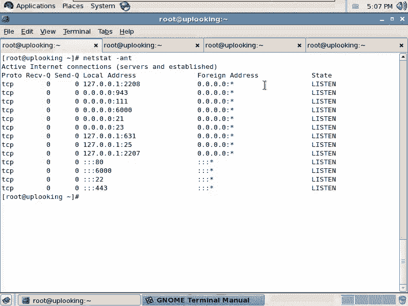

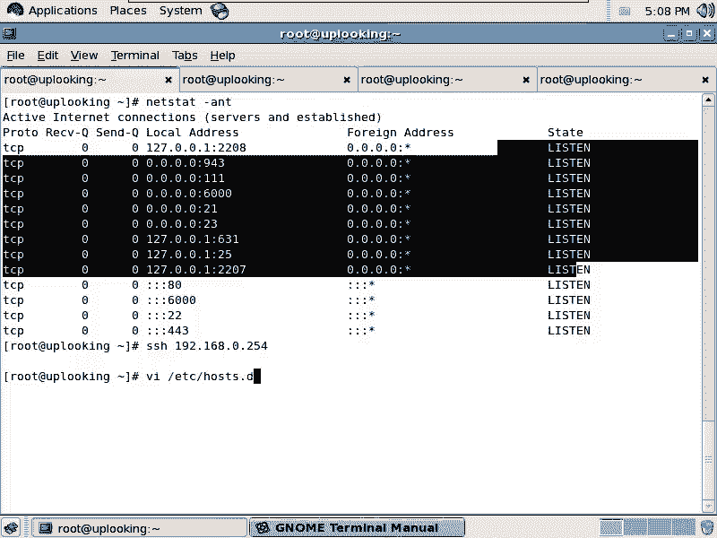

基于状态的防火墙配置非常高效和常用。一个典型的配置思路是：
1.  默认拒绝所有入站连接（`-P INPUT DROP`）。
2.  允许所有已建立的（ESTABLISHED）和相关的（RELATED）连接。这确保了由本机发起的通信能正常收到回复。
3.  针对需要开放的服务（如Web服务器的80端口），显式允许其NEW状态的连接。

配置示例：

```bash
# 设置默认策略
iptables -P INPUT DROP
# 允许已建立和相关的连接
iptables -A INPUT -m state --state ESTABLISHED,RELATED -j ACCEPT
# 允许外部访问本机80端口（NEW状态）
iptables -A INPUT -p tcp --dport 80 -m state --state NEW -j ACCEPT
# 允许本地回环接口
iptables -A INPUT -i lo -j ACCEPT
```

使用`netstat`或`ss`命令可以查看当前连接的状态。

```bash
netstat -ant
# 或
ss -ant
```

## 其他实用扩展模块

`iptables`还有许多其他扩展模块，这里介绍两个常用的：

**1. limit模块（限流与日志）**
`limit`模块用于限制数据包的匹配速率，常与`LOG`动作结合，用于记录异常流量或攻击。

```bash
# 允许每秒最多10个到22端口的NEW连接
iptables -A INPUT -p tcp --dport 22 -m state --state NEW -m limit --limit 10/second -j ACCEPT
# 超过上述限制的连接记录日志
iptables -A INPUT -p tcp --dport 22 -m state --state NEW -j LOG --log-prefix “SSH-ATTACK: “
```

**2. mac模块（基于MAC地址过滤）**
`mac`模块可以基于源MAC地址进行过滤，常用于防御局域网内的ARP欺骗攻击。

```bash
# 拒绝来自特定MAC地址的数据包
iptables -A INPUT -m mac --mac-source 00:11:22:33:44:55 -j DROP
```

防御ARP欺骗更根本的方法是静态绑定网关ARP记录：

```bash
arp -s 网关IP 网关MAC地址
```

## 规则的保存与持久化

使用`iptables`命令配置的规则仅存在于内存中，重启后会丢失。需要将当前规则保存到配置文件中。

在RHEL/CentOS系统中，可以使用以下命令保存：

```bash
service iptables save
# 或
iptables-save > /etc/sysconfig/iptables
```

这个命令将当前规则导出到`/etc/sysconfig/iptables`文件中。系统启动时，`iptables`服务会读取这个文件并应用其中的规则。

要使保存的规则生效或重启服务，可以执行：

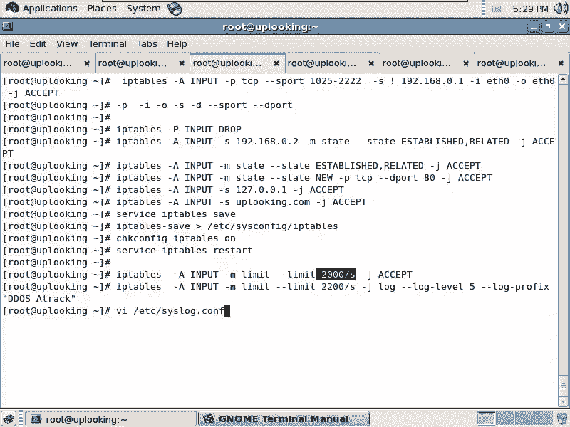

```bash
service iptables restart
# 或
chkconfig iptables on # 设置开机自启
service iptables start
```

## 总结

本节课中我们一起学习了Linux防火墙`iptables`的核心知识。我们从`iptables`在安全体系中的位置讲起，理解了其工作在内核层的特性。然后，我们学习了`iptables`的三表五链基本结构，重点掌握了`filter`表的`INPUT`、`FORWARD`、`OUTPUT`链。

我们详细演练了对链规则的基本操作：追加（`-A`）、插入（`-I`）、删除（`-D`）、清空（`-F`）、列表（`-L`）以及设置默认策略（`-P`）。同时，也学习了如何用源/目标IP、端口、协议等条件来精确匹配数据包。

接着，我们深入探讨了强大的`state`扩展模块，学会了如何配置基于连接状态的防火墙策略，这是构建安全、高效防火墙的基石。我们还简要介绍了`limit`（限流日志）和`mac`（MAC过滤）等扩展模块的用途。

最后，我们学习了如何使用`service iptables save`命令将配置持久化，确保重启后规则不丢失。

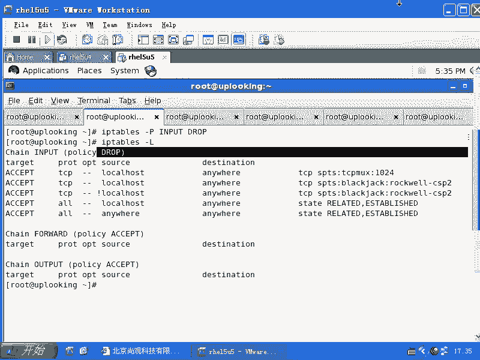

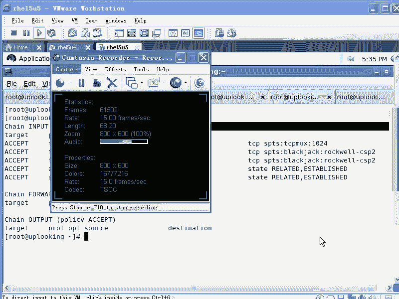

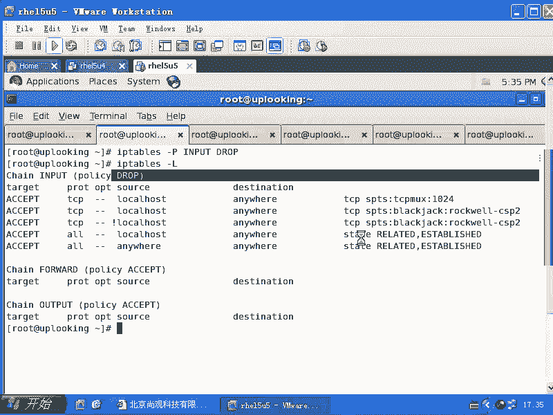

通过本课的学习，你应该已经掌握了使用`iptables`构建主机防火墙的基本技能。`iptables`功能非常丰富，建议在理解这些核心概念的基础上，通过实践和查阅手册（`man iptables`）来探索更多高级用法。