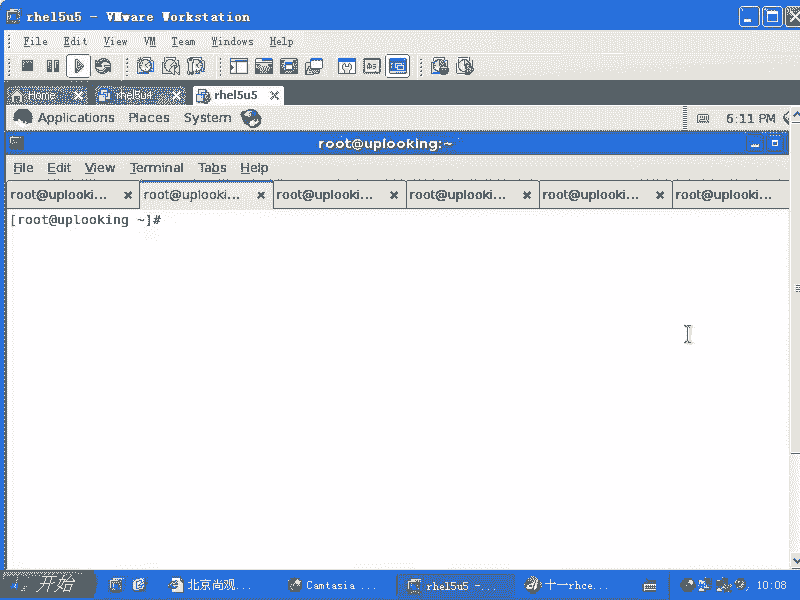

# 尚观Linux视频教程RHCE 精品课程 - P74：RH253-ULE116-5-1-iptables-snat-masquerade - 爱笑的程序狗 - BV1ax411o7VD

好，我们的话呢给大家把IP tables的呃NAT链的话呢，给大家详细的说一下啊。IPtables的NAT店的话呢有两种用途，主要是两种用途，一种是让内网的人共享上网出去，对不对？一种是什么呢？

把内网的一台机器发布在外网去。多数的硬件防火墙都是这样做的。也就是说你把公网的IP就是你比方说你是3W点希量点com，对不对？你把希量点com的IP地址的话呢，绑定在什么呢？绑定在你的那个硬件防火墙上。

然后当有人访问3W点希量点com的时候，那个硬件防火墙在怎么样，把你的访问的话呢，转到内网上来，明白吧？这个过程的话呢，可能是很多硬件防火墙工作的状态。也就是说把内网的一个IP地址发布在公网上去。

就是内网的一个应用发布到公网上去，这是一个应用。还有一块呢就是大家一块共享上网，就是两种，记楚吧？这两种我们来看下它的机理是怎么样的啊，我们看下机理是怎么样的。😊。

这个机理的话呢，我现在的话呢给大家看一眼，就是说比较就是写的稍微好看点啊，写的稍微好看点。然后呢，我们先的话呢，比方说我这台机器的话呢，是一个什么是一个呃网是我是一个网关。那么对内的接口是什么呢？

ETH0是不是对外的一个接口，就是说我可能是用ETH1是吧？ETH1播了一个什么播了1个ADSL的modem是吧？然后呢，产生了一个什么PPP。零的这样的一个接口，是不是PP0的话呢。

就是点对点通讯协议了。如果要是你想去创建的话，那就是怎么样？我刚才说过，是不是用什么命令的话去创建呢？用。system啊杠fi杠nwork你可以去创建1个ADSL的拨号链接是吧？一旦拨上去以后。

它就是PP0。对的，拨号你创建出来以后，你可以用RFR是不是PPP0，然后呢去拨号，对不对？这就拨号了，也可以用什么呢？也可以用I呃，就是说ADSL是吧？杠set up。😊。

set up然后呢来创建PP0，然后你也可以用up upPP0去拨号，也可以用什么呢？ADSL什么。star或者是connect让它来连接，对不对？这是呃都可以创建PP0。

也就是说我这边的话是作为一个网关啊，我作为一个网关。作用了一个网关，我要去连接内网或者连接外网。这个时候的话呢。我们看一眼这个时候的话呢，我在内网的话呢，假如说。我把这个字体调一下啊。

假如说我在这个ETH0这个地方，我的IP地址是什么呢？是1921了8。0。1啊，这是我作为网关的IP地址。那么我的PPP0的话呢，自动获取的1个IP地址是什么？211。1。1。1，明白不明白？

这个时候的话呢，在我内网里面的话呢，有一台计算机。啊，这时候我内往里面的话画成一个新的啊。内网里面的话呢有一个计算机，这个计算机的话呢是老张的计算机，它的计算机的IP地址是什么呢？是。192。168。

0。2是不是？于是的话呢，他写了一个他写了一封。邮件啊他要写给谁呢？新浪啊，那么这边的话呢，我们让他的话呢去连接什么呢？公网公网上的话呢会有一个呃很多很多的这个机器，是不是？然后其中的话呢有一个服务器。

这个服务器的话呢，是新浪的服务器。他的IP地址是什么？是呃61。1。1。1啊，假设说是这样，对我们这边是随便写的。那么现在的话呢，我的这个私网的这个老张啊，他的话呢想写一封。写一封邮件，然后呢。

给我们的这个61。1。1。1。然后呢，他写的这个邮件是怎么样的？是这样的。这个邮件的话呢，它的来源地址是谁呀？来源那来源地址肯定是他自己了，192168。0。2是不是来源地址，目标地址是什么呢？

目标地址是。61。1。1。1，对不对？然后这个数据包的话呢，他想去发送发送这个数据包。我们看下这个数据包的轨迹啊，这个数据包的话呢，先去从它的这个网卡发到ETH0。对不对？它的一切是0。

那么我们的这个如果要是你做网关的话呢，必须得让它的IP forward的打开，对不对？IP forward的打开，大家知道怎么打开吗？

VIETC下的ssCTL点com是不是把那个IP forward给它改成什么？一改成一以后再输入ssCTL呃，空格杠什么P对不对？让他立刻写一下，明白不明白？😊，忘了是吧。大家一样子忘了，就这样的呃。

VRETC下的ssCTL点com对不对？改完以后的话呢，这个里面不是有呃什么什么，比方net点IPV4点IP下划线的，是不是啊这个地方的话呢，等刚才我们说过等于一是吧？

改成然后呢再输入一个什么ssCTL杠P，对不对？直接一回车。那这样的话呢，你刚才改的这个操作就立刻生效了。于是的话呢，实际上呃于是的话我们这个机器就可以当路由器了。

是不是路由器就是说我们打开IP forward的功能的什么主机，或者是一个计算机，是不是或者是一个硬壳子是不是IP打开，那么它就可以当路由器。所以的话呢，这个数据包经过这边的时候。

我们这个数据包会不会帮它转发。😊，会不会帮他转发IP four的打开的话，会帮他转发，是不是？于是这个是说成功的就是什么通过ETH0出去，是不是ETH0出去了以后的话呢，几经转折转转转转转转转。

最后的话呢转到这个地方，对不对？这时候的话呢，我们的我们的这个所谓的。这个新浪的机器的话呢，它会怎么样？他会接到这个树包，是不是他开始写回信了，是不是写回信的时候。😊，写回信的时候。

我们的这个我们的这个IP地址的话呢，就是目标地址变原地址，原地址变什么目标地址。于是的话呢他开始写这个回信。目标地址变原地址，原地址变目标地址。那么这时候数据包的话呢，它这个IP地址的话就该这么写。

目标地址是什么呢？目标地址是192168。0。2，对不对？原地址是什么呢？原地址是。61。1。1。1，对不对？是不是大家发现问题了，是不是我们刚才说的。😊，1918。

0这个网段的IP地址在全世界范围内没有个几亿个人在用，也应该有几千万人在用，是不是他发给哪个0。2，是不是？😊，也也就是说这个网管假如说看到这个树标，他可能还在纳闷啊，说实话。😊，我家还有0。2呢。

你这个IP你这个数包难道让我copy在硬盘上，然后copy在U盘上，然后带回家里面给我家里面发送过去吗？所以他根本就不知道给给哪个0。2发这种地址是保留地址，对不对？😡。

好多地址意味着世界上不止一个太多了，在公网上根本就不可能出现这样的地址，是不是？于是的话呢，这样的数据包就是这样的目标地址，只要在公网上一旦出现，我们的这个路由器啊，就是我们在这些地方的这种路由器。

就在公网上的各种各样的路由器，直接会把这种什么数据包怎么样废掉。然后你只要数据包它呢一上是吗？一上公网立刻就被屏蔽掉了，立刻就被扔掉了，是不是？😊，嗯，我说这个相当于什么呢？我们说刚才说的。😊。

希腊工程是吧，然后呢，你给人家捐了笔钱，那么。来源的这个地址是什么？一个好人是吧？人家的话呢，期望工程接到这个数据包，接到这个呃这笔钱了以后，一看啊，一个好人寄的时候，一个好人多了是不是？

那我就不给你回邮件了，是不是？所以这封邮件的话就直接就写写出来以后当没写一样，因为根本就你拿不到，那一个好人太多了，是不是这是一个保留地址是不是？所以这时候的话这个数据包根本就能不能回来呢？

我们说就时能不能回来呢？那肯定就怎么样不能回来。所以这样的话，你上不了网。😊，是不是上了上不了网？嗯，那你要做的是怎么样呢？那么我们说如果要是你想要上网的话，那就必须得要这样做啊，你先把这个删掉啊。

第一怎么样做的？当你的数据包通过这边的时候，就通通过PPE0出去的时候啊，也就是PPP0这边出去的时候，那么你要把这个数据包它进行转换，转换成什么呢？我们看一下。你在这个地方的话要进行转换。

比如这个按这个数据包的话呢，由这个地方。出去的时候，那么它的地址的话呢要进行转换，目标地址不会变。目标地址不变的话呢，就是目标地址要改变的话叫做DNAT是吧？DNAT目标是吧D。

目标地址转换DNAT那么如果要是你不转换的话，那就不用管，是不是？所以这个地方不变是吧？那么你这个IP1918。0。2，想转换成什么IP地址，你的PPPP0。如果要是211。1。1。1。

你要把它转换成我们这个PP0的IP地址是吧？因为我们整个这个范围之内只有这样一个公网地址，对不对？其他全都是保留地址，所以它呢你要转换的是原地址是吧？原地址是不是就是原呢S是吧？

那就是S原地址的地址转换就是SATSNAT转换成什么呢？转换成。😊，211。1。1。11。明白吧？嗯其实啊我们在发射数据包或者接收数据包的时候，这个数据包的话，有目标地址，原地址是不是还应该有什么呢？

还应该有什么呢？目标端口和源端口。因为这边它要有个80端口，是不是接下来的话呢，这边要有个什么呢？要有个缩写的啊，有个缩写的什么端口，是一个。😊，就是呃不是就是缺省的或者说一个默认的这样的一个地址范围。

你比方说应该是3000端口以上的端口或者6000端口以上的端口，是不是？那我们这边的话呢，随机的一个端口。比方说6啊123，这边这个端口的话呢，是一个系统操作系统给你分配的一个随机端口，是不是？

我想告诉大家的是说，你尽管替换了原地址，但是这个端口还是默认那个端口。😊，你看我是SNH是不是替换成了一个过往的地址，是不是？但这个地方的话呢，会继续继承它的什么？😊。

6月23端口这边还是什么目标端口还是什么80，所以的话呢你完成的是一次地值呃地址的转换。但是呢这个的对应。这个的对应关系啊，也就这个和这个地址，这个地址和这个地址，还有这个端口。

对这个端口的对应关系被保留在什么？保留在这个文文件呃，就是保留在我们这个机器上。明白吗？就保留在这7上。于是的话呢，情况发生了变化。一旦转化成这样以后，OK那么我们这个数据高在回来的时候。

它的这个原地址的话呢，哎目标地址就不会那样写了，是吧？目标地址就变成什么？211。1。1。1是不是原地址是什么呢？原地址还是他自己61。61减1。1点。明白了？这样的话呢，在回信的时候。

那么这个数据包是完全可以在什么互联网络上什么正常传递的，是不是？我们看啊这个回信的时候，那么还是我们紫色的这个竖方，是不是紫色的这个竖方完全就是什么？一点问题都没有，这是个对勾啊，一点问题都没有啊。

而刚才那个绿色的水膏是不是不能在互联网上传递啊，对这就是他们的区别。完了没有啊？😡，还没完，这数据包，尽管你这个地方PP0可以接到是吧？你一接到以后，那么你是不是该进行目标地址的转换了？

于是很多人说你这个数据包出去的时候，你要进行什么原地址转换，就是SNAT是吧？进来的时候，你还要再去添加1个DNAT是不是这样呢？😊，不是啊不是你出去的时候，这个是原地质转换，这没有错，对不对？

回来的时候，你要记住这个地方是不是还有一个规则在这边啊，是不是还有一个映射关系在这边，它会按照已经存在的这个映射关系，帮你把什么这个数据包自动转换回来。😊，明白吗？你不需要再去添加第二条规则了。

你只需要添加一条规则就OK了。清楚了吗？那这个对应关系保存在哪个地方呢？这个对应关系保存在哪个地方，保存在一个文件里面。这个文件的话叫什么？这个文件的话呢叫做。😡，PROC当中的什么light当中的啊。

哎，有没有IPV4啊，刚才。没有是吧。cherack啊。导在这个文件里面，这个文件的话呢，就记录在你刚才已经输出的所有的什么已经输出的所有的这个映射关系。然后回来的时候的话呢，再怎么样去映射。

那么通过那个的话再回来，明白吧？明白吧？就通过这个文件里面已经记录的原来的映射关系的话呢，再回来。所以的话呢你在启用了SNAT以后，它这个文件是自动什么生成的这个包啊，它所对应的一个包，你可以用什么呢？

LSMODLSMOD然后呢加上一个什么呢GREP。😊，然后呢，CO呃呃你能看到这个模块内核模块专门起这个作用的内核模块自动出现，清楚了没有？清楚了吗？也就是数据包在出去的时候，你不能用原地址为什么？

19118。2这个IP地址，保留地址是不是保留地址不可用，保留地址的话要转换成什么？你的这个网关的公网地址，是不是网关的公网地址转换。转换完以后的话呢。

它立刻在自己的这个文件里面做了一个什么映射关系保存在自己的内核当中，是不是内核的某一个区域里面。这个映射关系的话，一会儿数据包回来的时候，还要再转换回来，听楚了没有？这个过程是自动的。😊。

所以他呢我们现在呢要添加一条什么IP tables的命令，要怎么样添加呢？那么你要这样添加，也就是这个关系是怎么样去定制的，就是从1。28。0。2，然后到211。1。1。1。

是不是这个关系是怎么定制的呢？我们要这样的IP tables是不是杠。😊，T你就不能省掉是吗？它AT你要省掉的话，默认就是谁呀？嗯默认就是filter的那个table了，对不对？所以不能省。然后呢。

这边是杠A啊，添加一条什么呢toasroing。😡，对吧你看是不是我这个转换是不是在这个地方进行的，我这个转换是不是在这个地方进行的，就是在这个PP0发射数据包的时候进行的，是不是发射数据包。

这叫post roing，而你output是在它之前output是在它之前发射数据包的话呢，是在output之后明白吧？发射数据包，那叫做post roing啊。postroing是在发射试标之后啊。

postroing，然后在这边的话再继续写写什么呢？post roing，然后这边的话呢是呃杠描述一下示纸标杠O啊，要从PPP0出去啊，同时的话呢是什么？我把这个规则的话写一下啊。

这条规则的话呢要写长一点啊，投资艇在这个规则发生就是。呃，post在PP0出去的时候，通过这个接口出去的时候，杠S来源IP是19218。0。0这个网段。从这个网段出去的时候。

那么这边的话要加上一个什么呢？呃，我这边写不下了啊，舍得下行杠J是吧？进行什么SNAT的地址转换，是不是SNAT。SNAT。SNT的地址转换转换成什么呢？转换成什么呢？杠杠t啊，211。1。1。

1明白了吧？你只转换一个。地址对不对？拿个地址。这个的话呢放了之后我折了一下啊，所以这条规则就可以起到这个作用。清楚了没有？这样规则就可以起到这个作用。O这条规则起到这个作用了以后，有一个致命的问题。

大家可能没有注意到啊。你ADSL上网的时候，你会关心ADSL的地址是多少吗？你不会关心是吧？因为我ADS上网的时候是个自动过程是吧？它自动把我自动设置一个什么网网关是？呃，它自动获取1个IP地址是吧？

然后它自动的话呢，把自己的DN呃就是DNS服务器指定到网通啊或者什么地方的DNS服务器啊，是不是？然后呢，我们就可以上网了，获取1个IP地址。然后内网的话呢，如果自动获取IP地址。

然后它就自动通过那个网关去上网了，是不是？😊，那这时候你会想哎，我这条规则要手动去加，手动要加之前，我还要查看PPP0的IP地址是多少，是不是？这个太费劲劲了ADSR断线，再重新拨一下，换了个IP地址。

然后你还要把这条规则删掉，然后再重新什么呀，重新去加。那这样太麻烦了。所以我们有一个默认的这样的一个就是说已经写好的一个规则。那么我们一般是这样来的啊，我们是怎么怎么样呢？是这样的。

还是IP tables啊IP tables杠TNAT杠A啊，在post。😊，postroing的时候杠O啊，PPP0明白吧？这边的话我还是这样去写杠S111的8。0点啊。0，然后杠24，然后这边的话呢。

我要写的时候，我就说我这个SAT的这个地址转化，我不去怎么样的，我不去每次的话去写这个。来源地址把它放成什么呢？我的这个真正的呃就是网关的这个过网地址了。我加上一个规则，这个规则是自动侦测。

并且自动给你添加上去，叫做什么呢？MASQ啊，must you read。啊，mcuMASQUERAADE啊mcu rate这样的话呢，你就直接添加这条规则以后，它就不会怎么样。

不会让你再去添每次去侦测我们的PP0的IP地址，明白吧？官网地址，然后再让你添加了，直接这样就OK了。明白了没有？这就是我们共享上网啊，当然了，你在这之前还应该怎么样？

就是说把我们的IP forward打开，是不是？😊，你要想让大家共享上网，先把IP forward打开，然后再添加一条这个规则，是不是？😊，就可以怎么样把这个删除掉了啊，我把这个删除掉了。

上面这个删除掉了。于是的话呢就是帮你把这个IP forward打开，打开了以后呢，IP table再添加一条规则共享上网。okK起活搞定是不是搞定了没有？😊，所以这就是第一个应用啊。

iptable的那个NAT的第一个应用，它是post roing对应的是什么？SNAT大家看一下这里面的这几个这几个对应关系。postroing对应的是杠O啊，它们是之间有依层关系。

你要想用杠O跟preroing相相那个一致呃相相配合，它是不行的。postroing是跟杠O相配合，同时跟什么SNATSNAT和ma rate相配合，明白了没有？这些的话呢是一。😊。

依存的它们互相之间是配套的，你不能用什么DNAT跟pos中景箱配合，清楚了吧？好，这个过程就是说这几这几行命令IP power，然后IP tables两行命令搞定大家共享上网。听楚了没有？

你们的小路由器里面很可能就是用这条规则。小路由器共享上网的路由器。

好。听楚了吧？好，我们的话呢再用命令的话呢给大家再去呃执行一下啊，再用命令的话给大家执行一下。看一眼说老师，你你这胡扯吧，是吧？你就继续扯吧，你那个命令的话全都没有成功执行过是吧？然后我们看一眼啊。

你看那么我们说Iy tables是不是你这边杠T。IAT就不能省，是不是？那我们先看把IP forward的打开啊，VIETC下的ssfi是不是？😊，呃，是是CTL，我还在梦游啊，还在梦游，不好意思。

盗我空间了啊。那你看他这边是不是有个IP forward的是吧？IP forward等于0是吧，把它改成什么？一改成一了以后保存并退出，保存并退出，然后输入一个什么ssCTL杠P对不对？一回车哎。

写入了。😊，没问题吧没问题。然后呢，我们再去输入一个什么呢？再去输入1个IP tables是吧？首先的话呢，你还记不记得原来那些参数是不是？那么你现在想避免那些原来那些参数的话呢。

先就是说给你呃就是干扰你是吧？那我先把什么IP tables清掉，是不是然后再把IP tables的什么。😊，NATNAT规则再怎么样NAT的表再去清掉。

你要是 table杠F默认清的是什么filter是吧？你加杠TNAT，然后再加杠大F，那它就清的是什么NAT的table啊，这个很多人的话一般看不到啊，就是一般不会去在意啊。

那这边你再加上杠TNAT然后再加上什么杠L啊，你可以查看IP就是NAT的这个链啊，NAT的链的话呢，包含的什么还有output这三条链。那么你们要知道这个output跟那个output是不一样的。

跟我们的filteroutput是完全的两个out明白吧？但是呢他们基本的位置是一样的。😊，比如这个链里面，你说这个output里面能不能看到filter里面那些规则？看不到没关系啊。

它两个output明白吧？但是它们生成的位置都是一样的，相同的相同的位置，但是他们之间还是有一个先后顺序的问题啊，但是我们不管那么多。

因为output用的话呢比较少，这三条链是NAT里面的3条链。还记得我说你应该把链理解成什么，理解成当什么什么的时候，是不是？那preing的话就是说在你路由规则发生之前。😊。

而且还是in之前。生效是不是post roing的话是说你的output发生之后，同时的话呢就是说这个是方在离开你的时候，propo roing就入路由规则发生了以后，然后呢才生效，明白吧？

这就是post roing啊。那么我们现在看刚才那条规则叫做I tables是不是杠TNAT是不是杠TNAT杠A添加一条什么呢？post。😊，roing是不是postroing，然后呢杠J啊。

不是杠O啊，杠O。那么你想出去的时候是用PPP0是吧？但是我这边没有PPP0，我执行这条命令要出错，是不是？所以的话呢我现在的话呢先用ETH0代替杠S1918。0。0杠24，原地址的话是0。

24这个网段，然后呢，杠J是吧？SNAT那么这边加上杠杠t two是吧？211。1。1。1是不是？当然我可以直接这样执行了，是不是？但是这个的话呢，当然是麻烦了。刚才我说这样的话不行，是不是？

因为什么呢？因为你的。😊，过往地址来回变，对不对？所以的话呢我就把它改成什么呢？改成MASQUERADE对不对？mscu read把它替换成这个，然后回车，这样也是可以的。清楚了吗？然后你当然了。

你要把刚才那条删掉，是不是IP tables杠TNAT的那个。杠B是不是在post roing。当中的第一条规则是吧，把这个删除掉，第一条规则删除掉，是不是回车删除掉了以后。

然后我们这样的I tables杠TNAT然后呢大L，你看一下是不是你要的那个。啊，什么原因这么慢呢？你加上个杠N啊，这样的话呢它就直接显示出来了。是不是这你的mcu read是不是就有了？

就是你刚才添加的第二条嘛，是吧？因为我添加了两条，第一条和第二条，但是我现在把第一条这个地方把第一条删掉了，是不是？然后我这边只显示出来了什么mscu那条mcu这条的话呢。

你像把它保存下来serviceP table是什么save对不对？sve完了以后再是什么呀？check onfi。😊，IP tables。啊。起火搞定。一个完美的一个什么过程，是不是一个完美的过程？😡。

这个能清楚吧。先是什么？先是Iy forward的打开是不是？先是IP forward打开，对不对？然后再是什么呢？呃，让内核参数立刻什么生效，是不是？然后呃I forward打开。

让这个让你你要想打开，你改这个配置文件以后，然后要让它立刻生效是吧？CCCTL杠P对吧？然后呢，清空掉原有的规则。当然你要不清空也没有关系。你要有用的话呢，就留下来，是不是？然后呢，再把A的规则的话呢。

再清空一下啊，再清空一下，清空一下以后的话呢，你开始添加了。😊，添加了以后的话呢，是添加第一条。这条的话呢就是为了让让我的话呢，刚才那个命令的话呢，成功执行下给大家看一下效果，对不对？然后能成功执行。

是不是？但是呢我们说这个。过网地址的话来回变。那么于是的话，我把它变成什么呢？ms read，然后同时把刚才第一条的话删除掉。我这样做的话，是目的是演示一下杠A杠大D。

然后呢给大家把IP tables那个filter链那些东西再引过来。是不是还是那套东西，是不是杠A呀，杠D啊，还是那套东西，是不是？😊，好，那么杠A啊杠D啊杠I呀都是那套东西。然后呢。

这边的话呢再显示一下，我们一般是杠TNAT杠L叫杠N就不要反向解析了啊，不不要把这个IP地址反向解析了。然后呢，把这个IP tables save一下。

check out这个IP tables on像下次启动的时候，IP tables还要启动搞定。你的机器已经可以作为一个什么？网关是吧，让所有内网的机器共享上网了，听楚了没有？好。这边搞定啊。

这是我们第一个任务啊第一个任务。

好，我们先休息一下。