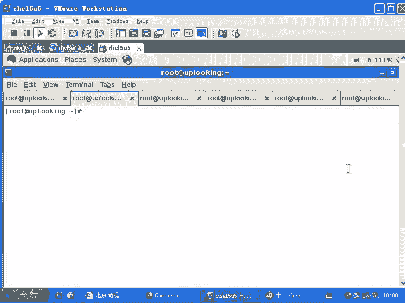
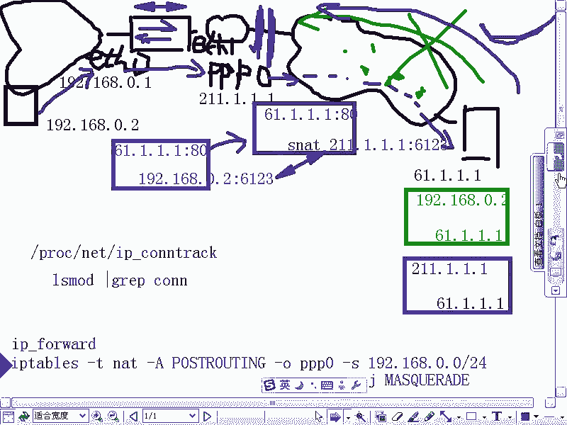
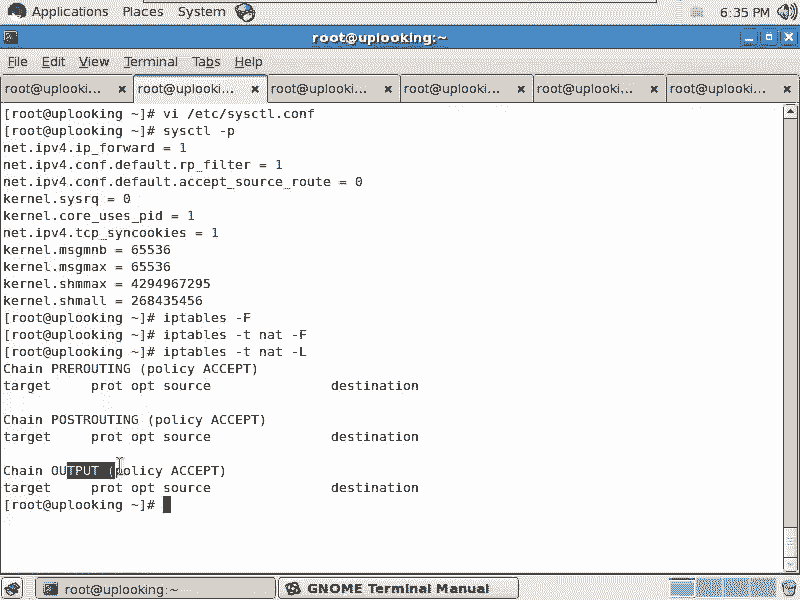
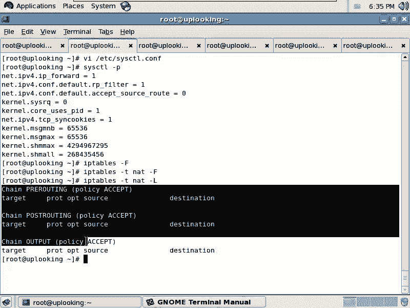
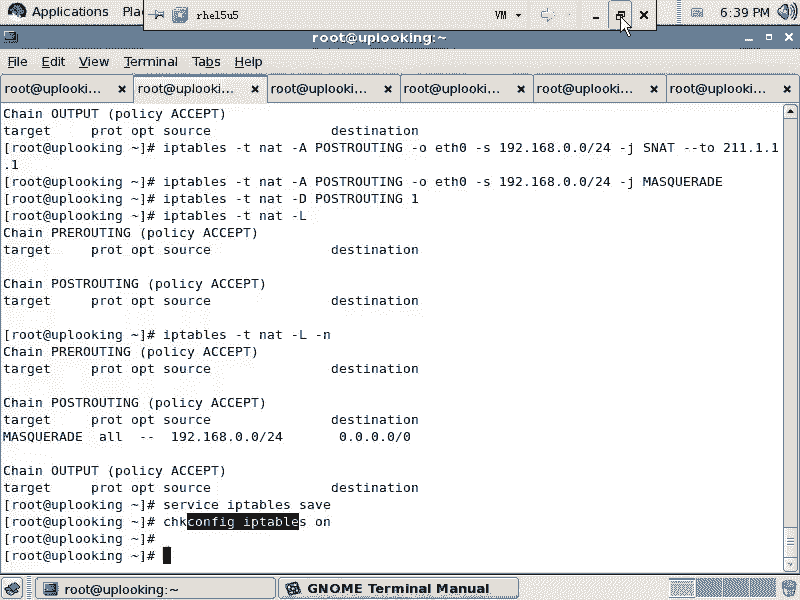

# 尚观Linux视频教程RHCE精品课程：P74：RH253-ULE116-5-1-iptables-snat-masquerade 🔧


在本节课中，我们将要学习iptables的NAT（网络地址转换）功能，特别是SNAT（源地址转换）和Masquerade（伪装）的应用。我们将了解如何让内网计算机通过一个网关共享上网，并深入理解其背后的工作原理。



## 概述：NAT的两种主要用途

iptables的NAT功能主要有两种用途。第一种是让内网用户共享一个公网IP地址上网。第二种是将内网的一台服务器发布到公网上，使其可以被外部访问。许多硬件防火墙正是基于这两种原理工作的。

上一节我们介绍了iptables的基础，本节中我们来看看如何利用NAT实现网络共享。

## NAT共享上网的工作原理

为了理解SNAT，我们需要先看一个典型的内网共享上网场景。假设我们有一台Linux主机作为网关，它有两个网络接口：一个对内（如eth0），一个对外（如ppp0，代表ADSL拨号连接）。内网有一台用户计算机需要访问公网上的服务器。

### 数据包的旅程与问题

当内网计算机（IP：192.168.0.2）试图访问公网服务器（IP：61.1.1.1）时，它会发出一个数据包。

这个数据包的**源地址**是 `192.168.0.2`，**目标地址**是 `61.1.1.1`。网关主机在开启IP转发（`ip_forward=1`）后，会帮助转发这个数据包到外网。

公网服务器收到请求后，会回复一个数据包。此时，回复数据包的**源地址**变为 `61.1.1.1`，**目标地址**变为 `192.168.0.2`。

这里就出现了关键问题：`192.168.0.2` 是一个私有地址（RFC 1918地址），在公网上有无数设备在使用相同的地址段。公网路由器无法识别这个数据包应该发往何处，因此会直接丢弃它。这就导致内网计算机收不到任何回复，无法正常上网。

### SNAT的解决方案

解决这个问题的办法是在数据包离开网关、前往公网之前，修改它的源IP地址。这个过程就是**源地址转换（SNAT）**。

具体来说，当数据包从网关的ppp0接口发出时，iptables规则会将数据包的源地址从内网地址（如 `192.168.0.2`）替换为网关的公网地址（如 `211.1.1.1`）。

转换后的数据包信息变为：**源地址** `211.1.1.1`，**目标地址** `61.1.1.1`。同时，系统内核会**自动记录**下这次转换的映射关系（即 `192.168.0.2:端口` <-> `211.1.1.1:端口`），并保存在 `/proc/net/ip_conntrack` 或相关文件中。

当公网服务器回复数据包到达网关时，内核会根据之前记录的映射关系，自动将目标地址从 `211.1.1.1` 转换回内网的 `192.168.0.2`，然后将数据包正确转发给内网计算机。

**整个过程只需要配置一条出去的SNAT规则，回来的转换是内核自动完成的。**

## 配置步骤详解

以下是配置网关实现共享上网的具体步骤。

### 第一步：开启IP转发功能

要让Linux主机充当路由器，必须开启内核的IP转发功能。

1.  编辑系统控制配置文件：
    ```bash
    vi /etc/sysctl.conf
    ```
2.  找到并修改以下行，将值改为 `1`：
    ```
    net.ipv4.ip_forward = 1
    ```
3.  使修改立即生效：
    ```bash
    sysctl -p
    ```

### 第二步：清理并查看现有规则

在添加新规则前，可以先清理旧的iptables规则，避免干扰。

```bash
# 清空filter表的规则（默认表）
iptables -F
# 清空NAT表的规则
iptables -t nat -F
# 查看NAT表的链
iptables -t nat -L -n
```

### 第三步：添加SNAT规则（静态IP情况）

如果你的公网IP是固定的（如 `211.1.1.1`），可以使用 `SNAT` 目标。

这条规则的意思是：在数据包路由之后（`POSTROUTING`）、从ppp0接口发出时（`-o ppp0`），如果源IP属于 `192.168.0.0/24` 网段（`-s 192.168.0.0/24`），就将其源地址转换为 `211.1.1.1`（`--to-source 211.1.1.1`）。

```bash
iptables -t nat -A POSTROUTING -o ppp0 -s 192.168.0.0/24 -j SNAT --to-source 211.1.1.1
```

### 第四步：使用Masquerade（动态IP情况）

对于ADSL拨号等动态获取公网IP的情况，IP地址可能会变化。使用 `MASQUERADE` 目标可以自动获取出口接口（如ppp0）的当前IP地址进行转换，无需手动修改规则。



```bash
iptables -t nat -A POSTROUTING -o ppp0 -s 192.168.0.0/24 -j MASQUERADE
```


**注意**：`POSTROUTING` 链与 `-o`（出口接口）选项以及 `SNAT`/`MASQUERADE` 目标是配套使用的。

### 第五步：保存配置并设置开机自启

确保配置在重启后依然有效。



```bash
# 保存当前iptables规则到配置文件
service iptables save
# 或使用
iptables-save > /etc/sysconfig/iptables



# 设置iptables服务开机自启
chkconfig iptables on
```

## 命令回顾与总结

本节课中我们一起学习了如何利用iptables的NAT功能实现内网共享上网。核心是配置一条 `POSTROUTING` 链上的SNAT或Masquerade规则。

整个过程可以简化为以下几个关键命令：

```bash
# 1. 开启IP转发
echo "net.ipv4.ip_forward = 1" >> /etc/sysctl.conf
sysctl -p

# 2. 添加Masquerade规则（适用于动态IP）
iptables -t nat -A POSTROUTING -o ppp0 -s 192.168.0.0/24 -j MASQUERADE

# 3. 保存规则
service iptables save
chkconfig iptables on
```



通过本节学习，你不仅掌握了让内网设备共享上网的配置方法，也理解了数据包在NAT转换过程中的完整路径和内核自动维护连接跟踪表的核心机制。这正是家庭或小型办公环境中路由器工作的基本原理。