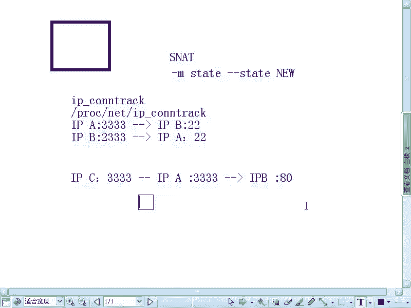
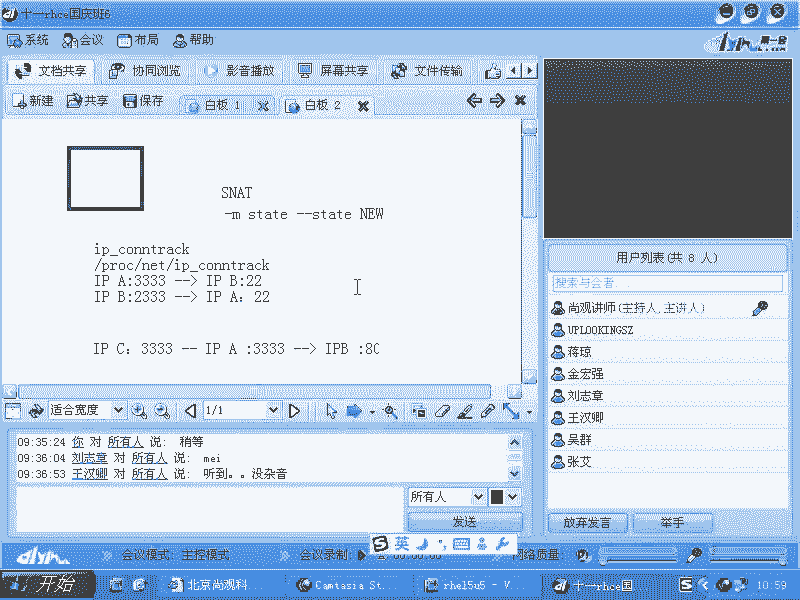

# 尚观Linux视频教程RHCE 精品课程 - P75：RH253-ULE116-5-3-iptables-ipconntrack - 爱笑的程序狗 - BV1ax411o7VD

好。我们现在要看的是IP tables的另外的一个功能，就是把内网的一个机器发布到外网上，就是内网机器的一个服务发布到外网。啊，刚才的话呢有一位同学的话呢，他问的我这个问题啊，我觉得是比较好。

怎么比较好呢？他呃有有一个质疑说什么你原来系统当中比方说啊就说那个。

就是他在说这个东西啊，就是说我现在的话呢，假如说有一个呃机器，它这个机器里面的话呢是有。IPCON的这个比说IP。下滑线CONN。TRAACK是吧，这个文件是吧？我说这个是个内核模块，对不对？

这个内核模块的话，它所对应的，你可以看它里面记录的东西，在PLOC下面呢呃n当中的有没有HV4啊？没有是吧。contract这个包里面呢，它会记录着就是他发送出去呃发送出去的数据包的这种跟踪的信息。

也就是什么时候他给谁发送一个数据包是吧？然后呢，我这边的话，谁通过我地址转化了一下，这个信息也会保留在里面，对不对？那么这个联想到什么呢？就是。我们记不记得原来的话有个叫做杠Mstate。杠杠。

state是吧new状态是不是这个东西的话呢，它也用到这个东西，也用到这个IPCN track这个文件这个模块啊，它用这个东西来做什么呢？他用这个东西来做什么？你看这个new状态。

我当时说如果要你想SSC去别人是吧？别人不能SSH去你。对不对？那你就控制说什么呢？new状态的处理包只有你给别人发，别人不能给你发是吧？然后于是的话呢，我们刚才有的同学说什么。

我给SS就给他了以后是吧？然后呢，我是不是跟他建立好连接了，是吧？然后呢，他又SS是我这个时候他发射过来的处理包，不就不是new状态嘛？就是establish状态了，是不是？😊，是不是这样的？不是啊。

因为连接是面向什么呢？面向IP加端口的。什么是 new状态呢？假如说在这个文件里面没有任何的信息。假如说我从来没有SSA过它是吧？那么没有任何的数据方，是不是？那么我在第一次SSA是对方的时候。

我的IP是不是？😊，IPA是不是加上我的一个随机端口，比方说3呃333啊随机端口啊，然后访问对方的什么呢？IP地址为什么B是不是？然后呢，端口是什么呢？

22端口是不是这个数据包是不是第一个由我来发给他的new状态，是不是？那你说这个连接一旦建立起来以后，它可以SS是我了，为什么呢？因为我已经SS是过它了，😊，他再发过来一个数据包。

是不是他就是不是 new状态了，是吧？嗯但是还是 new状态，为什么呢？因为我说的这个 new状态是什么呢？它是针对针对针对链接的这个链接的话是1个IP加一个端口，明白吧？

这个链接是不是最新最新的一个数据包啊，那他要发过发给我数据包的话，他发过来数据包，目标地址，是不是我的呃目原地址是他的这个IP地址，是不是他的1个IP地址，然后再加他的一个比方说一个随机的端口啊。

然后呢。😊，比方说他的一个随机端口访问什么，我的一个什么。😡，22是吧，那你看上面和下面它是同一个链接吗？不是是吧，所以的话我们说这个new还是什么established的它是针对什么？

针对我们的链接的这个链路一旦形成以后，那么它才会有established的是吧？那么你我SS你是一个链路，你SS我是另外一个链路，因为他们的端口是不同的，听楚了没有？那么同样也是一样啊。

还有一个道理是什么呢？就是说我们看这个共享上网，就是说呃SNAT呃SNAT的这个共享上网，它是怎么回事呢？它这边如果要是有一个机器叫做IP地址为什么？

C是不是IP地址为C它的话呢有一个端口是333端口啊，它的话呢去访问对方的一个访问对方的一个比方说80端口，它在我这边会记录出来什么呢？它转换成我的IP地址，我的IP地址是A是不是？

转说我的IP地址是什么？33端口，访问的对方的什么呢？访问对方的IP地址为B的什么呢？😊，打点当哥，我会把这个信息记录下来。清楚吧？那你看话说回来，如果要是大家局域网内的话呢，有100台机器。

我这边只有一台上网的服务器。那么。😡，我的国网地址有几个？😡，一个是不是嗯哎，我怎么为100个人服务呢？😡，一个机器过来的话，不是转化成过网地址吗？我给他做了一个映射吗？😡，那第二个机器人过来的话。

我没有额外的过往地址，再给他做映射了呀。对不对？所以如果要是按照刚才那种就是说。对链路的理解就是没有端口。对就是不是基于端口IP加端口这种链路的理解，那是不是100个就需要有100个什么过网地址。

是不是？所以的话我们说如果要是有端口的话，那就没有这个问题了。因为你记录的是什么？这个映射关系是不是这个映射关系是吧？这个映射关系是不是1个IP地址再加上一个端口啊？😊。

那么同样我这个机器的333就是4个3端口的话呢，被IP地址C给用了，是不是和它的这个端口用了。但是我是不是还有其他端口？所以的话呢我我的6万多个端口，我总共可以容纳什么呢？大家我不管你们有多少个客户端。

我最多可以容纳6万多个人通过我这边建立链路，明白吧？这就是他的这个理论上吞吐量。那实际当中的话NAT地址转换的时候，它的吞吐量可没那么大啊，几十人的话呢，就已经差不多了啊，二三十人的话。

就实际上是还可以100多人的话呢，就很慢了啊，上到一就是说看你这个每个人的上网的量是多少。如果大家都是非常用网络用的非常多的话，那就非常不行啊，就是非常差。如果要是用的网络稍微少点的话。

可能100人以上，那肯定也就不行了啊，那几十人的话呢，也是非常差。明白这个链路的情况了吧，这就是我们所谓的基于这个就地址转化的时候，他怎么样去记这个链路啊，它是通过这个文件自动去记的。记住了没有？😊。

有没有问题？这个信息大家可以自己看。如果你做了一个网关以后，你可以看一下这个IPCN track啊这样的一个包啊。

呃，这个这个模块，然后再看它的配置文件。好，我们的话呢这是CIPCON。

