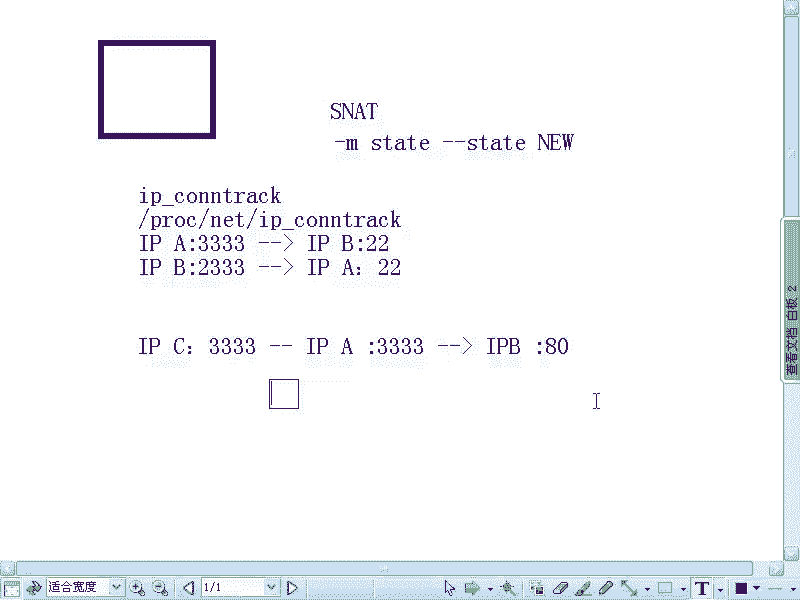

# 尚观Linux视频教程RHCE精品课程：P75：RH253-ULE116-5-3-iptables-ipconntrack

在本节课中，我们将学习iptables的另一个重要功能：将内网机器的服务发布到外网。这涉及到网络地址转换（NAT）和连接跟踪的核心概念。我们将通过理解连接状态和端口映射机制，来掌握如何实现内网服务的对外发布。

## 连接跟踪与状态机制

上一节我们介绍了iptables的基本规则，本节中我们来看看连接跟踪模块`ip_conntrack`及其如何定义数据包的状态。

`ip_conntrack`是一个内核模块，它负责跟踪所有经过系统的网络连接。其跟踪信息记录在`/proc/net/ip_conntrack`文件中。这个模块是实现有状态防火墙和网络地址转换（NAT）的基础。

### 理解连接与状态

连接跟踪的核心是识别一个“连接”。一个连接由**源IP、源端口、目标IP、目标端口**这四元组唯一确定。

当我们使用`-m state --state NEW`规则时，它判断的是一个**新连接**的第一个数据包。例如：
*   主机A（IP_A:随机端口333）首次访问主机B（IP_B:22）时，这个SYN包的状态是`NEW`。
*   连接建立后，后续在这个**同一四元组**连接上的数据包状态变为`ESTABLISHED`。

这里有一个关键点：**连接是双向但不对称的**。主机A SSH到主机B建立的连接，与主机B SSH到主机A是**两个完全不同**的连接（因为源端口和目标端口组合不同）。因此，即使A已经SSH到B，B发起的到A的新SSH连接，其第一个数据包对A的防火墙来说，仍然是`NEW`状态。

## SNAT与端口复用原理

理解了基于端口的连接后，我们就能明白SNAT（源地址转换）如何实现多台内网机器共享一个公网IP上网。

SNAT不仅转换IP地址，还转换**源端口**。转换记录（NAT表项）同样基于**IP地址+端口**的组合。

假设内网主机C（IP_C）使用端口333访问外网服务器B（IP_B:80），经过网关A（公网IP_A）进行SNAT转换。网关会记录如下映射关系：
`(IP_C:333) -> (IP_A:新端口X) -> (IP_B:80)`

这个映射关系被保存在`ip_conntrack`中。由于TCP/UDP端口有65535个，理论上一个公网IP可以同时为内网超过6万个连接提供NAT服务。当然，实际性能受硬件、带宽和连接活跃度限制，通常支持几十到上百个并发用户。

以下是SNAT端口复用的关键点：
*   **映射粒度**：NAT以“连接”（IP:端口）为单位进行映射，而非以“主机”为单位。
*   **端口资源**：一个公网IP的端口号是有限的资源，这限制了其最大并发连接数。
*   **性能影响**：NAT设备需要维护连接跟踪表并进行数据包改写，当连接数过大或流量很高时，会成为性能瓶颈。

## 内网服务发布（DNAT）

在掌握了连接跟踪和SNAT原理后，我们现在来看如何利用这些机制实现内网服务的发布，即DNAT（目标地址转换）。

DNAT通常用在PREROUTING链上，将到达防火墙公网IP特定端口的流量，重定向到内网的某台服务器。

例如，将公网IP的80端口流量转发到内网Web服务器（192.168.1.100:80）：
`iptables -t nat -A PREROUTING -d <公网IP> -p tcp --dport 80 -j DNAT --to-destination 192.168.1.100:80`

同时，为了让返回的数据包能正确通过防火墙，通常需要配置相应的SNAT或MASQUERADE规则（在POSTROUTING链上），修改返回数据包的源地址，使其看起来是从网关发出的。

## 总结

本节课中我们一起学习了iptables的连接跟踪与网络地址转换。
1.  我们首先了解了`ip_conntrack`模块如何跟踪网络连接，并明确了连接状态（NEW, ESTABLISHED）是基于**IP和端口四元组**进行判断的。
2.  接着，我们深入分析了SNAT的工作原理，明白了它是通过**转换IP和端口**来实现多台内网主机共享一个公网IP，其能力受端口数量限制。
3.  最后，我们探讨了如何综合运用这些知识，通过DNAT规则将内网服务安全地发布到外部网络。

理解连接跟踪是配置复杂防火墙和NAT规则的基础，它使得iptables能够智能地识别和处理不同状态的网络流量。