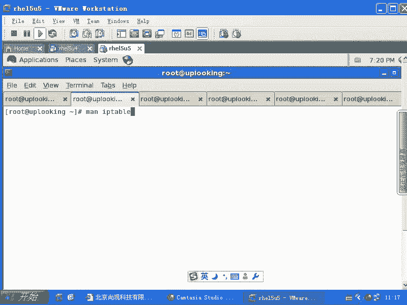

# 尚观Linux视频教程RHCE 精品课程 - P76：RH253-ULE116-5-3-iptables-squid - 爱笑的程序狗 - BV1ax411o7VD

还有一点的话呢，我要跟大家说一下，就是我们的共享上网。共享上网的话呢，我们刚才我们原来是不是跟大家说过一个什么IP tables的ma read，是不是？Masquerade。啊。

但是呢我们的共享上网这样的一台启用了mascuate的主机。他想让大家一块上网的话呢，它总是有它自己的这个局限性是吧？假如说它的网速它的这个CPU的占用率太高，或者说它后面的这个链路的话呢太太少。

就是它后面这个链路啊。太太窄，就是两兆带宽是吧？但是我现在有七八十人要上网。这个时候的话呢，我们就要采用一些，比方说也是ip tables，但是ip tables的相当于NAT的第三个应用就是什么呢？

让它去呃加就是加速上网，就是把直接用什么呢？透明代理去上网，明白吧？就是透明代理是它的第三个应用。透明代理的话呢，实际上就是杠TNAT啊，然后呢，杠呃A啊在post。在priroing啊。

在preroing的时候，他用的啊这个的什么机理呢？我们给大家看一眼。

这是什么机顶呢？我们给大家看一下。也就是说，当我现在的话呢，有一个。当然我现在的话呢有一个防火墙，有有一个这个网关啊，这个网关的话呢里面的话呢有太多的机器，这些机器的话呢都上网。

但是我这边的这个带宽的话呢非常的窄。我这个带宽的话呢只有两兆。两兆。那这时候的话呢，我希望让所有的这些人啊通过去上网的时候，比方说他们去访问网页的时候，实际上我这边的话呢，有个代理服务器。

把他们的数据缓存起来。啊，也就是说第一个人的话想访问新浪的时候，他访问新浪，他通过我这边真正的m read，然后呢再去什么访问我真正的新浪的这个服务器是吧？这边的话呢，他得到这个数据了以后。

这个数据的话呢，被什么缓存在这个地方，是不是？那么当第二个人再去访问的时候，然后第二个人的话再去访问的时候，他的话呢就根本就没有这个过程，没有这个到这个。公网上的过程。

因为你刚才数据是不是已经缓存在这里面了，是吧？那我就直接从这里面的话呢，获取数据，然后传给第二人。因为新浪的话可能很多人都想看，对不对？一看的时候的话呢，一开始10个人看就十0份流量，是不是？

但是我第一个人看留这个缓存缓存起来。那么剩下9个人访问的时候，是不是都占我的内网的带宽，公网的话就没有了，是吧？😊。

这样的话就要求大家话在IE里面或者是浏览器里面设置一个什么统一的一个什么统一的一个代理服务器，是不是？但是你会设代理服务器吗？你除了去什么翻墙的时候要射之外是吧？然后呢还是自动射。

然后其他时候一般都不射。不设置自呃不设置这个代理服务器，不设在，因为太麻烦了。但是我们能不能让他们。😡，不知不知不觉当中的话，就用到了代理服务器。😡，你想他们这边是不是有个统一的特征。

他们访问的对方都是访问的什么？是不是都访问对方的80端口啊，你能不能实现这个呢？你看他们如果要都访问的是。是不是都是访问对方的80端口？🤧我们能不能访问80端口的这种数据包。

全部都重定向到我们自己的一个这台机器上的代理服务器去，对不对？这就是我们要做到的。所以呢这里面我们要给大家隆重介绍一个成员啊，screen。🤧SQUID是吧，screenet的话呢它的配置文件在哪呢？

在ETC下。SQUID啊当中的SQUID点comM对吧？是这个配置文件吗？我们一会儿看一下啊。在这里面的话呢，你让s去监听着自己的这个IP地址。呃，让他去监听什么呢？让sspet去监听。

比方说默认情况下，screened监听是3128端口，对不对？它默认情况下监听3128端口。也就是说大家访问冒号80的时候，就是80端口的时候，被怎么样呢？被重定向到3128端口去。

你还以为你在访问新浪是吧？其实全是在给谁呀？对的。😡，发信息是不是？那我们这边的话就要用到什么地址转换，这个地址转换怎么做呢？我们看一眼啊我们看一眼。

这边的话呢要看一下我们的这个呃IP tables的man配置啊，man IP tables。

我要查找的参数是什么呢？我要查找参数大。杠杠t2。What。好。这个时候的话呢，你需要的是重定向功能啊，重定向功能实际上是还是在什么？你们你们你们回头看一下这个端口，呃，你们回头看一下这个啊。啊。

纯肉体。你们学觉得这个时候的话应该是proing还是post roing？就是说我想达到个什么程度？我是大家的这个教师机，是吧？你们的话都是什么呃，学生就是学生的机器。通过我想去上网。

但是呢我想让你们达到一个什么目的呢？第一个人访问希腊，我会帮他去把那个页面真正拽过来是吧？缓存到我记上。第二人访问的时候。就直接从我这个代理服务器当中去找找数据了。

第三个人访问也是直接从我代理服务器上当中去找数据了，我就不去希望去了，就不去占用我的internet带宽，是吧？那你们想你们原本发射出来的数据包，目标地址是不是？相应的主机的什么？80端口对不对？

我想让你们在访问目标的那个端口，目标那个IP地址之前是吧？我就把你们重定向到我自己的什么3128端口上去。😡，了不明白？那么这个应该是在pre柔ing的时候，还是po柔ing的时候？

毫无疑问是preroing为什么呢？因为toroing都是我要发射出去了是吧？我要把这个书包都给你发送发送出去了，那当然就没有用了，都已经output的都结束了，对不对？所以我只有在什么？

我真正处理你的数据包之前，我就把你的端口怎么样？和目标地址全都转换成我自己的是不是？所以这样的话才行。所以在preroing的时候，那么来自于什么呢？从I啊，在在从哪进入呢？ETH0进入是吧？

在S192。168。😊，点0。0这个网段是不是？24这个网吧是吧，杠。杠PTCP然后呢，杠杠Dport访问80端口的这种数据包。咱80端口的数据包，然后我再怎么样呢？我再去。这样我就直接输吧。

我怕又给大家有困扰。然后呢，杠J就是什么呢？re。Direct。arery direct啊，然后呢，这边是杠杠two。干破。3128。这样的会撤。明白不明白。在preing的时候。

就是在我真正处理这个数标之前，然后我就要把你的地址转改掉了，改成什么呢？改成一个呃目标地址为3128端口，目标呃目标端口为3128端口，目标地址为什么？我自己的。😡，比192。168。0。54啊。

就是0。1，这是我的网关，就是连接大家那个内网的IP是不是？我改成这个内网IP的内网的这个端口，内网IP上的这个端口。然后呢，我的set刚好在监听了什么3128端口。这样的话呢。

你们只要访问外网的80端口的数据包全部都重定向到我自己的这个呃我自己的3128端口上去了。这样的话，是不是在你们不知不觉当中就被转化成什么，就就被那个设置成这个呃就是使用代理方式了，是吧？

不需要配置IE浏览器。😊，你访问自己吗？你访问的是外网，你实际上是访问的我。😡，就是你是台学生机吗？😡，你是一台内网的机器吗？那么你你还以为你访问的是新浪是吧？其实你的数据包在中途已经备过什么截货。

传到了我自己的3128端口上去，是不是我在3128端口是谁在进行监听呢？是一个代理服务器在监听。这个代理服务器一看啊，你想看新浪是吧？我帮你去看啊，然后呢，这个cr他就从真正的新浪服务器那边拿到数据。

缓存在自己机上，然后把这一份数据给你。当第二个人访问的时候，他的话呢就不用经过我scret再去外网上去找了，明白吧？同样的一个网站他就直接从缓存当中，把数据给给那个第二个人，所以第三个人，第四个人。

第五个人他都会怎么样呢？都会直接拿到这个数据包啊。😊，明白了吗？透明代理。😡，清楚了没有？这样的话可以极大的节省你的什么数据量。😡，但是这个东西的话呢，在目前来看啊在目前来看。不是特别好了。

以前的话比较好用，现在不好用。为什么呢？因为现在的话大家动不动就上视频是吧？然后呢看大片是不是你那那东西怎么缓存？😡，是不是？所以说现在很多的这个就是带宽的话不够用，是因为你看了太多视频等等这些东西。

其实我们如果要是。当然你要封掉视频的话，那，可能就引起公愤了是吧？然后不能上开心网之类的啊，这样的那那就因为你知开心网它怎么缓存，我登录上去是我的界面是吧？你登录上去是你的界面，对的？那怎么缓存？😊。

是，所以这种动态网页是没有办法的。还有的话呢那种视频或者特别大的文件它是不缓存呢啊。还有的话呢就是说你现在的话呢要去VI啊，ETC下的screend。QUSQUID啊当中pird。点com打开这个文件。

这个文件是sdscreend的话呢，它在这个咱们现在用的是screend2。6。原来sd2。4的时候的话呢，是另外一种配置方法。scrd2。6的话呢，在这里在这里面的话呢，它的配置方法就不太一样啊。

默认情况下，你启动它它是监听3128端口，它监听3128端口。看一下啊。set我们再再稍后再讲啊，也就是大家记住啊，sspet它同时还要再配置，也就是你不是这样配置完就完事了。然后呢。

你再去check啊配置配置完以后的话，sed当中on啊，然后呢service。Set。Star。这边因为咱们讲的IP tables啊，把IP tables讲完。这个地方的话呢就是透明袋。

