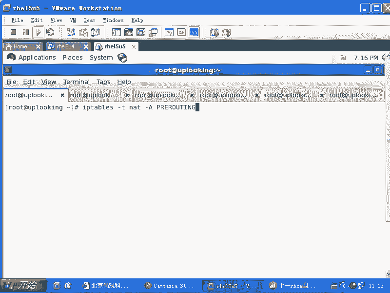
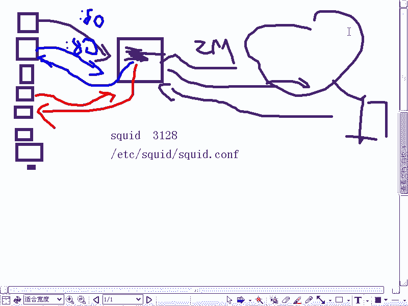
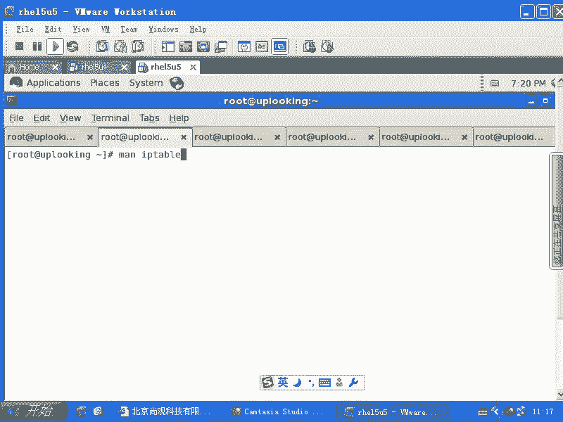
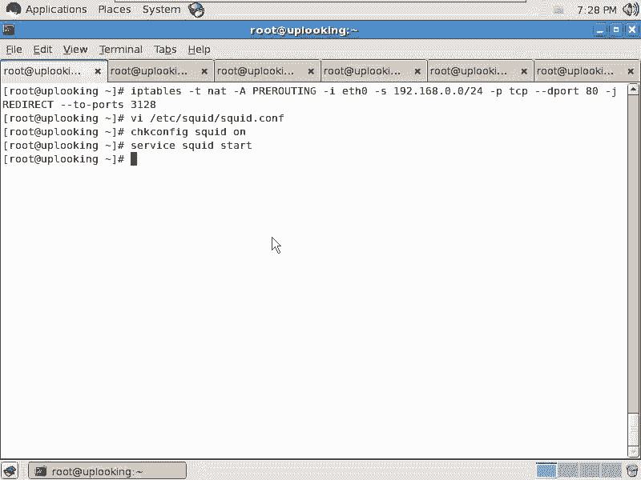

# 尚观Linux视频教程RHCE精品课程：P76：RH253-ULE116-5-3-iptables-squid


## 概述
在本节课中，我们将要学习如何使用iptables的NAT功能结合Squid代理服务器，实现一种称为“透明代理”的共享上网技术。这种技术可以在不修改客户端浏览器设置的情况下，将用户的网页访问请求自动重定向到代理服务器，从而节省公网带宽。




## 共享上网的局限性
上一节我们介绍了使用iptables的`MASQUERADE`进行共享上网。本节中我们来看看它的局限性。

一台启用了`MASQUERADE`的主机作为网关，其性能受限于自身的CPU、内存和网络带宽。例如，当网关只有2Mbps带宽，却需要为七八十台客户端提供上网服务时，网络就会变得非常拥堵。

## 透明代理的原理
为了解决上述问题，我们可以采用iptables的第三种NAT应用——透明代理。其核心思想是：将内网用户访问外网80端口（HTTP服务）的请求，在网关处自动重定向到本地的Squid代理服务器端口。

### 工作流程
以下是透明代理的工作流程：
1.  第一台客户端访问新浪网站时，其请求被网关重定向到本地的Squid代理。
2.  Squid代理作为客户端，向真正的新浪服务器发起请求，获取数据。
3.  Squid将获取到的网页数据返回给第一台客户端，同时将数据缓存在本地。
4.  当第二台客户端访问相同的新浪网页时，其请求同样被重定向到Squid。
5.  Squid发现该网页已缓存，便直接将缓存的数据返回给第二台客户端，无需再次访问外网。

这样，对于热门网站，只有第一个访问者会占用公网带宽，后续访问者都从内网缓存获取数据，极大地节省了带宽资源。

## 配置iptables实现端口重定向
要实现透明代理，首先需要在网关上配置iptables规则，将内网的HTTP请求重定向到Squid服务。





### 规则解析
我们需要在`PREROUTING`链（数据包进入路由决策之前）上添加规则。这是因为我们需要在数据包被发送到外网之前，就修改其目标地址和端口。

以下是核心的iptables命令：
```bash
iptables -t nat -A PREROUTING -i eth0 -s 192.168.0.0/24 -p tcp --dport 80 -j REDIRECT --to-port 3128
```
*   **`-t nat`**: 指定操作`nat`表。
*   **`-A PREROUTING`**: 在`PREROUTING`链末尾追加规则。
*   **`-i eth0`**: 匹配从内网接口`eth0`进入的数据包。
*   **`-s 192.168.0.0/24`**: 匹配源IP为内网网段`192.168.0.0/24`的数据包。
*   **`-p tcp --dport 80`**: 匹配目标端口为80的TCP数据包（即HTTP请求）。
*   **`-j REDIRECT`**: 执行`REDIRECT`动作（目标地址改为网关自身IP）。
*   **`--to-port 3128`**: 将目标端口重定向到`3128`（Squid默认监听端口）。

执行此规则后，所有来自内网`192.168.0.0/24`网段、访问外网80端口的请求，都会被自动重定向到网关本地的`3128`端口。

## 配置Squid代理服务器
仅仅配置iptables还不够，我们还需要在网关上安装并配置Squid服务来监听`3128`端口并处理请求。

Squid的主配置文件位于`/etc/squid/squid.conf`。在较新版本的Squid（如2.6）中，默认配置通常已监听`3128`端口。我们需要确保服务正常运行。

以下是启动Squid服务的命令：
```bash
service squid start
```
或者（取决于系统）：
```bash
systemctl start squid
```

**注意**：透明代理对Squid配置有额外要求（例如设置`http_port`为透明模式），更详细的Squid配置超出了本节iptables课程的范围，但请记住，两者必须配合使用。

## 透明代理的适用场景与限制
透明代理技术有其特定的适用场景和限制。

它非常适合缓存静态网页内容，如新闻网站、软件下载站等。对于这些内容，缓存效果显著。

然而，在当今互联网环境下，透明代理的效用有所降低，原因如下：
1.  **动态内容无法缓存**：例如社交网站（如开心网）、个人邮箱页面等，内容因人而异，无法通用缓存。
2.  **流媒体与大数据**：在线视频、大型文件通常不被缓存或缓存效果差。
3.  **HTTPS加密流量**：访问`https`网站（端口443）的流量是加密的，无法被透明代理解析和缓存。



## 总结
本节课中我们一起学习了iptables结合Squid实现透明代理的技术。我们首先回顾了传统`MASQUERADE`共享上网的带宽瓶颈，然后介绍了透明代理通过缓存机制节省带宽的原理。接着，我们详细讲解了如何使用`iptables -t nat -A PREROUTING`规则将HTTP流量重定向到Squid代理端口，并简要提及了Squid服务的配置。最后，我们讨论了透明代理技术的优势与当前面临的限制。掌握这项技术，有助于你在特定网络环境下优化带宽使用。