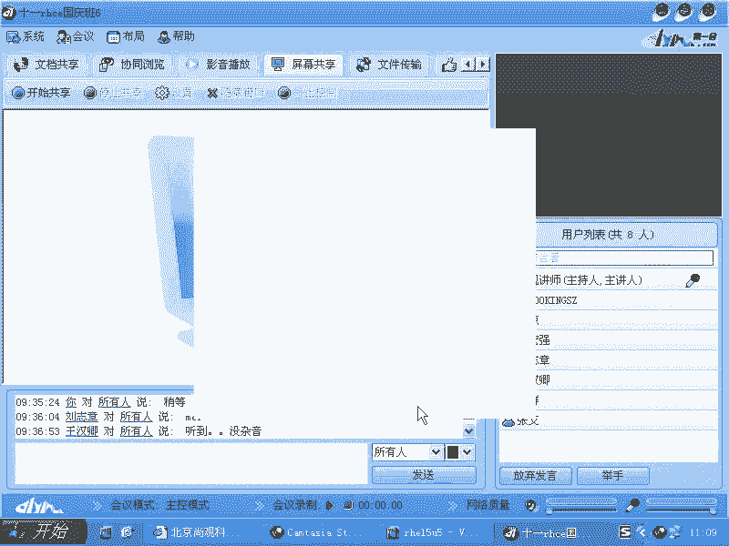

# 尚观Linux视频教程RHCE 精品课程 - P77：RH253-ULE116-5-4-iptables-prerouting - 爱笑的程序狗 - BV1ax411o7VD

我们来看一下我们的。就是NAT的第二功能，就是入站的这个功能啊，入站的这个功能。

稍等一下。好。

happy tables我们说它有。杠TNAT。它有什么呢？杠A啊，叫做什么呢？pos周体。刚才我们是用的是不是？那么刚好的话呢，把内网的一个机器的话呢，发布在外网上去。

用的到用到的就是什么prity啊，我们现在看一个画一个图啊，画一个图。

现在的话我有一台有有一个机器，才是我的网关啊，这个网关的话呢，内内部的话呢有几台机器。比方说它是一个硬件放有权或者这个网关都是可以的。那么我能不能让我的这个内部的一个机器，比方说我这台机器的话呢。

有一个什么呃，1921的8。0。1是吧？有一个什么呢？80端口。啊，0。2啊。那么这边的话呢是。192。168。0。呃，5这台机器的话呢有一个比方说25端口啊。

那么我能不能把这个内网的外服务器和这个内网的email服务器发布在外网上去，也就是他们的话呢具备的都是什么？他们具备的都是内网的IP地址，对不对？都是内网的IP地址，这个内网的IP地址，大家知道。

如果要是想让我们的internet上有人可以去访问internet上样的话呢，有人可以访问，比方说有一个。有个人是吧，他在家里面的话。

拿个笔记本想去访问你的这个公司的这个web服务器或者公司的这个email服务器。这个时候啊这个是25端口，25端口的话就是SMTV端口，对吧？他想去访问，那么他的这个数据包如果要是写成这样的。

就是1个IP地址是什么呢？192。168。0。多少多少，他能访问到这边吗？那肯定仿不到。因为这样的数据包在网互联网络上会被干掉，对不对？它会被干掉的。所以的话呢我们就不能这样做啊，这样肯定不行。

于是的话呢，我们这个数据包的话呢也不能这样去写。所以的话到时候我们还是要怎么样，还是要重新去写一下。就是把它进行地址转换。那么这边话说回来还是这样，我现在的话呢由。这个网关的话呢，有两个。

网络接口这个网络接口上是什么呢？211。1。1。1是不是？然后呢，我通过3W的解析，我解析的成什么呢？然后把3W点，比方说ABC点com的域名解析成什么呢？211。1。1。1，对吧？提用这个。

当我们的这台机器啊，就是当我们的这个后面的这个人的话呢，他去访问3W点ABC点com的时候，解析成这个IP。但是呢我想让他访问这边的这个80端口的时候，访问的是内部的这个80端口。对吧那需要怎么做呢？

你需要在这边这个数据包到达这个地方了以后，在preing的时候，就把它的目标地址改成什么0。2。明白了吧？改成0。2。所以的话呢我们要加这样一条规则。首先的话还是要什么IP。IP4的打开是不是？

然后呢ip tablesip tables。😊，杠TNAT杠A在pre。在ing的时候，我要加一个协议了。杠P什么协议呢？是TCP协议。杠杠Dport是什么80端口啊，那么目标端口是80端口的时候。

然后呢，你可以加上一个什么杠I参数。我们知post routing它是跟谁呀？它是跟杠O参数器搭配。preing跟杠I通过我的什么PPP0进来的是吧？

根据根呃就是根据我们PPP0进来的这个通过这个接口进来的这个数据包，然后同时访问的是我80端口的时候，那我就怎么样？其实我这边的话还应该加上一个我自己的一个呃自己的一个这个嗯211。1。1。1，是不是？

但是我不加的话呢，可能会有问题啊，但是因为我有的时候是用ADSL拨号，所以的话那个IP地址的话可能老会变，是不是？所以我就这样了，这样改完以后的话呢，这边杠J杠J怎么操作呢？杠G。呃。DNAT。

来源地址转换它是跟postroing相匹配SNAT跟poroing相匹配，是不是DNAT是在什么？preroing的时候这个这个起作用，是不是呃。

preroing是跟DNAT那我这边就是什么杠杠two是不是to什么呢？19218。0。2冒号80。😊，这样的话呢，我们就把这个IP地址进行了转换，转换成了内网的1个IP地址。然后呢。

接下来大家看这个preing的话，这个时候大家就能理解了。preuting是在路由规则发生之前是吧？也就是说我本来访问的是你本机，对不对？😡，访问你自己的这个机器。

因为211这个IP地址是绑在我自己机器上，是不是？😡，但是我在路由规则发生之前，我就把你的目标地址转换成我另外一台电脑，是不是？😡，那你说路由规则发生了就是发生的时候。

他是不是看到的这个数据包是谁的数据包？😡，就是说访问内网另外一台机器的，是不是？于是我就会把它什么。😊，给给那个我们的那个后面那台机器，它就叫prerooting，就是路由之前明白吧？

所以这个prerooting的话呢，你这个时候你就觉得它作用非常的大，是不是作用非常大？😊，那如果要是你是呃你是假如说你不是pre，假如说啊我知道NAT规则当AAT table当中不包含input是吧？

但是你在input那个地方，你把它的目标地址转换，那就没有任何意义了。它的转转换完以后，人家路由规则都发生完了，是不是？这个数包还是你拿着呢。😊，清住吧，就相当于有一个人递一个包裹啊，递到什么呢？

楼下的那个传达室那个地方啊，但是传达室之前啊就是传达室就相当于一个路由规则嘛，是吧是？他该才分分到哪个大楼里面是吧？在传达室之前就是给那个楼楼底下那个老大爷之前是吧？

那么有另外的一个什么有另外的一个邮局的人，或者说在大厦之外，他的话呢一看咦你这个地址是给谁是谁的，是吧？我把你地址先转了，改了以后的话呢，这个这个在给我们那个就是负责分发的这个数据包的这个人，然后呢。

他就会给你按照新的路由规则的话，来传递书包，但是你这个数据包已经递到什么，我们前台了以后，那这时候这个前台的话呢，他没有这个路由的功能是吧？他即使拿到这个书包已经看到说什么，你访问的是别人。

他也不会再到出去是吧？然后再送到北京，因为他这是不是他在在他的职责之内，明白吧？路由规则已经发生完毕了，明白吧？你只有在楼。😊，下的那个人是吧，楼下那个老大爷，他他拿到数据包之前。

你改这个目标地址才有效。你已经传到我们公司了，然后你把那个地址又改成其他公司，那是没有任何用的。清楚了没有？所以这个pro就是做这个用的，清楚了吧？😡，priingproing。

所以的话这时候你能充分的理解这个proing到底是什么作用啊。proing到底什么作用？所以的话呢我们这边转化完了以后啊，那么这个时候你在这边照样会有一个什么，照样会有一条新的什么对应关系产生，明白吧？

这个是标在回来的时候还是会自动的什么给它转回来。自动给他转回来。明白吧？那如果要是你加上一个mscu rate的话，那就是大家又可以什么上网啊。清楚没有？是这样。在谈到preing了以后，我们想啊。

如果要是我自己再设置一个什么这样的一条规则，然后我自己访问自己行不行？我自己设定一条规则以后，我自己访问我的211。1。1。1的80logo，我希望他把我转换成1922的8。0。80是吧？也不行啊。

因为的话呢，你只有找另外一台机器访问你自己的时候，那个prooting才会生效啊，你自己访问自己的话，直接就input了。明白了吧？直接就是input。好，这边的话呢跟大家说了一下以后，我们再看一眼啊。

就假设说我现在在这个呃这里面的话呢已经。就是说可以让大家去呃。可以让大家去。就是这个把把这个内网的这些机器发送出去了。我们看一下这个命令啊，实际的命令的话呢，书写一下啊，看有没有什么问题。

因为不验证的话，总是会有问题啊。县政府不会吗。

好，那么杠TAT在pro柔ing的时候。杠S啊哎杠PTCP杠杠Dport是吧，80，然后呢杠。IETH本来应该是PPP0，是不是？那我把它改成什么呢？ETH0，然后呢杠J然后呢DAT。

然后杠杠t什么的1918。0。2的什么的冒号80灯塔啊，直接回车这样的一条规则的话呢就写好了。对不对？这样子写好了。所以的话呢就是把我内网的机器发布出去啊，内网机器在这个preing的时候发送出呃。

就发布出去。就直接把数据包改掉了，这是我们的另外一个功能。另外功能。那么很多的硬件防火墙就是这样做的。硬件防火墙，他把所有的数据包全部都进行什么筛选。他看到这个数据包是什么呢？

是一个呃80端口的数据包啊，访问80端口数据包。我把我内网的一个机器的话呢，发布出去，但是你访问我其他的端口，你攻击我其他端口全部都是在攻击那个路由器呃，那个硬件防火墙，那么硬件防火墙的话呢。

如果要是被攻击的非常猛的时候，它的CPU障率是非常高是吧？但是呢不会影响后面的机器，因为后面的机器只会把什么？它只会把80端口的访问发到什么我们的后面的机器上去是吧？当然了。😊，在转发的时候的话呢。

它也可以过滤这个数据包。你假方说发现的话，这是S one的洪水攻击。于是的话呢，它会采用其他的方法，然后把这个数据胞的话呢转发到后面去啊，比方说叫做S one proxy啊等等这些技术啊。

这个硬件防火墙的话就承受的攻击。所以这也是我们很多防火墙的话呢可以用到的。

不要忘了I forward要打开啊，I forward要打开。

好。