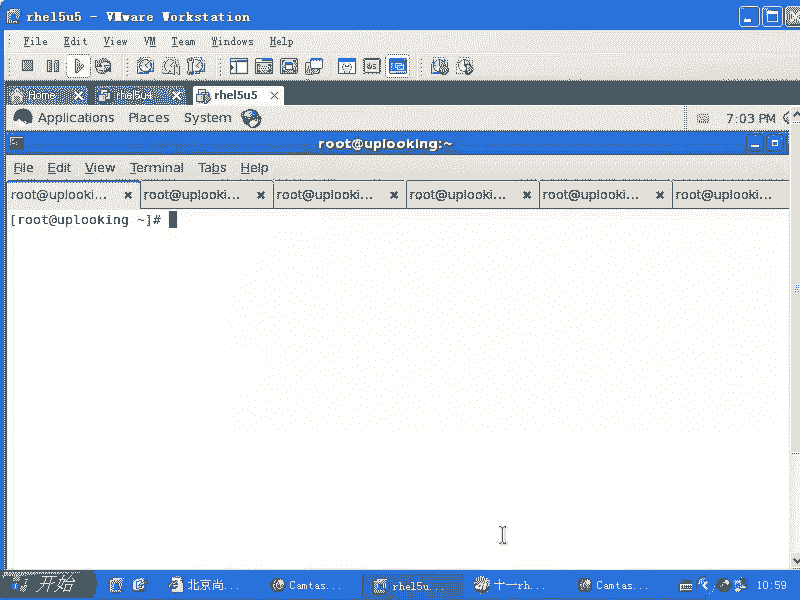
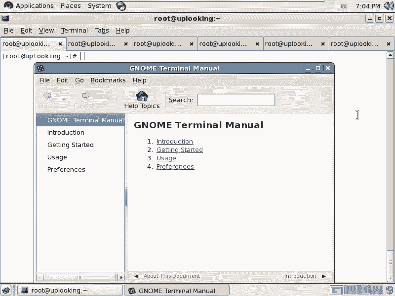
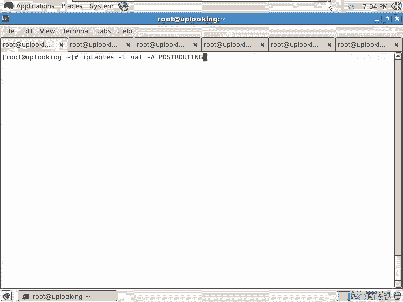
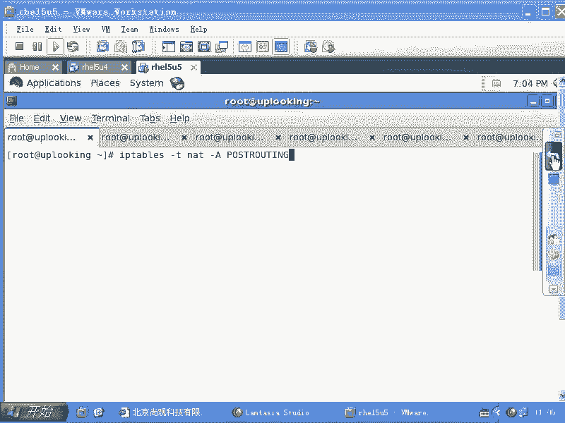
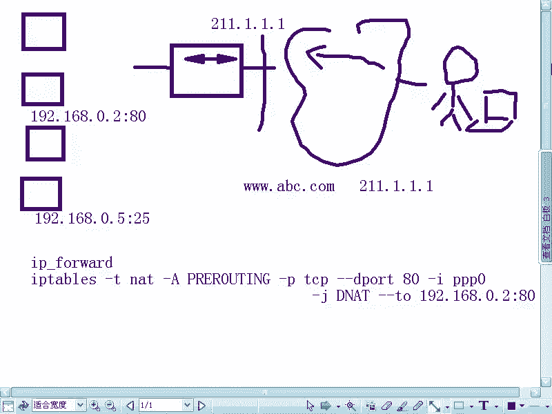
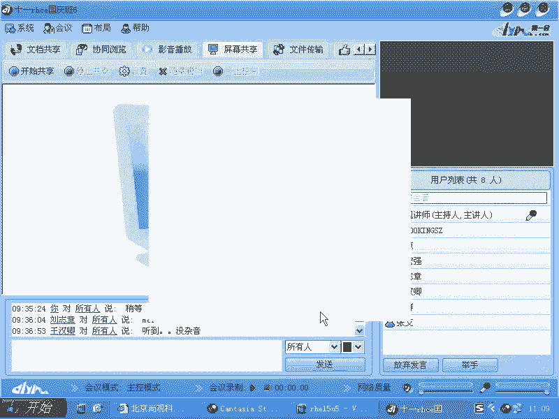
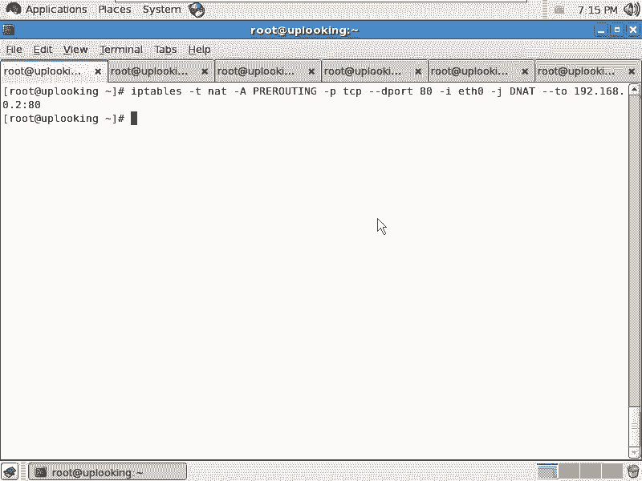
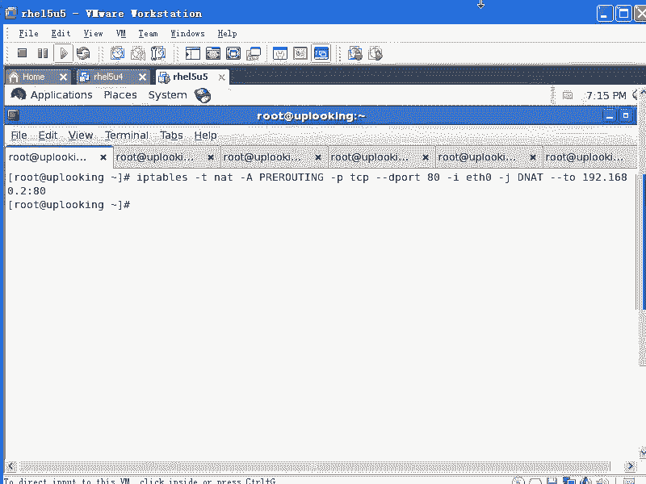

# 尚观Linux视频教程RHCE精品课程：P77：RH253-ULE116-5-4-iptables-prerouting 🔧






在本节课中，我们将要学习iptables的第二个重要功能——入站NAT，也称为端口转发或DNAT。我们将通过一个具体的例子，理解如何将内网服务器的服务（如Web或Email）安全地发布到外网，供互联网用户访问。





---

## 概述与场景引入

上一节我们介绍了出站NAT（SNAT），它解决了内网机器访问外网的问题。本节中我们来看看入站NAT，它解决的是相反的需求：如何让外网用户访问我们内网的服务器。

假设我们有一个典型的网络环境：
*   一台**网关服务器**，拥有两个网络接口。
    *   一个接口连接内网，IP为 `192.168.0.1`。
    *   另一个接口连接外网，IP为 `211.1.1.1`。
*   内网中有两台服务器：
    *   **Web服务器**：IP为 `192.168.0.2`，开放80端口。
    *   **Email服务器**：IP为 `192.168.0.5`，开放25端口。

外网用户无法直接访问 `192.168.0.x` 这样的私有IP地址。为了让用户能通过公网IP `211.1.1.1` 访问到内网的Web服务，我们需要在网关上设置规则，将指向 `211.1.1.1:80` 的访问请求，“转发”给内网的 `192.168.0.2:80`。这个“转发”的核心就是修改数据包的目标地址，而这个修改动作发生在 **PREROUTING** 链。

---

## 理解PREROUTING链的关键作用

PREROUTING链是数据包进入网卡后，**进行路由决策之前**必经的一个点。这是实现入站NAT（DNAT）的理想位置。

我们可以用一个比喻来理解：
*   **网关服务器**就像一栋大楼的**前台/传达室**。
*   **PREROUTING链**发生在大楼**门外**，快递员刚拿到包裹时。
*   **路由决策**是前台根据包裹上的地址，决定是送到本大楼的某个房间（INPUT链），还是转送到其他大楼（FORWARD链）。

**为什么必须在PREROUTING做？**
如果等数据包已经到了“前台”（即已完成路由决策，进入INPUT或FORWARD链），你再把目标地址从“本大楼A房间”改成“隔壁大楼B房间”，前台是无法处理的，因为它的职责范围仅限于本大楼。只有在数据包进入大楼门之前（PREROUTING），修改目标地址，前台才会按照新地址进行路由，将数据包正确地转发（FORWARD）到内网的真实服务器。

因此，`PREROUTING` 是实现“端口转发”或“内网穿透”功能的关键。

---

## 配置入站NAT（DNAT）规则

以下是配置一条DNAT规则，将外网对网关 `211.1.1.1:80` 的访问转发到内网Web服务器 `192.168.0.2:80` 的命令详解。

**核心命令公式如下：**

```bash
iptables -t nat -A PREROUTING -p tcp --dport 80 -i eth1 -j DNAT --to-destination 192.168.0.2:80
```

**对命令各部分的解释：**

*   `-t nat`：指定操作 `nat` 表。
*   `-A PREROUTING`：在 `PREROUTING` 链末尾追加一条规则。
*   `-p tcp`：匹配TCP协议的数据包。
*   `--dport 80`：匹配目标端口为80的数据包（HTTP服务）。
*   `-i eth1`：匹配从外网接口（例如 `eth1`，假设这是连接外网的网卡）进入的数据包。这个参数与 `PREROUTING` 链紧密相关。
*   `-j DNAT`：跳转到 `DNAT` 动作，即目标地址转换。
*   `--to-destination 192.168.0.2:80`：将数据包的目标地址和端口修改为指定的内网服务器地址和端口。



**重要注意事项：**
1.  **网卡接口**：`-i` 参数应设置为接收外网数据流的物理接口（如 `eth1`, `ppp0` 等）。
2.  **INPUT链的局限性**：即使你在 `INPUT` 链尝试做DNAT，也不会成功，因为路由决策在它之前已经完成。自己访问本机公网IP `211.1.1.1` 的流量会直接进入 `INPUT` 链，而不会触发 `PREROUTING` 链的这条DNAT规则。
3.  **连接跟踪**：和SNAT一样，DNAT也会自动利用 `conntrack` 模块建立连接跟踪。当内网服务器返回数据包时，系统会自动将源地址改回网关的公网IP，确保往返通信的连贯性。
4.  **开启内核转发**：必须确保网关服务器的IP转发功能是打开的，否则数据包无法被转发到内网。
    ```bash
    echo 1 > /proc/sys/net/ipv4/ip_forward
    ```
    或永久修改 `/etc/sysctl.conf` 中的 `net.ipv4.ip_forward = 1`。



---

## 实际应用与总结

本节课中我们一起学习了iptables的PREROUTING链和DNAT目标。

*   **PREROUTING链** 是数据包路由前的“预处理”阶段，是修改数据包**目标信息**（如DNAT）的理想位置。
*   **DNAT（目标地址转换）** 是入站NAT的核心，它能够将指向网关公网IP和端口的访问，透明地转发到内网指定的服务器上，从而实现内网服务的对外发布。
*   这种模式广泛应用于硬件防火墙、路由器中，它们将公网流量筛选并转发到受保护的内部服务器，自身承担第一道安全防线的角色。





通过组合使用SNAT（解决内网出访）和DNAT（解决外网接入），我们可以构建一个功能完整的网络地址转换方案，有效地管理企业或家庭的网络流量。