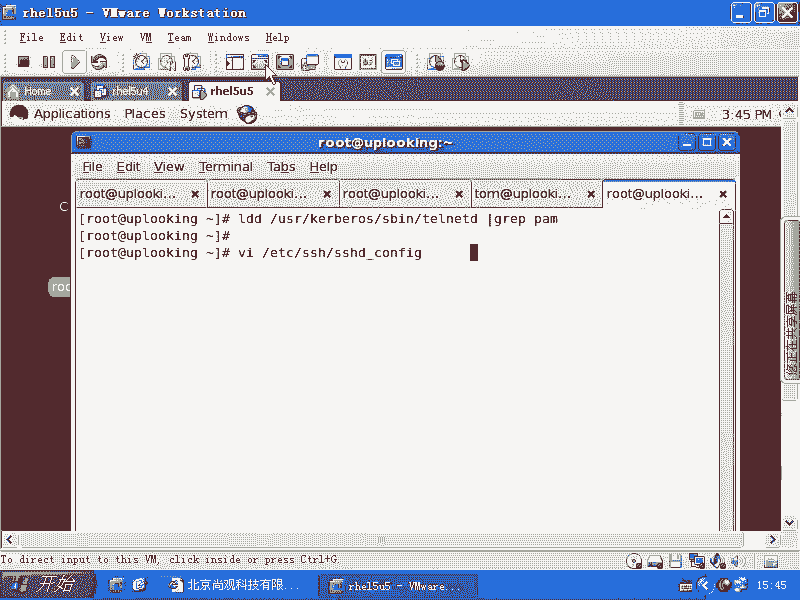
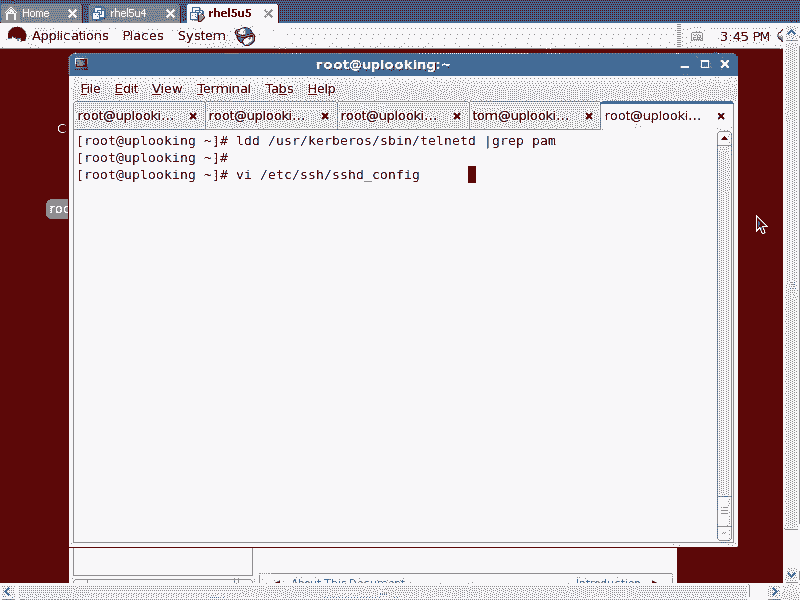
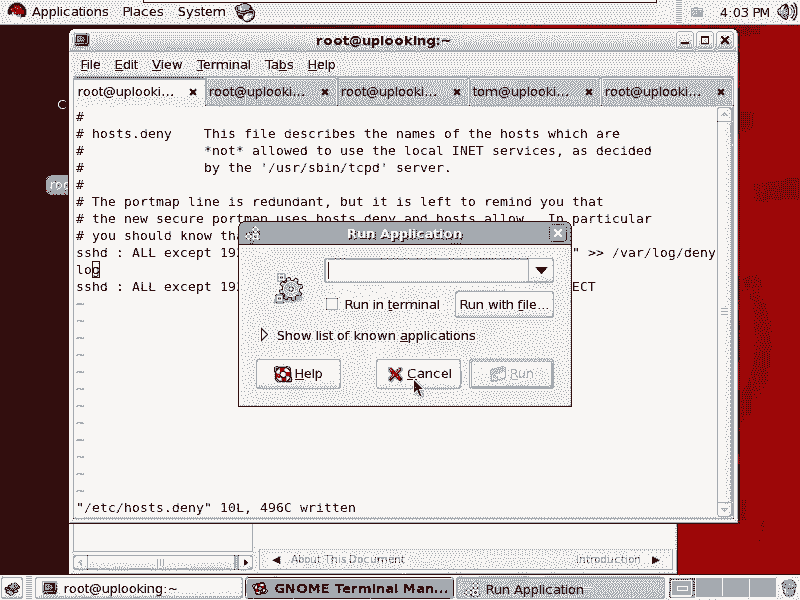
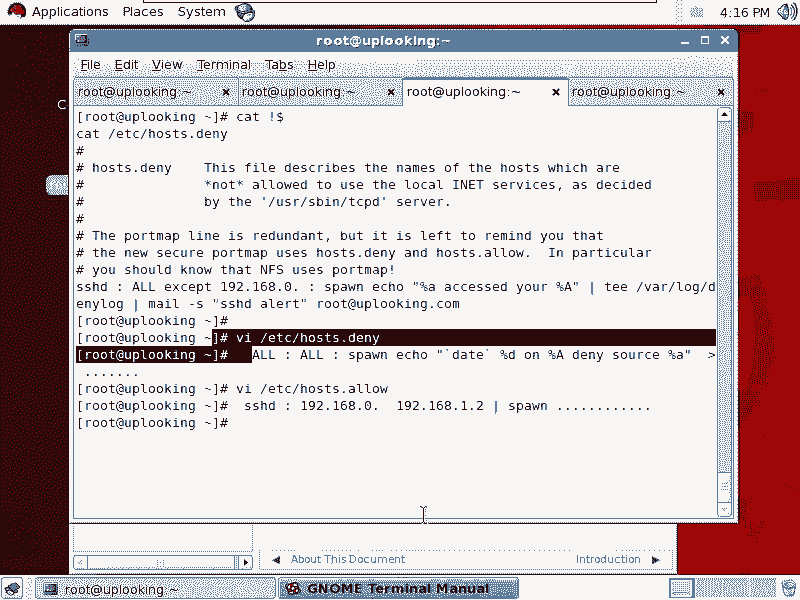
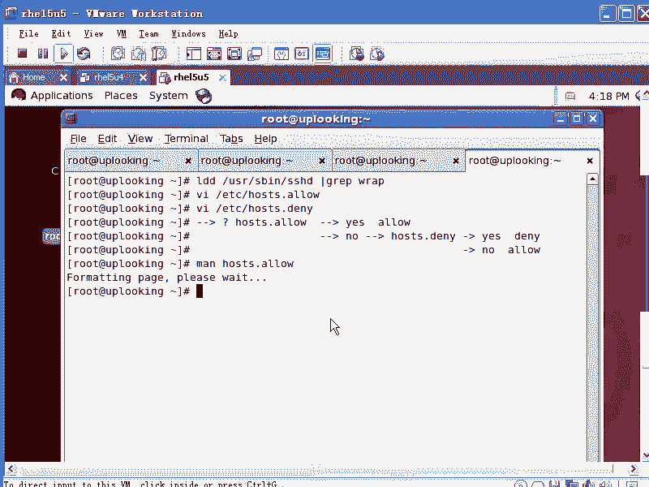

# 尚观Linux视频教程RHCE 精品课程 - P78：RH253-ULE116-6-2-tcp_wrapper - 爱笑的程序狗 - BV1ax411o7VD

好。在我们熟悉了。就是主机的这上面的一些就是host的安全之后，我们要开始往外移了，往外去推往外去推推的第一个东西是我们服务自发的进行跟tom类似的一个调用。tom是不是一个库啊？他们这个库的话呢。

它被我们的应用程序主动去调用，对不对？我们有另外的一个访问控制的库，这个库叫做TCPrepper。如果你想进行访问控制，但是你又懒得去写那些组件，于是你也调用我这个库。明白吧？

这就是TCPrappper。那TCPrappper的话呢，它是。

从哪可以看到或者怎么去看到我们可以这样来啊，我们可以这样来。

TCPpper怎么去看到我们看LDD是不是太熟了，是不是LDD然后它DEV下的。😊，啊啊不是第位层。嗯。USR下载S并下载SSH是不是？那么我们可以看到SS就调用很多很多的库。

我们的话呢筛选其中一个名叫W呃raper啊YWRA看到了没有？这是TCPrapper是不是TCP rapper它是一个什么东西呢？😊，进行访问控制的一个库，而它的控制方法简直是太简单了。

简单到什么程度呢？就俩配置文件写一行就生效啊，就这么回事。所以的话呢你如果要是愿意去进行呃你想去进行访问控制，那你用TCPrap呃TCPrappper实际上不错的一个选择啊。

我们看到是不是SSHD它就支持啊。😊，那我们再看一下什么呢？其他的啊VSGPD。支持不支持也支持是不是？😡，还有什么呢？还有我们的那个。啊，老黑支持不支持？log in的话呢。

因为它是一个什么本地的一个登录程序，是不是本地的登录程序。那我说服务的安全实际上它是要基于远程访问是吧？我要基于哪些IP不能访问，哪些IP允许访问，是不是？结果现在的话呢，我们是log in程序。

那你说它有没有这个过程啊？😊，系。那应该是在病目录下是吧？有没有rapper？没有，是不是我们用的非常非常多的一个呃软件。比方说appartyapparty是不是要求性能非常高，1万个人来访问我。

我都能给他提供非常好的服务，对不对？😊，是不是这样的这个访问的话，那我说这种访问的话。啊。要求速度非常快，响应的话呢也非常非常快。那这时候我们看一下appartache它代哪。对吧有没有？没有。

于是的话呢，我们基本上定下来了一个TCPrappper的运行呃，就是运行场合。一般是什么呢？速度不是特别快的网络服务是吧？他们会去采用什么TCPrappper。对不对？然后我们再看一下呢。

他们怎么去用啊。我们说TCPrappper在SSHDVSITPD他们都会用。那你如果要是想进行访问控制的话，既可以在pm里面用pm access模块，是不是也可以用什么呢？

也可以用我们的呃TCPrappper进行网络的基于网络的。返问控制，我们看一眼啊。怎么样去调？我们首先知道了它到底支持不支持，我们可以用这种方式去限定，是不是？然后呢。

它的配置文件TCPre的配置文件是这样的，一个是ETC项目的host。😊，alow啊，另外一个是什么呢？ETC项目的。hosts啊，就两个文件，就这两个文件搞定了，这两个文件非常简单。

默认情况下两个文件都是空。你们想一想。这时候说明一个问题，这两个文件里面什么东西都没有啊，都是空。你们可以ca一下，ca以后你会发现都是空的。但是呢我们访问SSH服务的时候有没有受到影响？

没有没没有是吧，那说明什么呢？就是说如果要是我没有人明确的允许。同时，没有人明确的拒绝，他就什么？允许。所以他的这个逻辑是什么呢？他是说先看什么呢？

先看我们的hosts alone当中有没有针对这个服务以及这个服务的什么这个来源的描述。如果有的话就怎么样呢？如果要是有的话。yes，有是不是？那么我就怎么样？😡，hello是不是？如果要是顶赖。

如果如果要是没有。如果要是no是吧，没有对他的描述是吧，那就怎么样再去看什么？😡，是吧底奈当中有yes，那么就怎么样。停脉如果停脉当中什么？没有是不是那就怎么样？😡，明白了吧。

所以默认情况下就是一个什么？如果都没有写，那就是最后什么。😡，好了，也就是说我现在针对一个。软件的一个来源的访问。如果在host alone当中是有的是吧？有的那就alone是不是？

如果没有再看host评赛当中有没有明确的拒绝，没有，那就有什么。allo有的话就怎么样，有的话就是明白啊，所以我们来写一下这个话就很简单啊很简单。我们看一眼。VIETC下的host饼单。然后呢。

这个文件它我们这样写，我现在想进行SSHD的限定，这个SSHD一定要写进程的名字，千万不能写SSH不要写服务的名字。SSHD要写进程的名字。你比方说你要是town话，那什么挑。😊，night明白吧？

如果要是我们的那个呃如果要是我们的VSFTP的话，VSFTPD啊千万不能写服务的名字。那假假如说我们叫SSHD然后呢，接下来的话呢是什么呢？是我们的这个接下来这个写法，写法的话呢。

我们可以看一个man pageM。😊，hosts deny啊，你可以看怎么去写，还有一些例子。这边的话呢你看。以冒号隔开，首先是。第一名啊就是我们的这个后台首后进程的这个列表。接着是客户的列表。然后呢。

当这个情况发生的时候的话呢，执行的是什么sell的命令啊，执行什么样的sll的命令，这是它的一个基本的写法啊，那么。de呃demans list它是什么由一个或者多个什么这个进程的名字。呃，组成的。

然后client的列表的话呢，是怎么样去写？最下面的话呢是说你该怎么样格式的话，去写来源啊。这边的话呢是一些所谓的这种通配符嗷，就是所有的IP地址，是不是？然后呢。

我们的local就是本地的解析出来的IP地址，也是你的主机名解析的IP地址，还有local host是吧？然后还有就是onknowonknow的话，就是说你没有办法通过这个IP地址解析出域名的。啊。

没有办法通过这个IP地址反向解出什么域名来。那么诺文的话呢，就是说能解析出来的啊能解析出来的。还有的话呢，就是说他的这个呃。就说可能是有问题的。还有的话呢就是except除了什么什么东西啊。

除了什么东西。那么是要命令的话呢，我们说可以去执行这个就是一些脚本。这个脚本里面的话呢，可以带一些参数。也就是我给大家先看一眼这个男配置，大家可能还没明白，是不是？那么你要知道在这个地方可以查帮助。

对不对？好，你看啊，那我真正去使用的时候，我这样的来看一下。现在的话呢我想去允许啊啊去允许别人从1求2168。0。0这个网站来，但是不允许从任何其他地方来啊，那我这边的话呢。

抵y呃dy denyySSHD冒号是吧？从R对不对？拒绝它从所有其他地方来是不是？除非什么呢？19218。0。0这网段对不对？如果你想保险点去写的话，加上一个什么呢？255。255。255。0是不是？

如果要是你现在我我现在不太确定啊，我一般的话都是按照稳妥的方式去写，尤其是考试的时候是吧？如果要是我现在的话呢想实验一下，那我可以实验一下什么这种写法行不行？这种写法行不行？啊，可以可不可以呀？咦。

可以吗？啊，先看一下。曼好吃。很辣啊。这个时候的话，你就找的是这个位置了，是不是他说可以这样去写，是不是？可以可以这样去写，对不对？还可以怎么样去写。啊。还可以这样去写。对不对？

那证明这样写是可以的是吧？然后呢，我们来简写一下啊，我们简写一下。点零是不是？也就是说，拒绝从所有地方来除了这个地方啊，那我现在保存退出呃，保存一下保存一下，然后我来试试看。我来试试看。

SSH1求1了8。0。254，然后呢输入我的密码，是不是？密码多少去拿毒品啊。hello可以进去，是不是？嗯没问题。😊，然后呢，我现在再去SSH1。54。这个配置文件非常奇怪，你写完了以后啊。

你包括pm大家有没有发现pm和S和这个TCPrappper的配置文件改完以后，它立刻生效是吧？嗯不用重新启动，也不用立刻serverice什么什么东西。原因是什么呢？

原因就是这些配置文件在每次我们的进程调用的时候，它都会重新去访问。😊，啊，现在我们看啊SS1条1了8。1。254，对不对？😊，同一个命令是吧，只不过换了一下IP也是同一台主机。

这个时候你看啊这边有一个典型的这样的一个一个错误。SSHchange是不是啊？明白吧？典型的一个错误。你一看到SIC exchangechange什么什么东西，就说明是TCPrapper起作用。啊。

就是或者说你如SS话是这个错误，那么VSFTPD可能是其他错误，对吧？那么一这是个典型的错误。所以我经常的话看到这个啊，TCPrappper没有关是吧？你把它没有清空，所以这个大家记住了，记住了没有？

😊，所以的话我们现在看已经生效了，是不是？那么当你想去拒绝1求2。168。1这个网段的时候，或者是点crackcker点ORG的时候，是不是都可以去写那个文件？明白了吧。拒绝谁允许谁啊，拒绝谁允许谁。

而且一定要自己测试一下，看能不能通过啊。如果能通过的话，那你这个考试的这个地方就没有问题。因为考试里面的话，每一个服务它都让人要要让你什么允许哪个网段，拒绝哪个网段。

允许哪个IP拒绝哪个IP允许哪呃就是拒绝哪个IP除了什么什么之外，其他的话呢，都怎么样都去允许或者都去什么拒绝，明白了吧？啊，这个的话呢，操作在HC考试里面的话，是经常将出现。

那么你如果要是在实际做的时候可能也会经常用，也会经常用。这是一个。😊，我们现在的话呢进一步来设置一下啊，我们看。哎，有人想攻击我，他攻击我就算完了吗？攻击我就算了吗？😡，我是不是要记录他的罪证？😡。

有人企图攻击你，是不是你就入侵检测呀。😡，我怎么要入新检测，那我加上一个什么？😡，马黑。啊，这么好。你如果要是想去调用啊我们系统当中的进程的话，那么你应该怎么样呢？sport。pon啊。

然后加上一个什么呢？icle啊，比方说。百分号A。百分号大A的话呢是你自己的IP啊，百分号小A的话呢是对方的IP说对方想去啊，对方在攻击你的就是访问你的时候遭到你拒绝是吧？

但是你的百分号小A会记记录下来对方的IP地址。😊，啊，那么你这边比方说有2块网卡，它到底访问的是哪一块，你是用百分号大A来显示出来。清楚了吧？也就是说摆放小A啊，他去访问你的什么。

他就访问你的你的某一个。😡，哟是不是你的某1个IP对不对？把这个信息怎么样呢？把这个信息放在呃追加到一个文件里面。比方说wa下的log当中的呃。😊，你拿log啊。mylog当中，这样的话呢。

我这样的保存啊，保存立刻生效，是不是？然后我们再来试一下。立刻升降，然后再来试一下，然后我们再去访问他。但是同时的话呢，我在这个这一端啊，我去。先看一下。哇下的log当中的。给他唠个，对不对？是睡觉吧。

卡。我再去访问一下。这边是不是又多一条？再去往回一下。是不有多项？对不对？所以这个操作的话呢，只要他被拒绝了，然后他就会这样的显示出来，明白吧？这个的话呢就是呃非常好的留罪证的一个东西。

那你能通过一个文件的话呢，能看到别人的话，谁企图对你有什么SSC这个这种访问，结果被你拒绝了，是不是？那么你当然可以通过这样的方式的话呢，写出大量的什么命令来。😊，对不对？那么你既不止可以什么。

你不止可以这样的去输出这个，那你还可以怎么样呢？还可以这样。可不可以加这样的参数啊，加上一个冒号是吧？我这个试一下不一定成啊，因为我我我这边的话呢是显示出这个日志的是吧？那么如果要是我不去显示日志。

我用这个命令IP tables。😊，杠A是吧，input从来源为什么？版号A的是不是？然后呢，数据包就怎么样？😊，可可以啊。可位啊。当然可以了，当然这样的话呢会滥杀无辜的，是不是？

假如说有人ADSL拨号上网，拨号上去了以后的话呢，SSC试你一下是不是被你加加入那个规则了，加入规则了以后的话呢。😊，结问你哪天的时候用ADSL上去是吧？你就被拒绝了是吧？所以这是滥杀无辜啊。

但是你可以怎么样呢？你可以给他保持什么？30分钟，30分钟之内的话呢，你比方说你每隔30分钟清空一下这条规则是吧？或者清空一下某一条规则，对不对？然后这样的话呢，你可以就是说呃做到一个什么这叫什么呢？

😊，活的。防火墙就是说呃我可以自动让入侵检测系统跟我的防火墙去联动起来，是不是我的入侵检测系统发现有入侵了以后，自动加入IP tables，是不是？这样的话呢也可以，但这样的话，我不知道行不行啊。

我们试一下啊，因为我不知道这个格式，我不知道这个这样格式写行不行，我不知道这样写行不行，行不行啊，你们试过没有？😊，没有啊，你看一眼。现在先怎么样呢？IP tables啊杠L。

你看IP tables里面没有任何规则，对不对？然后现在我去访问一下。然后呢，我们再看一眼。啊，确实不行啊。确实是不行是吧？那我我如果要是这样加行不行？哇，这个地方。我看加两行乘不成啊？如果不行的话。

我就把上面那行删掉，是不是？下面那行我用上。

这边生效了，是不是？生效了。那我们在另外一端看IP table规则。还是没有。VRETC下的hos。ない。加注释以后的话呢，它就生效好则命退出。然后呢，我这样的看一眼，还是没有。然后呢，添加。问下去。

还是没有显示出来啊。没有显示出来的话，原因可能是不是路径没有找到啊。哎，不对，没有设置好。这边少了一个什么呢？你要想调校里面的命令的话，必须得输入什么。Sport。咦。好像没有。啊。

Iappy tables日志。因为我现在的话呢测试的这个的话是崭新的是吧？所以的话呢以前没有将用过，因为我们的啊啊TCB软它跟IP table是刚好是起的作用是相同的，对不对？是吧？我们看一眼啊。

到底是哪儿有问题呢？咋整的呢？叫个双引号。加个双引号吗？这个杠A或者杠G这些参数是不是跟他有？有冲突啊。IP table日志里面的话有错误吗？我看一下啊。还是没有执行。原因是什么？我们来看一眼吧。

再仔细看一看。IP tables。IP tables是我们指定个路径S并且的IP tables。是吧。加上一个。S并且的IIP table行不行？保存一下。没有。然后呢，再去攻击一下。然后再看一眼啊。

还是没有。然后呢，这样不行不行的话呢，我们来试一下啊，我们试一下是不是摆放S的百分呃就是杠S的问题。输了1个10。0。0点。一是吧。3S。啊，直接执行这个命令成不成？如果要是成功的话。

那说明是什么问题呢？说明是哎可以，是那个板放A的问题。啊，他可能在IP table里面的话调动的时候，它没有识别出来。明白吧？也是那个百分之2A，我用iccle命令是可以显示的，是吧？

结果IP tables的话呢，它那个调百分号A的时候，可能对IP table来说是另外一个功能。是不是所以可能是这个问题。嗯，那如果要我换成1010的话，哎，10。0。11。

也就是说我直接把它改成什么呢？就是直接就是加IP地址，它成功执行，是不是刚才这个地方是板放号A，是不是？然后A可能跟IP tables似的话呢有一个冲突，但是这个实验不成功的话也没有关系。

大家最起码看到了刚才的什么这个写日志，是不是我自动写日志，是不是？然后呢，写这个日志以后的话呢。大家看啊它能自动给你发个email啊，那我就把这个IP tables这个的话删除掉了。

可能要想设计出这一套来，还要好好想一下，是不吧？比方说让它追加到什么呢？追加到那个icle一串值到那个IP tables那个配置文件里面去。这样应该也能实现啊也能实现。我们看啊。

那么现在我现在的话呢想把这串信息啊，除了给谁啊，除了给我们这个。写到这个日志里面去之外，还要给谁啊？还要给我们的发个email啊，杠S。呃，SSHT呃。是吧alert。Aert。然后呢。

发email给谁呢？发email给如ach at。比方说啊uplook。点com对不对？这样保存命令退出啊，那这样的话呢，当这种情况发生的时候。当这种情况发生的时候。

他除了会把这个信息写到wa的log当中的什么，inlinelog里面以后，还要给我再发一个什么邮件。那不管我在哪，如果要是你是一些大公司的话，他可能有一些需要命令下的什么。呃，短信是不是短信系统。

那么当有人攻击你的时候，它自动把对方的IP地址。然后呢，通过短信发给你，这是不是也可以实现？对吧所以发邮件还是发短信，这都可能啊，就这么回事，简单不简单？简单，那么我们讲了一个基本的使用。

还有的话呢它的一个扩展的使用。同时的话呢呃大家要知道它实际上还可以做什么呢？还可以做我们的那个。呃。就是一些。比较全面的一个案例啊，就是我们一个安全的全面的案例。我们一般是怎么做呢？我们是这样的。

首先的话呢去VI啊ETC下的呃hosts。poststs。那在这里面的话，我们是怎么添加呢？our所有的服务是吧？然后呢，拒绝他从所有地方来，对不对？如果要是当这种情况发生的时候，那就怎么样swn。

是吧挨口。ele一个什么呢？ele一个时间。cle一个时间，然后呢，接着是你的这个进后台守候进程。也就是说我现在前面是不是写了一个奥啊，谁知道你的哪个服务被人家访问，对不对？

谁知道你哪个服务有可能是VSFTPD也有可能是SSHD对不对？那在这里面的话，奥这个地方就代表着什么呢？奥就代表着所有的服务。那么有一个变量可以告诉你到底是谁啊，到底是哪一个，那就是百分号D啊，百分D。

你可以看一下my page百号D。😊，摆放号A下的摆放号D啊。也就是说那个。慢啊deny source这个地方，如果把这串信息输出到哪去呢？输出到你的一个日志文件里面去，对吧？或者发email等等。

就跟上上面那是一样的了，是吧？然后这边的话呢，我已经在ho次顶赖当中拒绝了所有。所有的服务的所有的来源，是不是？那我该允许吧。那这样的话，我就VIETC下的hots low。

postlow在这里面的话呢是允许谁呢？比方说SSHD对不对？冒号从我允许他啊从19218。1。0呃，11点来，我允许他从什么0点。如果是HC考试的话呢，是拒绝一，然后允许零是吧？那我说拒绝从1。

0来的所有的人。拒绝从哎错了。拒绝从1。0来的所有人，但是允许0。0来的人，是不是？其中的话呢，我还有一个可能也允许就是1918。1点什么呃，21这台机器或者1点多少多少台机器。比方1。2这台机器和0。

0这个网段所有的都是允许的，是吧？当他们发生的时候，也就是说现在这些网段的人，他都可以访问我，访问我的时候，我也希望记录一下。那这时候我是不是也可以加上一个什么pown。😊。

是不是我把他的IP地址也记下来，是不是什么时候谁访问过我的机器，对吧？什么时候谁访问过我的机器，我全部把它记下来。这样的话呢就是说我。😊，允许是事先允许的，但是默认情况下是不是拒绝了所有的。

是吧那么如果要是我没有允许明确的允许，他是不是全都拒绝了？这是不是也是MAC防问控制？你们觉得是不是这样？是不是MAC访的控制啊？是吧所以这样加上以后的话呢，它也是一套方案，也是一套方案。

但是公司用不用就是另外一回事。因为它起的作用是不是Iy table是那个作用。他只是说比IPds多了一个日志，是不是？当然他可以去去给你显示banner。banner也就是说有人访问的时候。

他会给你什么呢？一个就是banner，就是说拒绝你的时候，他给你提供一个指定的banner啊，它可以提供很多其他的功能。但是在这里面的话呢，我们看到呃拒绝所有的，然后允许某一个。

这实际上就是IP tables的作用是吧？I tables的作用。所以很多公司里面来懒得去折腾什么pm什么TCP什么分级去什么这个进行访问控制是吧？我管你327ip table直接搞定。😊，明白吧？呃。

那么最简单最有效也可以。但是这个的话呢，实际上操作起来是比较。简单的，而且的话呢提供的功能可能比IP tables还要多一些，是不是比IP tables还要多一些，这就是我们所谓的什么呢？

啊TCPrappper的一个最佳的实界啊，就是你要拒绝所有的当这些拒绝发生的时候产生一个日志。然后呢，同时允许你指定的呃IP访问你指定的什么某一个服务。然后如果默认没有允许的情况下，全部都会被拒绝。

当你允许的时候，它也记入日志，明白吧？它也去记录日志，这就是一个最佳实践，明白了吗？清楚了没有？这个东西的话呢放在公司里面去。那么你做的操作，你想操操作多少次？写两行东西。就写两行东西。

是不是就写两行东西啊？啊，那么等一下的话大家学IP tables就是麻了烦了，头都挠破了，对不对？然后呢，觉得痛苦的痛不欲生。那这里面的话那么简单，所以的话呢这个是一个不错的东西啊。

我希望大家的话呢也会用一下啊用一下。好，这边的话呢是我们我们的这个。

TCB wrappper啊TCB wrappper。另外的话呢，大家可以看一下它的蛮配置。大家可以看到蓝配置。慢。Tese。pos机。long。看下后色楼。

hos alone这边和ho啊调用的都是hos access这样的一个my page。host alone host deny，然后呢，它是怎么样去写，跟刚才那是一样的啊，跟刚才那一样的。

这个参数该怎么样去写。然后呢，all啊local known等等。except是吧。然后这边的话呢是一些常见的参数。你看板块号D的话呢是paymon是吧？就是我们的后台首护进程板块C板块号A啊是干什么？

这边的话呢还有一些。这边的话呢，这个帮助的话呢就要多好多啊。多好多，这边的话呢后面是几个例子。后面是几个例子。好。我们的话呢这个TCPrappper part就给大家总结到这儿。

