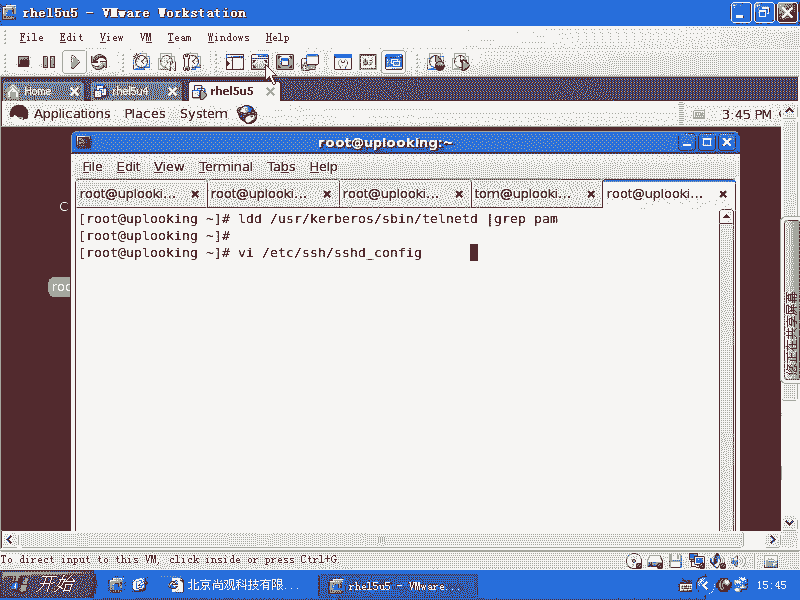
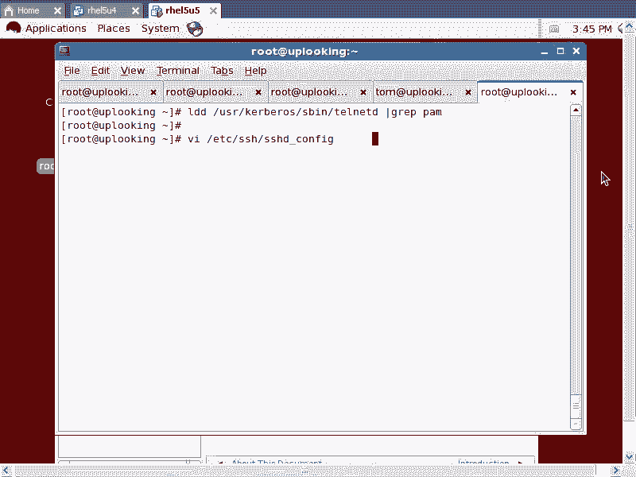
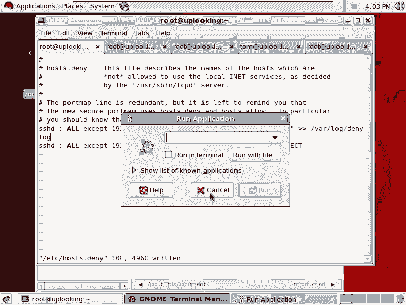
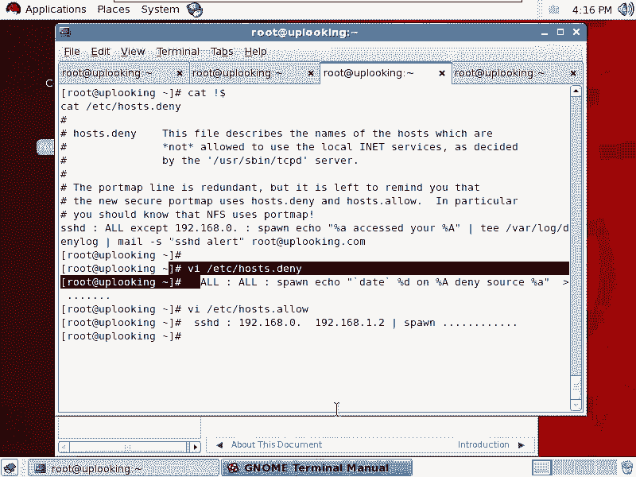
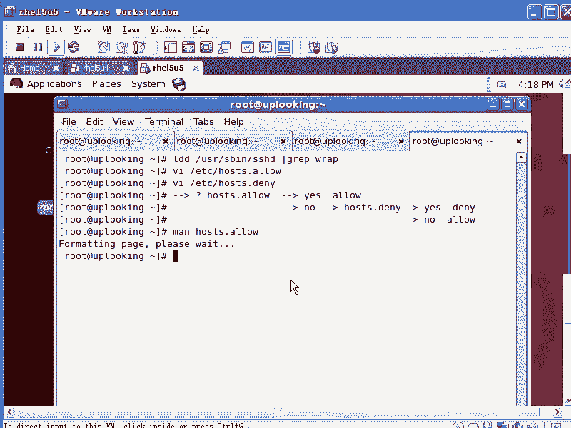

# 尚观Linux视频教程RHCE精品课程：P78：RH253-ULE116-6-2-tcp_wrapper






## 概述
在本节课中，我们将要学习TCP Wrapper，这是一个用于网络服务访问控制的库。我们将了解它的工作原理、如何判断一个服务是否支持它，以及如何通过简单的配置文件来实现基于IP地址的访问控制。

---

## TCP Wrapper简介
上一节我们介绍了主机层面的安全，本节中我们来看看如何将安全控制向外延伸。TCP Wrapper是一个库，类似于PAM，但它是被网络服务程序主动调用来进行访问控制的。如果开发者想为服务添加访问控制功能，但又不想编写复杂的组件，就可以调用TCP Wrapper这个库。

我们可以使用 `ldd` 命令来查看一个程序是否链接了TCP Wrapper库。

```bash
ldd /usr/sbin/sshd | grep wrap
```

如果输出中包含 `libwrap.so`，则表明该服务支持TCP Wrapper。例如，`sshd` 和 `vsftpd` 通常都支持。而像 `login`（本地登录程序）或 `httpd`（对性能要求极高的服务）通常就不支持。因此，TCP Wrapper一般用于对网络响应速度要求不是特别苛刻的网络服务。

---

## 配置文件与工作原理
TCP Wrapper的配置极其简单，仅通过两个文件实现：
*   `/etc/hosts.allow`
*   `/etc/hosts.deny`

默认情况下，这两个文件都是空的。此时，所有访问请求都会被允许。它的判断逻辑遵循一个固定的顺序：

1.  首先检查 `hosts.allow` 文件。如果找到匹配当前服务和客户端IP的规则，则**允许**访问。
2.  如果在 `hosts.allow` 中没有找到匹配项，则接着检查 `hosts.deny` 文件。如果找到匹配规则，则**拒绝**访问。
3.  如果两个文件中都没有匹配的规则，则**默认允许**访问。

其逻辑可以用以下伪代码表示：
```
if (match in hosts.allow) then
    ALLOW
else if (match in hosts.deny) then
    DENY
else
    ALLOW
```

---

## 基本配置语法
以下是配置文件的书写格式和常见用法。

配置文件的每一行规则通常遵循以下格式：
```
服务进程名列表 : 客户端列表 [: 可选的操作命令]
```

*   **服务进程名列表**：指后台守护进程的名字，例如 `sshd`、`vsftpd`。**切记是进程名，不是服务名**。
*   **客户端列表**：定义来源IP地址、主机名或网络段。
*   **可选命令**：当此规则被触发时，可以执行一段Shell命令，例如记录日志。

关于客户端列表，可以使用一些通配符和关键字：
*   `ALL`：代表所有客户端或所有服务。
*   `LOCAL`：代表与主机名解析出的IP地址匹配的客户端（即本地网络）。
*   `KNOWN`：代表能通过DNS反向解析出主机名的客户端。
*   `UNKNOWN`：代表不能解析出主机名的客户端。
*   `EXCEPT`：表示“除了...之外”，用于排除部分地址。

详细的语法说明可以通过 `man hosts_access` 命令查看。

---

## 实践配置示例
让我们通过一个具体例子来学习如何配置。

假设我们只想允许来自 `192.168.0.0/24` 网段的客户端访问SSH服务，拒绝所有其他来源。

首先，我们在 `/etc/hosts.deny` 文件中添加一条规则，拒绝所有对 `sshd` 的访问：
```
sshd : ALL
```



接着，在 `/etc/hosts.allow` 文件中添加一条规则，允许特定网段：
```
sshd : 192.168.0.
```
或者更精确地写成：
```
sshd : 192.168.0.0/255.255.255.0
```

配置完成后**立即生效**，无需重启服务。因为支持TCP Wrapper的服务会在每次处理连接时读取这些配置文件。

现在，从 `192.168.0.254` 可以成功SSH连接，而从 `192.168.1.254` 连接时，会收到类似 `ssh_exchange_identification: Connection closed by remote host` 的错误提示，这表明TCP Wrapper的拒绝规则已生效。

---

## 高级功能：记录日志与联动
TCP Wrapper不仅能控制访问，还能在拒绝访问时执行命令，例如记录攻击企图或与其他安全工具联动。

**记录攻击日志**
我们可以在拒绝规则后添加命令，将连接尝试记录到自定义日志文件中。在 `/etc/hosts.deny` 中添加：
```
sshd : ALL : spawn (/bin/echo "SSH connection attempt from %a to %A on %d at `date`" >> /var/log/mysecure.log)
```
*   `%a`：客户端的IP地址。
*   `%A`：服务器接收连接的IP地址（多网卡时有用）。
*   `%d`：被访问的服务进程名。
*   `spawn`：用于执行后面的Shell命令。

这样，每次有非法SSH连接尝试时，相关信息都会被追加到 `/var/log/mysecure.log` 文件中。

**发送邮件警报**
我们还可以配置在发生拒绝事件时发送邮件警报：
```
sshd : ALL : spawn (/bin/echo "Alert: SSH attack from %a" | mail -s "SSH Alert" admin@example.com)
```

**（注意）与iptables联动**
理论上，可以通过TCP Wrapper触发命令，将攻击者的IP直接加入到iptables防火墙规则中屏蔽。例如：
```
sshd : ALL : spawn (/sbin/iptables -A INPUT -s %a -j DROP)
```
但实践中需要注意路径、参数引用（如`%a`在iptables命令中可能无法正确解析）以及避免“误杀”动态IP用户等问题，实现起来比简单的日志记录要复杂。

---

## 最佳实践方案
一个完整的安全实践方案是采用“默认拒绝，显式允许”的策略，并记录所有访问日志。

1.  **设置默认拒绝所有**。编辑 `/etc/hosts.deny`，添加：
    ```
    ALL : ALL : spawn (/bin/echo "`date` - Denied access to %d from %a" >> /var/log/all_deny.log)
    ```
    这条规则拒绝所有服务的所有访问，并记录日志。

2.  **显式允许特定访问**。编辑 `/etc/hosts.allow`，添加允许规则，并同样记录日志：
    ```
    sshd : 192.168.0.0/255.255.255.0 : spawn (/bin/echo "`date` - Allowed SSH from %a" >> /var/log/all_allow.log)
    vsftpd : 192.168.1.100 : spawn (/bin/echo "`date` - Allowed FTP from %a" >> /var/log/all_allow.log)
    ```

这个方案实现了最小权限原则：只有明确允许的IP才能访问特定服务，其他所有请求都被拒绝，并且所有允许和拒绝的操作都有迹可循。它的配置比iptables更为简洁直观。



---



## 总结
本节课中我们一起学习了TCP Wrapper。它是一个轻量级的网络访问控制库，通过 `/etc/hosts.allow` 和 `/etc/hosts.deny` 两个文件进行配置，规则简单且立即生效。我们掌握了其“先允许，后拒绝，均无则允许”的匹配逻辑，学会了如何配置基于IP的访问控制，并探索了通过 `spawn` 执行命令来实现日志记录和警报等高级功能。最后，我们还介绍了一个“默认拒绝，显式允许”的最佳安全实践配置模型。对于许多不需要复杂状态防火墙功能的场景，TCP Wrapper是一个高效且易于维护的选择。