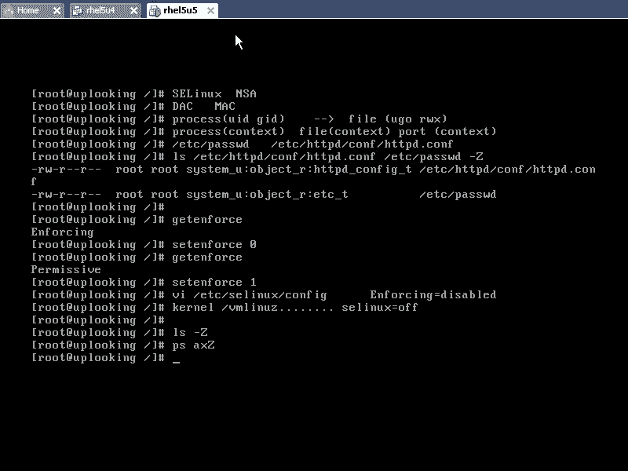

# 尚观Linux视频教程RHCE 精品课程 - P79：RH253-ULE116-7-1-pam-system-login - 爱笑的程序狗 - BV1ax411o7VD

我们继续要把leux里面的这个安全体系。继续往它呃把它往下延伸。人生什么内容呢？😡，我们知道有安服务安全是吧？有主机安全，还有我们的那个呃网络安全是吧？我们在服务安全里面的话呢。

有那种身份认证啊、password啊等等这些信息。那我们现在的话来看一下主机安全里面啊，主机安全里面的话有。呃，就是pasword等等这样的，还有SE Linux这样的一些东西。那我们看一下的话呢。

平时我们所用的最多的啊，但是呢从来不会去太多的去关注的一个东西就是pm。这是属于什么呢？postt。安全啊主机安全这个主机安全里面。这个主机安全里面。有很多组件。

我们都知道系统当中的账号放在ETC下pasword里面，是不是呃，密码放在ETC下的shale文件里面，哎，凭什么？😊，凭什么放在这里面？你说系统就这么规定的，是不是？😡，但我们现在已经清楚了。

这个系统连内核都可以拆开。那你说到底谁在用ETC要发座的？😊，到底是谁是吧，谁都我的pasword了，是吧？😡，谁平时在用啊，这个的话呢就是我们要讨论的就是怕。pmpm的话呢叫做可装载式身份认证模块啊。

可装载式身份认证模块就是pmpm这套机制，你基本上学完以后的话，就会有种什么感觉呢？这个东西的话学完以后的话，基本上就会有是种什么感觉呢？你就是这个系统当中的什么王是吧？

king of the system啊，就是这样的。就是说这个pm的话呢，平时就在控制着我们的方方面面。那么我们现在的话想把它进一步的去定制，进一步的去使用的时候。

那么你就会发觉哦系统当中各种各样的奥秘原来在这个地方。m的话呢，它是系统当中给你提供的一套机制。这套机制是为了解决什么问题啊，我们看一下RPM杠QA啊GREPPM。它是一套什么机制呢？

如果要是你现在有一个服务是SSH服务，它需要认证，是不是？它这个认证的话需要有用户名和密码，对不对？然后呢，我们有1个FTP服务，它也要用户名和密码。还有一个服务。

比方说啊一收发email也要用户名和密码。于是的话呢，你需要记住什么三个用户名和密码。我在呃SSH里面，我添加一个账号，这个账号的话呢，它能不能用FTP。😊。

人家SSH是open SS是这个SSH这个开发小组开发出来的，对不对？他们的话呢，凭什么要跟把自己写这个验证的这套东西要给什么FTP那个小组去用VSSP那个小组说哎，我要写一套身份认证协议是吧？哎。

SSH你给我拿过来，我参考一下是吧？我照着你这个来写，然后呢，SS那边说去自己写去。😊，然后呢，还有一个email那个账号，email跟他们离得更远了。然后SSA就拿自己的这套身份证体系搁到那边去说啊。

把我这套东西给你给你拿去用。😊，人家说你写什么破玩意是吧？我平时的话呢，这个东西写的比你还好，所以这样下去的话呢，这个系统就没法玩了，是不是我本地登录一个账号啊，远程登录是另外一套账号FTP又一套账号。

我这系统怎么着？所以系统要解决这个问题，必须得提供他们一套完整的一套认证的机制，这套机制就叫p啊，大家看m有没有装是吧？RPM啊QA加P装了装了以后我们看啊pm本身的话呢，这是它的这个版本啊。

这是它的版本也是经过什么re定制的也是经过re定制的的话呢，它的来源于呃它的来源是什么呢？unix系统啊，unix系统上的话，原来都是采用ET来做认证。后来的话呢。

我们说其中的一一个unix就是话呢拿到这个。😊，呃，就是slars话呢，他们的这个开发者一开始啊在linux没有爆发之前，整个unix里面最开放的就是呃slarsslar开发开发者说。

你这套东西写的太烂了，就是shale啊，pasword这套机制写的太烂了。我把你我写一套东西来兼容你。然后呢，但是我还可以提供给更多的功能，这就是pm的由来。于是的话呢，unixunix的话呢，它做。

😊，就是open source的版本，就是linuxlinux的话呢就照着inux话呢去写。那么这套pm的话呢就逐渐移植到什么？我们的lininux上来的，就这样的一个过程。😊，pm的话呢。

它基本上你在ss里面可能肯定是能看到的是吧？但是其他的话呢未必会有，但是呢基本上他们都是兼容的，都是用pasword或者shadow啊，它到底是怎么样一个机理呢？叫做可装载式身份认证协议。

这个pmpam的话呢叫做plugable，就是说可以。插入到这个应用程序当中的是不是可插入式的身份认证模块啊，它实际上本质上讲的话是一个库。你们想知道怎么样去看系统当中装的所有库吗？

然后Dconfig杠V这样的话呢会显示出系统当中所有的库啊，然后Dconfi杠V然后呢GREPp你可以看到呢，p的话呢是有一个库。有酷吧。他点SO看到这个库了没有？看到了吧？这个库供我们的应用程序调用。

这样的话就很好的能解决我们的那个呃SSH啊FTP啊这些这样的一些问题。为什么呢？你想SSH他想去身份认证的时候，它可以去调用m一调用pm系统当中的用户就生效了，对不对？

那么这些系统当当中的用户它是放在ETC下的password文件里面，对不对？那这样的话，我们的SSH它就用就用到了ETC上password。然后我FTP也去调用pm。

它也是用ETC下的pasword做认证，对不对？这样的话呢，我们的系统就产生了一个公共的一个认证机制，大家都可以去调用。那怎么去调用呢？我们给大家举过那个动态库的例子，是不是？

如果要是在我们的一个写字楼里面的这些房间，每一个的话都装一个厕所，那就浪费，是不是？所以的话我们把这部分厕所这部分功能，弄成一个公共厕所，放在这一层楼的某一个位置，大家想上厕所的时候。😊，就去调动它。

对不对？所以的话呢pm他的这个厕所看到了吗？啊，这个厕所的这个文件在这边，厕所的文件在这边，那么我该怎么样去调用？😊，打开这个了，我该怎么样去调用这个厕所呢？那么首先我要让我的这个应用程序。

知道有pm的这些东西。那我们看一下这个应用程序，就是咱们的这个房间，他知道不知道有pm知不知道pm里面的几种调用方法啊，我们看一下LDD查看我们的应用程序，它所调用的库啊。

我们看一下并且的log log的话，是不是我们登录的时候，他所呃运行的那个程序，是不是就相当于我们打开控制卡以后运行login是吧？你输入用户名密码，他帮你打开什么？那你输入的用户名密码，凭什么是对的。

凭什么是错的，是不是他要认证啊？然后我们看下他调不要用pm。那毫无疑问，它是什么调用的，是不是他调用这个库意思是什么呢？😊，我们把pam这个功能啊，然后呢装载在我们这个房间里面来。

就相当于厕所在那边是吧，它是公用的是吧？但是咱们这边的话呢，打了一个洞，直接到厕所那边去。呃，应用程序就是这样啊，他认为他这是一个进程，就是loinging是个进程。他认为这个厕所是在他房间的。

你知道吧？是在咱们的房间的。但是实际上的话呢，当我们访问那个洞的时候，砰哎，就跑到那个房间去了。但是呢咱们在这个应用程序里面认为什么？那个厕所是咱们这个房间的一部分。😊，也是应用程序的话呢。

它的进程是不是有独立的一个空间啊？当我们访问某一个地址资源的时候，啪直接就从定向到那个动态库那边去，明白吧？就相当于我们在这边打个洞，但是那个空间实际上不在咱们这个空间里面。

但是在咱们这个空间里面能访问到，听楚了没有？这样的话，我们看能不能访问到能访问到，是不是time这个模块啊，一旦被你调用的话，它能提供给你几种传统的调用方式，也就是说我们这边有个厕所，如果是男厕所的话。

它有那个什么洗手池是吧？然后呢，有那个就是那个普通的那个蹲的那个位置是吧？还有什么呢？还有那个小便池是吧？那么有三种调用方法，也就是有三种功能，我们这个pm的话呢，有哪些调用功能呢？

那我们可以看当你想洗手的时候，是不是有一个洗手功能是吧？那么它的这个功能的话呢，就是pm啊，你可以看man是吧？wom three是吧？m是不是你可以看一下啊。😊，没有啊。曼克A帕。你看这边的话呢。

告诉你说这边的话呢，我们总共有4种调用，一种是什么呢？account，一种是认证，另外一种是什么呢？另外一种是password的调用，还有一种是什么呢？session调用。

也就是说我可以去调用这四种调用啊，四种调用洗手啊，或者上厕所都可以去调用是吧？调用的时候的话呢，我们只需要传递一个值就好了。就比方说我去。locking啊，他去调用什么呢？AUTH是吧？什么。

他加载那个库以后，就有这个调用pmAUTH什么什么什么，然后呢传递几个参数。这个调用的话呢，它就呃放在我们的这个locking这个程序当中，你就可以这样调用。那如果要是你去输入正确的用户名和密码以后。

他给你返回一个值是什么？OK还是不OK。明看了，什么过程？但是呢我们的pm又迎来一个问题啊，逐渐在我们的pm在发展的过程当中，他发现有很多应用程序，它是需要多元化的认证。

你比方说我现在ETCR passwordword里面的话可以放账号是吧？但是呢我们有一个呃公司这个公司，比方说re泰reite它的FTB服务器上大约有数百万上千万个注册用户。哦。

你的pasword的文件里面放上千万行。大家那个password可是文本文件是吧？搜索文本文件就跟什么？就跟大海捞针一样，是不是？所以这个时候pm的话呢，它可能需要提供数据库的认证。

比方说pm买circlepmL我用Ld协议来做认证，是不是？所以我要提供的功能是不是越来越多啊，我要提供的功能越来越多，但是呢我调用方法就奥奥斯的话呢在执行的时候，我可能调用其中的几个模块。

所以的话呢我们大量的pm的话呢，它是功能模块放在LIB下的什么？😊，Security。这个里。他m它提供的功能越来越多啊，提供的功能越来越多。比方说你想认证是吧？😡，你告诉我你是想采用什么方式去认证呢？

我给你一个调用方法是什么认证。但是我认证的时候，我可以什么对应的四个模块，这四个模块都可以去认证。有数据库认证，有Ld认证，有password认证，是不是？还有其他方式认证。所以这个认证的具体的执行。

那肯定是不同。搜索文本文件是一个模块，搜索数据库文件又是另外一个模块。于是的话我们可以看到啊，在这里面我们可以看。😊，搜索password命令的话呃搜索pasword文件的话。

那么就是timem unix呃点SO的这个模块。这个模块的话就是做什么呢？就是搜索ETC下的password文件。在那里面，如果有用户名密密码，它就怎么样的告诉你成功还是失败，是不是还有什么呢？

比方Ld。😊，然后DAP点SO还有什么呢？我们的那个呃。Yeah。哦，他m可能就是是库库里面就是我本来想把NRS的这个呃调用的话呢也调出来。

但是那个NRS可能是在呃就是G labb C的库里面去直接去访问的，并不是这个地方提供的模块。我们可以看到呢，这里面有没有myCcle啊。有吗？也就我把系系统用户名和密码放在什么？买s个数据库里面。

行不行？😡，可以，这里面没有。为什么没有呢？因为你需要下载下来如那个点C的文件，然后自己编译安装一编译的话呢就会多这个模块出来，明白吧？所以的话在网上还有很多基于pam这个体系架构的这种东西，听楚了吧？

然后呢，你看这里边的这个模块，哇塞这么多，我的login程序到底选中哪个模块，还是每个模块都调用一遍。这个时候可就不好说了，是不是？所以呢这个时候我们要对每一个配置文件的话有一个配置的。

就是每一个应用程序有个配置文件，就是这个配置文件在哪呢？在这个地方，在ETC下面的pm点D目录下，那们login啊，有这样一个配置文件。😊，明白吧？所以的话呢话了就是说了这么多啊，说了这么多。

很多同学的话呢可能会觉得。就是说有点晕头转向啊，晕头晕头转向。OK我们的话呢来看一眼。嗯。咦。好，我们来看一眼。啊，听不到啊听听得到啊。刚才的话是说刚才是吓我一跳。我们来看一下。总结一下。

刚才我给大家一些目录是吧，一些内容是吧，晕了啊，晕了，然后我们来看。首先的话呢，最上面一个层次是什么呢？是应用层次应用程序啊应用程序。中间一个层次的话是酷的层次。然后呢，我们把它画出来。

假如说下面我们有一个什么呢？SSHD。然后还有什么呢？FTP。还有我们的locking。等等。他们的话呢都有自己的一个呃他们都有自己的一个认证的需求啊，我先把他们删除掉呃，删除掉一个啊。然后呢。

在这个里面的话呢，就是我们的一个层次叫做LIBtime点SO是不是这个库的话呢会被他们调用是吧？调用的时候，我们说有几种调用方法？有几种调用方法。有什么呢？有。AOTH认证是吧？这是最常用的方法。

还有一种叫做什么呢？account。com调用的话是访问这个用户的这种属性啊，访问这个用户的相关的属性。password还调还有pasword要用。哈索调用的话是访问这个用户的机密信息。

或者更改这个用户的什么，更改这个用户的密码啊，还有session。四种钓用。四种类型调用。当我的SS制他想去验验证的时候，它就会调用pm下划线ouss这种类型，是不是？那么我们在执行这个奥s的过程当中。

我们说pm这个库的话呢，属于二道贩子，什么二道贩呢？就是说他自己的话呢是不生产蔬菜，但是他卖蔬菜是吧？那实际上我生产哪些蔬菜呢？这些生生产的呃这个蔬菜有哪些种呢？它是从其他地方进货的，从哪去进货呢？

它是从这个地方进货。这个位置的话是在哪个地方呢？在实质的内容是在LIB下的什么呢？Security。security当中的新点ISO的文件。啊，比方说我们最常见的什么呢？比方说pm是吧。

下划线unix啊，这个的话呢就是模拟传统unix的那种认证方式啊，也就是说放在什么呢？阿拉庇下的security。目录下放到这个里面。这个里面的话呢就是实质起作用的认证。

也就是说我们的pm点SO他告诉应用程序说你可以用这四种方式去调模块是吧？四种方式调用哪些模块呢？这些模块的话都实质的模块实际上是在这个位置，就是呃我们LIB下的security目录下，明白吧？

那这些模块的话呢，它们。有太多太多的种类。比方说有什么数据库认证的，有Ld认证的对吧？有各种各样。那么我们的SSH或者STP或者loin，它到底调用哪些呢？它需要有自己的配置文件。

也就是说我这240个配置文40个模块当中，我只调用其中的三个，那它的配置文件在哪呢？在这个位置。😊，ETC下的pm点D下面以他们的名字命名的这个文件当中啊，在这个位置。明白吧。明白了吗？

那假设说我这个模块的话呢，有一个模块名叫什么呢？有名叫。看下划线。呃。假如说我有个模块啊叫做time secure TTY的这个模块。我们这边的话呢模块是有很多的，这些模块多种多样特别多。

但是我们的模块本身的话呢，它还有一个什么？它还有它自己的配置文件。那他们的配置文件多数放在哪？比方说pmunix它的模块，它的配置文件放在哪呢？放在ETC下的。😡，password这是它的配置文件。

是不是这样的？你像它的配置文件就是ETC下的password，而我们的这个p呃pm securityityTY它的配置文件在哪呢？ETC项的seity。目录下。它的配置文件就在这个目录下。

这个目录下的话呢有很多配置文件。这个配置文件的话呢，比方说securityTY它的配置文件就是呃ETC下的security当中的securTY这个文件。清楚了。晕了，是不是？是不是？有点小晕是吧？

是不是有点晕？也就是说你现在的话呢看到的一个应用程序，它采用这套体系，你必须了解这套体系。这套体系到底怎么样呢？我们现在的话呢有一个应用程序，它必须得调用这个库，是不是？他调用这个库了以后的话呢。

告诉这个库说我要认证。但是你要认证的时候，pm呃pm呃，就是LIBP这个模块，他也不知道你认证的时候需要用到哪些模块，所以你必须得针对这个自己有一个什么有一个配置文件是吧？

而这个配置文件里面规定的说我现在这40多个模块当中或者30多个模块当中，我用到了其中的3个。😊，明白吧？也就是说我这个应程序，它所对应的具体的模块是哪个？它有个配置文件的，明白吧？这个根据这个配置文件。

也就是他根据这个配置文件找到实际的模块，对不对？找到实际的模块。每一个模块的话呢，多数模块他们还有自己的单独独立的什么配置文件，明白这个意思了吧？😡，回要了吗？这时pam的体系结构啊有点绕。

所以的话呢我告诉大家，学linux应该从编程者的角度上去思考问题是吧？如果要是你单纯去从系统管理员或者说就是维护者的角度，那你就很难去想这些内容。你说哎，怎么一会儿一个库，一会儿一个模块。

这个模块跟 kernel的模块有什么区别是吧？这个时候头晕啊，但是你这样去思考一下编程是编程的人他是怎么编的是吧？那么你就能想清楚OK这边涉及到的几个配置文件，我们来现在看一下，我们现在现在来看一下。

😊，好。现在呢我们的这个配置文件的话呢，我们看一眼啊。我们现在看login的过程，login这个程序，它是我们tm里面最简单的一个呃就是服务的对象。login的话呢，我们打开它VI啊，这个ETC下的。

pm点地当中的locking，我要把这个老就是pm现在我要过渡到什么？刚才是体系结构是吧？现在我要告诉他实际的一个基底，就是怎么样一个现实的登录过程，我要跟大家说清楚，对不对？

这个现实的登录过程是怎么样的？你们看打开这个文件，这个文件里面是不是有四种调用，看到了吗？oss调用是不是？😊，啊，抗的调用是不是？😡，他所的钓用是不是？😡，s选调用。也就是说。

我实际的模块都放在LIB下的security目录下，我调用哪些呢？当我在out的时候，我去调用什么，我去调用pub secure tTY是不是？然后我再去include另外一个文件啊。

然后我在account调用的时候，我再调用这什么两行，是不是？然后呢，我再去password的时候，我去调用这一行，是不是？然后呢，我如果要是再打开一个绘画的时候，我会调用这么多行，是不是？

这是不是四种调用啊，四种调用每种调用的话呢，它对应的模块有哪些？那么现在我们来看一个实质的过程啊，实质的过程。现在我打开这个文件，同时在打开什么ETC下p当中的呃ssem啊ssem。😊，加上一个杠O啊。

没，不是杠过。干什么来着？VM。啊，是杠O是VIM提供这个功能，但是VI不提供对吧？VI是个简化版VIM是VI的升级版，是不是？我们看上面这个文件的话呢是什么？pm当pm点D当的ly是吧？

下面这个文件的话呢，pm点地当的呃 systemstemous，对不对？然后我们看一眼，现在的话呢，我们进行一个out的过程就是认证的过程。这个认证的过程的话呢，对应着两行。第一行的话呢。

pm什么seecure啊。😊，TTY是吧，这个模块的话呢，它的配置文件在这个地方。VIETC项目的seity。是吧当中的secure。Yeah。哎呀，我记错了。

应该是sq的GTY在这个目录下就直接在ETC目录下。刚才我那个配置文件的话写错了，那个文件的话应该是在这个直接在这个目录下。但是呢你看这个目录下是不是有很多文件？是不是有很多文件？是不是？

是是有很多文件，这些文件的话呢也可能就是也是pam里面模块的配置文件，只不过security对外它是在ETC目录前。明白吧？啊，那么我们打开这个文件啊，打开seecure TTY这里面规定的什么呢？

要求呃就是TTY1TTY2TTY3一直到TTY11是安全的控制。😊。

是允许登录的控制台。也就是说我们回过头来看这个地方。假设说我们在认证的时候，他发现自己所登录的控制台是TTY1的话，是不是这个地方会返回一个结果，说什么OK是安全的。对不对？

它的作用就是这个还记不记得咱们在TTY12上打开了一个空台以后，没有办法登录。咱们就VIETC下的IITtable是吧？在那里面加了个DEV下的TTY12是吧，就没有办法登录。什么原因呢？

就是那个TTY12的话，没有在那个安全的控制台的那个列表当中，明白了吧？然后我们看啊ous这个地方的话呢，第一行我们清楚了。第一行我们清楚了。我们再看第二行。第二行的话呢。

它就include了另外一个配置文件。这个文件叫做stemous，是不是？于是的话我们看到这个地方stemous下面是下面这个文件。这个systemous的话呢，ous这个地方有四行，对不对？

也就是说我们去include呃include systemtemous。那么这四行如果通过的话，这个ous的话才算通过，清楚了吗？也就是一行变成了四行，是不是？😊，是不是这样？那你说哎为什么要这样呢？

你直接在这里面写这四行不就完了吗？但是大家要知道有很多。😊，服务它的认证方式是相同的对吧？都是要访问什么ETC下的password，是不是？于是的话我们写了一个公共的配置文件，让大家的话呢都来调用它。

😊，让大家都来调。明白吧？这个机机制。那么当我一改这个文件的时候，stemous的时候，它就会在所有的服务那当中都生效。能明白这个道理吗？所以的话呢现在我们就看到了另外的一个空呃，另外的一个什么呢？

另外的一个就是说呃公共的文件。这个文件我们要改的话，这个地方就生效了。那么我们看到奥s这个地方的话呢，第一行是一个什么seure TTY啊，seure TTY我们看。下面这一行的话呢，一行变成了四行。

这四行的话呢就非常清晰了。第一行的话呢，我们说要调用pmENV的这个模块，对不对？这个模块它是什么调用呢？是require的调用。是require的调用，就是说它是必须的。

必要的也就是说我前面这个outs成功与否是必须得要通过什么？😡，pmENV的通过啊，他通过的话，我们才能这个奥斯的才前进了第一步，是不是啊？这个的话呢就是说我们。

后面的这个模块通过与否是前面这个部分的什么必要条件。必要条件必须的。😡，必须的，他不通过就不通过了，明白吧？require的就做这个用。还有一种话呢叫做sufficient。

sufficient是干什么呢？就是后面的这个模块啊，通过了以后，我这前面就通过了，但是呢它就不会再去什么不会再去往下执行了。😡，就是一个什么充分条件。😡，是吧啊，你比方说。😊，呃，什么叫幸福呢？

是吧就是说还有一个说话是说什么呃，有个女孩要找对象是吧？我前两天听我们一个老师在那面讲讲讲课啊，我觉得举个例子，她说有个女孩要找现在女孩要找对象的话，要找什么呢？似有心人是吧？😊，啊，有行是吧。

有房有车有钱，是不是？是吧那你看啊我们在列这个条件的时候，有形是吧？有形就是比较。比较这个帅气是吧？然后呢又看着比较好看是吧？这这是一个必要条件，对不对？然后呢，有钱它就应该是个充分条件。

你看我有钱了以后，是不是可以有车有房啊？😡，是不是那于是的话，我第一行有情有有情，这个第一行就是什么？就是我们刚才说的ENV这个模块是吧，必须得要有，是不是？😊，这行有钱是不是这边是不是就怎么样？😡。

充分了，是不是？😡，他就不用再看后面两行了吧，这是有车有房，是不是？一旦有钱，OK可以结束什么就他了，是吧？😡，什么时候办婚礼是吧，什么时候去登记，对吧？然后呢，赶快啊。😊，赶紧的是吧？

所以这就是什么充分条件和必要条件，明白了吧？那这一条的话呢，就是一看就有钱啊，这个有钱啊，okK那就。呃，执行是吧？婚婚礼OK就是就是这个条件就已经完成了啊，大家不要笑这个。😊。

这其实我觉得挺现实的啊挺现实。我觉得这个也是很正常的。因为女孩子要嫁一个男男人的话，那你总得要就是要图这个男人一些什么。你比方说你现在可以没有钱是吧？但是以后的话呢，你必须得有本事是吧？

也就是说现在没有钱，没有关系。但是我要知道你以后是有一个什么美好的发展是吧？其实也是图以后的话呢，生活会比较好一点是吧？同时的话呢，他会佩服这个男的是吧？这样的话，生活就会比较容易这个相相相沟通是不是？

但是我觉得这是很正常的，要不然有很多男生的话，他就说女孩子现在只认钱是吧？这个其实也不是有很多女孩子的话呢，她可以暂时接受你没有钱，但是他不能接受你一辈子没有钱，对不对？因为你要是没有没有本事。

那人家凭什么的话喜欢你啊？其实岔开话题了，我这是为女生的话说两句，然后很很多一谈到这个地方，大家就特别反感，其实不要那样去想啊，只不过有些女性。😊，特别聪明的女性，她会从从你没有钱的时候开始培养。

从这就是相当于养一个儿子一样，你知道吧？他就说看重你以后的发展，那么我先买一只什么潜力股，对不对？那现在的话趁你低价的时候购入是吧？当然以后的话未必去抛掉啊，开开个玩笑，所以他这边扯到那么远。

就是说有行是吧？有钱是吧？然后呢，有车有房。那我一看到有钱了以后，有车有房，那是自然的，是不是？它就是一个充分条件。😊，充分了，那么这条就结束，返回的值20这个地方就结束了，说OK。可以了。😡。

但是呢这一条如果要是没有不行的话啊，这条如果不行的话，那就怎么样呢？开始走下面两条，是不是下面两条是什么呢？一个叫做request啊哎。😡，呃，不是刚才requi的是吧？你看这边的话。

这个这个选项是不是变了？啊，我刚才想怎么怎么发音啊，想了半天没想出来。那么这个选项的话呢，是说跟那个必要条件是差不多的，也是必须得要。成功啊也是必要必须得要成功。

但是它跟那个required有什么区别呢？required的话呢，它是说什么？你比方说看到你有没有行是吧，比如这个地方没通过是吧？没通过了以后，它还会再去往下执行。😡，明白吧？他是看你有没有钱，对吧？

那么结果的话呢，你没有行。😡，那他可以看一下有钱。但是如果我们把这个地方改成什么呢？request呃request city是吧？那这样的话他就什么呀？看到你没有行，他就直接走了。

管你有钱没有钱啊他就停止批借着往价执行。😊，明白这个意思了吗？所以的话呢required city的话呢，它跟那个required的就不一样啊，一个是继续往下执行，一个是不继续往下执行。😊。

那么当你去执行到这个pm deny的时候啊，那就完蛋了。谁去执行pm deny就直接被拒绝。😡，毫无疑问被拒绝。😡，因为怕抵耐的话，就相当于什么？我把这个变量制成什么零啊什么呢？oss就制成失败。

你只要一去执行它它就失败了，明白吧？那么如果要是换句话说，就是说你这个地方如果要没有成功执行，那就什么完蛋，那就不行，清楚了吧，这个意思。😡，听楚吧？这一条那这条的作用是什么呢？这条的作用是。

这条的作用就是。访问ETC下的password和ETC下的shadow，看一下你的用户名和密码正确不正确。所以你的认证实际上在这个地方。清楚了吧。OK那我们现在看一眼啊，那么这现在的话呢，假如说。😊。

我把这个地方的话呢，这一条给它注释掉。给它注释掉了以后，是不是我上面这个模块通过了，我这个oss这个地方就通过了，是不是？那么现在我这样的冒号W写入一下这个tm点地下的login让我写入了。

就把第二行注释掉了，我们再这样的。😊，我们看看另外一个地方啊，看这个地方，我输入一个什么呢？用户名，是不是？然后一回车。

他有没有让我输入密码？是呀，你没有让Lge去调用那个输入密码的那个模块吗？😡，对不对？这就直接进来了，证明我们改那个文件有没有效。😊，有效。所以这个的话就是pam的基底是吧？明白这个基底了以后。

那么你可以做相应的更改。听楚了没有？我们再回过头来看一下啊，刚才看的是什么呢？就是在这个地方，我把这第二行注释掉了。意思就是说我这一行如果只要是在安全的TTY上登录，是不是？那我这个。😊。

这个地方就怎么样就成功，是不是？那这样的话呢，它就成功登录进来了，他根本就不需要输入用户名密码。所以的话呢输入用户名和密码的行为是一个应程序自主要求的行为，并不是一个必须的行为，是不是这样嗯，是吧？😊。

好，那你现在是。王者了吗？😡，你比方说你开了个什么TTY。😡，TTY12是吧，然后呢，secureTTY里面的话呢，只留了个TTY12TTY1一直到TTY11全都不能登录。那你是不是？就变成王了是吧？

别人的话死活登录不进来是吧？那我把密码已经改了，我就遇到过这种情况。我们的话有一个呃不是我们，就是有一个客户的话呢，原来打电话过来说我们这个unix的话，原来人员离职了是吧？我们这人员留离职了。

然我们没有办法登录进去，你过来帮我们修一下，修一下的话呢，能给500块钱吧，就是一会就搞定了，然后我就在那边拿着光盘单用户模式先进去，结果他那个呃进进不去啊，就说那个是另外的一套系统进不去。后来的话呢。

我用光盘启动，光盘启动了以后，我就开始修复，然后我把那个如特的密码改掉了，改完了以后的话，重新登录，还是登录不进去啊，这时候我发觉他是什么呢？他我我一开始没有考虑到什么s tTY。

他那个只有在TTY3上到TTY6啊，可以登录TTY12都不能登录。😊，啊，所以他是应管理员他自己做的。做完以后的话呢，我我一开始没发现，哎，我还说这怎么回事？😊，找了一遍pm里面的东西。

我看pam是不是做限制，因为pm一旦一做限制以后，它就可以控制，谁可以登录，谁不可以登录，对吧？然后我捋了一遍，没有。然后呢，我开始第一个模块就开始看他们的配置文件，那么找到s tTY这个地方啊。

我说他在这个地方做限制。那他实际上是做了一个什么小小的一个小技巧，是不是然后呢，但是这些东西的话都很容易被人家识破的。那当然我一我觉得一般是没有没有什么太大的必要啊，他离职的时候，把那个密码是给人家了。

给到他们公司了，但是他们公司的人拿那个密码是登录不进去的。其实那个密码也是正常的，只不过的话是登录TY是不对的。明白了吧？就是认证啊，认证这个地方如果要是你现在想不止用什么呢？不止用。😊。

这样呢就是说一种认证方式啊，不只是用一种一种认证方式，你想用多种认证方式，那么你可以怎么样呢？你可以运行呃，这等一下啊。我们看一下。输入一个什么呢？oussefi。是不是？阿斯卡菲港。杠G。

TUI啊，那么在这里面记不记得我们告诉大家，你可以有多种认证方式啊，是不是？这样的话呢，我比方说我用ld去认证ld协议去认证，然后我输入一下ld服务器的IP地址，是不是？

那么ld server的话呢是127。0。1预的话呢是example点com是吧？然后我们在这边OK。

设置完了是不是设置完以后，我们这样的VIETC项的pm点地当中的loin。这样的话你看一下耶不是。不是老病应该是systemous，是不是？哎， systemt out。打开它。耶，这边也没有啊。对呀。

什么原因呢？什么原因呢？原因就是说刚才我在执行的时候，那个文件再打开，是不是那个文件再打开，我这样重新来一遍啊。

好，然后我们再去打开这个文件。咦，还是没有。不对呀，也砸了。我不用。啊。然后带。哦。啥。这个地方应该是用Ld做认证是吧，设置错了。那。O。OK。你看他这边是不是多了一样东西啊？

有两个有两个suffic的，是不是是不是Ldap出来了？那么LtLd它有个默认的配置文件放在ETC目录下。也就是说我去调用这个模块的时候，这个模块是不是还有默认的配置文件？😡，是吧他可以去访问啊。

到哪去访问这个ldap服务器，是不是那个域是什么啊，它可以在这面去呃再去访问自己的配置文件。但是呢你已经看到，如果我多添加认证方式的时候，是不是sufficient这边的这个模块就会多很多。😊。

就相当于啊有行啊有有钱可以是不是？那么你有友情也可以，是不是？😊，是吧然后呢，你是当官的，也可以，对不对？富二代是吧？官二代都可以，是不是啊，这样的话呢，我就加多个条件都行啊，开个玩笑。😊。

这边的话呢是我们的一个呃认证的这种方式。当然了，你要不用它的话，你就把它去掉啊，不要的，不要不用它的话，就是把它去掉。实际上你在运行这个命令的时候，就是改那些配置文件罢。

我们现在的话呢来给大家做几个实质有作用的东西啊，实质有意义的东西啊，这就是前面的话呢就是我们的认证部分。前面的话就是我们的认证部分。

