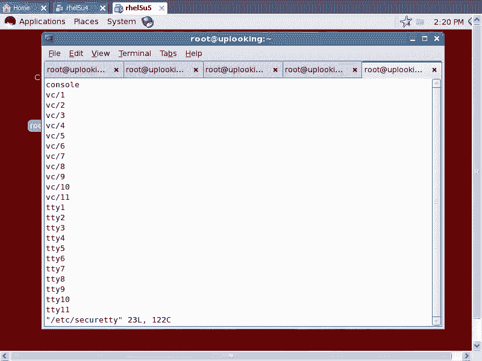
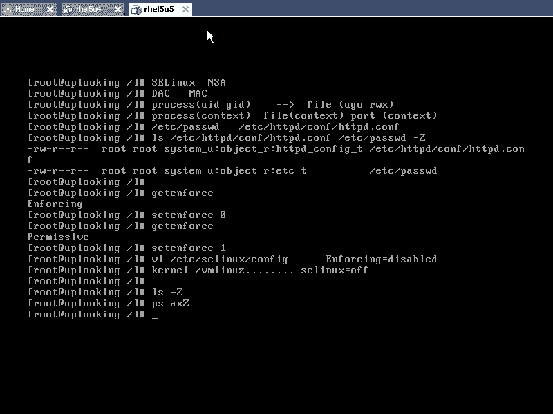
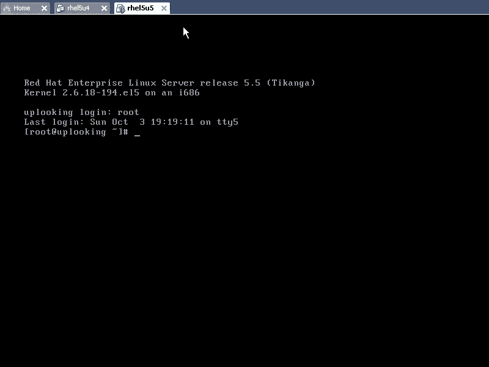
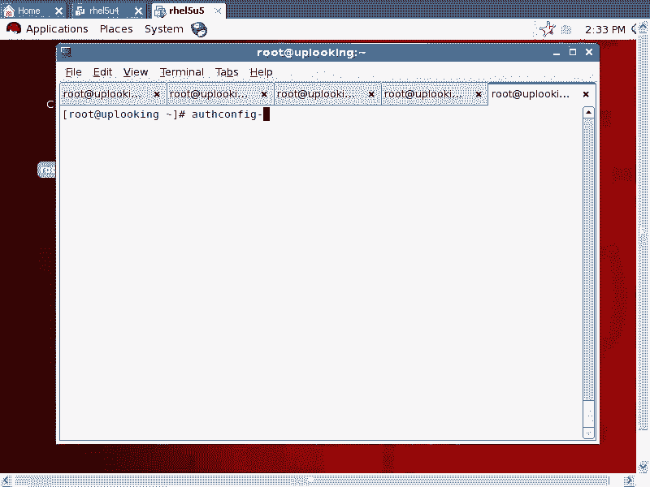
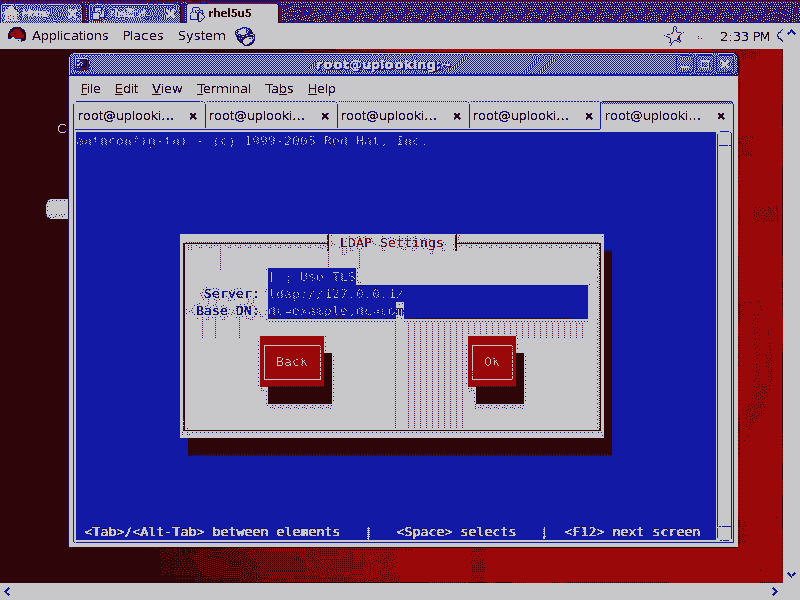
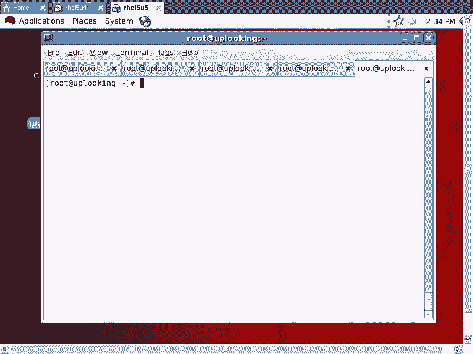
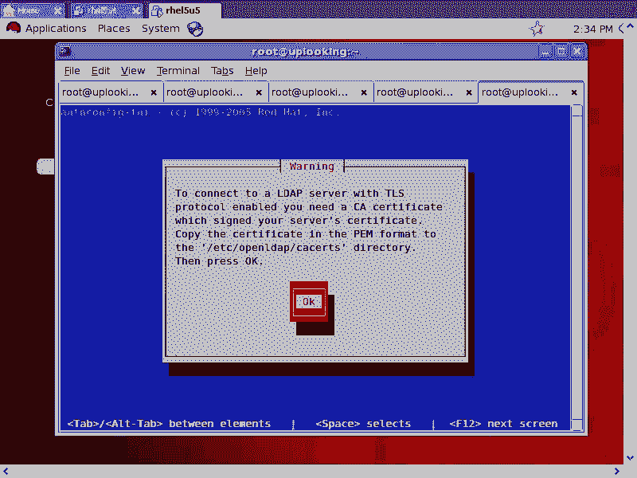
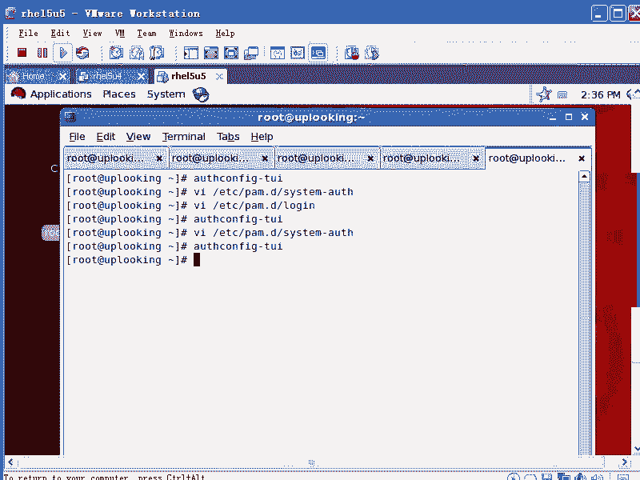

# Linux安全体系：P79：PAM系统登录认证详解 🔐

在本节课中，我们将深入探讨Linux主机安全体系中的一个核心组件——PAM（可插拔认证模块）。我们将了解PAM的体系结构、工作原理以及如何通过配置PAM来控制系统登录认证过程。

## 概述：什么是PAM？

上一节我们介绍了Linux安全体系中的服务安全和主机安全。本节中，我们来看看主机安全中一个至关重要但常被忽视的组件：PAM。

PAM，全称为**Pluggable Authentication Modules**，即可插拔式身份认证模块。它是一套由操作系统提供的、统一的认证机制，旨在解决不同应用程序（如SSH、FTP、login）各自实现认证逻辑所带来的混乱问题。

## PAM的体系结构 🏗️

PAM的体系结构分为几个层次，理解这些层次是掌握PAM的关键。

### 应用程序层
这是最上层，包含了所有需要进行身份认证的程序，例如：
*   `sshd` (SSH服务)
*   `vsftpd` (FTP服务)
*   `login` (本地登录程序)

这些应用程序自身不处理复杂的认证逻辑。

### PAM库层
当应用程序需要认证时，它会调用一个名为 `libpam.so` 的共享库。你可以通过以下命令查看系统已安装的库：
```bash
ldconfig -v | grep pam
```
这个库为应用程序提供了四种标准的认证接口：
1.  **`auth`** - 认证管理：验证用户身份（如检查密码）。
2.  **`account`** - 账户管理：检查账户属性（如账户是否过期、是否允许登录）。
3.  **`password`** - 密码管理：更新用户的认证令牌（如修改密码）。
4.  **`session`** - 会话管理：在用户登录前和注销后执行的任务（如记录日志、挂载目录）。

应用程序通过调用这些接口（例如 `pam_authenticate()`）来发起认证请求。

### PAM模块层
`libpam.so` 库本身并不执行具体的认证工作，它更像一个“调度员”。实际的认证工作由位于 `/lib/security/` 或 `/lib64/security/` 目录下的各种 `.so` 模块文件完成。

以下是常见的PAM模块：
*   `pam_unix.so`：使用传统的 `/etc/passwd` 和 `/etc/shadow` 文件进行认证。
*   `pam_ldap.so`：使用LDAP协议进行远程认证。
*   `pam_tally2.so`：用于记录登录尝试次数，防止暴力破解。
*   `pam_securetty.so`：控制允许`root`用户从哪些终端（tty）登录。

每个模块都专注于一种特定的认证方式或任务。

### 配置文件层
既然有这么多模块，那么每个应用程序应该使用哪些模块呢？这由PAM的配置文件决定。

主配置文件目录位于 `/etc/pam.d/`。每个需要PAM认证的应用程序在此目录下都有一个同名配置文件（例如 `/etc/pam.d/login`， `/etc/pam.d/sshd`）。

这些配置文件定义了该应用程序在进行`auth`， `account`， `password`， `session`操作时，应该按什么顺序调用哪些PAM模块，以及模块之间的逻辑关系。

此外，许多PAM模块还有自己独立的配置文件，通常位于 `/etc/security/` 目录下，用于定义模块的具体行为参数。

## PAM配置文件详解 ⚙️

理解了体系结构后，我们以最常见的 `login` 程序为例，看看其PAM配置文件如何工作。

### 配置文件示例
打开 `/etc/pam.d/login` 文件，你会看到类似以下内容（不同系统可能略有差异）：
```
#%PAM-1.0
auth [user_unknown=ignore success=ok ignore=ignore default=bad] pam_securetty.so
auth       include      system-auth
account    required     pam_nologin.so
account    include      system-auth
password   include      system-auth
session    required     pam_selinux.so close
session    required     pam_loginuid.so
session    optional     pam_console.so
session    required     pam_selinux.so open
session    include      system-auth
```

### 配置语法解析
每一行通常由以下几部分组成：
*   **模块类型**：`auth`， `account`， `password`， `session` 之一。
*   **控制标志**：定义该模块的成功或失败对整体认证结果的影响。
*   **模块路径**：要调用的PAM模块（通常省略路径，在标准目录中查找）。
*   **模块参数**：传递给模块的选项。

### 核心控制标志
控制标志决定了模块执行结果如何影响认证流程，是PAM配置的灵魂。



以下是主要的控制标志：
*   **`required`**：模块必须成功。如果此模块失败，最终认证一定会失败，但在返回失败前，会继续执行同一堆栈中剩余的模块。
*   **`requisite`**：模块必须成功。如果此模块失败，立即返回失败，**不再执行**同一堆栈中剩余的模块。这比 `required` 更严格。
*   **`sufficient`**：模块成功则足以通过认证。如果此模块成功，且前面没有 `required` 模块失败，则立即通过认证，跳过同一堆栈中剩余的模块。
*   **`optional`**：模块的成功与否通常不会影响整体认证结果，除非它是该类型中唯一的模块。
*   **`include`**：包含另一个配置文件中的所有规则。这使得配置可以模块化和复用，例如上面示例中的 `include system-auth`。

**类比理解**：
想象一个认证流程像一组条件判断：
*   `required` 就像 **“必须”**（AND条件）。没它不行，但会检查完所有条件再告诉你不行。
*   `requisite` 就像 **“必须且立即”**。一旦不满足，立刻拒绝，不浪费时间检查后面的。
*   `sufficient` 就像 **“足够”**（OR条件）。只要满足这个，就算通过，不用看后面的了。

### 登录流程实例分析
以 `/etc/pam.d/login` 中的 `auth` 部分为例：
1.  首先执行 `pam_securetty.so` 模块，检查当前登录的终端（如tty1）是否在 `/etc/securetty` 文件的安全列表中。这决定了`root`用户能否从此终端登录。
2.  然后通过 `include` 语句引入 `/etc/pam.d/system-auth` 文件中的 `auth` 规则。通常，这里面会调用 `pam_unix.so` 模块来验证用户名和密码。

## 实践：修改PAM配置 🛠️

理论需要实践来巩固。让我们通过一个简单的实验来感受PAM配置的威力。

**实验目标**：修改配置，使从控制台登录时无需密码。

**操作步骤**：
1.  备份原始的PAM登录配置文件：
    ```bash
    cp /etc/pam.d/login /etc/pam.d/login.backup
    ```
2.  编辑 `/etc/pam.d/login` 文件，找到包含 `system-auth` 的 `auth` 行。例如：
    ```
    auth       include      system-auth
    ```
3.  在这一行前面添加 `#` 号将其注释掉：
    ```
    #auth       include      system-auth
    ```
4.  保存并退出编辑器。
5.  现在，切换到另一个文本终端（例如按 `Ctrl+Alt+F2`），尝试用任意用户名登录。你会发现系统不再询问密码，直接进入了（一个权限很低的）shell。

**原理说明**：
我们注释掉了负责密码认证的 `system-auth` 包含项。在 `auth` 阶段，只剩下 `pam_securetty.so` 模块需要执行。只要当前终端是安全的（默认控制台终端都是），这个模块就会返回成功。由于没有其他 `required` 的模块失败，且存在 `sufficient` 或默认成功的条件，整个 `auth` 流程就被判定为成功，从而跳过了密码验证环节。

**重要警告**：
这是一个**极其危险**的实验操作，会严重削弱系统安全性。实验完成后，请务必恢复配置：
```bash
mv /etc/pam.d/login.backup /etc/pam.d/login
```
或者手动删除注释符号 `#`。





## PAM的常见应用场景 💡

掌握了PAM的基本原理后，你可以利用它实现许多强大的安全策略：

1.  **强制使用强密码**：通过 `pam_pwquality.so` (或旧版的 `pam_cracklib.so`) 模块，定义密码复杂度规则（最小长度、包含字符类型等）。
2.  **防止暴力破解**：使用 `pam_tally2.so` 模块，限制连续登录失败的次数，超过阈值后锁定账户一段时间。
3.  **限制用户登录**：使用 `pam_access.so` 模块，结合 `/etc/security/access.conf` 文件，可以基于主机名、IP地址、用户组等来允许或拒绝登录。
4.  **启用多因素认证**：可以配置PAM链，要求用户同时通过密码(`pam_unix.so`)和指纹、智能卡(`pam_pkcs11.so`)等多种方式认证。
5.  **集中式身份管理**：使用 `pam_ldap.so` 或 `pam_sss.so` 模块，将认证指向中央的LDAP或Active Directory服务器。



## 总结 📚





本节课中我们一起学习了Linux可插拔认证模块的完整体系。



我们首先了解了PAM诞生的背景——为了解决多服务认证方式不统一的问题。然后，我们剖析了PAM的四层体系结构：**应用程序层**、**PAM库层**、**PAM模块层**和**配置文件层**。接着，我们深入解读了PAM配置文件的语法，特别是 `required`， `requisite`， `sufficient` 等核心控制标志的逻辑，它们像编程中的条件语句一样控制着认证流程的走向。通过一个“免密码登录”的实验，我们直观地感受到了修改PAM配置所带来的效果。最后，我们列举了PAM在实现密码策略、防暴力破解、访问控制等方面的常见应用。




理解PAM，意味着你掌握了Linux系统身份认证的钥匙，能够根据实际需求，灵活、精细地定制系统的安全策略。请务必谨慎操作，并在生产环境中任何修改前进行充分测试和备份。