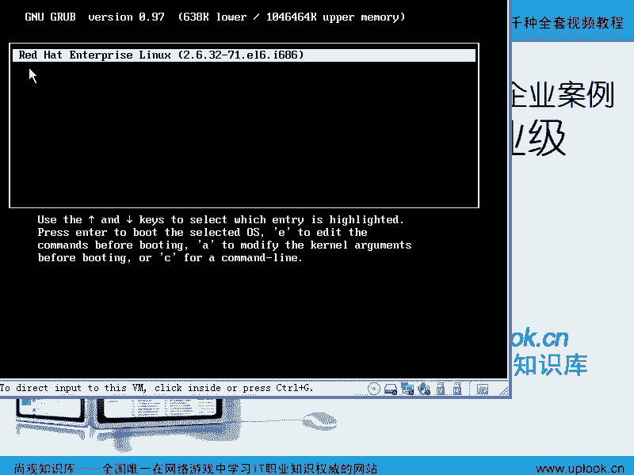

# 尚观Linux视频教程RHCE 精品课程 - P7：RH033-ULE112-02-4-2-RHEL6安装-重启后的配置选项-配置IP地址 - 爱笑的程序狗 - BV1ax411o7VD

小明啊，咱们的话呢在前面的话呢用一些呃就是说标准的安装方式或者非标准的安装方式把这个整个系统的话装到这个位置，对吧？只有在你点击刚才那个页面，就前一个页面的最后一个nex的时候。

那么我们的啊安装程序的话呢，才开始帮我们装那些系统。那在这之前的话呢，HER5的版本里面，就是你只有点击最后那个nex，他才开始帮你分区格式化。而H16，刚才你也看到了。

是在我们调整成整个的这个存储的结构以后，点击下一步的时候，他才会帮我们分区格式化是吧？然后呢在点击最后选择包以后，再点击对最后一个nex的时候，他才会帮我们装这个包装完了以后的话呢，再有什么呢？

一个rebo。对，那么rebo之后的话呢，我还是要给大家再介绍一下，为什么呢？因为你有可能不知道那些步骤到底是干什么？那咱们为什么要耗时这么长时间来详细的讲这个安装过程呢？因为啊我们的服务器它的结构跟。

是不一样对，PC上你一2块硬盘折腾一下就好了。对，但服务器上有什么呢？硬锐的。对软瑞对LVM是吧？分区的时候，那我要知道哦，最多可以有4个分区是吧？四个主分区分区。那么多余4个的话。

他要扩展分区和逻辑分区，对吧？为什么因为有分区表这些东西，然后put load装在哪啊， load这个问题的话呢，在你以后如果工作当中再遇到问题。比方说要求多系统共存的时候。

我们再把foot特 loader再重新来一遍，好的，好不好嗯？

所以的话呢我们在这边最后一个部分就是你装央操作系统以后，还有一些基本的这样的一些呃设置啊，我们再点击最后一个什么呢？reboot的时候，看一下，你再看一下，好吧呃。你看rebo以后的话呢。

系统的话呢就把当前光盘启动的这个linux系统就弄掉了然后呢开始这样的一个启动啊就是这个时候啊这个时候你看到这个界面这是硬盘上的这个lin系统如果光盘上的系统叫做OSOS专门在光盘上的个系统跟个window小现在的话呢你看到这个界面就是给我提的就是这个 load是启动是装载也就是说 load是一程这一类程序就是给我们的lin系统装载系统内核的者启动其他的或者启动其他的window系统都可以它来做如果要是你嵌入式手机的话呢。

甚至还有多层次的刷。

的时候你要破解for load才能刷一个最新的这个机器进去啊。那在这个界面下的话呢，我希望你看到的是什么呢？就是说这个时候我们如果装了一个内核的话，这边就会有这样一条。嗯啊，如果装了两个内核的话。

就会有两个那在我们的HEL。

比方说EL3里面啊嗯EL3里面它会有什么内核呢？它会有一个叫做SMP的内核。嗯啊SMP的内核。SMP的内核就是对称多处理器的支持啊，对称多处理器的支持。嗯，那么在RRT13里面的话呢，有这个内核。

还有一个叫做什么呢？huge啊HUGE啊huge memory MEM。内核就是你能看得到啊，你现在的话能看得到这个内核叫什么叫2。6。32-71是吧？点EL6是吧？那如果要是你在HL3里面的话。

你是多核CPU的话，就是2。4点什么什么东西啊，然后呢杠什么什么点EL3点SMP明吧？点SM它就有SMP字样如果要是你的内存大于什么呢？大于4GB的话。

因为我们说过二的32次方是4G如果你多于4GB的话，它会自动装个内核就是什么呢？ memory内核，或者说如果不自动装，那你自己要装也就它的内核的话呢，就已经有这个这个功能的话呢。

是让我们32位的系统支持多于4GB的内存那你现在肯定也有这个经验windows XP最多可以支持多大内存4G4G是吧那么264倍的XP可能能支持更那这就是什么呢？4GB的这个问题啊，多于4GB的话。

一般会装这个内核清楚了吧清楚了。

那么R714的话呢，我也忘掉了，有没有SMP内核，反正你看到SMP知道你有多个CPU或者有一个CPU支持超线程，就有两个有两条线程可以直接运行。那就是它也会自动装SMP嗯明白吧？

那么ge memory huge memory的话就是大于4GB的这个这个机器，它会自动装 memory内核明吧？那么715里面以后啊，那么SMMP的这个内核没有了。

标准内核就跟我们当前的这个R716是一样的嗯，就是它只有这样一个内核，但是这个内核就已经支持多多CPU，就是SMP就已经默认在里面了。嗯因为你现在想找一个单核的处理器还不容易啊。

就我现在这种双核的双核这种处理器都属于那种S这种多处理多处理器，就是你要找一个单核的CPU还不容易，这个内核的话呢，它就默认就肯定是支持的吧但是呢在715或者1。

R715或者R716里面啊，如果要是你选择32位系统，嗯，就是32位系统，明白吧？如果你选择32位系统，就是我们看到的后面这个I686这个字样。嗯，如果要是64位系统对吧？嗯。

那如果要是这个I686这个字样的话呢，它会有一个什么呢？它会有个叫做PAE。

啊，什么什么PAE内核PAE的话呢就是物理地址扩展嗯，物理地址扩展，这是英特尔CPU的话一个功能。也就是说你的这个你的这个CPU啊是32位的。嗯，那么你的操作系呃，你的CPU是64位的还是32位。

这都无所谓，那么如果你的操作系统是32位的，那你寻址的范围不是还是4G嘛？对但是你加这个内核以后，也就是用到了英特尔这个功能以后，你就可以支持达到32GB的内存，明白吧？32G是那么每个版本不一样。

甚至可以达到64G啊，那如果要是你是64位的，就是什么呢？X86呃杠64这样字样。如果是这个字样的这种内核的话，那它就可以支持很大很大的它理论上的话可以支持到呃4G乘以4G的这种大小。

但是实际当中不可能那么大，但是呢也应该是反正就是几十G的话，应该没有什么问题。具体可以支持到多少呢？我们每一张光盘有个发行助就是那个 release那个发行助如果要你看中文版的话。

有ZH下N打开那个你可以。天的版本支持最大内存数。哦，明白PAAE的内核清楚了吧？清楚。所以这就是几种版本。然后呢，你如果装了这个系统一启动以后，我们可以看到多个内核，到底启动哪个，那很难说啊。

你看到它有个倒数嘛，54321到在倒数完之前，你摁一下键盘上任何一个东西就可以到这个界面。嗯这个界面下，你选择那个相应的内核内核啊，那我现在直接进去好不好？直接进去以后的话呢，我们这是第一次引导H16。

对。

第一次引导R716的话呢呃。在引导H16的话，它是一个纯图形界面的话，这样引导是吧？也蛮好，也蛮漂亮的吧？NESC是吧？嗯然后呢可以看到就是说它的这个呃真正的引导过程。嗯啊。

但是呢它那个东西就是糊弄人的啊我们说一个笑话，就是很多我们这边原来有一个学生啊，他跟我们这边咨询师就是说就是上官咨询师说我觉得windows95和9吧的话。

比windows XP和还windows7都要好用都要好都要高级，为什么呢？如果看到那个引导界面是彩色的，就是一张图片你知道吧也不能动，但是呢这说明什么呢？就是说呃这个引导的时候。

这个界面本身是一个糊弄人的，别管它多漂亮，本质上如果对于你一个真正技术人员来说，你要看最根本对，清楚了吧？清楚，所以的话呢我们最好按ES看一下他那个各个服务启动有没有问题。

那么我们看啊现在第一次启动的话会有这个界面。对，那么这边的话是一个简单的设置界面我们这边点击。

嗯，这边是一个license嗯，那么就是说许可这个跟微软的许可差不多啊，都是什么呢？copyrightcopyright所有的版权归属于reite啊有限公司。那么所有的这个权利都什么保留下来。

re商标和什么呢？这种商标啊，这些logo什么的话都属于reite而linux的话呢被注册于被被谁注册呢？linux towards这个家伙啊，这是linux支付是吧？对那么他这边的话呢是说的很明确嗯。

同样的话呢，我告诉你，你如果要是用现在的这个版本，你们现在的版本，然后呢直接拿来用啊，不给retite钱你是怎么样呢？你是违法违反的明白？因为它有copyright有没个版权。那你说哎不对啊。

我这linux啊linux应该是免费的那么reite告诉你，我们采用GPL，我用GPL的代码改动到的所有的代码，我都已经在网站上公布出来啊。你有本事你就自己去编译，C语源全部都编译成二进制。

但是我这个光盘是已经编译好的，你不能用明白吗？明白了？所以的话呢re它有意的用微软的生财方式，然后呢来给自己赚钱，但这并不是不不行。因为一个公司你不给他钱，这个公司就完蛋了。公司完蛋了。

你第二代产品怎么出来，所以很多这个愤青啊，就是原来的搞lin人都是愤青嗯啊，呃我不不是说愤青不好，原来我也是这样，我在大学里面说这些家伙收那么多钱是吧？但是后来发现啊你不给这个钱给这个公司。

这个公司就没有好的产品。你就你只能用一次他的产品你盗版一次受害的是整个的软件产业嗯所以所有中国人的话都有一种感觉，我用你的软件是看得起你是不是这样我用的软件看得起你，你还朝我收费是吧？

简直是呃这个太不应该，其实你要不给钱，那这个软件的话呢，只有越来越差当然你要给。钱的话呢可以让他们竞争。有的人收费1万，你这个收费5000，那收费5000又能达到1万的相同的效果去竞争也是蛮好的。

就跟买轿车一样。那轿车再那么贵，你可以不用去买。对，但是呢你说谁都可以偷车，那这个车还谁还去造是吧？谁从这个汽车厂直接把汽车开了，那谁还去造这个汽车。那大家都没有车用。嗯啊，所以这边呢这个版权的话呢。

我们还是要说一下嗯。呃，linux可以卖钱，可以卖很贵啊，但是呢你要遵循GPL只要你用到GPL里面的代码，你就要把GPL，你要把自己改动的代码贡献出来。如果要你没有用到这个GPL的代码。

那你可以不用去贡献，所以你想收多少钱都没有关系它就有自己的一个叫做服务器，就是它的一个大规模的企业部署的这样的一个专门的目录管管理服务器，这个服务器就是工闭源代码他不可以嗯明白吧？

我们去找re公司的这个比方说技术人员，我说哎能不能给我们提供一份的话呢，来拿来玩一下是吧？不好意思啊，这个东西是分配源代码明白了吧？明白了？

好我现在遵循这个ense啊一下这边的话呢就是一个IHN那么你掏1万多块钱买的系和你不付费，然后在那边偷偷去用那到底有没有区别呢？它总得要有点区别。那么一个区别就是什么呢？IHNHN的话呢。

可以根据你的这个账号的。去就是你这个账号有没有权限。如果有这个权限的话，你可以去升级你的系统。嗯啊，那么就是在一定时间之内升级，还可以获得电话支持等等，这就是付费以后的直接的好处。嗯啊。

如果要是你没有你不要这个HN，那么你就直接点foward啊，那这边的话呢，你说。你看一下啊。为什么要采用安全？那么他可以通过账号的话呢，在互联网络上去升级，实际上就类似班 to和得b的那种方式。

就是能通过y啊YUM，然后呢直接从互联网络上去升级你的系统。嗯啊，那你没有这个账号的话呢，reite不给你这个服务。Yeah啊 forward。下一步。Yeah。😊，他没有管我要这个。

哦啊他说因为网络连接的话呢，没有激活啊，所以的话呢没有，就是他就直接下一步就完了。嗯，但是如果你是激活了网络连接，比方说你获自动获取的IP地址啊，它会怎么样呢？他会就是建议你注册一个IHN啊。

反复让你注册。然后呢，他说那么他会你点for的时候，他会弹出一个呃弹出一个这个窗口啊，弹出个窗口，然后告诉你说什么呢？你真的不需要HN吗？再想想吧。如果你点击yes，我就不需要，我要跳过这一步嗯啊。

说你呃。我记得内部叫什么呢？就是有一部啊叫thank you，就是说他弹出一个对话框嘛，那有个按钮，就是说谢谢你啊，我不需要就是thank you。然后呢我要呃就是跳过去。

那么你点那个按钮它就直接跳过去明吧？那么现在的话呢因为网络连接没有激活，所以的话直接这边的话要求你一定要创建一个什么呢？创建一个用户啊，那么比方说我起个名字，那这个用户名。

我建议你啊养成一个良好的这种安全的习惯，要把你的英文名和你的汉语拼音，就是你的这个呃就是就反正乱七八糟这个字符的话呢，组合在一起叫一个用户不要要那个就是用的太多的啊。

你就用的最多的是什么名字者ad这种这种用户名就是找扁，你知道吧？这个用户名，你往互联网络上一放，人家成天的话在那边测你的这个用户名密。所以你要起个，你说我叫芙蓉姐姐是吧？那我叫什么呢？sister是吧？

嗯啊芙蓉。那这样的名字的话呢，中英结合是吧？对，鬼才能猜得到你说一个特别技术特别牛的国外黑客是吧？他知道芙蓉是什么意思，是吧他只知道sister是吧？对，所以这时候他猜不到你的用户名。

那更猜不到你的密码。对，就是他密码知道他也没有办法。所以一般的话呢我们建议大家把用户名和密码的话呢，就是说完全就是用户名给他设的稍微怪异一点，不要用单纯的英文单词，明白吧？那我这边的话呢。

你方说sha QYE啊，这是我的名字。那么这样的话呢，完全的名字QYE。然后呢，密码啊，比方说跟那个什么是没有关的，就是跟你的用户名是没有关的，最好然后点击nex。这时候他说你这个密码的话太简单了啊。

太虚弱了啊，太 weak又特别短啊，你一定要用它吗？yesfor这样几步下来就OK了。那这边的话呢，他是说你的K down要不要启用K当是什么呢？就是在windows下的话，你是不是经常见到一个蓝屏。

吗？蓝屏是什么呢？就是你的内核，就是你连windows的内核已经当了，没有办法进进行下去。嗯，就相当于如果要是我有个word啊，它出现问题。对，那我们说这个word出现严重问题，请你把它关掉。对啊。

然后如果要是你再打开一个，比方说播放器，播放器出现严重问题，把它关掉。结果你操作系统出现了严重问题，那就直接就关机，然后重启，对吧？所以的话呢Kd的话呢，一般是用来进行内核调试。

就是内核出现问题的时候啊内核里面的这个。内核当时所在的这个内存的这个部分，直接把它全部都下载到硬盘上来进行分析，这种推档，嗯，明白吧？是，那你就fininish啊，这样的话呢我不启用。

那么这边最后一步就OK了嗯。

你对刚才那些步骤有没有问题，有没有疑问？有疑问我我记得我以前装的操作系统都应该有那个SElin和那个防火墙的那个配置啊，在那一直都没有没有是吧？嗯没有就没有像你以后的话就配因为在HEL3啊。

H14开始配S以后的话呢，的要求是越来越严那你现在装windows的话呢，它也不会说你装不装这个防火墙等等是吧，它自动就给你装上去了。对，实际上他们的思路是一样的，吧？那这时候的话我选用什么呢？

用户名为ro来登录是吧？然后呢用我原来设置的这个呃密码是吧？那像或者说是典型的一个，你只能用普通账号来登录嗯，然后SU乘吧？啊，那么这边我用如的身份来登录了。嗯，如的身份登录了以后，你可以看到啊。

很明显的看到什么呢？你的这个网卡这边是一个叉的状。嗯啊，网卡在我们以前的版本里面，咱们是可以直接配置好了以后，启动的时候，它自动启动，对吧？那其实的话呢，现在啊你我这样的右击它点击编辑这个连接性啊。

在这里面我们看到这个ETH0ETH0的话呢，我在这边点击它的编辑啊，编辑一下，它这边的话呢是没有自动去连接的嗯，明白吧？明白了，没有自动连接。那我先的话呢，把它我我不建议你用图形界面嗯，明白吧？明白。

我不建议你用图形界面，那我在这里面的话呢，如果要是不想配其他的东西，我建议你如果要是在生产系统，你自己编自己的编编程环境啊，或者你测试环境啊，倒无所谓了。但是呢你一般要用文本界面多一些。嗯啊。

那么假如说你是用这个用用一个生产系统，用于生产系统。首先你启动的时候就应该。怎么样的？你看啊跟着我的命令嗯VIETC下的IITTAB嗯啊，那么你看啊我输入了1个INIT以后，摁摁了一下ttable键。

啊，IITT那这个时候的话呢，就是说我现在的话呢II啊，然后我一摁table键，它有个T是吧？对，它不动不自动再帮我补齐了，我再摁两下table键，那它会把IIT开头的所有东西全部都显示出来啊。

也就是说这个时候他会问你，你到底打开这三个文件当中哪个，我这边的话呢是IITTAB是吧？对我再输入一个T。那这样的话呢，我们以INITT开头的就只有这样一个文件。对，那我再按table键。哎。

它是自动包不齐的。是的，这样的话我就不会输入错误，明白吧？在lininux里面，命令和和参数全部都是大小写区分的。嗯所以的话呢你不要尽量不要就是说输入错误。很多人不习惯这个总是觉得命令行特别难受。

当你习惯了以后，你会发觉它的效率要比windows中点点点鼠标的话要简单多了。嗯，好吧，所以现在这个命令的话呢，你输入完VI空格杠啊。

杠就是从根开始的ETC目录下面IITTAB你看这个文件跟以前的版本有什么区别。如果有经验的人，你看一下一回车以后，你看打开它。从上。倒下啊嗯就这么多了，前面全部都是井号做注释。对。

只有后面最后这一行是井号取消掉。嗯，在R715R714R713的所有的版本里面，后面还有很多很多的东西。嗯，就IITtable的话里面有很多很多东西，我们来对比一下啊。

Yeah。

我们来对比一下。就对比一下其他的这个版本。嗯那它其实的话呢，这个IITtable的话又做的更加傻瓜化，更加傻瓜化的话，就是说呃所有的产品它都有个趋势啊，但是你不要太太介意这个趋势就是越来越简单哦。

也就是说把专业人士变得什么呢？就是门槛越来越低，就是你谁都可以操作一个专业的操作系统。我希望我的系统不是越来越难，而是越来越简单明白吧？明白？那O我们看一下R715啊。

咦，正在恢复中还正在恢复中啊，嗯，半天都不动了。

啊，好出来了。

那我们看下2715嗯。其实我们习惯了一个老的版本以后的话呢，就不太喜欢这个新的版本的这个变化。嗯，但是呢任何的一个产品，如果它不升级，它卖什么去，对，是吧？你像大家都用XP把XP的话呢。

windows XP做的特别特别好。现在windows7是吧？出来，他一定要把XP打败自己打开嗯，对，你看啊。

VI啊ETC下的IITTAB是HL5的那这里面东西可就太多了。对，你看它前面的话也是一样是吧？对，但是呢后面的话这边的话呢，一条，那么HL6在下面都没了。HL5的话呢，下面还有很多。

是的是吧，有很多吧。嗯啊那么我们在R1ER6里面的话呢，我们可以看到你能配置的东西就就这么一行了。对，就这么一行。所以我一般的话呢，在R就是装完了系统，如果我这是生产系统的话，我一般启动的时候。

我不要让它去启动固新界面。那我在这个地方的话，我怎么样呢啊，你看啊嗯啊我把光标移到这边来，你想把它改成什么呢？改成其他的什么数值，你是按什么键的话，它都没有反应的。嗯啊，那么只有怎么样的？

你看我摁一下I。😊，你看重新来一遍啊，我打开这个文件是吧？摁上啊按上的话就是上一条命令。嗯，打开这个文件，然后呢我移动到最下面，你想快速的移动到整个文件的最下面这行，摁一下G啊。

大写的G就shift然后呢到这边移动到这个位置以后，嗯，你按竖按键的话是没有用的。对那们就按一下I，那你看啊摁一下II。😊，哎，ENI就下面变成音色的了，是吧？in色的模式下，你才可以改。嗯。

你把这个文件的换怎么样？删除掉，改成什么呢？33嗯啊，所以的话呢文本的界面就够了。对于生产系统来说，不要去废内存和CPU去启动那个复音界面。嗯，所以一般我们生产系统的话都是文本界面，嗯，明白吧？然后呢。

在刚才那个inser的界面下啊，刚才inser的界面下改成三了是吧，改成三了以后，我摁下什么呢？EFC嗯，你看音色的没了是吧？再摁下什么呢？冒号WQ嗯保存并退出。如果你不想保存，就是Q感叹号啊。

如果保存并退出就WQ啊，一回车，这样的话这个文件就改了。嗯，下次启动的时候，它就不会启动这个图形界面就直接是文本界面。嗯，那么文本界面是什么样的？在我们H16里面啊。

H16里面你可按住conttrol out啊，conttrol然后呢加上一个什么呢？F2啊不能摁F1了你不能按controrl加F1了，明白吧嗯。😊。

contrlt加F2。对。第一个控台就是原来在HL3H14HL5里面的话呢，ctlt加F1就是第一界版的控制台。对，但是现在的话呢，你摁一下ctrl加F1以后，是它自己是这个图形界面。

自己嗯以前的图形界面是alt加F7，也就是第七个控制。现在的话呢，这个图形界面的话变成了什么？默认变成了第一个控制台。

嗯啊第一个控制台，所以第一个控制台的话已经变成同新界面。所以你想跑到第一个文本控制台上，嗯，是conttrol加F2嗯是第一个文本控制盘。在这个文本控台下，你可以输入什么呢？用户名如此密码为什么呢？呃。

就是你当初设的这个密码就登录进来了。

明白吧？那也就是下次重新启动的时候，它就是这个界面，就这个文本界面。嗯，就这样的文本界面，这不会有图形界面。你要想启动图形界面怎么样呢？star。这样的话是启动图形界面。

但是呢你远程连接的时候不会不会不会有这个图形界面。对，明白吧？所以这就是我们所说的这个基本的这个使用。那么我们现在返回头来啊，第一次装完系统以后。

我要先启动的文本界面下次启动我要启动的文本界面然后呢接下来的话我们看一下网络常见的网络配置的话，你输入sstem是吧？杠fi杠那么网络的话，刚才我们已经看到它是默认不启动的是吧？

那我这样的stem杠fi杠呃network打开它，然后这边的话呢，我点击什么呢？我要配置它是吧？这是我的ETH0ETH0是标准的我们的以太网的第一个网卡，嗯。

那ETH1呢第二块ETH2呢就是第三对那么如果要是你正常的这个服务器的话，至少有2块网卡一般还有4块等如果要是。你比方说你是ADS要拨号，拨号出来那个设备是什么？设备文件是什么呢？就是那个代号是什么呢？

PPP0啊啊PP协议就是点对点连接协议啊，那我现在的话呢看到了这个什么就是你看我输入的是什么呢？我再回过头来再看啊，嗯我刚才输入的是什么呢？输入的是一个命令，上啊。

就是stem杠卡啡的杠network就是系统的配置。网络的配置嗯如果要是我在同形界面下，我就告诉你点赞点这点赞，但是我讲课从来不去讲这个点点，因为你实际生产系统不会去在文图形界面下去配嗯啊。

那我就stem杠fi杠打开它以后，那这边上面就是什么呢？icefiration是吧？就是我们的这个设备的配置。那我一回车就进到这里找到的第一个网络设备是ETH0那我要配ETH0是吧？回车。

那这边的话呢你看名字叫做ETH0，设备也是ETH0那他现在的话呢是DHCP方式我摁一下空格，那么不用DHCB方式嗯，然后再移动到下面来输入静态192168啊，点3。246啊，然后呢192。

168点这是子网源码是255。255。255。0是吧？然后呢192168。3。1是我的默认网关默认的DNS服务器192168。3。1明白吧？我设置好以后。OK然后点击C啊，然后呢再保存并退出是吧？

保存并退出完了以后。linux里面有个习习惯啊，嗯就是你要把它写到一个配置文件里面去啊。立刻不会生效，但是下次启动的时候生效，或者这个服务重启以后生效，明白吧？但是呢如果要是你不把它写到配置文件里面去。

那你就是当下生效。那你你通过这个命令改了一下你的IP地址，当前生效，当下次重新启动就不生效了，没，除非是你把它写到配置文件里面去，然后再运行个命令把它当前再去生效。那这个命令是什么呢？

我们一般啊刚才的命令stem杠杠network是吧？然后呢啊。然后呢输入一个什么呢？service啊SERVICE嗯lightwork。

re这是在HL3HL4HL5里面都可以均用的嗯先输入stem杠考这个杠net啊HL3可能reite杠考个啊，就是说这个命令可能有点不太一样，那么再去输入s network star。

就是说我现在要把这个服务重启一下。这个服务的名字叫什么呢？叫做net啊，然后这样一回车。这样的话呢，你看一下，那么它的ETH0啊。启动了没有啊？我输入1个RF卡fi，你可以查看当前的网卡的状态啊。

直接回车。你会发现它只有1个LO回还设备，就是呢我们那个127。0。1自己的这个东西回还设备是什么呢？我什么时候访问回还设备就相当于你的网卡自己连了根线连到自己身上。嗯，也就是你什么时候访问127。0。

1访问的都是什么自己啊自己明白了吧？所以呃就是RFfi，你看到的LO回还设备这个东西。嗯，然后呢，如果要是我在这边输入一个什么呢？输入1个呃输入1个Rfi啊，ETH0是吧？嗯加上1个IP地址。

这是给我当前的这个网卡，现在就给它配1个IP地址一回车。😊，哎，配置好了是吧你再输入你看咦你这个ETH0是不是这个网卡的IP就已经有了嗯，对吧？但是呢我刚才跟你说过，如果我用命令立刻生效。

但是下次启动的时候生效不生效不生效，那你改写配置文件是吧实上你是用这个这个命令啊杠就是改写当前的这个配置文改完以后不是立刻生效明白吧？然后呢，你想立刻生效怎么样呢？你要输入一个s吧但是其实我们现在。

它总是不会生效，我只要一启动啊，改写那个配置文件，ET0就没了对啊，然后呢我这边再去重新启动一下老你是是骗我明明说已经改写的配置文件是吧但是呢我一重新启动这个服务它就不生效到底怎么回事每一次一重新启动服务那我这个网卡不是都不不能激活嘛？

必须用现激活一下那不行啊什么原因呢仔细。😊，看一下嗯。你跟着我这，你记住这几个命令，首先啊，嗯system杠 conflictfi杠net行吗？哎。呃，我这样的啊再再切换另外控制台吧。嗯。

因为刚刚控制台的话，摁ctl加C，它总是会显示那个东西啊嗯。先输入什么呢？system啊杠。你也可以按table键啊嗯对键let。是吧对，然后先输入这个命令啊。

这边也是加那个大大就是向向向上一个箭头C啊，你可以把这个最后这个取，就是不要看它啊不要看它，最后面两个去掉啊。嗯那么一个这个，然后呢，接着servicelight。Work。

re啊这样的话呢就应该默认在H13H14H15里面都应该搞定。H16不行啊，什么原因呢？我们来查看一下，因为什么呢？这个命令啊。

上面这个命令就是sst杠fi杠net这命令它改写的是一个配置文件这个配置文件我们要用编辑器去编辑I就编辑啊。

你可以这样的VI或者是VIM都可以VM的功能要更高级些VIM啊ETC啊杠ETC下的ssfi啊sfi你要自己去写啊。如果要是你这边输入了一半摁下 table键，它自动帮你补齐啊，它有个叫做。

按table键net这边不唯一的时候，它就不自动帮你读齐了。嗯，如果要是不唯一的时候，你摁两下table键，它就会帮你把可能的结果全部显示来。night work是吧？对，杠。是以这个开头的。

你这个杠开头是不是只有这样一个文件夹了，只有这样一个文件夹是吧？那么按下加自动保器有个什么呢？RFCFGETH哦，明白吧？这个文件就是我们ETH0保保留你的IP地址嗯。

就是我的网卡配置文件对windows里面的这个网卡的IP是保存在哪呢？保存在你的注册表里面啊，那么我们linux里面的配置信息保存在文本文件里面都可以用编辑器直接打开的嗯。

大部分啊如果要是你像那个呃AX系统啊，unux系统等等，他们可能是需要用那他们的编他们的那个配置文件可能是二进制的需专门的东西来打开，但是我们linux里面一般都是用文本文件。

一般的文本文件直接的话去打开打开以后的话，你看这个ETH0啊EH0直接回车。那在这里面的话呢，你看啊我们针对的设备是ETH0。这个硬件的地址是这个就是麦克这个。然后呢，这边有个非常关键的是什么呢？

on boot等于什么no啊，这个就是为什么你每次启动你的nwork服务的时候，它不给你什么用就是不给你启动ETH0的原因。嗯，所以的话呢你要手动去改啊，手动去改。那么你说啊手动去改，真太麻烦了。

但是你刚才看到文图形界面下，是不是你可以点那个图标去改，是不是？那我现在文手动去改啊，对我这样的。NI进入音色的模式啊。对，我们这样回过头来再看一下啊，再看一下。刚才我是直接打开这个文件是吧？

打开这个文件直接回车，明明我已经设置了，为什么不能启动呢？我找到这边on boot等于什么什么是吧？对，这边的话呢我要进入inser的模式，按一下I，对吧？嗯，然后呢移动到这边，然后呢把这个no去掉。

改成什么yes啊，改完了以后按一下什么。😊，ESES啊摁下ESA键，然后按下什么呢？冒号冒号WQ嗯是吧？保存并退出这个文件改完了是吧？嗯，其实我们刚才运行的这个命令啊。

system杠fi杠network那命令就是在改这个文件啊啊我们在windows里面一般不会这样去想，为什么呢？因为windows的话点点鼠标就OK了。

其实点点鼠标的操作是改的什么配置那就是那个注册表那我们在这边的话呢，点点鼠标也好，还是运行那个命令也好，都是改这个文件。嗯你要直接去改这个文件也是一样的，然后我们把它改成。😊。

on book改成yes了是吧？对，改成yes了以后，然后再输入什么呢？servicenworkrestar嗯。你们再看。这个时候啊你看。哎，ETH0。啊，这个ETH0那么它想启动的时候。

他说啊激活的时候出错了，为什么呢？这个设备没有被network manager去配置，明白了吧？嗯啊，那说明是不是跟刚才也已经不一样，嗯，是不是也已经不一样了，那么也就是他是自己想去什么，想去启动了。

对吧？呃，然后结果的话呢，现在是没有启动起来，是因为什么呢？network manager的问题，是吧？啊，到底什么问题呢？你看啊他这里面说的很清楚，说该设备没有被什么呢？

nightwork manager所管辖。那这个东西的话呢，它实际上是一个什么东西？它实际上是一个呃windows里面，你看右下角的话有不是很多网络的图标嘛？当你出现一个呃就是有一个无线网卡的时候。

那么无线网卡那边搜网络等等，对吧？嗯其实linux里面一直都缺少这样的东西。就是linux里面它配置这东西的话，总是觉得有点麻烦。嗯，那么于是的话，reite它选择了不同的这种组件。

那最后的话在R716的时候，实际上它是在fi当中的话呢，去尝试着用了什么呢？nwork manager。嗯，明白吧？也就是现在掌管网络连接的靠原来那种体制，这就是我说的原来体制，原来体制是怎么样的？

我再给你重新来一遍啊嗯。原来的体制是输入system杠config是吧？对，杠network。是吧对呃，杠呃system杠config杠network。那这个东西的话呢，它是改那个配置文件。

改哪个配置文件呢？它其实潜在改ETC下的s config当中的net。network杠 script当中的什么呢？RFCFRFCFG是吧？嗯杠啊，你的这个就是这个以太网第一个以太网的EH0是吧？对。

改这个那这个东西的话呢，它是一个配置文件，它的作用就是改这个配置文件。嗯，改完这个配置文件了以后啊，改完这个配置文件了以后，那么你要让它立刻生效的话，必须得跟着一个命令sice对，nwork。

restar，而所有掌管网任何网络连接的脚本都是由network这个脚本来构成，就是它是一个系统服务。嗯，我service network network就是网络服务嗯。

service network restartstar就是把这个网络服务呃net这个服务重启。那么service nFS就是把NFS服务重重新启一下。

那么serviceHTTPDrestar就是把ache服务重启一下，明白吧？所以service什么什么re就这个我们以后机理的话再给大家讲那么这re完了以后的话，它就应该是启动的，但是刚才看不行是吧？

嗯为什么呢？因为它有另外一个服务，而这个服务的名字叫什么呢？大写的N啊network大写的M啊 manager所以的话我们现在就要怎么样呢？把。就2726啊。Work manager。这个服务是吧。

restar下嗯，让他怎么样呢？让他侦测到说刚才我在这里面改了一下什么呢？就在H16里面啊，嗯我其实要把它重启一下，然后再请network restart star才行。嗯，明白吧？

也就是说刚才上的这些东西的话呢。就是我。等一下啊。我再把一个服务冲启GPM。这是鼠标符，咦，GPM就没有了。没有就算了嗯。那么也就在HEL3H14HL5里面啊，H14HL5HL3的话不叫的是这么杠。

这我这个刚才写错了，太激动了啊。HEL4HEL5里面啊，或者system杠net杠呃sstem杠confi杠net改完，然后接下来怎么样呢？service。那他妈。对吧？对，那么是这样。

那么如果在HEL6里面的话，你需要这样。是吧嗯改完了以后，然后再去怎么样？😊，编辑一下那个配置文件，让它按部编程键。对。弄出ETH0的配置文件是吧？对，把那个里面的这个嗯。but是吧，对。

等于yes改上去是吧？对，改完了以后它再去怎么样呢？😊，service嗯，我们不是说有network。restar嘛是吧？不要先不要你看刚才已经出错了嘛，是吧？那先怎么样呢？先把这样的n。😊。

那work嗯那你。Manager。re啊嗯，我想问诶。咦。😊，嗯，唔含去单嘅。啊，这样啊？写错了拼错了。把这个服务先重启，然后再去怎么样呢？爸。那什么。再去把这个服务重启。那这样的话呢。

你的这个ETH0你看一下啊。出现了没？出现了，所以的话呢是这样来的啊，就说system。真是烦。是吧对啊，sst杠comppic杠net啊，嗯然后再输入一个什么呢？就H16啊嗯。Ss。好うん。对吧嗯。

然后呢，把这里面的这个文件改什么地方呢？onbut是吧？等于yes改这个地方，你现在已经已经会改了是吧？对VIMVI是不是都会用了是吧？都差不多啊，那么VM要比VI的话呢更强大一些。改完了以后的话呢。

那么service啊。Might work嗯啊manage。啊，嗯，restar明白吧？嗯，然后再去怎么样呢？sicenight work。H726啊。

如果你想让系统每次启动的时候都自动把你的网络这个网卡启动起来，那就要保证一下啊，应该应该是他就就是不需要再往下做了。但是呢保险起见，那都要这样check fake这service什么什么东西啊。

service network是说让他立刻重启一下，是不是让network立刻重启下是吧？那假如说你的系统突然断电，然后重新启动的时候，然后你们机房的人打电话问，哎，小明啊。

你过来一下输入一下两遍命令嘛，这不可能的。对，所以起就是重启的时候，你也希望这个让这个服务的话呢，也能启动起来。对，那就check fake什么？他这个服务默认开机启动吗？你管他开机启动不启动。

反正的话你就要che卡费哥。嗯啊行。拿去。Work。也就是说这两个服务啊默认应该是启动嗯啊应该启动。那么如果要是不启动的话，你运行一下这样命令的话，那也就是下次开机的时候，这两个服务都启动。嗯，清楚吧？

所以就是H16里面标准的改你的IP地址或者设计IP地址的一个什么呢？标准过程嗯它实际上是比较繁琐的对H715里面非常简单sstem杠fi杠net嗯配完了。servicenet北是斯大。

你这样的话呢你立刻就可以看到这个IP地址，嗯，不用管network manager啊，嗯那么如果当你看做完这边了以后，你可以用RFfi。立刻查看对吧？立刻看到这个效果是吧？那如果你想用一个命令。

立刻给它设置1个IP地址或改1个IP地址，那你可以用fi是吧？ETH0加上一个IP地址说三点25247是吧那这是我们的这个这是我们的这个另外的一个就是直接立刻改的这个命令了吧是下次启动的时候生效不生效嗯。

不生效对，对，所以就是立刻改当然不生效，或者查看那现在的话呢我们切换到新界面下加F一吧切换到形界面下去看你看这边的话呢就因为你把你 manager重启了一下那它这边的话呢就是已经成正也就是network manager就是这个用就是all one你知道吧？

all one那么你当然可以去怎么样呢？你可以去右击它然后呢再去连接其他的这种网络那就相当于dows那个。😊。

那对本连接那个啊对，为什么re要把它做的这么复杂呢？嗯，这这事儿干的真没劲是吧？但其实的话呢就是以前它的管理无线网络啊等等一些机制啊，不如这个network manager好明白吧？

现在只不过你要改完IP以后，你要再坚持再输一个什么serv manager一下，清楚了吗？清楚吗？H715就没有那么简单H14没有那么复杂。H14也没有那么复杂。H13更简单。对，越来越复杂。

越来越复杂越来越复杂趋势，没有办法，明白了吧，明白了，这就是基本的一些配置啊，那么重启完以后的话呢，你可以看下这个IP地址有没有设置好。嗯，好不好？好的呃好。

那么刚才那个命令的话呢呃我们都已经给大家讲过了啊嗯讲过了。那我们再看一眼，就说这是我们在HEL呃HEL6里面的话呢，这个标准配置是吧？嗯。

然后呢你还可以检查一下啊VIDTC下的RESOLV点com这是你的DNS设置成什啊啊，改这个DNS服务器的地址改完了以后的话呢，就是我们说的冒号嗯，WQ是吧NESC冒号WQ是吧？保存命中如果不想改的话。

就是冒号Q改叹号就不改啊，就退出啊，好吧好的好，那这就是我们的这个呃就是操作，希望可以帮到你。好的嗯好。

