# 尚观Linux视频教程RHCE精品课程：P7：RHEL6安装后配置与网络设置 🖥️

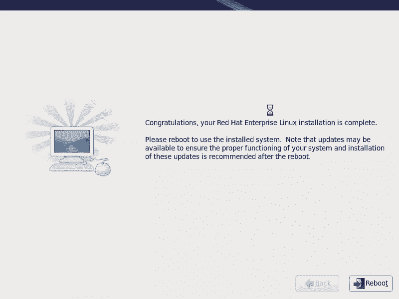

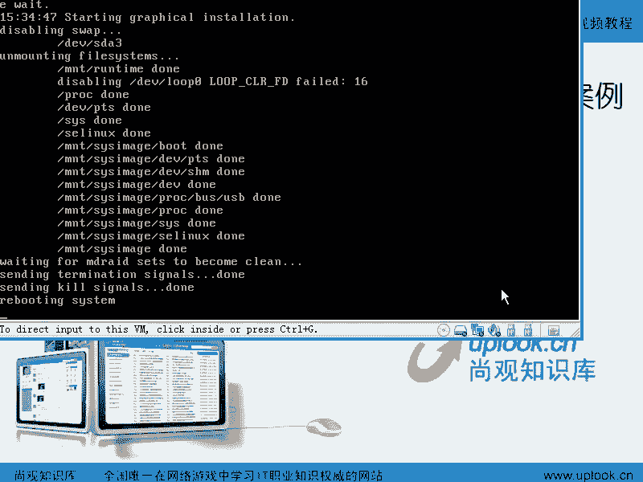

在本节课中，我们将学习RHEL6系统安装完成后，首次重启需要进行的一系列基本配置，特别是如何配置网络IP地址。这对于后续的系统管理和服务器部署至关重要。

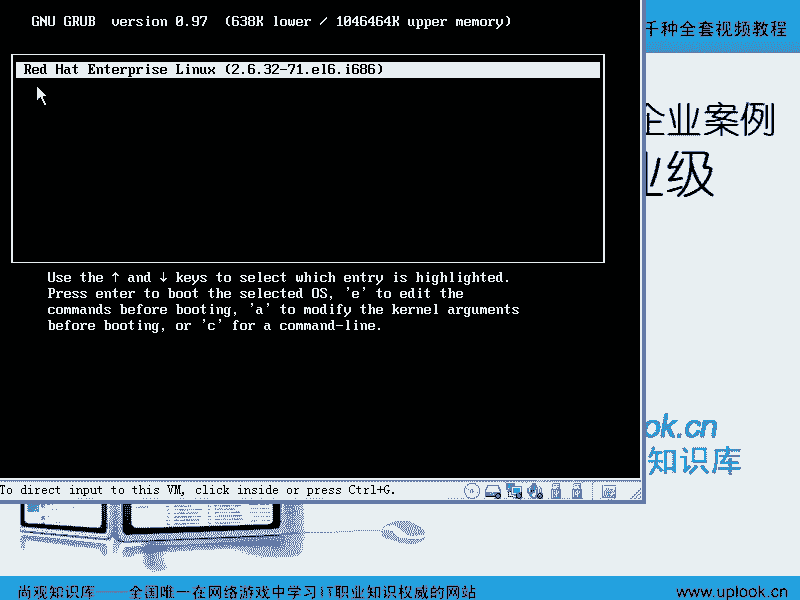


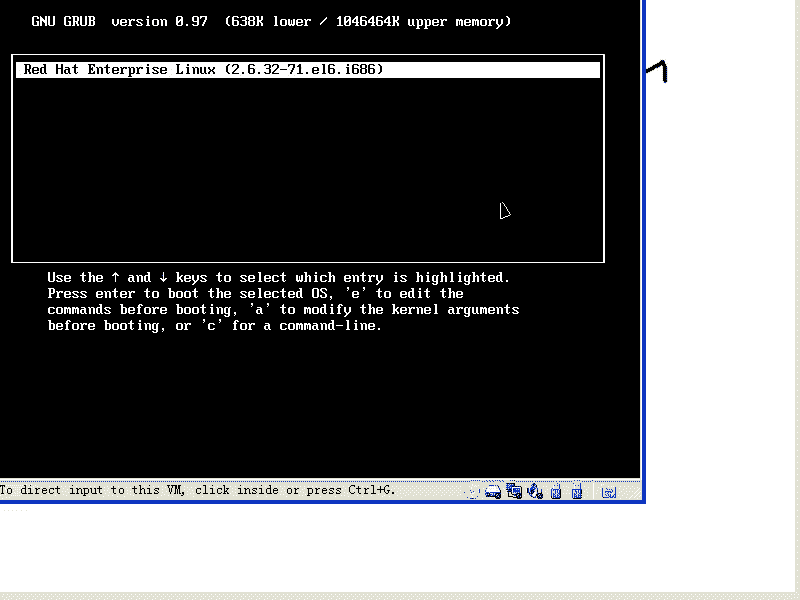

## 系统启动与内核选择 🔄


上一节我们完成了RHEL6的系统安装。点击重启后，系统将从硬盘启动。


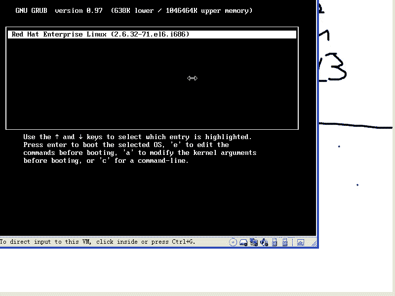

此时，你会看到GRUB引导加载器的界面。GRUB是一个用于引导Linux系统内核或其它操作系统的程序。在这个界面，你可以选择要启动的内核版本。


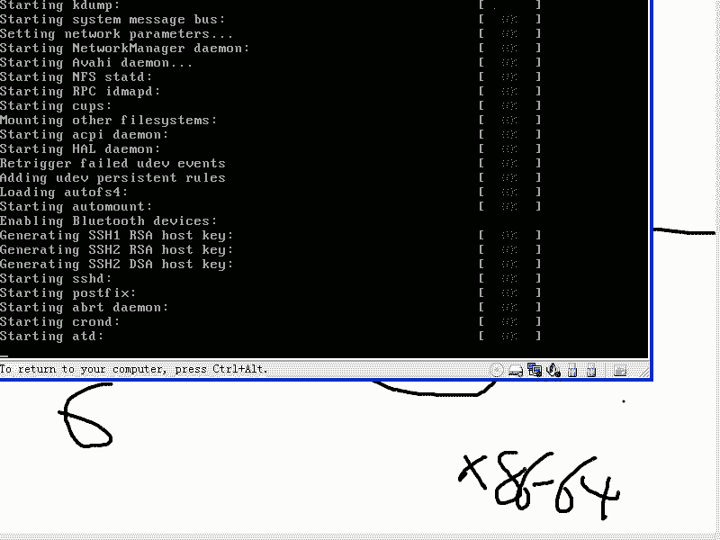


以下是几种你可能遇到的内核类型说明：
*   **标准内核**：例如 `2.6.32-71.el6`，这是RHEL6的默认内核。
*   **SMP内核**：在RHEL3等旧版本中，如果你的CPU支持多处理器或超线程，系统可能会安装带有 `SMP` 标识的内核，意为“对称多处理器支持”。
*   **PAE内核**：在32位系统（如 `i686`）上，如果需要支持超过4GB的内存，会使用带有 `PAE`（物理地址扩展）功能的内核。其寻址能力可提升至32GB或更高。
*   **64位内核**：对于64位系统（如 `x86_64`），内核本身就能支持极大的内存容量。

在倒计时结束前按任意键，即可进入GRUB菜单进行选择。如果不操作，系统将启动默认内核。

## 首次启动设置向导 ⚙️

系统首次启动后，会进入一个图形化的设置向导，引导你完成一些基本配置。

### 1. 许可协议
首先会出现许可协议界面。这里需要了解，Red Hat公司对其发行的RHEL系统拥有版权。虽然Linux内核遵循GPL协议，但Red Hat将开源代码编译并打包成产品后，作为商业软件出售。付费用户可以获得技术支持、系统更新等服务。


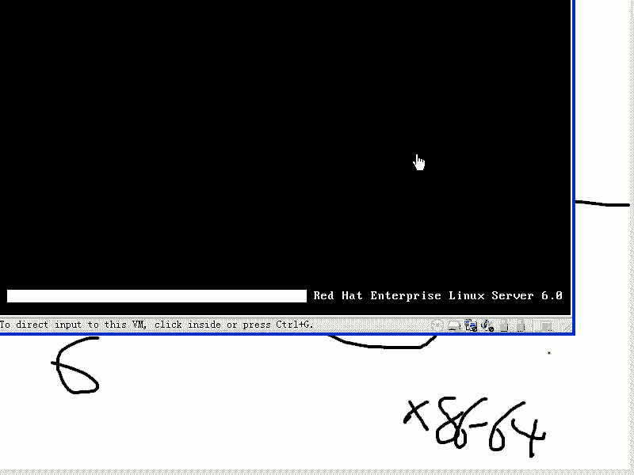

### 2. 设置用户账户
接下来，系统会提示你创建一个普通用户账户。

以下是创建用户账户的建议：
*   **用户名**：避免使用常见的英文单词（如 `admin`）或过于简单的名字。建议组合使用英文和拼音，以增强安全性，降低被猜测的风险。
*   **密码**：设置一个与用户名无关的强密码。如果密码过于简单，系统会提示“太弱”，但你可以选择继续使用。

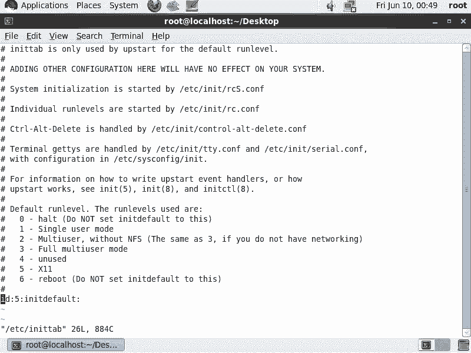

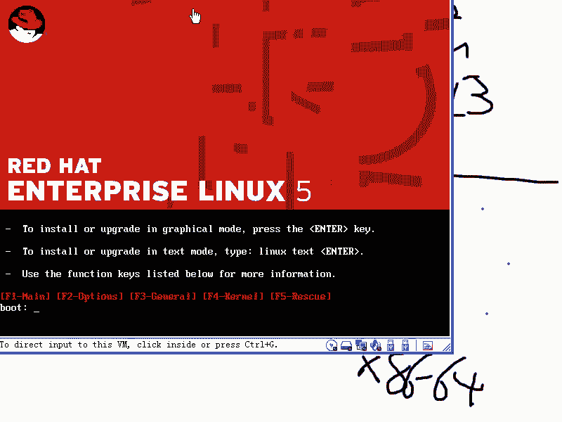

### 3. 其他设置
设置向导最后可能包含以下选项：
*   **Kdump**：这是一个内核崩溃转储机制。当内核发生严重错误时，可以将当时的内存状态保存下来，供后续分析。对于初学者或测试环境，可以选择不启用。
*   **注册**：如果你有Red Hat订阅账号，可以在此注册以获取在线更新支持。如果网络未连接或选择跳过，可以直接进入下一步。

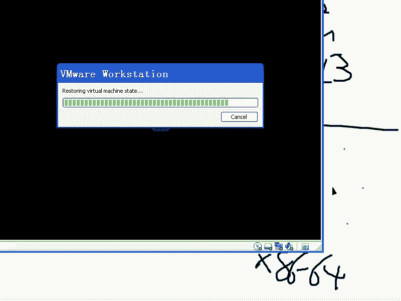


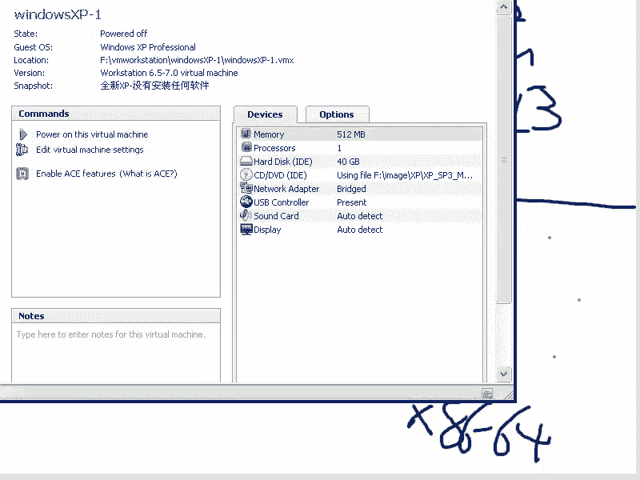

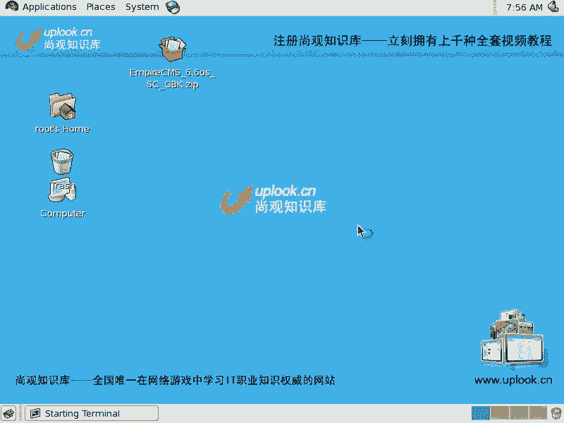

完成所有设置后，点击“完成”，系统将使用你设置的用户或root账户进入桌面环境。

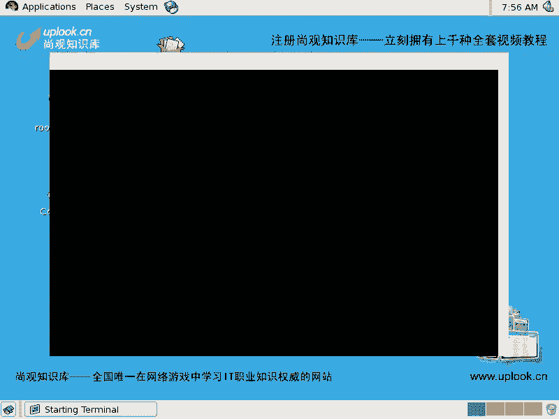

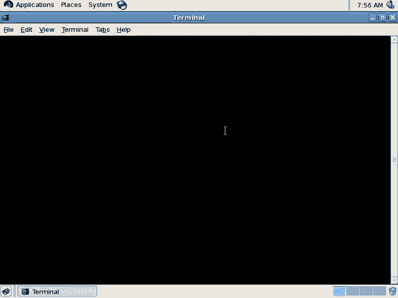

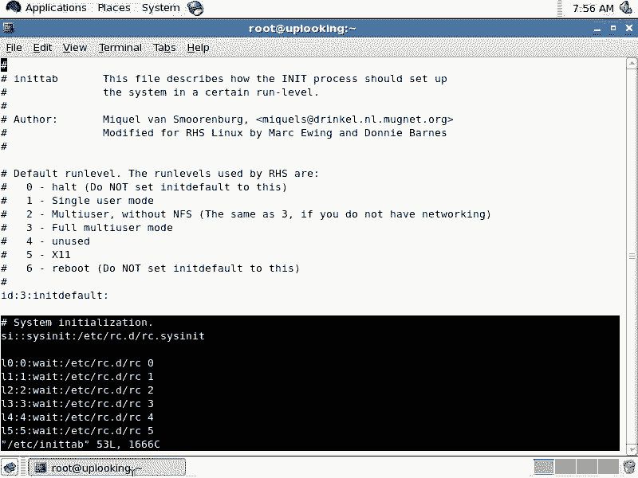

## 配置系统运行级别与网络 🌐

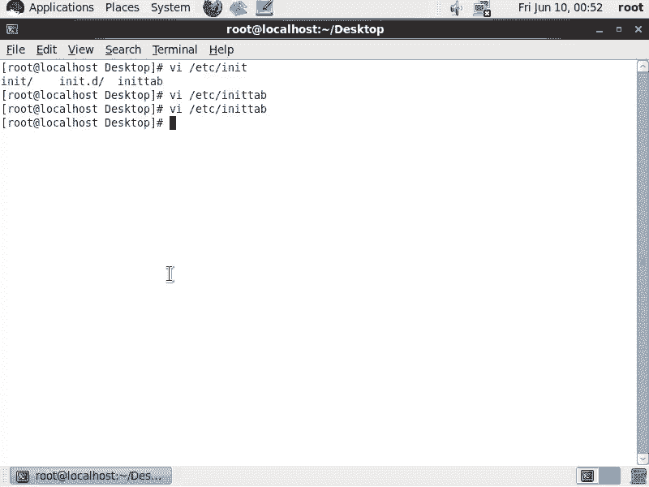

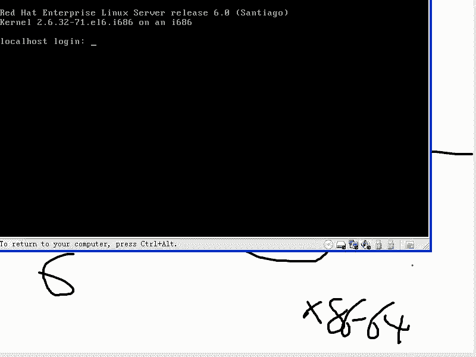

本节中我们来看看如何将系统设置为更高效的文本模式运行，并配置静态IP地址。


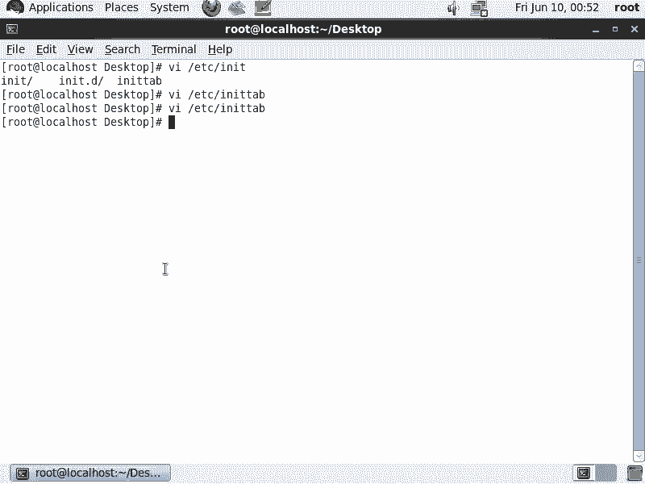

### 配置为文本启动模式
对于服务器，通常不需要图形界面以节省资源。我们可以修改系统默认的运行级别。

1.  打开终端，使用 `vi` 编辑器修改初始化配置文件：
    ```bash
    vi /etc/inittab
    ```
2.  在文件中找到最后一行：`id:5:initdefault:`。
3.  按 `i` 键进入插入模式，将数字 `5`（图形界面）修改为 `3`（文本界面）。
4.  按 `Esc` 键退出插入模式，然后输入 `:wq` 保存并退出。

**注意**：在RHEL6中，图形界面占据了 `Ctrl+Alt+F1`，而第一个文本控制台是 `Ctrl+Alt+F2`。修改后重启，系统将直接进入文本登录界面。如需临时启动图形界面，可以执行 `startx` 命令。

### 配置静态IP地址（RHEL6特定方法）
在RHEL6中，网络管理引入了 `NetworkManager` 服务，使得配置流程与旧版本略有不同。

以下是配置静态IP的标准步骤：

1.  **使用配置工具修改**：运行以下命令打开网络配置工具。
    ```bash
    system-config-network
    ```
    在图形界面中，选择设备 `eth0`，将其从DHCP改为手动配置，并填入IP地址、子网掩码、网关和DNS信息，然后保存退出。

2.  **手动编辑配置文件**：上一步命令实际上修改了网卡配置文件。我们直接查看并确认它。
    ```bash
    vi /etc/sysconfig/network-scripts/ifcfg-eth0
    ```
    确保文件中包含以下关键行，特别是 `ONBOOT` 必须为 `yes`：
    ```bash
    DEVICE=eth0
    BOOTPROTO=none
    ONBOOT=yes
    IPADDR=192.168.3.246
    NETMASK=255.255.255.0
    GATEWAY=192.168.3.1
    ```

3.  **重启网络相关服务**：这是RHEL6的关键步骤。需要按顺序重启两个服务。
    ```bash
    service NetworkManager restart
    service network restart
    ```

4.  **验证与设置开机自启**：使用 `ifconfig` 命令检查IP是否已生效。为确保下次开机网络自动启动，可以运行：
    ```bash
    chkconfig NetworkManager on
    chkconfig network on
    ```

**补充说明**：
*   临时修改IP（重启后失效）可使用：`ifconfig eth0 <IP地址>`。
*   DNS服务器配置保存在 `/etc/resolv.conf` 文件中，可以直接编辑。

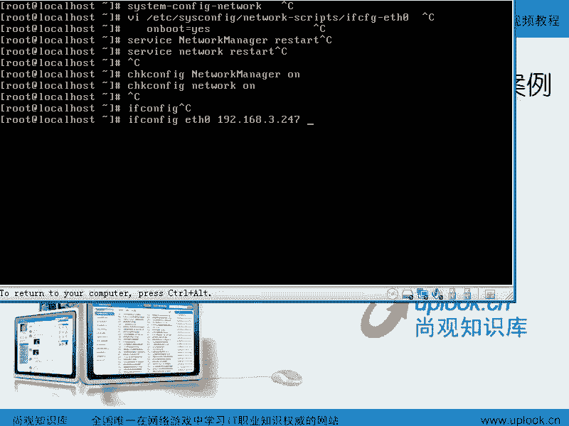

## 总结 📝

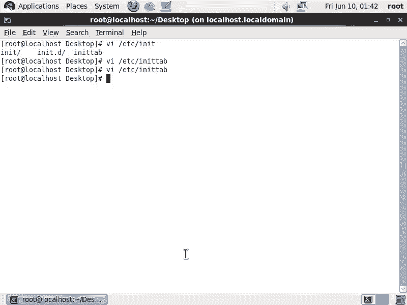

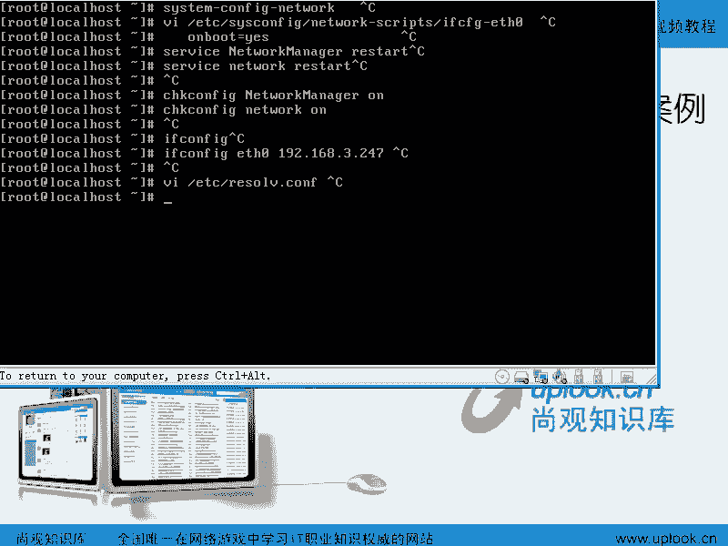

本节课中我们一起学习了RHEL6安装后的关键配置步骤。我们了解了系统启动时的内核选择，完成了首次启动的向导设置（包括许可协议和创建用户）。重点在于，我们掌握了将系统运行级别改为文本模式的方法，并详细演练了在RHEL6中配置静态IP地址的完整流程，其中涉及编辑 `ifcfg-eth0` 配置文件和按顺序重启 `NetworkManager` 与 `network` 服务。这些操作为后续在Linux服务器上进行管理和服务部署打下了坚实的基础。