# 尚观Linux视频教程RHCE 精品课程 - P80：RH253-ULE116-8-1-httpd-main-server-auth - 爱笑的程序狗 - BV1ax411o7VD

我们把。呃，Apache的这个前面的那个部分，有关Apache整个的这个设置是不是跟大家说过了，是不是？那现在的话我们主要看的就是我们的man serverer，就是我们的主server。

所谓这个主server是什么东西呢？

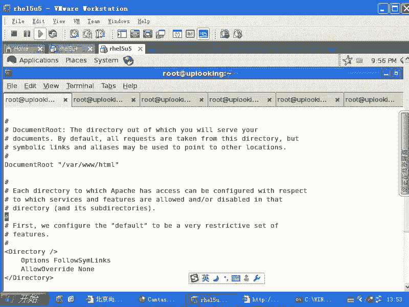

我们的这个主server是什么东西呢？这样。从上面看。每一个呃你看呃section two是吧，man server是吧，我们这个主 server是什么呢？就是默认情况下。

我们的Aache的主目录是不是放在Y下的3W当中的HTML目录像。

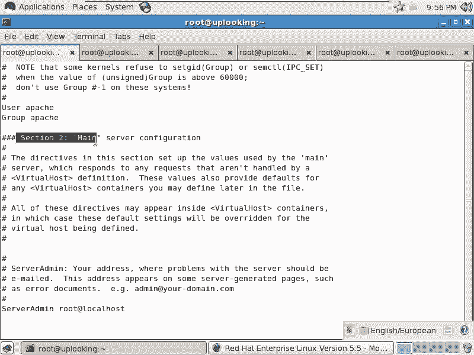

对不对？那个里面的配置的话呢，就是在这边配置的。也就是说我们在那个目录下创建一个文件，就是indexs点 ht，它到底有些什么样的属性。我们访问它的时候有什么样的权限。

或者说有什么样的这个设置都是在这里面去配置。明白了吧？这个配置的话，我们刚跟大家说过，就是它可以应用在什么呢？其他的watch host当中，就是我们的虚拟主机当中。

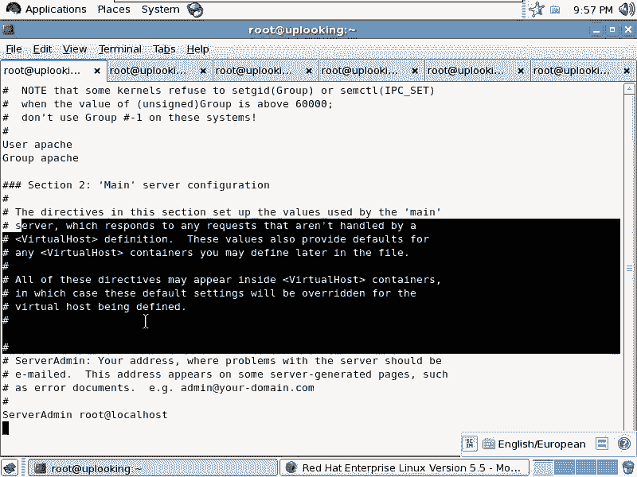

OK我们看一眼，首先的话呢，ser amin就是说当你的系统的话出现问题的时候，那么联系哪个管理员啊，也就是那个页面下的话会显示出来。页面会显示出来，假如说你访问一个页面，这个页面的话不能正常显示。

他就说请联系什么什么管理员啊。然后下面的话呢，ser name  server name在我们主server当中一般是不去碰的啊，不去去配置它。呃，我们会添加虚拟主机的时候会用。

如果要是我们说最重要的参数，可能就是一个document root，就是我们访问哪个目录呃，是这样的，我们访问一个文件，你看。单款问一个191了8。0。254，是不是？这是我的IP地址，这样的话。

我直接回车的时候。我什么都没有加，什么都没有加，我直接回车了。😡，他到底访问哪个目录呢？是不是我们在。这个路径当中啊，在我们的这个apartache的路径当中，大家要注意这个路径当中。

我们最后加的是不是一个杠啊，一个根，是不是？这个的话呢就相当于它的。呃，就是说它的默认的那个目录。那这个根的话，在这里面是一个虚拟的根，是不是？在这个serv当中是虚拟的根。

也就是说apparty实质上是这样的。aparty实际上是这样，就是我们的aparty。它的话呢有很多很多的server啊，有有第一个server，有第二个server，有第三个serv，明白吧？

这边比方说有第一个server serverer一是吧？还有个呢第二个server serverer2是不是这些server还有server3啊，这些server的话呢。

他们都有相应的什么document root，也就是他们的什么主目录，它这边的话呢，虚拟路径里面的话呢是根啊，这个的话呢也是虚拟路径是根，那么怎么样去区分这些根呢？那前面的主机名是不一样的。

就是server name是不一样，是不是假如说第一个主机的话呢，它的这个server name叫做什么呢？C那点com，那么我们访问C那点com的杠的时候，那么就访问到了什么？

我们的它这个虚拟这个主机或者这个虚拟主机指定的那个document root，对吧？你们现在明白那个根了吗？那个根的话就指定的它的什么。😊，Q。ment是吧。是吧。如此。

有document的 root话，就是说我们访问这个虚拟的根的时候，访问这个server的。这个server的虚拟的根的时候，就访映在这个server所配置的这个document root，明白吧？

这个document的 rootot里面的话呢，还会有什么呢？各种各样的实际的这个目录。但是我们如果这个document root是Y下的3W当中的HTML的话，那么我们在访问上面的杠AAA的时候。

就是访问的这个目录下的什么？这个目录下载AUA明白吧？而这个路径的话呢，我们还能再加上一个什么呢？再加上1个AS虚拟路径。这个道理清楚没有？我们在appartache当中可以设定多个。

虚拟server每个虚拟server都会有一个跟。每个虚拟server都可以设定什么document to rootot。😡，对不对？默认情况下，我们的这个啊呃我们的这个apartache。

它的document rootot是在哪呢？wa的3W当中的HTML，也就是默认的那个server的。虚拟根是吧，是在Y下的3W当中HTMM目前。那么如果你编译安装的话，它的虚拟的根是在哪？目呃。

编译安装，它就会在你的编译安装的那个目录下的。D有呃。呃，就HTDUCS这个梦想。就是你你装在哪个目录下，它就在那个目录的HTDUCS目录下。HTDOCS明白吧？这是我们RPM安装的那这个里面的话呢。

这个我们访问这个根就相当于在访问这个目录，对不对？这个的话是不是一个虚拟路径啊？是不是一个虚拟路径啊？那么这边的话呢是实际的路径，明白吧？在我们的这个设置的时候，你看一下啊。

当我们这边设计好document rootot了以后，那么我们在设置这个路径的时候，你比方说这个directy跟这是一个虚拟路径，是不是它是不是虚拟路径啊？大家要注意啊，在这个整个的配置文件里面。

虚拟路径是不加任何的标号的，而实际路径要加双引号，看到没有？看到少引号了没有？那这个地方是不是虚拟路径啊？😡，是不是？那么我们访问虚拟路径的时候，它有什么样的选项呢？option就是说允许软链接。啊。

有没有访问控制的？no没有。也就是访问我们这个虚拟的根的时候，那么允许软链接没有虚拟控制，明白吧？我们再看可以有些什么其他的选项。然后你看再看这两个路径啊，大家一定要注意，这是关键的东西啊。

大家一定要记住啊，关键性的东西。你看到这边是不是一个。虚拟的路径是不是？这边呢。加双引号了没有？😡，那它就是一个实际路径。也就是当我们访问这个虚拟server的这个这个路径的时候。

它将会有下面的这些选项。所以这两项的话实际上是在配置相同的东西，明白吧？他们两个实际上是配在配置相同的东西。

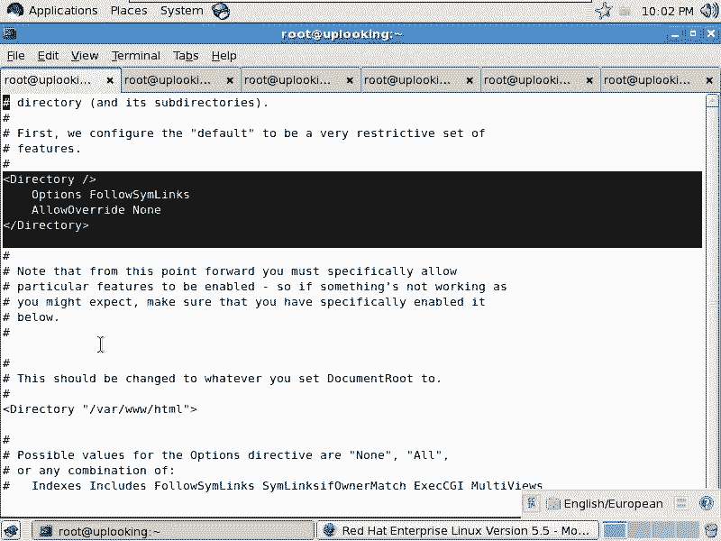

比方说看这个地方。接下来的话呢，这边就是一些选项了。这些选项的话呢有什么呃index。然后呢，inlude啊允许软链接啊，说如果软软链接什么匹配什么的东西啊。

然后还有说允许什么CGI可执行的CGI等等啊，有这些选项。那么我们现在是什么呢？就是一个呃opence indexex就是允许索引。很多人的话呢，在访问这个目录的时候。

如果这个目录下是没有任何默认的默认的这个文件的啊，默认的index点HTML文件是吧？默认那个文件，那么他就会把这个目录的所有的东西全部都显示出来。对不对？你们觉得这个功能好不好？😡。

就是说我访问这个目录，这个目录下有5个文件是吧？但是没有一个是默认打开的那个indext点HTML文件，没有这个文件。那么里面有5个文件，它会把这5个文件的文件列表显示出来。你们觉得这个功能好不好？😊。

不好是吧，肯定不好啊，除非是你有特别的需求，是不是？除非你有特别需求。😊。

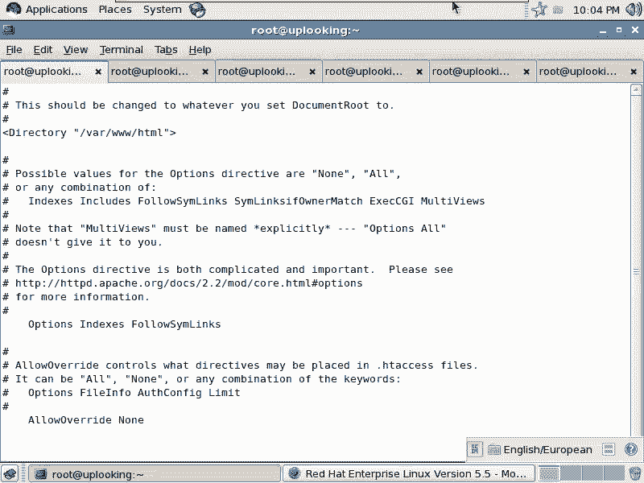

OK我给大家看一眼。

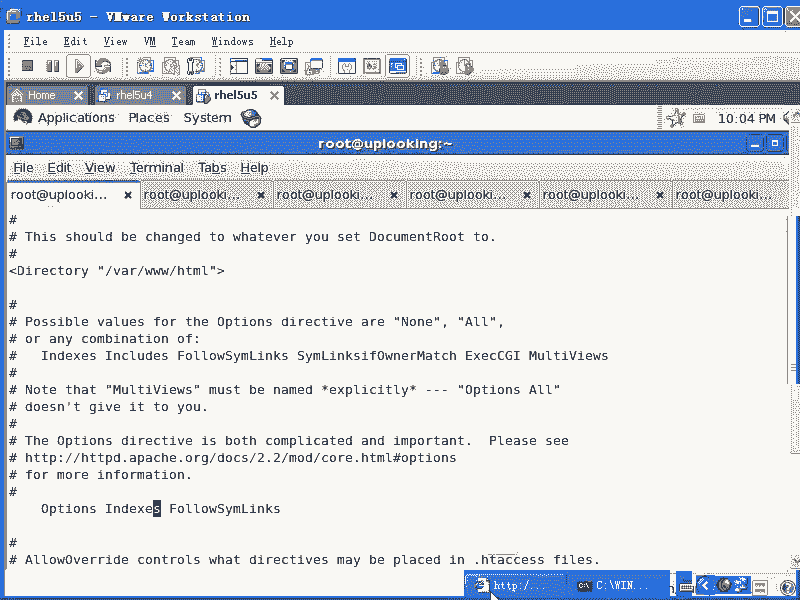

比方说我们现在的话呢，打开呃。可到。点ORG是不是？我给大家看看inds它的作用。那么当你去访问某一个目录的时候，比方说。这个怕。HTTP下面的这个pop它不需要页面。

它只需要把这个目录里面的这些东西啊，把这个pop这个目录下的所有的东西给你以文件的方式显示出来。现在最新的内核是2。6。36是吧？2。6点。35。7。显示不出来吗？这么慢。啊。😮，这还没出来。

我本来想给大家显示一下，可能是。被咱们是不是防火墙封了是吧，封杀了是不是有可能啊。经常出现这种事情，可正就是说你可以看到的话，它这里面显示的像是一个文件目录数一样的东西。那么你不想让它加，那。

你就是说no index。对不对？no index。那么这样的话呢，你就可以把那个选项话的给它关掉。而这个选项的话，在你真正配置服务器的时候，那么反而是一个不不安全的因素。

它可以访问这个目录下任何的文件是吧？给你列出来。所以这点的话是不好的。所以一般情况下我会把它怎么样，直接删除掉，我不要它啊，我不要这个选项。😊。

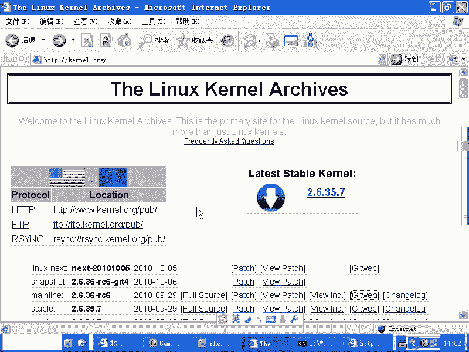

其他的话呢，这边访问控制没有啊，那么。顺序的话呢，如果要是访问的时候，就是说。order就是说先允许再deny啊，但是这个alder的话呢，一般没什么太大用。也就是说它还是什么呢？先deny再one啊。

先 deny再 alone。那么我们是alone from all，也就是允许所有人来访问apartache的访问控制，现在你知道在哪了吧？partache的访问控制。

如果现在我告诉大家允许哪个网段访问，不允许哪个网段访问，会不会？😊，会不会？稍等一下。

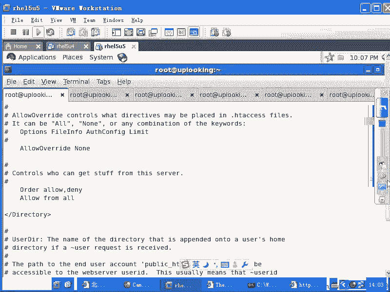

Along from。192168。0点是不是0。0-255。255。255。0，我不知道这样写行不行啊，我不知道这样写。一般稳妥的话就是0。0到255。255。255。0。然后呢。对吧。这样的。

然后保存并退出sHTVD restartstar。你看一眼啊，看成不成。0。254AAA。1。254。拒绝。是不是？啊。😮，然后我在保险的看一下，就是什么elink。191了8。0。254，呃。

看到的界面应该是AA，是不是能看清楚。然后呢，如果要是1。254。就是我们这个界面了，对吧？然后我把那一项的话呢取消掉。😊，还是相同的命令。Yeah。Along from all。你再看一下。

这样也就能显示是吧？是吧刚才那个操作是只允许只允许零这个网站访问，但是呢并没有拒绝一这个网站的。哎，一这个网站是没有没有没有让他访问，是不是没有让他访问？看一下啊，再改一下。

我把这个deny from这个网段显呃就是写出来，然后along from all。这样就又又变回这样。也就是说那个目录在访问的时候，它就是不允许访问，为什么会出现这个界面呢？为什么会出现这个界面呢？

因为reite的话给大家做了一个东西啊，这个东西的话呢大家可以看这个地方。VIETC下的HTTPD当中的comf点D目录下有一个什么呢？welcome。

welcome点comwelcome点 co打开它以后，这边就是说当出现什么403错误的时候，那么就显示no in no in呃in点HML这个页面的话呢，就是呃就是那个谁的页面，就是。Chat。看。

CDETC下的HGPT当中。看下去。哇写的3W当中的arrow当中的no instance点HMM看这个页面啊，这页面就是ret那个。是不是这个页面？看啊。

我是直接用inin呃就是ininlink去里访问这个页面是吧？也就是说这个页面的话呢，是因为有reite的这个reite的这个配置文件。reite这个配置文件就是说当你去出现403错误的时候。

如果出现403错误的时候，不要去显示默认的系统，就是appartache自带的那个而且显示这个这个页面。也就是说403错误的话，可能是de娜呀，或者说呃就是说出错啊，就是没有这个文件是吧？

然后就显示no industry h就是re hand那个页面界面了，就是因为有这个配置文件，如果这个文件干掉的话，会怎么样？😊，那它就显示啊爬起默认了，是不是？你看一下啊。

我现在把这个appartty再重启一下，然后在另外一边的话呢，再去怎么样再去访问1。254。现在1。254应该是被拒绝的，是不是应该被拒绝的。然后一显示，那么就是appartty默认的那个文档。

他说你没有权限是吧？你没有权限访问根，看到了吗？这样的话就不会混淆咱们的这个试听了，是不是？是不是这样？明白这个道理了吧？刚才为什么出现的是那个界面，是因为403错误的时候，它自动调动的是那个。

那现在的话才是真正的话，你得到的这个错误信息，就是apache给你已经显示出来这个信息啊。好。😊，这就是我们刚才看的访控制，会了吗？某一个服务允许哪个IP拒绝哪个IP会了吗？那最简单的是什么？

IP tables。😡，是不是IP table也可以起到作用，这个也可以起到。那我问一下大家，这个东西可不可以用TCPrappper来做？😊，就是A帕ache的访问控制。

可不可以用TCP wrappper？我不相信不可以试试看，然后DD是不是？LDDUSR下的S并线的什么HTVD。对不对？对不对？回车这里面只要没有什么GREP没有rapper。是吧没有rappper。

那它就不支持，有rappper就表示支持，是不是？所以aparache实际上是不支持TCPrappper。但是呢我们可以用ip tables和刚才那个alone deny来设置，对不对？😊，啊，好。好。

我们现在看到了apache的这个测呃，就是说。经常出现这个问题，就是经为什么显示的是我们的这个。re泰的那个test配置啊，那么原因就是刚才那个说的那几项，然后我们还是翻到这个刚才我们设置的这个地方去。

这个地方的话呢，along from outbe from什么什么，这边的话呢就交给大家了，是不是？那在这个地方设置的话呢，我们还要教大家几样东西啊。我们还教教大家几样东西。

这边的话呢有一个directdirectory in desk，就是说默认情况下，我们访问希浪的时候，我们一般都是直接这样访问啊，3W。3W点C纳点com是吧？点CN啊，或者C纳点com。

那我们这样一回车了以后，大家看新浪的首页就出来。但是我们从来不在这后面加上一个什么。是吧我们从来不加，我们也不知道默认打开的是哪个文件。那为什么不用加呢？就是因为这里面是不是有这一项。

它的这个配置服务器上是不是有这一项，默认情况下，它打开的是index点HTL或者induex点HTL点Y，是不是？😊，是打开这样文件。那其实的话呢，如果在这个目录下有个点POP的文件。

它就会优先打开点POP的文件。为什么呢？意维的话呢，你看在上面的话呢，是不是你看我再往上翻，这边是不是include了comf点地下的新点com看到了没有？新点comf当中是不是有1个PP点comf？

PP点cup的那个配置文件里面是不是多了一个什么？😡，in desk点PLP。也就是相当于这个这个地方，如果这样写的话，我是想告诉大家，这个就刚才那一行生生效之前已经有一行生效的了。

是不是那行是怎么写的呢？它实际上就是相当于啊相当于include。😊，inludelude了什么呢康复。点comf点D目录下的什么呢？这个PP点com是不是include这个文件了以后。

这个文件里面有个什么呢？叫做directory。in desk是吧？对吧使用的是哪个inex文件呢？是我们的P呃ind点PP的文件，相当于这一行已经在他们之前已经加上去了。也就是我想说明的是。

你在这个目录下有indesex点PP有inds点HTL谁生效？谁放在前面，谁生效，你们说是不是这样道理？明白吧。明白了吗？明白了吧。所以的话呢它是在这个位置，那我往我往后翻啊，我往后翻翻到哪去了呢？

翻到我们的这个刚才设置的那个地方，就是我们的这个directoryin这边indu hML这个地方，也就是它前面还有个directyinin点PP已经生效了，是不是？

这个地方access fileacces file的话呢，就相当于我这段啊，比方说在这个位置，我们在这个位置本身的话呢是有很多的选项可以设置的。但是我不去设置。

你比方说我把这个direct index这一行，我把它删掉，我把它放在那个目录下的什么点。HTXces文件里面，也就是说我在这个目录下的话呢，有一些配置我就直接放在点HTXces文件里面了。

它在启动的时候，它会自动的去查看这个文件。也就是每当你访问的时候，这一行的话都会生效，明白吗？点HTXces都会生效，就在那个文件里面的部分配置都会生效。

就相当于把点HTacces那些东西放到了当前的这个位置，清楚了没有？清楚楚吧。所以点HTaccess这个文件啊，它默认情况下不应该被谁访问呢？不应该被普通的用户所访问。你看刚才我们是不是设置了一个目录。

说是允许或者拒绝，你看到这个。你看到这个。看到这个directory了吧，directory允许或者拒绝是不是可以从哪来？但是我们现在的话是怎么样？现在的话呢不是一个目录了，而是什么一个fell。

看到了没有？一个文件允许或者拒绝。😊。

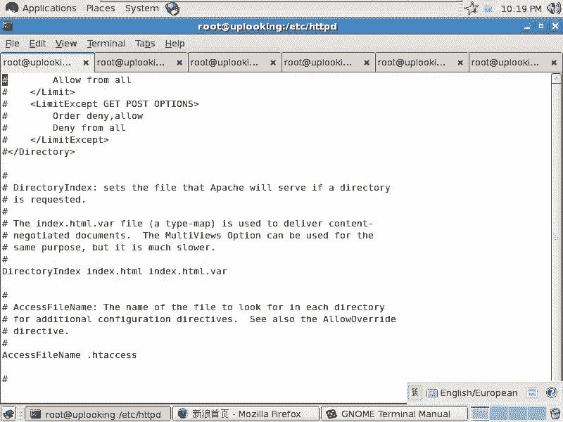

清楚了吗？这个地方的话呢跟那个的语法是一样的，也可以允许谁拒绝谁，也可以允许谁拒绝谁。那么我们看这边是不是正的表达式一。点HT开头的文件是不是就怎么样beline from all。

也就是说你从网上的话，你是没有办法访问到的，没有办法访问到它。他是直接就拒绝你的，是不是？但是谁可以去加载这个文件呢？啊partache自己。😡。

哪怕就自己把这个文件里面的内容的那些选项include了什么这个配置文件当中的这个位置就是我们的主目录这个位置。所以我们现在的这个文件是默认的主目录当中的这个配置文件，它会把这个里面的配置也加进来。

那么在我们这里面的这些选项。我们可以把众多的选项放到这个文件里面去，放到这个文件里面的好处和不好的地方在哪呢？第一，好处是什么？你放到这里面，每当你访问的时候，那么它就会生效，是不是？

那么你写的这个配置的话，就放在当前的目录下。比方说。我这个整个的这些配置都是放在。都是放在哇下的3W主当中的HTML目录下，对不对？我在这里面的话呢，创建一个点HTaccess的文件。

是不是这个HTaccess文件来，我们进行一下这个呃相当于进行一下这个用户名和密码的这个认证啊，也就是允许谁拒绝谁啊，允许哪个人拒绝哪个人。那么用户名密码，现在我这样的os AUTH啊。嗯。A u。

TH2。累。认证的名字叫什么呢？呃。hello，啊， welcome welcome。To up looking。是吧外。把他命。A the the命。配age。是吧这是认证的名字。然后呢，alse。

TYPE。就是认证的类型是什么呢？是basic。Basic类。Ouse user。对啊，这个大家一定要会啊。user file，也就是说我把用户名和密码放在哪呢？放在ETC下的HTTPD当中啊。

我随便放个位置，比方说放在c复当中的c复当中的。HTT啊。HTTP啊这样的慢。Man user。houseuse。RE。Re快。Require user。我这样写到这边，然后这个时候我再去访问。

没有生效。我们一般调试的话呢，就是我打开监控它的日志是吧？一边监控，然后一边访问。那如果要是我这样的访问他的时候啊，我这样访问他的时候，那么他。访问一下，刷新一下，我看这边有没有条目，没有条目。

说明没有错误，是不是为什么没有错误呢？因为首先我没有重启服务，是不是没有重启服务，然后呢，没有去。没有没有生效，它没有生效。如果要是我重启服务了以后。

service啊HTPDwithstar我重启服务了以后再去访问它。这个时候话就应该出错了，为什么呢？咱们那个文件配置文件还没有建立，是不是？你看啊。这边为什么还是可以去访问呢？

因为的话呢我们这个配置文件里面这个配置的话，相对应的一个地方，它没有设置。就是我们在访问这个目录的时候啊，访问这个目录的时候说允许这个就是说这个目录访问控制有没有呢？有一个访问控制文件。刚才是不是那？

刚才是浪是不是？那么也就是现在我访问这个文目录的时候。我这样也可以啊。就是把它加进去，加进去以后保存并退出。然后呢，sHTVDrestar。然后我们再去访问他。这个时候就要求输入用户名密码。

是不是这个用户名和密码验证的时候，他说啊，欢迎来到uploing web amin page，是不是让你输入用户名名？当然你不管怎么输入都会出错，都不允许你访问。原因是什么呢？原因我们没有创建那个文件。

还没有新建文件呢，是不是？😊，咱们看一下刚才输入的这几行的意义是什么cat啊。cat点HT access，因为我是在那个目录下，我是在这个目录下去创建的那它肯定就生效。

是不是肯定在访问这个目录的时候就生效。这样的话，你不用把这个文件的话，再放在某个位置上去了。怎么叫呢啊？cat。嗯。t点HTac这文件这个文件的话是说认证的名字是什么呢？就认证的这个标题栏的名字是这个。

然后呢，它是一个basic类型的。如果你想用用MD5加密也可以。你比方你想用shale文件做认证也是可以的。你用shale文件做认证也可以。那是MD5加密的是吧，它也可以支持啊。

然后这边的话呢是说用户的认证的文件的名字叫这个，那怎么样去创建呢？就是HT passwordssword。HT password。这个文件的话是啊party自带。这样它是自带的。

然后呢加上个杠C就表示我要创建我要创建这个文件。ETC下面的HTTPD当中的康复当中的。咩。user啊这个文件我要串着这个文件。创建这个文件，然后呢。后面加上一个名字。后面加上一个名字。

比方说叫做什么sack。然后呢，我这样的回车。然后呢，把sha克的密码写上去。这样呢把密码设置好。然后我在这边的话，在访问的时候s。Yeah。没有没有成功是吧？没有成功，我们看一下这个日志。

这里面说什么？We the user。这边的话呢立刻就有错误出现啊，有错误出现。这个错误的话呢，我们把它改一下。就刚才这个文件的话，文件名字有问题。你再看一眼。OK现在就好了。是不是？

刚才这边的话呢写错了啊。这个文件最后啊required requiredquid well user啊，required well user是表示说在那个文件里面的用户我都是允许的。

但是那个在那个文件里面，假如说有10个用户，那我只是允许两个的话是怎么样的那这最后这行的话应该这样去写。就最后这行的话应该这样去。required user是吧？我只允许谁啊，我只允许一个用户是吧。

允许谁呢？允许shrack合并这个用户，对不对？那这样的话呢，我就。我就把这两个用户的名字添加到后面，也就是说我允许这两个用户。因为这样子，如果你是required呃requirewellus。

就是说允许这个目录这个这个文件里面的所有用户，你添加一个，他就允许添加一个，他就允许，明白吧？他是这个意思。所以我刚才的话呢，这个地方就是requireduser，他后面等我说后面有哪些用户。

你把它添加上来，没有添加，所以它就出错，出错的时候的话呢，你看到这边是不是立刻就有一个错误，是不是？是是立刻就有个错误，对不对？然后呢，我把这行我把那行的它改成wel user，那么它就生效了。

它就生效了。同时的话我们学到第二点是什么？第二点是什么？就是说我们在这个里面。改动的东西要不要重启aparty？你看刚才我改了HTacces文件是吧，要不要重启啊part？😡。

这是这个文件的话最主要的一用处。首先我把这个文件的话放在了哇下的3W当中的HTM目录下，对不对？对吧那他就是访问这个目录的时候都生效，是不是？😡，是不是都升降？然后再一个的话，我改这个文件的时候。

我不需要重启它。这是好处，但是不好的地方是什么呢？就是说你访问1000次，这个文件会被读取1000次，对不对？但是你要知道你的网站，如果大型网站的话。

它一天的这个配置 view就是页面的访问量是要达达到多少呢？是上千万次上亿次。也就是你的文件的话呢，会被读起上千万次上亿次，你们觉得这个效率会高吗？所以这个文件的话呢，如果要是我还是一样。

我还是想实现这个功能。我把这些内容的话呢，我把它复制到哪去？我把它复制到这个文件里面。比方说我这个directory directorory啊。我把这个directory这个地方的话呢。

我这样的加在后面。我把刚才那四行的话加到后面，加到后面了没有？是吧加到后面，然后保存退出，我保存退出，把那个文件里面的，把HT点HTaccess文件那个里面的内容的话呢，加到那里面去，加到这个配置文件。

加到这个文件里面去。对吧刚才我是不是加到这里面去了，然后呢，我在service啊，我先把这个文件删除掉。RF。点HTacces，我把这个文件删除掉。然后呢在service。HTTPDrestar。

然后我再重新去访问。失效了。我们再去访问啊。浏览器的话有时候会有缓存缓存的话呢，你要加cttrol加F5的话呢，让它帮你重新强制刷新一下。现在是不是要输入用户名密码，还是生效的，是不是？

是不是还是说明生效的？但是呢这个时候啊你要知道它这个配置文件只是在启啊，它去启动时候才被装载一次。那么一天的话呢，你的网页被刷新什么呢？呃，1000万次，你那个文件是读1000万次吗？不是。

那他只会读一次，听楚了吧？这就是点HT access文件的什么好处和不好的地方。明白了吧？没啥了。好。我们回过头来的话呢，刚才讲的过程的话呢比较。比较多啊。我看来以后还是习惯VIM会比较好。

因为以前的话VI就等于VIM是吧？VI的话呢，它是1个VIM的别名，但是现在的话给它取消掉了。然后我们看打开到刚才打开到这个地方。就首先的话呢我们有一个man server啊。

man server这个man server的话呢是毫无症状的，就是没有任何开启的状态下，就直接的话呢，你看我们说第二部分是man server是吧，这些地方是不是全部都注释掉了？

是不是也就是说你刚才加的那些选项的话，是直接可以追加到这个文件里面，不需要放在任何的一个位置特定位置。你刚才加的那个什么ous什么什么东西，你可以把它放在什么directory那个地方。

也就是说我们这个serv amin，还有呢包括这个user什么什么东西，然后还有个 root这些东西。😊，还有这个directory这些东西全部都可以放在这个文件的任何一个位置。

是不是全部都是在设置什么man server。就是主就是我们的默认那个思，对不对？全部都放那个地方。然后呢，当我们在这个文件里面想去设置某一个目录的读取的情况的时候，我们就这样子来设置。

你看到的是这种目录，它是表示是虚拟目录。你看到的是这种目录，那它表示的是什么？实际的目录，是不是？当我们访问这个实际的目录的时候，当我们访问实际的目录的时候，我们可以定制它什么呢？就是说。

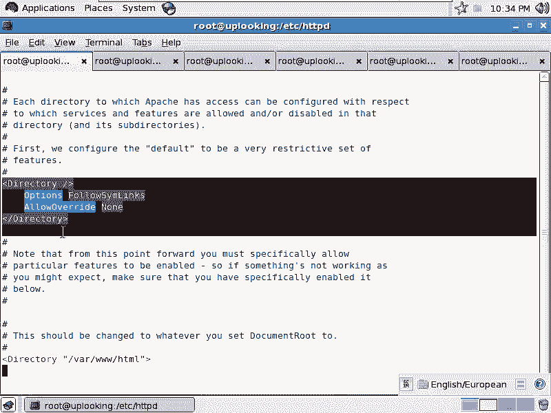

它的一些访问控制，每一个实际的目录我们都可以去加很多的选项，是不是啊？这些选项的话呢，包括用户名和密码的认证，允不允许它in desk，就是显示出文件的列表来，是不是都可以设置啊？当我们设置的时候。

可以把这一部分某一部分的这个设置，然后呢写到一个地方，写到哪个地方呢？写到那个目录。就比方说CW呃CD挂下的3W当中的HTML这个目录下的什么，创建一个点HTaccess的文件。

是不是在这里面把那个目录的选项全部都添加进去。添加进区的好处是什么呢？你改完以后，它立刻生效，不用重启啊partache服务，不用中断。你比方说我正在访问什么，非常happy的访问我的机mail是吧？

里面有200多封邮件是吧？正在访问，结果我再一刷新的时候，哎，他那个服务器重启了，为什么重启呢？它添加了条规则。😊，是不是你改那个点HTHTX文件里面的东西的时候，不用重启，它就立刻生效了。明白吧？

但是坏处是什么呢？当你刷新的时候，你只要看一次页面，它就会读一次那个文件，对不对？那这样的话呢，就会对你的系统有额外的这种负杂啊，有额外的负杂。

所以我们可以把这个文件就是在某个目录下的这些选项放到哪儿呢？放到这个这个目录的点HTXces文件里面去。而我们的这种点HTXces的文件是怎么样。😊，是不允许其他人访问，只允许谁啊。

只允许我们的阿paache自己访问，是不是？😡，好。我们的话呢要给大家回顾一下了，要不然的话再讲下去的话，就晕头转向啊，晕头转向。我们看一下，也就是说我们的这个文件的话呢分成几部分。第一部分是什么呢？

第一部分是我们的呃就是整个服务的这样的一些设置，是不是？比方说我们的这个user啊，group啊，是吧？他用哪个用户名啊，用哪个group，还有什么呢listen呢？啊。哎，类似怎么拼啊？是这样吗？

这样呢list此。是这样的。这样拼啊。listen，还有的话呢就是什么load。Moel。是不是models之类的，还有一些什么呢？就是一些大的选项。比方说跟性能相关的。你是以pref方式去运行的是吧？

你如果是pref，那么就怎么样，那么就有一些什么star server啊，什么什么什么东西这样的一些选项。那我们说在第一部分完结了以后，那你可以在任何的一个地方随时开始。

就是说你接下来配置的这个有关服务的这样的一些服务器的一些配置。比方说它的什么。😊，document root是不是？这样的话呢，随时就可以开始了。

你只要这样的一开始说我这个目录在哪挖下的3W当中的HTMM就是在你不做任何配置的情况下，我们的系统只有一个外b服务器是吧？这个外b服务器的主目录在哪？😊，对吧然后你可以在这里边的话呢。

通过directory。Diory。是这样是吧？directory定义什么呢？定义各个目录的访问控制。你比方说根的访问控制。如果要是你不加这个不加双引号，它就是访问虚拟的根，对不对？如果要加双引号的话。

怎么样？如果你加双引号的话，就是实际的就是文件系统的根，明白吧？这就是实际文件系统跟当然了，这个标号的话呢，就是跟HTML标签一样。有一个开启就有一个什么。就一个结束，是不是我忘了这边有没有空格。

有没有空格。没有啊，就这样。那么在这个呃在这个directory当中，你可以加各种各样访问这个directory的这种选项。你可以的话呢在这个direct当中话呢，加入什么呢？加入这个呃访问控制。

比方说alder。是吧alder先 alone。再抵耐啊，我原来的话呢认为alder先 alone再抵耐就是先允许再拒绝，对不对？但是后来发觉怎么都不对啊。

你放到你是先抵待再 alone还是先al再抵耐，你底奈总是优先 alone，不信你们可以试试看啊，这个我我就没有详细的去琢磨过，我没有详细的去琢磨过。因为我们apache的话呢。

允许谁或者拒绝谁的这种几率很小啊，就是使用的几率很小，我没有仔细琢磨过。但是呢大家的话最起码应该会什么呢？应该会拒绝哪个网段，允许哪个网段，对不对？那拒绝哪个网段怎么着？底耐。😊，from是吧。

1个IP地址，对不对？对不对？好喽。from1个IP地址是吧，一般是along from all，对不对？😡，对吧那么这边的话呢，如果要是大家这样写的话呢，看看成不成啊。

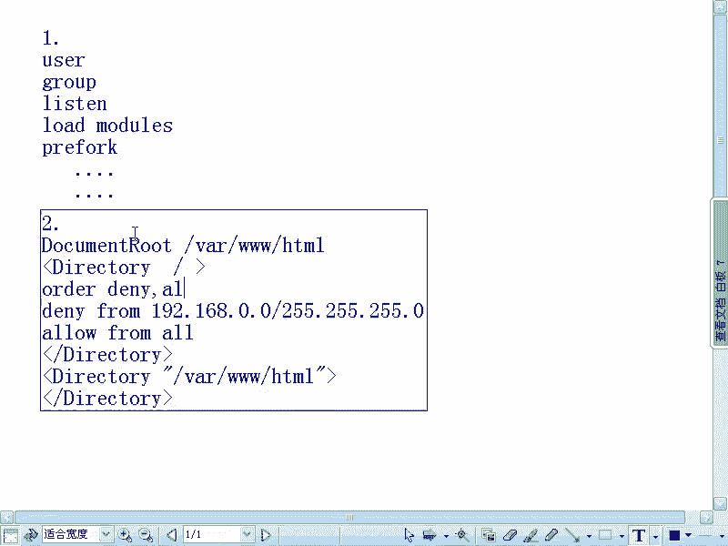

刚才我是怎么去设置的？刚才我忘了。いや。仙尔龙在底耐是吧？刚才我在那个里面的话是香尔龙在底耐。

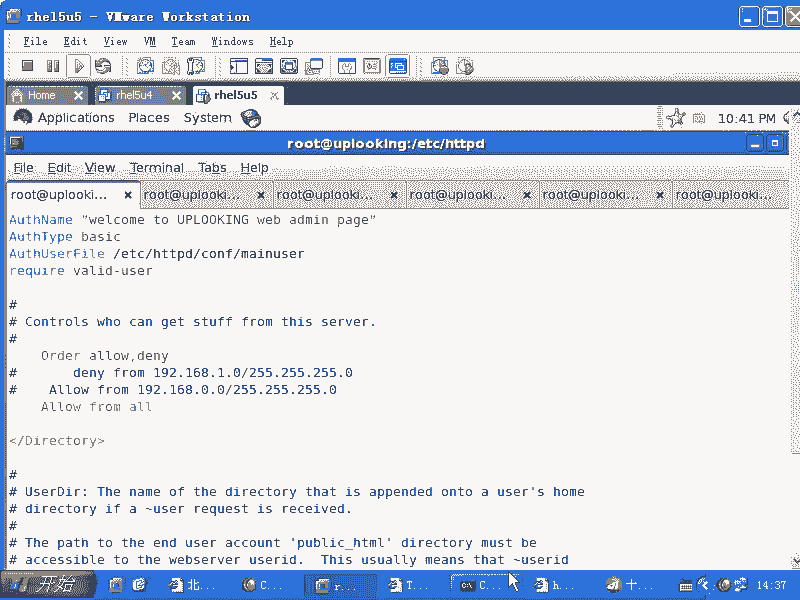

就是说先alone再抵y的，但是呢它还是生效了，dey还是优先于al alone。是吧先耳翁在抵那还是优抵那还是优先耳弄的。哎，这怎么回事啊？我这边投影仪的话呢，一会儿没一会儿有一会没有。没有关系。

那么当我们去设置这些directory的时候，我们说刚才给大家在访问这个目录的时候，加了一个身份认证的选项，是不是？当我们下加身份认证认证的选项。我们在这个地方的话呢，呃我们在整个的这个设置之外的话呢。

告诉大家有一个选项叫做。😊。

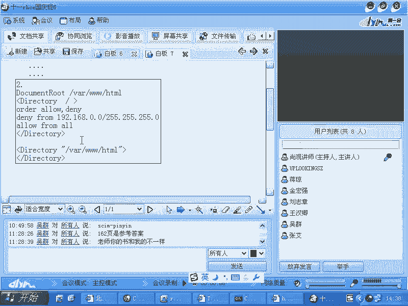

我看一眼啊。

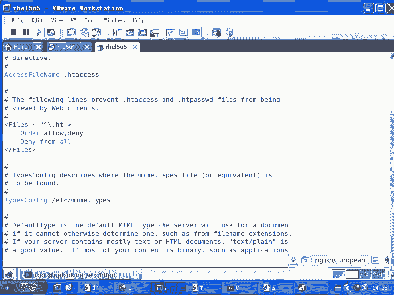

Acess file name啊 access file name。我们知道了我们默认定的HTaccess这个文件就access file name。就是当某个目录下有点HTaccess name呃。

这个access文件的时候，哎点HTaccess文件的时候，这个access文件里面的这些内容是吧？假如说这个文件里面有四行，它就会自动追加到什么？

这个directory这个位置来是不是自动追加到directory这个位置来。😊。

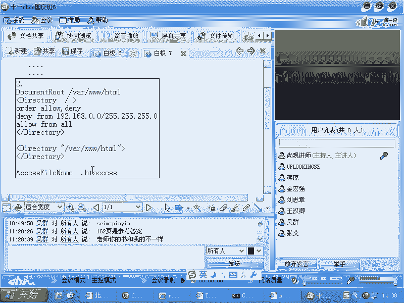

而且的话呢你添加到HTX文件里面的东西，它是历时生效。是不是？明白了吗？这是刚才我们做的。清楚了吗？现在这个就是咱们的这个大家明白了明白这个间架结构了没有？首先的话第一部分是整个server的配置。

是不是？接下来的话呢是我们默认的这个server，它的这个目录的设置，还有我们的这个目录的这个访问控制或者用户访问控制，是不是刚才那那那四行命令是吧是，用户的四行命令，大家会了吧，就是那四行命令的话呢。

是放在什么directory当中的。因为我们在某个目录下创建1个HTX文件。😊，是不是就是在访问那个目录的时候生效？所以的话呢我们刚才加那四项的话，应该是什么放在这个地方的，对不对？一个是什么呢？

一个是。😊，首先在这个目录里面告诉我们的系统说呃。访问控制。叫什么来着？大家原谅我啊，记寄不了那么多东西，寄不了那么多东西的话呢，我每回的话都是怎么样在这个里面给大家去找。我知道这个东西是在哪。

首先的话是加了一行什么？呃。

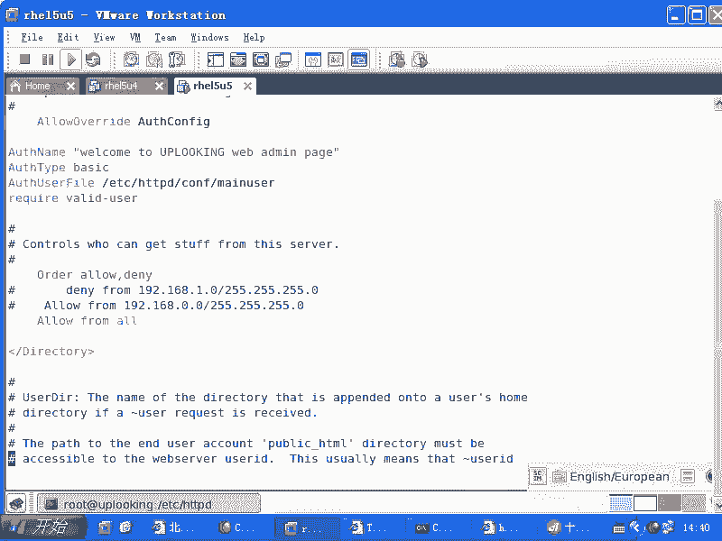

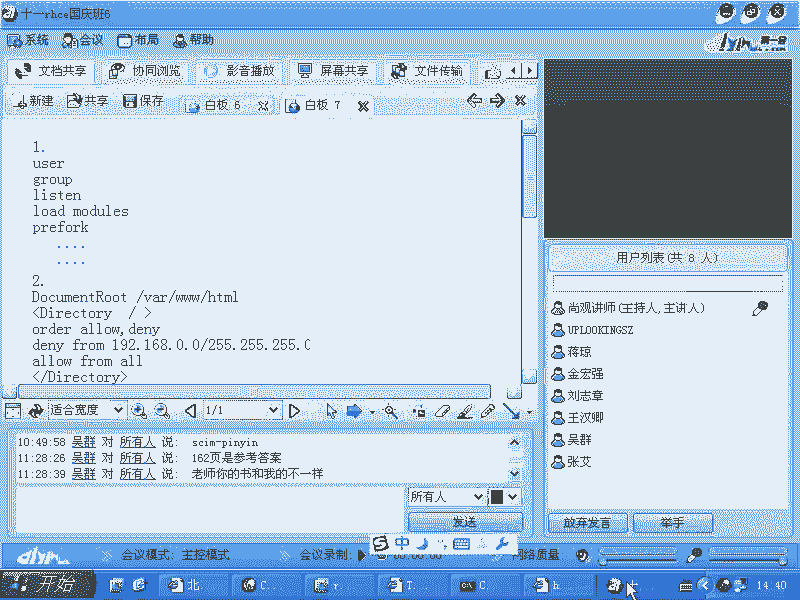

共享啊。就这几行喽是吧，就这几行了，首先加了一个along over over ride是吧？然后呢要这个地方要改成什么，默认是n，是不是把这个地方改成al confi。就是说我访问这个目录的时候。

你看我这个设置的东西是不是在整个的direction当中设置的，就是访问这个目录的时候生效，是不是这样？😊。

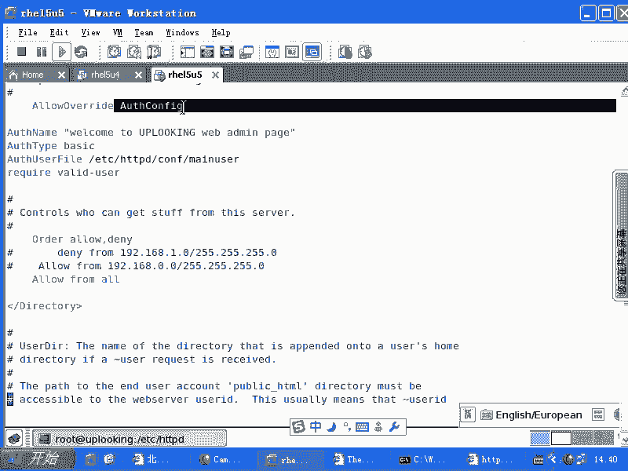

访问这个目录，其这个目录下的子文件夹的时候都生效。

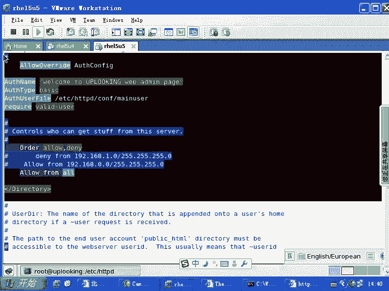

啊，都生效。那么在访问这个目录的时候的话呢，他要求怎么样身份认证。他要求怎么样呢？他要求身份认证，身份认证。那么这个认证的信息的话呢，它就会识别这个文件。也就是这个地方的话呢，是一个开关。

这个开关是开启以下的开关，也就是以下设置了。但是前面这个总的开关没开，那么下面都没有效，是不是？然后呢，我们说要身份认证。首先的话呢是欢迎什么什么，这是title是不是？然后呢，接着的话呢。

说认证的类型，你还可以用MD5类型。😊，啊，你可以看man hTXHT passwordssword这个命令的帮助啊，那么MD5类型的话还可以用。默认情况下是basic，就是简单的加密格式。

也就是把我的密码进行简单的加密。然后呢，在这个这边的话指定这个文件，也就是说我的用户名和密码是放在这个位置的。😊，用户名和密码放在这个位置。然后呢，如果要是在我这个文件里面出现的用户，他是被允许的。

否则就怎么样不允许是不是允许特定的用户。那么如果要是你就允许这个文件里面当中的两个用户，那就什么requireduser谁谁谁谁谁谁谁谁谁两三个用户，明白吧？就是requiredus了。

不是requid well user，对不对？😊，好，这个位置的话呢，理解是难难理解的。但是我告诉大家。这个结构的话呢，你到时梳理清楚以后，你以后配置它是非常方便。因为你不知道什么时候的。

你设置一个选项，哎，怎么在这边有效，在那边就没有效果。😡，是不是我放的这个选项，我该放在哪个位置，这时候就难说了。😡，现在我这个访问控制，我这个地方搞清楚了以后，然后我们现在再往下看啊，往下看。

这里面的话呢还有几个比较关键的。比方说基于文件的用户的访问控制，我们都知道。而基于文件的访问控制是不是这样一段。😊，是基于文件的访问控制，是不是？fi什么什么，哪个文件允许，哪个文件拒绝。😡，啊。

然后呢，接着就是最重要的部分，就是日志部分。日志部分的话呢是非常重要。如果要是你没有搞清楚啊，你没有搞清楚的话，那你在公司里面可能就是不明白为什么就是不明白有些东西为什么能出来，有些东西不能出来。

你比方说每一个大型公司的话，他都要求什么，他都要求你。分析日志。你比方说百度说哎。这个年头是吧，大家对什么东西感兴趣？是不是？搜索什么的多。那么是不是我们在搜索不同东西的时候。

在百度的那个乔目当中就是传输的那个参数是不一样，是不是？也就是说本质上讲就是我们。

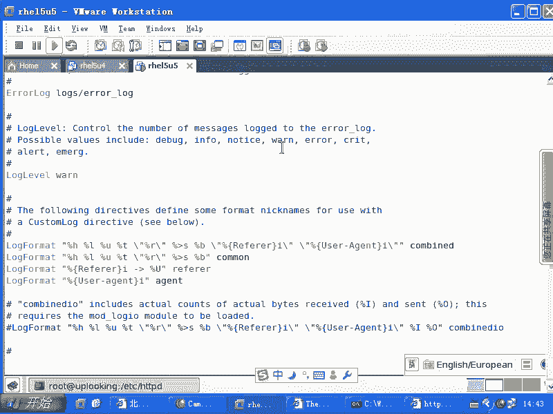

本质上讲就是说我们搜索不同的东西，实质上是什么呢？就相当于比方说我这边有个关键词是吧？key word word。等于。呃，keyword点，比方说ANA是吧，点，比方说PP文件，然后问号。

然后呢是我们的什么word。等于。hello kitty是吧？是吧那这样的话呢，就是说我再去搜索谁啊？hello kitty。那么你们看一下这一个选项是不是放在什么地方的，是不是放在这个任务栏，呃。

就是那个地址栏里面，是不是传递到我们的appartache服务器上去的。那appartache服务器是不是要把这一项写到它的日志里面。所以我们分析这些趋势也好，或者分析什么东西也好，实质上是在分析什么。

实际上是在分析它的要分析这个趋势也好，实际上是在分析它的日志，把这些信息的话呢截出来。所以每个大公司的话呢，它都必须得要做什么日志分析。😊，你像很多公司的话，他说我这个来源统计的话。

我是通过第三方软件是吧？在我的页面当中嵌入一个代码，对不对？然后呢，访问了以后，在那个那个服务器上，他就会告诉我说我的机器今天有多少人访问从哪来的，从哪来的，从哪来的，对不对？

但是呢你一个特别大型的网站。比方说你就是百度一天的话呢，几亿次，几十亿次访问，你怎么可能有另外一个公司给你提供这种服务。😊，是吧肯定是你自己来的呀，肯定是你自己弄的，对不对？

所以这时候的话日志服务是一定是需要的。因为你在这边传输的是一个地址盘的东西，你看啊你大家看我这样一回车。😊，没有发现是吧，那肯定没有，对不对？但是我们来看一下另外的一个另外一个地方啊。

我们看一下access log。😊，外下的log当中的HTTP当中的呃access log。看到了没有？看到了没有？最后这条。这条的话是不是说在检查hello kitty是不是？

是不是这条的话肯定是需要的，是不是？哎，不是，就是说这条的话肯定是需要标记在我们日志当中的，是吧？那么我们在分析的时候，是不是就需要这个文日志进行分析是吧？那么这个日志的格式为什么会是这样的？😊。

这个日志的格式为什么会是这样的？就是因为我们在这边要设置日志格式，看到了吗？首先air log的话呢，就是我们的air log这样的一个名字，我们就不管它了。就是出错的时候。

大家的ap帕ache在配的时候啊，你看message文件是看不出来appartache的细节控制的。😊，看L可以。airlog的话就是appartache，然后哪个地方细节有问题。

那么它是不会通知s logslog是一个公用的，是不是？那我自家的这个东西肯定我记录在自家的这个日志文件里面去，就是air log这是排错用。那么我们的这个普通的日志啊。

大家一定要看它这边设置的日志格式，这个日志格式的话，你看有conban的方式有common方式，还有agent的方式。我想问大家，哪种格式的话，记录的东西是最多的。😊，哪种日志格式记录的东西是最多的？

哪一种？是comban的还是common，还是agent，还有什么refer。哪个？肯定第一个是吧？那如果要是你想让你的日志记录的东西是最多的，那么你就要什么呢？你就要设置了。

你看我们的access log，是不是刚才我在设置access log？😊，我的日志格式就是custom log，就是我的这个普通的日常访问的这个日志。日志的名字叫做access log，看到了吗？

accesel log是什么格式的？😊，combanded是吧comp这种格式，comband的格式就是最多的那如果要是你记录的是common格式，是不是就会分析很多东西分析不出来？对不对？

你还可以的话呢，根据这个选项来定制comban的方式，到底记录哪些东西。只不过现在这边的话呢是一个约定俗成而已。首先是什么？主机名是不是？然后接着是什么什么这个百方L我不知道啊。

百一也不知道百这个T的话肯定是时间了，是不是时间啊，他记住这些东西，你可以经过你自己的定制。但是呢这个是一个约定俗成的，你可以网上直接找那个日志分析工具来分析你的这个comban的方式的日志啊。😊，好。

这边的话呢就是我们这个日志的格式。所以这个日志格式的话呢，也是我们的重点啊，也是我们的需要大家记住的。因为你们在平时工作的时候肯定要用得到啊，肯定要用得到。我们是不是该把这个边再去详细的说一下了，是吧？

这地方还有个什么呢？刚才我们说还有一个基于什么文件的，是不是基于文件的防控制。基于文件呢。Well。什么什么什么对不对？这个基于文件的反控制也可以。然后接下来的话呢是一个日志，有一个er。😊。

logg是不是airlog指定哪个文件？airlog指定哪个文件？那么默认情况下，它叫做logs。这个logs的话呢，编译安装的时候，就是在他们的这个。就是在他们的这个根目录下的什么，这个logs目录。

但是我们RPM安装是不是全部都重定向到了哪儿？它是一个软链接是吧？重定向到了va下的log当中的HTVD那个目录下。明有我说的意思吗？如果要是你是一般编译安装的话。

你的日志就放在你编译安装以后的那个目录的logs目录下啊，完正大家又快睡着了啊。那么当然还有个什么access a common log。哎，custom log是吧？Custom。

log是不是这样的啊，然后这边的话呢是logs默认情况下是access。下划线log是吧，是comfin。是吧compine可是是不是这样子行？啊。那么这样的话呢，这个日志的话也是要了解。

接下来一个东西是什么呢？接下来的一个东西的话呢，是我们的呃。也就是说你学了半天，你到底学什么东西啊，学什么东西？我一个一个选项呢给大家梳理了一遍是吧？大家说哦，当时明白了，后续的话什么都没听明白。

是不是？现在的话我告诉大家，我说前面的话呢是有关服务的一些选项是吧？我给大家列出来。后面的话呢是一些主服务器上的这个目录的选项啊，或者文件的选项，我每一个的话还举个小例子，对不对？举个小例子。

然后接下来的话呢是什么？😊，是我们的一个alance。AS的话呢就是相当于是虚拟目录。我要创建一个名叫什么呢？名叫。script这样的一个虚拟目录是吧，它实际的目录是在哪呢？

它实际的目录是在呃3W目录下，就根目录的3W目录下的script当中，是不是？我这边是不是建立过script目录。然后呢，我如果要是想建立的这个目录的话呢，它是一个需要可以执行脚本。

你这样的建立出来的目录，那个目录下，如果有一个可执行文件，它是不允许你执行的。😊，是不是不允许你执行的？但是呢如果要是你这边变成一个script。😡，AS。那么这边你要说别人访问什么呢？

这边的话我就叫做。明白吧。啊，笑什么？は。啊，就是当别人访问我的tax的这个目录的时候，就是IP地址加上个texax，这是是没有加双引号，没有加专双引号的话，它是什么目录？😊，虚拟的目录是吧。

就访问我跟下的text的这个目录的时候啊，text这个目录时候，那么它就访问我的什么呢？3W当中的text啊，这边我要不要加杠？我为了保险起见，我就加杠，因为我很多东西记不清楚，我只有事下才清楚。

我记不清楚，你们说刚才那些选项的话，你能记清楚多少个。😡，把HTTP地点康复给你删除掉，你重新建一个。是吧弄死了是吧，那你全心去写的话，那是很很头疼。所以你有一个文件以后，你照着改。

你可以蛮配有偶尔有几个参数man配置一下是吧？看看日志，你可以把它改过来。你要真的记清楚的话，那就太难了，对吧？所以我这边的话呢，相当于在忙写啊，就是没有任何的依据的情况下忙写。所以有很多东西我是。😊。

就是说是。不太敢敢去确认啊，然后呢，所以我是说呃请原谅我，就是经常说啊这个东西我我忘了是怎么回事了。因为我忙写的时候，我总是觉得不太靠谱，我要试一下才知道。那我这边的话加一下一杠啊，可能会保险一点。

我告诉大家的就是什么和scriptcr alien alien和 script alien，一个是这两个都是虚拟路径，一个是只是文本是吧？或者是pP的脚本，另外一个是什么呢？

就是可执行的那些可执行的命令，不管是C语言的命令还是什么还是我们的那个就是这个hell编程里面的命令，明白吧？都可以去执行。所以的话呢这样的话就是我们的呃定义这个脚本。😊，那么在H呃在HEL5里面。

尤其HCE当中啊，这个地方你定义了一个目录以后，一定要注意这个目录下要注意什么呢？注意SEX拒绝你。是不是SE基本上百分之百会让你拒绝你是吧？你有一个文件放在了什么？放到这个text的目录下。

你比方说有一个叫做index的HT的文件是吧？它是绝对不会让你去。😊，不会让你去使用的，是不是？所以你必须得要用什么命令啊？你要注意SE如果你定义了不是在Y下的3W目录下的那些东西。

那你一定要运行这个命令。还记不记得？CHCON杠大R是吧，杠T把它转成什么HTTP。HTTP是吧，然后加上一个什么HTTP呃，D下划线conent是不是下划线T是不是加上一个。3W目录是不是？明白吧。

下面这个脚本的这个的话，就应该改成什么什么scriptureEXEC是吧？这个我又记不清楚，我又记不清楚。我知道某一个地方的话呢，有我的一个就是有一个例子，是不是这个就是系统当中的话呢，像我们的呃。😊。

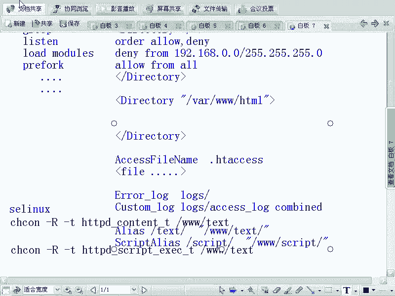

像我们的这个我们的这个。就啊パチ。就软软泰安装的这个系统当中啊。就会有一个例子，看一下LS杠大Z是不是杠大ZD，然后呢哇下的这是原本他们的这个目录HTML和什么呢？哇下的3W当中的。CGIB啊。

这两个目录一个是什么？一个是。ache的可执性文件目录是不是？另外一个是什么？😡，它的内容目录是不是这两个的类型啊，你抄过来就好了。你看我如果要是记错的话，我如果要是写的有问题的话。

我到时候我会验证一下，我知道哪个地方的话有我的一个范例。但是我知道要这样做，这就是你学到的东西，清楚吧？清楚了吗？如果我的意思就是说，如果是你把你的可执行文件啊放在CGIB当中，那当然没有问题。

那当然没有问题。你在那个目录下创建的文件，它也自动会有什么这种类型，是不是？然后呢，你把你的页面文件放在3W当中HM目录下，也没有问题，这也没有没有任何的这个相当于花上直接放进去就可以用。

因为我们的RPM安装的包是吧，它已经约定俗成了是吧？SE6都跟它相匹配了。但是现在是怎么样的？现在你用另创建了一个文件夹，你是手动去什么创建三单独目录的，这时候电脑可就傻了。

它根本就不知道你预先要创建哪个文件夹，它也不会猜，对不对？所以计算机的话呢，它就是一个傻子，事先没有定义好的，它就怎么样。他就开始他就他也不会帮你做。那么当你创建这样目录，你这个3W的目录下呃。

比方说text。里面所有的全部都要变成什么？所有的都要变成页面文件的时候啊，你想在这个目录下创建页面文件的时候，那你就一定要怎么样CHCON是不是杠T啊，杠大R把这个目录及这个目录下。

所有的子文件夹里面的所有目录，还有所有文件全部都换成什么呢？就是杠大R杠T啊，换成这个样子。因为人家已经给了你一个范例，是不是？这个范例是一个很好的例子。

你可以把3W当中的text这里面所有的文件和子文件夹当中所有的文件全部都什么变成这个类型。然后呢，如果要是那个可执行文件的话，那么可执行文件的话呢，你需要在这里面执行，那么相应的换的类型就是这个类型了。

清楚了没有？这两个相当于用的是不同的权限。😊，啊。再回过头来再看。

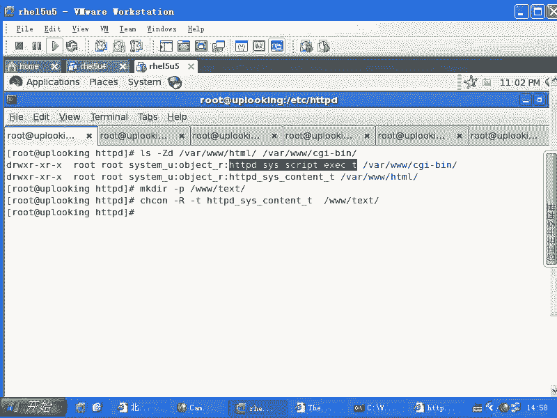

再回过头来再看。现在我说的这个地方大家清楚了没有？清楚了是吧？就相当于在加载什么呢？你自己的这个相当于虚拟路径啊，这个虚拟路径该怎么样去做。我们就跟大家说清楚了。所以整个的这个文件啊。

整个的这个文件它的这个两部分，第一部分是怎么样，第二部分是怎么样，重要的东西我都给大家捋出来。😊，重要的东西我都跟大家捋出来。以后的话呢，如果大家在做案例的时候，在做那个各种各样案例的时候。

这种基础的东西就不要去讲啊，你们都应该特别熟悉是吧？自己做一个认证。当然了，还有认证啊，我们的这个。😊，我们的这个HCE的这个教材当中啊，HCE教材当中还有一个组。

就是说我们刚才不是在这个地方有一个accessacs这个地方不是有个用户认证嘛，是吧？这实际上是在directory当中的，是不是在directory当中呢？在direct当中话呢，有一个。

A有TH是吧？RIDE。我又忘了。是不是这样？是不是这样的？我刚才看了一眼，就忘了。Along are over。是吧是这样的。挺这R。是这样的吗？你们就不告诉我是吧？那我自己在那边找。

那么along over rideide的话呢，后面的话呢是加上一个out config的话呢，呃它的意思就是什么呢？允许。认证啊，就是允许你接下来的话，对这个目录里面那个认证的那些命令都可以用。

你要加个n的话呢，它就是把那个点H access文件，或者说你接下来写的outs什么那个confi那些东西全部都失效掉，明白吗？所以你要把它改成这个默认的啊，这边再加个R啊，然后呢这边的话呢。

就是我们的接下来的什么啊。AUTH是吧，ous name是不是name什么什么，然后。house什么 file，是不是user file，然后呢类型等等啊，在我们的这个书当中的话，还有一个什么呢？就是。

设置组就是说我们让一组的人怎么怎么样，一组的人怎么怎么样。这个的话呢是我们呃另外一些东西啊，这边的话呢我希望大家把这片东西的话呢再复习一下，就是把它搞清楚。也就是说这些东西啊。

第二段的这些东西全部通通所有的都可以用在什么地方，都可以用在我们的。虚拟主机的里面，这是我们默认的主机，是不是我们默认主机，还有什么虚拟主机啊？😡，明白吗？虚拟主机，所以虚拟主机里面的话呢。

还可以用这些东西document rootots name啊，这上面还有个什么？少班。name等于什么？还有一个什么呢？ser。Aiences啊allias alienlias和als。啊，有没有？

我查一下啊。

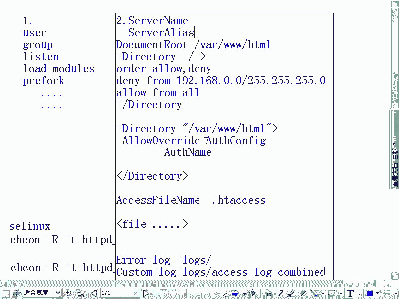

这些全都可以用在什么呢？我们的虚拟主机里面。Okay。慢HTPD点com对不对？Yeah。没有啊。

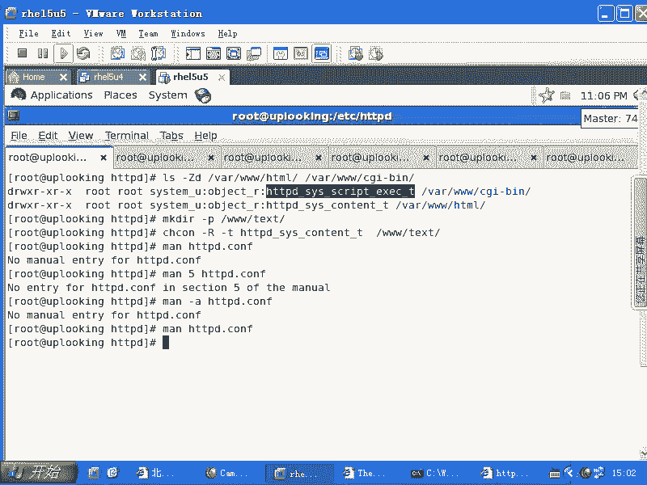

应该还有个server alien还是als。s alien server alien。so alien就是说这个主机的别名有哪些？你比方说我们知道有个3Ws点com是吧？那你访问s点com的时候。

是不是也能访问到这个主机？知道吧？就是说你给这个主机的话起多个名字。server name的就是这个主机的名字。ser alien的话就是它的其他的别名。

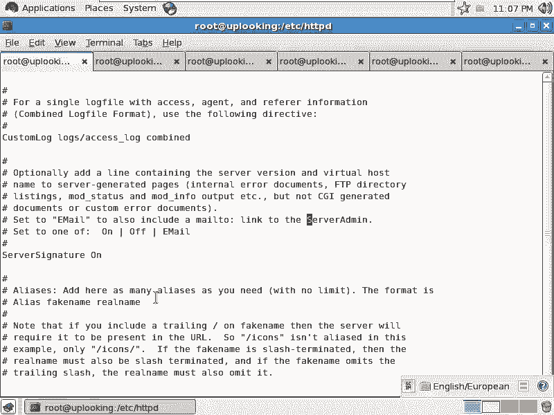

是吧。你就看着我笑着出丑是吧？

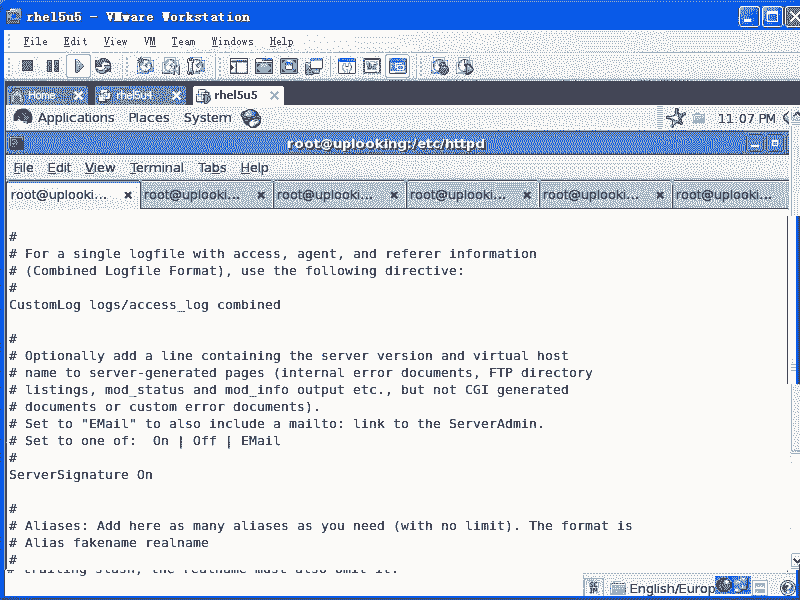

然后很开心啊。所以这些东西的话呢，就是说。就是一天呃就是一个星期过一遍，你基本上能把他们全都背写背写下来。两个星期，那你基本上就会把原来那个上一次做的那些东西忘掉。所以就说我这样的话，就说经常去过啊。

脑子里面过一遍一遍一遍，未必能记得那么清楚是吧？那么除非是你每天在配这个东西，否则你一般是默写不下来的，对不对？啊，但是我告诉大家有这个东西啊，有类似这个东西，sorry aliens还是als。

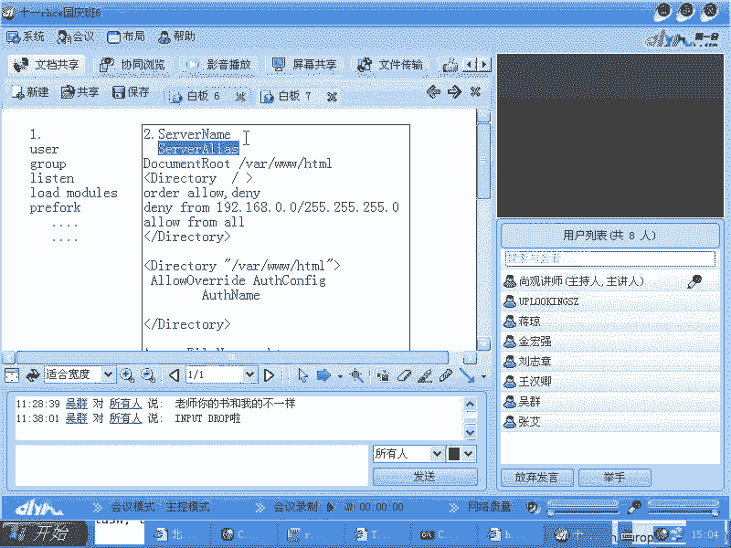

这个的话查一下，如果要是我平时的话在工作的时候，我就会怎么样呢？再去这样搜一下，搜一下嘛，是不是？我看一下。是不对？

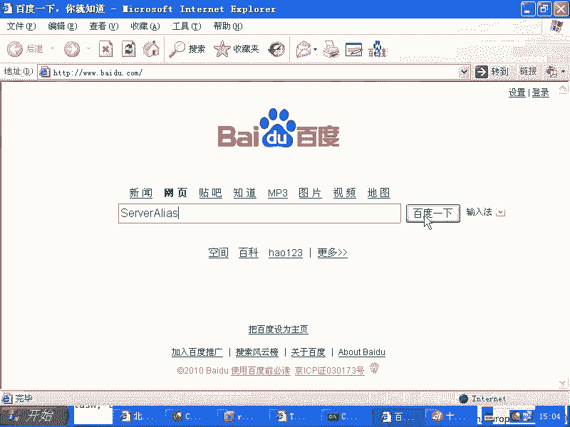

看s evidence。Apartache的so alien是不是？是不是service server呃 server a是吧？那我知道有这个东西，这实际上就是我的能力了，是不是你们学了半天以后。

把所有的命令都背起来，不可能。😡，然后呢，你们知道有这个东西，你们就相当于已经什么。😡，学的差不多了，能理解他这就可以了，是不是不要要求自己那么那么麻烦，你能找得到它。因为现在有google百度嘛。

是不是再傻的话呢也能找得到啊，但是呢你关键。😊，你找的话是能找到那你怎么你怎么知道要找这个东西呢？这就是最第一步啊。那我告诉大家以后，大家脑子里面都有这个印象才行啊。O我们先休息5分钟。

等一下他来继续讲。😊。