# 尚观Linux视频教程RHCE精品课程：P80：RH253-ULE116-8-1-httpd-main-server-auth 🔐


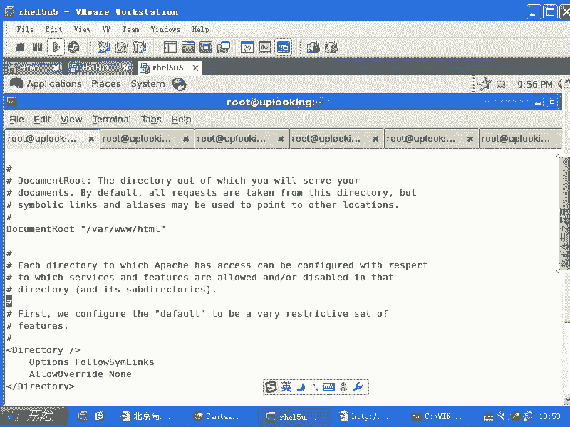

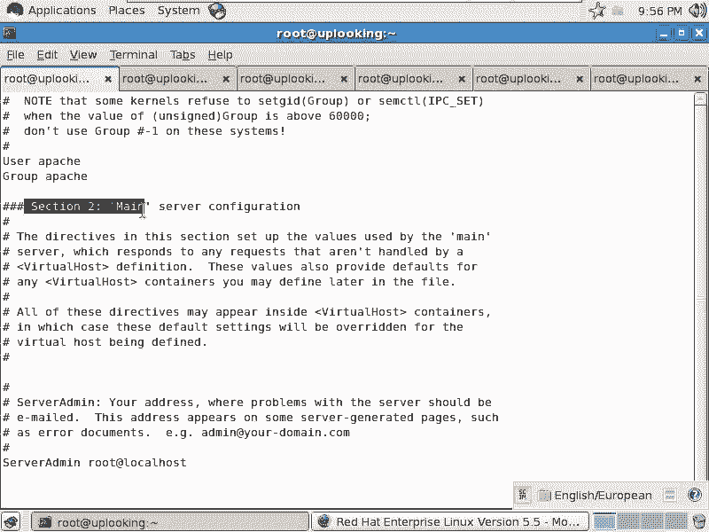

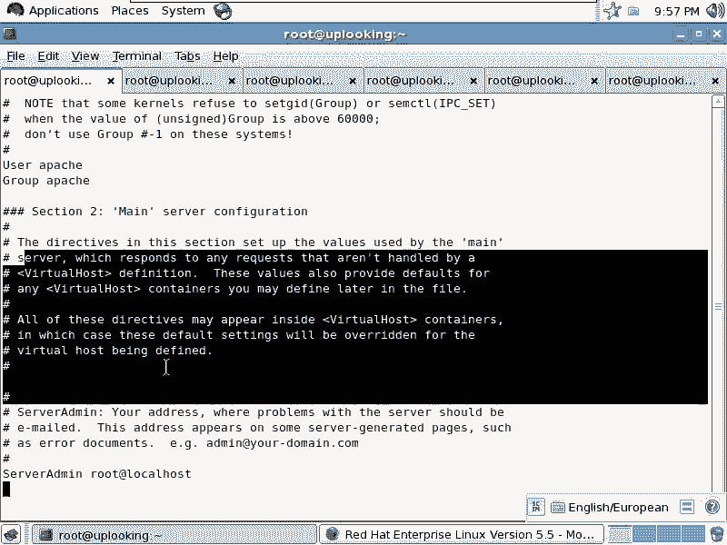

在本节课中，我们将要学习Apache HTTP服务器主服务器（Main Server）的配置，特别是关于访问控制和用户身份认证的核心概念。我们将深入理解主服务器的定义、目录配置、访问控制列表以及如何通过`.htaccess`文件实现动态认证。

---

## 主服务器（Main Server）概述

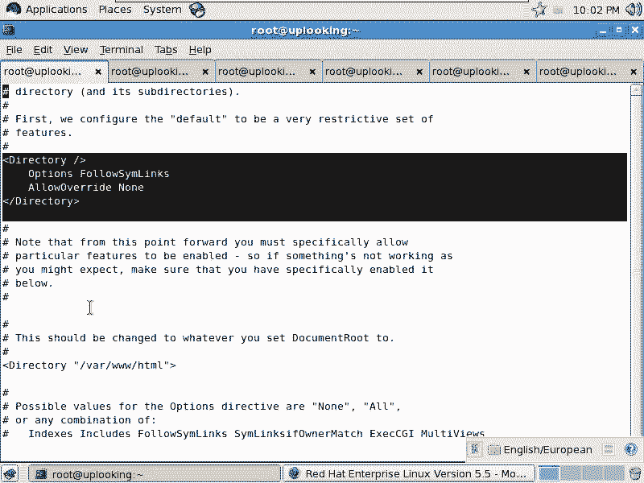

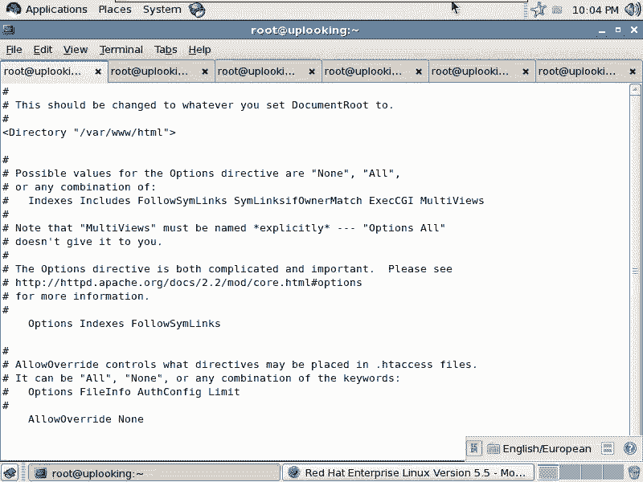

上一节我们介绍了Apache的基本架构和配置文件结构。本节中我们来看看什么是主服务器。

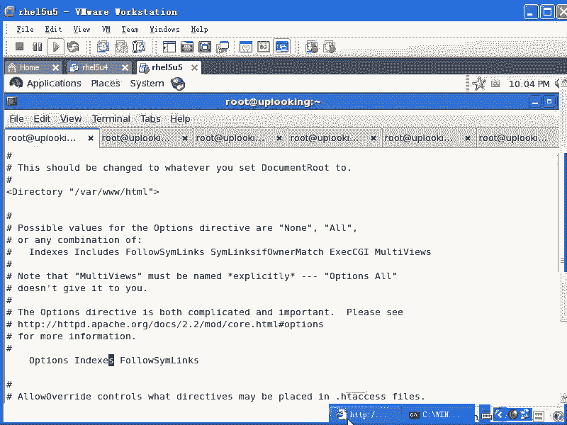

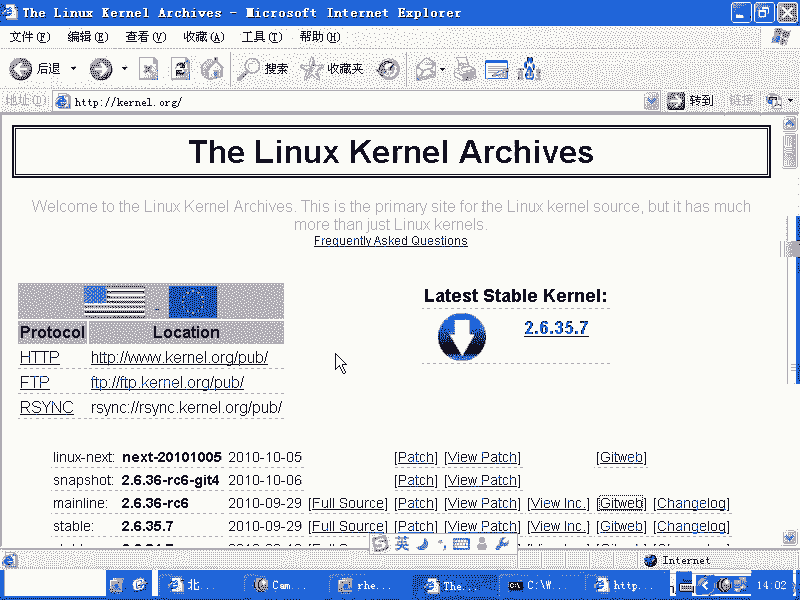

所谓主服务器，就是Apache默认的、未做任何虚拟主机配置时的那个服务器。默认情况下，Apache的主文档根目录（Document Root）位于 `/var/www/html/`。所有针对该目录的访问权限、默认文件等配置，都在主服务器的配置段中进行定义。

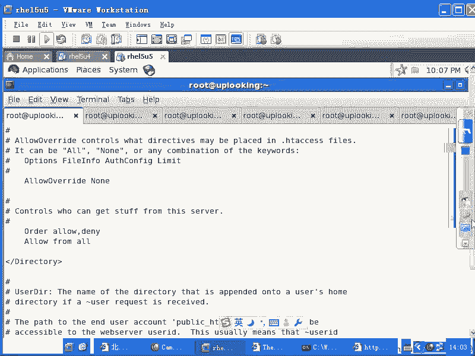

主服务器的配置可以应用到后续定义的虚拟主机中，为虚拟主机提供默认的配置模板。

## 核心配置参数解析

以下是主服务器配置中几个关键参数的含义：

*   **`ServerAdmin`**： 指定系统管理员的邮箱。当页面出现错误时，显示的联系人信息。
*   **`ServerName`**： 定义服务器的主机名。在主服务器中通常不配置，主要在配置虚拟主机时使用。
*   **`DocumentRoot`**： **这是最重要的参数之一**。它定义了当用户访问网站“根路径”（`/`）时，服务器文件系统上的实际对应目录。例如：
    ```apache
    DocumentRoot "/var/www/html"
    ```
    当访问 `http://your_server_ip/` 时，实际访问的是 `/var/www/html/` 目录。

**虚拟路径与实际路径**： 在Apache配置中，不加引号的路径（如 `/`）是**虚拟路径**，即浏览器中访问的URL路径。加双引号的路径（如 `"/var/www/html"`）是**实际路径**，即服务器文件系统上的真实目录。Apache的核心功能就是将虚拟路径映射到实际路径。

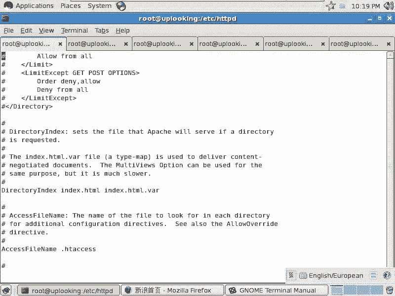

## 目录访问控制（`<Directory>`）

我们可以使用 `<Directory>` 指令块来对特定的目录（虚拟或实际）设置访问规则和选项。

以下是 `<Directory>` 指令块中常用的配置选项：

*   **`Options`**： 控制目录的特性。
    *   `Indexes`： 如果目录中没有 `DirectoryIndex` 指定的默认文件（如 `index.html`），则显示该目录的文件列表。**出于安全考虑，生产环境通常应禁用此选项**。
    *   `FollowSymLinks`： 允许跟随符号链接。
    *   `ExecCGI`： 允许在该目录执行CGI脚本。
*   **`AllowOverride`**： 控制是否允许使用 `.htaccess` 文件覆盖此目录的配置。可设置为 `None`（禁止）或 `All`（允许）。
*   **访问控制（`Order, Allow, Deny`）**： 用于基于IP地址或网段限制访问。
    ```apache
    Order deny,allow
    Deny from 192.168.1.0/24
    Allow from all
    ```
    上述配置的含义是：先应用`Deny`规则，再应用`Allow`规则。最终结果是拒绝 `192.168.1.0/24` 网段，允许其他所有地址。**注意**：在更现代的Apache版本中，推荐使用 `Require` 指令。

## 用户身份认证配置

除了IP控制，Apache还可以要求用户输入用户名和密码进行认证。

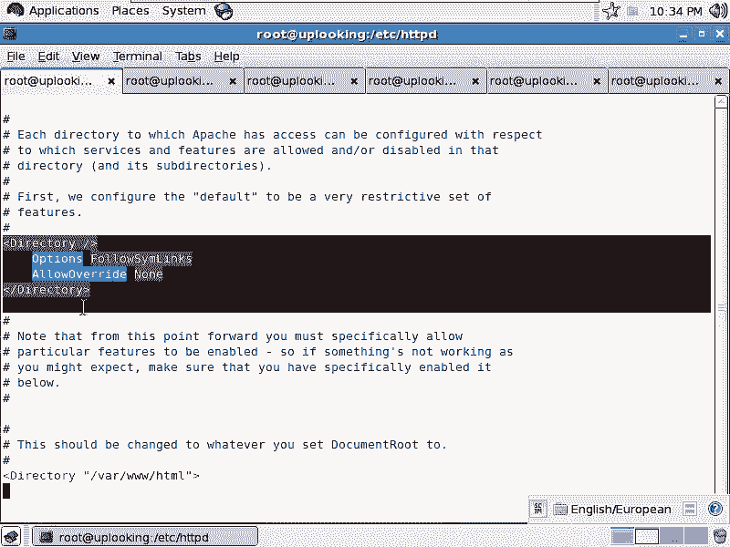

实现基于文件的用户认证通常需要以下步骤：

1.  **创建用户密码文件**： 使用 `htpasswd` 命令。
    ```bash
    htpasswd -c /etc/httpd/conf/.htpasswd user1
    ```
    首次创建使用 `-c` 参数，后续添加用户则不需要。

2.  **在主配置或 `.htaccess` 中配置认证**： 在目标目录的 `<Directory>` 块或 `.htaccess` 文件中添加如下配置：
    ```apache
    AuthType Basic
    AuthName "Restricted Area"
    AuthUserFile /etc/httpd/conf/.htpasswd
    Require valid-user
    ```
    *   `AuthType Basic`： 指定使用基本认证。
    *   `AuthName`： 定义认证对话框的提示信息。
    *   `AuthUserFile`： 指向第一步创建的密码文件路径。
    *   `Require valid-user`： 要求密码文件中的任何有效用户均可访问。也可以指定具体用户，如 `Require user user1 user2`。

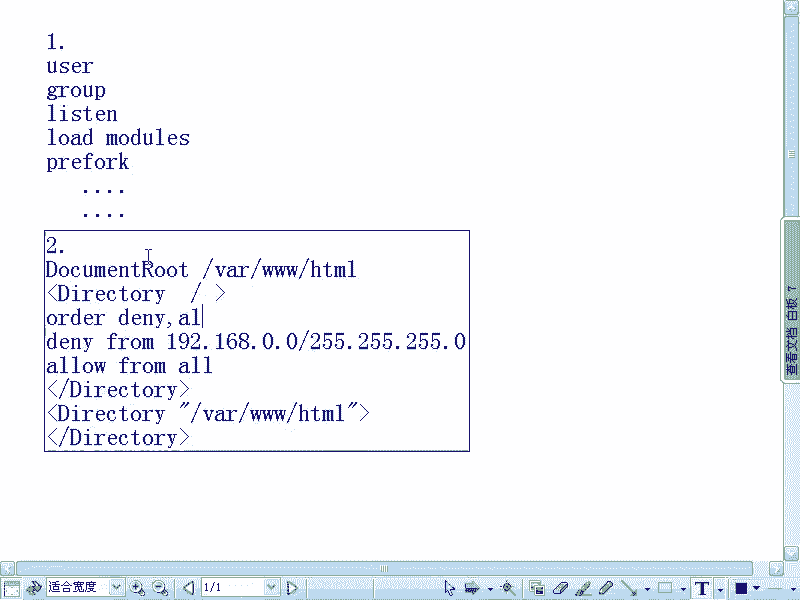

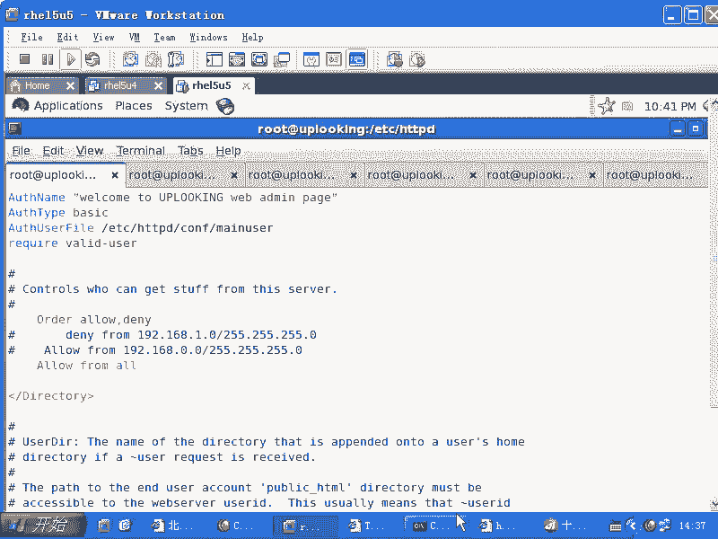

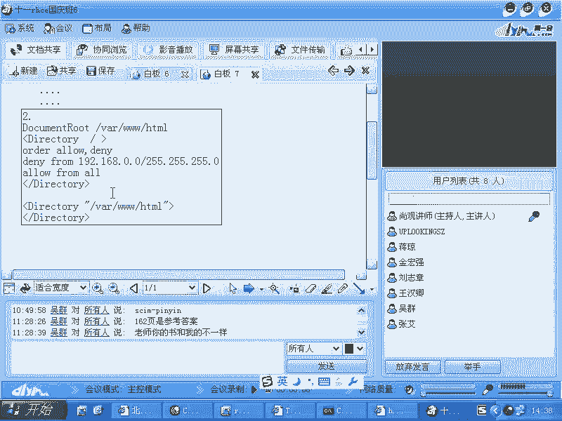

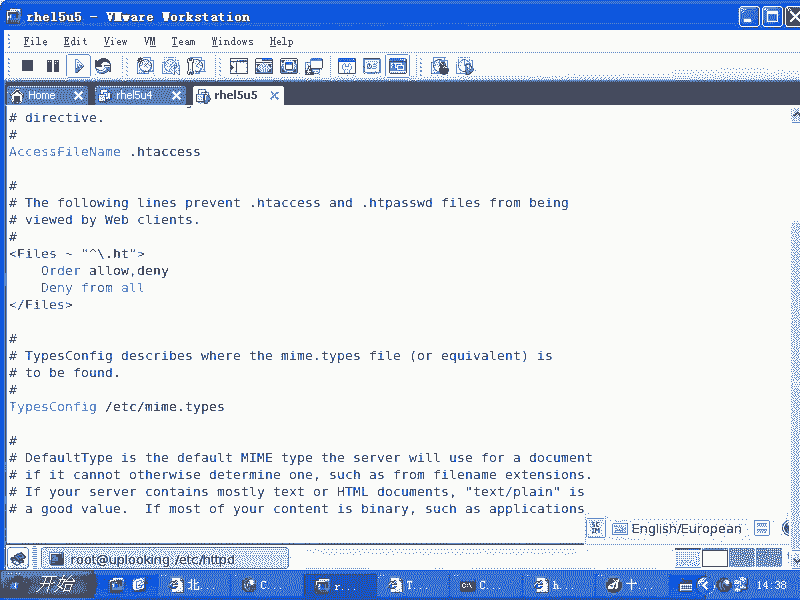

3.  **确保配置生效**： 如果配置在 `<Directory>` 块中，需要确保该块的 `AllowOverride` 包含了 `AuthConfig` 参数，或者直接设置为 `All`。

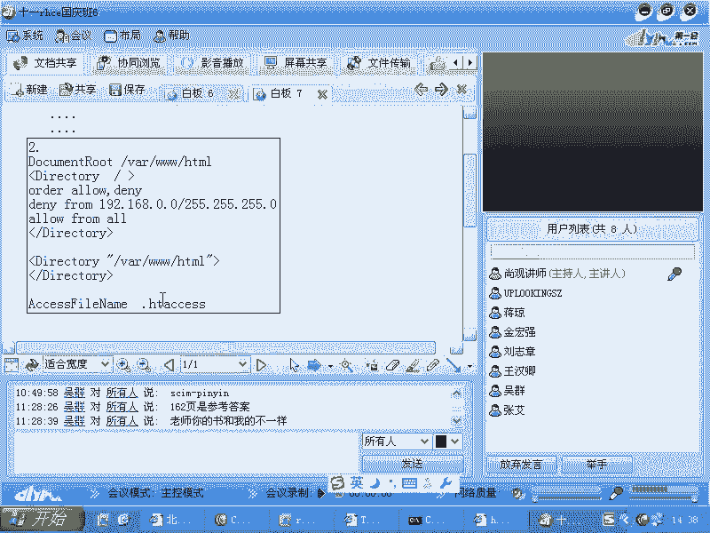

## `.htaccess` 文件的使用

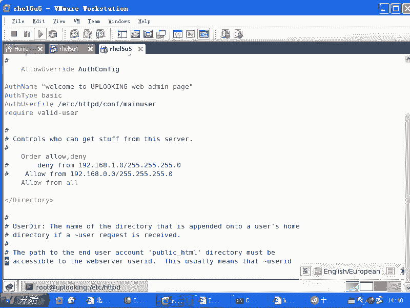

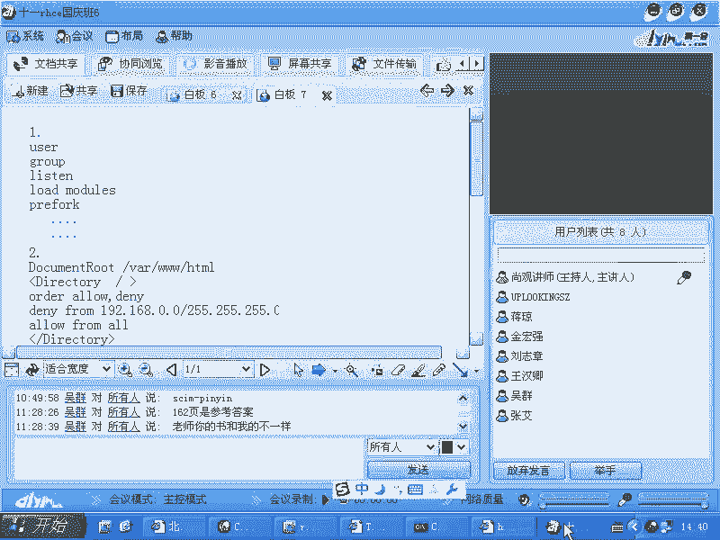

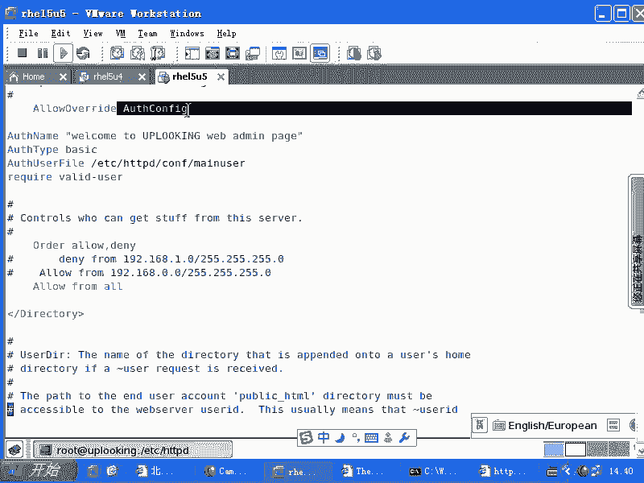

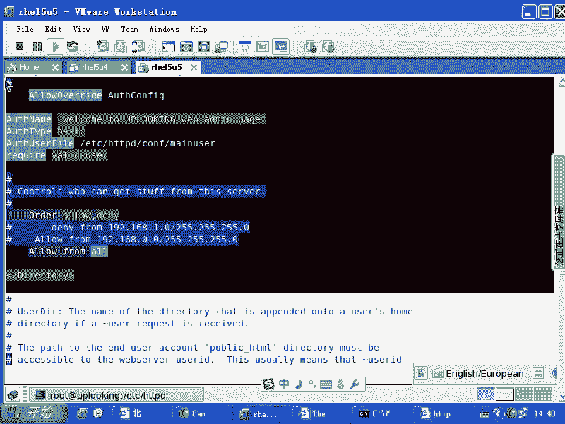

`.htaccess`（分布式配置文件）是一个特殊的文件，可以放在任何目录中，其中的配置指令会作用于该目录及其所有子目录。

**优点**：
*   **无需重启服务**： 修改 `.htaccess` 后立即生效，无需重启Apache。
*   **配置灵活**： 允许非root用户（如网站开发者）在特定目录下进行访问控制等配置。

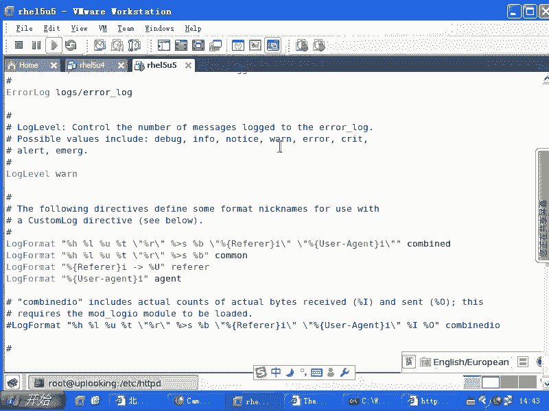

**缺点**：
*   **性能影响**： Apache每次处理该目录下的请求时都会读取 `.htaccess` 文件，在高访问量场景下会导致性能下降。
*   **安全隐患**： 如果配置不当，可能被恶意利用。

**保护 `.htaccess` 文件**： 默认配置中通常包含以下规则，防止 `.htaccess` 文件本身被外部访问：
```apache
<Files ".ht*">
    Require all denied
</Files>
```

## 日志配置

日志记录对于监控和排错至关重要。Apache的日志配置主要涉及两个文件：

*   **错误日志（`ErrorLog`）**： 记录服务器运行中的错误、警告信息。路径通常为 `/var/log/httpd/error_log`。
*   **访问日志（`CustomLog`）**： 记录所有对服务器的访问请求。其格式由 `LogFormat` 指令定义。
    ```apache
    LogFormat "%h %l %u %t \"%r\" %>s %b \"%{Referer}i\" \"%{User-Agent}i\"" combined
    CustomLog logs/access_log combined
    ```
    `combined` 格式记录了最丰富的信息，包括客户端IP、访问时间、请求行、状态码、数据大小、来源页面（Referer）和用户代理（User-Agent），是日志分析的首选格式。

## 虚拟目录别名（Alias）与脚本目录（ScriptAlias）

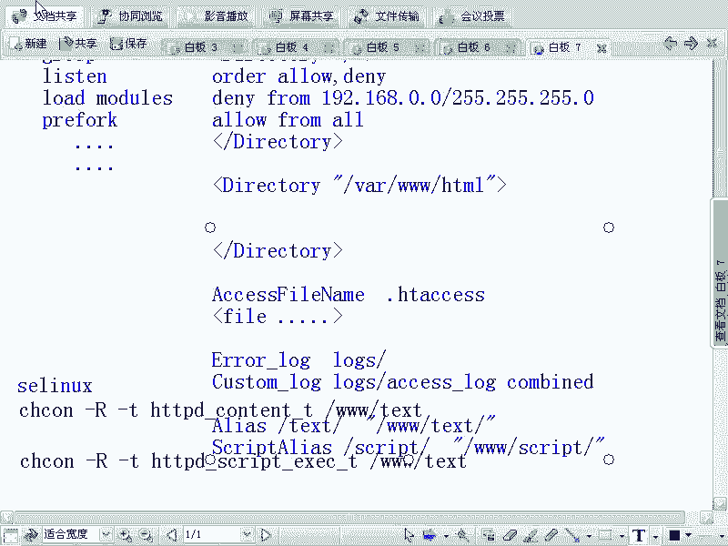

*   **`Alias`**： 用于将URL路径映射到文件系统上非 `DocumentRoot` 的目录。
    ```apache
    Alias /images "/path/to/your/images"
    ```
    访问 `http://server/images/` 会指向 `/path/to/your/images/`。

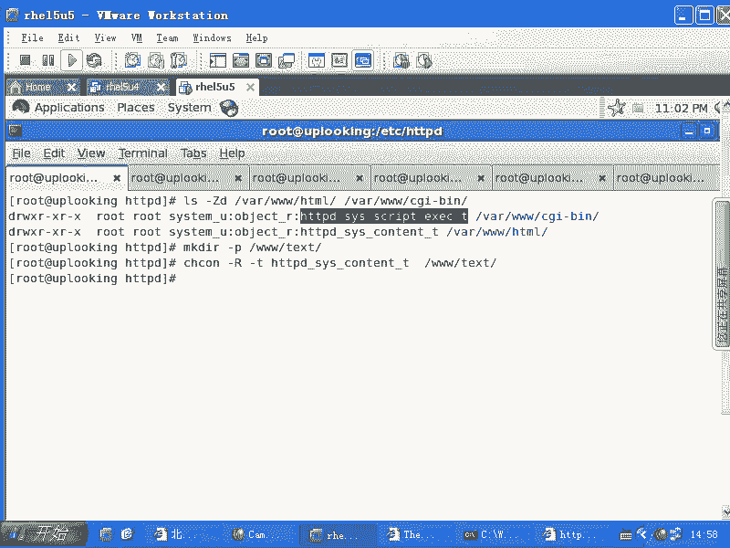

*   **`ScriptAlias`**： 与 `Alias` 类似，但指定的目录被标记为包含CGI脚本的目录，Apache会尝试执行其中的文件。
    ```apache
    ScriptAlias /cgi-bin/ "/var/www/cgi-bin/"
    ```

**SELinux上下文**： 在RHEL/CentOS系统中，如果自定义了 `DocumentRoot` 或 `Alias` 的目录，可能需要修正SELinux安全上下文，否则Apache可能无法访问。可以使用 `chcon` 命令修改：
```bash
chcon -R -t httpd_sys_content_t /path/to/your/web_directory
```
对于CGI目录，上下文应为 `httpd_sys_script_exec_t`。

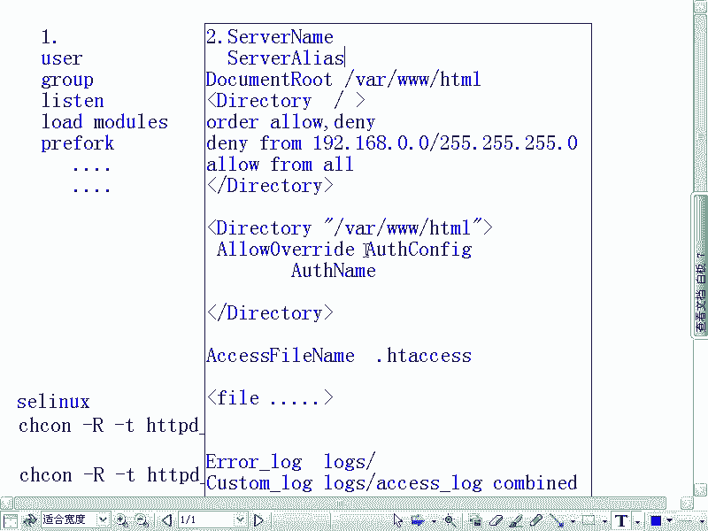

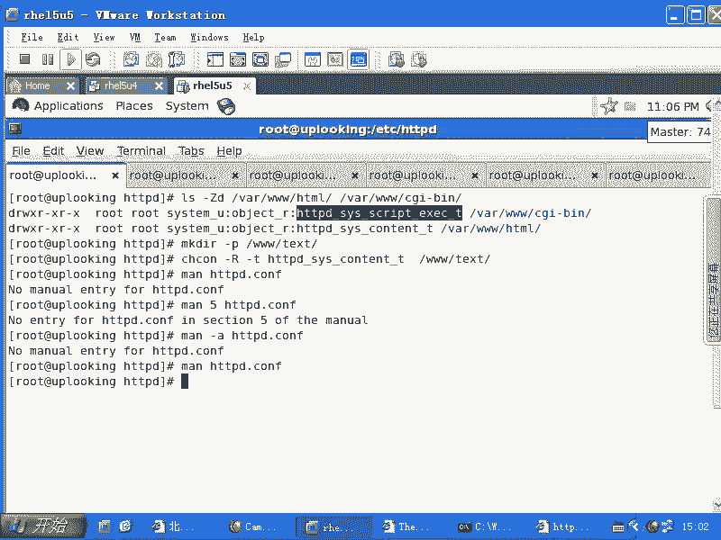

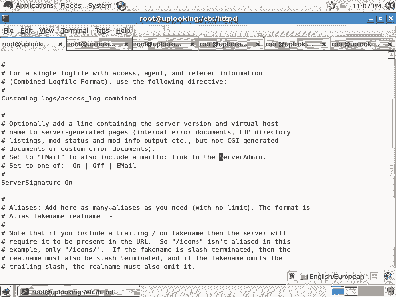

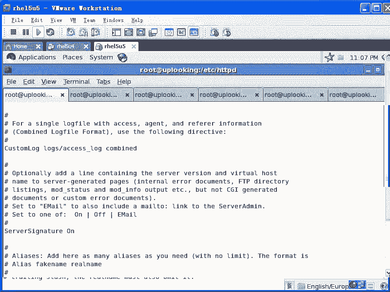

---

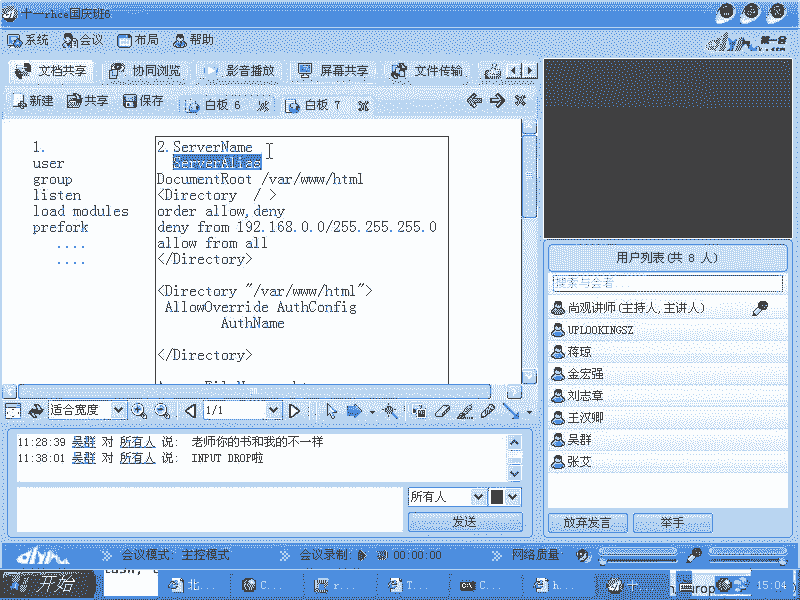

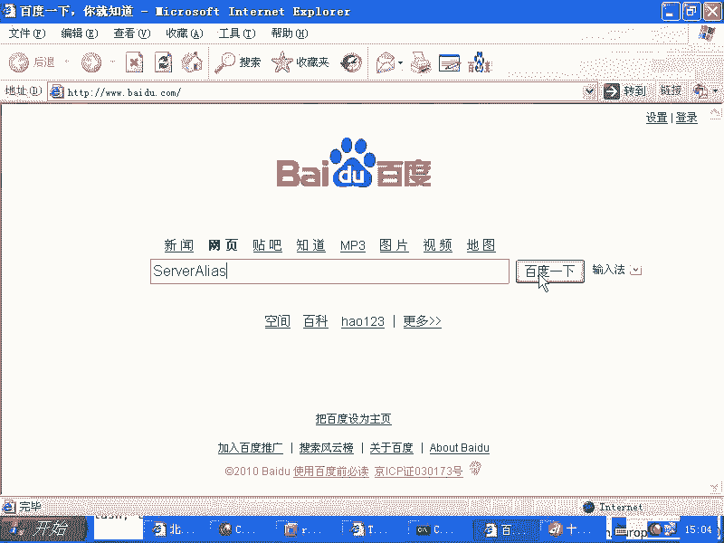

本节课中我们一起学习了Apache主服务器的核心配置。我们明确了 `DocumentRoot` 的关键作用，掌握了使用 `<Directory>` 进行目录级访问控制和选项设置的方法。重点实践了如何配置基于文件的用户身份认证，并理解了使用 `.htaccess` 文件的利弊。此外，我们还了解了日志格式的配置以及 `Alias` 和 `ScriptAlias` 指令的用法。这些知识是构建安全、可控的Web服务器的基础，同样适用于后续要学习的虚拟主机配置。