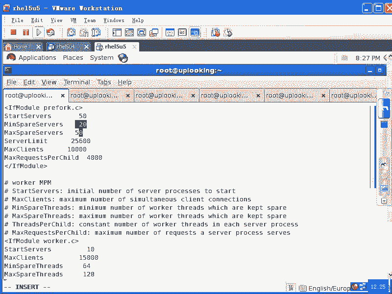

# 尚观Linux视频教程RHCE 精品课程 - P81：RH253-ULE116-8-1-httpd-prefork-worker - 爱笑的程序狗 - BV1ax411o7VD

好，我们看一下appache。

看啊法庭。的主配置文件就是ETC下的HTTPD当中的com当中的HTTPD点com对吧？我们刚才看到的它的版本是多少？RPM杠QVRPHTTD对不对？尽管的地位的话呢，现在被N话呢所这个威胁是吧？

但是呢它还是一个非常老牌的这样的一个外部服务器很多大的公司里面还是首选它，不管怎么样啊，总比windows的快吧，是吧？看一下windows自带的IIS要快吧。而且IOS的话呢。

它提供大量的什么自动化的功能啊，你像那个circle注入的动啊之类的。我看人家就是看他们入这个注入的时候，拿个小程序啊，什么都不懂啊。

就是肯肯定连cicle circle都不懂然后呢也不用去等太多的什么外部服务的机理点两下啊，就进去了，D盘的话，或者C盘呢就全都能看到啊，所以它比较头痛，因为它。😊，它跟我们的操作系统连接非常紧啊。

就是IOSapache没有这个问题是吧？那N g的话呢比apache还要更简单。它现在这个版本大家看到是2。2。3，是不是2。2。3的话呢，它是1个2。2的版本，对不对？那么apache的话呢。

它实际上分成几大版本？你在系统里你在。😊，公司去看的话，他可能有这样的。一点多少多少版本啊，一点多少少版本好像是。1。3是吧。他一点几。1。3啊，我记得1。3，然后2。0。2。2。这个版本的话呢。

一定要注意。1。1点几的版本和2点多的版本，它的差距特别大。当时aparache基金会的人的话就在说说我们的aparache2。0实际上在一般的公司看来的话呢，应该直接跳到什么4。05。0去了。

因为我们这个改进实在是太多了。所以我们的话呢就把它命名成一个崭新的，就是2。0的版本。但是呢这个版本它跟1。3确实有很多不兼容的地方，很多兼不兼容的地方，那当然改进大的话，它不兼容的地方就多，是不是？

最重要的一个地方就是说2。0的话是支持多线程的1。3的话呢，就是多进程。2。0的话支持多进程和多线程。明白吧？这个的话呢，你看一下PS命令，大家可以，我记得有个参数啊，可以查一下M配置。

PS命令有一个参数可以查看线程数量，线程数量。

他可以去查看现程数量。那么在2。0的里面的话，你在配置的时候，可以配置一个进程，打开几十个线程。也就是说我去访问一个网页，是不是如果我用网络蚂蚁打开20个进程去下载的时候。

那这个时候对方也要有20个进程的话呢，去响应我的请求，对不对？我想下载一个大大的文件。但是如果要是我。提供20个进程去给你下载。那这时候我的这个进程的话，是不是占用很多空间啊？那我能不能提供一个进程。

一个进程里面有20个县程来满足你的请求。这样的话呢，我就可能节省内存速度的话呢可能会更快一点。但是这都是什么？理论上的理论上真正去用的时候，你可能会发觉有百分之二三十的差异，有百分二三十差，明白吧？

你说2。0的版本里面的话呢，就跟一点多的版本里面就这样的差异。而2。2的话呢，就是又升级了一步啊，自从2。2出现了以后啊，我们说有几项功能，2。2出现了以后。

如果你是编译安装的呃HTTPD你就会发觉在你的那个编译安装，比方一般编译安装的目录是在这个地方USR这样的local这的HTVD是吧？很多人都是编译安装的这个地方，在这里面的话呢，它有一个c复目录。

康复目录里面应该有HTTPD点对吧？但是呢这个HTTVD点cuff的话呢，极大的简化。就是你看上去的话呢就没几行。😊，但是我们一般看那个RPM安装这个appartache的话，这个HPD的看我好多啊。

从上到下一大一大串是吧？几千行。结果的话呢，我们在这里面一看，哎，就那么一二百行，那么大量的东西都被挪到哪去呢extra。😊，目录下啊，这里面就是countf复目录下的什么extra目录下。

就有大量的什么呢？分开的那种就是额外的这种，相当于这个HTVD的某一个子块保存成独立的文件，这些独立的文件都保存那个目录下，清楚了吧？这是它主要的一些就是我们在使用上的一些区别。当然它有一些改进了啊。

这改进的话呢，我没有感觉到2。0对1。3那么改的那么大。你像1。3，我们很多模块或者很多配置的文档。啊，都不能用，在2。0里面都不能用，明白了吧？那我们现在看2。0的配置文件啊。

VIETC下面的HTVD点com当中的呃HTB当中的comf当中的HTTPD点com对吧？

这个没有问题吧，打开。这边的话我们将看到的是呃appartache的这个配主配置文件。我们刚才说了三部分，第一部分是什么呢？总的配置文件，总的配置针对appartache服务器的配置。

第二部分的话是什么？主目录是不是主目录啊？第三部分是什么呢？第三部分是虚拟机。啊，你像这个部分的话，在编译安装的2。2的版本里面就会有专门的一个叫做HTTPD。

下HVD中杠ho点com的文件在那个 extra目录下就独立出去了。但在我们的RPM安装的这个里面的话，还是有啊，所以我们看到这个文件是这样的，但是换不换样都是那些内容。

前面的话呢我们没有什么太大的太多好说的啊，比方说我们这个serv的主目录serv的根啊serv根在RPM安装来看的话呢，是ETC下的HTVD当中，如果编译安装的话。

是不是它编译安装的那个根就是整个的一个目录是吧？这个目录下有所有它依存的这些东西，是不是比方说b啊log啊，还有我们的这个配置文件啊，还有它那个HTDUCS就是放它的那个文本的就H文件的那个目录。

是不是都是在一个目录下，那个目录就要做什么ache的什么root目录的根目录，记了吧？那么在我们这里面的话，这个根目录是ETC下的HD啊，这是。😊，已经给你改过的。

就是我们的reite已经给你改过的PID文件是放在run下面的什么HTVD点PID文件里面。这个PID文件的话呢，是所有的deven啊都应该有的这样一个文件。这个文件表示这个服务到底有没有正常运行。😊。

如果正常运行，在这个文件里面会有它的PID。你比方说你现在的话呢去serviceHTTPD stop想把阿帕ache关掉，是不是？那阿帕ache的进程是不是要Q掉？他怎么知道这个进程ID是多少？😡。

有个PID文件记住吧？有个PID文件。然后呢，我们看time out。就是收发的这个数据包的time out是多少？下面是keep alive。keep alive的话呢是一项功能。

就是说允许我们的这个连接啊，有不止一个请求。就是说我现在连接到你的这个web服务器上去，我说我想去看你的什么？我想看你的网页，是不是我想看你的网页，大家看一下啊。这个过程的话呢。

一般一般的同我们的这个同学的话呢，可能比较少去看哈比较少去看。我们看一眼这个。现在的话呢，我service，我刚才是不是e了这样一个值啊？Ile是吧，AA。是吧输出重新向当哇。

这是他的默认的这个就是网页的目录啊，HTML目录下的。呃，index点HTML是不是我叔叔从你向过去了，然后呢，我service。HTPD是吧？restar是吧？然后呢。

我如果下次每次启动的时候都想把它打开是吧？check out fakeHTVD啊对不对？那我接下来的话，我是怎么样去访问呢？我可以通过浏览器去访问，也可以用什么E是吧？19218。0。254去访问。

对不对？也可以在浏览器里面也可以在windows里面去访问，对不对？啊？但是你们想过这个根本是什么？就是为什么你浏览器能访问这些东西吗？😊，怎么访问出来？我们阿帕ache为什么叫做HTTPD呢？

是因为阿partache提供的是HTTP协议，对不对？HTP协议的话就是超文本传输协议，是不是？那么超文本传输协议它到底这个协议是怎么回事？我们看一下，我给大家演示一下啊。😊，Tell that。

19218点。0点。254是吧，tnet直接回车的话，是不是它连接的是23端口，就t端口是吧？我加上1个80。😊，可不可以？哎，8080是什么？不就HTTP协议的端口嘛，对吧？回车。

这时候我说输入什么呢？我输入。Cat。干。Indu点。HTML可不可以啊？看到没有？😀呵哈。😊，所以我说lininux的话呢是带领你进入什么专业领域，编程的人的领域。你不要以为那个浏览器有多么复杂。

浏览器的话就是说我想去访问哪个网店，或者访问哪个链接，他就把这个信息就是get什么什么东西，把这个东西传给什么那个目标的那个80端口是吧？然后对方的话允许你访问的话，它就会把那个东西啊给你显示回来。

那么以什么方式去显示呢？以HTML文件的方式去显示。😊，就是HTML的那个标签的方式去显示，知道吧？那现在的话我这样的啊，tell that。😊，我现在是3W点C那点com，是不是？

然后加上一个什么80，是不是我这样的。Get。啊，根我就要看它的根啊，根的话它有个默认的文件是吧？它的默认的文件是什么？哎，这边的话有问题，他说出问题了，是不是？但是我想给大家看到的就是什么？

这是一段什么HTML的代码，是不是？所谓超文本传输协议，它既可以传输文件，也可以传输什么视频，也可以传输什么附件等等这些东西是不是？那么我们最常用的传输的是什么呢？是一种文本文件。

这种文本文件叫做什么呢？HTML啊，就是说我们的这种标记型语言的这种一个文件，明白吧？就像这种类型的，清楚不清楚？😊，get就是我要去长按。那么你FTP的话，是不是也可以get？

FTPge的话呢就是传输文件了，对不对？那你用FTP的话呢，做成一个客户端去显示网页，可不可以呀？当然可以，只要他HT呃，它的那个FTP服务打开就好了，对不对？他只要显示的时候，用这种方式显示就行。

是你管我去get哪个文件，对不对？😡，能理解了吧。😡，那么你说哎，老师你真能扯哎。

你刚才明明在讲这个地方吗，是不是怎么就扯到那个地方去了。你看刚才是不是我有个请求啊？😡。

keep live的话就是说我可以在一个连接上，我可以同时发多个请求。明白吧？我可同时发多个请求，那最大请求的数量是多少是吧？然后呢，它的这个time out是多长时间，明白这个意思了没有？😊。

默认是关掉的。然后呢隆重推出我们现在的什么呢？就是2。0以后的版本，它的这种独特的设置方式。这个地方是跟我们的A帕ache的性能是相关的。Aarache性能相关。默认情况下，我们这个帕ache。

别管你有32G内存还是有3G内存，还是300兆内存，它都最多的话呢，可以提供256个连接，也就是允许256个人来访问你。那么超过256个人人人的时候怎么办呢？他就说ser太忙。

或者server的这个连接数已经达到了。郁闷不郁闷？肯定郁闷啊，是吧？所以我们怎么改呢？你看到这个地方，如果是RPM安装的话，你需要在这个地方，你看这边ser limit是256。

是不是你把它改成什么25000吧啊，先改少点，对不对？那么你要知道像NG的话呢，加上这个N。然后如果要是内存又比较大的话，可以同时容纳3万到5万人房。😊，一个服务器。3万到5万人强劲不清强劲。啊。

如果要是你用aparache的话呢，能可能能达到6000啊，算是比较多的了。明白吧？但是呢。你这个数量你你总不能这个机器还没完蛋，是吧？你还那边没有太累呢，然后你说不干了是吧？

我为了什么为了自己不崩溃是吧？然后我就不干了，所以你要这个值的话呢，要设置大一点，那么max client呢也是一样。那么你说我不设置serv limit，我只是直接设置max plant。

那这样的话呢，它就会受到s limit的限制。😊，明道吧？如果你要是编译安装阿part的话，那你编译安装的时候要提前改它的什么？😡，提前改它的源代码，把它的源代码当中这个限制改掉，然后重新编译安装。

明白吧？因为HCE的话呢，不考，就是不考这个边缘原装，所以我们就不不讲了啊。当是你在优化的时候，这一步你肯定要知道，要不知道的话呢，你的这个系统256个就完蛋了是吧？然后呢，哦你的这个机器。

你跟上面报告说什么，老板这机器不好用是吧？多买几个才行，是吧？人家的话一个机器的话，6万都可以达到是吧？35万6万都可以达到，啊，不是33万5万都可以达到。那你跑了。😊，256个是吧。

你要达到人家的功能的话，你买了200多台机器是吧，顶人家一台机器的功能。你说你不被开掉，应该枪毙都应该的，是吧？😊，开玩笑，就是说这边的话，你应该调的大一些啊。那么比方说你这边的话呢。

最多可以让他允许1万人的话呢去同时访问，是不是我把这个限制的话呢调大一些。然后呢，我们这边star server的话呢，是说我一开始启动啊，那么就启动多少个进程，那么它会启动什么呢？9个进程。

一个母进程就是这个总的进程，然后控制什么，打开8个子进程，这8个子进程打开以后，它就在那边停着，就相当于一个well的循环不要一的循环，明白吧？就是我一直的话在那边监听就监听这个端口，有个人过来访问。

那么第一个人出去什么呢？去迎接是吧？第二个人访问，第二个人的话再去迎接是吧？就是相当于呃你去发一个请求，你说的到倾向是吧？你请求这个请求，人家那边你说我通过远程连接一个服务器是吧？

那边底要有一个进程的话，去响应你的请求，对不对？那边那个进程，同时的话有8个空闲的在那边等着等着的话呢，有8个人上来一连接，那这8个的话呢，不用再打开新的进程。😊，是不是啊？

所以的话呢这个这个地方是应付爆发处理的。爆发这个访问明白吧？突然一堆人的话冲上了，你刚刚你发的帖子是吧，新艳照门事件是吧？😡，结果你把自己的这个裸照放在网上，是不是？然后呢。

大家的话一看哎新兆现照门出来了，然后短时间之内的话，你的一台服务器一下的话呢，并发访问就达到什么1万个是吧？那你这边的话就要有1万个进程给人家提供服务，明白吧嗯？😊。

所以的话呢你这个star server的话，你可以一开始我一般的话会设置成100或者是100呃，就是100啊，或者说呃就是总值是话一两百个啊。那比方说我给它改成什么呢？呃，40个是吧，或者50个。

我把它改成50个，然后呢，这边是最小空闲的server。假如说你原来是8个，有4个人访问，那是是空闲serv位的话，就有4个是吧？嗯，空闲overer4个，那么就少于5，是不是他就会再帮你打开一个。

明白吧？这边它最小空闲server，那我最小空闲serverserver的话呢，我得改成比如20或者30，是不是？然后呢，这边最大的空闲的这个server是多少呢？最大空闲server的话就相当于这样。

😊，啊，你说发布了一个艳照门二是吧，最新版的艳照门哗人家过来了，结果一看是我的裸照是吧？人家呜一吐，然后把页面都关了。这时候的话潮水一般的退回去是吧？这样的话，1000个人来访问，结果的话退了什么呢？

退了900个是吧？900个退掉了。那我这900个进程是不是都打开了，那最大的空闲进程多少，我这边是20是不是我把它改成什么呢？最大的空闲进程给它改成什么？40。那这样的话呢，他就会关掉什么呢？

960个呃，关关掉860个，剩下40个空闲进程。😊，清楚啊，所以这个的话都是跟性能相关的，其中跟性能最相关的是什么？😡，就是这个地方max clientm client呢，你说你弄个256个。

你好意思吗？是不是那现在啊我假设说我现在的话呢什么都没有改啊，我我现在还没有保存保存退出，也没有重启服务呢，是不是然后我自己测一下，你可以自己测啊。

你用appartache自带的就是说这个压压力测试工具AB命令AB命令杠N我要产生什么呢？1000个。客户端啊，然后呢产生呃不是1000请求啊，用1000个客户端来产生1000请求。杠C是客户端。

我要访问什么呢？HTVDHTTP杠杠19218。0。254下的什么呢？跟啊，跟默认的这个文件是吧？我这样AB默认AB命令话默认测一下，那这样的话你看。完成了100个啊完成了200个。

他会告诉你每完成一个请求，他所需要的时间和一秒钟你能处理多少请求啊，一秒钟能处理多少请求。简直是惨不忍睹，是不是？😡，那惨不忍呢。特别慢啊特别慢，这才11000个。然后呢，与此同时。

我在后台的话运行什么PSAUX然后GREP什么HTVD。哎没访问到。没返到吗？15个才。你才15个呢。啊。😮，7。稳定工作在15个。这也太慢了。就是你在这我因为虚拟机啊可能有点问题。

然后如果你在自己机器上，那么你设置的是多少是吧？你比方设置默认是256是吧？然后呢，你这边产生，比方说1万个这个请求，1万个客户端，然后去访问您发觉它打开的最大的数量就是什么？256。最大时场就259。

就停下来就不动了。再多的话呢，他就直接扔扔啊。你看。这边他测1000个连接都测这么慢，人家一秒钟的话测几，就是可以提供3000次访问，4000次访问这样子。普通的计算机都是可以的。

好像这个系统是有点问题。

今天晚像是有点问题。我我这边的话呢改了一下这些文件以后，我在这边的话怎么样保存啊。保存保存完了以后，我我在另外一端把这个apparache重启一下啊。让他重新看一下配准文件。这还没完事儿。

这这就没办法弄。你们都很快是吧？你意思是说。我人品有问题吗？为什么会这么慢呢？我是不是原来设置过什么东西啊？呃，原来设置过什么东西吗？tableslimit参数我是没有设置过是吧？

IP table是应该给他停掉了呀。你们反正都很快，你们是单，你们就是没有虚拟机吧，不是虚拟机是吧？😡，不是讯机快，那么因为没有讯机的这个问题。那我这边就说不清楚了，我也不知道是人品问题还是虚机的问题。

对吧？还是我IP tables是不是原来设置过什么，我现在不太不太确定，总之的话呢，这边是不太对劲啊，不太对劲。但是当你去打开这个更多的这个请求，更多的客户端的时候。

您发觉你的这个进程的数量就永远什么被卡在256。如果不改的话就不行。所以的话呢，必然要怎么样，必然要restar一下。😊，嗯，把你的把你的这个HBD的话restar一下。经过改完这个参数。

你看现在话part也不太对劲，就是重启的话要那么慢。这边的话呢看到这个呃就是max space service，还有什么的serv limits等等这些东西。那么你根据你的需要改完了以后。

那么它的性能的话呢，立刻就会变，是不是最起码的话，最大的连接数的话呢，是什么？最大连接数变成1万人并发访问是没有问题的，对不对？那只要你的内存够大就可以。但是呢后来我们在用2。0的版本当中的话。

它提供了一种更好的方式。这种方式的话呢，就不是用进程去响应你的请求，而是用什么进程和线程混合的话来用的方式，这叫做worker方式。work克方式的话呢。

你appartache的话默认reite是给你带的。你输入HTTVD摁两下table键。你会发觉有个叫做HTTVD点worker的，对不对？也就是相当于apache的话呢，就是ret的话呢。

在编译apache的时候，它源代码当中都有。那么ret给编译的时候，它编译了两份，用两个选项编译了两份，一个是什么HTVD就是默认的叫做pref方式。另外一份的话叫做什么worker方式，它编译了两份。

你如果想切换成worker方式的话，只需要怎么样呢？把原来的HTVD给它。😊，改名，然后再把HTTP点worker给它改成什么HTVD就OK了。您明白了没有？这样的话就立刻就切换成了worker方式。

worker方式的话工作的时候，那么我们的这个worker的话呢，这一段就会生效。

也就是你把现在的HTTPD这个进程那这个程序是吧，给它改名或者删掉。然后呢把HTVD地点worker改成什么HTTPD这样的话呢，你在程序当中运行的所有的HTPD是不是都是worker方式编译出来的？

明白了吧？这个时候它的我们的这个配置文件呢就是这部分生效了。这部分生效的话，看。😡，star service是2，也就是说一开始打开几个进程呢，打开两个进程，而实际打开进程应该是三个，有一个控制进程。

有两个是什么响应请求的进程。这两个进程的话呢，每一个进程的最小的空闲线程是25，最大的空闲线程是啊，不是每个进程的话呢，那个空闲就是每个进程里面的线程是25，最小的空闲线程的话呢是25。

最大的空闲线程是75。也就是一开始的话，我打开两个进程，每个进程里面有25线程乘20多少。😊，50是吧，你就是允许50个人同时访问。😡，明白吧？允许50个人同时访问。然后呢。

max collect它这边只有150，那我给它改成什么15000。啊，15000是不是？那么最多可以一开始打开两个。一开始打开的是两个呃县程啊，两个进程，我给它输成什么呢？呃。比方说10个吧。

10个进程，10个进程，每个进程的话呢，最大呃就是25个县程。那我给它改成什么呢？最大可以设置成64啊，那也就是一开始我如果这样改的话，我的系统就可以支持640个人同时访问。😊，明白吧？10个进程嘛。

每个县每个进城有64个县城，那么就640人同时可以访问，清楚不清楚？然后接下来的话呢，我们说最小的空闲线程的话呢是64，你必须设成64的倍数。然后呢，最大的空闲线程的话呢是比方说128。那这样的话呢。

你就非常急节省你的内存。因为这个线程的话呢，它不需要有独立的。这个内存空间是不是它可以节省你的什么内存啊，现程的话呢就是我们的这种worker方式。worker方式的话呢，跟pref方式的话。

一种是县程和进程相结合的方式。pref的话呢就是上面这种的话纯进程的方式，明白了没有？明白了吗？啊，你看我刚才的话呢是改完这个东西以后，然后重启的apparty，是不是重启apparty。

然后这个时候我这样的PSAXGREP什么HTVD。看是不是打开的进程的数量明显变多了是吧，然后再加上一个什么WC是吧？😊，上下厕所，对不对？43个是吧，43个。那么刨去我们本身VI的啊。

还有就是说我们的母禁程应该是有40个左右，应该有4040个左右的空闲现场。哎，不是放放式啊。这个地方的话，我写的有有有问题啊，就是我star service的话是50是吧？但是最大的空闲线程的话是什么？

40是吧？这个地方应该我至少应该写成什么。50是吧，最大应该写成50对吧？也就是一开始的时候，他就启动50个进程。那么当有就是当人逐渐访问我的时候，访问有40个人访问我的时候，是不是我50个减40个。

只有10个控闲线程了，他会帮我打开，再打开10个。因为我最小的控闲线程的话，呃，空闲进程的话是20嘛？他会再帮我打开什，明白这个意思没有？😊，啊。😮，大家都是绝望的眼神看着我啊。县城进程不清楚是吧？

这边的话呢也确实是啊，因为它是我们这个就是说开发的时候的话呢，需要用到的啊，我给大家解释一下。

你看。假设说我这边有个内存，整个一段内存，是不是嗯这个内存里面是怎么样一个结构呢？最前面的话可能是bios里面的信息，对不对？然后接下来的话呢，是我们本身那个 kernels所占用的一段内存空间。

就是内核的这个内存空间，是不是？然后呢，它给我们应用户空间当中的程序的话呢，然后第一个是IIT是不是？还有呢IIT所依存的那些库，这些库的话放在这边，那也就是我打开一个进程的话呢，它就怎么样。

它就要占用一段空间，是不是占用一段空间这段空间里面呢，它是这样一个结构，前面的话呢，应该是。前面的话呢应该是这个进程本身的一些属性啊，接着的话呢是一些什么代码，还有一些的话呢是什么？是我们的一些数据。

data数据。这是我臆断的啊臆断的，当然不可能这么这个样子，是不是？不可能是就画这样这样子。还有的话呢是call。也就是ca他的就是核心代码。这核心代码data的话就是什么？

这核心代码运行的时候所需要的数据是吧？然后你的变量对不对？😊，这些内容。那么这样的话呢，有call有date呃，有d。然后呢，现在的话呢，这是一个进程。这一个进程的话。

我们这个call的话是不是就要占用CPU去执行啊？你还不明白？那现在的话呢，我这样的。我再打开一个进程。我再打开一个进程。这个进程的话呢跟上面不太一样的地方是什么呢？就是说我的这个。属性还是那个属性啊。

属性还是那些属性。然后呢，这个data还是这些data，只不过我在这个地方的话呢，是有多个什么。这个地方的话我有两条什么，两条扣。一一个靠的话就是说是一个执行任务的列表，是不是我们的工人是谁呢？

CPU那这个工人该干什么？我们说你今天的任务是什么？先。😡，抹腻子，然后再刷墙是吧？然后呢，再把那个地板上那些东西擦干净，是不是？哎，这个列表是不是有三条任务啊，三个call这个call是命令的话。

是有三个是吧，三个这样的一张列表给那个工人。那个工人的话呢，在抹腻子以后，是不是等腻子要干了？嗯，这时候他就不能干别的事情。或者我们的工人可能有两个是吧？这两个的话呢，我们只给他了一个扣。

那也就只有一个人的话，拿着这个表单可以做事情，是不是？但是呢这个时候他就浪费CPU我们以前的办法是什么呢？再生成完整的一套东西。😊，再生成一套东西，再克隆一套就什么fok。😡。

fk进程是不是fk一个套进程的话，就是说我把当前的这段东西怎么样，原封不动的再去复制一份。😊，再去什么，那里面是不是还是有扣啊？也就是说那个fk的话就是。fk的话就是把这个东西再去怎么样。

再去复制一份一模一样啊。一模一样啊，那么这就是preray fuck方式，预先fk pray是吧？是叉子，对不对？你像叉子的话，每个叉是不是都一样的？😡，是不是再复制一份再复制一份再复制一份。

只有pref明白吧？那如果要是现程方式是怎么样的？现成方式的话，就是说我一开始我这就是一个进程，这个进程的话呢，它就有两份什么执行的表单，让CPU去执行。第一个人第一个CPU拿到这个表单以后。

他就可以什么噼里啪在那边做了。第二人的话呢，也可以拿到什么这个表单，这个表单是另外一份就是我不管完成的任务是不是相同的，总之是有两份表单是吧？那么当我就是一个CPU的时候，这一个CPU在等什么呢？

在等强干的时候，它就可以达这个表单再去做另外一份工作了，明白不明白？这样的话，它的执行效率就高。但是最重要的是什么？你看它的数据是不是可以共共用啊。😊，啊，如果要是有就是有有的时候的话。

你比方说我这边有个进程，这个进程的话呢，想访问这个进程的什么bate啊，这个进程的数据，那就叫什么？那就叫缓冲期一出了。😊，知道吧？访问另外一个进程里面去，因为每个进程它所工作的范围只是在他的范围之内。

他如果跳出到其他的进程里面去。比后根据指针的操作跳出到其他的进程里面去了，那就叫缓冲溢出，这叫攻击了，对不对？这叫做网络攻击了，明道吧？你说网络攻击是什么？就本来是我有一个ache是不是？

那么他假如说出现一个缓冲器溢出的漏洞。有个人发了一串特别大的数据过去，直接让他跳到了什么？其他人的这个工作范围之内。本来我们这个appartache，也就是说这个这个地方。

它的这个用户的用户名叫什么APPAACHE是不是？然后呢，直接这个进程的话，他的这个用户名叫什么呢？如这那么一下的话，你直接从这个地方跳到这边，你的权限是什么？😊，变成如他了，是不是？

所以这种行为的话是非法的。而我们现在看，如果要是这个进程，想用这个进程的数据能不能用啊？不能用。那么反正合法的话呃，就是你直接去用的话，肯定是非法。那你可以通过一种什么方式去用呢？

那这里面的数据呢可以通过叫做IPC通道啊，就进城间通讯进城间通讯。的这种方式去用去统一的去用。这种方式的话呢，是一种什么呢？就是公就是这个协议里面规定的。

就是我们的这个pos里面规定的操作系统提供的一项功能，明白吧？那就是说一个愿打一个愿挨，我想把我的数据共享给你，明白吧？我就要通IPC通道的话去共享给你。所以的话呢，如果通过这种方式去共享数据就特别慢。

但是你看这个地方，是不是我这两条进程。😊，我这条这个这个call，它访问这个数据是可以的，是不是？可不可以啊？那同时的话呢，这个也访问这个地方可不可以啊？也就进程呃就是一个县一个进程当中有多个县城。

这多个县城，他们之间可不可以共用数据啊？😡，可不可以啊？首先的话呢，我这个data只有一份，是不是？嗯再有一个的话呢，这些这些县城之间可以共用这一份数据，他们之间通讯是不是就简单多了？😊。

不用再去创建什么IPC的这种方式，是吧？IPC方式大家可能都听说过叫做SHM。共享内存是吧，还有什么呢？信号灯。还有什么呢？还有消息队列啊，messageMSQ啊，这些东西是三种进中间通讯的方式。

明白吧？所以你要理解这个，然后你就能看得懂什么aarache的这个东西，清楚了吗？清楚了没有？就是现成和进程的方式。清楚没有？call就是CPU照着执行的一串列表。你要你给我放循环是吧。

转换成CPU到代码以后是怎么样的，他说先去怎么样，后去怎么样再去怎么样是吧？这就是一段靠文件是吧？你有两个循环，一个循环给这个CPU另外一个循环给那个CPU那你就要做出两个表来。就两个县城。清楚了吧。

清楚没有？但是他们起的作用是不是相同的？相当于我flk了两个进程，和我一个进程当中有两个什么县程，是不是作用是一样的？😡，对不对？嗯，这就是他们的区别。但是呢你说县城好还是进城好？😊，建成的话呢。

它可以把任务分担给多个CPU是不是？同时这个进程之间通讯的话也非常方便，是不是？但是有一个县城崩溃了，它就会连带其他的县城也玩完。你想是不是？因为你像有一个县城的话，他在那边乱写数据。

其他人的其他县城的数据是不是也就乱了？😊，对不对？就这个道理。所以的话呢我们把县城的话呢加到哎，你说老师，你刚才加到64是吧，为什么不加到64000呢？你就打开一个进程，弄开几万个县程不就完了嘛？是吧？

多简单多好，但是你想县程多了以后，每个县程都要访问文件是吧？它那个data的话就越来越大是吧？有一个地方出现问题，整个进程就完蛋，是不是？所以进程稳定，县程怎么样不稳定。😊。

明白了吧？这是优点和缺点啊。好。😊，有没有问题啊？有问题的话就说啊有问题就说OK我们回过头来，这个时候大家在看这个东西是不是就看得清楚了？😊，啊，我们一个进程最多打开什么？最多打开6呃。

就是我们一个进城，打开64个县城，是不是？但你打开俩十0个进城的话，就可以有打开什么？640个县城，是不是？😊，那么你现在最小的空闲线城是不是必须得是你现成的就是一个进程打开线程的倍数？

他总不能把一个进城里面的24个县城当中的12个关掉，是吧？啊，那这种方式也有叫做pre child啊，这是以前的方式。但是那样方式的话呢，你再去控制时候就很麻烦。

所以我们就现在就相当于把一个进程里面的话呢做固定数量的是吧？县城，也就是数县城的数量是不变的那你想打开多个县城的时候，就什么？打开多个进程，它就变成县城的倍数嘛，一个县一个进程有64个县城。

那你想多打开一些县城，你就打开两个进程就变成128个县城了。但是县城本身的数量是不变的这就是pref方式。😊，原来还有个pre child的方式，pre child的方式是怎么样呢？现成的数量也变。

进程的数量也变。你来源这个访问多了以后，它的现程的话呢，由原来64它可以到128是吧，还可以到256等等，明白了吧？所以这个地方的话呢，大家看这也是什么呢？提高访问速度的方法。

你可以给把它改成什么worker方式。我刚才跟大家说过，worker方式怎么改了，说过了没有？说过了吧。好，那么下面的话呢，这边就是listen啊，让他监听哪个IP的哪个端口。

那我现在让他监听的80端口，对不对？我想让他监听呃更多的端口，比方说监听43端口，就是把HTBS的端口也监听上去。那你这边的话呢加个就是说两行啊，1个801个448，对吧？加两行就完了。😊，系。

不一定啊，我看一下。两行行不行？是病排的吧。然后88啊88和80都加，然后保存命退出。我们看一眼啊，实验一下，就是H呃就是listen的话呢，是加两行，还是说并排，然后用逗号隔开或者用空格隔开是好的。

呃，lightight state到ANTUP然后呢。GREP。H区。TTP。哎，两行是可以的，是不是两行是可以的，两个listen就监听监听了两个端口，对不对？那么这个的话，443的话呢。

是由我们的另外一个配置文件里面的listson去添加的，就是SSAR。SSC啊，所以我们现在还是打开它。这个参数的话呢，大家还有没有什么问题啊？就前面这个参数就有关内内就是那个呃性能这个参数有没有问题？

没问题是吧？么listen的话，这个地方我们也写完了。然后接下来的话呢，叫做DS。😊，就是叫做。DSO看到吗？动态什么共享对象是吧？动态共享对象大家就把它想象成什么？你看到是点SO结尾的。

就知道它是什么东西啊。

模块酷对不对？动态酷，也就是说我们的appartache想支持更多的功能的时候，我们就让它去加不同的模块。这就是appartache非常大不头的原因，它非常大的原因。这个大到什么程度呢？

就是aparache的话呢，它。加什么模块，它有一套规则，你可以单写它的模块。写非标准的模块或者照斯的规则的话，写字符合自己要求的模块，就是相当于appartache的话呢，它是一个框架啊。

我们这时候还要回过头来看一眼。我还外虎着头来看一眼。

哪怕这是个什么东西呢？它是一个。呃，比方说我现在看一下啊。我们这样的一个小人，客户端啊，模拟客户端。他的话呢打开一个什么笔记本电脑啊，他想去访问你。那法问你他发出来的请求是什么请求？😡。

他发出来的请求是什么请求？这边是你的part服务器啊，是我们的。他发过来请求我们刚才看到了是吧，叫做HTTP的请求是吧？这HTP协议是吧？最后这是一个protical是一个协议是吧？

那么我们的apparty的作用，是不是把一个通过HT协议请求过来的东西给他发回去是吧？把它请求内容发回去，发回去的内容是什么？😊，是不是HTML的页面，是不是HTMI页面？

那这个HTML的页面它到底是怎么生成的？怎么产生的？从哪儿出来的？你说废话，我这刚才不是有个index点HTML文件嘛？你访问我这个文件，我就把文件里面内容给你发过去就完事儿了，对不对？但是呢。😡。

但是呢假如说我现在两个人或者100万个人，他们都访问自己的邮箱是吧？看到的邮件是不是都不一样？但是我们现在访问的页面可能都是同一个页面，是不是？结过页面里面的东西就是页面文件都是同一个页面文件。

但是产生的东西都不一样，是不是？嗯，所以这时候的话呢，这个HTR的东西是生成出来的。明白吧？也就是我发回过去的这个HTML的这个东西啊。它是不一样的，因人而异是吧？为什么因人而异？

因为我们阿帕ache是作为一个什么？实际上它是作为一个大的框架。这个框架里面的话有各种各样的模块。有各种各样的模块。比方说我们有一个模块叫做什么呢？PHP。明白吧？当我访问一个PP的文件的时候。

当你输入用户名和密码了以后，PP的话呢会在数据库当中找出你的邮件列表来，是不是给你转给你转换成HTTP的这个东西是吧？给你发回回去。所以它呢我们这个时候apparty它起的最基本的作用。

实际上就是在什么发什么HTML的文件是吧？但是HTML文件怎么产生的？你们现在说怎么产生的？是不是通过不同的模块？执行出来的结果产生了。对不对？还记不记得我们可以做一个sll编程的sll编程的一个文件。

让分校都可以去产生这种东西，是不是？可不可以啊？要bsh都可以产生这种东西。😡，还有什么呢？还有pro。还有什么呢？还有我们的这个java。都可以。就是你只要是这个语言的话呢，它支持打印出那种标签来。

它就可以输出出来。你说奔 shell可不可以打打英球标签了？微校可不可以？那么你用背 shell的话，这样的景是吧，感叹号。定下的dash是不是？然后呢，这样的ecle嘛。😊，ecle输出嘛。

输出什么呢？输出先去输出我们的这样两个标号，是不是？说我要输出一个呃。是吧pray是吧，或者是什么呢？😡，head是不是我这个标签是不是就输出了？😡，我只要支持打印这种标签语言，我只要支持它print。

用C语言可不可以也可以啊，printf打印这个标签语言，只要能打印出来就怎么样就。就只要能把这个标签语言的话呢，生成出来，它的话呢就可以发过去。所以它appartache的话就是这么大的一个体系。

清楚了没有？它里面的各种功能的话都是以模块方式按照它的标准编出来的。那么其中很多模块的话都是为了生成什么HTML的这个语言，或者在内部进行写作用的，清楚了吗？那么我加载哪些模块，是不是我要回去了。

该加载哪些模块啊，看一下。看到了吗？我们加了哪些模块？各种各样的功能是不是各种各样的功能。我们这里面的功能的话呢有很多啊。多不多？豆豆。特别多啊。呃。这里面如果要是就是我们有优化课程啊。

就是优化课程的话呢，会讲其中的比方说五六个四五个这种模块，然后你还可能自己去编译出来想要的模块。你比方说想进行复杂均衡，是不是你要自己编译这些模块等等。这些模块的话呢，内容是很多的啊。

我们知道它是做什么用的。那么在我们常见的应用是什么呢？就是你要看一下，你这里面的话是否支持PP呢，PP语言是否支持呢？那么你这样搜索PHP没有，对不对？是没有。然后呢，我们这样的退出出来。

推出出来RPM杠QA，我们看PRP有没有支持啊。有没有装啊，哎，看装了是吧？装了以后，漏的那个模块有没有漏的。那么它实际上是放在哪呢？放在这个cf点D目录下，cf点D目录下应该有什么PP点com。

那你看到这里面实际上它就要漏的什么漏的一个模块就是PP的模块看到了吗？这个PP的动态库，听明了没有？所以这个模块的话呢，就起到的是我去解析PP语言的作用。然后呢下面的话呢添加了几种类型。

就是点PP的文件，它用PP的话呢方式去怎么样去给它呃就是执行。然后呢，目录里面如果要是有个inex点PP的文件，它也会默认帮它打开。所以这个模块这个地方听楚了没有？就加载各种各样的模块。

如果你不用的模块的话，你可以把它删除掉。删除掉了以后的话呢，大致可以做就是说可以瘦身啊，可以瘦身，就是可以让你的这个这个东西的话呢，怎么样就变得小一些。因为它漏的的模块越多，占的内存就越大是吧？

但是还好你要知道我在这边漏的一个模块，这个模块占用内存只是占有一一次是吧？我打开1000个进程，它占用多少次。😊，1000次进程1000个进程占有多少多少个这个每个进程的话都漏的这个模块，占有多少次。

占有多少个这个模块的大小，在内存当中。只有一个，因为它是动态库嘛，还记不得我给大家讲的那个公公共厕所的作用，我不用在我自己的这个房子里面去设置一个厕所，对不对？那么那个厕所的话呢。

是我们这层楼当中公用的，是吧？我不管有多少个房间，我们那个厕所只有一个，是不是？😊，明白吧。好，这边是模块，模块下面的话呢，就是我们你看这边include co点地下的新点com。

这是我们RPM安装的话呢，独有的东西。而我们的而我们的其他方式去安装。比方说点杠cfi个编译安装的话，是没有这套东西的，明白吧？它这里面只有一个什么呢？把count如果是编译安装的话，它是把什么呢？把。

😊，啊，comf目录下的什么呢？cf目录下的extra。目录下的星点com文件啊，全部都inclo进来，明白吧？这是编译安装的情况。而我们现在的话呢是怎么样？是RPM安装的情况。

就rehead给大家定的情况，听楚了吗？刚才POP是不是就在这个目录下？😊，PP那个文件是不是在ETC下的HTPD当中的comf点D目录下的PP点comf。是不是在那天被inc进来。

那么这里面常见的有什么呢？大家注意啊，这个常见的话呢，除了有HTV呃，有在这个目录下的话呢，有PP点com之外，还有什么呢？SSL点com。SSL点com就是我们支持什么SSL加密连接啊。我们再看一眼。

这边的话呢，user和group是说我们的apache的话呢是以什么身份去运行的啊，那么自上到这个地方，就是整个的appache的总的配置的话呢，已经结束了。就是apache总共的配置的话已经结束了。

下面的话呢是单纯的就是我们的什么这个man server，就是我们的主server，或者说我们的这个默认的这个呃就是别人一打开我的IP地址就返问到的那个呃那个server，它的这个配置。

这个配置里面所有的东西都可以被应用在什么呢？虚拟机当中去。

虚拟机的话就是说假如说新浪和搜狐是吧，他们两个在创业的时候共用一个服务器，那也是可以的。也就是我一个物理服务器可以提供什么多个虚拟的什么网站，是不是多个虚拟的网站。

那么也就是说我在这边的话是默认的我的总的那个mans server。这个mans server里面的配置都可以在我的虚拟 server当中去用。😊，明白了吧？那这里面的话有哪些比较重要的呢？

你比方说有个servra的命，也就是你的系统出问题的时候，该找哪个管理员啊，然后还有就是什么呢？😊，ser name那ser name的话，这边。注释掉了，因为我们这边是个man server。

就是主server。这个主server的话呢，它没有不用设server name也可以。但是虚拟主机的话一定要去设什么ser name啊。然后document的 root。是非常重要的啊，然后呢。

这个访问这个目录的时候的这种属性也是非常重要的。等一下我们给大家讲吧。嗯，我们先去，我看已经是不是时间已经很晚了。

啊。那那大家去吃饭吧，等一会儿我们来继续来讲啊。那么40呃49啊，现49。那么大约50的时候，我们来回来继续上课。

