# 尚观Linux视频教程RHCE精品课程：P81：RH253-ULE116-8-1-httpd-prefork-worker


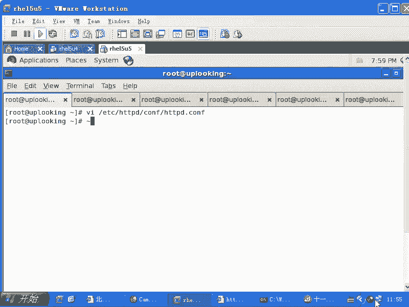

在本节课中，我们将要学习Apache HTTP服务器的核心配置文件，重点理解其多进程（prefork）和多线程（worker）两种运行模式，以及如何通过调整配置参数来优化服务器性能。

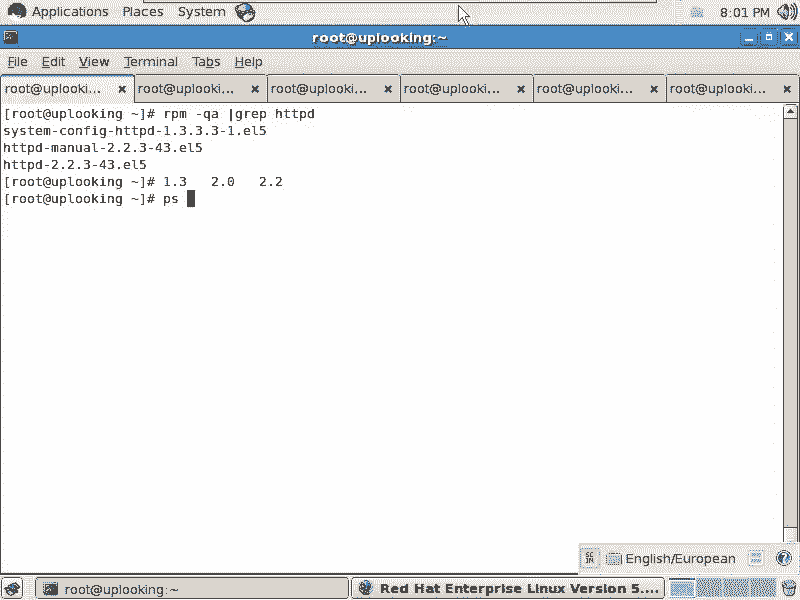

## Apache简介与版本演进

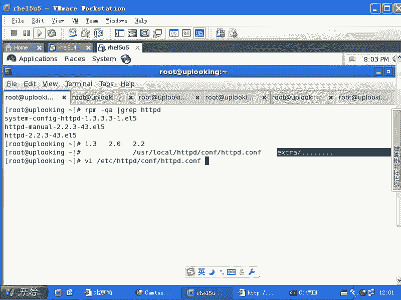

上一节我们介绍了Linux下的各种服务，本节中我们来看看老牌且强大的Web服务器——Apache HTTPD。尽管其市场地位受到Nginx的挑战，但Apache因其稳定性和丰富的功能，依然是许多大型公司的首选。

Apache的版本演进是一个重要话题。其主版本分为1.x系列（如1.3）和2.x系列（如2.0、2.2）。2.0版本相对于1.3版本是一个巨大的飞跃，官方甚至认为其改进程度足以命名为4.0或5.0。最重要的区别在于：
*   **Apache 1.3**：仅支持多进程模型。
*   **Apache 2.0+**：支持多进程和多线程混合模型。

这种架构差异直接影响了服务器的并发处理能力和内存使用效率。

## 理解HTTP协议与连接

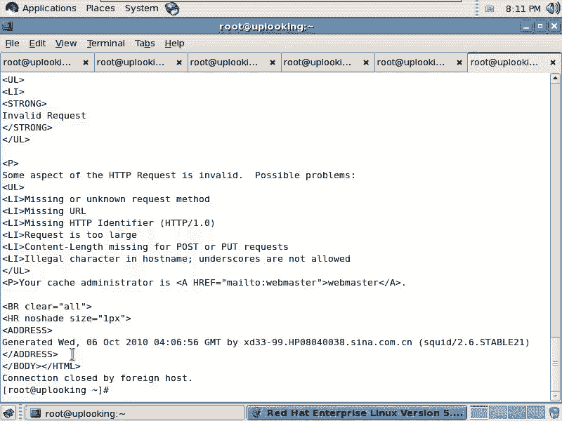

在深入配置之前，我们需要理解Apache作为HTTP服务器的基础。它遵循超文本传输协议（HTTP）。客户端（如浏览器）与服务器80端口的通信，本质上是发送特定的请求命令。

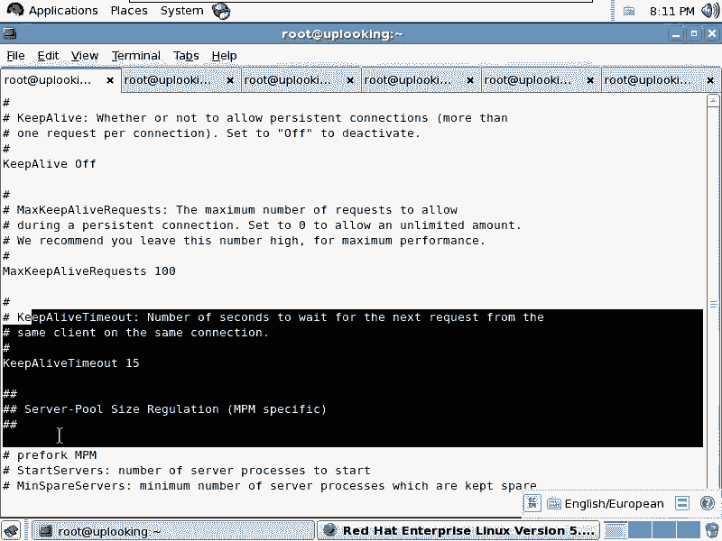

例如，使用`telnet`命令可以模拟一个原始的HTTP请求：
```bash
telnet 192.168.0.254 80
```
连接成功后，输入：
```
GET /index.html
```
服务器便会返回`/index.html`文件的内容。浏览器所做的，就是将用户的点击行为转化为类似的`GET`或`POST`请求，并解析服务器返回的HTML代码进行渲染。

理解了基础通信，我们来看Apache如何管理这些连接。在配置文件中，`KeepAlive`选项用于允许在一个TCP连接上发送多个请求，这可以减少建立新连接的开销，提升效率。

## 核心配置参数详解：prefork模式

Apache的主配置文件位于`/etc/httpd/conf/httpd.conf`。其结构大致分为三部分：全局服务器配置、主服务器（`<VirtualHost>`）配置和虚拟主机配置。我们首先关注影响性能的全局配置。

在`prefork`多进程模式下，Apache为每个客户端连接创建一个独立的子进程来处理。以下是与性能相关的关键参数：

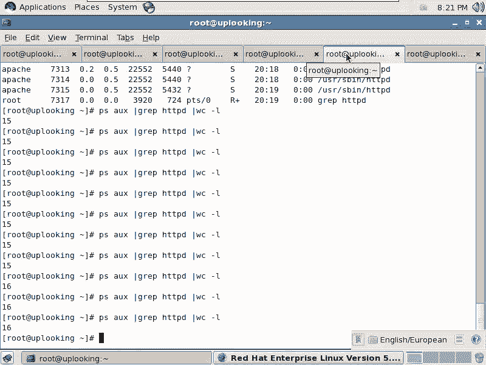

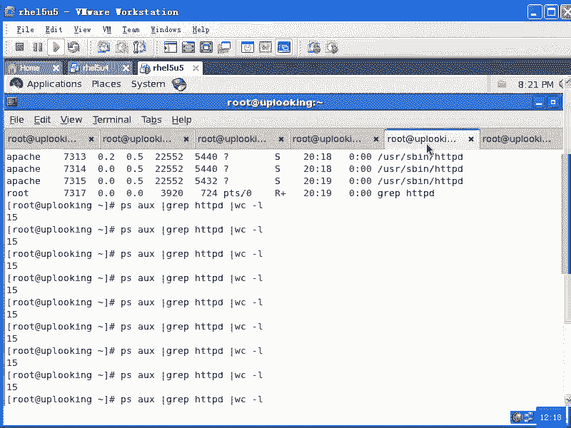

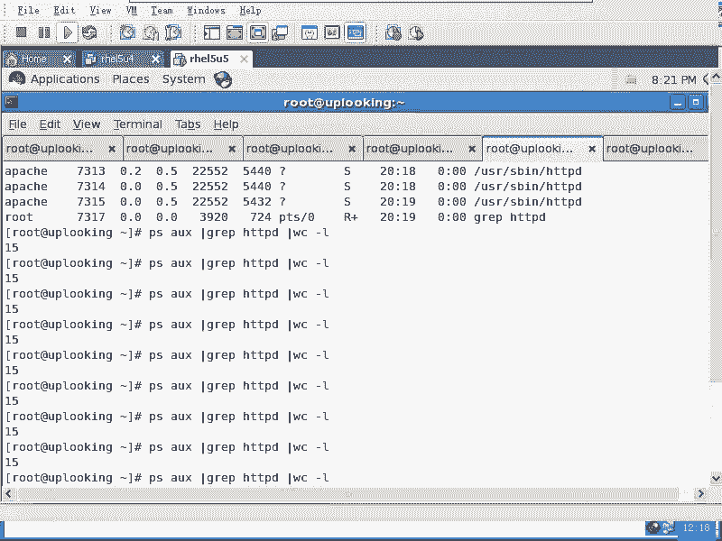

```
<IfModule prefork.c>
StartServers       8
MinSpareServers    5
MaxSpareServers   20
ServerLimit      256
MaxClients       256
MaxRequestsPerChild  4000
</IfModule>
```

以下是各参数含义：
*   **`StartServers`**：Apache启动时立即创建的闲置子进程数量。
*   **`MinSpareServers`**：最小空闲进程数。如果空闲进程少于这个值，Apache会快速创建新的子进程。
*   **`MaxSpareServers`**：最大空闲进程数。如果空闲进程多于这个值，Apache会结束多余的子进程。
*   **`ServerLimit`**：服务器生命周期内允许创建的最大进程数上限。
*   **`MaxClients`**：允许同时连接的最大客户端数量（即并发连接数）。这是最关键的性能参数之一，它不能超过`ServerLimit`的值。
*   **`MaxRequestsPerChild`**：每个子进程在其生命周期内处理的最大请求数。达到此值后，子进程将结束并释放可能的内存泄漏。设置为0表示无限（不推荐）。

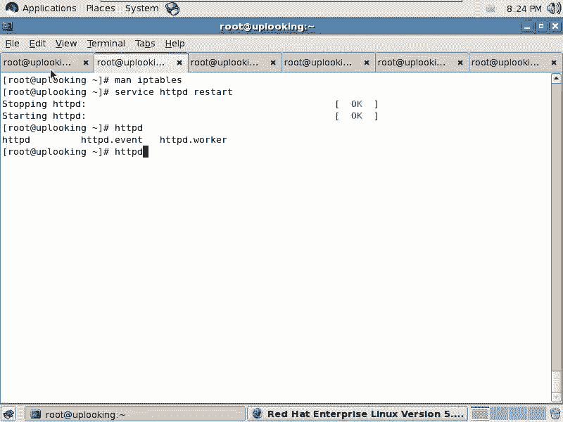

**默认配置的瓶颈**：默认`MaxClients`仅为256。对于高并发访问的网站，这会导致第257个访问者收到“服务器繁忙”的错误。因此，根据服务器硬件（特别是内存）调整`ServerLimit`和`MaxClients`至关重要。例如，可以将其设置为10000或更高，以支持更多并发用户。

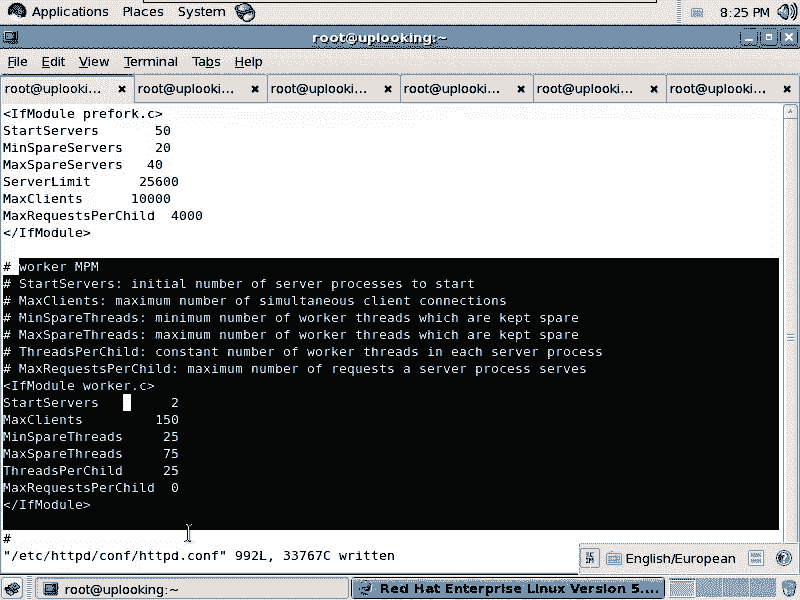

## 核心配置参数详解：worker模式

`worker`模式是Apache 2.x引入的混合多进程多线程模型。它使用多个进程（父进程管理子进程），每个子进程又包含多个线程。线程比进程更轻量，共享大部分内存空间，使得`worker`模式在同等资源下可以处理更多并发连接。

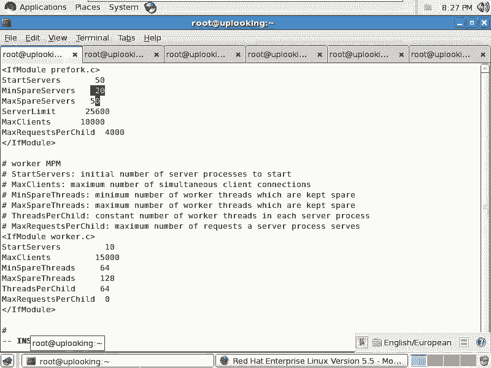

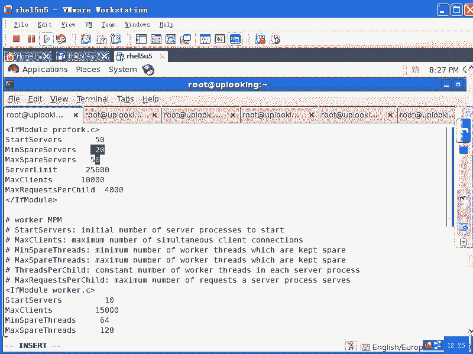

Red Hat的RPM包通常同时编译了`prefork`和`worker`两种模式的二进制文件。切换方式如下：
```bash
# 备份原来的httpd（prefork模式）
mv /usr/sbin/httpd /usr/sbin/httpd.prefork
# 将worker模式链接为默认httpd
ln -s /usr/sbin/httpd.worker /usr/sbin/httpd
# 重启Apache服务
service httpd restart
```

切换后，以下配置区块将生效：

```
<IfModule worker.c>
StartServers         2
MaxClients         150
MinSpareThreads     25
MaxSpareThreads     75
ThreadsPerChild     25
MaxRequestsPerChild  0
</IfModule>
```

以下是各参数含义：
*   **`StartServers`**：初始启动的子进程数量。
*   **`MaxClients`**：允许的最大并发客户端连接总数。计算公式为：`MaxClients = ThreadsPerChild * 进程数量`。
*   **`ThreadsPerChild`**：每个子进程固定创建的线程数。
*   **`MinSpareThreads`**：最小空闲线程总数。如果空闲线程少于这个值，Apache会创建新的进程。
*   **`MaxSpareThreads`**：最大空闲线程总数。如果空闲线程多于这个值，Apache会结束一些进程。
*   **`MaxRequestsPerChild`**：每个子进程处理的最大请求数。设置为0表示子进程永不结束（仅适用于线程化服务器）。

**配置示例**：若设置`StartServers=10`，`ThreadsPerChild=64`，则初始可处理`10 * 64 = 640`个并发连接。通过增加进程数来提升并发能力，而单个进程内的线程数固定。

## 进程与线程概念解析

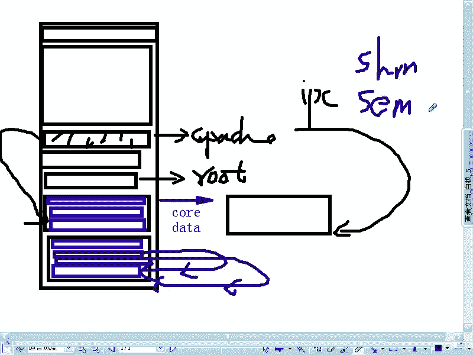

为了更好理解`prefork`和`worker`的区别，我们需要简单了解进程与线程。

*   **进程**：是操作系统资源分配的基本单位。每个进程拥有独立的地址空间、数据栈等。`prefork`模式为每个连接fork（复制）一个完整的子进程。进程间通信（IPC）复杂，但稳定性高，一个进程崩溃不会影响其他进程。
*   **线程**：是CPU调度的基本单位，属于同一个进程。它们共享进程的地址空间和大部分数据。`worker`模式中，一个进程内的多个线程可以同时处理多个连接。线程间通信简单高效，但一个线程崩溃可能导致整个进程（及其所有线程）终止。

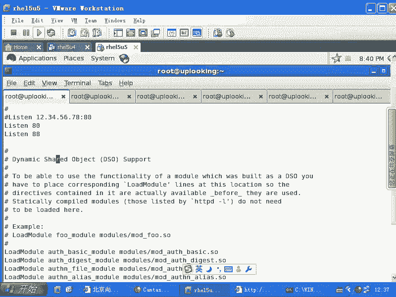


简言之，`prefork`稳定但资源消耗大；`worker`更高效、能支持更高并发，但对模块的线程安全性要求更高，稳定性稍逊。

## 配置文件其他关键部分

除了运行模式，配置文件中还有其他重要部分：

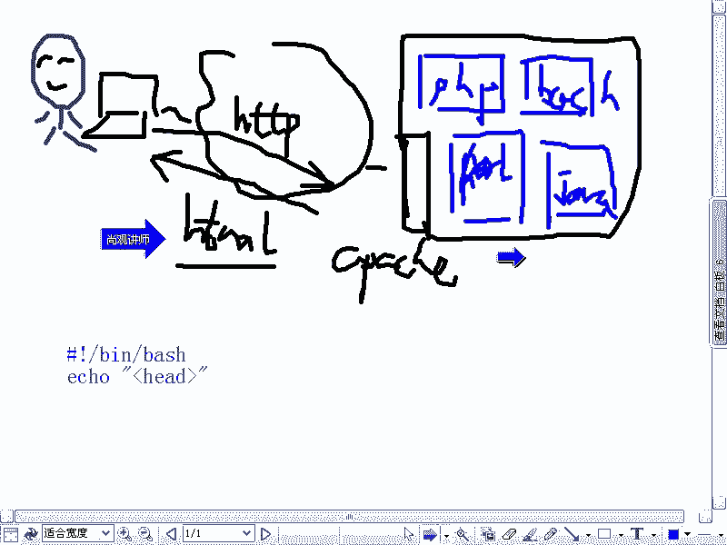


1.  **DSO模块加载**：Apache的强大功能通过模块化实现。配置文件中以`LoadModule`开头的行用于动态加载功能模块（`.so`文件），例如PHP模块（`mod_php.so`）、SSL加密模块（`mod_ssl.so`）等。不用的模块可以注释掉以节省内存。
2.  **监听端口**：`Listen`指令指定Apache监听的IP和端口，例如`Listen 80`。可以配置多行来监听多个端口。
3.  **主服务器配置**：`<VirtualHost>`区块外的配置是主服务器的默认配置，包括：
    *   `ServerAdmin`：管理员邮箱。
    *   `DocumentRoot`：网站文件的根目录，默认为`/var/www/html`。
    *   `<Directory>`区块：用于对特定目录设置访问权限、选项等。
    *   `ServerName`：主服务器的主机名（虚拟主机必须设置此项）。

主服务器的配置可以作为模板，被后续定义的虚拟主机继承或覆盖，从而实现一台物理服务器托管多个网站。

## 总结

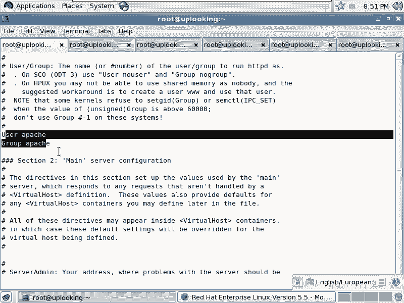

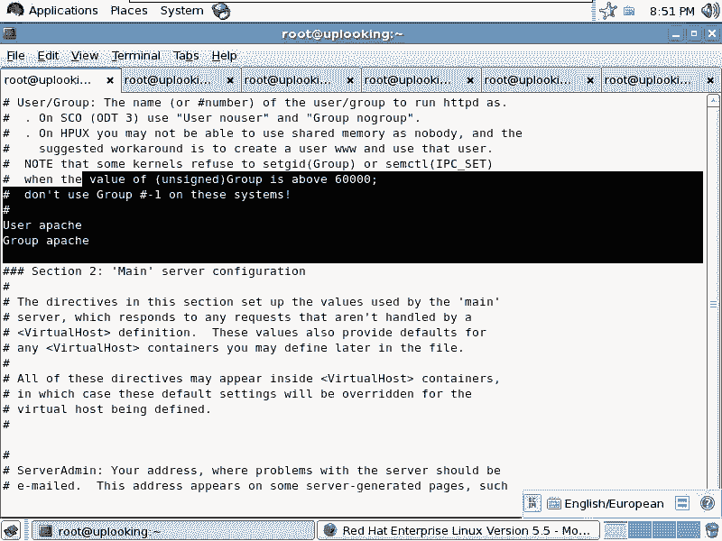

本节课中我们一起学习了Apache HTTP服务器的核心配置。我们首先回顾了Apache的版本发展，理解了HTTP协议的基本通信原理。然后，我们深入剖析了`prefork`和`worker`两种运行模式的配置参数及其对性能的影响，并解释了进程与线程的核心概念。最后，我们浏览了配置文件中加载模块、监听端口和主服务器设置等其他关键部分。

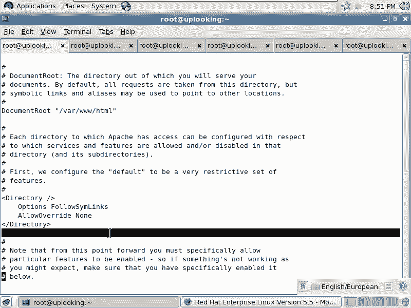

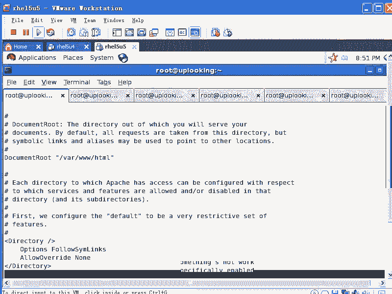

掌握这些配置项的含义和调整方法，是优化Apache服务器性能、使其能够稳定支撑高并发访问的基础。在后续课程中，我们将学习虚拟主机的配置以及更具体的访问控制设置。