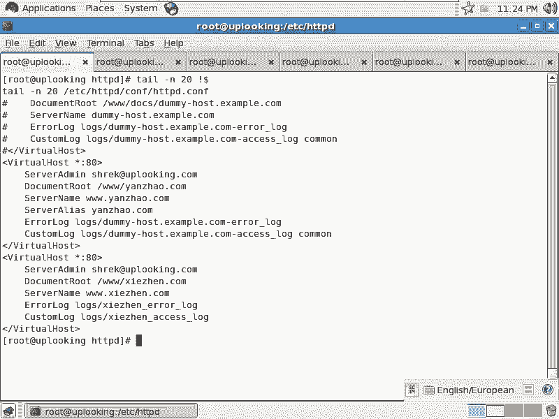

# 尚观Linux视频教程RHCE 精品课程 - P82：RH253-ULE116-8-3-httpd-vhost - 爱笑的程序狗 - BV1ax411o7VD

我们刚才的话把aparache的这个呃aparache的这个配置文件是吧，给大家讲一下aparache这个配置文件给大家讲一下。那现在的话呢问题是apartache配置文件就讲完了吗？

讲完了吗？还有一些东西啊，就是说比较重要的东西就是我们的这个虚拟主机了。虚拟主机实际上要是讲它的话，那我觉得是就是如果你有刚才的那个把那个主mans server是吧，这些东西搞清楚。

那虚拟主机简直就太简单了，是不是太简单了。因为一开始我觉得我自己学。

我自己学这个呃就是这个aparache的时候，我就搞不清楚哪个参数该放在哪个地方，哪个参数能拿到我们的虚拟主机当中来用，是不是？这是学这个appartache的一个非常大的问题。

你看一会儿这边多两个参数，那边多两个参数，好像这个参数又比较简单，哎，怎么。

这个东西到底放哪儿啊，就很很晕。所以这个时候我把我把刚才的那个呃东西给大家。

总结了一下以后，那你会发现，如果要是等一下我们配置我们的虚拟主机的时候，只需要在上面加上一个标签，在下面加个标签就齐活了。因为我们已经把虚拟主机里面这个典型的这些配置全都跟大家说过了，对不对？啊。

这就是我们要给大家就是马上介绍的这些内容内容啊。那虚拟主机的话呢，我们可以看系统当中已经给大家做的例子。这个实际上是reite给大家做的一啊。reite的话呢，大家把整个的这个文档翻到最下面去。

把这个文档的话翻到最下面去。你看这边alience啊是一些图标啊，还有一些什么。呃，字体啊什么这些东西啊。我们看翻到最下面去以后。最下面的7行我都记得住。我每次创建新主机的时候，我就这样。

移动到这个地方啊移动到这个地方，然后呢输入1个7YY就是复制期行。然后呢，我在这边的话呢，P连接哎。然后把这个注释翼取消。哎，起火搞定是吧？真在就完事儿了啊，就完事了。

但是这个上面的话呢还需要再加上一行，就是说你的这个name so呃namewa host啊，这个地方这个地方最上面就是在这个wat host的这启行之前啊，有一个这个地方的注释要给它取消掉。

这个地方表示什么呢？当我们访问我们的主机的时候，我们什么时候去启动我们的虚拟主机呢，就是访问我们的80端口。任何IP的80端口的时候，它就启动虚拟主机，是不是？所谓虚拟主机是什么呢？😊。

所以虚拟主机是什么？就是每当我们去访问这样的一个程序时，比方说我们用link是不是HTP然后加上一个杠杠3W点C呢点com，只要你一回车啊，只要你一回车。那你发出来的这个请求里面这个URL当中。

是不是就包含着这样一个头啊，3W这个头是不是？他的话呢，这个会原封不动的传到那边去。那假设说新浪和搜狐，他们都同样用我的一个什么用我的这个服务器，假方说我这个服务器是全世界超级服务器是吧？

超强抢到什么程度呢？就是你们全世界人来访问我随便怎么访问都没有问题。那这样的话他买了我的服务，买了我的服务以后，我这样的一个超级服务器里面给他分出一块空间来给另外一个人分出一块空间。

但是我的IP地址只有1个IP地址。😊，那怎么新浪和搜狐都解析到我这1个IP地址上去，对不对？😡，但是我这1个IP地址的话呢，监听了80端口。那我怎么区分哪个是访问希腊的，哪个是访问搜狐的。😡。

这边就是刚才我们这样一旦提交这个请求以后，我们提交那个包的最前面是不是有这样的一个主机名啊？他就可以根据这个主机名来分发哦，你虽然访问的也是我192168。0。254的什么80端口哦。

你是访问新浪的是吧？因为我看到你前面提交的请求里面有新浪，是不是我把你放在什么呢？新浪这个虚拟主机，你是访问搜狐的是吧？那你访问搜狐这是虚拟主机，清楚了没有？就这么简单。那么于是我们看一下啊。

假如说我现在的话呢有两个虚拟主机，我这样设置。😊，我7YY，然后呢再去P哎。然后呢再去什么7YY。然后再去粘贴，这样的话呢，我多了十4行出来，是不是我把前面的这个地方的话呢先设置一下。

就是内磨之 host星冒号80这个地方前面的注释取消掉，是不是就访问我所有的。😊，IP的80端口的时候都启用虚拟主机。那这个虚拟主机的名字叫什么呢？都是呃。😊，不管哪个IP的80端口啊。

下面也是跟上面一模一样。不管哪个IP的80端口。然后呢，我那我上下怎么样去区分呢？首先我上面这个主机的，当然这个weber的命你可以不用去添了是吧？添也没有关系，你可以说把sh at什么呢？😡。

Alook。点com这是联系管理员的email。假如说你网站有问题的话，你可以好心给什么这个人发个邮件，是不是？我就我就我就收到了这个邮邮件。他说哎你的机器被挂码了是不是有病毒是吧？病毒界面是什么。

我说啊，挂码了，我检赶检查一下所有的这个所有的代码，对不对？有过这样的企业啊，当然最后检查结果是什么？我们局网内有一个机器是吧？中ARP病毒是吧？他被挂码了，他把我们整个局网全都害掉了是吧？

我们只能去锁定什么那个网关的IP地址对不对？用ARP啊，这是扯远了。😊，document root。比方说我现在3W下面我创建一个文件夹啊，名叫什么呢？嗯。名叫3W下的。C了。算了，不要新了，叫什么？

艳照啊。艳照点com是吧？阴道啊。这个管理员还是我shack at uploadlook点com。那么这边的话呢，再去起个名字，比方说这个这个的话呢叫做不是验照了，是。呃。写真啊。开个玩笑开玩笑。

要不大家睡着了，你知道吗？然后呢，上面这个既然是艳照点com，那么我们假如说注册的域名叫做什么3W点艳照是吧？点com是不是？那么如果啊它有多个域名的话，那我们就这样的。sber是吧？😡，哎。

alience L是吧，alance然后呢，这个叫做什么呢？它还有个别名叫做什么艳照点com是不是？然后呢，下面这边的话呢是一个呃写真是吧？那我这边的话就是。3W点写真点com是不是？

如果他还有别的名的话，那你就添加什么呃，s。AS是吧，什么什么其他的啊。不搞得有意思点的话，大家就没没没心情去去学习了。那我这边给a log。

就是这个日这个网站的这个我可以给它添加一个独立的这样的一个日日志是吧？独立日志。那么我如果删除掉的话，它应该就是用主总的那个man man的那个air log了。那我这边的话，比方说叫做呃。😊。

写真的什么。L楼。logg是不是？然后呢，这边的话呢，我就可以再去就是比方说写真的什么呃。明白吧？写真的这个access log。那我当然了，我可以设置也可以不设置。我这两行实际上删除掉也没有关系。

删除掉的话，它就用总的了，默认的了，是不是？这样的话呢，我就做好了这个初步的操作。然后呢，我保存并退出，我做好了两个虚拟主机，对不对？然后呢，tailale杠N20。😊，三二十吧。20，然后呢这文件。

其实的话呢就最后这这几行的话呢生效，是不是？这就是新拟主机干。

做完了是不是？如果我想再去在虚拟主机里面添加A，就添加那个。呃，虚拟目录可不可以？我在虚拟主机当中添加虚拟目录，可不可以啊？没问题啊。我在虚拟主机当中，我去控制某一个目录，可读，还是说允许谁来访问。

不允许谁来访问啊，需不需要身份认证，可不可以啊？就是那个directory怎么怎么样配置是么，是不是都可以啊？😊，是不是？也就是说刚才我在那个目录下看的这些东西是不是都行？

刚才这个目录下的这些选项都可以放在什么？都可以放在虚拟主机里面。比方说我在设置这个虚拟主机的这个虚拟主机的根的时候，我是deny哪哪个，然后允许哪个，对不对？然后我可以设置什么呢？我的这个。啊。

哪个目录是进行什么身份认证的，是不是用哪个文件做身份身份认证，另外一个文件作为身身份认证，这都可以啊，太简单了。😊，还有的话呢，哪个文件的话允许访问，哪个云讯不不允许访问，然后做了几个什么alance。

做了几个scriptcr alien，这都可以。所以在那个文件里面的话呢，我们刚才做的是一个基本的是吧？这个虚拟数义基基本的那你当然以后的话还有什么rewrite规则啊等等，都可以去添加进去。😊。

ok我们现在回来。😊，好，这个东西搞清楚了以后，然后我们来实验一下吧。

我们来实验一下ss HTTVD是吧？restar，我把appartache的话呢去重启一下，重启一下。然后呢我去访问一下。我在这端的话呢，要开始做什么呢？做这个。ele啊，比方说A哎，不是A算了。

那么我们说艳照是吧，Y。这样看的东西啊，输出重定象到什么？我要先去makeDRR3W下面的什么呢？艳照是不是？然后makeDRR3W下的什么写真是吧？然后呢去icical。大家一看。

结果是我的写真集是吧？然后一下吐了就跑了。这样的话就三大陆当中的艳障啊。in desk点HTML是不是？然后呢，ecle写成X，是不是？然后呢，输出从定向到什么三大字当中的写真。

index点H3L对不对？这样做好了，做好了以后呢，我们这两个它的主文件的话都做好了。然后呢，我们。其实肯定还要做一步了，是不是CH。CON是不是杠大R加上一个什么杠T是不是是HHTTBD是吧？

下划线conent。是不是下方线T，然后呢把Y呃呃把3W的下面的艳照和3W当中的写真啊，两个的话呢全部都改一下，是不是大R的话呢就把它的子目度也改了。诶。🤧哎扯。少1个SYS啊。😊，这样呢。哎。

这样OK了是吧？刚才我就写错了啊。😊，这样我给它加了一个什么呢？这样的一个类型之后，也就是说让SElinux放行是吧？让SE知道哦，这个原来是什么apppartache要用的countent是吧。

是内容是吧？于是的话我这边做好了，然后我再去怎么样呢VIETCRhos host。然后我解析一下，在我的3W点呃呃，这个就是我把这几个域名号解析一下，3W点艳照是吧？点com和3W点写真啊点com。

希望这个视频的话不要流出去啊，然后被封杀，我被封杀就惨了，是吧？这属于三俗是吧？😊，开玩笑啊，然后在这边我们再看改完了以后，我在这边的话呢，域名也能解析了，就3W点艳照点com是不是一访问。Yeah。

碰杀了。哎。😮，咋整的呢？刚才这边失败了啊，fail了。错了。他说这个目录这两个目录不存在啊，然后我把我刚才重启的时候不存在。Custom log。Yeah。两个参数啊。

文件名cut log我没写对是吧？哦，后面的话还要有个参数，是不是？comcombin是不是combin是不是？这么快啊，就被封杀了，不可能吧，是不是？😡，哎。有没有这个地啊？就没有这个地是吧。

就这样的是吧？上面就是common啊，上面大家看这个日志格式是common，是不是？Yeah。😊，哦，认证点com。算了，我改一下啊，我刚才创建的文件夹是。把这个点com去掉啊。然后我再重启一下。

然后我们看艳照点com是吧，看能不能YYY一大堆东西出来，是不是一回车耶。不可以访问的。不会吧。哎，出来了，是不是？刚才的话可能有缓存了，然后接着是什么写真是吧？好，XXX是不是同1个主机。

同1个IP地址是吧，同一个梦想是吧？然后呢，两个手期开开玩笑，就是同同1个IP是吧？结果两个不一定的呃不一样的这个呃就是页面啊就出来了。这个新主金明白了吧？没有问题啊。😊，有没有问题啊？平方。

IP访问的话，这个问题问的好，就是当你设置了这个第一个主机以后啊，第一个虚拟主机以后。你的那个man server就访问不到了，因为你的man server是不是没有设置过那个ser name是吧？

它就默认访问第一个虚拟主机。你看。是不是第一个虚拟主机啊，艳照是吧？第一个虚拟主机也是第一个虚拟主机。😊，就是呃他怎么样呢？就是第一个虚拟主机就成了默认的第一个了。

因为你的man server并没有去定义什么ser name，并并没有定义什么。然后第一个虚拟主机就把那个取代掉了，清楚吧？就是你访问IP也就是说你侦测不到主机头的时候。

们访问的就是默认的第一个新主机啊，第一个群有有没有问题？没有是吧。有没有问题啊？那你可以再仔细看一下啊，再仔细看一下这个配置文件cat。退有。这配置文件就这么简单，前面再加上一条，是不是你么这？25吧。

熏主机的设置就这么简单。别还这么串。前面再加上一条。name mor host是不是namem host加这样一条。然后后面的话呢，把那个后面的那七行前面的注释取消掉，是不是？然后改成这个样子。

如果你有多个主题名化呢，s alien啊，s alien。明白吧，这样的话这个就OK了啊。😊，两个网站是不是同1个IP2个网站对吧？就是迅拟主机。是不是啊实际的物理主机是一个，是不是？

好，这边的话呢我们就给大家介绍在这个地方。

